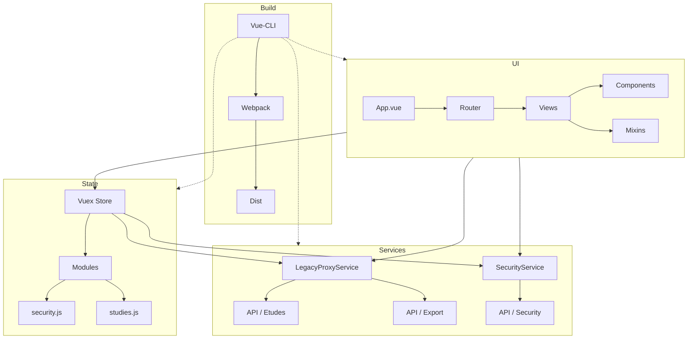

# Agile Front Project Documentation

[TOC]

---

## 📖 Vue d'ensemble <a id="agile-front-project-documentation"></a>

Le projet **Agile Front** est une application web Vue 2 + Vuetify destinée à la gestion d’études et de financements.  
Il s’appuie sur une architecture modulaire :

| Couche                | Technologie                     | Rôle principal                                    |
|-----------------------|----------------------------------|---------------------------------------------------|
| **UI**                | Vue 2, Vuetify                  | Interface utilisateur réactive                    |
| **Gestion d’état**    | Vuex                             | Centralisation du state (études, sécurité)       |
| **Services**          | Axios                            | Accès aux API back‑end (LegacyProxy, Security…)   |
| **Configuration**    | Babel, PostCSS, ESLint, Vue‑CLI   | Build, linting, transpilation                     |
| **Déploiement**       | Vue‑CLI (`vue.config.js`)         | Serveur de dev, assets statiques                   |

↩ [Retour au sommaire](#agile-front-project-documentation)

---

## 📂 Arborescence du dépôt <a id="arborescence-du-dépôt"></a>

```text
agile-front/
├─ .browserslistrc
├─ .env.sample
├─ .eslintrc.js
├─ .gitignore
├─ babel.config.js
├─ postcss.config.js
├─ README.md
├─ vue.config.js
├─ public/
│  └─ index.html
└─ src/
   ├─ App.vue
   ├─ main.js
   ├─ router.js
   ├─ components/
   │  ├─ ConfirmationDialog.vue
   │  ├─ EtudesExportPanel.vue
   │  ├─ EtudesList.vue
   │  └─ FinancementsList.vue
   ├─ mixins/
   │  └─ filterUtilMixin.js
   ├─ plugins/
   │  └─ vuetify.js
   ├─ services/
   │  ├─ ExportService.js
   │  ├─ LegacyProxyService.js
   │  ├─ SecurityService.js
   │  └─ StudiesService.js
   ├─ store/
   │  ├─ modules/
   │  │  ├─ security.js
   │  │  └─ studies.js
   │  └─ store.js
   └─ views/
      ├─ Assistance.vue
      ├─ Etude.vue
      ├─ EtudeEdit.vue
      ├─ EtudeNew.vue
      ├─ Home.vue
      ├─ Liens.vue
      ├─ Login.vue
      ├─ Statistiques.vue
      ├─ Tutoriels.vue
      └─ Videos.vue
```

↩ [Retour au sommaire](#agile-front-project-documentation)

---

## 🛠️ Build, lancement et configuration <a id="build‑lancement‑configuration"></a>

| Action                               | Commande (via Yarn)                 | Description                                    |
|--------------------------------------|-------------------------------------|------------------------------------------------|
| Installation des dépendances         | `yarn install`                     | Installe toutes les dépendances définies dans `package.json` |
| Lancement du serveur de développement| `yarn serve`                        | Démarre le hot‑reload sur `http://localhost:8080/` |
| Construction de la version de prod    | `yarn build`                       | Génère les assets dans `dist/`                 |
| Linting                              | `yarn lint` *(si configuré)*        | Vérifie la conformité du code avec ESLint       |

**Fichiers de configuration clés**

| Fichier                | Rôle                                                                 |
|------------------------|----------------------------------------------------------------------|
| `.browserslistrc`      | Ciblage des navigateurs ("> 1%", "last 2 versions")                 |
| `.eslintrc.js`         | Règles ESLint (Vue essential, Prettier)                             |
| `babel.config.js`      | Preset Vue (`@vue/app`) pour transpilation                           |
| `postcss.config.js`    | Plugin `autoprefixer` pour gestion des préfixes CSS                   |
| `vue.config.js`        | `publicPath`, transpile Vuetify, dev‑server (host = 0.0.0.0, hot = true) |

↩ [Retour au sommaire](#agile-front-project-documentation)

---

## 🧩 Composants majeurs <a id="composants-majeurs"></a>

### 1. Composants UI (`src/components/`)

| Composant                | Fonction principale                                          |
|--------------------------|--------------------------------------------------------------|
| `ConfirmationDialog.vue` | Boîte de dialogue réutilisable pour les confirmations       |
| `EtudesExportPanel.vue`  | Interface d’export des études (PDF/CSV)                       |
| `EtudesList.vue`         | Liste paginée d’études avec filtres                          |
| `FinancementsList.vue`   | Affichage des financements associés aux études                |

### 2. Mixins

| Mixin               | Usage                                              |
|---------------------|----------------------------------------------------|
| `filterUtilMixin.js`| Gestion des filtres d’année et comptage des filtres actifs (utilisé par les listes d’études) |

### 3. Plugins

| Plugin               | Description                                           |
|----------------------|-------------------------------------------------------|
| `vuetify.js`         | Initialise Vuetify avec thème personnalisé (primary = `#202328`, secondary = `#4874b8`) |

### 4. Services (`src/services/`)

| Service                | API exposée                         | Exemple d’appel |
|------------------------|-------------------------------------|-----------------|
| `LegacyProxyService.js`| CRUD études (legacy)                | `LegacyProxyService.getStudy(id)` |
| `SecurityService.js`   | Authentification / info sujet       | `SecurityService.getSubject()` |
| `ExportService.js`      | Export de données (non montré)       | — |
| `StudiesService.js`     | Gestion des études (non montré)     | — |

### 5. Store Vuex (`src/store/`)

#### Modules

| Module      | State clé | Mutations / Actions               | Getters utiles |
|-------------|-----------|-----------------------------------|----------------|
| `security`  | `subject` | `SET_SUBJECT`, `fetchSubject`     | `isConnected`, `isAdmin` |
| `studies`  | (défini dans `studies.js`) | (non affiché) | — |

#### Store global

| State global               | Description |
|----------------------------|-------------|
| `categories` (array)       | Types de catégories supportées (sustainability, nature, …) |
| `financements` (array)    | Placeholder (`["z"]`) |

↩ [Retour au sommaire](#agile-front-project-documentation)

---

## 📺 Vues (pages) <a id="vues-pages"></a>

| Vue                 | Rôle principal                                                   |
|---------------------|------------------------------------------------------------------|
| `Home.vue`          | Tableau de bord d’accueil                                         |
| `Login.vue`         | Formulaire d’authentification (username + password)               |
| `Etude.vue`         | Détail d’une étude                                               |
| `EtudeNew.vue`      | Création d’une nouvelle étude                                     |
| `EtudeEdit.vue`    | Modification d’une étude existante                                |
| `Tutoriels.vue`     | Liens vers des vidéos tutorielles (ex. fonction export)           |
| `Videos.vue`        | Bibliothèque de vidéos (non détaillé)                             |
| `Statistiques.vue` | Visualisation de métriques (non détaillé)                         |
| `Assistance.vue`    | Page d’aide / support                                            |
| `Liens.vue`         | Collection de liens externes                                      |

↩ [Retour au sommaire](#agile-front-project-documentation)

---

## 🔐 Modèle de sécurité <a id="modèle-de-sécurité"></a>

Le module `security` du store maintient l’objet `subject`, récupéré via `SecurityService.getSubject()`.  
Les getters permettent d’évaluer rapidement le statut de l’utilisateur :

```javascript
// src/store/modules/security.js (extrait)
export const getters = {
  isConnected: state => "email" in state.subject,
  isAdmin: state => "admin" in state.subject
};
```

Le composant `Login.vue` ne communique pas directement avec le service ; il se contente de collecter les identifiants. L’authentification réelle est gérée côté back‑end (via le `LegacyProxyService` ou un endpoint dédié).  

↩ [Retour au sommaire](#agile-front-project-documentation)

---

## 🏗️ Diagramme d’architecture <a id="diagramme-d-architecture"></a>



↩ [Retour au sommaire](#agile-front-project-documentation)

---

## 📦 Déploiement et assets statiques <a id="déploiement-et-assets-statiques"></a>

* Le fichier `public/index.html` charge les polices Google Roboto et le set d’icônes Material Design.
* Le `public` folder est copié tel‑quel dans le répertoire de distribution (`dist/`) lors du `yarn build`.
* Le serveur de production doit servir le dossier `dist/` avec le `publicPath` configuré à `/` (voir `vue.config.js`).

```javascript
// vue.config.js (extrait)
module.exports = {
  publicPath: "/",
  transpileDependencies: ["vuetify"],
  devServer: {
    host: "0.0.0.0",
    hot: true,
    disableHostCheck: true
  }
};
```

↩ [Retour au sommaire](#agile-front-project-documentation)

---

## 📜 Licence et contributions <a id="licence-et-contributions"></a>

Le projet ne contient pas de fichier `LICENSE`.  
Toute contribution doit suivre les règles définies dans `.gitignore` et `.eslintrc.js` (linting, formatage).  

↩ [Retour au sommaire](#agile-front-project-documentation)

---