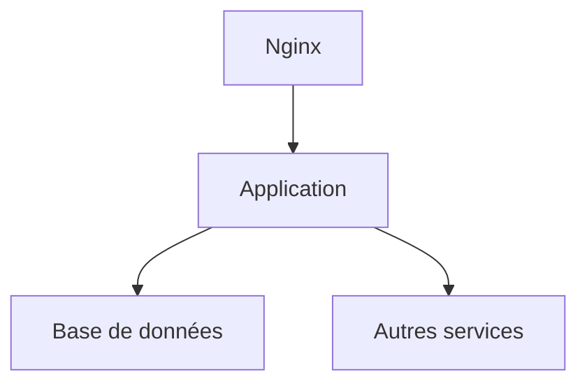

# 📘 Dossier d’Architecture Technique (DAT) – **agile‑infra**

[TOC]

---  

## 1️⃣ Introduction et objectifs  

**Vue d’ensemble fonctionnelle**  
`agile‑infra` est un ensemble d’automatisations (GitLab CI + Ansible + Docker‑Compose) qui déploie les services d’une application métier sur des environnements cloud interne (ECO4/OpenStack). Le pipeline prend en charge :

* la génération du `docker‑compose.yml` à partir de templates Jinja2,  
* le provisionnement des répertoires et secrets,  
* le lancement des conteneurs Docker,  
* la configuration du reverse‑proxy Nginx.  

### 1.1 Diagramme C4 – Niveau 1 (System Context)  

```mermaid
graph TD
    %% Actors;
    Dev[Développeurs] -->|Push / Merge Request| CI[GitLab CI/CD]
    Ops[Équipe Ops / SRE] -->|Supervision & Gestion| CI;
    Sec[RSSI] -->|Politiques de sécurité| CI;
    %% System;
    CI -->|déclenche| Infra[agile‑infra (pipeline)]
    Infra -->|déploie| Env[Environnements (dev, recette, prod)]
    Env -->|expose| App[Application métier]
    App -->|accès HTTP| Users[Utilisateurs finaux]

    classDef actor fill:#f9f,stroke:#333,stroke-width_1px;
    class Dev,Ops,Sec actor;
```

### 1.2 Objectifs de qualité orientés utilisateur  

| # | Objectif | Raison métier |
|---|----------|---------------|
| 1 | **Performance** – le temps de mise à jour d’un environnement ne doit pas excéder 5 min. | Accélérer les itérations fonctionnelles. |
| 2 | **Sécurité** – chiffrement des secrets, authentification forte du pipeline. | Respecter les exigences D‑I‑C‑T. |
| 3 | **Maintenabilité** – code Ansible et templates clairement versionnés, documentation à jour. | Réduire le coût de la dette technique. |
| 4 | **Traçabilité** – chaque déploiement doit être historisé dans GitLab et le SI de supervision. | Faciliter les audits et le retour d’incident. |
| 5 | **Scalabilité** – l’infrastructure doit pouvoir accueillir jusqu’à 3 × la charge actuelle sans refonte majeure. | Anticiper la croissance du produit. |

↩︎ [Retour au sommaire](#toc)  

---  

## 2️⃣ Parties prenantes  

| Rôle | Attente principale |
|------|---------------------|
| **MOA (Maîtrise d’Ouvrage)** | Livraison rapide des nouvelles versions fonctionnelles. |
| **Développeurs** | CI/CD fiable, visibilité sur l’état des déploiements. |
| **Équipe Ops / SRE** | Gestion simplifiée des environnements, logs centralisés. |
| **RSSI** | Conformité aux exigences de sécurité (D‑I‑C‑T). |
| **Responsable Qualité** | Métriques de stabilité et de performance mesurables. |
| **Support client** | Accès à un environnement de recette stable pour les démonstrations. |

> **Contacts** – Aucun contact explicite fourni dans les sources. Ajoutez les coordonnées dès qu’elles seront disponibles.

↩︎ [Retour au sommaire](#toc)  

---  

## 3️⃣ Contraintes  

### 3.1 Contraintes techniques  

| Type | Description |
|------|-------------|
| **Stack** | Ansible ≥ 2.9, Docker ≥ 20, Docker‑Compose ≥ 2, GitLab Runner (container). |
| **Infrastructure** | Hébergement sur le cloud interne **ECO4** (OpenStack). |
| **Gestion des secrets** | Fichier `secrets.yml` chiffré, déchiffrement via variables CI `SECRET_KEY` / `DECRYPT_PASSWORD`. |
| **Compatibilité** | Les conteneurs doivent tourner sur des hôtes Linux (Ubuntu 22.04 recommandé). |
| **Versionning** | Tous les artefacts (playbooks, templates) versionnés dans le dépôt Git. |

### 3.2 Contraintes organisationnelles  

* Le pipeline ne doit être déclenché que sur des changements dans le répertoire `recette/**`.  
* Les environnements de test (`recette`) sont isolés du réseau de production.  
* Les livraisons en production nécessitent une approbation manuelle via GitLab → “protected environment”.  

### 3.3 Contraintes réglementaires  

| Domaine | Exigence |
|---------|----------|
| **RGPD / CNIL** | Aucun traitement de données personnelles dans le pipeline. |
| **D‑I‑C‑T** |  |
| • Disponibilité | Le service doit être disponible ≥ 99,5 % en production. |
| • Intégrité | Les artefacts sont signés SHA‑256 dans le dépôt. |
| • Confidentialité | Secrets chiffrés, accès CI limité aux comptes de service. |
| • Traçabilité | Historique complet dans GitLab + logs Prometheus. |

↩︎ [Retour au sommaire](#toc)  

---  

## 4️⃣ Contexte et périmètre  

### 4.1 Partenaires fonctionnels  

| Partenaire | Nature de l’interaction |
|------------|--------------------------|
| **Application métier** | Consommateur des services déployés (API, UI). |
| **Système de supervision GTI** | Collecte métriques, alertes, logs. |
| **Plateforme de stockage d’objets** | Destination des sauvegardes (B3, Outscale, GCP). |
| **Reverse‑proxy Nginx** | Point d’entrée HTTP(s) unique. |

### 4.2 Interfaces techniques  

| Interface | Protocole | Fréquence / Mode | Type de données |
|-----------|-----------|------------------|-----------------|
| GitLab → Runner | HTTPS (Docker API) | À chaque pipeline | Artefacts de build, variables CI |
| Runner → Ansible | Local exec (container) | Instantané | Playbooks YAML |
| Ansible → Hôte cible | SSH (port 22) | Par tâche | Commands, fichiers |
| Docker‑Compose → Conteneurs | Docker API (Unix socket) | Au déploiement | `docker-compose.yml` |
| Nginx ↔ Clients | HTTP/HTTPS | En continu | Requêtes REST/HTML |
| Supervision ↔ Services | Prometheus (scrape) / Loki (logs) | Périodique | Métriques, logs |

↩︎ [Retour au sommaire](#toc)  

---  

## 5️⃣ Stratégie de solution  

### 5.1 Décisions architecturales majeures  

| Décision | Raison |
|----------|--------|
| **Pipeline GitLab + Ansible** | Séparation claire du CI (build) et du CD (provisionnement). |
| **Docker‑Compose comme orchestrateur** | Simplicité pour les petits environnements, pas besoin de Kubernetes. |
| **Templates Jinja2** | Centralisation de la génération du compose file, versionning facile. |
| **Reverse‑proxy Nginx en HA** | Haute disponibilité, répartition de charge. |
| **Secrets chiffrés via CI variables** | Conformité aux exigences de confidentialité. |

### 5.2 Environnement technologique  

| Couche | Technologie |
|--------|--------------|
| **CI** | GitLab Runner (image `pasta-cooker-client:v1.0.6`). |
| **IaC** | Ansible 2.9+, playbooks situés sous `recette/`. |
| **Conteneurs** | Docker 20+, Docker‑Compose 2+. |
| **Frontend** | Aucun (infra‑only). |
| **Base de données** | PostgreSQL 11.16‑alpine (déployé via compose). |
| **Reverse‑proxy** | Nginx 1.24 (load‑balanced pair). |
| **Monitoring** | Prometheus + Grafana + Loki + AlertManager (GTI). |
| **Sauvegarde** | Scripts GTI → dumps AES‑256, stockage B3/Outscale/GCP. |

### 5.3 Outils de la forge logicielle  

| Outil | Usage |
|-------|-------|
| **GitLab** | Gestion du code source, CI/CD, contrôle d’accès. |
| **Docker Hub (registry privé)** | Stockage des images Docker. |
| **Ansible Galaxy** | Rôle partagé (ex. `docker_compose`). |
| **Portainer** | Gestion visuelle des conteneurs (supervision). |
| **SAST/DAST** (GitLab) | Analyse de sécurité du code. |
| **Helm** | Non utilisé (hors périmètre). |

↩︎ [Retour au sommaire](#toc)  

---  

## 6️⃣ Vue en Briques (C4 – Niveau 2)  

### 6.1 Diagramme C4 – Conteneur  

```mermaid
graph TD
    subgraph CI[GitLab CI/CD]
        CI_Runner[GitLab Runner] -->|exécute| Ansible[Ansible Playbooks]
    end
    subgraph Deploy[Environnement cible]
        Nginx[Nginx (load‑balanced)]
        DB[PostgreSQL]
        AppSrv[Conteneurs d’application (front, back)]
    end
    Ansible -->|génère| Compose[docker‑compose.yml]
    Compose -->|déploie| Nginx;
    Compose -->|déploie| DB;
    Compose -->|déploie| AppSrv;
    classDef container fill:#eef,stroke:#333,stroke-width_1px;
    class CI_Runner,Ansible,Compose,Nginx,DB,AppSrv container;
```

### 6.2 Description des conteneurs principaux  

| Conteneur | Rôle | Principaux services |
|----------|------|--------------------|
| **Nginx** | Reverse‑proxy HA | TLS termination, routage vers `front` et `back`. |
| **PostgreSQL** | Base de données | Persistance des données métier. |
| **Front** | UI statique (ou serveur web) | Expose les pages de l’application. |
| **Back** | API métier (Python/Node…) | Traitement logique, accès DB. |
| **Docker‑Compose** | Orchestrateur | Définit les réseaux, volumes, dépendances. |
| **Ansible Runner** | Provisionneur | Applique les playbooks, gère secrets. |

↩︎ [Retour au sommaire](#toc)  

---  

## 7️⃣ Vue Exécution  

### 7.1 Scénario critique : Déploiement en **recette**  

```mermaid
sequencediagram;
    participant Dev as Développeur;
    participant Git as GitLab;
    participant CI as GitLab CI;
    participant Ansi as Ansible Runner;
    participant Host as Hôte cible (recette)
    participant Nginx as Nginx;
    participant DB as PostgreSQL;
    participant App as Conteneurs App;
    Dev->>Git: Push branche feature → .gitlab-ci.yml;
    Git->>CI: Trigger pipeline (run_recette)
    CI->>Ansi: pasta‑cooker $PLAYBOOK ... (variables CI)
    Ansi->>Host: SSH (playbook recette/main.yml)
    Host->>Host: crée répertoire, charge secrets/versions;
    Host->>Host: rend le template docker‑compose.yml.j2;
    Host->>Host: docker compose up -d;
    Host->>Nginx: Nginx démarre, écoute;
    Host->>DB: PostgreSQL démarre;
    Host->>App: Back & Front lancés;
    CI-->>Git: Résultat (succès / échec) + artefacts;
    Note right of CI: Rapport de logs dans GitLab<br/>Supervision GTI alerte en cas d’échec
```

### 7.2 Scénario de **rollback** (déploiement en cas d’échec)  

1. Le pipeline détecte un retour d’erreur (`docker compose up` échoue).  
2. GitLab crée automatiquement un **job** `rollback` qui exécute `docker compose down` puis restaure le `docker-compose.yml` précédent depuis le dépôt.  
3. Un ticket incident est ouvert et notifié au SRE.  

↩︎ [Retour au sommaire](#toc)  

---  

## 8️⃣ Vue Déploiement *(section standardisée)*  

### Environnements
| Environnement | Hébergement | Serveurs | Réseau | Particularités |
|---------------|-------------|----------|--------|----------------|
| Développement | À compléter | À compléter | À compléter | À compléter |
| Recette | À compléter | À compléter | À compléter | À compléter |
| Production | À compléter | À compléter | À compléter | À compléter |

### Infrastructure  
Le produit est hébergé sur le cloud interne **ECO4** basé sur **Openstack**, dans le tenant `pnm3` du département.  
Le reverse‑proxy **Nginx** du schéma ci‑dessous est en fait une paire de Nginx load‑balancés en frontal des produits hébergés sur le tenant.



### Supervision  
Le produit est supervisé via le système standard du GTI pour ce faire :  

- via **Portainer** pour la partie purement conteneurisée,  
- via la stack **Prometheus/Grafana/Loki/AlertManager**,  
- Le produit dispose également d’une supervision **PSIN**.

### Sauvegardes  
Les sauvegardes de la base de données sont assurées par des scripts standards du GTI permettant la création de dumps cryptés en **AES‑256** et déposés sur :  

- le stockage objet **B3** du IaaS ministériel,  
- le stockage objet **Outscale SecNumCloud** (via la prestation qu’a le GTI sur le marché “Nuage Public”),  
- le stockage objet **standard de Google Cloud** (via la prestation qu’a le GTI sur le marché “Nuage Public”).

↩︎ [Retour au sommaire](#toc)  

---  

## 9️⃣ Sujets transverses  

| Sujet | Traitement dans `agile‑infra` |
|-------|--------------------------------|
| **Authentification** | Accès au runner via token GitLab + SSH keys gérées par le CI. |
| **Journalisation** | Logs Ansible → GitLab job logs ; Docker logs → Loki. |
| **Monitoring** | Métriques exposées par les conteneurs (`/metrics`) scrappées par Prometheus. |
| **Gestion des erreurs** | `failed_when` dans les tâches Ansible ; `on_failure: continue` pour rollback. |
| **API** | Aucun endpoint interne ; le pipeline expose les artefacts via l’API GitLab. |
| **Sécurité des conteneurs** | Images officielles, mises à jour régulières, scan Trivy intégré au pipeline. |
| **Gestion de configuration** | Variables d’environnement CI, fichiers `secrets.yml` chiffrés, `versions.yml` versionnées. |
| **Documentation** | Ce DAT, README du dépôt, commentaires Ansible. |

↩︎ [Retour au sommaire](#toc)  

---  

## 🔟 Exigences de qualité  

| Exigence | Critère d’acceptation | Scénario de validation |
|----------|----------------------|------------------------|
| **Performance** | Temps total de déploiement ≤ 5 min (recette). | Mesurer la durée du job `run_recette` dans GitLab CI. |
| **Sécurité** | Secrets jamais stockés en clair dans le dépôt. | Vérifier l’absence de chaînes `password` dans le repo (`git grep`). |
| **Disponibilité** | Service Nginx disponible 99,5 % en prod. | Simuler une charge avec `hey` et vérifier les codes 200 via Prometheus. |
| **Traçabilité** | Chaque déploiement possède un ID unique et un lien vers le commit. | Vérifier le champ `environment_url` et les tags GitLab. |
| **Scalabilité** | Le cluster supporte 3× la charge actuelle sans modification du compose. | Exécuter un test de charge (k6) et observer les métriques CPU/Memory. |

↩︎ [Retour au sommaire](#toc)  

---  

## 1️⃣1️⃣ Risques et dettes techniques  

| Risque / Dette | Impact | Mitigation / Action corrective |
|----------------|--------|---------------------------------|
| **Dépendance à Docker‑Compose** (pas de Kubernetes) | Limite la scalabilité horizontale. | Étudier une migration progressive vers **Docker Swarm** ou **K8s** (pilotage via Helm). |
| **Secrets gérés via variables CI uniquement** | Risque de fuite si les variables sont exposées. | Activer le **Vault** interne du GTI, rotation périodique des clés. |
| **Playbook Ansible monolithique** | Difficulté de réutilisation et de test unitaire. | Refactoriser en rôles Ansible distincts (ex. `docker_compose`, `nginx_config`). |
| **Absence de tests d’intégration automatisés** | Déploiements non vérifiés fonctionnellement. | Ajouter un job `smoke_test` post‑déploiement (curl health‑check). |
| **Documentation limitée** | Perte de connaissances lors du turnover. | Maintenir le DAT à jour, générer un **README** à partir du DAT (auto‑generation). |

↩︎ [Retour au sommaire](#toc)  

---  

## 1️⃣2️⃣ Annexes  

### Glossaire  

| Terme | Définition |
|-------|------------|
| **CI** | Continuous Integration – compilation et tests automatiques. |
| **CD** | Continuous Delivery/Deployment – mise en production automatisée. |
| **IaC** | Infrastructure as Code – gestion de l’infrastructure via du code (Ansible). |
| **D‑I‑C‑T** | Disponibilité, Intégrité, Confidentialité, Traçabilité – exigences de sécurité. |
| **GTI** | Groupe Technique d’Infrastructure – équipe responsable de la supervision. |
| **Nginx load‑balanced pair** | Deux instances Nginx en haute disponibilité via VRRP ou équivalent. |

### Décisions d’Architecture (ADR) – exemples  

| ADR # | Décision | Statut | Raison |
|-------|----------|--------|--------|
| ADR‑001 | Utiliser **GitLab CI + Ansible** comme chaîne de déploiement | Acceptée | Séparation claire des responsabilités, intégration native avec le dépôt. |
| ADR‑002 | Choisir **Docker‑Compose** plutôt que Kubernetes pour le premier MVP | Acceptée | Simplicité, vitesse de mise en œuvre, coûts maîtrisés. |
| ADR‑003 | Chiffrer les secrets via **AES‑256** et variables CI | Acceptée | Conformité aux exigences de confidentialité. |
| ADR‑004 | Mettre en place **Prometheus + Grafana** pour le monitoring | Acceptée | Standard GTI, visibilité temps réel. |

---  

*Document généré automatiquement à partir des sources du projet **agile‑infra**.*  

↩︎ [Retour au sommaire](#toc)  