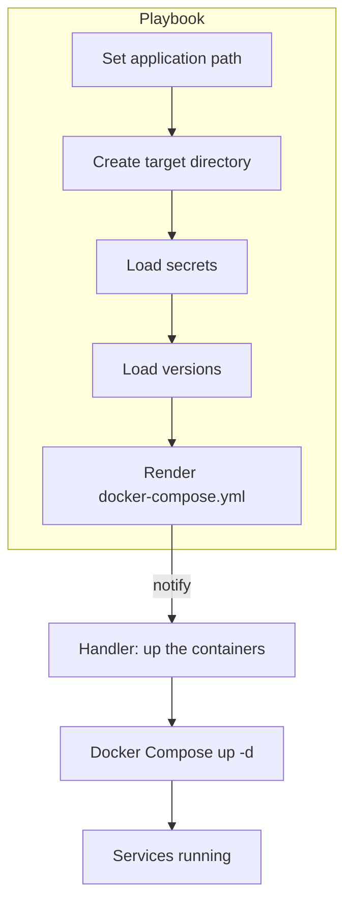

# Agile Infra Documentation

[TOC]

↩ [Retour au sommaire](#agile-infra-documentation)

---  

## 1. Présentation du projet  

Le projet **Agile Infra** regroupe l’ensemble des scripts d’infrastructure nécessaires au déploiement de l’application *Agile* dans l’environnement de recette.  
Il s’appuie sur :

| Élément | Rôle |
|---|---|
| **GitLab CI** | Orchestration du pipeline de build et de déploiement |
| **Ansible** | Provisionnement des conteneurs Docker via un playbook |
| **Docker Compose** | Description des services applicatifs (front, back, base de données) |
| **Pasta‑Cooker** | Client propriétaire utilisé pour déclencher l’exécution du playbook depuis le pipeline |

↩ [Retour au sommaire](#agile-infra-documentation)

---  

## 2. Structure du dépôt  

```text
agile-infra/
├─ .gitlab-ci.yml                # Pipeline CI/CD
└─ recette/
   ├─ .trigger                   # Fichier déclencheur de pipeline
   ├─ handlers/
   │  └─ main.yml                # Handler « up the containers » (docker‑compose up)
   ├─ templates/
   │  └─ docker-compose.yml.j2   # Template Jinja2 du docker‑compose
   ├─ vars/
   │  ├─ secrets.yml             # Secrets (non affichés ici)
   │  └─ versions.yml            # Versions des images Docker
   └─ main.yml                   # Playbook Ansible principal
```

↩ [Retour au sommaire](#agile-infra-documentation)

---  

## 3. Pipeline CI/CD  

Le fichier `.gitlab-ci.yml` définit un pipeline à un seul stade : **run_recette**.  

```yaml
stages:
  - run_recette

image:
  name: europe-west9-docker.pkg.dev/dpnm3-lab/public/pasta-cooker-client:v1.0.6
  entrypoint: [""]

variables:
  CD_URL: ws://cooker.pnm3.r2.eco4.cloud.e2.rie.gouv.fr
  PROJECT: /snum/pnm3/produits/doc/agile/agile-infra

run_recette:
  variables:
    PLAYBOOK: recette/main.yml
  stage: run_recette
  script:
    - pasta-cooker $PLAYBOOK --project $PROJECT --url $CD_URL --secretKey $SECRET_KEY --decryptPassword $DECRYPT_PASSWORD
  rules:
    - changes:
      - recette/**/*
  environment:
    name: recette
    url: http://agile.rec.pnm3.eco4.cloud.e2.rie.gouv.fr
```

### 3.1 Fonctionnement  

1. **Déclenchement** – Le pipeline s’exécute dès qu’un fichier du répertoire `recette/` change.  
2. **Image Docker** – Utilise le client `pasta-cooker-client` (v1.0.6).  
3. **Variables d’environnement** – `CD_URL` (endpoint du cooker), `PROJECT` (chemin du projet).  
4. **Exécution** – `pasta-cooker` reçoit le playbook Ansible (`recette/main.yml`) ainsi que les secrets (`SECRET_KEY`, `DECRYPT_PASSWORD`).  
5. **Déploiement** – Le client orchestre le provisionnement sur l’environnement nommé **recette**.

↩ [Retour au sommaire](#agile-infra-documentation)

---  

## 4. Playbook Ansible de déploiement  

Le playbook `recette/main.yml` décrit le processus complet de mise en place de l’application dans le répertoire cible.

```yaml
- hosts: agile_prod
  vars:
    dry_run: true
    real_path: /opt/app/
    dry_run_path: /opt/app-dry-run/
  tasks:
    - name: set application path
      set_fact:
        app_path: "{{ real_path if not dry_run else dry_run_path }}"

    - name: ensure folder exists
      file:
        path: "{{ app_path }}"
        state: directory
        owner: "{{ ansible_user }}"
        group: "{{ ansible_user }}"
      become: true

    - name: load secrets
      include_vars:
        file: "{{ playbook_dir }}/vars/secrets.yml"
        name: secrets

    - name: load versions
      include_vars:
        file: "{{ playbook_dir }}/vars/versions.yml"
        name: versions

    - name: upload docker compose file
      template:
        src: docker-compose.yml.j2
        dest: "{{ app_path }}/docker-compose.yml"
        mode: 0644
      notify: "{{ 'up the containers' if not dry_run else false }}"
  handlers:
    - import_tasks: handlers/main.yml
```

### 4.1 Variables et secrets  

| Variable | Source | Description |
|---|---|---|
| `dry_run` | Playbook | Si `true`, déploiement en mode simulation (`dry‑run_path`). |
| `real_path` | Playbook | Chemin réel d’installation. |
| `dry_run_path` | Playbook | Chemin utilisé en mode simulation. |
| `secrets` | `vars/secrets.yml` | Contient les clés de chiffrement, mots de passe, etc. (non affichés). |
| `versions` | `vars/versions.yml` | Versions des images Docker (voir §4.2). |

### 4.2 Gestion des versions  

`vars/versions.yml` :

```yaml
backVersion: ":4.7.0"
frontVersion: ":latest"
dbVersion: ":11.16-alpine3.16"
```

Ces suffixes sont injectés dans le template Docker Compose afin de sélectionner les images appropriées.

### 4.3 Handlers et tâches  

Le handler **up the containers** (défini dans `recette/handlers/main.yml`) exécute :

```yaml
- name: up the containers
  shell:
    chdir: "{{ app_path }}"
    cmd: docker compose up -d --remove-orphans
```

Il est déclenché uniquement lorsqu’une exécution réelle (non `dry_run`) a généré le fichier `docker-compose.yml`.

↩ [Retour au sommaire](#agile-infra-documentation)

---  

## 5. Diagrammes d’architecture  

### 5.1 Pipeline CI/CD (Mermaid)

```mermaid
graph TD
    A[GitLab Repository] -->|Commit changes| B[GitLab CI Runner]
    B --> C[Docker image: pasta-cooker-client]
    C --> D[Run pasta-cooker]
    D --> E[Ansible Playbook (recette/main.yml)]
    E --> F[Upload docker‑compose.yml (template)]
    F --> G[Handler: docker compose up]
    G --> H[Containers (front, back, db) on target host]
    H --> I[Environnement « recette » accessible via URL]
```

### 5.2 Flux de déploiement Ansible (Mermaid)



↩ [Retour au sommaire](#agile-infra-documentation)

---  

## 6. Bonnes pratiques & recommandations  

| Domaine | Recommandation |
|---|---|
| **Gestion des secrets** | Utiliser GitLab CI variables masked/encrypted ; éviter de versionner `secrets.yml`. |
| **Mode dry‑run** | Conserver `dry_run: true` en environnement de test ; passer à `false` en production. |
| **Versionning des images** | Toujours fixer les versions (ex. `backVersion: ":4.7.0"`) pour garantir la reproductibilité. |
| **Nettoyage** | Ajouter un handler de `docker compose down` en cas de rollback ou de fin de test. |
| **Observabilité** | Exporter les logs du conteneur via un side‑car ou un service de collecte (ex. Loki). |

↩ [Retour au sommaire](#agile-infra-documentation)