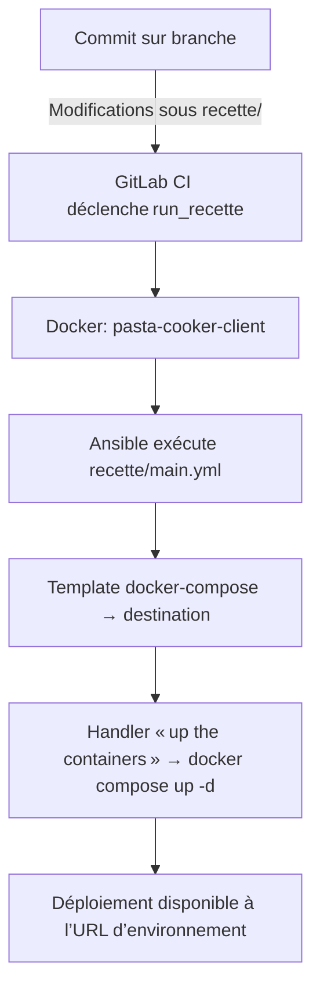

# agile-infra

[TOC]

---  

## 📖 Vue d’ensemble

Le projet **agile‑infra** regroupe l’infrastructure de déploiement pour l’environnement *recette* d’une application agile.  
Il s’appuie sur :

| Composant | Rôle |
|-----------|------|
| **GitLab CI** | Orchestration du pipeline de déploiement |
| **Ansible** | Provisionnement et mise à jour des conteneurs Docker |
| **Docker Compose** | Description des services applicatifs |
| **Variables** | Gestion des secrets et des versions d’image |

↩ [Retour au sommaire](#agile-infra)

---  

## 📂 Arborescence du dépôt

```
agile-infra/
├─ .gitlab-ci.yml
└─ recette/
   ├─ .trigger
   ├─ handlers/
   │  └─ main.yml
   ├─ templates/
   │  └─ docker-compose.yml.j2
   ├─ vars/
   │  ├─ secrets.yml
   │  └─ versions.yml
   └─ main.yml
```

*Le répertoire `recette` contient l’ensemble du playbook Ansible et les ressources associées.*

↩ [Retour au sommaire](#agile-infra)

---  

## 🚀 Pipeline GitLab CI

Le fichier **`.gitlab-ci.yml`** définit un unique stage **`run_recette`** qui exécute le playbook Ansible `recette/main.yml` via l’image Docker `pasta-cooker-client`.  

```yaml
stages:
  - run_recette

image:
  name: europe-west9-docker.pkg.dev/dpnm3-lab/public/pasta-cooker-client:v1.0.6
  entrypoint: [""]

variables:
  CD_URL: ws://cooker.pnm3.r2.eco4.cloud.e2.rie.gouv.fr
  PROJECT: /snum/pnm3/produits/doc/agile/agile-infra

run_recette:
  variables:
    PLAYBOOK: recette/main.yml
  stage: run_recette
  script:
    - pasta-cooker $PLAYBOOK --project $PROJECT --url $CD_URL --secretKey $SECRET_KEY --decryptPassword $DECRYPT_PASSWORD
  rules:
    - changes:
        - recette/**/*
  environment:
    name: recette
    url: http://agile.rec.pnm3.eco4.cloud.e2.rie.gouv.fr
```

### Diagramme du flux CI



↩ [Retour au sommaire](#agile-infra)

---  

## 📋 Playbook Ansible `recette/main.yml`

Le playbook cible l’hôte **`agile_prod`** et supporte un mode *dry‑run* (déploiement de test) grâce aux variables `dry_run`, `real_path` et `dry_run_path`.

```yaml
- hosts: agile_prod
  vars:
    dry_run: true
    real_path: /opt/app/
    dry_run_path: /opt/app-dry-run/
  tasks:
    - name: set application path
      set_fact:
        app_path: "{{ real_path if not dry_run else dry_run_path }}"

    - name: ensure folder exists
      file:
        path: "{{ app_path }}"
        state: directory
        owner: "{{ ansible_user }}"
        group: "{{ ansible_user }}"
      become: true

    - name: load secrets
      include_vars:
        file: "{{ playbook_dir }}/vars/secrets.yml"
        name: secrets

    - name: load versions
      include_vars:
        file: "{{ playbook_dir }}/vars/versions.yml"
        name: versions

    - name: upload docker compose file
      template:
        src: docker-compose.yml.j2
        dest: "{{ app_path }}/docker-compose.yml"
        mode: 0644
      notify: "{{ 'up the containers' if not dry_run else false }}"

  handlers:
    - import_tasks: handlers/main.yml
```

### Points clés

| Étape | Description |
|------|-------------|
| **Détermination du chemin** | Sélection dynamique entre `real_path` et `dry_run_path`. |
| **Création du répertoire** | Garantit la présence du répertoire cible avec les bons droits. |
| **Chargement des variables** | `secrets.yml` (données sensibles) et `versions.yml` (tags d’images). |
| **Génération du compose** | Le template `docker-compose.yml.j2` est rendu dans le répertoire d’application. |
| **Handler** | Si ce n’est pas un dry‑run, le handler `up the containers` démarre les services Docker. |

↩ [Retour au sommaire](#agile-infra)

---  

## 📦 Variables d’inventaire

### `recette/vars/versions.yml`

```yaml
backVersion: ":4.7.0"
frontVersion: ":latest"
dbVersion: ":11.16-alpine3.16"
```

Ces valeurs sont injectées dans le template Docker Compose pour choisir les tags d’image.

### `recette/vars/secrets.yml` *(non affiché pour des raisons de sécurité)*

Le fichier contient les secrets nécessaires au déploiement (ex. : mots de passe, tokens). Il est chargé avec le préfixe `secrets` et n’est jamais exposé dans le dépôt public.

↩ [Retour au sommaire](#agile-infra)

---  

## 🛠️ Handler `recette/handlers/main.yml`

```yaml
- name: up the containers
  shell:
    chdir: "{{ app_path }}"
    cmd: docker compose up -d --remove-orphans
```

Ce handler est invoqué uniquement lorsqu’un déploiement réel (non dry‑run) est effectué. Il assure :

* Le lancement en arrière‑plan (`-d`) des services définis dans le `docker-compose.yml` généré.  
* La suppression des services orphelins (`--remove-orphans`) pour éviter les résidus.

↩ [Retour au sommaire](#agile-infra)

---  

## 📂 Déclencheur de pipeline `recette/.trigger`

Le fichier **`.trigger`** contient simplement le texte :

```
#trigger deployment
```

Sa présence dans le répertoire `recette` permet à GitLab CI de détecter les changements et d’exécuter le job `run_recette` grâce à la règle `changes: - recette/**/*`.

↩ [Retour au sommaire](#agile-infra)

---  

## 📄 Template Docker Compose `recette/templates/docker-compose.yml.j2`

*(Le contenu exact du template n’est pas fourni dans les sources filtrées.  
Il doit référencer les variables `backVersion`, `frontVersion` et `dbVersion` afin de construire les services `backend`, `frontend` et `database`.)*

↩ [Retour au sommaire](#agile-infra)

---  

## ✅ Points de contrôle recommandés

| Vérification | Action |
|--------------|--------|
| **Secrets** | S’assurer que `secrets.yml` est stocké hors‑repo (ex. : GitLab CI variables, Vault). |
| **Dry‑run** | Valider le mode `dry_run: true` avant tout déploiement en production. |
| **Versionnage** | Mettre à jour les tags dans `versions.yml` lors de nouvelles releases. |
| **Nettoyage** | Exécuter périodiquement `docker compose down --remove-orphans` sur les environnements de test. |
| **Monitoring** | Vérifier que l’URL d’environnement (`http://agile.rec.pnm3.eco4.cloud.e2.rie.gouv.fr`) renvoie le service attendu. |

↩ [Retour au sommaire](#agile-infra)

---  

*Document généré automatiquement – prêt à être intégré dans un vault Obsidian ou un dépôt de documentation VS Code.*