# 📚 Guide d’atelier d’homologation RGAA  
**Document établi à partir des principes du RGAA 4.1+, déclinaison française des WCAG, conformément à la loi du 11 février 2005**  

---

[TOC]

---

## 1️⃣ Introduction et objectifs  

Préparer et piloter l’homologation RGAA d’un produit numérique : définir le périmètre, mesurer la conformité, planifier les actions correctives et produire la documentation officielle d’accessibilité.

**Méthodologie** – Atelier basé sur le **RGAA 4.1+** (déclinaison française des WCAG 2.1/2.2).  

#### Objectifs opérationnels  

| # | Objectif |
|---|----------|
| 🎯 | Comprendre les obligations réglementaires et les seuils de conformité (≥ 75 % minimum, 100 % cible SIG) |
| 🔎 | Identifier les critères RGAA applicables au produit |
| 📊 | Évaluer l’état de conformité actuel et prioriser les corrections |
| 🛠 | Construire un plan d’action d’amélioration continue |
| 📄 | Préparer la documentation d’homologation (déclaration, audit, suivi) |

---

## 2️⃣ Contexte d’usage  

| Élément | Valeur (exemple : **agile‑infra**) |
|---------|--------------------------------------|
| **Nom du produit** | `agile‑infra` |
| **Type de service** | Outil d’infrastructure CI/CD (GitLab CI + Ansible) |
| **Public cible** | Équipes DevOps, développeurs, administrateurs système |
| **Cadre réglementaire** | <ul><li>Loi n°2005‑102 du 11 février 2005</li><li>Décret n°2019‑768 du 24 juillet 2019</li><li>Arrêté du 29 avril 2021 (RGAA 4.1)</li><li>Directive UE 2016/2102</li></ul> |
| **Quand l’utiliser** | <ul><li>En amont d’un nouveau pipeline ou d’une refonte d’infrastructure</li><li>Avant chaque mise en production majeure</li><li>En phase d’exploitation pour le suivi des signalements</li></ul> |
| **Seuils de conformité** | Minimum légal : **75 %** de critères conformes ; Cible SIG : **100 %** + plan d’amélioration continue |

---

## 3️⃣ Pré‑requis  

| ✔️ | Élément indispensable |
|---|------------------------|
| ☐ | **Périmètre produit défini** – URLs, scripts, playbooks, variables d’environnement |
| ☐ | **Publics utilisateurs identifiés** – personas incluant déficiences visuelles, auditives, motrices, cognitives |
| ☐ | **Stack technique documentée** – GitLab CI, Ansible, Docker, variables (`secrets.yml`, `versions.yml`) |
| ☐ | **État des lieux accessibilité** – audits antérieurs, tickets de signalement, tests utilisateurs |
| ☐ | **Référentiel design** (si UI) – version DSFR ou bibliothèque de composants accessible |

> 💡 *Si aucun audit préalable n’existe, prévoir un « scan rapide » avec Axe, Lighthouse ou Wave pour repérer les blocages majeurs.*

---

## 4️⃣ Parties prenantes et rôles  

| Rôle | Profil type | Responsabilité dans l’atelier |
|------|-------------|--------------------------------|
| **Animateur / Référent accessibilité** | Chef de projet / UX / Expert RGAA | Faciliter, expliquer les critères, arbitrer les priorités |
| **Profil technique** | Développeur CI / DevOps / Lead Ansible | Évaluer la faisabilité, estimer l’effort technique |
| **Designer UX/UI** *(si UI présent)* | Designer produit | Proposer des alternatives accessibles, valider les maquettes |
| **Juriste / Conformité** | RSSI / DPO / Responsable légal | Valider le cadre réglementaire, approuver la déclaration |
| **Représentant utilisateurs** *(optionnel)* | Personne en situation de handicap / Association | Tester les scénarios réels, apporter un retour d’usage |

> ☝️ *Un même collaborateur peut cumuler plusieurs rôles selon les ressources disponibles.*

---

## 5️⃣ Logistique  

| Élément | Détails |
|--------|---------|
| **Durée** | 3 h – 4 h (prévoir une pause à 2 h) |
| **Matériel physique** | Tableau blanc, post‑its 4 couleurs (Conforme / Non‑conforme / À vérifier / Hors périmètre), marqueurs |
| **Matériel digital** | Outil collaboratif (Miro, FigJam, ou simplement un tableau partagé), navigateur avec Axe DevTools, Lighthouse, Wave |
| **Environnement de test** | Instance GitLab CI de test, dépôt contenant les playbooks Ansible (`recette/main.yml`, `recette/handlers/main.yml`, etc.) |
| **Livrables attendus** | - Matrice de conformité RGAA<br>- Plan d’action priorisé (P1‑P4)<br>- Brouillon de déclaration d’accessibilité |

---

## 6️⃣ Déroulé détaillé de l’atelier  

### 🎯 Étape 1 – Cadrage réglementaire (30 min)

1. Rappel du cadre légal (loi 2005, décret 2019, arrêté 2021, directive 2016/2102).  
2. Présentation des **4 principes WCAG** appliqués au RGAA :  
   - **Perceptible** – l’information doit être présentable de façon perceptible.  
   - **Utilisable** – les composants d’interface doivent être utilisables.  
   - **Compréhensible** – l’information et l’utilisation doivent être compréhensibles.  
   - **Robuste** – le contenu doit être interprétable par une large variété d’agents utilisateurs.  
3. Définir le **périmètre d’audit** :  
   - Pipelines GitLab (`.gitlab-ci.yml`)  
   - Playbooks Ansible (`recette/**/*.yml`)  
   - Templates Docker‑Compose (`recette/templates/docker-compose.yml.j2`)  
   - Variables (`vars/secrets.yml`, `vars/versions.yml`)  

> ✅ *Exemple concret : variable `CD_URL` exposée sans indication de nature sécurisée → impact sur perception et robustesse.*

---

### 🔍 Étape 2 – Identification des critères applicables (45 min)

| Thème RGAA | Exemple de critère « bloquant » |
|------------|-----------------------------------|
| **1 – Images** | 1.1 Alternative textuelle (non applicable ici) |
| **7 – Scripts** | 7.1 Gestion du focus après mise à jour dynamique (ex. : notification de succès) |
| **9 – Navigation** | 9.1 Navigation clavier (ex. : menu de pipeline inaccessible) |
| **12 – Structuration de l’information** | 12.1 Hiérarchie des titres dans les pages de documentation CI |
| **13 – Information et consultation** | 13.1 Texte alternatif aux icônes de statut (✔/✖) |

Pour chaque thème, l’équipe coche **Conforme / Non‑conforme / À vérifier / Hors périmètre** dans un tableau partagé.

---

### 📊 Étape 3 – Évaluation et scoring (45 min)

1. **Tests rapides** (pour chaque critère « À vérifier ») :  
   - **Manuel** : navigation clavier, lecteur d’écran (NVDA/VoiceOver) sur les pages GitLab.  
   - **Automatique** : Axe, Lighthouse, ou le plugin CI “accessibility‑report”.  
   - **Utilisateur** : si possible, faire tester un scénario par une personne en situation de handicap.  
2. **Calcul du taux de conformité** :  

```
Taux = (Nb critères conformes) / (Nb critères applicables) × 100
```

3. **Repérer les écarts critiques** : non‑conformités qui bloquent l’accès à une fonction essentielle (ex. : impossibilité de déclencher le job via clavier).

> 💡 *Ne cherchez pas la perfection immédiate ; l’objectif est d’obtenir une photo réaliste et un plan d’action.*

---

### 🎚️ Étape 4 – Priorisation et plan d’action (45 min)

#### Matrice Impact / Effort  

|                | **Faible effort** | **Fort effort** |
|----------------|-------------------|-----------------|
| **Fort impact**| 🔴 **Priorité 1** (quick wins) | 🟡 **Priorité 2** (investissements) |
| **Faible impact**| 🟢 **Priorité 3** (améliorations) | ⚪ **Priorité 4** (backlog) |

Pour chaque critère prioritaire :  

| Critère RGAA | Action corrective | Responsable | Échéance | Validation (test) |
|--------------|-------------------|-------------|----------|--------------------|
| 7.1 – Gestion du focus | Ajouter `focus-visible` sur le bouton “Run recette” | Développeur CI | Sprint N+1 | Test clavier + NVDA |
| 9.1 – Navigation clavier | Refactoriser le menu déroulant du pipeline | Lead Ansible | Sprint N+2 | Test clavier complet |
| 13.1 – Texte alternatif icônes | Ajouter `aria-label` aux icônes de statut | DevOps | Sprint N | Test lecteur d’écran |

Intégrer ces actions dans la **roadmap produit** (sprints, releases).

---

### 🏁 Étape 5 – Documentation et homologation (30 min)

1. **Déclaration d’accessibilité** (modèle obligatoire) :  
   - Taux de conformité (ex. : 78 % → conforme au minimum légal)  
   - Liste des critères non‑conformes avec justification (ex. : « exemption technique », « disproportion »)  
   - Coordonnées de contact pour les signalements  
   - Voie de recours (Défenseur des droits)  
2. **Dossier d’homologation** :  
   - Matrice de conformité détaillée (thème / critère / statut)  
   - Preuves de tests (captures d’écran, logs, rapports Axe)  
   - Plan d’amélioration continue (actions P1‑P4, dates de re‑test)  
3. **Processus de suivi** :  
   - Re‑tests à chaque release majeure  
   - Traitement des signalements (ticketing)  
   - Mise à jour périodique de la déclaration  

> 📸 *Action immédiate : partager le brouillon de déclaration avec le service juridique pour validation avant publication.*

---

## 7️⃣ Conseils de facilitation  

| Bonnes pratiques | À éviter |
|------------------|----------|
| Ancrer chaque critère dans un scénario réel (ex. : déclencher le job CI) | S’enliser dans le jargon RGAA sans illustration |
| Utiliser des exemples concrets du produit (variables, playbooks) | Confondre “conforme aux tests automatiques” et “accessible” |
| Impliquer les profils techniques dès l’évaluation | Reporter systématiquement les corrections “complexes” |
| Documenter chaque décision d’exemption | Oublier la mise à jour continue du tableau de suivi |
| Valider les corrections avec tests manuels + outils | Se fier uniquement aux scores automatiques |

---

## 8️⃣ Exemple de matrice de conformité (simplifiée)

### Thème 1 – Scripts (exemple)

| Critère RGAA | Statut | Observation | Action | Priorité |
|--------------|--------|-------------|--------|----------|
| 7.1 – Gestion du focus | ❌ Non‑conforme | Bouton “Run recette” ne reçoit pas le focus | Ajouter `tabindex="0"` + style `:focus-visible` | 🔴 P1 |
| 7.2 – ARIA live region | ⚠️ À vérifier | Aucun `aria-live` sur messages de succès | Ajouter `role="status"` + `aria-live="polite"` | 🟡 P2 |
| 7.3 – Évènements clavier | ✅ Conforme | Tous les raccourcis fonctionnent | – | – |

### Thème 9 – Navigation (exemple)

| Critère RGAA | Statut | Observation | Action | Priorité |
|--------------|--------|-------------|--------|----------|
| 9.1 – Navigation clavier | ❌ Non‑conforme | Menu déroulant du pipeline inaccessible | Refactoriser avec `ul/li` + `role="menu"` | 🔴 P1 |
| 9.2 – Liens “Aller au contenu” | ⚠️ À vérifier | Présent mais pas visible au focus | Ajouter style `outline: 3px solid #005fcc;` | 🟢 P3 |

---

## 9️⃣ Diagramme Mermaid du processus d’homologation RGAA  

```mermaid
graph TB
    %% Acteurs;
    team["👥 Équipe produit"]
    ref["🎓 Référent accessibilité"]
    jur["⚖️ Juriste / Conformité"]
    users["👤 Utilisateurs (optionnel)"]

    %% Phase 1 – Cadrage;
    subgraph phase1["Phase 1 – Cadrage & identification"]
        step1["📋 Définir périmètre & critères"]
        step2["📦 Inventaire des artefacts (CI, Ansible, templates)"]
    end
    %% Phase 2 – Évaluation;
    subgraph phase2["Phase 2 – Évaluation & scoring"]
        step3["🧪 Tests manuels + outils automatiques"]
        step4["📊 Calcul du taux de conformité"]
    end
    %% Phase 3 – Priorisation;
    subgraph phase3["Phase 3 – Priorisation & correction"]
        step5["⚠️ Matrice Impact/Effort"]
        step6["📝 Plan d’action (P1‑P4)"]
    end
    %% Phase 4 – Documentation;
    subgraph phase4["Phase 4 – Documentation & homologation"]
        step7["📘 Déclaration d’accessibilité"]
        step8["📜 Dossier d’homologation + engagement"]
    end
    %% Phase 5 – Amélioration continue;
    subgraph loop["🔄 Amélioration continue"]
        monitor["🔁 Re‑tests à chaque release"]
        feedback["💬 Traitement des signalements"]
    end
    %% Flux principaux;
    team --> step1;
    ref --> step2;
    team --> step3;
    ref --> step4;
    team --> step5;
    team --> step6;
    jur --> step7;
    jur --> step8;
    %% Boucles de feedback;
    users -.-> feedback;
    feedback --> step6;
    monitor -.-> step3;
    classDef acteur fill:#E3F2FD,stroke:#1976D2,stroke-width_2px;
    classDef phase fill:#ADD8E6,stroke:#333,stroke-width_2px;
    classDef loop fill:#E6E6FA,stroke:#333,stroke-width_2px;

    class team,ref,jur,users acteur;
    class step1,step2 phase1;
    class step3,step4 phase2;
    class step5,step6 phase3;
    class step7,step8 phase4;
    class monitor,feedback loop;
```



---

## 10️⃣ Adaptations contextuelles  

| Contexte | Adaptation recommandée |
|----------|------------------------|
| **Nouveau produit** | Intégrer l’accessibilité dès la conception (design system DSFR, composants accessibles) |
| **Refonte / Legacy** | Audit complet, prioriser les blocages (focus, alternatives, contraste), migration progressive |
| **Pipeline CI/CD uniquement** | Se concentrer sur les critères *Scripts* (focus, ARIA live), *Navigation* (accessibilité du UI GitLab) |
| **Contraintes de délai court** | Viser les critères bloquants (navigation clavier, alternatives, contraste) pour atteindre rapidement les 75 % |
| **Environnement multi‑technologies** (Docker, Ansible, GitLab) | Porter une attention particulière aux critères *Scripts* (7) et *Information* (13) liés aux messages dynamiques et aux icônes de statut |

---

## 11️⃣ Livrables et suite du projet  

| Livrable | Description |
|----------|-------------|
| **Matrice de conformité RGAA** | Tableau détaillé par thème / critère avec statut, observations, actions, priorité |
| **Plan d’action priorisé** | Liste des actions P1‑P4, responsables, échéances, critères de validation |
| **Brouillon de déclaration d’accessibilité** | À valider par le juriste, puis publier sur le site ou le portail interne |
| **Dossier d’homologation** | Preuves de tests, captures d’écran, rapports d’outils, plan d’amélioration continue |
| **Procédure de suivi** | Cadence de re‑tests (ex. : chaque release majeure), circuit de traitement des signalements, mise à jour de la déclaration |
| **Documentation interne** | Guide d’utilisation des outils d’audit (Axe, Lighthouse) pour les équipes DevOps |

### Prochaines étapes suggérées  

1. **Validation juridique** de la déclaration d’accessibilité.  
2. **Intégration des actions P1** dans le sprint suivant (CI/CD pipeline).  
3. **Formation** des équipes DevOps aux bonnes pratiques d’accessibilité (focus, ARIA, contraste).  
4. **Mise en place de tests automatisés** d’accessibilité dans la CI (ex. : `npm run axe-ci`).  
5. **Planification du suivi** (re‑test trimestriel, revue des tickets de signalement).

---

## 📚 Mini‑glossaire  

| Terme | Définition |
|-------|------------|
| **Alternative textuelle** | Texte (`alt`) décrivant le contenu d’une image pour les lecteurs d’écran. |
| **ARIA** | *Accessible Rich Internet Applications* – attributs HTML qui enrichissent l’accessibilité (ex. : `role`, `aria-label`). |
| **Focus** | Indicateur visuel montrant quel élément reçoit les interactions clavier. |
| **Contraste AA/AAA** | Ratio de contraste couleur‑texte/minimum requis par les WCAG (4.5 :1 pour AA, 7 :1 pour AAA). |
| **Script** | Code dynamique (JavaScript, Ansible) qui peut modifier le DOM ou l’interface. |
| **Déclaration d’accessibilité** | Document public obligatoire indiquant le niveau de conformité d’un service numérique. |
| **SIG** | *Service d’Information Gouvernemental* – cible d’accessibilité 100 % pour les sites publics. |
| **Impact / Effort** | Matrice d’évaluation permettant de prioriser les actions selon leur portée utilisateur et la charge de travail. |

---

## 12️⃣ Personnalisation rapide (≤ 5 min)

Remplacez les valeurs entre crochets :

| Placeholder | Exemple actuel |
|-------------|----------------|
| `[Nom du produit]` | `agile‑infra` |
| `[Type de service]` | `outil d’infrastructure CI/CD` |
| `[Public cible]` | `équipes DevOps, développeurs, administrateurs` |
| `[URL de production]` | `http://agile.rec.pnm3.eco4.cloud.e2.rie.gouv.fr` |
| `[Contact accessibilité]` | `accessibility@mycompany.com` |
| `[Date de mise à jour]` | `28/04/2026` |

---

*Fin du guide – prêt à être utilisé tel quel dans VS Code, Obsidian ou imprimé pour un atelier physique.*