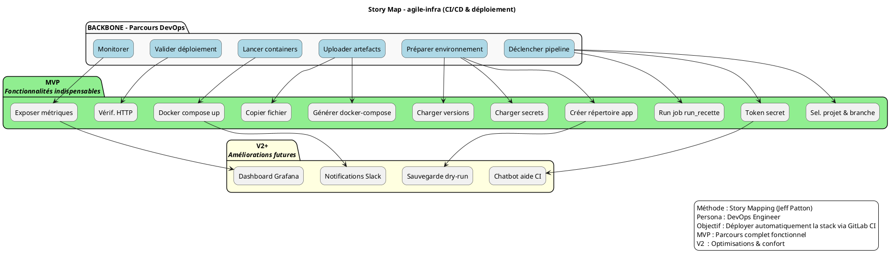

# 📚 Guide d’atelier : **Story Mapping – Représenter le périmètre fonctionnel d’*agile‑infra***  
*Document établi à partir des principes du Story Mapping de Jeff Patton*  

---  

[TOC]

---  

## 1️⃣ Introduction et objectifs  

**Livrable** : « Représenter visuellement un périmètre fonctionnel aligné sur le parcours utilisateur »  

**Méthodologie** : Atelier basé sur le **Story Mapping (Jeff Patton)**  

### Objectifs opérationnels  

| 🎯 Objectif | ✅ Résultat attendu |
|-------------|-------------------|
| 1️⃣ Comprendre collectivement le parcours cible de l’usager (ex. : ingénieur DevOps) | Un backbone (parcours horizontal) complet, partagé par toutes les parties prenantes |
| 2️⃣ Identifier les fonctionnalités nécessaires à chaque étape | Une pile d’activités (verticale) sous chaque étape du backbone |
| 3️⃣ Prioriser pour définir un MVP fonctionnel | Ligne de découpe (MVP / V1) clairement tracée |
| 4️⃣ Créer un support visuel partagé pour cadrer la suite du projet | Photo/export de la Story Map + diagramme PlantUML + backlog initial |

---  

## 2️⃣ Contexte d’usage  

| Élément | Valeur |
|---------|--------|
| **Type de livrable** | Standard ✅ |
| **Nature** | Atelier 🤝 « Imaginer une solution » |
| **Méthode** | Story Mapping (Jeff Patton) |
| **Quand l’utiliser** | <ul><li>Traduire recherche utilisateur, contraintes réglementaires & vision produit en périmètre fonctionnel</li><li>Cadrer un MVP, une V1 ou une refonte d’infrastructure</li><li>Aligner équipes métier, technique & design sur une même représentation</li></ul> |
| **Recommandation** | Produire **une** Story Map par **persona principal** (max 2‑3). Pour *agile‑infra* : <br>• **DevOps Engineer** (déploiement quotidien) <br>• **Plateforme Owner** (gouvernance) |

---  

## 3️⃣ Pré‑requis  

> 💡 *Si un pré‑requis manque, prévoir 15 min en début d’atelier pour le co‑construire rapidement.*

- [ ] **Vision produit** formalisée (ex. : « Permettre des déploiements automatisés, sécurisés et reproductibles »).  
- [ ] **Personas** et synthèse de la recherche utilisateur (verbatims, interviews).  
- [ ] **Problèmes utilisateurs** hiérarchisés (jobs‑to‑be‑done, pain points).  
- [ ] **Contraintes réglementaires / sécurité** (ex. : secret management, conformité Docker).  
- [ ] Accès au **référentiel de code** (ex. : `.gitlab-ci.yml`, playbooks Ansible).  

---  

## 4️⃣ Parties prenantes et rôles  

| Rôle | Profil type | Responsabilité dans l’atelier |
|------|-------------|--------------------------------|
| **Animateur** | Chef de produit / PO | Cadre, facilitation, garde du focus utilisateur |
| **DevOps Engineer** | Technique (Ansible, Docker, CI) | Évaluer faisabilité, effort, dépendances |
| **Plateforme Owner** | Métiers (IT Ops, Sécurité) | Valider pertinence fonctionnelle & conformité |
| **Architecte Cloud** *(optionnel)* | Architecture infra | Vérifier compatibilité avec l’infrastructure cible |
| **Designer UX** *(optionnel)* | UX / UI | Enrichir le parcours (ex. : ergonomie du UI GitLab) |

> ☝️ Un même participant peut cumuler plusieurs rôles selon les effectifs disponibles.

---  

## 5️⃣ Logistique  

| Élément | Détails |
|---------|---------|
| **Durée** | 2 h 30 – 3 h (prévoir une pause à 1 h 30) |
| **Matériel physique** | Mur / tableau blanc, post‑its 3 couleurs (ex. : vert = MVP, jaune = V2+, rouge = À valider), marqueurs, ruban de masquage |
| **Outils digitaux** | Mural, FigJam, Miro ou tout autre tableau collaboratif avec template Story Map |
| **Livrable de sortie** | Photo/export de la Story Map, diagramme PlantUML, liste des décisions MVP, points de vigilance |
| **Salle** | Disposition en U ou en cercle pour favoriser les échanges visuels |

---  

## 6️⃣ Déroulé détaillé de l’atelier  

### 🎯 Étape 1 — Introduction (15 min)  

1. Accueil & tour de table.  
2. Présentation des objectifs et du **Story Mapping** (rappel de Jeff Patton).  
3. Rappel du contexte : persona *DevOps Engineer*, vision, contraintes.  
4. Règles de co‑création : écoute active, contributions ouvertes, suspension du jugement.  

> ✅ *Astuce* : Afficher une **job story** type :  
> *« En tant que **DevOps Engineer**, je veux **déployer une stack Docker via CI** afin de **garantir une mise à jour fiable et sécurisée** »*  

---

### 🗺️ Étape 2 — Parcours utilisateur horizontal (30 min)  

| Action | Consignes |
|--------|-----------|
| **Question** | « Quelles sont les grandes étapes que suit l’ingénieur DevOps pour déployer *agile‑infra* ? » |
| **Résultat attendu** | Une suite de verbes d’action, disposés de gauche à droite (backbone). Exemple : <br>1️⃣ *Déclencher pipeline* → 2️⃣ *Préparer environnement* → 3️⃣ *Uploader artefacts* → 4️⃣ *Lancer containers* → 5️⃣ *Valider déploiement* → 6️⃣ *Monitorer* |
| **Mécanique** | Chaque participant écrit une étape sur un post‑it vert, on les range en séquence. |

---

### 📋 Étape 3 — Détail vertical des activités (45 min)  

Pour chaque étape du backbone :  

1. **Question** : « Que doit faire concrètement l’ingénieur ici ? »  
2. **Collecte** : actions, infos, choix, points de friction.  
3. **Disposition** : empiler les idées sous l’étape (du plus essentiel au plus secondaire).  

> 💡 *Ne filtrez pas à ce stade ; notez tout.*  

**Exemple (étape *Déclencher pipeline*)**  
- Sélectionner le projet GitLab  
- Choisir la branche *feature* ou *main*  
- Saisir le token d’accès (secret)  
- Lancer le job `run_recette`  

---

### 🎚️ Étape 4 — Priorisation & définition du MVP (30‑45 min)  

1. Tracer une **ligne horizontale de découpe** (MVP / V1) sous le backbone.  
2. **Au‑dessus** : fonctionnalités indispensables pour que le parcours soit complet.  
3. **En‑dessous** : fonctionnalités reportables (V2, backlog).  

**Questions clefs**  
- « Quelles activités sont **must‑have** pour que le déploiement aboutisse ? »  
- « Qu’est‑ce qui peut être retiré sans bloquer le flux ? »  

> 🎯 *Le MVP doit être **fonctionnel**, pas minimaliste à outrance ; il doit permettre de tester l’hypothèse « une pipeline CI peut déployer automatiquement la stack ».  

---

### 🏁 Étape 5 — Conclusion & prochaines étapes (15 min)  

1. **Relecture collective** de la carte, validation du backbone et du périmètre MVP.  
2. Noter **points de vigilance** (ex. : secret handling, versionning Docker).  
3. Définir les **actions à court terme** :  
   - Exporter la Story Map (photo/PNG).  
   - Créer le backlog (epics → user stories).  
   - Planifier le sprint de prototypage du MVP.  

> 📸 *Action immédiate* : partager la photo/export + le diagramme PlantUML dans le canal projet sous 24 h.

---  

## 7️⃣ Conseils de facilitation  

| Bonnes pratiques | À éviter |
|------------------|----------|
| Reformuler régulièrement les étapes pour garantir la clarté | S’enliser dans les détails techniques (ex. : syntaxe Ansible) |
| Faire participer **tous** les profils (métiers, technique, design) | Laisser un profil dominer les échanges |
| Utiliser le **time‑boxing** strict pour chaque phase | Dévier du parcours utilisateur (ex. : discussion sur l’infrastructure cloud) |
| Ancrer chaque fonctionnalité dans un **besoin utilisateur** | Confondre « nice‑to‑have » et « must‑have » |
| Capturer les arbitrages (ex. : pourquoi une activité est en V2) | Oublier de noter les dépendances techniques |

---  

## 8️⃣ Exemple de Story Map (simplifiée)  

```markdown
Parcours utilisateur (axe horizontal →) :
[Déclencher pipeline] — [Préparer environnement] — [Uploader artefacts] — [Lancer containers] — [Valider déploiement] — [Monitorer]

Fonctionnalités associées (axe vertical ↓ sous chaque étape) :

► Déclencher pipeline
   • Sélectionner projet GitLab
   • Choisir branche
   • Saisir token secret
   • Lancer job `run_recette`

► Préparer environnement
   • Créer répertoire `/opt/app` (dry‑run ou réel)
   • Charger secrets (Ansible `secrets.yml`)
   • Charger versions (Ansible `versions.yml`)

► Uploader artefacts
   • Rendre le template `docker‑compose.yml.j2`
   • Copier sur cible `/opt/app/docker-compose.yml`

► Lancer containers
   • Handler « up the containers » (docker compose up -d)
   • Gestion du mode `dry_run` vs `real`

► Valider déploiement
   • Vérifier réponses HTTP de l’app
   • Notifier via Slack / Email (option V2)

► Monitorer
   • Exposer métriques Prometheus
   • Alertes sur échecs de container
```

---  

## 9️⃣ Diagramme PlantUML du Story Map  



---  

## 10️⃣ Adaptations contextuelles  

| Contexte | Adaptation recommandée |
|----------|------------------------|
| **Refonte** | Partir du parcours existant (ex. : pipeline actuel) → identifier les frictions (ex. : gestion manuelle des secrets) → proposer nouvelles étapes. |
| **Produit réglementé** | Intégrer les étapes obligatoires (ex. : chiffrement des secrets, audit log) comme **post‑its rouges** non‑déplaçables. |
| **Multi‑profil** | Créer une Story Map par persona (DevOps, Plateforme Owner) puis fusionner les backbones pour repérer les activités transverses. |
| **Contrainte technique forte** | Inviter un architecte cloud dès l’étape 3 pour valider la faisabilité des artefacts (ex. : compatibilité Docker‑Compose avec le registre privé). |

---  

## 11️⃣ Livrables et suite du projet  

| Livrable | Description | Délai |
|----------|-------------|-------|
| **Story Map** (photo / export PNG) | Vue d’ensemble du parcours + priorisation MVP/V2 | < 24 h après l’atelier |
| **Diagramme PlantUML** | Représentation formelle du backbone, activités & découpe | Inclus dans le dépôt `docs/` |
| **Backlog produit** (epics → user stories) | Découpage fonctionnel à partir du MVP | Sprint 1 |
| **Matrice de traçabilité** | Fonctionnalité ↔ besoin utilisateur ↔ contrainte | Sprint 1 |
| **Roadmap** (MVP → V1 → V2) | Planning haut‑niveau | Sprint 2 |

### Prochaines étapes suggérées  

1. **Rédaction des user stories** (inclure critères d’acceptation).  
2. **Maquettage** des écrans clés du pipeline (ex. : UI GitLab variables).  
3. **Estimation technique** (story points, effort).  
4. **Planification du sprint MVP** (déploiement de la première version).  

---  

## 📖 Mini‑glossaire  

| Terme | Définition |
|-------|------------|
| **Backbone** | Axe horizontal du Story Map : séquence des grandes étapes du parcours utilisateur. |
| **Epic** | Grande fonction ou groupe d’activités (ex. : “Déployer l’application”). |
| **User story** | Description concise d’une fonctionnalité du point de vue de l’utilisateur. |
| **MVP** | Minimum Viable Product : version fonctionnelle minimale permettant de valider une hypothèse. |
| **Job story** | Formulation « En tant que [persona], je veux [action] afin de [objectif] ». |
| **Line of Flight** | Ligne de découpe (MVP vs backlog) sur le Story Map. |

---  

## ⏎ Retour au sommaire  

[↩ Retour au sommaire](#toc)  