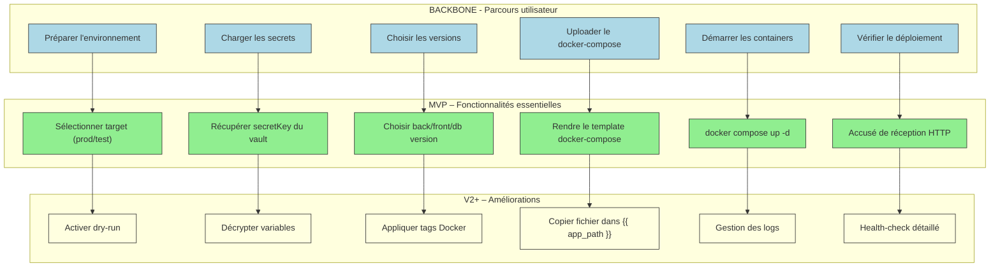

# 📚 Guide d’atelier **Story Mapping – Représenter le périmètre fonctionnel**  
*Document établi à partir des principes du Story Mapping de Jeff Patton*  

---  

[TOC]

---  

## 1️⃣ Introduction et objectifs  

**Livrable visé** : *Représenter visuellement un périmètre fonctionnel aligné sur le parcours utilisateur*  

| Objectif | Description |
|---|---|
| 🎯 **Comprendre le parcours cible** | Faire émerger, avec toutes les parties prenantes, les étapes clés que suit l’usager (ou l’opérateur) pour déployer l’infrastructure *agile‑infra*. |
| 🧩 **Identifier les fonctionnalités** | Lister, sous chaque étape, les actions, informations et décisions nécessaires (ex. : charger les secrets, choisir une version). |
| 🚀 **Prioriser pour définir un MVP** | Tracer la ligne de découpe (MVP/V1) afin de livrer la version la plus petite mais fonctionnelle. |
| 📊 **Créer un support visuel partagé** | Obtenir une Story Map exploitable immédiatement (photo, export, diagramme Mermaid). |

---  

## 2️⃣ Contexte d’usage  

| Élément | Valeur |
|---|---|
| **Type de livrable** | Standard ✅ |
| **Nature** | Atelier 🤝 |
| **Activité** | « Imaginer une solution » |
| **Méthode** | Story Mapping (Jeff Patton) |
| **Quand l’utiliser** | • Traduire recherche utilisateur + contraintes (sécurité, conformité) + vision produit en périmètre fonctionnel.<br>• Cadrer un MVP, une V1 ou une refonte de la chaîne CI/CD.<br>• Aligner équipes métier, technique et design sur la même représentation. |
| **Recommandation** | Produire **une Story Map par profil opérateur** (ex. : DevOps, Release Manager). Commencer toujours par le profil *final* (celui qui déclenche le pipeline). |

---  

## 3️⃣ Pré‑requis  

- [ ] **Vision produit** (pitch, objectifs business, métriques de succès).  
- [ ] **Personas** et recherche utilisateur synthétisés (verbatims, entretiens).  
- [ ] **Problèmes utilisateurs** hiérarchisés (jobs‑to‑be‑done, points de friction).  
- [ ] **Contraintes réglementaires / techniques** (gestion des secrets, exigences de sécurité, dry‑run).  

> 💡 *Si un pré‑requis manque, consacrez 15 min en début d’atelier à le co‑construire.*  

---  

## 4️⃣ Parties prenantes et rôles  

| Rôle | Profil type | Responsabilité dans l’atelier |
|---|---|---|
| **Animateur** | Chef de produit / PNM | Cadre, facilitation, garde le focus utilisateur. |
| **Profil technique** | Tech Lead / Architecte Infra | Évalue faisabilité, effort, dépendances (ex. : Docker, Ansible). |
| **Porteur métier** | Responsable Ops / Release Manager | Valide pertinence fonctionnelle, priorisation et conformité. |
| **Designer UX/UI** *(optionnel)* | Designer produit | Enrichit le parcours (ex. : interface de déclenchement du pipeline). |

> ☝️ *Un même participant peut cumuler plusieurs rôles selon les effectifs.*  

---  

## 5️⃣ Logistique  

| Élément | Détails |
|---|---|
| **Durée** | 2 h 30 à 3 h (pause à 1 h 30 si 3 h). |
| **Matériel physique** | Mur / tableau blanc, post‑its (3 couleurs : étapes, fonctionnalités, priorisation), marqueurs, ruban de masquage. |
| **Matériel digital** | Outil collaboratif (Mural, FigJam, Klaxoon…) avec template vierge. |
| **Livrable de sortie** | Photo / export de la Story Map, diagramme Mermaid, liste des décisions MVP, points de vigilance. |

---  

## 6️⃣ Déroulé détaillé de l’atelier  

### 🎯 Étape 1 – Introduction (15 min)  

1. Présenter les objectifs et le principe de la Story Map (Jeff Patton).  
2. Rappeler le contexte : *agile‑infra* (pipeline CI/CD, gestion des secrets, versioning).  
3. Exposer les règles de l’atelier (écoute active, suspension du jugement).  

> ✅ **Exemple de job story** :  
> *« En tant que **DevOps**, je veux **déployer une version d’infrastructure en mode dry‑run** afin de **valider les changements sans impacter la production**. »*  

### 🗺️ Étape 2 – Parcours utilisateur horizontal (30 min)  

| Action | Consignes |
|---|---|
| Question centrale | *« Quelles sont les grandes étapes que suit l’opérateur pour déployer l’infrastructure ? »* |
| Output | Un post‑it par étape, disposé de gauche à droite. Utiliser des **verbes d’action** (ex. : « Préparer l’environnement », « Charger les secrets », « Lancer le playbook »). |

**Exemple d’étapes (début)**  

1. **Sélectionner l’environnement**  
2. **Charger les secrets**  
3. **Choisir les versions**  
4. **Uploader le docker‑compose**  
5. **Démarrer les containers**  
6. **Vérifier le déploiement**  

### 📋 Étape 3 – Détail vertical des activités (45 min)  

Pour chaque étape du parcours :  

1. **Que doit faire concrètement l’opérateur ?**  
2. **De quelles informations a‑t‑il besoin ?** (ex. : clé de chiffrement, version du back‑end).  
3. **Quels choix ou actions doit‑il réaliser ?** (ex. : dry‑run vs prod).  
4. **Points de friction potentiels** (ex. : gestion des secrets expirés).  

*Empilez les réponses **verticalement** sous chaque étape, du plus essentiel (en haut) au plus secondaire (en bas).*  

### 🎚️ Étape 4 – Priorisation & définition du MVP (30‑45 min)  

1. Tracer une **ligne de découpe** horizontale (MVP/V1).  
2. **Au‑dessus** → fonctionnalités indispensables pour que le pipeline fonctionne du premier bout à la fin.  
3. **En‑dessous** → fonctionnalités reportables (optimisations, confort).  

**Questions clés**  

- *Quelles actions sont absolument nécessaires pour que le pipeline aboutisse ?*  
- *Qu’est‑ce qui peut être retiré sans bloquer le processus principal ?*  

> 🎯 **Rappel** : Le MVP doit être **fonctionnel**, pas simplement « minimal ». Il doit permettre de tester une hypothèse produit (ex. : déploiement fiable en dry‑run).  

### 🏁 Étape 5 – Conclusion & prochaines étapes (15 min)  

1. Relire la carte en groupe, valider cohérence parcours + périmètre MVP.  
2. Noter les **points de vigilance**, **questions en suspens**, **dépendances** (ex. : accès au secret manager).  
3. Annoncer les suites : rédaction du backlog, création des user stories, maquettage, estimation.  

> 📸 **Action immédiate** : Prendre une photo du board ou exporter le diagramme Mermaid et le partager dans les 24 h.  

---  

## 7️⃣ Conseils de facilitation  

| Bonnes pratiques | À éviter |
|---|---|
| Reformuler régulièrement pour assurer la clarté. | S’enliser dans les détails techniques dès le départ. |
| Garder le cap sur l’expérience opérateur. | Laisser un profil dominer les échanges. |
| Faire participer tout le monde (métiers, terrain, technique). | Accepter les digressions hors du parcours. |
| Utiliser un timeboxing strict par étape. | Oublier de documenter les arbitrages. |
| Ancrer chaque fonctionnalité dans un besoin utilisateur. | Confondre « nice‑to‑have » et « must‑have ». |

---  

## 8️⃣ Exemple de Story Map (simplifiée)  

```markdown
Parcours utilisateur (axe horizontal →) :

[Préparer l’environnement] — [Charger les secrets] — [Choisir les versions] — [Uploader le compose] — [Démarrer les containers] — [Vérifier le déploiement]

Fonctionnalités associées (axe vertical ↓ sous chaque étape) :

► Préparer l’environnement
   • Sélectionner le target (prod / test)
   • Activer le mode dry‑run
   • Vérifier la connectivité réseau

► Charger les secrets
   • Récupérer le secretKey depuis le vault
   • Décrypter les variables (DECRYPT_PASSWORD)
   • Valider la présence de tous les secrets

► Choisir les versions
   • Sélectionner backVersion, frontVersion, dbVersion
   • Appliquer les tags Docker

► Uploader le compose
   • Rendre le template docker‑compose.yml.j2
   • Copier le fichier dans {{ app_path }}

► Démarrer les containers
   • Exécuter `docker compose up -d --remove-orphans`
   • Gérer les logs de démarrage

► Vérifier le déploiement
   • Recevoir l’accusé de réception HTTP
   • Vérifier le statut du service via health‑check
```

---  

## 9️⃣ Diagramme Mermaid du Story Map (adapté à *agile‑infra*)  



> **Comment le lire** : le **backbone** (en haut) représente le parcours complet. Sous chaque étape, les **fonctions MVP** (vert) sont indispensables ; les **fonctions V2+** (jaune) sont des améliorations qui peuvent être planifiées ultérieurement.  

---  

## 10️⃣ Adaptations contextuelles  

| Contexte | Adaptation recommandée |
|---|---|
| **Refonte** | Partir du parcours actuel (ex. : pipeline CI existant), identifier les points de friction, proposer de nouvelles étapes ou automatisations. |
| **Produit réglementé** | Insérer les contraintes légales (ex. : chiffrement obligatoire, conservation des logs) comme **étapes obligatoires** dans le backbone. |
| **Multi‑profils** | Créer une Story Map par **persona** (DevOps, Release Manager, Auditeur) puis fusionner les fonctionnalités communes. |
| **Contrainte technique forte** | Inviter le **Tech Lead** dès l’étape 3 pour valider la faisabilité (ex. : accès au vault, compatibilité Docker). |

---  

## 11️⃣ Livrables et suite du projet  

| Livrable | Description |
|---|---|
| **Story Map** | Photo ou export numérique + diagramme Mermaid (ci‑dessus). |
| **Backlog produit structuré** | Epics → User Stories (ex. : *Epic : Déploiement d’infrastructure* → *User Story : En tant que DevOps, je veux charger les secrets depuis le vault*). |
| **Matrice de traçabilité** | Fonctionnalité ↔ Besoin utilisateur ↔ Contrainte (sécurité, conformité). |
| **Roadmap** | Vue temporelle : MVP → V1 → V2 (incluant les fonctionnalités V2+). |
| **Prochaines étapes** | 1️⃣ Rédaction des user stories avec critères d’acceptation.<br>2️⃣ Maquettage (ex. : UI du déclencheur GitLab CI).<br>3️⃣ Estimation technique & planification des sprints. |

---  

## 📖 Mini‑glossaire  

| Terme | Définition |
|---|---|
| **Backbone** | Axe horizontal de la Story Map ; séquence principale du parcours utilisateur. |
| **Epic** | Grande fonctionnalité ou groupe de stories qui se situe sur une même étape du backbone. |
| **Job story** | Formulation « En tant que [persona], je veux [action] afin de [objectif] ». |
| **MVP** | Produit Minimum Viable : version la plus petite qui permet de valider l’hypothèse produit. |
| **Dry‑run** | Exécution simulée sans impact réel, utilisée pour valider le processus. |
| **Secret manager** | Système (ex. : Vault) qui stocke et délivre les secrets chiffrés. |
| **Line of split (ligne de découpe)** | Ligne horizontale qui sépare les fonctionnalités du MVP des fonctionnalités reportées. |

---  

## 🔚 Retour au sommaire  

↩ [TOC]  


---  

*Ce guide est prêt à être utilisé tel quel dans VS Code, Obsidian ou imprimé pour un atelier physique. Il suffit de remplacer les éléments entre `[…]` par les informations spécifiques à votre projet (personas, contraintes, etc.).*  