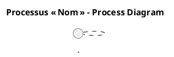

## 📋 Ce que nous savons déjà

| Élément | Valeur |
|---------|--------|
| **Nom du projet** | **ambulon** |
| **Chemin du dépôt** | `G:\WarchoLife\WarchoDevplace\Gitlab_Applications\ambulon\workplace-ambulon\gitlab\ambulon` |
| **Nombre de fichiers analysés** | 0 (le contenu du README n’a pas été fourni) |
| **Objectif de la demande** | Élaborer un **Cahier des Charges Fonctionnel (CCF)** basé sur la norme **ISO/IEC 19510 (BPMN)** |

> **En l’état actuel, nous ne disposons d’aucune information fonctionnelle** (ex. : description des processus métier, acteurs, règles de gestion, exigences non‑fonctionnelles, etc.).  
> Sans ces éléments, il est impossible de créer les diagrammes BPMN requis (Collaboration, Process, Choreography, …) ni les matrices de traçabilité, de priorisation ou de KPI.

---

## 🔎 Informations complémentaires nécessaires

Afin de produire un CCF complet et conforme à la structure imposée, merci de nous fournir :

| # | Type d’information | Pourquoi c’est indispensable |
|---|----------------------|--------------------------------|
| 1️⃣ | **Glossaire métier** (définitions des concepts clés, acronymes, entités) | Garantit une terminologie unique dans tous les diagrammes et règles de gestion. |
| 2️⃣ | **Périmètre fonctionnel** (quels services, modules ou flux le projet couvre) | Détermine les frontières du processus à modéliser. |
| 3️⃣ | **Liste des acteurs / rôles** (ex. : Utilisateur, Opérateur, Service externe, Système de paiement) | Permet de créer les **Pools** et **Lanes** dans les diagrammes de collaboration. |
| 4️⃣ | **Description détaillée des processus métiers** (au moins les processus critiques) – idéalement sous forme de **use‑case** ou de **story** | Chaque processus deviendra un diagramme BPMN (Process Diagram) avec ses activités, événements et passerelles. |
| 5️⃣ | **Règles de gestion** (conditions, seuils, décisions) | Elles seront associées aux passerelles (gateway) et aux points de décision dans la matrice “Règles de gestion métier”. |
| 6️⃣ | **Données manipulées** (ex. : Commande, Facture, Dossier patient, etc.) et leurs **Data Stores** | Nécessaires pour les **Data Objects**, **Data Stores** et les artefacts de documentation. |
| 7️⃣ | **Exigences non‑fonctionnelles** (performance, sécurité, traçabilité, conformité) | Elles alimenteront les sections **KPIs**, **Gestion des exceptions**, **Maturité processus**. |
| 8️⃣ | **Scénarios d’exception** (timeouts, erreurs de validation, refus, annulations) | Permet de modéliser les **Boundary Events** et les chemins d’erreur. |
| 9️⃣ | **Sous‑processus réutilisables** (ex. : Authentification, Envoi de notification) | Pour créer la bibliothèque de **sub‑processes** et les **Call Activities**. |
| 🔟 | **Contraintes techniques / moteur BPMN visé** (Camunda, Activiti, Flowable…) | Influence la granularité et les éléments exécutables (Common Executable). |

> **Astuce** : vous pouvez nous transmettre ces informations sous forme de tableau, de texte libre ou même de premiers croquis (UML, BPMN, flow‑charts). Plus les descriptions seront précises, plus le CCF sera exploitable immédiatement.

---

## 📂 Modèle de réponse (à remplir)

Vous pouvez copier‑coller le squelette ci‑dessous, le compléter et le renvoyer :

```markdown
# 1. Introduction et contexte
- Organisation : …
- Objectifs de la modélisation BPMN : …
- Périmètre : …
- Glossaire :
  - **Entité X** : …
  - **Entité Y** : …

# 2. Cartographie des processus
## 2.1 Nomenclature
- Processus métier stratégiques : …
- Processus métier opérationnels : …
- Processus de support : …
- Processus de management : …

## 2.2 Matrice de processus
| ID | Nom | Type | Propriétaire | Priorité |
|----|-----|------|--------------|----------|
| P‑001 | … | Opérationnel | … | Critique |
| P‑002 | … | Support | … | Important |

# 3. Modélisation BPMN détaillée
## Processus critique 1 – « Nom du processus »
### 3.1 Diagramme de collaboration
```plantuml
@startuml
title Processus « Nom » – Collaboration
|#LightBlue|Système A|
|#LightGreen|Système B|
...
@enduml
```
### 3.2 Diagramme de processus

*(Répéter pour chaque processus critique)*

# 4. Règles de gestion métier
| Point de décision | Condition | Règle métier | Source |
|-------------------|-----------|--------------|--------|
| … | … | … | … |

# 5. Données et documents
- Data Objects : …
- Data Stores : …
- Artifacts : …

# 6. Acteurs et rôles
| Lane BPMN | Rôle métier | Responsabilités | Compétences |
|-----------|-------------|----------------|-------------|
| … | … | … | … |

# 7. Performances et indicateurs (KPIs)
| Indicateur | Formule | Objectif | Seuil d’alerte |
|------------|---------|----------|----------------|

# 8. Gestion des exceptions
| Scénario | Déclencheur | Gestion | Conséquence |
|----------|-------------|---------|-------------|

# 9. Sous‑processus et réutilisation
- Liste des sous‑processus : …
- Call Activities : …

# 10. Matrice de traçabilité
| Exigence CCF | Processus BPMN | Tâche(s) | Scénario de test |
|--------------|----------------|----------|------------------|

# 11. Validation et conformité
- Checklist BPMN : …
- Niveau de conformité : …

# 12. Implémentation et exécution
- Maturité processus : …
- Intégration système (moteur BPMN, services web) : …
```

---

## 📤 Prochaine étape

1. **Récupérez** les informations manquantes (voir le tableau ci‑dessus).  
2. **Répondez** en remplissant le modèle ou en fournissant les éléments sous tout autre format lisible.  
3. Nous **générerons** alors le CCF complet, incluant :  
   - Tous les diagrammes BPMN (PlantUML)  
   - Les matrices de processus, règles métier, KPI, traçabilité, etc.  
   - La checklist de validation et les recommandations d’implémentation.

---

### 🎯 En résumé

> *Nous avons besoin du **contenu fonctionnel** du projet « ambulon » (processus, acteurs, règles, données) pour appliquer la méthodologie BPMN/ISO 19510 et produire le Cahier des Charges Fonctionnel demandé.*  

Merci de nous transmettre ces éléments ; dès réception, le CCF sera élaboré dans les plus brefs délais.