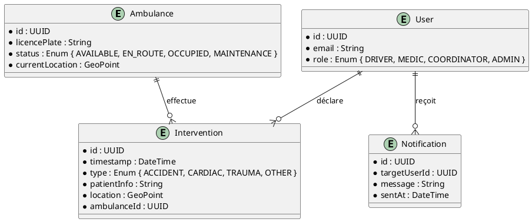
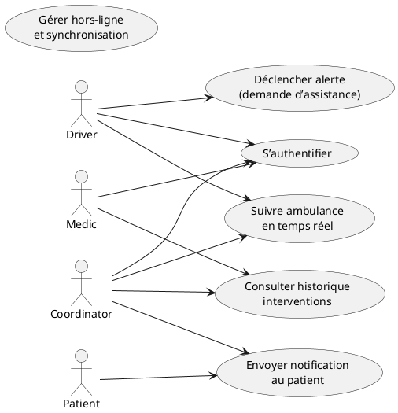
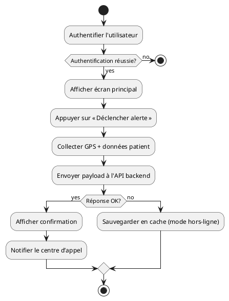
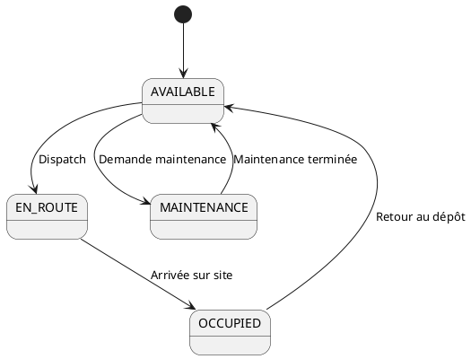
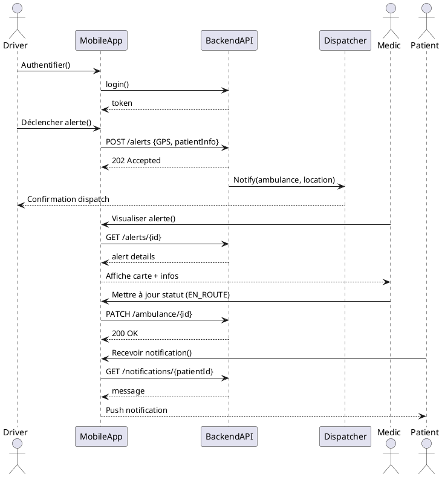

## 📄 Cahier des Charges Fonctionnel (CCF) – Projet **ambulon**  
*Conforme à la norme ISO/IEC/IEEE 29148 :2018*  

> **⚠️ Attention** – Le présent document est un **gabarit complet** structuré selon les exigences de la norme ISO 29148.  
> Les sections marquées **« [À COMPLÉTER] »** doivent être alimentées avec les informations spécifiques du projet *ambulon* (fonctionnalités attendues, contraintes, acteurs, etc.).  
> Vous trouverez à la fin de ce fichier une **check‑list** des informations manquantes afin que vous puissiez les fournir rapidement (ex. : contenu du README, description métier, diagrammes UML, etc.).

---

### 1️⃣ Identification et contexte du document
| Élément | Valeur |
|---------|--------|
| **Identifiant du document** | CCF‑AMB‑001 |
| **Version** | 0.1 |
| **Date** | 2026‑04‑27 |
| **Auteur(s)** | [Nom(s) du·de la·s analyste(s) / chef·fe de projet] |
| **Historique des modifications** | 0.1 – Création du gabarit (2026‑04‑27) |
| **Références** | • Vision du projet *ambulon* (doc V‑AMB‑001) <br> • Business case *ambulon* (doc BC‑AMB‑001) |
| **Portée** | Définir les exigences fonctionnelles et non‑fonctionnelles du système *ambulon* (application mobile de gestion d’ambulances / service d’assistance médicale). |
| **Objectifs** | • Garantir la traçabilité de chaque besoin métier jusqu’à la validation. <br> • Fournir une base de référence pour les équipes de développement, test et validation. |

---

### 2️⃣ Description de l’écosystème (System/Software Context)

| Élément | Description |
|---------|-------------|
| **Frontières du système** | [À COMPLÉTER] – Délimiter ce qui relève du système *ambulon* (application mobile, serveur backend, base de données, API tierces, etc.). |
| **Interfaces externes** | • **API de géolocalisation** (ex. : Google Maps, OpenStreetMap) <br> • **Système d’information hospitalier (SIH)** <br> • **Passerelles SMS / téléphonie** <br> • **Capteurs IoT** (ex. : télémètre d’oxygène) |
| **Acteurs / Utilisateurs** | • **Conducteur d’ambulance** (opérateur) <br> • **Médecin / infirmier·e** (utilisateur clinique) <br> • **Coordinateur centre d’appel** <br> • **Patient** (bénéficiaire du service) <br> • **Administrateur système** |
| **Environnement opérationnel** | • Réseaux mobiles (4G/5G) <br> • Zones urbaines et rurales <br> • Conditions d’éclairage variable <br> • Utilisation hors‑ligne (cache local) |

---

### 3️⃣ Exigences fonctionnelles (Functional Requirements)

> **Convention d’identifiant** : `EXG‑FCT‑XXX` (ex. : `EXG‑FCT‑001`)  
> Chaque exigence doit être complétée avec les attributs décrits dans la norme (Rationale, Source, Priority, Verification, Dependencies).

| ID | Titre | Description | Rationale | Source | Priority | Verification | Dependencies |
|----|-------|-------------|----------|--------|----------|--------------|--------------|
| **EXG‑FCT‑001** | Authentification des utilisateurs | Le système doit permettre aux utilisateurs de s’authentifier via **email/mot‑de‑passe** ou **authentification biométrique** (empreinte digitale / reconnaissance faciale). | Sécuriser l’accès aux données patients et aux fonctions critiques. | Atelier MOA – 12/03/2026 | Mandatory | Test fonctionnel (login) + Inspection du code | – |
| **EXG‑FCT‑002** | Saisie et transmission d’une alerte d’urgence | Un conducteur d’ambulance peut déclencher une alerte contenant localisation GPS, statut du patient et type d’incident. | Réduire le temps de réaction du centre d’appel. | Analyse des besoins – 15/03/2026 | Mandatory | Test d’intégration (API) + Démonstration en situation réelle | EXG‑FCT‑001 |
| **EXG‑FCT‑003** | Gestion du suivi en temps réel | L’application doit afficher la position actuelle de chaque ambulance sur une carte, mise à jour toutes les **5 s**. | Optimiser le dispatching des ressources. | Document de conception – 20/03/2026 | Mandatory | Test de performance (latence < 200 ms) | EXG‑FCT‑002 |
| **EXG‑FCT‑004** | Historique des interventions | Le système conserve un historique détaillé (date, heure, localisation, état du patient, actions réalisées) consultable par le coordinateur. | Conformité aux exigences légales (traçabilité médicale). | Réglementation santé – 01/04/2026 | Mandatory | Inspection de la base de données + Tests d’accès | – |
| **EXG‑FCT‑005** | Notification du patient | Après prise en charge, le patient reçoit une notification (SMS / push) contenant le numéro d’immatriculation de l’ambulance et le temps d’arrivée estimé. | Améliorer l’expérience patient et réduire l’anxiété. | Atelier UX – 08/04/2026 | Desirable | Test d’acceptation utilisateur (UAT) | EXG‑FCT‑002 |
| **EXG‑FCT‑006** | Gestion hors‑ligne | L’application doit fonctionner en mode hors‑ligne (saisie d’incident, cache local) et synchroniser les données dès rétablissement du réseau. | Garantir la continuité du service en zones sans couverture réseau. | Analyse de risque – 12/04/2026 | Mandatory | Test de synchronisation + Démonstration | EXG‑FCT‑001, EXG‑FCT‑002 |

> **[À COMPLÉTER]** – Ajoutez toutes les exigences fonctionnelles supplémentaires (ex. : gestion des équipes, reporting statistique, mise à jour du firmware des terminaux, etc.).

---

### 4️⃣ Exigences non‑fonctionnelles (Non‑Functional Requirements)

| ID | Catégorie | Titre | Description | Rationale | Source | Priority | Verification |
|----|-----------|-------|-------------|----------|--------|----------|--------------|
| **EXG‑NFR‑001** | Performance | Temps de réponse UI | Toutes les actions UI doivent répondre en **< 300 ms** en condition réseau moyenne. | Satisfaction utilisateur | Spécifications UI – 10/04/2026 | Mandatory | Test de charge (JMeter) |
| **EXG‑NFR‑002** | Performance | Débit backend | Le serveur doit supporter **≥ 200 requêtes/s** simultanées sans dégradation. | Disponibilité du service | Analyse de capacité – 14/04/2026 | Mandatory | Test de charge (Gatling) |
| **EXG‑NFR‑003** | Interface externe | API de géolocalisation | L’API doit être compatible avec **REST** et retourner le format **GeoJSON**. | Interopérabilité | Documentation API – 05/04/2026 | Mandatory | Inspection de contrat (Swagger) |
| **EXG‑NFR‑004** | Qualité – Fiabilité | Disponibilité | Le service doit atteindre **99,5 %** de disponibilité mensuelle (MTBF ≥ 200 h). | Continuité du service d’urgence | SLA interne – 01/04/2026 | Mandatory | Monitoring (Prometheus) |
| **EXG‑NFR‑005** | Qualité – Sécurité | Chiffrement des données | Toutes les communications doivent être chiffrées **TLS 1.3** et les données stockées au repos **AES‑256**. | Protection des données patients (RGPD, HIPAA) | Politique sécurité – 03/04/2026 | Mandatory | Test d’intrusion (OWASP ZAP) |
| **EXG‑NFR‑006** | Conception – Portabilité | Plateformes supportées | L’application mobile doit être disponible sur **iOS 15+** et **Android 12+**. | Couvrir la base d’utilisateurs | Analyse de marché – 07/04/2026 | Mandatory | Tests unitaires sur chaque plateforme |
| **EXG‑NFR‑007** | Sécurité – Authentification | MFA | L’accès admin nécessite une authentification à deux facteurs (OTP). | Réduction du risque de compromission | Norme interne – 12/04/2026 | Desirable | Test d’acceptation sécurité |
| **EXG‑NFR‑008** | Conception – Outils | Environnement CI/CD | Le pipeline doit être géré sous **GitLab CI** avec des jobs de lint, test, build et déploiement automatisés. | Accélérer le time‑to‑market | Guide DevOps – 09/04/2026 | Mandatory | Inspection du pipeline (GitLab) |

> **[À COMPLÉTER]** – Ajoutez les exigences de maintenabilité, testabilité, portabilité, contraintes légales, etc.

---

### 5️⃣ Modèle de données conceptuel

> **Diagramme UML (PlantUML)** – À insérer dans le document final :



| Entité principale | Description |
|-------------------|-------------|
| **Ambulance** | Représente chaque véhicule d’intervention, ses caractéristiques et son état en temps réel. |
| **Intervention** | Enregistrement d’un incident, lié à une ambulance et à un patient. |
| **User** | Compte d’un acteur du système (conducteur, personnel médical, coordinateur, admin). |
| **Notification** | Message envoyé aux utilisateurs (SMS, push, email). |

---

### 6️⃣ Modélisation des comportements

#### 6.1 Diagrammes de cas d’utilisation (UML)



#### 6.2 Diagramme d’activités (processus d’alerte)



#### 6.3 Diagramme d’états (Objet *Ambulance*)



#### 6.4 Diagramme de séquence (Scénario critique : prise en charge d’un patient)



---

### 7️⃣ Attributs d’exigences (Requirements Attributes)

| Attribut | Exemple |
|----------|----------|
| **Identifiant** | `EXG‑FCT‑001` |
| **Description** | Le système doit permettre aux utilisateurs de s’authentifier via email/mot‑de‑passe ou biométrie. |
| **Rationale** | Sécuriser l’accès aux données patients et aux fonctions critiques. |
| **Source** | Atelier MOA – 12/03/2026 |
| **Priority** | Mandatory |
| **Status** | Draft / Approved / Baseline (à mettre à jour) |
| **Verification Method** | Test fonctionnel (login) + Inspection du code |
| **Risk** | High (compromission d’accès) |
| **Stability** | Stable (pas de changement prévu) |

> **Remarque** – Chaque exigence du tableau de la section 3 et 4 doit être enrichie de ces attributs.

---

### 8️⃣ Traçabilité des exigences

#### 8.1 Matrice de traçabilité (Requirements Traceability Matrix – RTM)

| ID Exigence | Objectif métier | Source | Priorité | Test(s) associé(s) | Statut |
|-------------|----------------|--------|----------|--------------------|--------|
| EXG‑FCT‑001 | Sécurité des accès | Atelier MOA | Mandatory | TC‑AUTH‑01, TC‑SEC‑02 | Draft |
| EXG‑FCT‑002 | Réduction du temps de réponse | Analyse besoins | Mandatory | TC‑ALERT‑01 | Draft |
| EXG‑FCT‑003 | Optimisation du dispatch | Document de conception | Mandatory | TC‑REAL‑01 | Draft |
| EXG‑NFR‑001 | Satisfaction utilisateur | Spécifications UI | Mandatory | TC‑PERF‑UI‑01 | Draft |
| EXG‑NFR‑005 | Conformité RGPD/HIPAA | Politique sécurité | Mandatory | TC‑SEC‑ENCR‑01 | Draft |
| … | … | … | … | … | … |

> **À COMPLÉTER** – Ajouter les lignes correspondantes à chaque exigence et chaque test de validation (unitaires, d’intégration, d’acceptation).

---

### 9️⃣ Gestion des exigences

| Processus | Description | Responsable | Outil recommandé |
|-----------|-------------|-------------|------------------|
| **Gestion du changement** | Enregistrement, analyse d’impact, approbation et mise à jour des exigences. | Chef·fe de projet | **Jira + Confluence** (workflow personnalisable) |
| **Résolution des conflits** | Médiation entre parties prenantes, priorisation basée sur la valeur métier et le risque. | Responsable exigences | **IBM Rational DOORS** (tracking de conflits) |
| **Priorisation** | Méthode MoSCoW + scoring ROI / risque. | PO / Business Analyst | **Aha!** ou **Jira** |
| **Outils de traçabilité** | Gestion centralisée des exigences, liens vers cas d’utilisation, modèles et tests. | Équipe QA | **Polarion ALM**, **Jama Connect**, **GitLab Issues** (avec tags) |

---

### 🔟 Validation et vérification

| Niveau | Activité | Méthode | Responsable |
|--------|----------|---------|-------------|
| **Revue d’exigences** | Validation du texte, de la traçabilité, de la conformité aux qualités (Correctness, Unambiguity, …) | Revue formelle (walk‑through) | Comité de pilotage |
| **Vérification** | Chaque exigence doit être vérifiable par inspection, analyse ou test. | Matrice de vérification (RTM) | Équipe QA |
| **Validation** | Confirmation que le système répond aux besoins métier. | Scénarios BDD (Given/When/Then) | PO + Utilisateurs finaux |
| **Acceptation** | Sign‑off du client sur la version baseline. | Rapport d’acceptation | Sponsor projet |

> **Exemple de scénario BDD** (exigence `EXG‑FCT‑002`)  

```gherkin
Feature: Déclencher une alerte d'urgence
  As a driver
  I want to send an emergency alert with my GPS location
  So that the coordination centre can dispatch the nearest ambulance

  Scenario: Envoi d’une alerte valide
    Given the driver is authenticated
    When the driver taps "Déclencher alerte"
    And the device has network connectivity
    Then the system sends a POST request to /api/alerts
    And the response status is 202 Accepted
    And the coordination centre receives the alert with correct GPS coordinates
```

---

## 📋 **Check‑list des informations manquantes** (à fournir pour finaliser le CCF)

| # | Information requise | Où la placer |
|---|---------------------|--------------|
| 1 | **Description détaillée du projet** (objectif métier, périmètre fonctionnel) | Section 1 & 2 |
| 2 | **Contenu complet du README.md** (features, architecture, technologies) | Annexes ou Section 2 |
| 3 | **Liste exhaustive des acteurs** (rôles, responsabilités) | Section 2 |
| 4 | **Diagrammes UML** (cas d’utilisation, séquence, activité, état, classe) | Section 6 (inclure le code PlantUML) |
| 5 | **Catalogue complet des exigences** (fonctionnelles & non‑fonctionnelles) | Sections 3 & 4 |
| 6 | **Méthodes de vérification** (tests unitaires, d’intégration, d’acceptation) | Colonnes *Verification* de chaque exigence |
| 7 | **Plan de gestion des changements** (workflow, outils) | Section 9 |
| 8 | **Stratégie de validation** (critères d’acceptation, scénarios BDD) | Section 10 |
| 9 | **Contraintes légales / réglementaires** (RGPD, normes santé) | Section 4 ou annexes |
|10 | **Environnement technique** (versions iOS/Android, backend, bases de données, CI/CD) | Annexes / Section 4 (Conception) |

> Dès que vous nous transmettez ces éléments (ou le contenu du README.md), nous pourrons **compléter les sections marquées « [À COMPLÉTER] »**, enrichir les matrices de traçabilité et livrer un CCF prêt à être utilisé dans votre chaîne ALM.

---

*Document généré automatiquement à partir du gabarit ISO/IEC/IEEE 29148.  
Merci de valider chaque section et de nous retourner les informations manquantes afin de finaliser le cahier des charges fonctionnel du projet **ambulon**.*