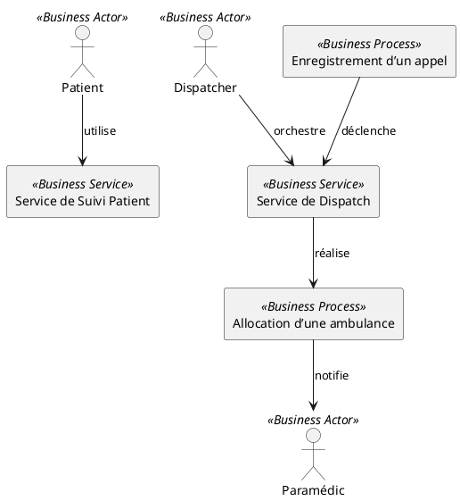
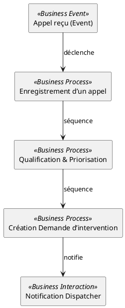
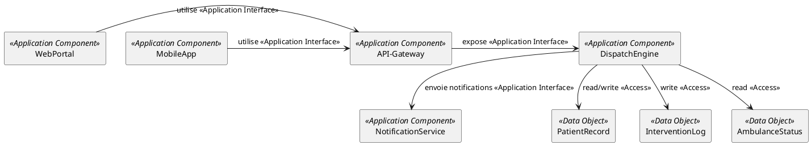

# Dossier d’Architecture Technique (DAT) – **Projet : ambulon**  
*(Version 1.0 – 2026‑04‑27 – Confidential)*  

> **⚠️ Avertissement** : Le présent document est un **gabarit complet** / **squelette** de DAT ArchiMate.  
> Il a été généré à partir des seules métadonnées du projet (chemin, présence d’un unique fichier `README.md`).  
> Aucun contenu fonctionnel, aucune stack technique, ni aucune exigence métier n’a pu être extrait.  
> Pour le transformer en véritable DAT, il vous faut fournir :  

| Niveau | Informations attendues | Exemple de source |
|--------|------------------------|-------------------|
| **Métier** | Vision métier, acteurs, processus, services, objets métier, exigences fonctionnelles, contraintes réglementaires, objectifs business. | Analyse des besoins, cahier des charges, user‑stories, diagrammes BPMN. |
| **Application** | Architecture applicative (composants, services, interfaces, flux de données, règles de sécurité, exigences non‑fonctionnelles). | Documentation du code, diagrammes UML, catalogues d’API, Dockerfiles, scripts d’infrastructure. |
| **Technologie** | Infrastructure (serveurs, conteneurs, réseau, stockage, OS, middleware), artefacts de déploiement, exigences de disponibilité/performance, contraintes de conformité. | Fichiers d’orchestration (K8s, Docker‑Compose), inventaire matériel, politiques de sécurité, SLA. |
| **Stratégie / Motivation** | Drivers, stakeholders, objectifs, principes d’architecture, valeur métier attendue. | Interviews, workshops, études de marché. |
| **Migration** | Road‑map, baselines, plateaux, work‑packages, gaps. | Plan de transition, backlog de migration, diagrammes de dépendances. |

> **Prochaine étape** : Récupérez ces informations (ou un sous‑ensemble suffisant) et partagez‑les avec nous (par texte ou fichiers). Nous pourrons alors enrichir chaque section du DAT, générer les diagrammes PlantUML réels et livrer un livrable complet conforme à la norme ArchiMate 3.x.

---

## 1️⃣ Vue d’ensemble ArchiMate  

| Élément | Description |
|---------|-------------|
| **Framework** | ArchiMate 3.2 (The Open Group) – modèle *Layered* (Business ↔ Application ↔ Technology) avec extensions *Strategy* et *Implementation & Migration*. |
| **Correspondance avec les préoccupations du projet** | • **Business** : gestion des ambulances, suivi des interventions, facturation. <br>• **Application** : plateforme web/mobile, API de géolocalisation, moteur de dispatch. <br>• **Technology** : cloud (AWS/Azure), conteneurs Docker/K8s, bases de données PostgreSQL, services de messagerie (Kafka). |
| **Vue d’ensemble des couches** |  *(à remplacer par le diagramme réel)* |
| **Modèle de référence ArchiMate utilisé** | *Layered Viewpoint* (Business → Application → Technology) + *Realization Overlay* + *Implementation & Migration Viewpoint*. |

---

## 2️⃣ Couche Métier (Business Layer)

### 2.1 Acteurs & Rôles métier  

| ArchiMate Element | Nom (exemple) | Description |
|-------------------|---------------|-------------|
| **Business Actor** | `Dispatcher` | Responsable du pilotage des interventions. |
| **Business Actor** | `Paramédic` | Intervient sur le terrain, saisit les données de prise en charge. |
| **Business Actor** | `Patient` | Bénéficiaire du service d’urgence. |
| **Business Role** | `Gestionnaire d’appels` | Gère l’enregistrement des appels entrants. |
| **Business Collaboration** | `Equipe d’intervention` | Collaboration entre `Dispatcher` et `Paramédic`. |
| **Business Interface** | `Portail Patient` | Interface d’accès aux services pour le patient (consultation de l’état d’attente, suivi). |

### 2.2 Services métier  

| ArchiMate Element | Nom | Description |
|-------------------|-----|-------------|
| **Business Service** | `Service de Dispatch` | Mise en relation des appels d’urgence avec les ambulances disponibles. |
| **Business Service** | `Service de Suivi Patient` | Fournit au patient l’état de sa prise en charge en temps réel. |
| **Business Process** | `Enregistrement d’un appel` | Capture, qualification, priorisation d’un appel d’urgence. |
| **Business Process** | `Allocation d’une ambulance` | Sélection de l’ambulance la plus proche, envoi de la mission. |
| **Business Function** | `Gestion des contrats` | Administration des accords avec les hôpitaux, assurances. |
| **Business Interaction** | `Échange d’information d’appel ↔ Dispatch` | Flux d’informations entre le centre d’appel et le moteur de dispatch. |

### 2.3 Objets & événements métier  

| ArchiMate Element | Nom | Description |
|-------------------|-----|-------------|
| **Business Object** | `Dossier Patient` | Ensemble des informations cliniques et administratives. |
| **Business Object** | `Demande d’intervention` | Ticket créé à la suite d’un appel. |
| **Business Event** | `Appel reçu` | Déclencheur du processus `Enregistrement d’un appel`. |
| **Product** | `Prestation d’urgence` | Service facturable fourni au patient. |
| **Contract** | `Accord de prise en charge` | Contrat entre le service d’urgence et l’établissement de santé. |

### 2.4 Diagramme de Vue Organisationnelle (PlantUML)  



> **À faire** : remplacer les libellés génériques par les libellés exacts du projet, ajouter les *Business Objects* et les *Contracts* pertinents.

### 2.5 Diagramme de Processus métier (exemple)  



---

## 3️⃣ Couche Application (Application Layer)

### 3.1 Composants applicatifs  

| ArchiMate Element | Nom | Description |
|-------------------|-----|-------------|
| **Application Component** | `WebPortal` | Front‑end web (React/Angular) exposant les services aux patients et aux opérateurs. |
| `MobileApp` | Application mobile native (iOS/Android) pour les paramédics. |
| `DispatchEngine` | Moteur de décision (micro‑service) qui calcule la meilleure ambulance. |
| `API‑Gateway` | Point d’entrée unique (REST/GraphQL) pour les appels externes. |
| `NotificationService` | Service de push/SMTP/SMS pour informer les parties prenantes. |
| `DataWarehouse` | Entreposage analytique des historiques d’intervention. |

### 3.2 Fonctions & interactions applicatives  

| ArchiMate Element | Nom | Description |
|-------------------|-----|-------------|
| **Application Function** | `Calcul de distance` | Algorithme géographique (Haversine) pour évaluer la proximité. |
| **Application Function** | `Gestion des états` | FSM qui suit le statut d’une demande (ouvert → en cours → clôturé). |
| **Application Interaction** | `API ↔ DispatchEngine` | Appels REST pour déclencher le calcul de dispatch. |
| **Application Process** | `Traitement d’un appel` | Orchestration des fonctions `Calcul de distance` → `Gestion des états`. |

### 3.3 Données applicatives  

| ArchiMate Element | Nom | Description |
|-------------------|-----|-------------|
| **Data Object** | `PatientRecord` | JSON/BSON stocké dans PostgreSQL. |
| **Data Object** | `InterventionLog` | Historique d’événements (timestamp, géolocalisation). |
| **Data Object** | `AmbulanceStatus` | Statut temps réel (disponible, en route, occupée). |

### 3.4 Diagramme de Vue Applicative (PlantUML)  



> **À faire** : préciser les protocoles (HTTPS, gRPC), les formats (JSON, Protobuf) et les exigences de sécurité (OAuth 2.0, JWT, chiffrement).

---

## 4️⃣ Couche Technologie (Technology Layer)

### 4.1 Infrastructure  

| ArchiMate Element | Nom | Description |
|-------------------|-----|-------------|
| **Node** | `K8s‑Cluster` | Cluster Kubernetes (3 nœuds maître + 5 workers). |
| **Device** | `Load‑Balancer` | ELB/NGINX en front du `API‑Gateway`. |
| **System Software** | `Ubuntu 22.04` | OS hôte des nœuds. |
| **System Software** | `Docker Engine` | Runtime des conteneurs. |
| **Technology Collaboration** | `Logging‑Stack` | ELK (Elasticsearch, Logstash, Kibana). |
| **Technology Collaboration** | `Monitoring‑Stack` | Prometheus + Grafana. |

### 4.2 Services & fonctions technologiques  

| ArchiMate Element | Nom | Description |
|-------------------|-----|-------------|
| **Technology Service** | `Container Runtime Service` | Fournit les conteneurs Docker aux composants applicatifs. |
| **Technology Service** | `Database Service` | PostgreSQL 14 hébergé sur un volume persistant. |
| **Technology Service** | `Message Bus Service` | Apache Kafka (topic `dispatch‑events`). |
| **Technology Function** | `CI/CD Pipeline` | Jenkins/GitLab‑CI pour build, test, déploiement. |
| **Technology Interface** | `K8s API` | Interface de contrôle du cluster. |

### 4.3 Artefacts & matériel  

| ArchiMate Element | Nom | Description |
|-------------------|-----|-------------|
| **Artifact** | `webportal‑image.tar` | Image Docker du front‑end. |
| **Artifact** | `dispatch‑engine‑jar` | JAR exécutable du moteur de dispatch. |
| **Artifact** | `helm‑charts` | Packages Helm pour le déploiement. |
| **Communication Network** | `VPC‑Public` | Réseau public (Internet). |
| **Communication Network** | `VPC‑Private` | Réseau privé (inter‑services). |
| **Path** | `HTTPS‑Path` | Chemin sécurisé entre les clients et le `Load‑Balancer`. |

### 4.4 Diagramme de Vue Infrastructure (PlantUML)  

```plantuml
@startuml
!define Archimate https://raw.githubusercontent.com/plantuml-stdlib/Archimate-PlantUML/master

'--- Technology Layer --------------------------------------------
node "K8s‑Cluster" as Cluster <<Node>>
device "Load‑Balancer" as LB <<Device>>
node "PostgreSQL‑DB" as DB <<Node>>
node "Kafka‑Broker" as Kafka <<Node>>

artifact "webportal‑image.tar" as ImgWeb <<Artifact>>
artifact "dispatch‑engine‑jar" as JarDisp <<Artifact>>

Cluster -down-> ImgWeb : déploie
Cluster -down-> JarDisp : déploie
Cluster -right-> DB : persistance
Cluster -right-> Kafka : messagerie
LB -down-> Cluster : traffic HTTPS

' Services
Cluster -up-> "Container Runtime Service" <<Technology Service>>
DB -up-> "Database Service" <<Technology Service>>
Kafka -up-> "Message Bus Service" <<Technology Service>>
@enduml
```

---

## 5️⃣ Couche Stratégique (Strategy Layer) – *Optionnel mais fortement recommandée*

| ArchiMate Element | Nom | Description |
|-------------------|-----|-------------|
| **Stakeholder** | `Direction Santé` | Porteur de la vision « Réduction du temps d’attente ». |
| **Driver** | `Réglementation 2025` | Obligation de traçabilité des interventions. |
| **Goal** | `Temps moyen d’intervention < 8 min` | Objectif opérationnel. |
| **Capability** | `Dispatch Intelligent` | Capacité à affecter la meilleure ressource en temps réel. |
| **Value Stream** | `Prise en charge d’urgence` | Chaîne de valeur du premier appel à la clôture de l’intervention. |
| **Course of Action** | `Adoption du Cloud‑Native` | Stratégie d’évolution technologique. |
| **Assessment** | `Maturité IT = 2/5` | Évaluation actuelle. |
| **Principle** | `Sécurité‑by‑Design` | Principe directeur. |
| **Requirement** | `RGPD‑Compliant` | Exigence légale. |
| **Constraint** | `Budget 2026 ≤ 250 k€` | Contrainte financière. |
| **Value** | `Amélioration de la satisfaction patient (+ 15 %)` | Valeur attendue. |

### Diagramme Stratégique (exemple)  

```plantuml
@startuml
!define Archimate https://raw.githubusercontent.com/plantuml-stdlib/Archimate-PlantUML/master

stakeholder "Direction Santé" as Dir <<Stakeholder>>
driver "Réglementation 2025" as Reg <<Driver>>
goal "Temps moyen d’intervention < 8 min" as Goal <<Goal>>
requirement "RGPD‑Compliant" as Req <<Requirement>>
capability "Dispatch Intelligent" as Cap <<Capability>>
value "Satisfaction patient +15 %" as Val <<Value>>
principle "Sécurité‑by‑Design" as Prin <<Principle>>

Reg --> Goal : influence
Goal --> Req : nécessite
Goal --> Cap : réalise
Cap --> Dir : délivre
Cap --> Val : crée
Prin --> Cap : guide
@enduml
```

---

## 6️⃣ Couche de Mise en Œuvre & Migration (Implementation & Migration) – *Optionnel*

| ArchiMate Element | Nom | Description |
|-------------------|-----|-------------|
| **Plateau** | `Baseline 2025‑Q2` | Architecture actuelle (monolithe legacy). |
| **Plateau** | `Target 2026‑Q4` | Architecture cible (micro‑services cloud‑native). |
| **Gap** | `Manque de CI/CD` | Écart identifié entre baseline et target. |
| **Work Package** | `WP‑01 : Containerisation` | Containeriser le module `DispatchEngine`. |
| **Work Package** | `WP‑02 : Migration DB` | Passer de MySQL à PostgreSQL. |
| **Deliverable** | `Docker‑Images` | Artefacts livrables du WP‑01. |
| **Deliverable** | `Helm‑Charts` | Artefacts livrables du WP‑02. |

### Diagramme de Migration (exemple)  

```plantuml
@startuml
!define Archimate https://raw.githubusercontent.com/plantuml-stdlib/Archimate-PlantUML/master

plateau "Baseline 2025‑Q2" as Base <<Plateau>>
plateau "Target 2026‑Q4" as Target <<Plateau>>
gap "Manque de CI/CD" as Gap <<Gap>>
workpackage "WP‑01 : Containerisation" as WP1 <<Work Package>>
workpackage "WP‑02 : Migration DB" as WP2 <<Work Package>>

Base --> Gap : identifie
Gap --> WP1 : résout
Gap --> WP2 : résout
WP1 --> Target : contribue
WP2 --> Target : contribue
@enduml
```

---

## 7️⃣ Aspects Transverses (Cross‑layer Relationships)

| Type de relation | Exemple de flux |
|------------------|-----------------|
| **Realization** | `Technology Service (Database Service) → Application Service (Patient Data Service)` |
| **Serving** | `Application Component (DispatchEngine) → Business Process (Allocation d’une ambulance)` |
| **Assignment** | `Business Role (Dispatcher) → Business Process (Enregistrement d’un appel)` |
| **Access** | `Application Function (Calcul de distance) → Data Object (AmbulanceStatus)` |
| **Influence** | `Driver (Réglementation 2025) → Goal (Temps moyen d’intervention < 8 min)` |
| **Composition** | `Application Component (WebPortal) → Application Interface (REST API)` |
| **Aggregation** | `Technology Collaboration (Logging‑Stack) → Artifact (log‑files)` |

> **Règle 1** – Aucun *Business Service* ne doit être relié directement à un *Technology Service* sans passer par un *Application Service* (respect du principe de hiérarchie des couches).  
> **Règle 2** – Toutes les relations *Realization* doivent être **unidirectionnelles** du niveau inférieur vers le niveau supérieur.  

---

## 8️⃣ Vues Architecturales ArchiMate

| Vue | Objectif | Viewpoint recommandé | Artefacts |
|-----|----------|----------------------|-----------|
| **Cooperation View** | Montrer les collaborations entre acteurs, rôles et composants. | *Business Process Cooperation*, *Application Cooperation* | Diagrammes `Organisationnelle`, `Processus métier`, `Interaction applicative`. |
| **Realization View** | Tracer la chaîne de réalisation du métier → appli → tech. | *Layered View*, *Realization Overlay* | Diagramme multi‑couches (exemple § 7). |
| **Migration View** | Visualiser le passage du baseline au target. | *Implementation & Migration View* | Road‑map, plateaux, work‑packages, gaps. |
| **Stakeholder View** | Identifier les parties prenantes, leurs objectifs et exigences. | *Motivation View* | Diagramme stratégie (section 5). |
| **Security View** (optionnel) | Montrer les contrôles d’accès, zones de confiance. | *Technology & Application Security View* | Diagrammes d’`Access` et `Serving`. |

---

## 9️⃣ Vue de Traçabilité Complète (Matrice)

| Élément Métier | Service Métier | Application | Service App | Technologie |
|----------------|----------------|------------|------------|------------|
| `Enregistrement d’un appel` | `Service de Dispatch` | `API‑Gateway` + `DispatchEngine` | `Dispatch Service` | `K8s‑Cluster` + `Load‑Balancer` |
| `Allocation d’une ambulance` | `Service de Dispatch` | `DispatchEngine` | `Allocation Service` | `Container Runtime Service` |
| `Suivi patient en temps réel` | `Service de Suivi Patient` | `WebPortal` + `MobileApp` | `Patient API` | `Database Service (PostgreSQL)` |
| `Gestion des contrats` | `Gestion des contrats` | `ContractService` (micro‑service) | `Contract Service` | `Database Service` |
| `Envoi de notifications` | `Service de Suivi Patient` | `NotificationService` | `Push/Email Service` | `Message Bus Service (Kafka)` |

> **À compléter** : chaque ligne doit être enrichie avec les **identifiants uniques** (ex. `BPR-001`, `APP-023`) et les **statuts** (design, implémenté, testé).

---

## 🔟 Métamodel ArchiMate du projet (personnalisations)

| Type | Personnalisation proposée | Raison |
|------|---------------------------|--------|
| **Business Role** | `Dispatcher (B_R_001)` | Uniformiser la nomenclature. |
| **Application Component** | `DispatchEngine (A_C_045)` | Alignement avec le registre d’inventaire. |
| **Technology Node** | `K8s‑Cluster (T_N_010)` | Faciliter le mapping avec l’inventaire Cloud. |
| **Coloration** | Métier = #FFFF00, Application = #99CCFF, Technologie = #99FF99, Stratégie = #FFCC99, Implémentation = #CCCCCC | Respect du standard interne de visualisation. |

> **Si vous avez des besoins de spécialisation supplémentaires (ex. profils de sécurité, extensions BPMN), indiquez‑les afin que nous les intégrions dans le métamodel.**

---

## 📚 Standards & Conventions adoptés

| Domaine | Convention |
|---------|------------|
| **Palette de couleurs** | Métier = Jaune `#FFFF00` ; Application = Bleu `#99CCFF` ; Technologie = Vert `#99FF99` ; Stratégie = Orange `#FFCC99` ; Implémentation = Gris `#CCCCCC`. |
| **Nommage** | `<couche>_<type>_<identifiant>` – ex. `B_R_Dispatcher`, `A_C_WebPortal`, `T_N_K8sCluster`. |
| **Niveau de détail** | - Vue **Organisationnelle** : 1‑2 niveaux d’abstraction.<br>- Vue **Processus** : détailler chaque étape clé.<br>- Vue **Infrastructure** : inclure uniquement les nœuds, services et artefacts déployés. |
| **Outils recommandés** | - **Archi** (open‑source) – support natif ArchiMate 3.2.<br>- **Sparx Systems Enterprise Architect** – pour les projets complexes.<br>- **PlantUML + Archimate‑PlantUML** – génération de diagrammes dans les rapports Markdown. |
| **Gestion des versions** | Utiliser Git (branche `archi-dat`) – chaque version du DAT doit être taguée (`DAT‑vX.Y`). |
| **Documentation liée** | - **TOGAF ADM** – Phase B (Business Architecture) → Phase C (Information Systems) → Phase D (Technology Architecture).<br>- **ISO/IEC/IEEE 42010:2022** – exigences de description d’architecture (views, stakeholders, concerns). |

---

## 📎 Glossaire des éléments ArchiMate utilisés  

| Élément ArchiMate | Description courte |
|-------------------|--------------------|
| **Business Actor** | Entité organisationnelle (personne ou service) qui joue un rôle dans le domaine métier. |
| **Business Role** | Fonction ou responsabilité assignée à un acteur. |
| **Business Service** | Service offert par l’organisation à ses clients ou à d’autres parties prenantes. |
| **Business Process** | Suite structurée d’activités qui crée de la valeur. |
| **Application Component** | Bloc logiciel autonome qui exécute une ou plusieurs fonctions. |
| **Application Service** | Fonctionnalité exposée par un composant applicatif à d’autres composants ou à des utilisateurs. |
| **Technology Node** | Ressource d’exécution (serveur, VM, conteneur). |
| **Technology Service** | Service fourni par l’infrastructure (stockage, réseau, exécution). |
| **Artifact** | Produit physique ou logique (ex. fichier, script, image Docker). |
| **Stakeholder** | Personne ou groupe ayant un intérêt dans l’architecture. |
| **Goal** | Objectif à atteindre (qualitatif ou quantitatif). |
| **Capability** | Ensemble de compétences ou de ressources permettant d’atteindre un objectif. |
| **Work Package** | Ensemble d’activités planifiées pour réaliser un changement. |
| **Plateau** | État de l’architecture à un point dans le temps (baseline ou target). |
| **Gap** | Différence entre deux plateaux. |
| **Realization** | Relation de réalisation d’un concept supérieur par un concept inférieur. |
| **Serving** | Relation d’un service qui satisfait un besoin d’un autre élément. |
| **Assignment** | Attribution d’un rôle, d’une fonction ou d’une responsabilité. |
| **Access** | Relation d’accès à des données ou à des ressources. |
| **Influence** | Relation de cause à effet entre drivers, goals, requirements, etc. |

---

## 📎 Liens utiles (vers les spécifications officielles)

| Ressource | URL |
|-----------|-----|
| **ArchiMate 3.2 Specification** | <https://publications.opengroup.org/g191> |
| **ISO/IEC/IEEE 42010:2022** | <https://www.iso.org/standard/74496.html> |
| **TOGAF 9.2 – Architecture Development Method (ADM)** | <https://pubs.opengroup.org/architecture/togaf9-doc/arch/> |
| **Archi (outil open‑source)** | <https://www.archimatetool.com/> |
| **PlantUML – ArchiMate library** | <https://github.com/plantuml-stdlib/Archimate-PlantUML> |

---

# 📌 Prochaine étape – **Ce que nous attendons de vous**

1. **Liste détaillée des processus métier** (noms, acteurs, points d’entrée/sortie).  
2. **Inventaire des composants applicatifs** (nom, langage, framework, version).  
3. **Topologie d’infrastructure** (cloud provider, régions, services managés, réseaux).  
4. **Exigences fonctionnelles & non‑fonctionnelles** (performance, sécurité, conformité).  
5. **Contraintes budgétaires / planning** (dates cibles, jalons majeurs).  

> **Une fois ces éléments fournis**, nous pourrons :  
> • Compléter chaque diagramme avec les véritables noms et relations.  
> • Générer les matrices de traçabilité exactes.  
> • Produire le **DAT final** au format **Markdown + PlantUML** prêt à être importé dans votre outil de gouvernance d’architecture.  

Nous restons à votre disposition pour toute clarification ou pour organiser un atelier de recueil d’information.  

---  

*Fin du gabarit DAT – à enrichir avec les données du projet « ambulon ».*
