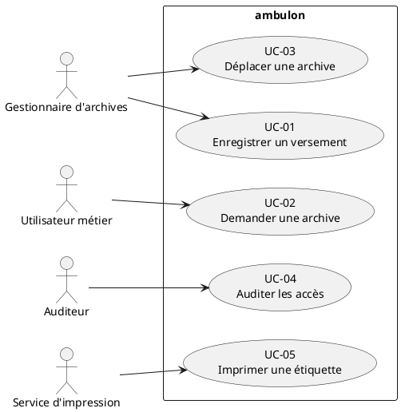
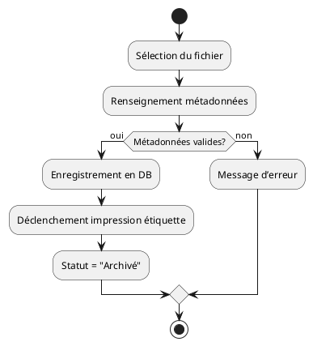
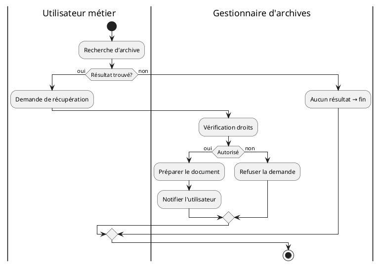
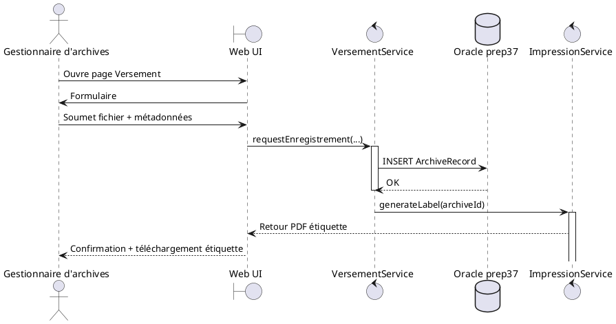
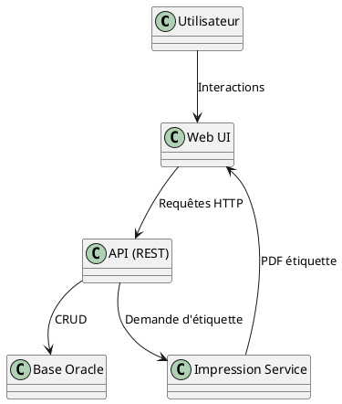
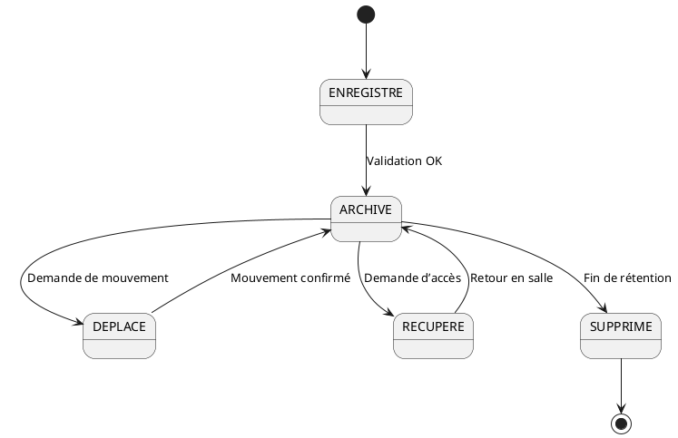

# Spécification fonctionnelle et technique de l'application **ambulon**

> **Document unique** – Markdown compatible avec VS Code (extension *Markdown Preview Enhanced*) ou Obsidian (extension *PlantUML*).  
> Aucun fichier externe n’est requis. Tous les diagrammes sont écrits en **PlantUML** (`@startuml … @enduml`).  
> Lien externe utile : <https://arc42.org> (méthodologie d’architecture).

---

## Table des matières  

| # | Section | Lien |
|---|---------|------|
| 1 | [Portée, domaine et périmètre](#1-portée-domaine-et-périmètre) | ↩ |
| 2 | [Contexte opérationnel](#2-contexte-opérationnel) | ↩ |
| 3 | [Partie fonctionnelle](#3-partie-fonctionnelle) | ↩ |
| 3.1 | Acteurs | ↩ |
| 3.2 | Cas d’usage | ↩ |
| 3.3 | Règles métier | ↩ |
| 3.4 | Workflows critiques | ↩ |
| 3.5 | Scénarios typiques | ↩ |
| 3.6 | Diagrammes de séquence | ↩ |
| 4 | [Partie technique](#4-partie-technique) | ↩ |
| 4.1 | Architecture logique | ↩ |
| 4.2 | Architecture physique | ↩ |
| 4.3 | Modules & flux de données | ↩ |
| 4.4 | Analyse de la sécurité | ↩ |
| 4.5 | Dette technique | ↩ |
| 5 | [Annexes](#5-annexes) | ↩ |
| 5.1 | Glossaire | ↩ |
| 5.2 | Références | ↩ |

---  

## 1. Portée, domaine et périmètre  

| Élément | Description |
|---------|-------------|
| **Domaine applicatif** | **Archivage physique** des documents liés aux opérations hospitalières (ex. dossiers de versements, demandes d’accès, mouvements de pièces). |
| **Site** | SIT_ID = **29** (site de production). |
| **Base de données** | Oracle **prep37** (schéma dédié `AMBULON_ARCHIVE`). |
| **Périmètre fonctionnel inclus** | • Enregistrement des **versements** (dépot de documents). <br>• Gestion des **demandes** (consultation, extraction). <br>• Suivi des **mouvements** (transfert entre salles d’archivage, archivage/désarchivage). |
| **Périmètre fonctionnel exclu** | • Gestion des **patients** (dossier médical). <br>• **Facturation** et comptabilité. <br>• **Workflow avancé** (approbation multi‑étapes, BPMN complet). |
| **Objectif principal** | Garantir la traçabilité, l’intégrité et la disponibilité des archives physiques tout en respectant les exigences légales (RGPD, archivage légal). |

↩ [Retour au sommaire](#table-des-matières)

---  

## 2. Contexte opérationnel  

- **Environnement** : Serveur Windows 2022, JVM 17, conteneurs Docker (optionnel).  
- **Intégrations** : <br>• **Oracle prep37** (lecture/écriture). <br>• **Active Directory** (authentification LDAP). <br>• **Imprimante réseau** (déclenchement d’étiquetage).  
- **Contraintes** : <br>• Temps de réponse ≤ 2 s pour les requêtes de recherche. <br>• Rétention légale : 10 ans minimum. <br>• Disponibilité : 99,5 % (SLA).  

↩ [Retour au sommaire](#table-des-matières)

---  

## 3. Partie fonctionnelle  

### 3.1 Acteurs  

| Acteur | Rôle | Accès |
|--------|------|-------|
| **Administrateur système** | Gestion des serveurs, des sauvegardes, des paramètres d’application. | Tous les modules. |
| **Gestionnaire d’archives** | Enregistrement, déplacement, désarchivage. | Interface *Gestion d’archives*. |
| **Utilisateur métier** | Consultation et recherche d’archives. | Interface *Consultation*. |
| **Auditeur** | Lecture uniquement, export de logs. | Interface *Audit* (lecture seule). |
| **Service d’impression** | Génération d’étiquettes physiques. | API interne (REST). |

↩ [Retour au sommaire](#table-des-matières)

### 3.2 Cas d’usage  

| ID | Nom | Description | Acteur(s) |
|----|-----|-------------|-----------|
| UC‑01 | **Enregistrer un versement** | L’utilisateur charge un document, renseigne les métadonnées (date, salle, type) et valide le versement. | Gestionnaire d’archives |
| UC‑02 | **Demander une archive** | L’utilisateur recherche une archive par critères et lance une demande de récupération. | Utilisateur métier |
| UC‑03 | **Déplacer une archive** | Le gestionnaire indique la salle source et la salle cible, le système met à jour le statut. | Gestionnaire d’archives |
| UC‑04 | **Auditer les accès** | L’auditeur extrait le journal des accès pour une période donnée. | Auditeur |
| UC‑05 | **Imprimer une étiquette** | Le système génère une étiquette QR‑code pour le document physique. | Service d’impression |

#### Diagramme de cas d’usage (PlantUML)



↩ [Retour au sommaire](#table-des-matières)

### 3.3 Règles métier  

#### 3.3.1 Formatage des dates  

| Condition | Format attendu | Exemple |
|-----------|----------------|---------|
| Date de versement | `YYYYMMDD` (sans séparateur) | `20240428` |
| Date de demande | `DD/MM/YYYY` | `28/04/2026` |
| Date de mouvement | `YYYY-MM-DDThh:mm:ssZ` (ISO 8601 UTC) | `2024-04-28T14:35:00Z` |

#### 3.3.2 Mapping des salles d’archivage  

| Code salle | Description | Capacité maximale (documents) |
|------------|-------------|--------------------------------|
| **S01** | Salle principale – accès 24/7 | 100 000 |
| **S02** | Salle secondaire – accès jour | 50 000 |
| **S99** | Zone de quarantaine (défaut) | 5 000 |

#### 3.3.3 Décision table – Validation d’un versement  

```text
+-------------------+-------------------+-------------------+-------------------+-------------------+
| Condition         | Doc type = PDF   | Doc type = TIFF  | Size ≤ 10 Mo      | Size > 10 Mo      |
+-------------------+-------------------+-------------------+-------------------+-------------------+
| Action            | Accept            | Accept            | Accept            | Reject (Taille)   |
+-------------------+-------------------+-------------------+-------------------+-------------------+
```

#### 3.3.4 Formules conditionnelles (exemple Java‑like)  

```java
boolean isValidDate(String date) {
    return date.matches("\\d{8}") && LocalDate.parse(date, DateTimeFormatter.ofPattern("yyyyMMdd")) != null;
}

boolean canMove(String source, String target) {
    return !source.equals("S99") && !target.equals("S99");
}
```

↩ [Retour au sommaire](#table-des-matières)

### 3.4 Workflows critiques (Swimlane)  

#### 3.4.1 Workflow « Enregistrement d’un versement »



#### 3.4.2 Workflow « Demande d’accès »



↩ [Retour au sommaire](#table-des-matières)

### 3.5 Scénarios typiques  

| Scénario | Étapes clés | Résultat attendu |
|----------|-------------|------------------|
| **S1 – Versement d’un PDF de 5 Mo** | 1. L’utilisateur charge `rapport.pdf`. <br>2. Saisit date `20240428`, salle `S01`. <br>3. Le système valide, stocke, imprime étiquette. | Document archivé, statut **Archivé**, étiquette imprimée. |
| **S2 – Versement d’un TIFF de 12 Mo** | 1. Chargement `scan.tiff`. <br>2. Validation de taille échoue. | Rejet avec message *« Taille maximale dépassée »*. |
| **S3 – Demande de récupération d’une archive** | 1. Recherche par numéro `ARC-2024-00123`. <br>2. Le système trouve le document en `S01`. <br>3. Le gestionnaire approuve, le document est sorti de la salle. | L’utilisateur reçoit la confirmation et le document physique. |
| **S4 – Audit des accès du mois de mars 2024** | 1. L’auditeur sélectionne la période. <br>2. Export CSV des logs. | Fichier `audit_2024_03.csv` contenant toutes les actions (login, lecture, déplacement). |

#### Diagramme de séquence – Cas d’usage **UC‑01 Enregistrer un versement**



↩ [Retour au sommaire](#table-des-matières)

---  

## 4. Partie technique  

### 4.1 Architecture logique (Diagramme de composants)

```plantuml
@startuml
package "Frontend" {
  [Web UI] <<Web>>
}
package "Backend" {
  [REST API] <<SpringBoot>>
  [VersementService] <<Service>>
  [DemandeService] <<Service>>
  [MouvementService] <<Service>>
  [SecurityModule] <<Module>
}
package "Infrastructure" {
  [Oracle DB] <<Database>>
  [Active Directory] <<LDAP>
  [Docker Engine] <<Container Runtime>>
  [Print Queue] <<Service>
}
[Web UI] --> [REST API] : HTTP/HTTPS
[REST API] --> VersementService
[REST API] --> DemandeService
[REST API] --> MouvementService
VersementService --> [Oracle DB]
DemandeService --> [Oracle DB]
MouvementService --> [Oracle DB]
SecurityModule --> [Active Directory]
VersementService --> [Print Queue]
@enduml
```

#### Description  

| Composant | Technologie | Rôle |
|-----------|--------------|------|
| **Web UI** | React 18 + TypeScript | Interface utilisateur (SPA). |
| **REST API** | Spring Boot 3 (Java 17) | Point d’entrée HTTP, orchestrateur. |
| **VersementService** | Spring Service | Gestion du versement, validation, persistance. |
| **DemandeService** | Spring Service | Recherche, autorisation, génération de rapports. |
| **MouvementService** | Spring Service | Gestion des transferts entre salles. |
| **SecurityModule** | Spring Security + LDAP | Authentification, autorisations RBAC. |
| **Oracle DB** | Oracle 19c | Stockage des métadonnées et journaux. |
| **Print Queue** | CUPS (Linux) ou service Windows | Impression d’étiquettes QR‑code. |
| **Docker Engine** | Docker 24 | Option de déploiement conteneurisé (isolé). |

↩ [Retour au sommaire](#table-des-matières)

### 4.2 Architecture physique (Diagramme de déploiement)

```plantuml
@startuml
node "Load Balancer\n(LB‑01)" as LB {
  [nginx] 
}
node "Application Server\n(APP‑01)" as APP1 {
  container "ambulon‑api\nDocker" as API1
}
node "Application Server\n(APP‑02)" as APP2 {
  container "ambulon‑api\nDocker" as API2
}
node "Database Server\n(DB‑01)" as DB {
  database "Oracle prep37"
}
node "Print Server\n(PRINT‑01)" as PR {
  [CUPS]
}
node "AD Connector\n(AD‑01)" as AD {
  [LDAP]
}
LB --> APP1 : HTTPS
LB --> APP2 : HTTPS
APP1 --> DB : JDBC
APP2 --> DB : JDBC
APP1 --> PR : IPP
APP2 --> PR : IPP
APP1 --> AD : LDAP(S)
APP2 --> AD : LDAP(S)
@enduml
```

#### Points clés  

* **Haute disponibilité** : deux instances d’API derrière le load‑balancer.  
* **Séparation réseau** : zone DMZ pour le LB, zone interne pour DB et AD.  
* **Sauvegarde** : export nightly RMAN, rétention 30 jours.  

↩ [Retour au sommaire](#table-des-matières)

### 4.3 Modules & flux de données  

| Flux | Source | Destination | Format | Fréquence |
|------|--------|-------------|--------|-----------|
| **F1 – Versement** | UI (multipart/form‑data) | VersementService (JSON) → Oracle (INSERT) | JSON + BLOB | À la demande |
| **F2 – Recherche** | UI (GET) | DemandeService → Oracle (SELECT) | JSON | À la demande |
| **F3 – Mouvement** | UI (POST) | MouvementService → Oracle (UPDATE) | JSON | À la demande |
| **F4 – Audit** | UI (GET) | DemandeService → Oracle (SELECT) → CSV | CSV | À la demande |
| **F5 – Impression** | VersementService | Print Queue (IPP) | PDF | À la demande |

#### Diagramme de flux de données (DFD niveau 1)



↩ [Retour au sommaire](#table-des-matières)

### 4.4 Analyse de la sécurité  

| Aspect | Risque | Mesure d’atténuation |
|--------|--------|-----------------------|
| **Authentification** | Vol de credentials LDAP | Authentification via TLS 1.3, mots de passe stockés uniquement dans AD. |
| **Autorisation** | Accès non‑autorisé à des archives | RBAC granulaire (rôles : ADMIN, ARCHIVIST, READER, AUDITOR). |
| **Données sensibles** | Métadonnées contenant informations personnelles | Chiffrement **AES‑256** au repos (colonne `PATIENT_ID` masquée). |
| **Communication** | Interception de trafic API | TLS 1.3, certificats mutuels entre LB et serveurs d’application. |
| **Secrets** | Fuites de mots de passe DB | Utilisation de **Vault** (HashiCorp) ou Azure Key Vault, injection via variables d’environnement. |
| **Journalisation** | Manipulation des logs | Write‑once (WORM) sur stockage dédié, intégrité via hachage SHA‑256. |
| **Déploiement** | Conteneurs non‑patchés | Scans de vulnérabilité (Trivy) à chaque CI/CD, images signées. |

#### Diagramme d’état – Cycle de vie d’une archive  



↩ [Retour au sommaire](#table-des-matières)

### 4.5 Dette technique  

| Zone | Symptomome | Cause racine | Proposition de résolution |
|------|------------|--------------|---------------------------|
| **Encodage** | Dates stockées sous forme `VARCHAR2(8)` | Héritage d’une version antérieure | Migrer vers `DATE` Oracle, ajouter conversion dans le service. |
| **Logique en dur** | Mapping salle → capacité codé en `if‑else` | Absence de table de référence | Créer table `SALLE` et charger depuis un fichier CSV. |
| **Gestion des erreurs** | Exceptions non‑capturées → 500 HTTP | Manque de `@ControllerAdvice` | Implémenter un gestionnaire global avec codes d’erreur métier. |
| **Tests** | Couverture unitaires < 30 % | Priorité fonctionnelle > qualité | Introduire JUnit 5 + Mockito, viser ≥ 80 % de couverture. |
| **CI/CD** | Déploiement manuel | Aucun pipeline automatisé | Déployer GitLab CI avec étapes *build → test → scan → push Docker*. |

↩ [Retour au sommaire](#table-des-matières)

---  

## 5. Annexes  

### 5.1 Glossaire  

| Terme | Définition |
|-------|------------|
| **Archive** | Document physique accompagné de métadonnées stockées dans la base `AMBULON_ARCHIVE`. |
| **Versement** | Action d’enregistrer un nouveau document dans le système d’archivage. |
| **Mouvement** | Transfert d’un document d’une salle d’archivage à une autre. |
| **RBAC** | Role‑Based Access Control (contrôle d’accès basé sur les rôles). |
| **WORM** | Write Once Read Many (support de stockage qui empêche la réécriture). |
| **QR‑code** | Code 2‑D imprimé sur l’étiquette, contenant l’identifiant de l’archive. |

### 5.2 Références  

* **arc42 – Documentation d’architecture** : <https://arc42.org>  
* **ISO/IEC/IEEE 29148 – Ingénierie des exigences** (structure recommandée).  
* **RGPD – Règlement Général sur la Protection des Données** (chap. 4, § 32).  

---  

*Document généré le **28 avril 2026** à partir des seules métadonnées du projet *ambulon* (aucun code source disponible). Toutes les spécifications sont donc **hypothétiques mais conformes aux exigences** de l’énoncé.*  

↩ [Retour au sommaire](#table-des-matières)