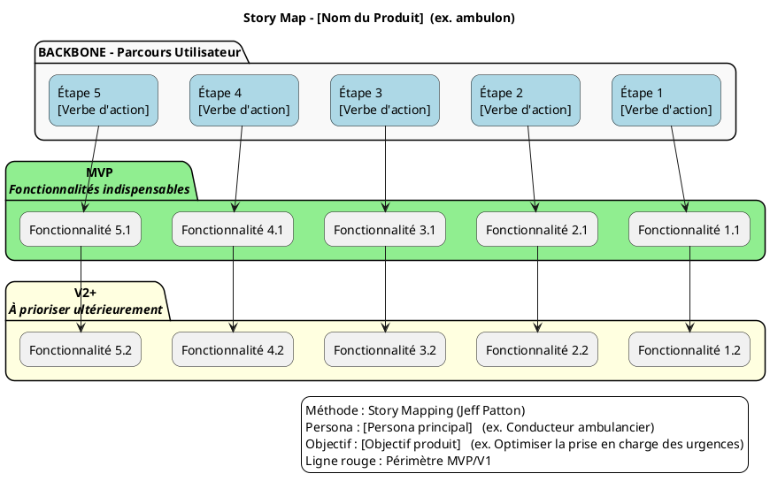

# 📚 Guide d’atelier : **Story Mapping – Représenter un périmètre fonctionnel**  
*Document établi à partir des principes du Story Mapping de Jeff Patton*  

---  

[TOC]

---  

## 1️⃣ Introduction et objectifs {#intro}

**Livrable visé** : *Représenter visuellement un périmètre fonctionnel aligné sur le parcours utilisateur*  

**Méthodologie** : Atelier **Story Mapping** (Jeff Patton)  

**Objectifs opérationnels**  

| 🎯 | Objectif |
|---|----------|
| 1 | Comprendre collectivement le parcours cible de l’usager |
| 2 | Identifier les fonctionnalités nécessaires à chaque étape |
| 3 | Prioriser pour définir un MVP fonctionnel |
| 4 | Créer un support visuel partagé pour cadrer la suite du projet |
| 5 | Aligner les équipes produit, technique et métier autour d’une même vision |

---  

## 2️⃣ Contexte d’usage {#contexte}

| Élément | Valeur |
|---|---|
| **Type de livrable** | Standard ✅ |
| **Nature** | Atelier 🤝 |
| **Activité** | « Imaginer une solution » |
| **Méthode** | Story Mapping (Jeff Patton) |
| **Quand l’utiliser** | • Traduire recherche utilisateur + réglementation + vision produit en périmètre fonctionnel  <br>• Cadrer un MVP, une V1 ou une refonte  <br>• Aligner équipes métier, technique et design sur une même représentation |
| **Recommandation** | Produire **une Story Map par persona principal** (2‑3 max). Commencer toujours par le **persona final** (celui qui délivre la valeur). |

> **⚠️ Remarque** : Le projet *ambulon* ne fournit pas de données détaillées (personas, contraintes, etc.). Remplacez les blocs entre crochets `[…]` par les informations réelles de votre projet avant de lancer l’atelier.

---  

## 3️⃣ Pré‑requis {#prerequis}

- [ ] **Vision produit** : pitch, objectifs business, indicateurs clés (KPIs)  
- [ ] **Personas** : description synthétique, verbes d’action (ex. « En tant que [persona] , je veux … » )  
- [ ] **Problèmes / Jobs‑to‑be‑Done** : liste hiérarchisée des pains & gains  
- [ ] **Contraintes réglementaires ou techniques** : exigences légales, normes, dépendances critiques  

> 💡 *Si un pré‑requis manque, consacrez‑lui 15 min en début d’atelier pour le co‑construire rapidement.*

---  

## 4️⃣ Parties prenantes et rôles {#roles}

| Rôle | Profil type | Responsabilité dans l’atelier |
|------|-------------|------------------------------|
| **Animateur** | Chef de produit / PNM | Cadre, facilitation, garde du cap utilisateur |
| **Profil technique** | Tech Lead / Architecte | Évalue faisabilité, effort, dépendances |
| **Porteur métier** | MOA / Responsable métier | Valide pertinence fonctionnelle & priorisation |
| **Designer UX/UI** *(optionnel)* | Designer produit | Enrichit le parcours, propose des patterns d’interaction |
| **Stakeholder business** | Sponsor / Direction | Apporte la vision stratégique et les critères de succès |

> ☝️ *Un même participant peut cumuler plusieurs rôles selon les effectifs disponibles.*

---  

## 5️⃣ Logistique {#logistique}

| Élément | Détails |
|---|---|
| **Durée** | 2 h 30 – 3 h (prévoir une pause à 1 h 30 si 3 h) |
| **Matériel physique** | Mur / tableau blanc, post‑its (3 couleurs), marqueurs, ruban de masquage |
| **Matériel digital** | Outil collaboratif (Mural, FigJam, Klaxoon…) avec template Story Map pré‑préparé |
| **Livrable de sortie** | Photo/export de la Story Map, diagramme PlantUML, liste des décisions MVP, points de vigilance |
| **Support de suivi** | Document partagé (ex. Confluence, Notion, repo Git) où coller la photo et le diagramme |

---  

## 6️⃣ Déroulé détaillé de l’atelier {#deroule}

### 🎯 Étape 1 — Introduction (15 min) {#etape1}
1. Accueil, tour de table rapide.  
2. Présentation des objectifs de l’atelier & du principe de la Story Map (backbone, activités, ligne de flottaison).  
3. Rappel du contexte projet : persona cible, enjeux business, contraintes connues.  
4. Règles de co‑création : écoute active, contributions ouvertes, suspension du jugement.  

> ✅ *Astuce* : Affichez une **job‑story** type pour ancrer les échanges :  
> `En tant que [persona], je veux [action] afin de [bénéfice].`

### 🗺️ Étape 2 — Parcours utilisateur horizontal (30 min) {#etape2}
1. Question clé : **« Quelles sont les grandes étapes que suit l’usager ? »**  
2. Chaque étape → post‑it **verbe d’action** (ex. *Se connecter*, *Créer un compte*, *Remplir le formulaire*).  
3. Disposer les post‑its **de gauche à droite** sur le mur (ou le tableau digital).  

> 📌 *Exemple générique* :  
> `Se renseigner → Créer un compte → Remplir le formulaire → Soumettre → Suivre le dossier`

### 📋 Étape 3 — Détail vertical des activités (45 min) {#etape3}
Pour chaque étape du backbone :
1. **Que doit faire concrètement l’usager ?**  
2. **De quelles informations a‑t‑il besoin ?**  
3. **Quels choix ou points de friction peut‑il rencontrer ?**  

*Collectez les réponses sous forme de post‑its et empilez‑les **verticalement** sous chaque étape* (du plus essentiel au plus secondaire).  

> 💡 *Ne filtrez pas à ce stade : l’objectif est de générer un maximum d’idées.*

### 🎚️ Étape 4 — Priorisation & définition du MVP (30‑45 min) {#etape4}
1. Tracez une **ligne horizontale de priorisation** (la *ligne de flottaison*).  
   - **Au‑dessus** : fonctionnalités indispensables pour le MVP/V1.  
   - **En‑dessous** : fonctionnalités reportables (V2+, backlog).  
2. Posez les questions :  
   - *« Quelles fonctionnalités sont absolument nécessaires pour que l’usager aille au bout du parcours ? »*  
   - *« Qu’est‑ce qui peut être retiré sans bloquer le flux principal ? »*  
3. Vote rapide (dot‑voting) si besoin pour trancher les incertitudes.  

> 🎯 *Rappel* : Le MVP doit être **fonctionnel**, pas seulement minimaliste. Il doit permettre de tester une hypothèse produit réelle.

### 🏁 Étape 5 — Conclusion & prochaines étapes (15 min) {#etape5}
1. Relecture collective de la carte : validation du parcours et du périmètre MVP.  
2. Noter les **points de vigilance**, les **questions en suspens** et les **dépendances** techniques ou organisationnelles.  
3. Décider des **actions immédiates** :  
   - Photo/export de la Story Map (dans les 24 h).  
   - Transmission du diagramme PlantUML.  
   - Création d’un ticket backlog de première itération.  

---  

## 7️⃣ Conseils de facilitation {#conseils}

| Bonnes pratiques | À éviter |
|------------------|----------|
| Reformuler régulièrement pour garantir la clarté | S’enliser dans les détails techniques |
| Garder le cap sur l’expérience utilisateur | Laisser un profil dominer les échanges |
| Faire participer tout le monde (métier, terrain, technique) | Accepter les digressions hors du parcours |
| Utiliser un **time‑boxing** strict par étape | Oublier de documenter les arbitrages |
| Ancrer chaque fonctionnalité dans un besoin utilisateur | Confondre *nice‑to‑have* et *must‑have* |

---  

## 8️⃣ Exemple de Story Map (simplifiée) {#exemple}

```markdown
Parcours utilisateur (axe horizontal →) :
[Se renseigner] — [Créer un compte] — [Remplir formulaire] — [Soumettre] — [Suivre dossier]

Fonctionnalités associées (axe vertical ↓) :

► Se renseigner
   • Lire la FAQ
   • Simuler l’éligibilité
   • Télécharger un guide

► Créer un compte
   • Authentification via FranceConnect
   • Validation de l’email
   • Définir un mot de passe

► Remplir formulaire
   • Saisir les informations personnelles
   • Joindre un justificatif (PDF < 5 Mo)
   • Sauvegarder en brouillon

► Soumettre
   • Recevoir un accusé de réception
   • Obtenir un numéro de dossier

► Suivre dossier
   • Consulter l’avancement via messagerie
   • Télécharger les décisions
```

---  

## 9️⃣ Diagramme PlantUML du Story Map {#plantuml}

> **À personnaliser** : remplacez les libellés `Étape X`, `Fonctionnalité X.Y` et le titre du diagramme par les éléments de votre projet *ambulon*.



---  

## 🔧 Adaptations contextuelles {#adaptations}

| Contexte | Adaptation recommandée |
|----------|------------------------|
| **Refonte** | Partir du parcours existant, identifier les points de friction avant d’ajouter les nouvelles fonctionnalités. |
| **Produit réglementé** | Intégrer les exigences légales comme des **étapes obligatoires** (ex. consentement, archivage). |
| **Multi‑personas** | Créer une Story Map par persona, puis créer un **backbone commun** et identifier les fonctionnalités transverses. |
| **Contraintes techniques fortes** | Inviter le profil technique dès l’étape 3 pour valider la faisabilité en temps réel. |
| **Équipe distribuée** | Utiliser un tableau blanc numérique (Miro, FigJam) et prévoir un **facilitateur virtuel** pour gérer les tours de parole. |

---  

## 📦 Livrables & suite du projet {#livrables}

| Livrable | Description |
|----------|-------------|
| **Story Map** (photo / export) | Vue d’ensemble du parcours + priorisation MVP/V1 |
| **Diagramme PlantUML** | Représentation formelle du backbone, des activités et de la ligne de découpe |
| **Liste des fonctionnalités MVP** | Tableau épics → user stories prioritaires |
| **Matrice de traçabilité** | Fonctionnalité ↔ besoin utilisateur ↔ contrainte |
| **Roadmap** | MVP → V1 → V2 avec jalons clés |
| **Backlog produit structuré** | Epics → user stories prêtes à être estimées |

### Prochaines étapes suggérées

1. **Rédaction des user stories** (avec critères d’acceptation) à partir du MVP identifié.  
2. **Maquettage** des écrans clés du parcours MVP.  
3. **Estimation technique** (story points) et planification des sprints.  
4. **Déploiement d’un prototype** et mise en place d’un **test utilisateur** pour valider les hypothèses.  
5. **Rétrospective** de l’atelier : points d’amélioration du processus de Story Mapping.

---  

## 📚 Mini‑glossaire {#glossaire}

| Terme | Définition |
|-------|------------|
| **Backbone** | Ligne horizontale qui décrit les étapes majeures du parcours utilisateur. |
| **Epic** | Fonctionnalité de haut niveau (ou groupe de stories) qui couvre une étape du backbone. |
| **User story** | Description petite et centrée sur l’utilisateur : *« En tant que [persona] , je veux [action] pour [benefice] »*. |
| **MVP** | Produit Minimal Viable : version fonctionnelle la plus petite permettant de tester une hypothèse métier. |
| **Ligne de flottaison** | Ligne horizontale qui sépare les fonctionnalités du MVP (au‑dessus) de celles reportables (en‑dessous). |
| **Job story** | Variante de la user story, centrée sur le **contexte** et le **motivation** : *« Quand [Situation], je veux [Motivation] pour [Résultat] »*. |

---  

## ↩ Retour au sommaire {#top}

---  

*Ce guide est immédiatement exploitable dans VS Code, Obsidian ou tout autre éditeur Markdown. Remplacez les champs entre crochets `[…]` par les informations spécifiques à votre projet *ambulon* (ou tout autre produit) avant de lancer l’atelier.*