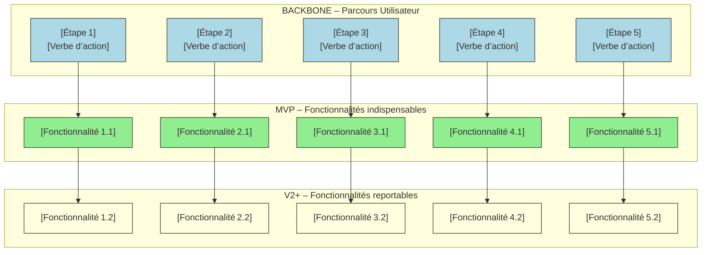

# 📚 Guide d’atelier : Story Mapping – Représenter un périmètre fonctionnel  
**Document établi à partir des principes du Story Mapping de Jeff Patton**  

---  

[TOC]

---  

## 1️⃣ Introduction et objectifs {#intro}
**Livrable** : *Représenter visuellement un périmètre fonctionnel aligné sur le parcours utilisateur*  

**Méthodologie** : Atelier basé sur le **Story Mapping (Jeff Patton)**  

### Objectifs opérationnels
1. **Comprendre collectivement le parcours cible de l’usager**  
2. **Identifier les fonctionnalités nécessaires à chaque étape**  
3. **Prioriser pour définir un MVP fonctionnel**  
4. **Créer un support visuel partagé pour cadrer la suite du projet**  
5. **Faciliter la transition vers le backlog (epics → user stories)**  

---  

## 2️⃣ Contexte d’usage {#contexte}
| Élément | Valeur |
|--------|--------|
| **Type de livrable** | Standard ✅ |
| **Nature** | Atelier 🤝 |
| **Activité** | « Imaginer une solution » |
| **Méthode** | Story Mapping (Jeff Patton) |
| **Quand l’utiliser** | <ul><li>Traduire recherche utilisateur + réglementation + vision produit en périmètre fonctionnel</li><li>Cadrer un MVP, une V1 ou une refonte</li><li>Aligner équipes métier, technique et design sur une même représentation</li></ul> |
| **Recommandation** | Produire **une Story Map par persona clé** (2‑3 max), en commençant toujours par l’utilisateur final. |

> **Exemple de contexte** – Projet **ambulon**  
> - **Nom du produit** : `ambulon`  
> - **Domaine métier** : `[À préciser]` (ex. : gestion d’appels d’urgence, suivi de véhicules, etc.)  
> - **Persona principal** : `[Nom du persona] – [Description courte]`  
> - **Vision produit** : `[Pitch de 1 phrase]`  

---  

## 3️⃣ Pré‑requis {#prerequis}
- [ ] Vision produit formalisée (pitch, objectifs, métriques)  
- [ ] Personas et recherche utilisateurs synthétisés (verbatims, enquêtes, entretiens)  
- [ ] Problèmes utilisateurs hiérarchisés (jobs‑to‑be‑done, pain points)  
- [ ] Contraintes réglementaires ou techniques identifiées  

> 💡 *Si un pré‑requis manque, prévoir 15 min en début d’atelier pour le co‑construire rapidement.*  

---  

## 4️⃣ Parties prenantes et rôles {#roles}
| Rôle | Profil type | Responsabilité dans l’atelier |
|------|-------------|--------------------------------|
| **Animateur** | Chef de produit / PNM | Cadre, facilitation, garde du focus utilisateur |
| **Profil technique** | Tech Lead / Architecte | Évalue faisabilité, effort, dépendances |
| **Porteur métier** | MOA / Responsable métier | Valide pertinence fonctionnelle & priorisation |
| **Designer UX/UI** *(optionnel)* | Designer produit | Enrichit le parcours, propose des patterns d’interaction |
| **Stakeholder business** *(optionnel)* | Sponsor, Marketing | Apporte la perspective valeur & ROI |

> ☝️ *Un même participant peut cumuler plusieurs rôles selon les disponibilités.*  

---  

## 5️⃣ Logistique {#logistique}
- **Durée** : 2 h 30 – 3 h (prévoir une pause à 1 h 30 si 3 h)  
- **Matériel**  
  - *Physique* : mur ou tableau blanc, post‑its de **3 couleurs** (ex. : étapes, activités, priorisation), marqueurs, ruban de masquage.  
  - *Digital* : outil collaboratif (Mural, FigJam, Klaxoon) avec template vierge.  
- **Livrable de sortie** : Photo/export de la Story Map, diagramme Mermaid, liste des décisions MVP, points de vigilance.  

---  

## 6️⃣ Déroulé détaillé de l’atelier {#deroule}
### 🎯 Étape 1 — Introduction (15 min) {#etape1}
1. Accueil & rappel du cadre (objectifs, durée, règles de fonctionnement).  
2. Présentation rapide du **Story Mapping** (backbone, activités, ligne de flottaison).  
3. Rappel du contexte : persona, vision produit, contraintes majeures.  

> ✅ *Astuce* : afficher une **job story** type pour ancrer les échanges :  
> *« En tant que **[persona]**, je veux **[action]** afin de **[bénéfice]** ». *

### 🗺️ Étape 2 — Parcours utilisateur (horizontal) (30 min) {#etape2}
1. Question centrale : **« Quelles sont les grandes étapes que suit l’usager ? »**  
2. Chaque étape = post‑it **verbe d’action** (ex. : *Se renseigner*, *Créer un compte*, *Remplir le formulaire*).  
3. Disposer les post‑its **de gauche à droite** pour former le **backbone**.  

### 📋 Étape 3 — Détail vertical (activités) (45 min) {#etape3}
Pour chaque étape du backbone :  
- *« Que doit faire concrètement l’usager ici ? »*  
- *« De quelles informations a‑t‑il besoin ? »*  
- *« Quels sont les points de friction ? »*  

Empiler les réponses **verticalement** sous chaque étape (du plus essentiel en bas vers le plus détaillé en haut).  

> 💡 *Ne pas filtrer à ce stade ; collecter le maximum d’idées.*  

### 🎚️ Étape 4 — Priorisation & définition du MVP (30‑45 min) {#etape4}
1. Tracer une **ligne de flottaison** (horizontal) au-dessus du backbone.  
2. **Au‑dessus** : fonctionnalités **indispensables** pour que l’usager puisse atteindre le but (MVP/V1).  
3. **En‑dessous** : fonctionnalités **reportables** (V2, backlog).  
4. Décider collectivement en répondant :  
   - *Quelles sont les “must‑have” ?*  
   - *Quelles “nice‑to‑have” peuvent attendre ?*  

### 🏁 Étape 5 — Conclusion & prochaines étapes (15 min) {#etape5}
1. Relecture collective de la carte : validation du parcours et du périmètre MVP.  
2. Noter les **points de vigilance**, questions ouvertes, dépendances.  
3. Définir les actions immédiates :  
   - Photo/export de la Story Map  
   - Partage du fichier dans les 24 h  
   - Plan d’action pour le backlog (epics → user stories)  

---  

## 7️⃣ Conseils de facilitation {#conseils}
| Bonnes pratiques | À éviter |
|-------------------|----------|
| Reformuler régulièrement pour assurer la clarté | Se perdre dans les détails techniques |
| Garder le cap sur l’expérience utilisateur | Laisser un profil dominer les échanges |
| Faire participer tout le monde (métier, terrain, technique) | Accepter les digressions hors parcours |
| Utiliser le time‑boxing strict par étape | Oublier de documenter les arbitrages |
| Ancrer chaque fonctionnalité dans un besoin utilisateur | Confondre “nice‑to‑have” et “must‑have” |

---  

## 8️⃣ Exemple de Story Map (simplifiée) {#exemple}
```markdown
Parcours utilisateur (axe horizontal →) :
[Se renseigner] — [Créer un compte] — [Remplir formulaire] — [Soumettre] — [Suivre dossier]

Fonctionnalités associées (axe vertical ↓ sous chaque étape) :

► Se renseigner
   • Lire une FAQ
   • Simuler son éligibilité
   • Télécharger un guide

► Créer un compte
   • S’authentifier via FranceConnect
   • Valider son email
   • Définir un mot de passe

► Remplir formulaire
   • Saisir les informations personnelles
   • Joindre un justificatif (PDF < 5 Mo)
   • Sauvegarder en brouillon

► Soumettre
   • Recevoir un accusé de réception
   • Obtenir un numéro de dossier

► Suivre dossier
   • Consulter l’avancement via messagerie
   • Télécharger les décisions
```

---  

## 9️⃣ Diagramme Mermaid du Story Map {#mermaid}
> **À personnaliser** : remplacez les libellés entre `[]` par les étapes et fonctionnalités de votre projet **ambulon**.  



---  

## 10️⃣ Adaptations contextuelles {#adaptations}
| Contexte | Adaptation recommandée |
|----------|------------------------|
| **Refonte** | Partir du parcours existant, identifier les points de friction avant d’ajouter de nouvelles fonctionnalités. |
| **Produit réglementé** | Intégrer les contraintes légales comme des *étapes obligatoires* dans le backbone. |
| **Multi‑profils** | Créer une Story Map par persona, puis fusionner les fonctionnalités transverses. |
| **Contraintes techniques fortes** | Impliquer le profil technique dès l’étape 3 pour valider la faisabilité en temps réel. |

---  

## 11️⃣ Livrables et suite du projet {#livrables}
| Livrable | Description |
|---------|-------------|
| **Story Map** | Photo ou export numérique + diagramme Mermaid. |
| **Matrice de traçabilité** | Fonctionnalité ↔ Besoin utilisateur ↔ Contrainte. |
| **Backlog produit structuré** | Epics → User Stories (extraction directe de la Story Map). |
| **Roadmap visuelle** | MVP → V1 → V2 (timeline ou swim‑lane). |

### Prochaines étapes suggérées
1. **Rédaction des user stories** avec critères d’acceptation.  
2. **Maquettage** des écrans clés du MVP.  
3. **Estimation technique** (story points, effort).  
4. **Planification des sprints** (définir le sprint 0 de mise en place).  

---  

## 📖 Mini‑glossaire {#glossaire}
| Terme | Définition |
|-------|------------|
| **Backbone** | Ligne horizontale qui représente le **parcours utilisateur** du début à la fin. |
| **Epic** | Grande fonctionnalité ou groupe de stories qui correspond à une étape du backbone. |
| **User story** | Description courte du besoin d’un utilisateur sous forme *« En tant que …, je veux … afin de … »*. |
| **MVP** | Minimum Viable Product : version la plus simple qui permet de tester une hypothèse produit réelle. |
| **Job story** | Variante de la user story qui met l’accent sur le contexte et le motivation : *« Quand …, je veux … parce que … »*. |
| **Ligne de flottaison** | Ligne horizontale qui sépare les fonctionnalités **indispensables** (au‑dessus) des **reportables** (en‑dessous). |

---  

## 🔚 Retour au sommaire {#toc}
[↩ Retour au sommaire](#toc)  


---  

*Ce guide est immédiatement utilisable dans VS Code, Obsidian ou tout autre éditeur Markdown.  
Il suffit de remplacer les parties entre `[` `]` par les informations propres au projet **ambulon** (personas, étapes, contraintes, etc.) et de lancer le diagramme Mermaid dans votre environnement de rendu.*