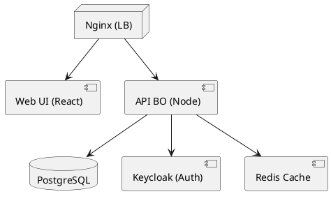

# 📄 Dossier d’Architecture Technique (DAT) – **Bulletin Officiel**  

[TOC]

---  

## 1️⃣ Introduction et objectifs  

**Vue d’ensemble fonctionnelle**  
Le *Bulletin Officiel* (BO) est une plateforme de diffusion et de consultation de textes officiels (décrets, arrêtés, notes, etc.). Elle expose :  

* des référentiels (ministères, thématiques, mots‑clés, types de documents) ;  
* la création / mise à jour d’une notice ;  
* la recherche et la consultation en mode list, détail ou export.  

### C4 – Niveau 1 – Diagramme *System Context*  

```mermaid
graph LR;
    %% Actors;
    User[Utilisateur (public, agent)] 
    Admin[Administrateur BO] 
    %% Systems;
    BO[Bulletin Officiel] 
    Auth[Service d’authentification (OAuth2/OpenID)] 
    Notix[NotixBase (référentiel interne)] 
    DB[(Base de données PostgreSQL)] 
    Monitor[Plateforme de supervision (Prometheus/Grafana)]

    %% Relationships;
    User -->|consultation, recherche| BO;
    Admin -->|édition, administration| BO;
    BO -->|authentifie les requêtes| Auth;
    BO -->|lecture/écriture| DB;
    BO -->|appels métier| Notix;
    BO -->|expose métriques| Monitor
```

### Objectifs de qualité (orientés utilisateur)  

| # | Objectif | Raison métier |
|---|----------|----------------|
| 1 | **Performance** – temps de réponse ≤ 200 ms pour les recherches courantes | Garantir une expérience fluide aux usagers du service public |
| 2 | **Sécurité** – conformité OWASP Top 10, chiffrement TLS 1.3 | Protéger les données officielles et les accès aux fonctions d’édition |
| 3 | **Disponibilité** – 99,9 % (MTBF ≥ 720 h) | Assurer l’accès continu aux textes légaux |
| 4 | **Maintenabilité** – couverture de tests unitaires ≥ 80 % et documentation à jour | Réduire le coût de l’évolution fonctionnelle |
| 5 | **Traçabilité** – journalisation complète des actions d’édition | Satisfaire les exigences d’audit et de conformité |

↩︎ [Retour au sommaire](#toc)  

---  

## 2️⃣ Parties prenantes  

| Rôle | Attente principale |
|------|--------------------|
| **MOA – Direction juridique** | Fiabilité du contenu publié, traçabilité des modifications |
| **Product Owner** | Livraison rapide des évolutions fonctionnelles, visibilité sur la roadmap |
| **Développeurs** | Architecture claire, CI/CD automatisé, documentation technique |
| **Ops / SRE** | Déploiement sans interruption, monitoring, gestion des incidents |
| **RSSI** | Conformité aux exigences de sécurité (confidentialité, intégrité, disponibilité, traçabilité) |
| **Utilisateurs finaux (public, agents)** | Recherche rapide, affichage lisible sur tous les terminaux, accessibilité |

*Le fichier `applicationsIA_mini_...md` n’a pas été fourni ; aucune section « Contacts » n’est ajoutée.*

↩︎ [Retour au sommaire](#toc)  

---  

## 3️⃣ Contraintes  

### 3.1 Contraintes techniques  

| Type | Description |
|------|-------------|
| **Plateforme** | Hébergement sur le cloud interne *ECO4* (OpenStack) – tenant `pnm3` |
| **Base de données** | PostgreSQL 13, réplication master‑slave, sauvegarde chiffrée AES‑256 |
| **Conteneurisation** | Docker 20+, orchestrateur Kubernetes (ou Docker‑Compose en dev) |
| **Langage / Framework** | Backend : Node.js 18 (Express) ; Frontend : React 18 (Vite) |
| **CI/CD** | GitLab‑CI, pipelines de build, test, scan sécurité, déploiement blue‑green |
| **Interopérabilité** | API REST JSON, compatible OpenAPI 3.0, authentification OAuth2/JWT |
| **Normes** | ISO 27001, RGAA (accessibilité), GDPR (données à caractère personnel éventuel) |

### 3.2 Contraintes organisationnelles  

* Livraison continue avec un *release train* bi‑hebdomadaire.  
* Documentation obligatoire dans le dépôt (`README.md`, `ADR/`).  
* Revue de code obligatoire (merge‑request avec approbation ≥ 2 reviewers).  

### 3.3 Contraintes réglementaires  

| Domaine | Exigence |
|--------|----------|
| **D‑I‑C‑T** | **Disponibilité** : SLA 99,9 % ; **Intégrité** : signature numérique des notices ; **Confidentialité** : chiffrement TLS 1.3 ; **Traçabilité** : journalisation des actions d’édition avec horodatage et identifiant utilisateur |
| **Open Data** | Publication des notices sous licence ouverte (Open Government Licence) |
| **Accessibilité** | Conformité RGAA niveau AA |

↩︎ [Retour au sommaire](#toc)  

---  

## 4️⃣ Contexte et périmètre  

### 4.1 Partenaires fonctionnels  

| Système / acteur | Type d’échange | Protocole | Fréquence |
|------------------|----------------|-----------|-----------|
| **NotixBase** (référentiel interne) | Lecture de données de base (ministères, services) | HTTP / REST | À la demande (cache 5 min) |
| **Service d’authentification** (OAuth2) | Validation de jetons JWT | HTTPS | À chaque requête |
| **Portail public** (site gouvernemental) | Intégration via iframe ou API | HTTPS/REST | En temps réel |
| **Plateforme de supervision GTI** | Export de métriques | Prometheus scrape | 15 s |

### 4.2 Interfaces techniques  

| Interface | Description | Format | Sécurité |
|----------|-------------|--------|----------|
| **API BO** | CRUD des notices, recherche, export | JSON‑API (OpenAPI) | JWT + RBAC |
| **Export CSV/JSON** | Téléchargement de listes | CSV, JSON | Authentifié ou public (selon scope) |
| **Web UI** | Interface utilisateur | HTML5/CSS3/JS | TLS 1.3 |
| **Backup Service** | Dump de la base | SQL + AES‑256 | Accès restreint (role `backup`) |

↩︎ [Retour au sommaire](#toc)  

---  

## 5️⃣ Stratégie de solution  

### 5.1 Décisions architecturales majeures  

| Décision | Raison |
|----------|--------|
| **Architecture micro‑services (API + UI séparés)** | Isolation des évolutions front/back, scalabilité indépendante |
| **Conteneurisation Docker + Kubernetes** | Déploiement reproductible, gestion du scaling |
| **API‑first (OpenAPI)** | Contrat clair pour les consommateurs internes/externes |
| **Event‑driven (Kafka) – option future** | Découplage des traitements asynchrones (ex. génération de PDF) |
| **Infrastructure as Code (Terraform)** | Traçabilité des changements d’infra, reproductibilité |

### 5.2 Environnement technologique  

| Couche | Technologie |
|--------|-------------|
| **Frontend** | React 18, TypeScript, Vite, TailwindCSS |
| **API / Business** | Node.js 18, Express, TypeORM |
| **Base de données** | PostgreSQL 13, pg‑crypto (chiffrement de colonnes sensibles) |
| **Auth** | Keycloak (OpenID Connect) |
| **Cache** | Redis 7 (TTL 5 min pour les référentiels) |
| **CI/CD** | GitLab‑CI, Docker‑build, Trivy (scan vulnérabilités), SonarQube (qualité code) |
| **Monitoring** | Prometheus, Grafana, Loki, Alertmanager, Portainer (containers) |
| **Sauvegarde** | Scripts `pg_dump` + chiffrement AES‑256 → stockage B3, Outscale SecNumCloud, Google Cloud Storage |

### 5.3 Outils de la forge logicielle  

* **Gestion de code** – GitLab (repo mono‑module)  
* **Gestion des tickets** – GitLab‑Issues / Jira (selon équipe)  
* **Tests** – Jest (unit), SuperTest (API), Cypress (e2e)  
* **Analyse statique** – ESLint, Prettier, SonarQube  
* **Déploiement** – GitLab‑CI > Helm chart (K8s) ou Docker‑Compose (dev)  

↩︎ [Retour au sommaire](#toc)  

---  

## 6️⃣ Vue en Briques (C4 – Niveau 2)  

```mermaid
graph TB;
    %% Containers;
    subgraph "Kubernetes Cluster"
        UI[Web UI (React) <br/> Container] 
        API[API BO (Node/Express) <br/> Container] 
        DB[(PostgreSQL) <br/> StatefulSet] 
        Auth[Keycloak <br/> Container] 
        Cache[Redis <br/> Container] 
        Bus[Kafka (optional) <br/> Container] 
    end;
    %% External systems;
    Users((Utilisateurs))
    Notix[NotixBase (REST)]
    Monitor[(Prometheus/Grafana)]

    %% Relationships;
    Users -->|HTTPS| UI;
    UI -->|REST + JWT| API;
    API -->|SQL| DB;
    API -->|Cache| Cache;
    API -->|REST| Notix;
    API -->|OAuth2| Auth;
    API -->|Kafka| Bus;
    DB --> Monitor;
    API --> Monitor;
    UI --> Monitor
```

**Descriptions rapides**  

| Conteneur | Rôle |
|-----------|------|
| **Web UI** | Interface réactive, recherche, affichage des notices, gestion des sessions |
| **API BO** | Expose les services métier (CRUD, recherche, export), applique la logique de sécurité |
| **PostgreSQL** | Stockage persistant des notices, référentiels, historiques |
| **Keycloak** | Gestion des identités, délivrance de tokens JWT, RBAC |
| **Redis** | Cache des listes de référentiels (ministères, thématiques, mots‑clés) |
| **Kafka** *(optionnel)* | Bus d’événements pour traitements asynchrones (ex. génération de PDF) |

↩︎ [Retour au sommaire](#toc)  

---  

## 7️⃣ Vue Exécution  

### Scénario 1 – Consultation d’une notice (utilisateur)  

```mermaid
sequencediagram;
    participant User as Utilisateur;
    participant UI as Web UI;
    participant API as API BO;
    participant Cache as Redis;
    participant DB as PostgreSQL;
    User->>UI: Ouvre la page /notice/123;
    UI->>API: GET /api/notices/123 (JWT)
    API->>Cache: GET notice_123;
    alt Cache hit;
        Cache-->>API: Notice JSON;
    else Cache miss;
        API->>DB: SELECT * FROM notices WHERE id=123;
        DB-->>API: Notice JSON;
        API->>Cache: SET notice_123 (TTL 5 min)
    end;
    API-->>UI: Notice JSON;
    UI->>User: Rendu HTML
```

### Scénario 2 – Publication d’une nouvelle notice (administrateur)  

```mermaid
sequencediagram;
    participant Admin as Administrateur;
    participant UI as Web UI;
    participant API as API BO;
    participant DB as PostgreSQL;
    participant Auth as Keycloak;
    participant Monitor as Prometheus;
    Admin->>UI: Formulaire création + submit;
    UI->>API: POST /api/notices (JWT)
    API->>Auth: Vérification rôle “editor”
    Auth-->>API: OK;
    API->>DB: INSERT notice;
    DB-->>API: OK (id=456)
    API->>Monitor: incr(metric=notice_created_total)
    API-->>UI: 201 Created + notice id;
    UI->>Admin: Confirmation
```

### Scénario 3 – Export massif (service interne)  

```mermaid
sequencediagram;
    participant Service as Service interne;
    participant API as API BO;
    participant DB as PostgreSQL;
    participant Bus as Kafka;
    Service->>API: GET /api/notices?format=csv&batch=all (service‑token)
    API->>DB: SELECT * FROM notices;
    DB-->>API: Lots de rows;
    API->>Bus: Publish ExportJob{id=789}
    Bus-->>Service: Ack;
    Service->>Bus: Consume ExportJob;
    Service->>DB: READ rows (same query)
    Service->>File: Write CSV;
    Service->>Storage: Upload (B3, Outscale, GCS)
    Service->>API: PATCH /api/exports/789 (status=done, urls)
```

↩︎ [Retour au sommaire](#toc)  

---  

## 8️⃣ Vue Déploiement *(section standardisée)*  

### Environnements  

| Environnement | Hébergement | Serveurs | Réseau | Particularités |
|---------------|-------------|----------|--------|----------------|
| Développement | À compléter | À compléter | À compléter | À compléter |
| Recette | À compléter | À compléter | À compléter | À compléter |
| Production | À compléter | À compléter | À compléter | À compléter |

### Infrastructure  

Le produit est hébergé sur le cloud interne **ECO4** basé sur **Openstack**, dans le tenant **'pnm3'** du département.  
Le reverse‑proxy **Nginx** du schéma ci‑dessous est en fait une paire de **Nginx** load‑balancés en frontal des produits hébergés sur le tenant.



### Supervision  

Le produit est supervisé via le système standard du GTI pour ce faire :  

* via **Portainer** pour la partie purement conteneurisée,  
* via la stack **Prometheus/Grafana/Loki/AlertManager**,  
* le produit dispose également d’une supervision **PSIN**.  

### Sauvegardes  

Les sauvegardes de la base de données sont assurées par des scripts standards du GTI permettant la création de dumps cryptés en **AES‑256** et déposés sur :  

* le stockage objet **B3** du IaaS ministériel,  
* le stockage objet **Outscale SecNumCloud** (via la prestation du GTI « Nuage Public »),  
* le stockage objet standard de **Google Cloud** (via la prestation du GTI « Nuage Public »).  

↩︎ [Retour au sommaire](#toc)  

---  

## 9️⃣ Sujets transverses  

| Sujet | Détails d’implémentation |
|-------|--------------------------|
| **Authentification & Autorisation** | OAuth2 + JWT via Keycloak ; RBAC (lecture, édition, admin) ; jeton revocable. |
| **Journalisation** | Logback (Node) → Loki ; enrichissement avec `userId`, `requestId`, `timestamp`. |
| **Monitoring** | Métriques Prometheus : latence API, taux d’erreur, utilisation DB, cache hit‑ratio. |
| **Gestion des erreurs** | Gestion centralisée via middleware Express ; réponses normalisées (RFC 7807). |
| **API versioning** | Préfixe `/api/v1/…` ; compatibilité rétrograde assurée pendant 2 cycles de release. |
| **Internationalisation** | Support i18n (fr, en) via `react-i18next` et fichiers de ressources JSON. |
| **Accessibilité** | Conformité RGAA AA, tests automatisés axe‑core. |
| **Sécurité** | Scans Trivy, dépendances npm audit ; CSP, HSTS, Rate‑limiting, OWASP‑ZAP CI. |
| **CI/CD** | Pipelines GitLab : lint → test → build → image → scan → déploiement. |
| **Gestion de la configuration** | `dotenv` + `config` (environnements) ; secrets dans Vault. |

↩︎ [Retour au sommaire](#toc)  

---  

## 🔟 Exigences de qualité  

| Qualité | Critère | Scénario de validation |
|---------|---------|------------------------|
| **Performance** | 95 % des requêtes < 200 ms (test charge) | Test JMeter 100 RPS pendant 5 min, mesurer latence moyenne. |
| **Sécurité** | Aucun CVE ≥ 9 dans les dépendances | Scan Trivy + npm audit, fail si CVE ≥ 9. |
| **Disponibilité** | MTTR ≤ 30 min (plan de reprise) | Simuler panne DB, mesurer temps de restauration à partir des sauvegardes. |
| **Maintenabilité** | Couverture unitaires ≥ 80 % | SonarQube → gate de merge. |
| **Traçabilité** | Chaque édition crée un audit log avec `userId`, `noticeId`, `timestamp` | Vérifier via requête Grafana/Loki que le log existe après chaque PUT. |
| **Scalabilité** | Horizontal scaling jusqu’à 10 instances sans dégradation | Test de charge avec scaling auto‑K8s, vérifier temps de réponse. |

↩︎ [Retour au sommaire](#toc)  

---  

## 1️⃣1️⃣ Risques et dettes techniques  

| Risque / Dette | Impact | Mitigation / Action corrective |
|----------------|--------|---------------------------------|
| **Dépendance à NotixBase** (latence) | Dégradation de la recherche | Cache Redis avec TTL 5 min, circuit‑breaker Hystrix. |
| **Monolitisation du backend** (si la séparation n’est pas respectée) | Difficulté de scaling | Refactoriser en micro‑services dès le sprint 3. |
| **Gestion des secrets dans le repo** | Fuite de credentials | Utiliser HashiCorp Vault, variables CI‑CD sécurisées. |
| **Absence de tests de charge** | Incertitude sur la capacité en production | Intégrer test de charge dans pipeline Nightly. |
| **Dette de documentation** (ADR manquantes) | Perte de connaissance | Créer un répertoire `ADR/` et rédiger au moins 3 décisions clés (choix DB, auth, déploiement). |
| **Obsolescence des dépendances npm** | Vulnérabilités | Mettre en place Renovate Bot pour mises à jour automatiques. |

↩︎ [Retour au sommaire](#toc)  

---  

## 1️⃣2️⃣ Annexes  

### Glossaire  

| Terme | Définition |
|-------|------------|
| **BO** | Bulletin Officiel – plateforme de diffusion des textes officiels. |
| **RBAC** | Role‑Based Access Control – contrôle d’accès basé sur les rôles. |
| **D‑I‑C‑T** | Modèle de sécurité : Disponibilité, Intégrité, Confidentialité, Traçabilité. |
| **ADR** | Architecture Decision Record – document de décision d’architecture. |
| **RGAA** | Référentiel Général d’Amélioration de l’Accessibilité. |
| **GTI** | Groupe Technique d’Infrastructure (service interne de supervision). |
| **TLS 1.3** | Version du protocole Transport Layer Security. |
| **OpenStack** | Plateforme de cloud privé. |
| **ECO4** | Nom du cloud interne utilisé par le ministère. |

### Décisions d’Architecture (extraits)  

| # | Décision | Date | Conséquence |
|---|----------|------|-------------|
| **ADR‑001** | Utiliser PostgreSQL comme SGBD principal | 2024‑10‑15 | Garantie ACID, support JSONB pour métadonnées. |
| **ADR‑002** | Séparer UI et API via un reverse‑proxy Nginx | 2024‑10‑20 | Déploiement indépendant, meilleure scalabilité. |
| **ADR‑003** | Authentifier via Keycloak (OpenID Connect) | 2024‑11‑01 | Centralisation des identités, SSO possible. |
| **ADR‑004** | Choisir Docker + Kubernetes comme plateforme d’exécution | 2024‑11‑05 | Orchestration, haute disponibilité, CI/CD simplifié. |
| **ADR‑005** | Stocker les sauvegardes sur trois back‑ends distincts (B3, Outscale, GCS) | 2024‑11‑12 | Résilience des données, conformité aux exigences de continuité. |

↩︎ [Retour au sommaire](#toc)  

---  

*Fin du Dossier d’Architecture Technique – Bulletin Officiel*  