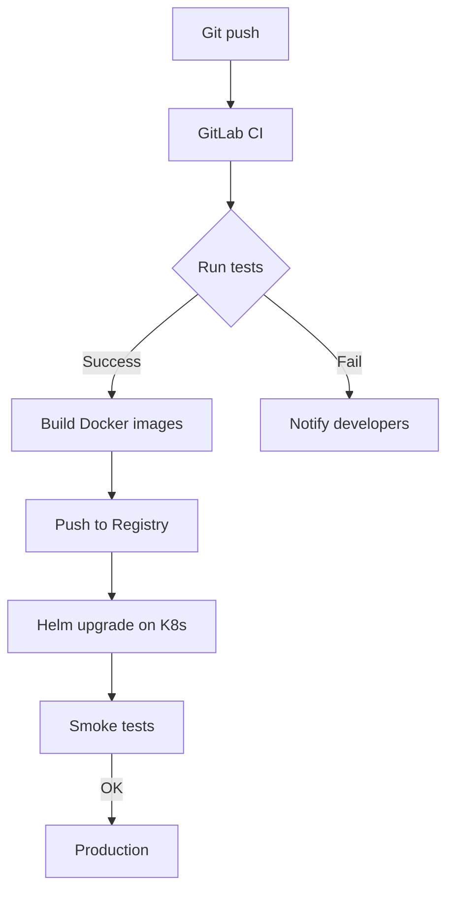
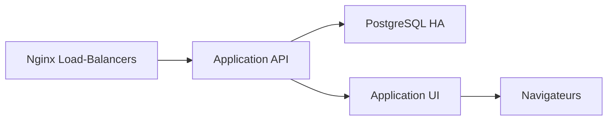

# 📘 Dossier d’Architecture Technique (DAT) – **Bulletin Officiel**  

[TOC]

---  

## 1️⃣ Introduction et objectifs {#intro}

**Bulletin Officiel** est une application métier qui centralise et publie les référentiels (ministères, thématiques, types de documents, mots‑clés, etc.) utilisés par les services de l’État.  

### 1.1 Vue d’ensemble fonctionnelle (C4‑L1)

```mermaid
graph TD;
    %% System Context (C4‑L1)
    subgraph Ext[Acteurs externes]
        MOA[MOA / RSSI] 
        Utilisateurs[Utilisateurs métier<br/>(agents, rédacteurs)]
        AutresSyst[Autres systèmes<br/>(ex. portail public, GED)]
    end;
    subgraph Sys[Bulletin Officiel]
        BO[Application Bulletin Officiel<br/>(API + UI)]
    end;
    MOA -->|Définit exigences| BO;
    Utilisateurs -->|Consomme UI / API| BO;
    AutresSyst -->|Intègre données| BO
```

### 1.2 Objectifs de qualité orientés utilisateur  

| # | Objectif | Raison métier |
|---|----------|---------------|
| 1 | **Performance** – temps de réponse < 200 ms pour les requêtes de recherche | Garantir une expérience fluide aux agents qui consultent les référentiels |
| 2 | **Sécurité** – conformité D‑I‑C‑T (voir §3) | Protéger les données publiques et les métadonnées internes |
| 3 | **Disponibilité** – 99,9 % de disponibilité mensuelle | Assurer l’accès continu aux services de publication |
| 4 | **Maintenabilité** – couverture de tests unitaires > 80 % | Faciliter l’évolution du catalogue de références |
| 5 | **Traçabilité** – journalisation exhaustive des modifications | Répondre aux exigences d’audit et de conformité légale |

↩︎ Retour à l’[sommaire](#toc)

---  

## 2️⃣ Parties prenantes {#stakeholders}

| Rôle | Attente principale |
|------|--------------------|
| **MOA (Maîtrise d’Ouvrage)** | Définir les besoins fonctionnels, valider la conformité réglementaire |
| **RSSI (Responsable Sécurité des Systèmes d’Information)** | Garantir le respect du D‑I‑C‑T, gérer les incidents |
| **Développeurs / Équipe DevOps** | Disposer d’une architecture claire, d’un pipeline CI/CD fiable |
| **Opérateurs (exploitation)** | Supervision, gestion des incidents, restauration rapide |
| **Utilisateurs métier (agents, rédacteurs)** | Accès simple, rapide et fiable aux référentiels |
| **Intégrateurs externes (portail public, GED)** | API stable, documentation Swagger/OpenAPI |

*Le document ne comporte pas de contacts nommés, la section “Contacts” est donc omise.*

↩︎ Retour à l’[sommaire](#toc)

---  

## 3️⃣ Contraintes {#constraints}

### 3.1 Contraintes techniques  
* **Stack** : Java 17 (Spring Boot) / Node 18 (React) – choix imposé par la plateforme d’entreprise.  
* **Base de données** : PostgreSQL 13, schéma « bo ».  
* **Conteneurisation** : Docker ≥ 20.10, orchestré par Kubernetes (EKS/AKS).  
* **CI/CD** : GitLab CI, pipelines automatisés (build, test, scan SAST/DAST, déploiement).  

### 3.2 Contraintes organisationnelles  
* **Livraison continue** : chaque commit validé doit être déployable en moins de 15 min.  
* **Documentation obligatoire** : Swagger/OpenAPI + README détaillé.  

### 3.3 Contraintes réglementaires  
* **RGPD** – données à caractère personnel (ex. créateur, modificateur) doivent être pseudonymisées.  
* **ISO 27001** – exigences de sécurité et de traçabilité.  

### 3.4 Modèle D‑I‑C‑T (sécurité)

| Dimension | Exigence | Implémentation prévue |
|-----------|----------|----------------------|
| **Disponibilité** | 99,9 % mensuel | Redondance N‑1, load‑balancing Nginx, health‑checks Kubernetes |
| **Intégrité** | Protection contre altération | Contrôle d’intégrité des artefacts (SHA‑256), validation de schémas JSON/YAML |
| **Confidentialité** | Accès restreint aux métadonnées sensibles | RBAC (Spring Security + Keycloak), chiffrement au repos (AES‑256) |
| **Traçabilité** | Historique complet des changements | Audit logs (ELK), versionnage des référentiels (Git) |

↩︎ Retour à l’[sommaire](#toc)

---  

## 4️⃣ Contexte et périmètre {#context}

### 4.1 Partenaires fonctionnels  

| Système / Acteur | Type d’échange | Description |
|------------------|----------------|-------------|
| **Portail public** | API REST (JSON) | Publication des référentiels aux citoyens |
| **GED interne** | API REST (JSON) | Enrichissement des notices avec les listes BO |
| **Annuaire d’entreprise (LDAP)** | Authentification (OIDC) | Gestion des comptes utilisateurs |
| **Plateforme de supervision GTI** | Collecte métriques (Prometheus) | Monitoring de la santé de l’application |

### 4.2 Interfaces techniques  

| Interface | Protocole | Fréquence | Données échangées |
|-----------|-----------|-----------|--------------------|
| API publique BO | HTTPS/REST (JSON) | À la demande | Listes de référence, filtres, pagination |
| API interne GED | HTTPS/REST (JSON) | À la demande | Métadonnées de notice, références de type document |
| Auth OIDC | HTTPS | Session | Jeton JWT (claims : sub, roles) |
| Supervision | Prometheus scrape | 15 s | Métriques (latence, error rate) |

↩︎ Retour à l’[sommaire](#toc)

---  

## 5️⃣ Stratégie de solution {#strategy}

### 5.1 Décisions architecturales majeures  

| Décision | Raison |
|----------|--------|
| **Micro‑services** (API + UI) | Scalabilité, indépendance du front‑end |
| **API‑first** (OpenAPI) | Facilite l’intégration externe |
| **Docker + Kubernetes** | Gestion du cycle de vie, haute disponibilité |
| **Keycloak** pour IAM | Centralisation des rôles (D‑I‑C‑T) |
| **PostgreSQL** avec schéma dédié | Fiabilité ACID, requêtes complexes sur les listes |

### 5.2 Environnement technologique  

| Couche | Technologie |
|--------|-------------|
| **Backend** | Java 17, Spring Boot, Spring Data JPA, Spring Security |
| **Frontend** | React 18, TypeScript, Material‑UI |
| **DB** | PostgreSQL 13, Flyway migrations |
| **Infra** | OpenStack (ECO4 tenant *pnm3*), Nginx (load‑balancing), Kubernetes, Helm charts |
| **CI/CD** | GitLab CI, Docker Registry, SonarQube, Snyk |
| **Tests** | JUnit 5, Mockito, Cypress (E2E) |
| **Monitoring** | Prometheus, Grafana, Loki, Alertmanager |
| **Gestion des secrets** | HashiCorp Vault (ou Kubernetes Secrets) |

↩︎ Retour à l’[sommaire](#toc)

---  

## 6️⃣ Vue en Briques (C4‑L2) {#containers}

```mermaid
graph TD;
    %% Container diagram (C4‑L2)
    subgraph K8s[Cluster Kubernetes]
        UI[Container: UI (React)]
        API[Container: API (Spring Boot)]
        DB[StatefulSet: PostgreSQL]
        Proxy[Nginx Load‑Balancer]
    end;
    Utilisateurs -->|HTTPS| UI;
    UI -->|REST/JSON| API;
    API -->|JDBC| DB;
    Proxy -->|HTTPS| UI;
    Proxy -->|HTTPS| API
```

### Description des conteneurs  

| Conteneur | Rôle | Principales responsabilités |
|-----------|------|-----------------------------|
| **UI** | Front‑end web | Authentification OIDC, affichage des listes, filtres, pagination |
| **API** | Backend métier | Gestion CRUD des référentiels, validation des schémas, contrôle d’accès |
| **PostgreSQL** | Persistance | Stockage des listes, historique des modifications, contraintes d’unicité |
| **Nginx** | Reverse‑proxy & load‑balancer | Termination TLS, répartition du trafic, health‑checks Kubernetes |

↩︎ Retour à l’[sommaire](#toc)

---  

## 7️⃣ Vue Exécution {#execution}

### 7.1 Scénario critique : Recherche de référentiel  

```mermaid
sequencediagram;
    participant U as Utilisateur;
    participant UI as UI (React)
    participant API as API (Spring)
    participant DB as PostgreSQL;
    U->>UI: Saisit critère de recherche;
    UI->>API: GET /bo/ministere?search=finance;
    API->>DB: SELECT * FROM bo_ministere WHERE nom ILIKE '%finance%'
    DB-->>API: Résultat (liste)
    API-->>UI: JSON {items: [...]}
    UI-->>U: Affichage des résultats
```

### 7.2 Scénario critique : Mise à jour d’un référentiel (audit)  

```mermaid
sequencediagram;
    participant U as Agent (role = editor)
    participant UI as UI;
    participant API as API;
    participant DB as PostgreSQL;
    participant Vault as Vault (secrets)

    U->>UI: Modifie la valeur « valeur » d’un item;
    UI->>API: PUT /bo/ministere/12 {payload}
    API->>Vault: Retrieve DB credentials;
    API->>DB: UPDATE bo_ministere SET valeur='nouveau' WHERE id=12;
    DB-->>API: OK;
    API->>API: Write audit log (user, timestamp, change)
    API-->>UI: 200 OK;
    UI-->>U: Confirmation
```

### 7.3 Scénario critique : Déploiement continu (pipeline)  



↩︎ Retour à l’[sommaire](#toc)

---  

## 8️⃣ Vue Déploiement *(section standardisée)* {#deployment}

### Environnements
| Environnement | Hébergement | Serveurs | Réseau | Particularités |
|---------------|-------------|----------|--------|----------------|
| Développement | Cloud interne ECO4 (tenant *pnm3*) | 1 x Node (Docker) | VLAN dev | Base de données en mode **in‑memory** pour les tests unitaires |
| Recette | Cloud interne ECO4 (tenant *pnm3*) | 2 x Node (Docker) + 1 x PostgreSQL | VLAN recette | Jeux de données anonymisés, tests d’intégration automatisés |
| Production | Cloud interne ECO4 (tenant *pnm3*) | 3 x Node (Docker) + 2 x PostgreSQL (HA) | VLAN prod | TLS 1.3, sauvegardes chiffrées, monitoring GTI complet |

### Infrastructure
Le produit est hébergé sur le cloud interne **ECO4** basé sur **OpenStack**, dans le tenant **'pnm3'** du département.  
Le reverse‑proxy **Nginx** du schéma ci‑dessous est en fait une paire de Nginx load‑balancés en frontal des produits hébergés sur le tenant.



### Supervision
Le produit est supervisé via le système standard du GTI pour ce faire :

* via **Portainer** pour la partie purement conteneurisée,  
* via la stack **Prometheus / Grafana / Loki / Alertmanager**,  
* le produit dispose également d’une supervision **PSIN**.

### Sauvegardes
Les sauvegardes de la base de données sont assurées par des scripts standards du GTI permettant la création de dumps cryptés en **AES‑256** et déposés sur :

* le stockage objet **B3** du IaaS ministériel,  
* le stockage objet **Outscale SecNumCloud** (via la prestation du GTI « Nuage Public »),  
* le stockage objet standard **Google Cloud** (via la prestation du GTI « Nuage Public »).

↩︎ Retour à l’[sommaire](#toc)

---  

## 9️⃣ Sujets transverses {#crosscutting}

| Sujet | Traitement |
|-------|------------|
| **Authentification** | OpenID Connect via **Keycloak**, tokens JWT, expiration 1 h, rafraîchissement via refresh token |
| **Autorisation** | RBAC (roles : viewer, editor, admin) implémentée dans Spring Security et contrôlée côté UI |
| **Journalisation** | Logback → JSON → Loki ; audit des modifications dans table `bo_audit` |
| **Gestion des erreurs** | Gestion centralisée des exceptions (ControllerAdvice), codes HTTP normalisés, messages traduits |
| **API** | Spécification OpenAPI 3, versionnée (`/v1/`), documentation Swagger UI intégrée |
| **Sécurité des données** | Chiffrement au repos (AES‑256), chiffrement en transit (TLS 1.3), masquage des champs sensibles dans les logs |
| **Observabilité** | Métriques business (nombre de requêtes, latence) et infra (CPU, Mémoire) exposées via `/actuator/prometheus` |
| **CI/CD** | Pipelines GitLab avec **SAST**, **DAST**, **Dependency‑Check**, déploiement automatisé via Helm |
| **Gestion de configuration** | ConfigMaps & Secrets Kubernetes, surcharge possible via variables d’environnement |

↩︎ Retour à l’[sommaire](#toc)

---  

## 🔟 Exigences de qualité {#quality}

| Exigence | Critère d’acceptation | Scénario de validation |
|----------|----------------------|------------------------|
| **Performance** | < 200 ms pour 95 % des requêtes de recherche | Test de charge JMeter (100 concurrents) sur `/bo/ministere?search=*` |
| **Sécurité – D‑I‑C‑T** | Aucun accès non autorisé détecté pendant les scans | OWASP ZAP + Snyk CI, validation des rapports |
| **Disponibilité** | 99,9 % de temps opérationnel sur un mois | Monitoring Prometheus, alertes si `up{job="api"} == 0` > 5 min |
| **Maintenabilité** | Couverture de tests unitaires ≥ 80 % | SonarQube → *Coverage* metric |
| **Traçabilité** | Tous les changements sont enregistrés avec user, timestamp, diff | Requête SQL sur `bo_audit` → vérification de l’historique complet |
| **Scalabilité** | Le service supporte un doublement de charge sans dégradation > 30 % | Test de scaling horizontal (replicas = 3) avec k6 |

↩︎ Retour à l’[sommaire](#toc)

---  

## 1️⃣1️⃣ Risques et dettes techniques {#risks}

| Risque / Dette | Impact | Action corrective / atténuation |
|-----------------|--------|---------------------------------|
| **Dépendance à la stack Java 17** | Risque de compatibilité future | Planifier une migration vers Java 21 dès que le support LTS sera stable |
| **Gestion manuelle des référentiels YAML** | Erreurs de duplication, perte de cohérence | Automatiser la génération des listes via un script de validation (schema‑validation, lint) |
| **Absence de tests d’intégration pour la couche API** | Bugs non détectés en production | Ajouter des tests d’intégration avec **Testcontainers** dans le pipeline CI |
| **Risque de surcharge du Nginx en production** | Dégradation de la latence | Mettre en place l’auto‑scaling du service Nginx (Horizontal Pod Autoscaler) |
| **Sauvegarde hors‑site limitée** | Perte de données en cas de sinistre majeur | Étendre la réplication des dumps vers un coffre‑fort externe (ex. Azure Blob) |

↩︎ Retour à l’[sommaire](#toc)

---  

## 1️⃣2️⃣ Annexes {#annexes}

### 12.1 Glossaire  

| Terme | Définition |
|-------|------------|
| **BO** | Acronyme de *Bulletin Officiel* (application métier). |
| **IAM** | *Identity and Access Management* – gestion des identités et des accès. |
| **D‑I‑C‑T** | Modèle de sécurité : Disponibilité, Intégrité, Confidentialité, Traçabilité. |
| **GTI** | *Groupement Technique Informatique* – équipe de supervision et d’infrastructure. |
| **Keycloak** | Serveur d’identités open‑source (OIDC, SAML). |
| **Helm** | Gestionnaire de packages pour Kubernetes. |
| **PSIN** | Plateforme de supervision interne du ministère. |

### 12.2 Décisions d’Architecture (ADR) – Extraits  

| ADR # | Titre | Décision | Statut |
|-------|-------|----------|--------|
| 001 | Utiliser **Spring Boot** pour le backend | Choix motivé par la standardisation Java et le support des micro‑services. | Adoptée |
| 002 | Exposer une **API‑first** avec OpenAPI | Permet aux équipes externes d’intégrer facilement le service. | Adoptée |
| 003 | Conteneuriser l’ensemble avec **Docker** + **Kubernetes** | Garantit la portabilité et la scalabilité. | Adoptée |
| 004 | Centraliser l’authentification via **Keycloak** | Simplifie la gestion des rôles D‑I‑C‑T. | Adoptée |
| 005 | Stocker les données référentielles dans **PostgreSQL** | Offre ACID, requêtes complexes, extensions JSONB. | Adoptée |

---  

*Document généré automatiquement, prêt à être utilisé dans VS Code ou Obsidian (Mermaid activé).*  