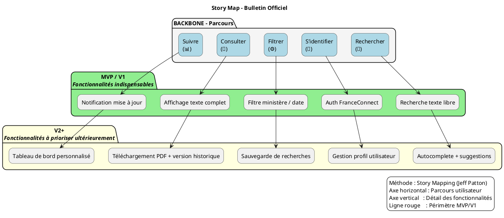

# 📚 Guide d’atelier **Story Mapping** – Représenter un périmètre fonctionnel  
**Produit** : *Bulletin Officiel*  
**Document établi à partir des principes du Story Mapping de Jeff Patton**  

---  

[TOC]

---  

## 1️⃣ Introduction et objectifs  

**Livrable** : « Représenter visuellement un périmètre fonctionnel aligné sur le parcours utilisateur »  

**Méthodologie** : Atelier Story Mapping (Jeff Patton)  

**Objectifs opérationnels**  

| 🎯 | Objectif |
|---|---|
| 1 | Comprendre collectivement le parcours cible de l’usager (citoyen, agent public, journaliste) |
| 2 | Identifier les fonctionnalités nécessaires à chaque étape du parcours |
| 3 | Prioriser pour définir un **MVP fonctionnel** (parcours complet) |
| 4 | Créer un support visuel partagé qui cadrera la suite du projet (backlog, roadmap) |
| 5 | Aligner les équipes produit, technique et métier autour d’une même vision |  

---  

## 2️⃣ Contexte d’usage  

| 📌 | Élément |
|---|---|
| **Type de livrable** | Standard ✅ |
| **Nature** | Atelier 🤝 |
| **Activité** | « Imaginer une solution » |
| **Méthode** | Story Mapping (Jeff Patton) |
| **Quand l’utiliser** | <ul><li>Traduire la recherche utilisateur + contraintes réglementaires + vision produit en périmètre fonctionnel</li><li>Cadrer un MVP, une V1 ou une refonte</li><li>Aligner équipes métier, technique et design</li></ul> |
| **Recommandation** | Produire **une Story Map par persona** (max 2‑3) ; toujours commencer par l’utilisateur final. |

---  

## 3️⃣ Pré‑requis  

- [ ] **Vision produit** (pitch, objectifs, métriques) – ex. : « Permettre à tout public d’accéder, rechercher et suivre les bulletins officiels en toute conformité ».  
- [ ] **Personas** et **recherche utilisateurs** synthétisés (verbatims, interviews) – ex. : Citoyen / Agent administratif / Journaliste.  
- [ ] **Problèmes utilisateurs** hiérarchisés (jobs‑to‑be‑done, pain‑points) – ex. : difficulté à retrouver un texte officiel, absence de suivi du statut.  
- [ ] **Contraintes réglementaires / techniques** (RGPD, archivage légal, exigences d’accessibilité).  

> 💡 *Conseil* : Si un pré‑requis manque, prévoir **15 min** en début d’atelier pour le co‑construire rapidement.  

---  

## 4️⃣ Parties prenantes et rôles  

| Rôle | Profil type | Responsabilité dans l’atelier |
|------|-------------|------------------------------|
| **Animateur** | Chef de produit / PO | Cadrer, faciliter, garder le cap utilisateur |
| **Profil technique** | Tech Lead / Architecte | Évaluer faisabilité, effort, dépendances |
| **Porteur métier** | MOA / Responsable du service | Valider pertinence fonctionnelle & priorisation |
| **Designer UX/UI** *(optionnel)* | Designer produit | Enrichir le parcours, proposer des patterns d’interaction |
| **Expert conformité** *(optionnel)* | Juriste / DPO | Vérifier que les étapes respectent les exigences légales |

> ☝️ *Une même personne peut cumuler plusieurs rôles selon les effectifs.*  

---  

## 5️⃣ Logistique  

| 📅 | Détails |
|---|---|
| **Durée** | 2 h 30 – 3 h (prévoir une pause à 1 h 30 si 3 h) |
| **Matériel – physique** | Mur / tableau blanc, post‑its **3 couleurs** (ex. : orange = étapes, vert = features MVP, bleu = features V2+), marqueurs, ruban de masquage |
| **Matériel – digital** | Outil collaboratif (Mural, FigJam, Klaxoon…) avec template Story Map pré‑préparé |
| **Livrable de sortie** | Photo / export de la Story Map, diagramme PlantUML, liste des décisions MVP, points de vigilance |
| **Salle** | Espace circulaire, tableau blanc visible de tous, prise électrique, connexion Wi‑Fi |

---  

## 6️⃣ Déroulé détaillé de l’atelier  

### 🎯 Étape 1 — Introduction (15 min)  
1. Accueil, tour de table.  
2. Présenter les **objectifs** de l’atelier et le **principe de la Story Map** (Jeff Patton).  
3. Rappeler le **contexte** : persona cible, données disponibles (verbatims, exigences légales).  
4. Règles du jeu : écoute active, contributions ouvertes, suspension du jugement.  

> **Job story** d’exemple :  
> *« En tant que **citoyen**, je veux **rechercher un texte officiel** afin de **savoir mes droits**. »*  

---  

### 🗺️ Étape 2 — Parcours utilisateur horizontal (30 min)  
**Objectif** : Reconstituer collectivement le parcours de bout en bout.  

1. Question : *« Quelles sont les grandes étapes que suit l’usager ? »*  
2. Chaque étape → post‑it **orange**, verbes d’action (ex. : *« Rechercher », « S’identifier », « Filtrer », « Consulter », « Suivre »).  
3. Disposer les post‑its **de gauche à droite** sur le tableau → **Backbone**.  

> **Exemple de backbone** (Bulletin Officiel) :  
> `Rechercher` → `S’identifier` → `Filtrer les résultats` → `Consulter le texte` → `Suivre le dossier`  

---  

### 📋 Étape 3 — Détail vertical des activités (45 min)  
**Objectif** : Lister actions, informations et besoins précis à chaque étape.  

Pour chaque étape du Backbone :  
- *« Que doit faire concrètement l’usager ici ? »*  
- *« De quelles informations a‑t‑il besoin ? »*  
- *« Quels sont les points de friction ? »*  

Écrire chaque activité sur un post‑it **vert** (MVP) ou **bleu** (V2+) et les **empiler verticalement** sous l’étape correspondante (du plus essentiel au secondaire).  

> ⚠️ *Ne pas filtrer à ce stade : collecter un maximum d’idées.*  

---  

### 🎚️ Étape 4 — Priorisation & définition du MVP (30‑45 min)  
**Objectif** : Identifier la version la plus simple couvrant tout le parcours.  

1. Tracer une **ligne horizontale de découpe** (ligne rouge) :  
   - **Au‑dessus** : fonctionnalités **indispensables** pour le MVP/V1.  
   - **En‑dessous** : fonctionnalités **reportables** (V2, backlog).  
2. Questions clés :  
   - *« Quelles fonctionnalités sont absolument indispensables pour que l’usager aille au bout ? »*  
   - *« Qu’est‑ce qu’on peut retirer sans bloquer le parcours principal ? »*  
3. Valider le **MVP** : parcours complet fonctionnel, pas seulement un sous‑ensemble d’étapes.  

---  

### 🏁 Étape 5 — Conclusion & prochaines étapes (15 min)  
1. Relire la carte : cohérence du parcours + périmètre MVP/V1.  
2. Noter **points de vigilance**, questions en suspens, dépendances (technique, juridique).  
3. Annoncer les **suites** :  
   - Formalisation du backlog (epics → user stories)  
   - Maquettage des écrans clés du MVP  
   - Estimation technique & planification des sprints  

> 📸 **Action immédiate** : prendre en photo le board ou exporter la carte numérique et la partager dans les 24 h.  

---  

## 7️⃣ Conseils de facilitation  

| ✅ Bonnes pratiques | ❌ À éviter |
|---|---|
| Reformuler régulièrement pour assurer la clarté | Se perdre dans les détails techniques |
| Garder le cap sur l’expérience utilisateur | Laisser un profil dominer les échanges |
| Faire participer tout le monde (métier, terrain, technique) | Accepter les digressions hors parcours |
| Utiliser un **timeboxing** strict par étape | Oublier de documenter les arbitrages |
| Ancrer chaque fonctionnalité dans un besoin utilisateur | Confondre *nice‑to‑have* et *must‑have* |

---  

## 8️⃣ Exemple de Story Map (simplifiée)  

```markdown
Parcours utilisateur (axe horizontal →) :  
[Rechercher] — [S’identifier] — [Filtrer] — [Consulter] — [Suivre]

Fonctionnalités associées (axe vertical ↓ sous chaque étape) :

► Rechercher
   • Saisie libre du texte ou du numéro
   • Suggestion d’autocomplétion
   • Filtre par date / ministère

► S’identifier
   • Authentification FranceConnect
   • Gestion du compte (profil, préférences)

► Filtrer
   • Choix du ministère, du type de document
   • Options d’affichage (liste / tableau)

► Consulter
   • Affichage du texte complet
   • Téléchargement PDF
   • Historique des versions

► Suivre
   • Notification de mise à jour
   • Tableau de bord du dossier
   • Export des décisions
```

---  

## 9️⃣ Diagramme PlantUML du Story Map  



---  

## 10️⃣ Adaptations contextuelles  

| Contexte | Adaptation recommandée |
|----------|------------------------|
| **Refonte** | Partir du parcours existant (ex. : recherche actuelle) → identifier frictions → proposer nouvelles étapes. |
| **Produit réglementé** | Intégrer les exigences légales comme **étapes obligatoires** (ex. : consentement RGPD, archivage). |
| **Multi‑profils** | Créer une Story Map **par persona** (citoyen vs agent) puis fusionner les activités transverses. |
| **Contrainte technique forte** | Inviter le **Tech Lead** dès l’étape 3 pour valider la faisabilité en temps réel (ex. : appel à API FranceConnect). |

---  

## 11️⃣ Livrables & suite du projet  

| Livrable | Description |
|---|---|
| **Story Map** (photo / export) | Vue macro du parcours + priorisation MVP/V1. |
| **Diagramme PlantUML** | Version versionnable du périmètre fonctionnel. |
| **Liste MVP** | Fonctionnalités indispensables (ex. : recherche texte, authentification). |
| **Backlog structuré** | Epics → User Stories (ex. : *En tant que citoyen, je veux filtrer par ministère*). |
| **Matrice de traçabilité** | Fonctionnalité ↔ besoin utilisateur ↔ contrainte (réglementaire, technique). |
| **Roadmap** | MVP → V1 → V2 (jalons, releases). |

**Prochaines étapes suggérées**  

1. Rédaction détaillée des **user stories** avec critères d’acceptation.  
2. **Maquettage** des écrans clés du MVP (recherche, visualisation).  
3. **Estimation technique** (story points, effort) & planification des sprints.  
4. Validation juridique / conformité avant le **déploiement**.  

---  

## 📖 Mini‑glossaire  

| Terme | Définition |
|---|---|
| **Backbone** | Ligne horizontale de la Story Map ; représente le parcours utilisateur de bout en bout. |
| **Epic** | Grande fonctionnalité ou groupe de stories regroupées par thème. |
| **User Story** | Description concise du besoin d’un utilisateur (ex. : *En tant que … je veux … afin de …*). |
| **MVP** | Produit Minimum Viable ; version fonctionnelle qui permet de tester les hypothèses clés. |
| **Line of Flotation** | Ligne (souvent rouge) qui sépare les items du MVP (au‑dessus) des items reportés (en‑dessous). |
| **Job Story** | Formulation du besoin centrée sur le contexte et la motivation (*Quand…, je veux…, afin de…*). |

---  

## 🔚 Conclusion  

Ce guide vous offre une trame **clé en main** pour co‑créer, avec toutes les parties prenantes, une **Story Map** claire, priorisée et directement exploitable dans le cadre du projet *Bulletin Officiel*. En suivant les étapes, vous obtiendrez un périmètre fonctionnel **aligné sur le parcours utilisateur**, respectueux des contraintes réglementaires, et prêt à être transformé en backlog, roadmap et livrables concrets.  

**Bonne facilitation !**  