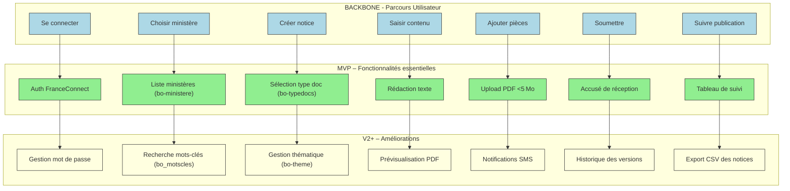

# 📚 Guide d’Atelier **Story Mapping** – *Bulletin Officiel*  

> **Document établi à partir des principes du Story Mapping de Jeff Patton**  

[TOC]

---

## 1️⃣ Introduction & objectifs

**Livrable** : *Représenter visuellement le périmètre fonctionnel du produit « Bulletin Officiel » aligné sur le parcours utilisateur.*

| Objectif | Description |
|---|---|
| 🎯 **Comprendre le parcours cible** | Mettre en commun la séquence d’actions de l’usager (agent, admin, public) du premier contact jusqu’à la consultation du bulletin. |
| 🔍 **Identifier les fonctionnalités** | Lister, sous chaque étape, les actions, données et règles métier (ex. listes de ministères, mots‑clés, typologies). |
| 🚀 **Prioriser le MVP** | Définir, à l’aide de la ligne de flottaison, les fonctions indispensables pour livrer un produit fonctionnel et testable. |
| 📈 **Créer un support partagé** | Produire une Story Map exploitable immédiatement par les équipes produit, technique et métier. |

---

## 2️⃣ Contexte d’usage

| Élément | Valeur |
|---|---|
| **Type de livrable** | Standard ✅ |
| **Nature** | Atelier 🤝 « Imaginer une solution » |
| **Méthode** | Story Mapping (Jeff Patton) |
| **Quand l’utiliser** | <ul><li>Passage de la recherche utilisateur + exigences légales à un périmètre fonctionnel concret.</li><li>Cadrage d’un MVP, d’une V1 ou d’une refonte du Bulletin Officiel.</li><li>Alignement des équipes métier, technique et design.</li></ul> |
| **Recommandation** | Créer **une** Story Map par **persona principal** (max 2‑3) puis consolider les fonctions transverses. |

### 2.1 Personas (exemples à adapter)

| Persona | Rôle | Besoin principal |
|---|---|---|
| **Agent de rédaction** | Rédacteur du BO | Créer, enrichir et publier des notices officielles. |
| **Responsable service** | Manager métier | Valider les contenus, gérer les listes de références (ministères, thématiques). |
| **Usager public** | Citoyen·ne | Rechercher et consulter les bulletins publiés. |

> **⚡️ Astuce** : Si vous avez déjà des personas issus d’études, remplacez‑les directement dans le tableau.

### 2.2 Contraintes réglementaires & techniques (extraits du repo)

* **Référentiel des mots‑clés** (`bo_motscles.yml`) – obligatoire pour le champ *mot‑clé*.
* **Listes de référence** (`bo‑ministere.yml`, `bo‑theme.yml`, `bo‑typedocs.yml`, …) – utilisées pour la saisie contrôlée.
* **Permissions** – lecture de base (`read_base`) et lecture de notice (`read_notice`) définies dans chaque fichier de liste.
* **Environnement** – trois branches (`dev`, `preprod`, `prod`) avec configuration CI (`.gitlab-ci.yml`).

---

## 3️⃣ Pré‑requis

- [ ] **Vision produit** (pitch, objectifs, KPI) – par ex. « Publier les actes officiels en moins de 5 min ».  
- [ ] **Personas** et **recherches utilisateurs** synthétisées (verbatims, jobs‑to‑be‑done).  
- [ ] **Problèmes utilisateurs** hiérarchisés (ex. : difficulté à retrouver un bulletin, saisie manuelle des références).  
- [ ] **Contraintes légales** (liste obligatoire des ministères, mots‑clés, formats des pièces jointes).  
- [ ] **Inventaire des listes** (`bo‑*`) disponibles dans le repo.  

> **💡 Conseil** : Si un pré‑requis manque, réservez **15 min** en début d’atelier pour le co‑construire rapidement (ex. : rédiger un job‑story commun).

---

## 4️⃣ Parties prenantes & rôles

| Rôle | Profil type | Responsabilité pendant l’atelier |
|---|---|---|
| **Animateur** | Chef de produit / PNM | Cadre, facilitation, garde du cap utilisateur. |
| **Profil technique** | Tech Lead / Architecte | Évalue faisabilité, effort, dépendances (ex. CI, bases de données). |
| **Porteur métier** | MOA / Responsable service | Valide pertinence fonctionnelle, priorisation des listes. |
| **Designer UX/UI** *(optionnel)* | Designer produit | Enrichit le parcours, propose des patterns d’interaction. |
| **Responsable conformité** | Juriste / DPO | Vérifie l’intégration des exigences réglementaires. |

> *Un même participant peut cumuler plusieurs rôles selon la taille de l’équipe.*

---

## 5️⃣ Logistique

| Élément | Détails |
|---|---|
| **Durée** | 2 h 30 – 3 h (prévoir une pause à 1 h 30). |
| **Matériel physique** | Mur ou tableau blanc, post‑its (3 couleurs : étape, fonctionnalité, MVP), marqueurs, ruban de masquage. |
| **Matériel digital** | Outil collaboratif (Mural, FigJam, Klaxoon) avec template vierge. |
| **Livrable de sortie** | Photo/export de la Story Map, diagramme Mermaid, liste des fonctionnalités MVP, points de vigilance. |
| **Environnement de travail** | Salle de réunion avec écran partagé, accès au dépôt `bulletin-officiel` (lecture). |

---

## 6️⃣ Déroulé détaillé de l’atelier

### 🎯 Étape 1 – Introduction (15 min)

1. Accueil & tour de table.  
2. Présentation des objectifs (voir § 1) et du principe de Story Mapping (Jeff Patton).  
3. Rappel du **contexte produit** (Bulletin Officiel, listes de référence, contraintes).  
4. Règles de l’atelier : écoute active, contributions ouvertes, suspension du jugement.  

> **🔖 Job story d’exemple** :  
> *« En tant qu’**Agent de rédaction**, je veux **créer rapidement une notice** afin de **publier un acte officiel dans les délais légaux**. »*

---

### 🗺️ Étape 2 – Parcours utilisateur horizontal (30 min)

| Action | Consignes |
|---|---|
| **Question clé** | « Quelles sont les grandes étapes que suit l’usager dans sa démarche ? » |
| **Méthode** | Chaque participant écrit une étape sur un post‑it (verbe d’action). |
| **Disposition** | Aligner les post‑its **de gauche à droite** sur le tableau (backbone). |
| **Exemple de backbone** (à valider) : <br>1️⃣ Se connecter <br>2️⃣ Sélectionner le ministère <br>3️⃣ Créer la notice <br>4️⃣ Saisir le contenu <br>5️⃣ Ajouter les pièces jointes <br>6️⃣ Soumettre <br>7️⃣ Suivre la publication |

---

### 📋 Étape 3 – Détail vertical des activités (45 min)

Pour chaque étape du backbone :

1. **Question** : « Que doit faire concrètement l’usager ici ? »  
2. **Collecte** : post‑its sous l’étape (actions, informations, choix, points de friction).  
3. **Référence aux listes** : associer les listes (`bo‑ministere`, `bo‑theme`, `bo‑typedocs`, `bo‑motscles`) aux champs à remplir.  
4. **Ne pas filtrer** : laisser émerger le maximum d’idées (ex. : « Valider le texte », « Prévisualiser le rendu PDF », « Enregistrer en brouillon », « Recevoir un accusé de réception »).  

> **⚙️ Astuce** : Utiliser **3 couleurs** de post‑its – bleu = étapes, vert = fonctionnalités essentielles, jaune = idées “nice‑to‑have”.

---

### 🎚️ Étape 4 – Priorisation & définition du MVP (30‑45 min)

1. **Tracer la ligne de flottaison** (horizontal) sous les post‑its.  
2. **Au‑dessus** : fonctionnalités **indispensables** pour que l’usager complète le parcours (MVP).  
3. **En‑dessous** : fonctionnalités **reportables** (V2, backlog).  
4. **Questions de cadrage** : <br>• « Quelles fonctions sont critiques pour publier le bulletin ? » <br>• « Quelles listes de référence sont obligatoires ? » <br>• « Quelles actions peuvent être différées sans bloquer le flux ? »  

> **⚡️ Rappel** : Le MVP doit être **fonctionnel** (ex. : un bulletin publiable) et non pas le plus minimaliste possible.

---

### 🏁 Étape 5 – Conclusion & prochaines étapes (15 min)

| Action | Description |
|---|---|
| **Relecture collective** | Vérifier la cohérence du backbone + MVP. |
| **Points de vigilance** | Noter les dépendances techniques (ex. CI, bases de données), les questions ouvertes (ex. : validation juridique). |
| **Plan d’action** | <ul><li>Export de la Story Map (photo / PDF).</li><li>Création du backlog (epics → user stories).</li><li>Rendez‑vous de suivi (sprint 0, estimation).</li></ul> |
| **Livrable immédiat** | Partager la capture + diagramme Mermaid dans les 24 h. |

---

## 7️⃣ Conseils de facilitation

| Bonnes pratiques | À éviter |
|---|---|
| Reformuler régulièrement pour garantir la clarté. | S’enliser dans les détails techniques trop tôt. |
| Garder le focus sur l’expérience utilisateur. | Laisser un profil monopoliser les échanges. |
| Faire participer tout le monde (métiers, terrain, technique). | Accepter les digressions hors du parcours. |
| Utiliser le **time‑boxing** strict pour chaque étape. | Oublier de consigner les arbitrages (MVP vs backlog). |
| Ancrer chaque fonctionnalité dans un besoin réel. | Confondre “nice‑to‑have” et “must‑have”. |

---

## 8️⃣ Exemple de Story Map (simplifiée)

```
Parcours utilisateur (→) :
[Se connecter] — [Choisir ministère] — [Créer notice] — [Saisir contenu] — [Ajouter pièces] — [Soumettre] — [Suivre publication]

Fonctionnalités associées (↓ sous chaque étape) :

► Se connecter
   • Authentification (FranceConnect, SSO)
   • Gestion du mot de passe

► Choisir ministère
   • Liste des ministères (bo‑ministere.yml)
   • Recherche par mot‑clé (bo_motscles.yml)

► Créer notice
   • Sélection du type de document (bo‑typedocs.yml)
   • Choix de la thématique (bo‑theme.yml)

► Saisir contenu
   • Rédaction texte libre
   • Insertion de métadonnées (date, auteur)

► Ajouter pièces
   • Upload PDF (max 5 Mo)
   • Validation du format

► Soumettre
   • Accusé de réception
   • Génération du numéro de dossier

► Suivre publication
   • Tableau de bord d’avancement
   • Notification par email/SMS
```

---

## 9️⃣ Diagramme Mermaid du Story Map



*Adaptez les libellés (`fXX`) en fonction des listes et exigences spécifiques de votre projet.*

---

## 10️⃣ Adaptations contextuelles

| Contexte | Adaptation recommandée |
|---|---|
| **Refonte** | Partir du parcours existant (ex. : extraction du flux actuel depuis le code) → identifier les frictions → proposer les nouvelles étapes. |
| **Produit très réglementé** | Intégrer chaque contrainte légale comme une **étape obligatoire** (ex. : validation du mot‑clé). |
| **Multi‑profil** | Créer une Story Map par **persona** (Agent, Responsable, Usager) → fusionner les fonctions transverses en un backbone commun. |
| **Contrainte technique forte** | Impliquer le **Tech Lead** dès l’étape 3 pour valider la faisabilité des listes (`bo‑*`) et du pipeline CI. |
| **Déploiement continu** | Ajouter une étape « Déployer en pré‑prod » et le post‑déploiement « Monitoring ». |

---

## 11️⃣ Livrables & suite du projet

| Livrable | Contenu |
|---|---|
| **Story Map** | Photo haute‑résolution ou export PDF + version digitale (Miro/FigJam). |
| **Diagramme Mermaid** | Code source (ci‑dessus) intégré au repo (`docs/storymap.md`). |
| **Backlog produit** | Epics → User stories (ex. : *En tant qu’Agent, je veux sélectionner le ministère via une liste déroulante*). |
| **Matrice de traçabilité** | Fonctionnalité ↔ Besoin utilisateur ↔ Contrainte réglementaire. |
| **Roadmap** | Timeline MVP → V1 → V2, avec jalons de release et critères d’acceptation. |

### Prochaines étapes proposées

1. **Rédaction des user stories** (inclure les critères d’acceptation).  
2. **Maquettage** des écrans clés du parcours MVP (login, sélection ministère, création notice).  
3. **Estimation technique** (Story Points, dépendances CI/CD).  
4. **Planification du sprint 0** (mise en place de l’infrastructure, configuration des listes).  
5. **Définir les KPI** de succès du MVP (temps de publication, taux d’erreur de validation).  

---

## 📌 Retour au sommaire

↩︎ [Retour au sommaire](#table-of-contents)  

---  

**Fin du guide** – Prêt à être personnalisé en 5 minutes : remplacez simplement les textes entre `[…]` par les informations propres à votre projet (nom du produit, personas, étapes, etc.). Bon atelier !  