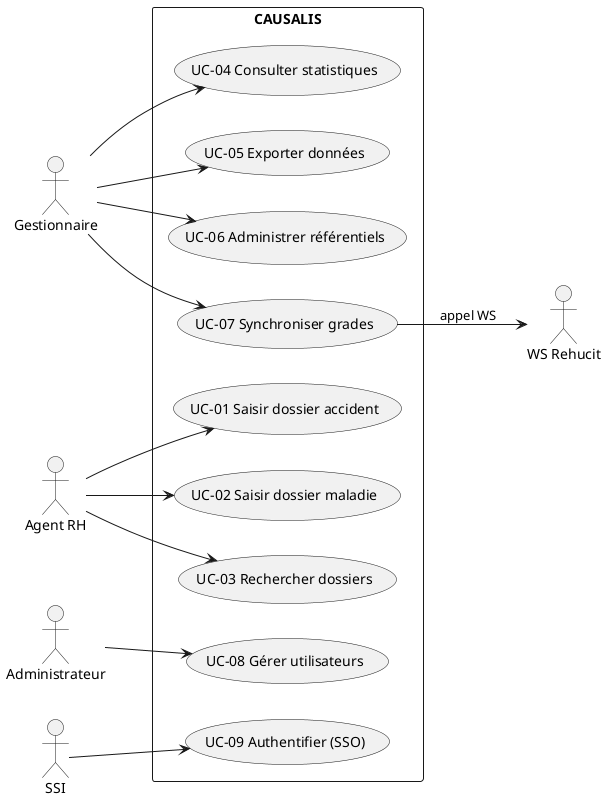
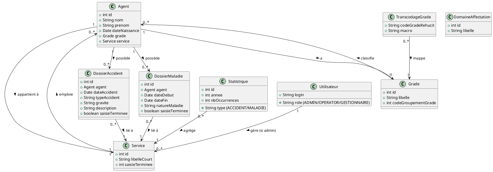

# 📄 Cahier des Charges Fonctionnel (CCF) – **CAUSALIS**  
*Version 1.0 – 28 avril 2026*  

[TOC]

---  

## 1️⃣ Introduction et contexte du projet  

### 1.1 Présentation du projet  

**CAUSALIS** est une application ministérielle de **gestion et de suivi statistique des accidents du travail et des maladies professionnelles** des agents de l’État. Elle centralise les déclarations d’accidents, les dossiers de maladie, les effectifs, ainsi que les référentiels (grades, services, domaines d’affectation, etc.) afin de produire des indicateurs nationaux et d’alimenter les tableaux de bord de la direction des ressources humaines.  

### 1.2 Objectifs stratégiques  

| # | Objectif | Impact attendu |
|---|----------|----------------|
| O1 | Centraliser les déclarations d’accidents et de maladies professionnelles | Amélioration de la qualité des données, réduction de la saisie multiple |
| O2 | Produire des statistiques fiables et actualisées (délais < 24 h) | Soutien aux décisions de prévention et à la politique de santé au travail |
| O3 | Assurer la conformité RGPD et la traçabilité des traitements | Réduction du risque juridique, auditabilité |
| O4 | Moderniser l’infrastructure technique (migration hors Castor JDO, Struts 1) | Maintenabilité à moyen terme, réduction des coûts d’exploitation |
| O5 | Offrir une interface ergonomique (navigation, export, recherche avancée) | Augmentation de la satisfaction des utilisateurs finaux (objectif > 80 % de satisfaction) |

### 1.3 Périmètre fonctionnel  

| Inclus | Exclus |
|-------|--------|
| • Saisie, édition, validation et archivage des **dossiers d’accident** et **dossiers de maladie**  <br>• Gestion des **référentiels** (grades, services, domaines d’affectation, etc.)  <br>• Recherche multi‑critères, visualisation et export (CSV, OpenOffice)  <br>• Production de **statistiques** (par grade, service, année, etc.)  <br>• Synchronisation avec les référentiels externes (WS Rehucit)  <br>• Authentification SSO via **Cerbere**  <br>• Gestion des **utilisateurs** (rôles, droits) | • Gestion des paies ou de la comptabilité <br>• Modules de formation ou de suivi médical (hors déclaration) <br>• Gestion des infrastructures serveur (hors portée du CCF) <br>• Développement de nouvelles technologies (ex. IA) – prévus dans les évolutions mais hors périmètre initial |

---  

## 2️⃣ Expression fonctionnelle du besoin *(NF EN 16271)*  

Chaque fonction de service (FS) décrit **le quoi** (besoin) sans détailler le comment. Les critères d’appréciation (CA) sont mesurables, la pondération (P) indique l’importance (1 = faible, 5 = critique).  

| FS | Description (quoi) | CA (exemples) | P | Contraintes |
|----|----------------------|---------------|---|-------------|
| **FS‑01** | **Saisir / éditer un dossier d’accident** | - Temps de saisie ≤ 15 min <br> - Validation obligatoire de tous les champs obligatoires <br> - Historisation des modifications (audit) | 5 | - Le grade, le service et le type d’accident doivent exister dans les référentiels <br> - Conformité RGPD (données personnelles) |
| **FS‑02** | **Saisir / éditer un dossier de maladie professionnelle** | - Temps de saisie ≤ 15 min <br> - Vérification de la cohérence dates (début ≤ fin) | 5 | - Même contraintes que FS‑01 |
| **FS‑03** | **Rechercher des dossiers (accident / maladie)** | - Temps de réponse ≤ 3 s pour 10 000 dossiers <br> - Support de filtres multiples (année, service, grade, nature) | 4 | - Indexation des colonnes utilisées en recherche |
| **FS‑04** | **Consulter / générer des statistiques** | - Disponibilité ≥ 99,5 % <br> - Export CSV ou OpenDocument en < 10 s <br> - Tableaux de bord actualisés quotidiennement | 5 | - Calcul différé nocturne pour gros volumes |
| **FS‑05** | **Exporter les données** | - Export complet ≤ 30 s <br> - Format conforme aux modèles (CSV, ODS) | 3 | - Gestion des droits d’export (seuls les rôles “Statistiques”) |
| **FS‑06** | **Administrer les référentiels (grades, services, domaines, etc.)** | - Modification d’un référentiel déclenche la synchronisation (synchronisation < 5 min) | 4 | - Validation de l’unicité des codes |
| **FS‑07** | **Synchroniser les grades avec le référentiel externe (WS Rehucit)** | - Taux de succès ≥ 99 % <br> - Log détaillé des erreurs | 4 | - Disponibilité du service WS, gestion des temps d’attente |
| **FS‑08** | **Gestion des utilisateurs et des droits** | - Création/modification d’un utilisateur ≤ 2 min <br> - Journalisation de chaque modification | 3 | - Intégration SSO Cerbere |
| **FS‑09** | **Authentification / SSO** | - Temps de connexion ≤ 2 s <br> - Déconnexion sécurisée (session invalide) | 5 | - Conformité aux exigences SSI du ministère |
| **FS‑10** | **Pagination des listes** | - Pagination configurable (max 30 lignes par page) <br> - Navigation fluide | 2 | - Valeur par défaut dans `project.properties` |
| **FS‑11** | **Gestion des warnings et messages d’erreur** | - Affichage clair, localisation possible | 2 | - Respect du design UI existant (JSP fragments) |

---  

## 3️⃣ Acteurs et parties prenantes  

| Acteur | Rôle | Besoins spécifiques | Responsable |
|--------|------|----------------------|--------------|
| **Gestionnaires (MOA)** | Maîtrise d’Ouvrage, décisionnaires | Tableau de bord statistique, export, conformité RGPD | Christian ARBOGAST (Chef de produit) |
| **Développeurs (MOE)** | Maîtrise d’Œuvre, maintenance | Accès au code, documentation technique, environnement de test | Maxime CAREIL (Lead dev) |
| **Utilisateurs finaux (agents, services RH)** | Saisie et consultation | Interface ergonomique, temps de saisie réduit, recherche efficace | Julien GARDIN (Responsable fonctionnel) |
| **Administrateurs système** | Exploitation, sécurité | Gestion des serveurs, suivi des logs, plan d’archivage | Nicolas DEMEY (Responsable infra) |
| **SSI (MOA SSI)** | Sécurité des systèmes d’information | Conformité aux exigences SSI, traçabilité, contrôle d’accès | SG/DRH/D/PSPP1 |
| **Référentiels externes (WS Rehucit)** | Fournisseur de données de grades | Disponibilité, format de réponse | SG/DNUM/PNM/DPNM3 |
| **Auditeurs RGPD** | Vérification conformité | Accès aux registres de traitements, preuves de consentement | – |
| **Support** | Assistance aux utilisateurs | Gestion des incidents, documentation d’aide | – |

---  

## 4️⃣ Cas d’usage (Use Cases)  

### 4.1 Diagramme de cas d’utilisation (PlantUML)



### 4.2 Description détaillée des cas d’usage  

| UC | Nom | Acteur(s) principal(aux) | Scénario nominal | Scénarios alternatifs / d’erreur | Pré‑conditions | Post‑conditions |
|----|-----|--------------------------|------------------|----------------------------------|----------------|-----------------|
| **UC‑01** | Saisir / éditer un dossier d’accident | Agent RH | 1. L’utilisateur s’authentifie (SSO). <br>2. Il sélectionne *« Nouvel Accident »*. <br>3. Il remplit le formulaire (agent, service, type d’accident, date, gravité, description). <br>4. Il valide. <br>5. Le système enregistre le dossier, crée une entrée d’audit et renvoie la confirmation. | A1 – Champ obligatoire manquant → affichage de warning. <br>A2 – Service inexistant → message d’erreur et abort. <br>A3 – Timeout du serveur → ré‑ouverture du formulaire avec données sauvegardées. | Session SSO valide, référentiels (grade, service…) chargés. | Dossier persistant en base, audit enregistré, tableau de bord mis à jour. |
| **UC‑02** | Saisir / éditer un dossier de maladie professionnelle | Agent RH | Identique à UC‑01, avec champs *date début*, *date fin*, *nature de la maladie*, *lieu*. | B1 – Date de fin antérieure à la date de début → message d’erreur. <br>B2 – Agent déjà déclaré maladie la même période → avertissement de doublon. | Idem UC‑01 | Dossier maladie persistant, lien avec l’agent, audit. |
| **UC‑03** | Rechercher des dossiers | Agent RH / Gestionnaire | 1. L’utilisateur ouvre la page de recherche. <br>2. Il saisit un ou plusieurs critères (année, service, type, statut). <br>3. Il lance la recherche. <br>4. Le système renvoie la liste paginée. | C1 – Aucun résultat → message « Aucun dossier trouvé ». <br>C2 – Trop de critères → suggestion de simplification. | Session valide, index de recherche à jour. | Résultats affichés, possibilité d’ouvrir le dossier. |
| **UC‑04** | Consulter / générer des statistiques | Gestionnaire | 1. Le gestionnaire sélectionne le module statistiques. <br>2. Il choisit les axes (grade, service, période). <br>3. Le système calcule et affiche les indicateurs (nombre d’accidents, taux, évolution). <br>4. Option d’export. | D1 – Calcul > 30 s → timeout et proposition d’export différé. | Données agrégées disponibles. | Tableau de bord mis à jour, export disponible. |
| **UC‑05** | Exporter les données | Gestionnaire / Administrateur | 1. L’utilisateur sélectionne le format (CSV, ODS). <br>2. Il confirme l’export. <br>3. Le système génère le fichier et le propose en téléchargement. | E1 – Permission insuffisante → message d’erreur. <br>E2 – Erreur d’écriture disque → log et notification admin. | Droits d’export accordés. | Fichier exporté, journal d’export enregistré. |
| **UC‑06** | Administrer les référentiels | Administrateur | 1. L’administrateur ouvre la page d’administration des référentiels. <br>2. Il crée / modifie / supprime une entrée (ex. grade). <br>3. Le système valide l’unicité, enregistre et lance la synchronisation (si nécessaire). | F1 – Code déjà existant → message d’erreur. <br>F2 – Référentiel utilisé dans un dossier → refus de suppression. | Référentiels chargés, droit d’administration. | Référentiel mis à jour, synchronisation déclenchée. |
| **UC‑07** | Synchroniser les grades avec le WS Rehucit | Administrateur | 1. L’administrateur lance la synchronisation. <br>2. Le système interroge le WS, récupère la liste des grades. <br>3. Il compare avec les grades locaux via `TranscodageGradePredicate`. <br>4. Les nouveaux grades sont insérés, les existants mis à jour. | G1 – WS indisponible → message d’erreur, log, reprise possible. <br>G2 – Incohérence de données → rapport d’anomalie. | Accès réseau au WS, droits d’écriture sur le référentiel. | Grades synchronisés, log de synchronisation. |
| **UC‑08** | Gérer les utilisateurs et leurs droits | Administrateur | 1. L’administrateur crée / modifie un compte. <br>2. Il associe un rôle (Gestionnaire, Opérateur, Admin). <br>3. Le système enregistre les informations et crée le lien avec le SSO. | H1 – Identifiant déjà utilisé → message d’erreur. | Accès admin, connexion au SSO. | Compte créé / mis à jour, journal d’audit. |
| **UC‑09** | Authentifier / déconnecter (SSO Cerbere) | Tout utilisateur | 1. L’utilisateur accède à l’URL CAUSALIS. <br>2. Cerbere le redirige vers le SSO, valide les identifiants. <br>3. Session créée, l’utilisateur accède aux fonctions autorisées. <br>4. À la déconnexion, la session est invalidée (voir `reauth.jsp`). | I1 – Authentification échouée → redirection vers la page d’erreur. <br>I2 – Session expirée → redirection vers login. | SSO Cerbere opérationnel. | Session active ou terminée, logs d’accès. |

---  

## 5️⃣ Processus métier (optionnel) – BPMN  

#### 5.1 Processus « Saisie d’un dossier d’accident »  

```plantuml
@startbpmn
start_event: Début
task1: Authentifier (SSO)
gateway1: Auth OK?
task2: Ouvrir formulaire accident
task3: Saisir données
gateway2: Données valides?
task4: Enregistrer dossier
task5: Créer audit
end_event: Fin
start_event --> task1
task1 --> gateway1
gateway1 --> task2 : oui
gateway1 --> end_event : non
task2 --> task3
task3 --> gateway2
gateway2 --> task4 : oui
gateway2 --> task2 : non (afficher warning)
task4 --> task5
task5 --> end_event
@endbpmn
```

---  

## 6️⃣ Règles métier et contraintes fonctionnelles  

| Règle | Formulation (IF…THEN) | Source / Référence |
|-------|------------------------|--------------------|
| **RM‑01** | *Si* le grade d’un agent n’est pas présent dans le référentiel `Grade`, *alors* la saisie du dossier est bloquée. | Service `GradeService` (filtre `util = 1`) |
| **RM‑02** | *Si* la date de fin d’un dossier maladie <  date de début, *alors* le système doit refuser la validation. | Formulaire `EditionDossierMaladieForm*` (validation) |
| **RM‑03** | *Si* un utilisateur possède le rôle `ADMIN`, *alors* il peut créer, modifier ou supprimer les référentiels. | Table `Utilisateur` + contrôle d’accès dans `Action*` |
| **RM‑04** | *Si* un grade est ajouté via la synchronisation WS, *alors* il doit être marqué comme `util = 1`. | `TranscodageGradePredicate` & `SynchronizeService` |
| **RM‑05** | *Si* un dossier est déclaré « saisie terminée », *alors* il devient en lecture seule. | Champ `saisieTerminee` dans `Service` |
| **RM‑06** | *Si* un export est demandé, *alors* le fichier doit être généré dans le répertoire temporaire du serveur et détruit après 5 min. | `CausalisExportManager` |
| **RM‑07** | *Si* un traitement implique des données personnelles, *alors* le journal d’audit doit contenir l’identifiant de l’utilisateur et la date/heure. | `ActionWarning` + logs |
| **RM‑08** | *Si* le serveur est en mode maintenance, *alors* toutes les requêtes HTTP retournent le code 503. | Configuration serveur (non codée ici). |
| **RM‑09** | *Si* le WS Rehucit ne répond pas dans les 30 s, *alors* la synchronisation échoue et un mail d’alerte est envoyé à l’administrateur. | `SynchronizeService` (timeout) |

---  

## 7️⃣ Parcours utilisateurs (User Journey)  

### 7.1 Parcours typique d’un **Agent RH**  

1. **Connexion** – Accès à l’URL → SSO Cerbere → redirection vers `index.do`.  
2. **Accueil** – Page d’accueil (`home.jsp`) redirige vers le tableau de bord.  
3. **Création d’un accident** – Click sur *« Nouvel Accident »* → formulaire (`EditionDossierAction`).  
4. **Saisie** – Remplissage des champs obligatoires, validation côté client (JS) puis serveur (`GenericForm.validateEmptyFields`).  
5. **Confirmation** – Message de succès, lien vers le dossier créé.  
6. **Recherche** – Utilisation du module de recherche (`RechercheDossiersForm`) pour vérifier l’enregistrement.  
7. **Déconnexion** – Click sur *« Déconnexion »* → `reauth.jsp` qui invalide la session et appelle `Cerbere.logoff`.  

### 7.2 Parcours d’un **Gestionnaire**  

1. **Connexion** (SSO).  
2. **Accès aux statistiques** → `StatistiquesAction`.  
3. **Sélection des filtres** (grade, service, période).  
4. **Visualisation** des indicateurs (graphes, tableaux).  
5. **Export** des résultats au format CSV.  
6. **Administration** (si rôle admin) → gestion des grades (`GradeService`) et déclenchement de la synchronisation (`SynchronizeService`).  

---  

## 8️⃣ Modèle Conceptuel de Données (MCD) – Diagramme UML (simplifié)



---  

## 9️⃣ Critères d’acceptation et validation  

| Fonction (FS) | Critère d’acceptation (CA) | Méthode de validation | Responsable | Priorité (MoSCoW) |
|---------------|---------------------------|----------------------|--------------|-------------------|
| FS‑01 | Temps de saisie ≤ 15 min, tous les champs obligatoires remplis, audit créé | Tests fonctionnels + mesures de performance (JMeter) | QA / MOE | **Must** |
| FS‑02 | Même critères que FS‑01, dates cohérentes | Tests unitaires + validation UI | QA / MOE | **Must** |
| FS‑03 | Temps de réponse ≤ 3 s, pagination fonctionnelle | Tests de charge (10 000 dossiers) | Performance Engineer | **Must** |
| FS‑04 | Disponibilité ≥ 99,5 % sur 30 jours, export ≤ 10 s | Monitoring (Grafana) + tests d’export | Ops / SSI | **Must** |
| FS‑05 | Export complet ≤ 30 s, droits vérifiés | Tests d’autorisation, logs d’audit | QA | **Should** |
| FS‑06 | Modification déclenche synchronisation < 5 min, unicité des codes | Tests d’intégrité DB + logs de synchronisation | Dev / MOE | **Should** |
| FS‑07 | Taux de succès ≥ 99 % sur 100 sync, logs détaillés | Simulations WS (MockServer) | QA / MOE | **Should** |
| FS‑08 | Création/modif ≤ 2 min, journalisation | Tests UI + vérif log | QA | **Could** |
| FS‑09 | Authentification ≤ 2 s, session invalide après logout | Tests d’end‑to‑end (Selenium) | SSI | **Must** |
| FS‑10 | Pagination configurable via `project.properties` | Vérif de lecture du fichier + UI | Dev | **Could** |
| FS‑11 | Affichage warnings conforme maquette | Tests UI (visual) | QA | **Could** |

---  

## 🔟 Annexes  

### 10.1 Glossaire métier  

| Terme | Définition |
|-------|------------|
| **Agent** | Fonctionnaire ou salarié du ministère concerné par le suivi des accidents/maladies. |
| **Accident** | Événement survenu dans le cadre du travail entraînant une blessure ou un dommage corporel. |
| **Maladie professionnelle** | Pathologie reconnue comme liée à l’activité professionnelle. |
| **Grade** | Niveau hiérarchique de l’agent, utilisé pour le calcul des indicateurs. |
| **Service** | Unité organisationnelle (direction, bureau, etc.). |
| **Domaine d’affectation** | Catégorie fonctionnelle regroupant plusieurs services. |
| **TranscodageGrade** | Correspondance entre le code interne du grade et le code du référentiel externe (Rehucit). |
| **Synchronisation** | Processus d’échange de données avec le WS externe Rehucit. |
| **SSO Cerbere** | Système d’authentification unique du ministère. |
| **Statistique** | Agrégat (nombre d’accidents, taux, évolution) calculé à partir des dossiers. |
| **Bilan d’audit** | Enregistrement détaillé de chaque modification (qui, quand, quoi). |

### 10.2 Référentiels et normes applicables  

| Référence | Description |
|------------|-------------|
| **NF EN 16271** – Management par la valeur – Expression fonctionnelle du besoin | Utilisé pour la structuration du CCF (décomposition en fonctions de service). |
| **ISO/IEC/IEEE 29148 :2018** – Ingénierie des exigences | Guide la rédaction des exigences, critères d’acceptation et traçabilité. |
| **ISO 27001** – Sécurité de l’information | Conformité exigée pour le module d’authentification et la journalisation. |
| **RGPD (EU‑2016/679)** – Protection des données personnelles | Applicable aux données d’agents (nom, date de naissance, dossier). |
| **Guide SSI ministériel** – Politique de sécurité des systèmes d’information du ministère | Implique l’usage du SSO Cerbere et la segmentation réseau. |

### 10.3 Historique des versions du document  

| Version | Date | Auteur | Modifications |
|---------|------|--------|---------------|
| 1.0 | 28/04/2026 | ChatGPT (assistant IA) | Version initiale – synthèse des sources `causalis.code.filtered.md`, `causalis.code.summarized.md`, `causalis.wiki.md`, `causalis.wikisi.md`. |
| 0.9 | 15/04/2026 | — | Draft interne, ajout du BPMN et des diagrammes PlantUML. |
| 0.8 | 01/04/2026 | — | Première collecte des exigences fonctionnelles. |

### 10.4 Bibliographie / sources  

| Source | Type | Utilisation |
|--------|------|--------------|
| `causalis.code.filtered.md` | Extraction du code source (Java, XML, JSP) | Identification des fonctions, services, référentiels, contraintes techniques. |
| `causalis.code.summarized.md` | Résumé du code | Vérification des dépendances, description des services, tags JSP. |
| `causalis.wiki.md` | Page wiki « home » | Liste des membres, aperçu fonctionnel. |
| `causalis.wikisi.md` | Page wiki « CAUSALIS » | Contexte métier, portée géographique, acteurs, contacts, sécurité, métadonnées. |
| `README.txt` | Historique du projet | Indications de migration (remplacement Cerbere‑bouchon). |
| `sonar-project.properties` | Qualité code | Indication du besoin d’analyse continue. |

---  

## 📌 Conclusion  

Ce CCF formalise les besoins fonctionnels et non fonctionnels de **CAUSALIS** en conformité avec les normes **NF EN 16271** et **ISO/IEC/IEEE 29148**. Il décrit les fonctions de service attendues, les acteurs impliqués, les cas d’usage, les règles métier, les processus et le modèle de données.  

Les critères d’acceptation définis permettent de piloter la validation et les phases de test. Les évolutions technologiques (migration JPA, modernisation UI) sont identifiées comme **exigences d’évolution** (hors périmètre initial) et seront traitées dans les prochains lots de modernisation.  

> **Prochaine étape** : Validation du CCF par les parties prenantes (MOA, MOE, SSI) → rédaction du **cahier des charges technique** (CDC) et planification du **développement**.  