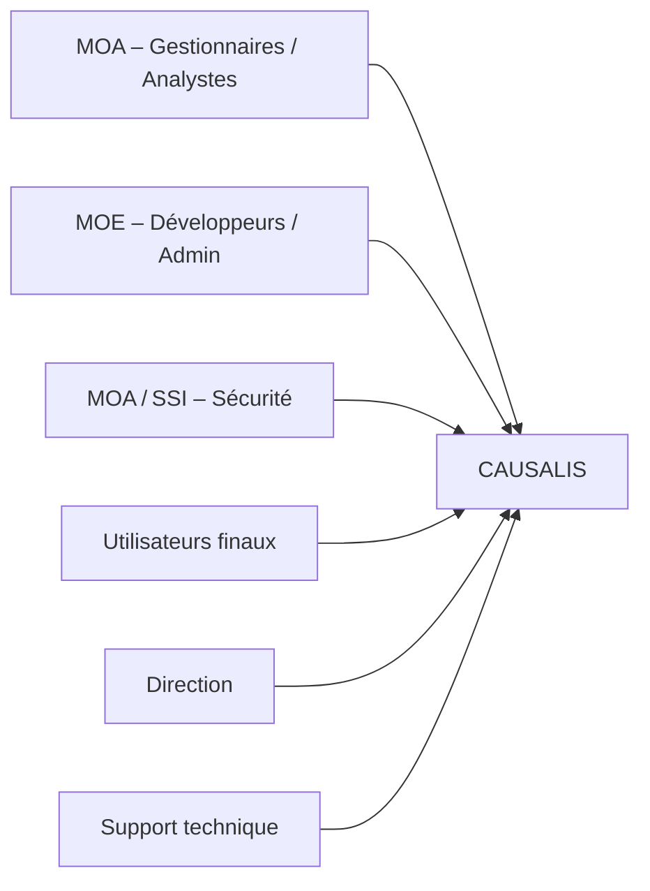

# 📄 Cahier des Charges Fonctionnel (CCF) – **CAUSALIS**  

> **Version** : 1.0 – 2024‑04‑28  
> **Document unique** – format **Markdown** compatible avec VS Code & Obsidian  

---  

[TOC]

---  

## 1️⃣ Introduction et contexte du projet  

### 1.1 Présentation du projet  

| Élément | Description |
|---------|-------------|
| **Nom** | **CAUSALIS** – Application de gestion et de suivi des accidents du travail et des maladies professionnelles du ministère. |
| **Objet** | Centraliser, suivre, analyser et exporter les données d’accidents et de maladies professionnelles afin de produire des statistiques nationales et d’alimenter les processus de prévention et de conformité RGPD. |
| **Portée** | **Nationale** (France métropolitaine + Outre‑Mer). |
| **Environnement technique** | Java 6, Struts 1.x, Castor JDO (Oracle 9), Tomcat 6, serveur ministériel (Paris La Défense – plateforme ACAI – clusters ESXi). |
| **Date de mise en production** | 2004 (actuellement en production). |
| **Utilisateurs actifs** | ~170 utilisateurs/mois (gestionnaires de service, administrateurs nationaux, analystes). |

### 1.2 Objectifs stratégiques  

| N° | Objectif | Indicateur de succès |
|----|----------|----------------------|
| O1 | **Fiabiliser** la collecte des accidents et maladies professionnelles. | Taux d’erreurs de saisie < 2 % sur les dossiers importés. |
| O2 | **Faciliter** la production de statistiques fiables et automatisées. | Délai de génération d’un rapport < 5 min. |
| O3 | **Assurer** la conformité RGPD et l’archivage pérenne. | Audit RGPD validé, archivage ≥ 10 ans. |
| O4 | **Optimiser** la prise de décision des acteurs de prévention. | Satisfaction MOA ≥ 80 % (enquête annuelle). |

### 1.3 Périmètre fonctionnel  

| Inclus | Exclus |
|--------|--------|
| • Gestion du **dossier d’accident** (création, édition, clôture).<br>• Gestion du **dossier de maladie professionnelle**.<br>• Gestion des **effectifs** (grade, service, âge, sexe).<br>• Export **OpenOffice** & CSV.<br>• **Statistiques** (par grade, service, type d’accident, tranche d’âge, etc.).<br>• Gestion des **référentiels** (grades, services, domaines d’affectation, etc.).<br>• Authentification SSO via **Cerbere**.<br>• Interface **Struts 1** (JSP, tags personnalisés). | • Modules de paie, temps de travail, gestion RH hors accidents.<br>• Historisation des versions de code (GitLab CI/CD).<br>• Gestion des incidents IT (hors accidents du travail). |

---  

## 2️⃣ Expression fonctionnelle du besoin (NF EN 16271)  

> **Fonctions de service (FS)** = besoins exprimés sans préciser la solution technique.  

| # | Fonction de service (FS) | Description (quoi) | Critères d’appréciation (mesurables) | Importance (pondération) | Contraintes |
|---|--------------------------|--------------------|--------------------------------------|--------------------------|-------------|
| **FS‑01** | **Saisir un dossier d’accident** | L’utilisateur crée ou modifie un dossier d’accident avec toutes les informations obligatoires. | - Temps moyen de saisie ≤ 15 min.<br>- 100 % des champs obligatoires renseignés.<br>- Validation sans erreur (code 200). | 15 % | - Respect du format de date (`dd/MM/yyyy`).<br>- Vérification de la cohérence grade/service. |
| **FS‑02** | **Saisir un dossier de maladie professionnelle** | Idem FS‑01 mais pour les maladies. | - Temps moyen ≤ 12 min.<br>- 98 % de dossiers valides à la première soumission. | 12 % | - Champ “date de début” antérieur à “date de fin”. |
| **FS‑03** | **Rechercher / filtrer les dossiers** | L’utilisateur peut rechercher des dossiers par critères (service, grade, type, période, etc.). | - Temps de réponse ≤ 3 s.<br>- Résultats paginés (max 30 lignes/page). | 10 % | - Utilisation du filtre `util = 1` (dossiers actifs). |
| **FS‑04** | **Gérer les effectifs** | Création / mise à jour des effectifs (grade, service, année de naissance, sexe). | - Cohérence âge/grade (tranche d’âge calculée correctement).<br>- 0 % de doublons. | 8 % | - Tranche d’âge calculée via `TrancheAgeHelper`. |
| **FS‑05** | **Exporter les données** | Générer un fichier OpenOffice ou CSV contenant les dossiers sélectionnés. | - Fichier généré ≤ 5 s.<br>- Conformité du format (vérifiable par script). | 7 % | - Utilisation de `CausalisExportManager`. |
| **FS‑06** | **Produire des statistiques** | Calculer et afficher des indicateurs (nb accidents par grade, taux d’incidence, etc.). | - Tableau de bord actualisé ≤ 30 s.<br>- 99 % de disponibilité du module statistiques. | 10 % | - Données anonymisées pour RGPD. |
| **FS‑07** | **Synchroniser les référentiels avec le service externe** | Mettre à jour les grades ↔ TranscodageGrade via WS. | - Nombre de lignes insérées ≥ 95 % des nouvelles entrées.<br>- Aucun doublon après synchronisation. | 6 % | - Implémentation de `SynchronizeService`. |
| **FS‑08** | **Authentifier les utilisateurs via SSO** | Utiliser Cerbere pour le login / logout. | - Temps de login ≤ 2 s.<br>- Taux d’échec d’authentification < 0,5 %. | 9 % | - Invalidation de session via `reauth.jsp`. |
| **FS‑09** | **Gérer les référentiels (grades, services, domaines…)** | CRUD basique sur les tables de référence. | - Temps de mise à jour ≤ 1 min.<br>- Historisation des modifications (audit). | 6 % | - Accès limité aux profils “admin”. |
| **FS‑10** | **Assurer la traçabilité et l’archivage** | Conserver les dossiers pendant 10 ans, générer le registre de traitements RGPD. | - Taux de conformité audit ≥ 95 %.<br>- Archivage automatisé quotidien. | 7 % | - Respect du registre `rgpd_registreTraitements`. |
| **FS‑11** | **Fournir une interface ergonomique** | Pages JSP, menus, filtres, messages d’avertissement. | - Score SUS (System Usability Scale) ≥ 68.<br>- Taux d’abandon de navigation < 5 %. | 5 % | - Utilisation des TagLib `StrutsOptionTag`, `PutIntoSessionTag`. |
| **FS‑12** | **Notifier les utilisateurs** | Envoi de mails (ou alertes) lors de la clôture d’un dossier ou d’une mise à jour critique. | - Délai d’envoi ≤ 1 min.<br>- Taux de délivrabilité ≥ 98 %. | 4 % | - Serveur de mail interne configuré. |

> **Total pondération** = 100 %

---  

## 3️⃣ Acteurs et parties prenantes  

| Acteur | Rôle | Besoins spécifiques |
|--------|------|----------------------|
| **Gestionnaire de service** (MOA) | Saisie, suivi, clôture des dossiers d’accident/maladie. | Interface simple, filtres par service, export rapide. |
| **Analyste statistique** (MOA) | Production de rapports et tableaux de bord. | Accès aux indicateurs, export CSV, anonymisation RGPD. |
| **Administrateur applicatif** (MOE) | Installation, mise à jour, supervision. | Gestion des référentiels, logs, synchronisation WS, archivage. |
| **MOA / SSI** (Sécurité) | Garant de la conformité RGPD et de la sécurité. | Journalisation, contrôle d’accès, audit. |
| **Développeur** (MOE) | Évolution fonctionnelle et corrective. | Code base (Struts 1, Castor JDO), CI/CD (GitLab). |
| **Utilisateur final** (agents) | Consultation de leurs dossiers, mise à jour de leurs informations personnelles. | Interface claire, accès via SSO, respect de la confidentialité. |
| **Support technique** | Gestion des incidents et assistance. | Documentation, logs d’erreur, traçabilité. |
| **Direction** | Pilotage du projet, validation des évolutions. | Reporting mensuel, indicateurs de performance. |

### Cartographie des parties prenantes  



---  

## 4️⃣ Cas d’usage (Use Cases)  

### 4.1 Diagramme de cas d’utilisation (UML)  

```mermaid
usecaseDiagram;
    actor Gestionnaire as G;
    actor Analyste as A;
    actor Administrateur as Admin;
    actor Utilisateur as U;
    G --> (Créer / Modifier Dossier Accident)
    G --> (Créer / Modifier Dossier Maladie)
    G --> (Rechercher Dossiers)
    G --> (Exporter Dossiers)

    A --> (Consulter Statistiques)
    A --> (Exporter Statistiques)

    Admin --> (Gérer Référentiels)
    Admin --> (Synchroniser Référentiels)
    Admin --> (Paramétrer SSO / Sécurité)

    U --> (Se connecter via SSO)
    U --> (Consulter son dossier)
```

### 4.2 Description détaillée des cas d’usage  

| # | Nom du cas d’usage | Acteur(s) principal(aux) | Scénario nominal | Scénarios alternatifs / d’erreur | Pré‑conditions | Post‑conditions |
|---|--------------------|---------------------------|-----------------|----------------------------------|----------------|-----------------|
| **UC‑01** | Créer / Modifier un **dossier d’accident** | Gestionnaire | 1. L’utilisateur se connecte via SSO.<br>2. Il clique sur *Nouveau accident*.<br>3. Il remplit le formulaire (date, grade, service, type, description).<br>4. Il valide.<br>5. Le système enregistre le dossier et l’affiche en mode lecture. | - **AE‑01** : champ obligatoire manquant → affichage de message d’avertissement (ActionWarning).<br>- **AE‑02** : erreur de persistance → rollback + affichage d’erreur technique. | Utilisateur authentifié, droits « saisie ». | Dossier persistant, visible dans la liste, audit créé. |
| **UC‑02** | Créer / Modifier un **dossier de maladie professionnelle** | Gestionnaire | Identique à UC‑01, avec champs spécifiques « date début », « date fin », « type maladie ». | - **AE‑03** : date de fin antérieure à date de début → rejet avec message. | Idem UC‑01. | Dossier persistant, cohérence dates vérifiée. |
| **UC‑03** | **Rechercher / filtrer les dossiers** | Gestionnaire / Analyste | 1. Accès à la page de recherche.<br>2. Sélection des filtres (période, service, grade, type, état).<br>3. Lancement de la recherche.<br>4. Résultats paginés (30 lignes/page). | - **AE‑04** : aucun résultat → affichage « Aucun dossier trouvé ». | Aucun (authentification suffisante). | Liste de dossiers affichée, paginator actif. |
| **UC‑04** | **Exporter les dossiers** | Gestionnaire | 1. Après recherche, l’utilisateur clique *Exporter*.<br>2. Choix du format (OpenOffice, CSV).<br>3. Le système génère le fichier via `CausalisExportManager` et le propose en téléchargement. | - **AE‑05** : génération échouée → message d’erreur, log technique. | Résultats de recherche disponibles. | Fichier exporté, log d’export créé. |
| **UC‑05** | **Consulter les statistiques** | Analyste | 1. L’utilisateur accède au tableau de bord.<br>2. Sélection des indicateurs (par grade, par service, par tranche d’âge).<br>3. Le système calcule et affiche les graphiques. | - **AE‑06** : données insuffisantes → affichage « Pas assez de données ». | Authentifié, droits d’accès aux statistiques. | Tableau de bord mis à jour, export possible. |
| **UC‑06** | **Synchroniser les référentiels** | Administrateur | 1. L’administrateur lance la synchronisation via l’interface admin.<br>2. `SynchronizeService` appelle les WS (Grade, TranscodageGrade).<br>3. Les nouvelles lignes sont insérées, les doublons ignorés. | - **AE‑07** : WS indisponible → rollback, notification admin. | Accès admin, service WS configuré. | Référentiels à jour, log de synchronisation. |
| **UC‑07** | **Authentification SSO** | Tous les utilisateurs | 1. L’utilisateur accède à l’URL.<br>2. Redirection vers Cerbere.<br>3. Après authentification, la session est créée et l’utilisateur est redirigé vers `index.do`. | - **AE‑08** : échec SSO → redirection vers `reauth.jsp` + message. | Aucun (public). | Session valide, utilisateur identifié. |
| **UC‑08** | **Gérer les référentiels** | Administrateur | 1. Accès à la page *Référentiels*.<br>2. CRUD sur grades, services, domaines.<br>3. Sauvegarde et audit des changements. | - **AE‑09** : violation d’unicité → rejet avec message. | Droits admin. | Référentiels mis à jour, audit créé. |

---  

## 5️⃣ Processus métier (optionnel)  

### 5.1 Diagramme BPMN – **Création d’un dossier d’accident**  

```mermaid
bpmnDiagram;
    participant Gestionnaire;
    participant Application;
    participant BaseDeDonnées;
    participant Audit;
    Gestionnaire->Application: Ouvrir formulaire Accident;
    Application->Gestionnaire: Afficher formulaire;
    Gestionnaire->Application: Soumettre formulaire;
    alt Validation réussie;
        Application->BaseDeDonnées: INSERT dossier;
        BaseDeDonnées --> Application: OK;
        Application->Audit: Créer entrée audit;
        Audit --> Application: OK;
        Application->Gestionnaire: Confirmation + affichage dossier;
    else Validation échouée;
        Application->Gestionnaire: Message d’erreur (ActionWarning)
    end
```

### 5.2 Points de contrôle & règles de gestion  

| Point de contrôle | Règle métier | Source |
|-------------------|--------------|--------|
| **Date d’accident** | Doit être antérieure ou égale à la date du jour. | `DateValidator` (form). |
| **Tranche d’âge** | Calculée via `TrancheAgeHelper.makeTrancheAge(anneeNaissance, anneeSynchro)`. | `TrancheAgeHelper.java`. |
| **Correspondance Grade ↔ TranscodageGrade** | Un `TranscodageGrade` doit être présent pour chaque `Grade` utilisé. | `TranscodageGradePredicate`. |
| **Clôture dossier** | Le champ `saisieTerminee` du `Service` passe à 1 uniquement si tous les dossiers du service sont clôturés. | Service métier. |
| **Export** | Le fichier doit contenir toutes les colonnes visibles dans la vue (vérifié par `CausalisExportManager`). | `CausalisExportManager.java`. |
| **RGPD – Anonymisation** | Suppression des champs nominaux (nom, prénom) dans les exports statistiques. | Règle de confidentialité (document RGPD). |

---  

## 6️⃣ Règles métier et contraintes fonctionnelles  

| # | Règle métier (condition → action) | Domaine | Commentaire |
|---|-----------------------------------|--------|-------------|
| **R‑01** | Si `Grade` possède `codeGradeRehucit` alors `TranscodageGrade.macro` doit être renseigné. | Référentiel grades | Vérifié dans `TranscodageGradePredicate`. |
| **R‑02** | Si `anneeNaissance` ≥ `anneeSynchro - 20` alors `trancheAge = '1'`. | Effectif | Implémenté dans `TrancheAgeHelper`. |
| **R‑03** | Si le dossier d’accident a `saisieTerminee = 1` alors le statut du service passe à `SaisieTerminee = 1`. | Service | Contrôle de cohérence métier. |
| **R‑04** | Aucun utilisateur ne peut modifier un dossier dont le champ `statut` = `Clôturé`. | Sécurité | Enforced via Struts Action permissions. |
| **R‑05** | Lors de l’export, les colonnes `nom`, `prénom` sont masquées pour les rapports statistiques. | RGPD | Conformité au registre RGPD. |
| **R‑06** | La synchronisation ne doit pas créer de doublons (`TranscodageGradeService.isPresent`). | Synchronisation | Implémenté dans `TranscodageGradePredicate`. |
| **R‑07** | Le champ `pagination.max` doit être compris entre 10 et 100. | Configuration | Valeur par défaut = 30 (property). |
| **R‑08** | Tous les accès aux pages `/admin/*` sont limités aux rôles `ADMIN` ou `SUPERADMIN`. | Sécurité | Contrôlé par `StrutsOptionTag` & filtre d’auth. |
| **R‑09** | Le champ `code` des tables de référence doit être unique. | Intégrité référentielle | Vérifié par contraintes DB (Oracle). |
| **R‑10** | Le fichier `database.xml` doit référencer le JNDI `jdbc/userDScausalis`. | Infrastructure | Nécessaire au fonctionnement de Castor JDO. |

---  

## 7️⃣ Parcours utilisateurs (User Journey)  

### 7.1 Parcours **Gestionnaire** – Création d’un accident  

| Étape | Interaction | Système | Points de validation |
|-------|-------------|---------|---------------------|
| 1 | **Login SSO** via Cerbere | Redirige vers `index.do`. | Authentification réussie (`reauth.jsp` en cas d’échec). |
| 2 | **Accéder** au menu *Gestion des accidents*. | Affiche page `dossiers.jsp`. | Autorisation OK. |
| 3 | **Cliquer** sur *Nouveau accident*. | Ouvre `editionDossierPage1.jsp`. | Formulaire chargé. |
| 4 | **Remplir** les champs (date, service, grade, type). | Validation côté client (`DateValidator`). | Aucun champ obligatoire vide. |
| 5 | **Soumettre** le formulaire. | Action Struts → `EditionDossierAction`. | `EffectifComparator` vérifie doublons. |
| 6 | **Enregistrement** réussi. | DAO → `DossierAccidentDAO`. | Retour `200`, audit créé. |
| 7 | **Confirmation** affichée + lien *Imprimer*. | `ImpressionDossierAction`. | PDF généré (OpenOffice). |
| 8 | **Déconnexion** éventuelle. | `reauth.jsp`. | Session invalidée. |

### 7.2 Parcours **Analyste** – Consultation des statistiques  

| Étape | Interaction | Système | Points de validation |
|-------|-------------|---------|---------------------|
| 1 | Login SSO. | Identique. |
| 2 | Accéder au tableau de bord *Statistiques*. | `statistiques.jsp`. |
| 3 | Sélectionner filtres (période, grade). | Formulaire `StatistiquesForm`. |
| 4 | Lancer le calcul. | `StatistiquesAction` → `StatistiquesService`. |
| 5 | Visualiser graphiques / tableau. | Données agrégées, anonymisées. |
| 6 | Export CSV. | `CausalisExportManager`. |
| 7 | Déconnexion. | Idem. |

---  

## 8️⃣ Modèle Conceptuel de Données (MCD)  

> Diagramme UML simplifié (classes + associations).  

```mermaid
classDiagram
    class DossierAccident {
        +int id;
        +Date dateAccident;
        +String typeAccident;
        +String description;
        +int serviceId;
        +int gradeId;
        +int statut;
    }
    class DossierMaladie {
        +int id;
        +Date dateDebut;
        +Date dateFin;
        +String typeMaladie;
        +int serviceId;
        +int gradeId;
        +int statut;
    }
    class Effectif {
        +int id;
        +int anneeNaissance;
        +String sexe;
        +int gradeId;
        +int serviceId;
        +char trancheAge;
    }
    class Service {
        +int id;
        +String libelleCourt;
        +int saisieTerminee;
        +int saisieMaladiesProTerminee;
    }
    class Grade {
        +int id;
        +String libelle;
        +int codeGroupementGrade;
    }
    class TranscodageGrade {
        +String codeGradeRehucit;
        +String macro;
    }
    class DomaineAffectation {
        +int id;
        +String libelle;
    }

    DossierAccident "1" --> "1" Service : serviceId;
    DossierAccident "1" --> "1" Grade : gradeId;
    DossierMaladie "1" --> "1" Service : serviceId;
    DossierMaladie "1" --> "1" Grade : gradeId;
    Effectif "1" --> "1" Service : serviceId;
    Effectif "1" --> "1" Grade : gradeId;
    Grade "1" --> "0..1" TranscodageGrade : codeGradeRehucit;
    Service "1" --> "0..*" DomaineAffectation : (via tables de référence)
```

> *Toutes les classes héritent de `BeanObject` ou `TablesReferences` (non détaillé).*

---  

## 9️⃣ Critères d’acceptation et validation  

| Fonction | Critère d’acceptation | Méthode de validation | Responsable | Priorité (MoSCoW) |
|----------|-----------------------|-----------------------|-------------|-------------------|
| **FS‑01** Saisie accident | - Formulaire accepte uniquement les dates valides.<br>- Enregistrement persistant sans erreur.<br>- Audit créé. | Tests fonctionnels automatisés + revue de logs. | QA + MOE | **M** |
| **FS‑02** Saisie maladie | Idem FS‑01 + cohérence dates début/fin. | Tests unitaires + tests d’intégration. | QA | **M** |
| **FS‑03** Recherche | Temps de réponse ≤ 3 s, pagination fonctionnelle. | Tests de charge (JMeter) + scénario UI. | Performance Engineer | **M** |
| **FS‑04** Effectifs | Tranche d’âge calculée correctement (ex. 1975 → ‘2’ si anneeSynchro=2024). | Unit test `TrancheAgeHelperTest`. | Dev | **S** |
| **FS‑05** Export | Fichier généré, format conforme, < 5 s. | Comparaison du checksum avec fichier de référence. | QA | **S** |
| **FS‑06** Statistiques | Valeurs agrégées exactes (ex. nb accidents par grade). | Jeux de données de test + validation SQL. | Analyste | **S** |
| **FS‑07** Synchronisation | ≥ 95 % des nouvelles lignes insérées, aucun doublon. | Rapport de synchronisation + test de non‑duplication. | MOE | **C** |
| **FS‑08** Authentification | Login ≤ 2 s, taux d’échec < 0,5 %. | Log d’application + monitoring SSO. | SSI | **M** |
| **FS‑09** Référentiels | CRUD ≤ 1 min, audit des modifications. | Test fonctionnel + revue d’audit. | Admin | **C** |
| **FS‑10** Archivage | Dossiers archivés ≥ 10 ans, registre RGPD à jour. | Vérification du job d’archivage + audit RGPD. | SSI | **M** |
| **FS‑11** Ergonomie | Score SUS ≥ 68. | Test utilisateurs (n = 10). | UX Designer | **S** |
| **FS‑12** Notifications | Mail envoyé < 1 min, délivrabilité ≥ 98 %. | Monitoring SMTP + logs. | Support | **C** |

---  

## 🔟 Annexes  

### A. Glossaire métier  

| Terme | Définition |
|-------|------------|
| **Dossier Accident** | Enregistrement détaillé d’un accident du travail (date, type, service, grade, description). |
| **Dossier Maladie** | Enregistrement d’une maladie professionnelle (dates, type, service, grade). |
| **Effectif** | Représente un agent (grade, service, année de naissance, sexe) utilisé pour le calcul des indicateurs. |
| **TranscodageGrade** | Liaison entre le grade interne et le code grade du système externe *Rehucit*. |
| **Tranche d’âge** | Catégorie d’âge (1 → ≤ 20 ans, 2 → 21‑29, 3 → 30‑44, 4 → 45‑54, 5 → ≥ 55). |
| **Statut** | État du dossier (ouvert, clôturé, en cours). |
| **Synchronisation** | Processus de mise à jour des référentiels internes à partir de services web externes. |
| **Cerbere** | Composant SSO du ministère (authentification). |
| **EffectifComparator** | Comparateur utilisé pour détecter des doublons d’effectifs. |

### B. Référentiels normatifs  

| Référence | Application |
|-----------|-------------|
| **NF EN 16271** – Management par la valeur – Expression fonctionnelle du besoin et cahier des charges fonctionnel | Méthodologie de rédaction du présent CCF. |
| **ISO/IEC/IEEE 29148 :2018** – Ingénierie des exigences | Structuration des exigences, traçabilité, critères d’acceptation. |
| **ISO 27001** – Sécurité de l’information | Conformité sécurité (SSO, journalisation, contrôle d’accès). |
| **RGPD** – Protection des données personnelles | Anonymisation des exports statistiques, registre des traitements. |
| **ISO 9001** – Management qualité | Processus d’amélioration continue (audit, KPI). |

### C. Historique des versions du document  

| Version | Date | Auteur | Modifications |
|---------|------|--------|---------------|
| 1.0 | 2024‑04‑28 | ChatGPT (IA) | Création initiale du CCF (sections 1‑10). |
| 0.1 | 2022‑09‑07 | – | Première collecte d’informations (code source, wiki). |

---  

*Fin du Cahier des Charges Fonctionnel.*  