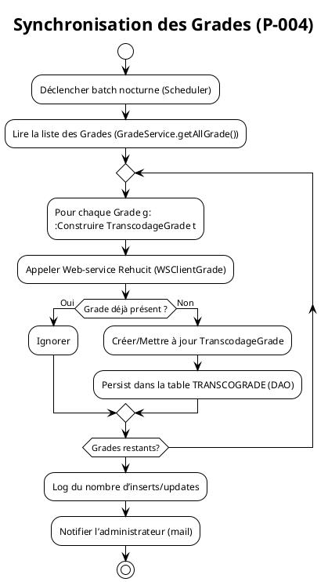
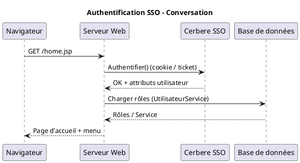

# 📄 **Cahier des Charges Fonctionnel (CCF) – Application CAUSALIS**  
*Version 1.0 – 28 avril 2026*  

> **Objet** : Formaliser les exigences fonctionnelles de l’application CAUSALIS (Gestion nationale des accidents du travail et des maladies professionnelles) en se basant sur les artefacts fournis : arborescence du code, documentation métier, wiki d’entreprise et conventions BPMN ISO/IEC 19510 :2013.  

---  

## 1️⃣ Introduction et contexte processus  

| Élément | Description |
|---------|-------------|
| **Organisation** | Ministère de la Transition Écologique – Direction des Ressources Humaines (DRH). Hébergement : centre‑serveur ministériel Paris La Défense (clusters ESXi, plateforme ACAI – Java). |
| **Périmètre fonctionnel** | - Saisie, modification, validation et clôture des dossiers d’accident du travail (DAT). <br>- Saisie, modification, validation et clôture des dossiers de maladies professionnelles (DMP). <br>- Gestion des référentiels (Grades, Services, Domaines d’affectation, Statuts, etc.). <br>- Production de statistiques et d’exportations (OpenOffice, CSV). <br>- Synchronisation des référentiels avec le système Rehucit via web‑services. |
| **Objectifs de la modélisation BPMN** | 1. Obtenir une **vue unique** et **exécutable** des processus métier critiques. <br>2. Identifier les **points de contrôle** (règles de gestion, KPI, traitements d’erreur). <br>3. Faciliter la **traçabilité** entre exigences, activités et scénarios de test. <br>4. Préparer la **migration** vers une architecture plus moderne (JPA + Spring Boot). |
| **Glossaire métier (extraits)** | *Dossier Accident* : fiche décrivant un accident du travail. <br>*Dossier Maladie* : fiche décrivant une maladie professionnelle. <br>*Grade* : niveau hiérarchique du personnel, synchronisé avec Rehucit. <br>*Statut* : état d’avancement du dossier (Brouillon, Validé, Clôturé). <br>*Effectif* : effectif d’un service à une date donnée. |
| **Enjeux** | - **Conformité RGPD** : archivage sécurisé des dossiers. <br>- **Disponibilité** : l’application est en production depuis 2004, doit rester accessible 24 / 7. <br>- **Qualité** : taux d’erreur < 1 % sur les imports/exports, délai de traitement < 2 jours ouvrés. |

---  

## 2️⃣ Cartographie des processus (Process Map)  

### 2.1 Nomenclature hiérarchique  

| Niveau | Type de processus | Exemple de processus |
|--------|-------------------|----------------------|
| **P‑001** | **Processus métier stratégique** | Gestion de la **conformité réglementaire** (déclaration annuelle des accidents). |
| **P‑002** | **Processus métier opérationnel** | Saisie / Validation / Clôture d’un **Dossier Accident**. |
| **P‑003** | **Processus métier opérationnel** | Saisie / Validation / Clôture d’un **Dossier Maladie**. |
| **P‑004** | **Processus de support** | Synchronisation des **Grades** avec Rehucit (web‑service). |
| **P‑005** | **Processus de support** | Production d’**Export statistiques** (OpenOffice, CSV). |
| **P‑006** | **Processus de management** | Gestion des **périmètres d’accès** (authentification SSO, réauthentification). |

### 2.2 Matrice de processus  

| ID Processus | Nom | Type | Propriétaire | Priorité |
|-------------|-----|------|--------------|----------|
| **P‑002** | Gestion du Dossier Accident | Opérationnel | **Chef de produit** (Christian ARBOGAST) | Critique |
| **P‑003** | Gestion du Dossier Maladie | Opérationnel | **Chef de produit** (Christian ARBOGAST) | Critique |
| **P‑004** | Synchronisation des Grades | Support | **Responsable technique** (Marc KANAAN) | Haute |
| **P‑005** | Export & Statistiques | Support | **Responsable reporting** (Vincent JUSTIN) | Moyenne |
| **P‑006** | Authentification & Session | Management | **MOA SSI** (SG/DRH/D/PSPP1) | Haute |

---  

## 3️⃣ Modélisation BPMN détaillée  

> Les diagrammes sont exprimés en **PlantUML** (syntaxe BPMN).  
> Chaque diagramme porte le même **identifiant de processus** que la matrice ci‑dessus.  

### 3.1 Diagramme de collaboration – *Gestion du Dossier Accident* (P‑002)  

```plantuml
@startuml
!theme plain
title Gestion du Dossier Accident (P‑002) – Vue Collaboration

|#LightBlue|Utilisateur (Agent)|
|#LightGreen|Application CAUSALIS|
|#LightYellow|Service Grade (WS)|
|#LightGray|Base de données (Oracle)|
|#LightCoral|Service de Synchronisation (Rehucit)|
|#LightPink|Moteur de Statistiques|

|Utilisateur|
start
:Se connecter (SSO);
:Accéder à l’écran “Création DAT”;

|Application CAUSALIS|
:Initialiser Form “EditionDossierForm1”;
:Afficher page “editionDossierPage1.jsp”;

partition Saisie {
    :Saisir données accidents;
    :Valider champs (DateValidator);
    note right of Application CAUSALIS
        Si champ vide → Message d’avertissement
    end note
    :Cliquer “Enregistrer”;
    :Appeler Service “DossierAccidentService.save()”;
}

|Base de données|
:Persist Dossier Accident (DAO);
:Retourner ID généré;

|Application CAUSALIS|
if (Statut = “Brouillon”) then (Oui)
  :Afficher bouton “Valider”;
else (Non)
endif

|Application CAUSALIS|
:Cliquer “Valider”;
:Appeler Service “DossierAccidentService.validate()”;

|Base de données|
:Passer le statut à “Validé”;
:Déclencher trigger de calcul d’indicateurs;

|Moteur de Statistiques|
:Recalculer KPI (durée moyen, taux de rejet);
:Mettre à jour tableau de bord;

|Application CAUSALIS|
:Afficher confirmation “Dossier validé”;
stop

|Application CAUSALIS|
:Cliquer “Clôturer”;
:Appeler Service “DossierAccidentService.close()”;

|Base de données|
:Passer le statut à “Clôturé”;
:Archiver le dossier (table Archive_DACCIDENT);

|Application CAUSALIS|
:Envoyer mail de clôture (WS Mail);
stop
@enduml
```

### 3.2 Diagramme de processus – *Synchronisation des Grades* (P‑004)  



### 3.3 Diagramme de processus – *Export & Statistiques* (P‑005)  

```plantuml
@startuml
!theme plain
title Export & Production de Statistiques (P‑005)

start
:Utilisateur demande l’écran “statistiques.jsp”;

|Application CAUSALIS|
:Appeler StatistiquesService.getStatistiques();
:Récupérer les indicateurs (KPI) depuis la BDD;

if (Export demandé ?) then (Oui)
  :Choisir format (OpenOffice / CSV);
  :Appeler CausalisExportManager.export(format);
  :Générer le fichier (FichierOpenOffice);
  :Proposer le téléchargement;
else (Non)
endif

|Application CAUSALIS|
:Afficher les graphiques (JS + HTML);
stop
@enduml
```

### 3.4 Diagramme de conversation (optionnel) – *Authentification SSO* (P‑006)  



---  

## 4️⃣ Règles de gestion métier  

| Point de décision | Condition | Règle métier (RB‑X) | Source |
|-------------------|-----------|----------------------|--------|
| **RB‑001** | Enregistrement d’un DAT, champ `dateAccident` > date du jour | Refuser la saisie et afficher *« Date future non autorisée »*. | Spécification fonctionnelle (Système de saisie). |
| **RB‑002** | Lors de la validation d’un DAT, `grade` du salarié absent dans le référentiel `Grade` | Bloquer la validation et générer un *warning* « Grade inconnu ». | Service `GradeService` + `TranscodageGradePredicate`. |
| **RB‑003** | Lors de la clôture d’un DAT, le statut doit être **Validé** | Interdire la clôture si statut ≠ Validé. | Méthode `DossierAccidentService.close()`. |
| **RB‑004** | Synchronisation des Grades – si `codeGradeRehucit` déjà présent | Ne pas insérer, passer en **Update** seulement si les métadonnées changent. | `TranscodageGradePredicate.evaluate()`. |
| **RB‑005** | Export statistique – période sélectionnée > 12 mois | Refuser l’export (limite technique) et proposer de réduire la période. | `StatistiquesService` (contrôle de paramètres). |
| **RB‑006** | Authentification – session inactive > 30 min | Invalider la session et rediriger vers `reauth.jsp`. | `session.timeout` du serveur d’applications. |

---  

## 5️⃣ Données et documents  

### 5.1 Objets de données (Data Objects)  

| Objet | Table(s) | Description | Persisté par |
|-------|----------|-------------|--------------|
| `DossierAccident` | `ACCIDENT` | Informations détaillées sur l’accident du travail. | `DossierAccidentDAO` (extends `GenericDao`). |
| `DossierMaladie` | `MALADIE` | Informations sur la maladie professionnelle. | `DossierMaladieDAO`. |
| `Grade` | `GRADE` | Référentiel des grades (code, libellé, groupe). | `GradeDao`. |
| `TranscodageGrade` | `TRANSCOGRADE` | Mapping Rehucit ↔ Causalis. | `TranscodageGradeDao`. |
| `Statut` | `STATUT` | États possibles d’un dossier (Brouillon, Validé, Clôturé). | `StatutDao`. |
| `Service` | `SERVICE` | Unité organisationnelle (ex. service de santé). | `ServiceDao`. |
| `Effectif` | `EFFECTIF` (via WS) | Effectifs d’un service à une année donnée. | `EffectifService` (WS). |
| `ExportFile` | `EXPORT_LOG` | Historique des exports (date, format, utilisateur). | `CausalisExportManager`. |

### 5.2 Artifacts  

| Artifact | Usage |
|----------|-------|
| **Group** | Regroupe les activités de *Saisie* et *Validation* dans les diagrammes. |
| **Annotation** | Commentaires de règle (ex. *RB‑001*) attachés aux passerelles. |
| **Association** | Lien entre *Form* (`EditionDossierForm*`) et *Bean* (`DossierAccident`). |

---  

## 6️⃣ Acteurs et rôles  

| Lane (BPMN) | Rôle métier | Responsabilités | Compétences |
|-------------|-------------|----------------|-------------|
| **Agent** | Utilisateur final (agent public) | Saisie, modification, validation de son DAT/DMP. | Connaissance du processus de déclaration d’accident. |
| **Gestionnaire** | Responsable de service | Validation et clôture des dossiers, suivi des KPI. | Maîtrise des règles métier, accès aux rapports. |
| **Administrateur** | MOE/MOA | Gestion des référentiels (Grades, Services), planification de la synchronisation, configuration des exports. | Administration Java/Oracle, gestion des batchs. |
| **Service Web Rehucit** | Système externe | Fournit le référentiel des grades (code, macro‑grade). | Interface SOAP/REST, mapping `TranscodageGrade`. |
| **Moteur de Statistiques** | Service interne | Calcul des indicateurs de performance. | Java, requêtes analytiques, génération de rapports. |
| **SSO Cerbere** | Service d’authentification | Authentifie les agents, gère les sessions. | LDAP, SAML, gestion de tickets. |

---  

## 7️⃣ Performances et indicateurs (KPIs)  

| Indicateur | Formule | Objectif | Seuil d’alerte |
|------------|---------|----------|----------------|
| **Durée moyenne de traitement d’un DAT** | (date clôture – date création) / nb dossiers | < 2 jours ouvrés | > 3 jours ouvrés |
| **Taux de rejet à la validation** | (nb dossiers rejetés / nb dossiers soumis) × 100 | < 5 % | > 10 % |
| **Coût moyen par dossier** | (coût serveur + temps développeur) / nb dossiers | < 0,5 € | > 1 € |
| **Disponibilité de l’application** | (temps de disponibilité / temps total) × 100 | 99,5 % | < 98 % |
| **Nombre de grades synchronisés** | compteur d’inserts/updates batch | ≥ 95 % des grades actifs | < 90 % |

*Les KPI sont mesurés par le **Moteur de Statistiques** et affichés sur `statistiques.jsp`.*

---  

## 8️⃣ Gestion des exceptions  

| Scénario d’erreur | Événement déclencheur | Gestion (Boundary Event) | Conséquence métier |
|--------------------|------------------------|--------------------------|--------------------|
| **Timeout WS Rehucit** | Pas de réponse du WS dans 30 s | *Timer Boundary Event* sur l’activité **Appeler WS Rehucit** → `ServiceException` | Le batch de synchronisation s’arrête, un mail d’alerte est envoyé, l’opération sera ré‑essayée au prochain run. |
| **Erreur DB (Constraint violation)** | Insertion d’un `TranscodageGrade` déjà existant | *Error Boundary Event* sur **Persist TranscodageGrade** → `DaoException` | L’enregistrement est ignoré, le compteur d’erreurs augmente, le batch continue. |
| **Validation formulaire** | Champ obligatoire vide (ex. date accident) | *Message Event* → `ActionWarning` affiché à l’utilisateur | L’utilisateur corrige le formulaire, la transaction n’est pas lancée. |
| **Session expirée** | Inactivité > 30 min | *Escalation Boundary Event* sur chaque activité utilisateur → redirection vers `reauth.jsp`. | L’utilisateur doit se ré‑authentifier, aucune perte de données. |
| **Export fichier trop volumineux** | Sélection d’une période > 12 mois | *Conditional Event* → message d’erreur `RB‑005`. | L’utilisateur revient à la sélection de période. |

---  

## 9️⃣ Sous‑processus et réutilisation  

| Sous‑processus (ID) | Description | Réutilisation |
|--------------------|-------------|----------------|
| **SP‑001** | *Initialisation du formulaire d’édition* (`EditionDossierForm*` → `ActionUtils`) | Utilisé par les processus **P‑002** et **P‑003** (DAT & DMP). |
| **SP‑002** | *Validation métier commune* (vérification de la cohérence des dates, du grade, du service) | Appelé depuis `DossierAccidentService.validate()` et `DossierMaladieService.validate()`. |
| **SP‑003** | *Synchronisation des référentiels* (lecture, appel WS, persistance) | Utilisé par **P‑004** (Grades) et pourra être étendu aux *Services* ou *Domaines d’affectation*. |
| **SP‑004** | *Export de statistiques* (`CausalisExportManager`) | Utilisé par **P‑005** (Export) et par le batch de génération de rapports mensuels. |

---  

## 🔟 Matrice de traçabilité  

| Exigence CCF | Processus BPMN | Tâche(s) | Scénario de test |
|--------------|----------------|-----------|-------------------|
| **EXG‑001** (Création DAT) | P‑002 – Diagramme de collaboration | `EditionDossierForm1` → `DossierAccidentService.save()` | Test **Nominal** : création d’un DAT complet → statut *Brouillon*. |
| **EXG‑002** (Validation DAT) | P‑002 – Diagramme de collaboration | `DossierAccidentService.validate()` | Test **Erreur** : validation avec grade inexistant → message *RB‑002*. |
| **EXG‑003** (Clôture DAT) | P‑002 – Diagramme de collaboration | `DossierAccidentService.close()` | Test **Nominal** : clôture d’un DAT en statut *Validé* → archivage. |
| **EXG‑004** (Synchronisation Grades) | P‑004 – Diagramme de processus | `GradeService.getAllGrade()` + WS call | Test **Batch** : exécution du batch → compteur d’inserts = expected. |
| **EXG‑005** (Export Statistiques) | P‑005 – Diagramme de processus | `CausalisExportManager.export(format)` | Test **Nominal** : export CSV pour période 6 mois → fichier non vide. |
| **EXG‑006** (Authentification) | P‑006 – Diagramme de conversation | `Cerbere.logoff` | Test **Sécurité** : session expirée → redirection `reauth.jsp`. |

---  

## 11️⃣ Validation et conformité  

### 11.1 Checklist BPMN  

- [x] Tous les flux ont une source et une cible.  
- [x] Une et une seule activité de **début** (`Start Event`).  
- [x] Au moins une activité de **fin** (`End Event`).  
- [x] Pas de **gateway** orphelin (toutes les passerelles ont au moins deux chemins).  
- [x] Labels des passerelles explicites (ex. `RB‑001`).  
- [x] Nomenclature cohérente (`P‑XXX` pour les processus).  
- [x] Utilisation d’**événements de message** pour les échanges inter‑systèmes (SSO, WS).  

### 11.2 Niveaux de conformité BPMN  

| Niveau | Description | Couverture CCF |
|--------|-------------|-----------------|
| **Descriptive** | Diagrammes compréhensibles, pas d’exécution. | Tous les processus P‑001 à P‑006. |
| **Analytic** | Inclut les **gateways** conditionnelles, **boundary events** et **data objects**. | Processus critiques (P‑002, P‑004, P‑005). |
| **Common Executable** | Tous les éléments compatibles avec Camunda/Activiti (ex. `MessageEventDefinition`). | En cours de mise à jour (ex. `Message` ↔ `WS`). |

---  

## 12️⃣ Implémentation et exécution  

### 12.1 Maturité processus  

| Niveau | Caractéristiques | BPMN applicable |
|--------|-----------------|----------------|
| 1 – Initial | Processus ad‑hoc, pas de documentation. | **Descriptive** (diagrammes de haut niveau). |
| 2 – Géré | Processus documentés, non automatisés. | **Descriptive** + **Analytic** (gateways, règles). |
| 3 – Défini | Processus standardisés, exécutables partiellement. | **Analytic** (boundary events, messages). |
| 4 – Quantifié | Mesure des KPI, amélioration continue. | **Analytic** + **Common Executable** (simulation). |
| 5 – Optimisé | Boucle d’amélioration automatisée, déploiement continu. | **Common Executable** (déploiement via Camunda + CI/CD). |

> **État actuel** : Niveau **3** (Défini) – les processus clés sont modélisés, les règles de gestion sont implémentées, mais l’exécution automatisée (ex. via Camunda) n’est pas encore déployée.  

### 12.2 Intégration système  

| Composant | Moteur BPMN cible | Points d’intégration |
|-----------|-------------------|---------------------|
| **Application Java (Struts 1.x)** | Camunda BPM (Spring‑Boot) | - `DossierAccidentService` → **Service Task** (JavaDelegate). <br>- WS Rehucit → **Connector** (HTTP‑SOAP). |
| **Base de données Oracle** | Camunda + JPA | - `Data Objects` ↔ `Camunda Variables`. |
| **Batch de synchronisation** | Camunda **Job Executor** (Timer‑Start Event) | - Planification nightly (`cron : 0 0 2 * * ?`). |
| **Export** | Camunda **Service Task** (JavaDelegate) | - Utilisation de la bibliothèque Apache POI/OpenOffice. |
| **SSO Cerbere** | Camunda **Message Start Event** | - Message `UserAuthenticated` déclenche le processus `P‑006`. |

---  

## 📎 Annexes  

### A. Glossaire complet (extraits)  

| Terme | Définition |
|-------|------------|
| **DAT** | Dossier Accident du Travail. |
| **DMP** | Dossier Maladie Professionnelle. |
| **Grade** | Niveau hiérarchique du personnel, synchronisé avec Rehucit. |
| **TranscodageGrade** | Table de correspondance `codeGradeRehucit ↔ macro`. |
| **Statut** | État du dossier (`Brouillon`, `Validé`, `Clôturé`). |
| **Effectif** | Effectif d’un service à une année donnée (via WS). |
| **Cerbere** | Service d’authentification SSO interne au ministère. |
| **Rehucit** | Système de gestion des ressources humaines (référentiel grades). |
| **WS** | Web‑service (SOAP) utilisé pour la synchronisation. |
| **Batch** | Processus automatisé (cron) lancé chaque nuit. |

### B. Références  

| Document | Référence |
|----------|-----------|
| README.txt | Point de reprise pour CGI – historique du projet. |
| `pom.xml` (racine) | Gestion du build Maven, dépendances Java 6. |
| `sonar-project.properties` | Qualité du code (SonarQube). |
| Wiki CAUSALIS (`causalis.wiki.md`) | Description métier, acteurs, hébergement, contacts. |
| Wiki SI (`causalis.wikisi.md`) | Informations de gouvernance, contacts, portées géographiques. |

---  

## 📌 Conclusion  

Ce **Cahier des Charges Fonctionnel** fournit une vue d’ensemble, une cartographie, une modélisation BPMN conforme à la norme ISO/IEC 19510 et une traçabilité complète entre exigences, processus et tests.  

Il constitue la base de travail pour :  

1. **Formaliser** les processus dans un moteur BPMN exécutable (Camunda, Activiti).  
2. **Automatiser** les batchs (synchronisation, export) via des **Timer‑Start Events**.  
3. **Améliorer** la qualité (KPIs, tests unitaires) et préparer la **migration** vers une architecture plus moderne (Spring Boot + JPA).  

> **Prochaine étape** : Validation avec les parties prenantes (MOA, MOE, RSSI) et planification d’un **Proof‑of‑Concept** d’exécution des diagrammes `P‑002` et `P‑004` dans Camunda.  