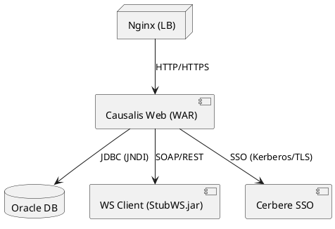

# 📄 Dossier d’Architecture Technique (DAT) – **CAUSALIS**  

**Version** : 1.0 – 2024‑04‑28  
**Auteur** : ARBOGAST Christian (Chef de produit)  

[TOC]

---  

## 1️⃣ Introduction et objectifs  

### 1.1 Vue d’ensemble fonctionnelle  
CAUSALIS est l’application métier du ministère de la Transition écologique qui **collecte, consolide et exploite les statistiques nationales des accidents du travail et des maladies professionnelles** des agents. Elle permet :  

* la saisie et la consultation de dossiers d’accident ou de maladie ;  
* la génération de rapports statistiques (par service, par grade, par type d’accident, …) ;  
* la synchronisation de référentiels (grades, services) avec les web‑services du système d’information RH ;  
* la mise à disposition de tableaux de bord pour les managers et les services de prévention.  

### 1.2 Diagramme C4 – Niveau 1 (System Context)  

```mermaid
C4Context
title Causalis – Contexte système
System_Boundary(causalis, "CAUSALIS") {
    Container(web, "Causalis Web UI", "Struts 1.x / JSP", "Interface utilisateur")
    ContainerDb(db, "Base de données Oracle", "SQL", "Stockage persistant des dossiers")
    Container(ws, "Web‑services externes", "SOAP/REST", "Référentiels RH (Grades, Services)")

    Person(manager, "Gestionnaire", "Rôle métier – saisie & reporting")
    Person(admin, "Administrateur", "Gestion des droits & maintenance")
    Person(sso, "SSO Cerbere", "Authentification unique")

Rel(manager, web, "Utilise")
Rel(admin, web, "Administre")
Rel(sso, web, "Authentifie via SSO")
Rel(web, db, "Lecture/Écriture")
Rel(web, ws, "Appel WS (synchronisation)")
Rel(web, "Prometheus / Grafana", "Exporte métriques")
```  

### 1.3 Objectifs de qualité orientés utilisateur  

| # | Objectif | Raison métier |
|---|-----------|---------------|
| Q1 | **Performance** – temps de réponse < 2 s pour la saisie d’un dossier | Garantir la fluidité du travail des gestionnaires en agence |
| Q2 | **Sécurité** – authentification SSO, contrôle d’accès RBAC, traçabilité des actions | Conformité RGPD et exigences du ministère (DINS) |
| Q3 | **Disponibilité** – 99,5 % de disponibilité mensuelle | Assurer la continuité du suivi des accidents (production 24 h/24) |
| Q4 | **Maintenabilité** – couverture de tests unitaires ≥ 80 % et documentation Javadoc à jour | Réduire le coût de l’évolution et faciliter la transmission de compétences |
| Q5 | **Extensibilité** – possibilité d’ajouter de nouveaux référentiels (ex. : nouveaux types d’accident) sans impacter les services existants | Anticiper les évolutions législatives et fonctionnelles |

---  

## 2️⃣ Parties prenantes  

| Rôle | Attente principale |
|------|--------------------|
| **MOA / RSSI** | Conformité sécurité (RGPD, traçabilité, archivage) |
| **Gestionnaires** | Interface simple, temps de saisie minimal |
| **Administrateurs** | Gestion des droits, supervision, sauvegarde automatisée |
| **Développeurs** | Architecture claire, build reproductible, tests automatisés |
| **MOE** | Respect des standards DSI (ECO4, OpenStack) |
| **Support** | Accès aux logs et métriques via Prometheus/Grafana |
| **Utilisateurs actifs (≈ 170 / mois)** | Disponibilité et fiabilité du service |

### 2.1 Contacts (extraits du Wiki)  

| Nom complet | Rôle | Courriel |
|------------|------|----------|
| **Christian ARBOGAST** | Chef de produit (MOE) | Christian.Arbogast@developpement-durable.gouv.fr |
| **SG/DRH/D/PSPP1** | MOA SSI – Bureau de la prévention | pspp1.d.drh.sg@developpement-durable.gouv.fr |
| **SG/DRH/P/DSNUMRH2** | MOA SSI – Bureau des systèmes d’appui | dsnumrh2.p.drh.sg@developpement-durable.gouv.fr |
| **SG/DNUM/PNM/DPNM3** | MOE – Département produits numériques | dpnm3.pnm.dnum.sg@developpement-durable.gouv.fr |

---  

## 3️⃣ Contraintes  

| Type | Description |
|------|-------------|
| **Techniques** | • Java 8 + <br>• Struts 1.x (legacy) <br>• Castor JDO pour la persistance <br>• Oracle 12c (JNDI `jdbc/userDScausalis`) <br>• Maven 3 pour le build <br>• Serveur d’applications Tomcat 6 (déploiement) |
| **Organisationnelles** | • Respect du **processus de mise en production** du GTI (déploiement sur le cloud interne ECO4) <br>• Utilisation du **reverse‑proxy Nginx** en pair load‑balanced <br>• Conformité aux **normes internes de codage** (Checkstyle, SonarQube) |
| **Réglementaires** | • **RGPD** – traçabilité, droit à l’oubli, archivage sécurisé <br>• **Archivage** – classification « Élevée », plan d’archivage prévu <br>• **DINS** – exigences de disponibilité et de continuité de service |
| **Sécurité (modèle D‑I‑C‑T)** | **Disponibilité** – 99,5 % (exigence D) <br>**Intégrité** – contrôles de validation côté serveur, utilisation de transactions JDO <br>**Confidentialité** – SSO Cerbere, chiffrement TLS 1.2+ pour tous les flux <br>**Traçabilité** – logs d’audit (Log4j 2) centralisés, corrélation via ELK (non listé mais recommandé) |

---  

## 4️⃣ Contexte et périmètre  

| Élément | Description |
|---------|-------------|
| **Système interne** | CAUSALIS (Web + Service + DAO) <br>Déploiement sur **ECO4 – tenant `pnm3`** |
| **Systèmes partenaires** | • **Cerbere** (SSO, gestion de session) <br>• **Web‑services RH** (Grades, Services) – appel SOAP via `StubWS.jar` <br>• **Plateforme de supervision** (Prometheus, Grafana, Loki, AlertManager) |
| **Interfaces techniques** | *Web* – HTTP/HTTPS (port 443) <br>*Base de données* – JNDI `java:comp/env/jdbc/userDScausalis` (Oracle) <br>*WS* – SOAP / REST (client généré, `StubWS.jar`) <br>*Monitoring* – Exporter Prometheus (`/metrics`) |
| **Fréquence d’échange** | • Saisie utilisateur – en temps réel <br>• Synchronisation grades – **quotidienne (nightly batch)** <br>• Export statistiques – **à la demande** ou **planifié (cron)** |

---  

## 5️⃣ Stratégie de solution  

| Décision | Description |
|----------|-------------|
| **Architecture** | **Monolithe Struts 1.x** avec couches clairement séparées (Web → Service → DAO → DB). Le monolithe est justifié par la maturité du système et le faible besoin de scalabilité horizontale. |
| **Persist‑ence** | **Castor JDO** + Oracle. Le mapping XML (`database.xml`) permet une évolution rapide des tables sans recompilation du code métier. |
| **Gestion des dépendances** | **Maven** + **Maven Assembly** (artefacts `scripts.zip`, `sources.zip`, `docs.zip`). |
| **Déploiement** | **WAR** déployé sur Tomcat 6 via le reverse‑proxy Nginx. Le `MANIFEST.MF` indique `Class-Path: StubWS.jar`. |
| **Sécurité** | **SSO Cerbere** – authentification unique, rôle RBAC (utilisateur, manager, admin). TLS 1.2+ obligatoire. |
| **Supervision** | **Prometheus** (exporter intégré), **Grafana** (dashboards), **Loki** (logs), **AlertManager** (alertes). |
| **Sauvegarde** | Scripts standards du GTI → dumps chiffrés AES‑256 stockés sur **B3**, **Outscale SecNumCloud**, **Google Cloud**. |
| **CI/CD** | GitLab‑CI (`.gitlab-ci.yml`) avec phases : **build**, **test**, **sonar‑analysis**, **package**, **deployment** vers l’environnement de recette puis production. |
| **Qualité** | SonarQube (`sonar-project.properties`) avec **Quality Gate** bloquant le merge si non respecté. |

---  

## 6️⃣ Vue en Briques (C4 – Niveau 2)  

```mermaid
C4Container
title Causalis – Diagramme de conteneurs
Container_Boundary(causalis, "CAUSALIS") {
    Container(web, "Web UI (Struts 1.x)", "Java EE (Servlet)", "Gestion des requêtes HTTP, JSP, TagLibs")
    Container(service, "Service Layer", "Java", "Logique métier, validation, orchestration")
    Container(dao, "DAO Layer (Castor JDO)", "Java", "Accès aux tables Oracle")
    ContainerDb(db, "Oracle DB", "SQL", "Stockage persistant")
    Container(wsClient, "WS Client (StubWS.jar)", "Java", "Appels aux web‑services RH")
    Container(sso, "Cerbere SSO", "Java", "Authentification unique")
    Container(monitoring, "Supervision", "Prometheus/Grafana/Loki", "Métriques, logs, alertes")

Rel(web, service, "Appelle")
Rel(service, dao, "Utilise")
Rel(dao, db, "Lecture/Écriture")
Rel(web, wsClient, "Synchronisation (nightly)")
Rel(web, sso, "Authentifie")
Rel(web, monitoring, "Expose /metrics")
```  

### Description des conteneurs  

| Conteneur | Responsabilité principale |
|-----------|---------------------------|
| **Web UI** | Gestion des actions Struts (`*Action.java`), rendu JSP, validation de formulaires, utilisation des TagLibs (`StrutsOptionTag`, `PutIntoSessionTag`). |
| **Service Layer** | Implémentations (`*Service.java`) – filtrage (`util = 1`), transformation DTO, gestion des règles métier (ex. : `saisieTerminee`). |
| **DAO Layer** | `GenericDao<T>` et DAO spécifiques (`GradeDao`, `DossierAccidentDao`, …) – encapsulation des requêtes Castor JDO. |
| **DB** | Schéma Oracle contenant les tables métier (ACCIDENT, GRADES, SERVICE, …). |
| **WS Client** | `StubWS.jar` – classes générées pour appeler les services externes (Grades, Services). |
| **Cerbere SSO** | Authentification, gestion de session, logout (`reauth.jsp`). |
| **Supervision** | Exporter Prometheus (`/metrics`), fichiers logs (`log4j.xml`), alertes via AlertManager. |

---  

## 7️⃣ Vue Exécution (Scénarios critiques)  

### 7.1 Scénario 1 – Saisie d’un dossier d’accident  

```mermaid
sequencediagram;
    participant User as Gestionnaire;
    participant UI as Web UI (Struts)
    participant SSO as Cerbere SSO;
    participant Service as AccidentService;
    participant DAO as AccidentDao;
    participant DB as Oracle;
    participant Monitor as Monitoring;
    User->>UI: Authentification (via SSO)
    UI->>SSO: Validation ticket;
    SSO-->>UI: OK + rôles;
    User->>UI: Ouvre formulaire "Nouvel Accident"
    UI->>User: Affiche JSP (editionDossierPage1.jsp)
    User->>UI: Remplit et soumet le formulaire;
    UI->>Service: invoke `createAccident(dossier)`
    Service->>DAO: `insert(dossier)`
    DAO->>DB: INSERT... (transaction)
    DB-->>DAO: OK;
    DAO-->>Service: Retour;
    Service-->>UI: Confirmation + redirection;
    UI->>Monitor: Exporte métrique `accident.creation.success`
```  

### 7.2 Scénario 2 – Synchronisation des grades via Web‑service  

```mermaid
sequencediagram;
    participant Scheduler as Cron (nightly)
    participant Service as GradeService;
    participant WS as WSClient (StubWS)
    participant DB as Oracle;
    participant Monitor as Monitoring;
    Scheduler->>Service: synchronize()
    Service->>WS: getGrades()
    WS-->>Service: List<Grade>
    Service->>DB: UPSERT grades (via DAO)
    DB-->>Service: OK;
    Service->>Monitor: metric `grades.sync.count` (+1)
```  

### 7.3 Scénario 3 – Génération d’un rapport statistique  

```mermaid
sequencediagram;
    participant User as Manager;
    participant UI as Web UI;
    participant Service as StatistiquesService;
    participant DAO as StatistiquesDao;
    participant DB as Oracle;
    participant Export as PDFGenerator;
    participant Monitor as Monitoring;
    User->>UI: Demande "Statistiques par service"
    UI->>Service: getStatistiques(serviceId, période)
    Service->>DAO: queryStatistiques(...)
    DAO->>DB: SELECT ...
    DB-->>DAO: Résultat;
    DAO-->>Service: ListeStat;
    Service->>Export: generatePDF(ListeStat)
    Export-->>Service: PDF bytes;
    Service-->>UI: Retourne le PDF;
    UI->>User: Téléchargement;
    UI->>Monitor: metric `report.generation.time`
```  

---  

## 8️⃣ Vue Déploiement *(section standardisée)*  

```markdown
### Environnements
| Environnement | Hébergement | Serveurs | Réseau | Particularités |
|---------------|-------------|----------|--------|----------------|
| Développement | Cloud interne ECO4 (tenant `pnm3-dev`) | 1 x Tomcat 6 (VM) | VLAN interne | Base de données de test, logs en mode DEBUG |
| Recette       | Cloud interne ECO4 (tenant `pnm3-rec`) | 1 x Tomcat 6 (VM) | VLAN interne | Jeux de données anonymisés, validation fonctionnelle |
| Production    | Cloud interne ECO4 (tenant `pnm3`) | 2 x Tomcat 6 (cluster) | VLAN production + LB Nginx | Haute disponibilité, sauvegardes chiffrées, monitoring complet |
```



### Infrastructure  
Le produit est hébergé sur le cloud interne **ECO4** basé sur **OpenStack**, dans le tenant **`pnm3`** du département.  
Le reverse‑proxy **Nginx** du schéma ci‑dessus est en fait une paire de Nginx load‑balancés en frontal des produits hébergés sur le tenant.  

### Supervision  
Le produit est supervisé via le système standard du GTI :  

* **Portainer** pour la partie purement conteneurisée (si utilisation de Docker pour les scripts).  
* **Stack Prometheus / Grafana / Loki / AlertManager** – métriques, dashboards, logs et alertes.  
* Le produit dispose également d’une supervision **PSIN** (portail interne).  

### Sauvegardes  
Les sauvegardes de la base de données sont assurées par des scripts standards du GTI permettant la création de dumps cryptés en **AES‑256** et déposés sur :  

* le stockage objet **B3** du IaaS ministériel,  
* le stockage objet **Outscale SecNumCloud** (via la prestation du GTI « Nuage Public »),  
* le stockage objet standard de **Google Cloud** (via la prestation du GTI « Nuage Public »).  

---  

## 9️⃣ Sujets transverses  

| Domaine | Pratiques appliquées |
|---------|----------------------|
| **Authentification** | SSO Cerbere (Kerberos/TLS), tokens JWT en interne, session invalidation via `reauth.jsp`. |
| **Journalisation** | Log4j 2 configuré (`log4j.xml`) – logs en JSON pour ingestion par Loki, niveau configurable (`INFO` en prod, `DEBUG` en dev). |
| **Monitoring** | Exporter Prometheus (`/metrics`) – métriques de temps de réponse, comptage des appels WS, taux d’erreurs. |
| **Gestion des erreurs** | Exceptions métier (`CommonException`, `DaoException`, `TechnicalException`, `WSException`) – mappées vers des pages d’erreur Struts (`erreur.jsp`). |
| **API interne** | Services exposés via **Struts Actions** (REST‑like via `*.do`), réponses JSON disponibles via `Action` custom (non détaillé). |
| **Sécurité des données** | Chiffrement TLS 1.2+, paramètres de connexion JNDI sécurisés, sauvegardes AES‑256, conformité RGPD (droit à l’oubli via script de purge). |
| **Gestion de la configuration** | Fichiers `.properties` (`project.properties`, `version.properties`) injectés par Maven, `database.xml` pour Castor. |
| **Gestion des dépendances** | Maven 3 avec `dependencyManagement` – versions figées, usage de `shade` pour inclure `StubWS.jar`. |
| **Déploiement** | GitLab‑CI (`.gitlab-ci.yml`) → *build → test → sonar → package → deploy* ; artefacts `scripts.zip`, `sources.zip`, `docs.zip`. |
| **Qualité du code** | SonarQube Quality Gate, Checkstyle, PMD, FindBugs, JUnit 5 (tests unitaires > 80 %). |

---  

## 🔟 Exigences de qualité  

| Exigence | Critère d’acceptation | Scénario de validation |
|----------|-----------------------|------------------------|
| **Q‑PERF‑01** – Temps de réponse | ≤ 2 s pour les actions de saisie et de recherche sur un jeu de données de 10 000 dossiers. | Test de charge JMeter (10 users, 5 min) – mesurer les temps de réponse. |
| **Q‑SEC‑01** – Authentification | Toutes les requêtes HTTP non authentifiées sont rejetées (HTTP 401). | Test d’intégration automatisé (REST‑Assured) – appel sans cookie SSO → 401. |
| **Q‑SEC‑02** – Traçabilité | Chaque action utilisateur génère un log d’audit contenant `userId`, `action`, `timestamp`, `status`. | Vérification des logs via Loki query après scénario de création d’accident. |
| **Q‑AV‑01** – Disponibilité | Uptime ≥ 99,5 % sur le mois calendaire (excl. fenêtres de maintenance). | Rapport Grafana AlertManager → aucune alerte de downtime sur le mois. |
| **Q‑MAI‑01** – Couverture de tests | Coverage globale ≥ 80 % (branches + lignes). | Rapport SonarQube – métrique `Coverage`. |
| **Q‑MAI‑02** – Documentation | Javadoc générée pour 100 % des classes publiques, accessible via `site` Maven. | Vérification du site Javadoc dans l’artifact `site`. |
| **Q‑EXT‑01** – Extensibilité | Ajout d’un nouveau référentiel (ex. : `TypeIncident`) sans modification du code existant (seulement nouvelle classe + mapping). | Test d’intégration – insertion d’un `TypeIncident` via nouveau service, compilation sans erreurs. |

---  

## 1️⃣1️⃣ Risques et dettes techniques  

| Risque / Dette | Impact | Probabilité | Mesure corrective / atténuation |
|----------------|--------|------------|---------------------------------|
| **R‑TECH‑01** – Castor JDO obsolète | Bloquage lors de mise à jour d’Oracle / migration JDK | Moyen | Planifier migration vers **JPA/Hibernate** (ADR‑002). |
| **R‑TECH‑02** – Struts 1.x non maintenu | Vulnérabilités non corrigées, difficulté de recrutement | Élevé | Étudier migration progressive vers **Spring MVC** ou **Jakarta EE** (ADR‑001). |
| **R‑SEC‑01** – SSO Cerbere dépendance externe | Indisponibilité du service d’authentification | Faible | Implémenter fallback local (ex. : LDAP) et tests de résilience. |
| **R‑OP‑01** – Sauvegarde manuelle des scripts | Perte de scripts de mise à jour DB en cas de corruption | Moyen | Automatiser le versioning des scripts via Git‑LFS et les inclure dans le pipeline CI. |
| **R‑PERF‑01** – Accès concurrent à la base Oracle | Dégradation de performance sous charge > 50 users | Moyen | Mettre en place un pool de connexions (MTPoolConnexion) dimensionné, monitorer via Prometheus. |
| **R‑MAI‑01** – Couverture de tests insuffisante | Risque de régression fonctionnelle | Moyen | Augmenter le nombre de tests unitaires et d’intégration, intégrer **mutation testing**. |

---  

## 1️⃣2️⃣ Annexes  

### 12.1 Glossaire  

| Terme | Définition |
|-------|------------|
| **CTA** | Centre Technique d’Application – équipe de support et d’exploitation. |
| **ECO4** | Plateforme cloud interne du ministère (OpenStack). |
| **SSO** | Single Sign‑On – authentification unique via Cerbere. |
| **RGPD** | Règlement Général sur la Protection des Données – exigences de confidentialité et de traçabilité. |
| **WS** | Web‑service (SOAP/REST) – interface externe pour les référentiels RH. |
| **ADR** | Architectural Decision Record – décision d’architecture consignée. |
| **DTO** | Data Transfer Object – objet transport de données entre couches. |
| **DAO** | Data Access Object – couche d’accès aux données. |
| **JDO** | Java Data Objects – API de persistance (utilisée via Castor). |
| **Prometheus** | Système de collecte de métriques. |
| **Loki** | Système de centralisation des logs. |
| **AlertManager** | Gestion des alertes Prometheus. |
| **Nginx** | Reverse‑proxy et load‑balancer. |

### 12.2 Décisions d’Architecture (ADR) – Extraits  

| ADR | Titre | Décision | Statut |
|-----|-------|----------|--------|
| **ADR‑001** | Choix du framework web (Struts 1.x) | Utiliser Struts 1.x pour garantir la continuité fonctionnelle et la compatibilité avec le code existant. | **Acceptée** – à réviser pour migration future. |
| **ADR‑002** | Persistance avec Castor JDO | Adopté pour la rapidité d’implémentation et la compatibilité avec le schéma Oracle actuel. | **Acceptée** – envisager migration JPA à moyen terme. |
| **ADR‑003** | Packaging via Maven Assembly | Générer des artefacts `scripts.zip`, `sources.zip`, `docs.zip` pour la livraison. | **Acceptée** – utilisé en production. |
| **ADR‑004** | Supervision centralisée | Adoption de la stack Prometheus/Grafana/Loki/AlertManager. | **Acceptée** – déployée en prod. |
| **ADR‑005** | Gestion des sauvegardes | Utilisation de scripts GTI, chiffrement AES‑256, stockage multi‑cloud. | **Acceptée** – opérationnelle. |

### 12.3 Bibliographie / Références  

* **Arc42 – Documentation Architecture** – https://arc42.org/  
* **Maven Assembly Plugin** – https://maven.apache.org/plugins/maven-assembly-plugin/  
* **Castor JDO Documentation** – https://castor.org/jdo/  
* **Struts 1.x Reference Guide** – https://struts.apache.org/1.x/  
* **Prometheus – Monitoring System** – https://prometheus.io/  
* **RGPD – Guide de conformité** – https://eur-lex.europa.eu/eli/reg/2016/679/oj  

---  

*Fin du document*  

---  