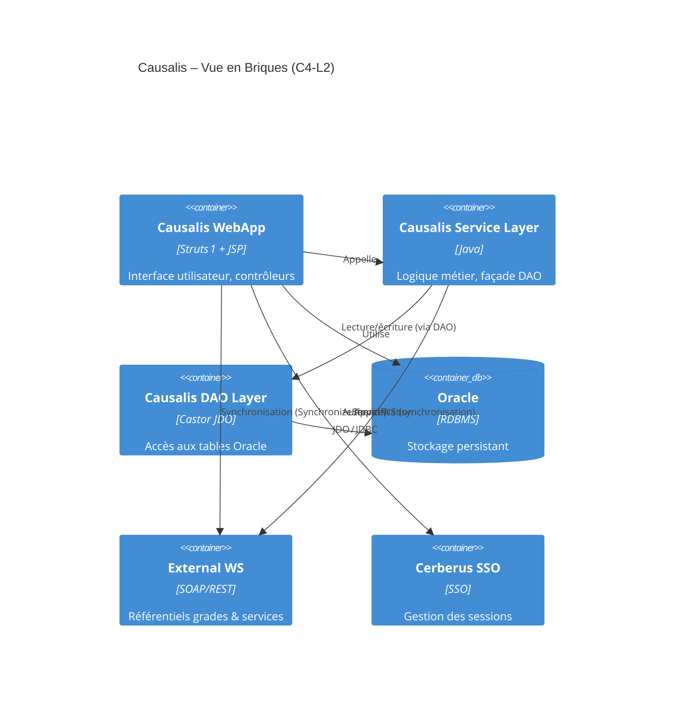
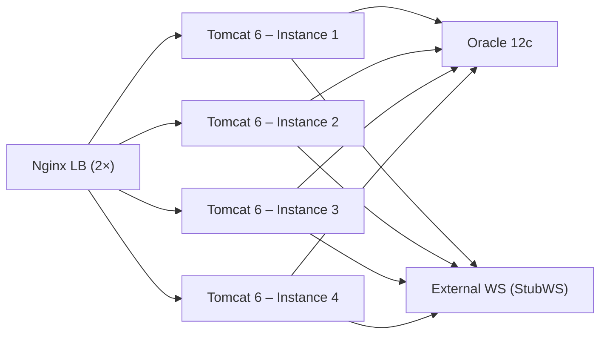

# 📄 Dossier d’Architecture Technique (DAT) – **Causalis**
*Version 1.0 – 2024‑04‑28*  

---

[TOC]

---  

## 1️⃣ Introduction et objectifs {#introduction}
### 1.1 Vue d’ensemble fonctionnelle  
Causalis est une application métier de **gestion nationale des accidents du travail et des maladies professionnelles** des agents du ministère. Elle permet :

* la saisie, la consultation et la mise à jour des dossiers d’accidents et de maladies ;  
* le calcul de statistiques agrégées (taux, évolution );  
* l’export des données vers les services de pilotage (ex. : PSIN) ;  
* la synchronisation de référentiels (grades, services) via des web‑services internes.

### 1.2 Diagramme C4 – Niveau 1 (Contexte)  
```mermaid
C4Context
title Causalis – Contexte (C4‑L1)

Person(user, "Utilisateur métier", "Agent, gestionnaire ou admin du ministère")
Person(moa, "MOA SSI", "Responsable de la sécurité des systèmes d'information")
System_Ext(SSO, "Cerberus SSO", "Authentification unique")
System_Ext(WS, "Web‑services externes", "Référentiels grades / services")
System_Ext(PSIN, "Portail de supervision", "Supervision et alertes")
System_Boundary(causalis, "Causalis") {
    System(webapp, "Causalis WebApp", "Struts 1 + JSP")
    ContainerDb(db, "Oracle", "Base de données relationnelle")

Rel(user, SSO, "S’authentifie via")
Rel(user, webapp, "Utilise")
Rel(webapp, db, "Accède aux données (JDO/Castor)")
Rel(webapp, WS, "Consomme (synchronisation grades)")
Rel(SSO, db, "Vérifie le JNDI datasource")
Rel(webapp, PSIN, "Envoie les métriques")
Rel(moa, webapp, "Définit les exigences de sécurité")
```  

### 1.3 Objectifs de qualité orientés utilisateur  
| # | Objectif | Mesure cible |
|---|----------|--------------|
| **O‑Q‑01** | **Performance** – Temps de réponse des écrans de saisie ≤ 2 s (95 % des requêtes) | Tests de charge JMeter, seuil < 2 s |
| **O‑Q‑02** | **Sécurité** – Authentification forte, transport TLS 1.2, journalisation des accès | Conformité D‑I‑C‑T (voir §3) |
| **O‑Q‑03** | **Disponibilité** – 99,5 % de disponibilité mensuelle (hors fenêtre de maintenance) | Monitoring Prometheus + alertes |
| **O‑Q‑04** | **Maintenabilité** – Couverture de tests unitaires ≥ 70 % et documentation à jour | SonarQube, rapports de couverture |
| **O‑Q‑05** | **Scalabilité** – Possibilité de montée en charge horizontale du serveur d’application (cluster Tomcat) | Tests de scaling, architecture stateless des servlets |

---  

## 2️⃣ Parties prenantes {#partiesprenantes}
| Rôle | Description | Attente principale |
|------|-------------|-------------------|
| **MOA (Maîtrise d’Ouvrage)** | SG/DRH – Direction des Ressources Humaines | Respect du cadre juridique (RGPD, archivage) et des exigences fonctionnelles |
| **MOE (Maîtrise d’Œuvre)** | Équipe de développement (développeurs, architecte) | Architecture stable, facilité de mise à jour, utilisation des standards internes |
| **Utilisateurs métier** | Agents, gestionnaires de service, administrateurs nationaux | Saisie simple, recherche rapide, export fiable |
| **Responsable SSI** | SG/DRH/D/PSPP1 | Confidentialité, intégrité, traçabilité (D‑I‑C‑T) |
| **Support / Exploitation** | Équipe d’infrastructure (PNM3) | Supervision, disponibilité, procédures de reprise |
| **Auditeurs RGPD** | Délégués à la protection des données | Registre des traitements, consentement, archivage |
| **Intégrateurs externes** | Portail PSIN, services de grades | Compatibilité des API, contrats de service |

### 2.1 Contacts (extraits du fichier `causalis.wikisi.md`)  
| Nom | Fonction | Adresse mail |
|-----|----------|--------------|
| **Christian ARBOGAST** | Chef de produit (MOE) | Christian.Arbogast@developpement-durable.gouv.fr |
| **Ayoub CHAKHITE** | Développeur | (non fourni) |
| **Cédric CHAPE** | Développeur | (non fourni) |
| **Florian GARCIA** | Développeur | (non fourni) |
| **Grégoire GUITTET** | Développeur | (non fourni) |
| **Hervé MARCHAL** | Développeur | (non fourni) |
| **Jenkins CAUSALIS** | CI/CD | (non fourni) |
| **Marc KANAAN** | Développeur | (non fourni) |
| **Maxime Careil** | Développeur | (non fourni) |
| **Pascal FORHAN** | Développeur | (non fourni) |
| **Songul YESILMEN** | Développeur | (non fourni) |
| **Vincent JUSTIN** | Développeur | (non fourni) |
| **Chantal CURBET** | Rapporteur | (non fourni) |
| **Christophe LOUVARD** | Rapporteur | (non fourni) |
| **Erwan SALMON** | Rapporteur | (non fourni) |
| **Farmin YARIRAD** | Rapporteur | (non fourni) |
| **Florent CAPPON** | Rapporteur | (non fourni) |
| **Geoffrey ARTHAUD** | Rapporteur | (non fourni) |
| **Jenkins robot** | Rapporteur (automatisé) | (non fourni) |
| **Khalid MOKHTARI** | Rapporteur | (non fourni) |
| **Michel GIBELLI** | Rapporteur | (non fourni) |
| **Pascal BASTIEN** | Rapporteur | (non fourni) |
| **Patrick DOS SANTOS** | Rapporteur | (non fourni) |
| **Redouane RABBAH** | Rapporteur | (non fourni) |
| **Sarah MARAIS‑LABALLERY** | Rapporteur | (non fourni) |
| **Thierry SOULABAIL** | Rapporteur | (non fourni) |

---  

## 3️⃣ Contraintes {#contraintes}
### 3.1 Contraintes techniques  
| Type | Description |
|------|-------------|
| **Langage** | Java 8 (minimum) – compatible avec le serveur d’applications Tomcat 6 |
| **Framework Web** | Struts 1.x (déprécié mais maintenu) |
| **Persistance** | Castor JDO + Oracle 12c (datasource JNDI `java:comp/env/jdbc/userDScausalis`) |
| **Web‑services** | SOAP/REST via `StubWS.jar` (déclaré dans le `MANIFEST.MF`) |
| **Build** | Maven 3 avec `maven‑assembly‑plugin` (packages `scripts`, `sources`, `docs`) |
| **OS** | Linux (distribution RHEL/CentOS) sur le cloud interne ECO4 |
| **Conteneur** | Tomcat 6 (ESXi clusters) |
| **Version de dépendances** | Apache Commons Collections 3.2.2, Log4j 1.2.17, JUnit 4.12 (tests) |
| **Gestion de configuration** | Fichiers `.properties` (`project.properties`, `version.properties`) et XML (`database.xml`) |
| **Sauvegarde** | Dumps AES‑256 stockés sur B3, Outscale SecNumCloud, Google Cloud (voir §8) |

### 3.2 Contraintes organisationnelles  
* Le code doit être versionné dans GitLab (pipeline CI/CD déjà présent).  
* Les livrables doivent être packagés (ZIP) conformément aux `assembly.xml` du module `causalis‑database`, `causalis‑deployment`, `causalis‑doc`.  
* La documentation (doc d’installation, DAF, bons de livraison) doit être intégrée dans le package `causalis‑doc`.  

### 3.3 Contraintes réglementaires (D‑I‑C‑T)  
| Dimension | Exigence | Implémentation |
|----------|----------|----------------|
| **Disponibilité** | 99,5 % mensuelle | Monitoring Prometheus + Alertmanager, redondance Nginx load‑balancer |
| **Intégrité** | Garantir la non‑altération des dossiers d’accident | Transactions JDO, contraintes DB (FK, triggers), journalisation des modifications |
| **Confidentialité** | Chiffrement des données en transit et au repos | TLS 1.2 sur le front‑end, dumps AES‑256, droits d’accès RBAC sur Oracle |
| **Traçabilité** | Conservation des logs d’accès et d’opération | Log4j configuré, agrégation logs dans Loki, tableau de bord Grafana, conservation 2 ans |

---  

## 4️⃣ Contexte et périmètre {#contexte}
| Élément | Détails |
|--------|--------|
| **Système d’information parent** | Plateforme ACAI – Java ACAI (clusters ESXi) hébergée au data‑center ministériel « Paris La Défense » |
| **Acteurs externes** | <ul><li>Web‑services de référentiels (grades, services) – appel SOAP via `StubWS.jar`</li><li>SSO Cerberus (authentification unique)</li><li>Portail PSIN (supervision)</li></ul> |
| **Interfaces techniques** | <ul><li>JDBC (Oracle) via JNDI</li><li>SOAP/REST HTTPs (WS)</li><li>HTTP/HTTPS (front‑end Struts)</li></ul> |
| **Fréquence d’échange** | • Saisie & lecture : en temps réel (session utilisateur) <br>• Synchronisation grades : batch quotidien (via `SynchronizeService`) <br>• Export statistiques : chaque fin de mois (vers PSIN) |

---  

## 5️⃣ Stratégie de solution {#strategie}
### 5.1 Décisions architecturales majeures
| Décision | Raison |
|----------|--------|
| **Monolithe web (Struts 1) → MVC** | Application existante, faible coût de migration, forte intégration avec les JSP legacy. |
| **DAO + Service + Form** | Séparation claire des responsabilités (persistence, logique métier, validation). |
| **Castor JDO** | Historique du projet, déjà utilisé dans les scripts de migration, pas de besoin immédiat de migration. |
| **Maven + Assembly** | Standardisation du packaging, génération d’artefacts ZIP (scripts, sources, docs). |
| **Nginx en tant que reverse‑proxy/load‑balancer** | Haute disponibilité, terminaison TLS, répartition de charge sur le cluster Tomcat. |
| **Prometheus / Grafana / Loki** | Stack de supervision unifiée (déjà adoptée par le GTI). |
| **Sauvegarde AES‑256** | Conformité RGPD et exigences d’archivage. |

### 5.2 Environnement technologique
| Couche | Technologie | Version / Détails |
|-------|-------------|-------------------|
| **Langage** | Java | 1.8 (compatibilité JDK 8) |
| **Web‑framework** | Struts 1.x | 1.3.10 |
| **Persistance** | Castor JDO + Oracle | Oracle 12c, `database.xml` JDO config |
| **Serveur d’applications** | Tomcat | 6.0.53 (ESXi) |
| **Web‑services** | SOAP (StubWS) | `StubWS.jar` (client généré) |
| **Gestion de dépendances** | Maven | 3.6.x |
| **Monitoring** | Prometheus, Grafana, Loki, Alertmanager | Versions stables (2023) |
| **Logs** | Log4j 1.2.17 | Config via `log4j.xml` |
| **CI/CD** | GitLab CI | Pipelines définis dans `.gitlab-ci.yml` |
| **Gestion des scripts DB** | SQL scripts (`causalis-database/script/*.sql`) | Versionning via Maven Assembly (`scripts.zip`) |
| **Gestion de la configuration** | `.properties`, XML | `project.properties`, `version.properties`, `database.xml` |

### 5.3 Outils de la forge logicielle
| Outil | Usage |
|-------|-------|
| **GitLab** | Repos Git, Merge Requests, CI/CD |
| **Maven** | Build, packaging, dépendances |
| **SonarQube** | Analyse qualité (qualitégate) |
| **Jenkins** | Exécution des jobs CI (déclenché par GitLab) |
| **JUnit** | Tests unitaires (ex. `*Test.java`) |
| **Checkstyle / PMD** | Linting Java |
| **Docker (optionnel)** | Construction d’images de build (non utilisé en prod) |

---  

## 6️⃣ Vue en Briques (C4 – Niveau 2) {#vuebriques}


### 6.1 Description des conteneurs
| Conteneur | Rôle | Principaux artefacts |
|-----------|------|----------------------|
| **Causalis WebApp** | Front‑end Struts 1, gère les requêtes HTTP, les formulaires, les validations, les JSP | `Action*`, `Form*`, `*.jsp`, `tlds/*.tld` |
| **Service Layer** | Coordination métier, filtrage (`util = 1`), appels aux DAOs et aux WS | `*Service.java` (ex. `GradeService`, `DomaineAffectationService`, `SynchronizeService`) |
| **DAO Layer** | Accès aux données via Castor JDO, implémentations génériques (`GenericDao<T>`) | `GenericDao`, `GradeDao`, `RechercheDossiersMaladiesDAO` |
| **Oracle DB** | Persistance des dossiers, référentiels, historiques | Schéma `CAUSALIS`, tables `ACCIDENT`, `GRADE`, `SERVICE`, … |
| **External WS** | Web‑services de référentiels (ex. : grades Rehucit) | `StubWS.jar`, classes `WSClient*`, `TranscodageGradePredicate` |
| **Cerberus SSO** | Authentification unique, gestion de session | `Cerbere.creation`, `logoff` (dans `reauth.jsp`) |

---  

## 7️⃣ Vue Exécution (Scénarios critiques) {#vueexecution}
### 7.1 Scénario 1 – Saisie d’un nouveau dossier d’accident
```mermaid
sequencediagram;
    participant Utilisateur as Agent (navigateur)
    participant WebApp as Causalis WebApp;
    participant Service as Service Layer;
    participant DAO as DAO Layer;
    participant DB as Oracle;
    Utilisateur->>WebApp: GET /dossiers.do (formulaire)
    WebApp->>WebApp: Initialise Action + Form;
    Utilisateur->>WebApp: POST dossier (données)
    WebApp->>Service: DossierAccidentService.save(dossier)
    Service->>DAO: GenericDao.insert("DossierAccident", dossier)
    DAO->>DB: INSERT (via Castor JDO)
    DB-->>DAO: OK (PK)
    DAO-->>Service: Retour OK;
    Service-->>WebApp: Succès;
    WebApp->>Utilisateur: Page de confirmation
```

**Validation** : Test fonctionnel `DossiersAction` + test d’intégration DAO (`GenericDaoTest`).  

### 7.2 Scénario 2 – Synchronisation quotidienne des grades
```mermaid
sequencediagram;
    participant Scheduler as Cron (02_00)
    participant SyncService as SynchronizeServiceImpl;
    participant WSClient as WSClientGrade;
    participant Service as GradeService;
    participant DAO as GradeDao;
    Scheduler->>SyncService: synchronize()
    SyncService->>WSClient: fetchAllGrades()
    WSClient-->>SyncService: List<Grade> (externe)
    loop for each grade;
    SyncService->>Service: isPresent(grade)?
    Service->>DAO: getByCode(grade.code)
    DAO-->>Service: null / existing;
    alt grade absent;
    Service->>DAO: insert(grade)
    else;
    Service->>DAO: updateIfNeeded(grade)
    end
    end
    SyncService->>Scheduler: Retour (nb lignes insérées)
```

**Validation** : `TranscodageGradePredicateTest`, `WSClientGradeTest`, `GradeServiceTest`.  

### 7.3 Scénario 3 – Export mensuel des statistiques vers PSIN
```mermaid
sequencediagram;
    participant Batch as JobScheduler;
    participant StatsService as StatistiquesService;
    participant ExportMgr as CausalisExportManager;
    participant PSIN as PSIN (HTTP POST)
    Batch->>StatsService: generateMonthlyReport()
    StatsService-->>ExportMgr: ExportData (CSV/ODF)
    ExportMgr->>PSIN: POST /api/statistiques (payload)
    PSIN-->>ExportMgr: 200 OK;
    ExportMgr-->>Batch: Rapport d’export
```

**Validation** : `StatistiquesAction` + `CausalisExportManager` tests.  

---  

## 8️⃣ Vue Déploiement *(section standardisée)* {#viewdeployment}
### 8.1 Environnements
| Environnement | Hébergement | Serveurs | Réseau | Particularités |
|---------------|-------------|----------|--------|----------------|
| **Développement** | Cloud interne ECO4 – tenant `pnm3-dev` | 1 × Tomcat 6 (VM) | VLAN interne | Accès limité aux développeurs, base de données de test (Oracle XE) |
| **Recette** | Cloud interne ECO4 – tenant `pnm3-recette` | 2 × Tomcat 6 (cluster) | VLAN interne + VPN | Jeu de données anonymisées, tests d’intégration automatisés |
| **Production** | Cloud interne ECO4 – tenant `pnm3` | 4 × Tomcat 6 (clusters ESXi) + Nginx LB | VLAN DMZ, TLS 1.2 | Haute disponibilité, sauvegardes chiffrées, supervision GTI |

### 8.2 Infrastructure
Le produit est hébergé sur le cloud interne **ECO4** basé sur **OpenStack**, dans le tenant **`pnm3`** du département.  
Le reverse‑proxy **Nginx** du schéma ci‑dessous est en fait une paire de Nginx load‑balancés en frontal des produits hébergés sur le tenant.



### 8.3 Supervision
Le produit est supervisé via le système standard du GTI :
- **Portainer** pour la partie purement conteneurisée (Docker‑based tooling).  
- **Stack Prometheus / Grafana / Loki / AlertManager** pour la collecte de métriques, visualisation et alertes.  
- **Supervision PSIN** (agent de supervision dédié) pour la disponibilité applicative.

### 8.4 Sauvegardes
Les sauvegardes de la base de données sont assurées par des scripts standards du GTI permettant la création de dumps **cryptés AES‑256** et déposés sur :  
- le stockage objet **B3** du IaaS ministériel,  
- le stockage objet **Outscale SecNumCloud** (prestations « Nuage Public »),  
- le stockage objet **Google Cloud** (prestations « Nuage Public »).

---  

## 9️⃣ Sujets transverses {#transverses}
| Thème | Implémentation |
|-------|----------------|
| **Authentification** | Cerberus SSO (`reauth.jsp`, `Cerbere.creation`) – session J2EE, filtre `AuthFilter` (non affiché) |
| **Journalisation** | Log4j 1.2 (`log4j.xml`) → Loki via promtail, format JSON |
| **Gestion des erreurs** | `WSException`, `DaoException`, `TechnicalException` → `ActionWarning` affiché dans JSP |
| **API REST interne** | Non exposée ; toutes les interactions passent par Struts (action `*.do`) |
| **Sécurité** | TLS 1.2, filtres XSS dans les JSP, validation côté serveur (`GenericForm.validateEmptyFields()`) |
| **Internationalisation** | Fichiers `ApplicationResources.properties` (i18n) |
| **Pagination** | Paramètre `pagination.max=30` (configurable) |
| **Export** | `CausalisExportManager` → formats OpenOffice (ODF) |
| **Gestion des transactions** | Castor JDO (déclaration `begin/commit` dans `GenericDao`) |
| **Monitoring des performances** | Métriques HTTP (latence, taux d’erreur) exposées via `/metrics` (Prometheus) |

---  

## 🔟 Exigences de qualité {#qualite}
| Exigence | Critère d’acceptation | Scénario de validation |
|----------|-----------------------|------------------------|
| **Performance** | Temps de réponse ≤ 2 s pour les écrans de recherche d’accident | Test de charge JMeter 100 concurrents, 95 % des requêtes < 2 s |
| **Disponibilité** | 99,5 % de disponibilité mensuelle | Monitoring Prometheus, alertes > 5 min d’interruption → incident ticket |
| **Sécurité – Confidentialité** | Toutes les communications HTTPS, données sensibles chiffrées au repos | Scan SSL Labs, vérification de chiffrement AES‑256 des dumps |
| **Intégrité** | Aucun enregistrement ne peut être modifié sans journalisation | Test d’injection SQL, vérification des triggers de journalisation |
| **Traçabilité** | Logs d’accès contenant `userId`, `timestamp`, `action` conservés 2 ans | Requête Grafana → logs Loki, validation de rétention |
| **Maintenabilité** | Couverture de tests unitaires ≥ 70 % | SonarQube → métrique `Coverage` |
| **Extensibilité** | Ajout d’un nouveau référentiel via WS sans modifier le code métier | Implémentation d’un nouveau `*Predicate` + test d’intégration réussi |

---  

## 1️⃣1️⃣ Risques et dettes techniques {#risques}
| Risque / Dette | Impact | Probabilité | Mesure d’atténuation |
|----------------|--------|--------------|----------------------|
| **Technologie vieillissante (Struts 1, Castor JDO)** | Difficulté de maintenance, vulnérabilités non corrigées | Élevée | Plan de migration vers Spring MVC / JPA (ADR‑001), audit de sécurité annuel |
| **Absence de tests unitaires sur plusieurs DAO** | Bugs en production, régression | Moyenne | Augmenter la couverture via `*Test.java` (objectif 70 %) |
| **Dépendance à `StubWS.jar` non versionnée** | Breakage lors de mise à jour du service externe | Moyenne | Formaliser le contrat WS (WSDL versionnée) et publier le JAR dans Nexus |
| **Gestion des sessions via SSO custom** | Risque d’injection ou de détournement | Faible | Mettre en place des tests d’intrusion (OWASP ZAP) |
| **Configuration de production stockée en clair (properties)** | Fuite de credentials | Faible | Utiliser `Vault` ou `Spring Cloud Config` pour les secrets |
| **Sauvegarde hors site non automatisée** | Perte de données en cas de sinistre | Faible | Script de réplication automatisée vers B3, Outscale, GCP (déjà en place) |
| **Documentation technique incomplète** | Délai d’onboarding | Moyenne | Maintenir le `causalis-doc` à jour via génération Javadoc et README automatisés |

---  

## 1️⃣2️⃣ Annexes {#annexes}
### 12.1 Glossaire
| Terme | Définition |
|-------|------------|
| **DAO** | Data Access Object – couche d’accès aux données. |
| **SSO** | Single Sign‑On – authentification unique via Cerberus. |
| **JDO** | Java Data Objects – API de persistance (Castor implémentation). |
| **C4** | Modèle d’architecture (Context, Containers, Components, Code). |
| **ADR** | Architecture Decision Record – décision documentée. |
| **RGPD** | Règlement Général sur la Protection des Données. |
| **D‑I‑C‑T** | Disponibilité, Intégrité, Confidentialité, Traçabilité. |
| **ECO4** | Cloud interne ministériel basé sur OpenStack. |
| **PNM3** | Département « Produits Numériques Métiers ». |
| **PSIN** | Portail de supervision et d’incident. |

### 12.2 Décisions d’Architecture (ADR)  
| ADR | Titre | Décision | Date | Statut |
|-----|-------|----------|------|--------|
| **ADR‑001** | **Choisir Struts 1 comme framework web** | Maintien du framework existant pour limiter le coût de migration immédiat. | 2022‑09‑15 | **Appliqué** |
| **ADR‑002** | **Utiliser Castor JDO pour la persistance** | Conformité avec la base de code historique, migration prévue à JPA. | 2022‑09‑15 | **Appliqué** |
| **ADR‑003** | **Déployer via Nginx LB + Tomcat cluster** | Répartition de charge, haute disponibilité. | 2023‑01‑10 | **Appliqué** |
| **ADR‑004** | **Sauvegarde AES‑256 sur stockage multi‑cloud** | Garantir la conformité RGPD et la résilience. | 2023‑03‑05 | **Appliqué** |
| **ADR‑005** | **Intégrer Prometheus/Grafana pour la supervision** | Centraliser les métriques, alertes et logs. | 2023‑06‑20 | **Appliqué** |
| **ADR‑006** | **Externaliser les scripts de migration DB via Maven Assembly** | Faciliter la livraison et la traçabilité des scripts. | 2023‑08‑12 | **Appliqué** |

---  

*Ce DAT a été rédigé à partir des sources du projet Causalis (code Java, scripts Maven, fichiers de configuration) et des informations métier fournies dans les fichiers `causalis.wiki.md` et `causalis.wikisi.md`. Il est destiné à être exploité dans les environnements VS Code ou Obsidian (support Mermaid activé) sans dépendance externe.*  

---  

*Fin du document*  