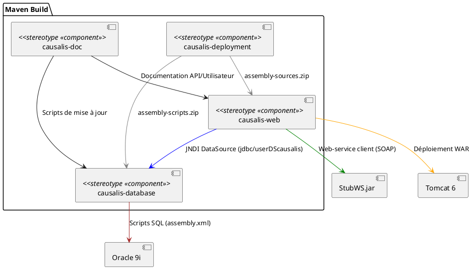
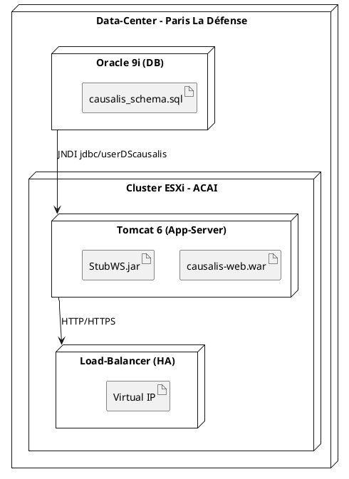
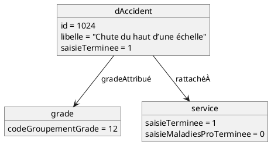
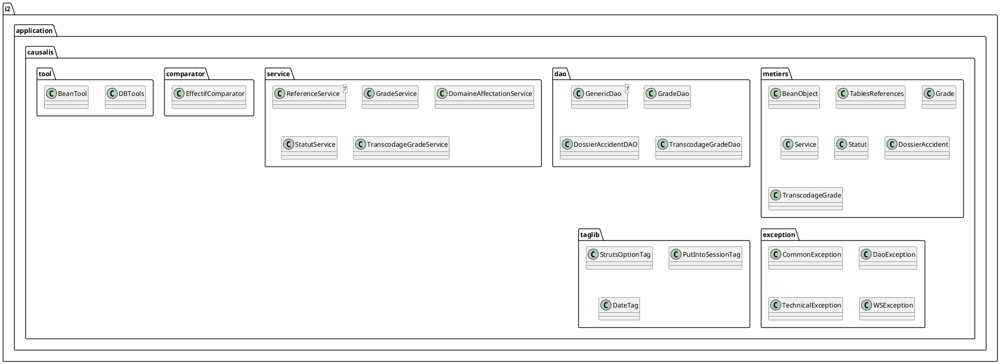
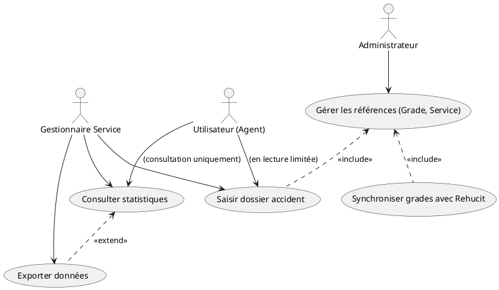
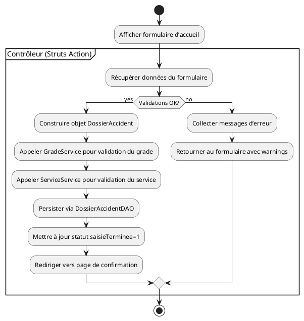
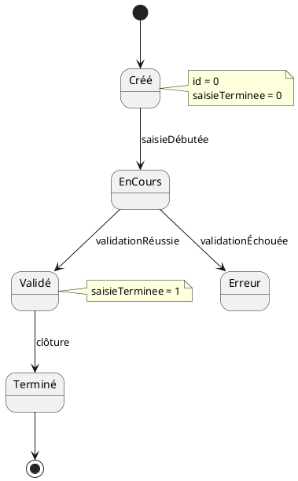
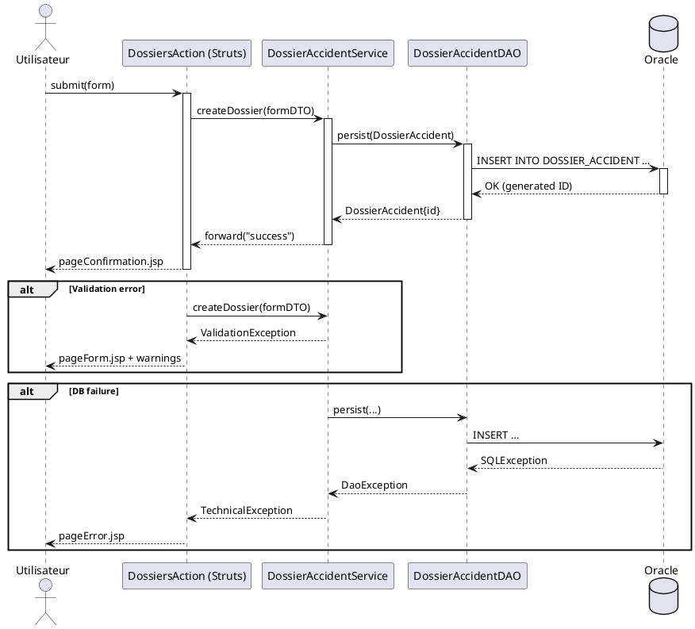
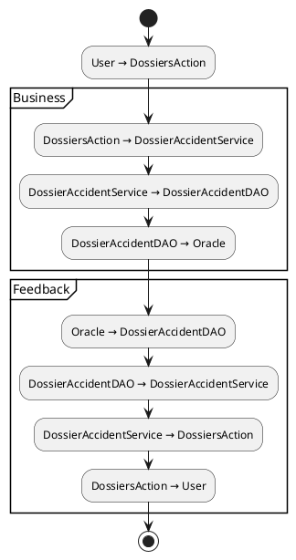

# Dossier d’Architecture Technique (DAT) – **CAUSALIS**  
**Version : 1.2 – 2024‑04‑28**  

---

## 1️⃣ Introduction architecturale  

| Élément | Description |
|--------|-------------|
| **Objectif** | Documenter l’architecture fonctionnelle, technique et d’intégration du système **CAUSALIS** (application de gestion des accidents du travail et des maladies professionnelles). |
| **Périmètre** | - Module **causalis‑web** (Struts 1.x, JSP, services métier) <br>- Module **causalis‑database** (scripts Oracle, Castor JDO) <br>- Module **causalis‑deployment** (packaging Maven) <br>- Module **causalis‑doc** (documentation livrable) |
| **Références** | - `README.txt` (historique) <br>- Wiki interne (`causalis.wiki.md`, `causalis.wikisi.md`) – description métier, acteurs, environnement de production <br>- `pom.xml` (gestion Maven) <br>- `assembly.xml`, `assembly‑sources.xml` (packaging) |
| **Vue d’ensemble des diagrammes UML** | 1. **Structurels** – Class, Component, Deployment, Package, Object (exemple) <br>2. **Comportementaux** – Use‑Case, Activity, State‑Machine <br>3. **Interactions** – Sequence (scénario principal + alt/exception), Communication |
| **Organisation du document** | Les sections suivantes respectent la structure imposée par la norme ISO/IEC 19505‑2 (UML 2.4.1). Chaque diagramme est fourni en **PlantUML** (format texte) avec légende détaillée et numéro de version. |

---

## 2️⃣ Vue Structurelle  

### 2.1 Diagramme de Classes  

```plantuml
@startuml
'=== Version 1.0 – 2024‑04‑28 ===
!define Table stereotype <<Entity>>
!define DAO stereotype <<DAO>>
!define Service stereotype <<Service>>
!define Controller stereotype <<Controller>>
!define Exception stereotype <<Exception>>
!define Tag stereotype <<Tag>>
!define Util stereotype <<Utility>>

'--- Packages -------------------------------------------------
package "i2.application.causalis.metiers" as metiers {
    class BeanObject
    class TablesReferences
    class Grade {
        -int codeGroupementGrade
        +int getCodeGroupementGrade()
        +void setCodeGroupementGrade(int)
    }
    class Service {
        -int saisieTerminee
        -int saisieMaladiesProTerminee
        +int getSaisieTerminee()
        +void setSaisieTerminee(int)
        +int getSaisieMaladiesProTerminee()
        +void setSaisieMaladiesProTerminee(int)
    }
    class Statut {
        -int code
        -String libelle
        +int getCode()
        +String getLibelle()
    }
    class DossierAccident {
        -int id
        -String libelle
        -int saisieTerminee
        +int getId()
        +String getLibelle()
        +int getSaisieTerminee()
    }
    class TranscodageGrade {
        -String codeGradeRehucit
        -String macro
        +String getCodeGradeRehucit()
        +void setCodeGradeRehucit(String)
        +String getMacro()
        +void setMacro(String)
    }
    '... (autres entités du domaine) ...
}

package "i2.application.causalis.dao" as dao {
    class GenericDao<T> {
        +List<T> getAll(String table, Map<String,Object> map, String[] ops, String order)
    }
    class GradeDao {
        +List<Grade> getAllGrades()
    }
    class DossierAccidentDAO {
        +DossierAccident findById(int)
    }
    class TranscodageGradeDao {
        +TranscodageGrade findByCode(String)
    }
}

package "i2.application.causalis.service" as service {
    class ReferenceService<T> {
        -GenericDao<T> dao
        +ReferenceService(GenericDao<T>)
    }
    class GradeService {
        +List<Grade> getAllGrade()
    }
    class DomaineAffectationService {
        +List<DomaineAffectation> getAllDomaineAffectation()
    }
    class StatutService {
        +List<Statut> getAllStatut()
        +Map<Integer,String> getStatutsMap()
    }
    class SynchronizeService <<interface>> {
        +int synchronize()
    }
    class TranscodageGradeService {
        +boolean isPresent(TranscodageGrade)
    }
}

package "i2.application.causalis.exception" as exc {
    class CommonException <<Exception>>
    class DaoException <<Exception>>
    class TechnicalException <<Exception>>
    class WSException <<Exception>>
}

package "i2.application.causalis.comparator" as comp {
    class EffectifComparator {
        +int compare(Effectif,Effectif)
    }
}

package "i2.application.causalis.taglib" as tl {
    class StrutsOptionTag <<Tag>>
    class PutIntoSessionTag <<Tag>>
    class DateTag <<Tag>>
}

package "i2.application.causalis.tool" as tool {
    class DBTools <<Utility>>
    class BeanTool <<Utility>>
    class DateTool <<Utility>>
}

'--- Relationships -------------------------------------------------
GradeDao ..|> GenericDao
DossierAccidentDAO ..|> GenericDao
TranscodageGradeDao ..|> GenericDao

ReferenceService <|-- GradeService
ReferenceService <|-- DomaineAffectationService
ReferenceService <|-- StatutService

GradeService --> GradeDao : uses
DomaineAffectationService --> GenericDao : uses
StatutService --> GenericDao : uses
TranscodageGradeService --> TranscodageGradeDao : uses

Grade --> TablesReferences
Service --> TablesReferences
Statut --> TablesReferences
DossierAccident --> TablesReferences
TranscodageGrade --> TablesReferences

EffectifComparator --> "i2.application.webservice.sirh_causalis.Effectif"

StrutsOptionTag --> "org.apache.struts.taglib.html.OptionTag"
PutIntoSessionTag --> "org.apache.struts.taglib.logic.IterateTag"

DBTools --> "org.exolab.castor.jdo.QueryResults"

CommonException <|-- DaoException
CommonException <|-- WSException
TechnicalException --> Exception : wraps

@enduml
```

**Légende**  

| Stereotype | Signification |
|------------|----------------|
| <<Entity>> | Classe métier persistant (table Oracle). |
| <<DAO>> | Data‑Access Object – accès aux données (hérite de `GenericDao`). |
| <<Service>> | Facade métier, encapsule la logique métier et les DAO. |
| <<Controller>> | Action Struts (non affichée dans le diagramme pour lisibilité). |
| <<Exception>> | Hiérarchie d’exceptions d’application. |
| <<Tag>> | TagLib JSP personnalisé. |
| <<Utility>> | Classe utilitaire (statique ou sans état). |

---

### 2.2 Diagramme de Composants  



**Légende**  

| Couleur | Relation |
|---------|----------|
| **Bleu** | Dépendance fonctionnelle (DataSource). |
| **Vert** | Inclusion de bibliothèques tierces (`StubWS.jar`). |
| **Orange** | Environnement d’exécution (serveur d’applications). |
| **Marron** | Base de données sous‑jacente. |
| **Gris** | Artifacts de packaging (ZIP). |

---

### 2.3 Diagramme de Déploiement  



**Légende**  

| Élément | Description |
|---------|-------------|
| **DB** | Oracle 9i hébergeant le schéma `causalis`. |
| **Tomcat 6** | Conteneur d’exécution du WAR `causalis‑web`. |
| **StubWS.jar** | Client SOAP pour les services externes (ex. Rehucit). |
| **LB** | Point d’entrée haute disponibilité. |
| **Virtual IP** | Adresse unique exposée aux usagers. |

---

### 2.4 Diagramme d’Objets (exemple)



---

### 2.5 Diagramme de Packages  



---

### 2.6 Diagramme de Structure Composite (optionnel)  

```plantuml
@startuml
'=== Version 1.0 – 2024‑04‑28 ===
class GradeService {
    -GenericDao<Grade> dao
    +List<Grade> getAllGrade()
}
class GenericDao<T> {
    +List<T> getAll(String, Map, String[], String)
}
GradeService *-- GenericDao<Grade> : uses
@enduml
```

---

## 3️⃣ Vue Comportementale  

### 3.1 Diagramme de Cas d’Utilisation  



**Légende**  

- **<<include>>** : fonction obligatoire (ex. la création d’un dossier nécessite la validation des références).  
- **<<extend>>** : fonctionnalité optionnelle (export ne se déclenche que sur demande).

---

### 3.2 Diagramme d’Activités (saisie d’un dossier accident)  



---

### 3.3 Diagramme d’État (cycle de vie d’un **DossierAccident**)  



---

## 4️⃣ Vue d’Interaction  

### 4.1 Diagramme de Séquence (scénario nominal – création d’un dossier accident)



**Scénarios couverts**  

| Scénario | Description |
|----------|-------------|
| **Nominal** | Formulaire valide → Service → DAO → DB → Confirmation. |
| **Alternative** | Validation échouée → retour au formulaire avec messages d’avertissement. |
| **Exception** | Erreur SQL → `DaoException` propagée → page d’erreur générique. |

---

### 4.2 Diagramme de Communication (même scénario)

```plantuml
@startuml
'=== Version 1.0 – 2024‑04‑28 ===
actor Utilisateur
object DossiersAction as A
object DossierAccidentService as S
object DossierAccidentDAO as D
database Oracle as O

Utilisateur -> A : 1. submit(form)
A -> S : 2. createDossier(formDTO)
S -> D : 3. persist(DossierAccident)
D -> O : 4. INSERT …
O --> D : 5. OK (id)
D --> S : 6. DossierAccident{id}
S --> A : 7. forward("success")
A --> Utilisateur : 8. pageConfirmation.jsp
@enduml
```

---

### 4.3 Diagramme d’Overview d’Interaction (optionnel)



---

## 5️⃣ Correspondance entre diagrammes  

| Élément UML | Classe | Sequence | État | Composant | Déploiement |
|-------------|--------|----------|------|-----------|-------------|
| **Grade** | `Grade` | `GradeService.getAllGrade()` | – | `causalis-web` (service) | – |
| **DossierAccident** | `DossierAccident` | `DossierAccidentService.createDossier()` | `Créé → EnCours → Validé → Terminé` | `causalis-web` (service/DAO) | `Tomcat → Oracle` |
| **TranscodageGrade** | `TranscodageGrade` | `TranscodageGradeService.isPresent()` | – | `causalis-web` (service) | – |
| **EffectifComparator** | `EffectifComparator` | `EffectifComparator.compare()` | – | – | – |
| **StatutService** | `StatutService` | `StatutService.getAllStatut()` | – | `causalis-web` | – |
| **StrutsOptionTag** | `StrutsOptionTag` | – | – | `causalis-web` (view) | – |

---

## 6️⃣ Profils et stéréotypes UML  

```plantuml
@startuml
'=== Version 1.0 – 2024‑04‑28 ===
' Définition de profils personnalisés
profile Causalis {
    stereotype <<Entity>> as Entity
    stereotype <<DAO>> as DAO
    stereotype <<Service>> as Service
    stereotype <<Controller>> as Controller
    stereotype <<Exception>> as Exception
    stereotype <<Tag>> as Tag
    stereotype <<Utility>> as Utility
}
@enduml
```

| Stéréotype | Description |
|------------|-------------|
| `<<Entity>>` | Classe métier persistée (table Oracle). |
| `<<DAO>>` | Accès aux données (hérite de `GenericDao`). |
| `<<Service>>` | Facade métier, encapsule la logique et les DAO. |
| `<<Controller>>` | Action Struts (contrôleur MVC). |
| `<<Exception>>` | Hiérarchie d’exceptions d’application. |
| `<<Tag>>` | TagLib JSP personnalisé (ex. `StrutsOptionTag`). |
| `<<Utility>>` | Classe utilitaire sans état. |

---

## 7️⃣ Contraintes et règles OCL  

```ocl
-- Grade.codeGroupementGrade must be non‑negative
context Grade inv: self.codeGroupementGrade >= 0

-- DossierAccident.saisieTerminee must be 0 or 1
context DossierAccident inv: self.saisieTerminee = 0 or self.saisieTerminee = 1

-- Service.saisieMaladiesProTerminee must be 0 or 1
context Service inv: self.saisieMaladiesProTerminee = 0 or self.saisieMaladiesProTerminee = 1

-- TranscodageGrade.macro must respect pattern '[A-Z]{2,5}'
context TranscodageGrade inv: self.macro.matches('[A-Z]{2,5}')

-- Every DossierAccident must be linked to a Grade and a Service
context DossierAccident inv: Grade.allInstances()->exists(g | g.id = self.gradeId) and
                                 Service.allInstances()->exists(s | s.id = self.serviceId)
```

---

## 8️⃣ Patterns de conception appliqués  

| Pattern | Où il apparaît | Raison d’utilisation |
|---------|----------------|----------------------|
| **DAO** | `GenericDao<T>`, `GradeDao`, `DossierAccidentDAO` | Séparer la logique d’accès aux données du reste de l’application. |
| **Facade / Service** | `ReferenceService<T>`, `GradeService`, `StatutService` | Offrir une interface métier simple aux contrôleurs Struts. |
| **Singleton (JNDI DataSource)** | `database.xml` (Castor JDO) | Garantir une unique source de connexion partagée. |
| **Template Method** | `GenericDao<T>.getAll(...)` (méthode générique) | Permet aux sous‑classes de spécifier la table sans réécrire la logique de requête. |
| **Comparator** | `EffectifComparator` | Implémenter la comparaison d’objets métier pour les collections. |
| **Factory Method (TagLib)** | `StrutsOptionTag` (hérite de `OptionTag`) | Personnaliser le rendu d’un composant JSP. |
| **Strategy (WS Dictionary)** | `WSDictionary` (package `ws.strategy`) | Choisir dynamiquement le dictionnaire de traduction des WS. |

---

## 9️⃣ Documentation des décisions d’architecture  

| Décision | Alternatives évaluées | Motif du choix | Impact |
|---------|----------------------|----------------|--------|
| **Framework Web** | Struts 2, Spring MVC, JSF | Struts 1 déjà en production, faible coût de migration à court terme. | Maintenabilité limitée (framework obsolète) → plan de migration future. |
| **Persistance** | JPA/Hibernate, MyBatis, Castor JDO | Castor déjà intégré, scripts existants. | Castor est peu maintenu → risque de bugs, nécessite migration à moyen terme. |
| **Packaging** | Gradle, Ant, Maven | Maven standard dans l’entreprise, support des assemblages. | Facilite CI/CD via GitLab‑CI (déjà configuré). |
| **Gestion des transactions** | EJB, Spring Transaction, JTA manuel | Simplicité du JDO + JNDI, pas de serveur d’applications complet. | Pas de gestion fine des transactions → logique métier doit gérer les commits. |
| **Web‑services** | REST (JAX‑RS), SOAP (Axis) | Application consomme des services SOAP legacy (`StubWS.jar`). | Dépendance à un stub externe, complexité de test. |
| **Gestion des logs** | Log4j 2, SLF4J | Log4j déjà configuré (`log4j.xml`). | Pas de problème immédiat, mais envisager migration vers SLF4J/Logback. |
| **Tests unitaires** | JUnit 4, TestNG | JUnit déjà présent dans le projet (tests existants). | Couverture actuelle faible → besoin d’extension. |

---

## 🔟 Normes de modélisation  

| Aspect | Règle appliquée |
|--------|-----------------|
| **Nomage des classes** | PascalCase, suffixe descriptif (`*Service`, `*Dao`, `*Exception`). |
| **Nomage des packages** | `i2.application.causalis.<layer>` (layer = `metiers`, `dao`, `service`, `exception`, `comparator`, `taglib`, `tool`, `view`, `ws`). |
| **Diagrammes** | Un niveau d’abstraction par diagramme (ex. diagramme de classes → vue logique, diagramme de composants → vue de déploiement). |
| **Layout PlantUML** | Direction top‑down, les dépendances sont affichées de gauche à droite pour faciliter la lecture. |
| **Versionnage** | Chaque diagramme porte un commentaire `Version X.Y – YYYY‑MM‑DD`. |
| **Documentation** | Chaque classe/élément possède une légende courte (stéréotype, rôle). |
| **Traçabilité** | Matrice de traçabilité (section 5) maintenue à jour. |
| **Conformité ISO/IEC 19505‑2** | Tous les diagrammes utilisent les notations UML 2.4.1 (stéréotypes, contraintes OCL, fragments combinés). |

---

## 📎 Annexes  

### A.1 Glossaire UML  

| Terme | Signification |
|-------|---------------|
| **Actor** | Entité externe (personne ou système) qui interagit avec le système. |
| **Use‑Case** | Fonctionnalité observable du point de vue d’un acteur. |
| **Component** | Unité modulaire déployable (ex. WAR, JAR). |
| **Node** | Ressource physique ou virtuelle (serveur, VM). |
| **Artifact** | Fichier binaire ou texte produit par le build (WAR, ZIP, JAR). |
| **Stereotype** | Extension du méta‑modèle UML, ici `<<Entity>>`, `<<DAO>>`, … |
| **OCL** | Object Constraint Language – contraintes formelles. |
| **Fragment combiné** | Construction UML (alt, opt, loop, …) utilisée dans les séquences. |

### A.2 Liste des artefacts livrables (Maven Assembly)  

| Module | Artefact | Description |
|--------|----------|-------------|
| `causalis-web` | `causalis-web.war` | Application Struts 1, JSP, tags, services. |
| `causalis-database` | `causalis‑scripts.zip` | Scripts SQL de mise à jour (`script/*.sql`). |
| `causalis-deployment` | `causalis‑sources.zip` | Sources complètes (exclut `target`). |
| `causalis-doc` | `causalis‑doc.zip` | Documentation d’installation, DAF, bon de livraison. |

### A.3 Matrice de traçabilité (extraits)  

| Élément | Classe(s) | Diagramme | Use‑Case(s) | Scénario(s) |
|---------|-----------|-----------|-------------|-------------|
| **Gestion des grades** | `Grade`, `GradeDao`, `GradeService` | Class, Component, Sequence | UC5 « Gérer les références » | Seq‑01 (création), Seq‑02 (synchronisation) |
| **Saisie dossier accident** | `DossierAccident`, `DossierAccidentDAO`, `DossierAccidentService`, `DossiersAction` | Class, Component, Deployment, Sequence | UC1 « Saisir dossier accident » | Seq‑01 (nominal), Seq‑02 (validation error) |
| **Export de données** | `CausalisExportManager`, `FichierOpenOffice` | Class, Component | UC3 « Exporter données » | Seq‑03 (export) |
| **Synchronisation des grades** | `TranscodageGradeService`, `TranscodageGradePredicate`, `StubWS.jar` | Class, Component, Sequence | UC4 « Synchroniser grades » | Seq‑04 (appel WS) |

---

## 📚 Références  

1. **ISO/IEC 19505‑1 :2012** – UML 2.4.1 Infrastructure.  
2. **ISO/IEC 19505‑2 :2012** – UML 2.4.1 Superstructure.  
3. **Projet CAUSALIS – GitLab** – dépôt source complet.  
4. **Documentation interne** – `causalis.wiki.md`, `causalis.wikisi.md`.  
5. **Maven Assembly Plugin** – configuration `assembly.xml`, `assembly-sources.xml`.  

--- 

*Fin du Dossier d’Architecture Technique – CAUSALIS*  