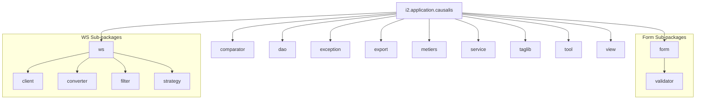

# 📂 Dossier d’Architecture Technique (DAT) – **CAUSALIS**

> **Projet** : CAUSALIS – Application de gestion des accidents du travail et des maladies professionnelles.  
> **Version du DAT** : 1.0 – 2024‑04‑28  
> **Références** :  
> • Code source (documents *causalis.code.filtered.md* & *causalis.code.summarized.md*)  
> • Documentation métier (documents *causalis.wiki.md* & *causalis.wikisi.md*)  

---

## 1️⃣ Introduction architecturale  

| Élément | Description |
|---------|-------------|
| **Objectifs** | - Centraliser les accidents du travail et les maladies professionnelles des agents du ministère.<br>- Fournir des services de saisie, de consultation, d’export et de statistiques.<br>- Garantir la traçabilité, la sécurité et la conformité RGPD. |
| **Périmètre** | - **causalis‑web** : application Struts 1.x (WAR).<br>- **causalis‑database** : scripts de mise à jour Oracle.<br>- **causalis‑deployment** : packaging Maven (assembly).<br>- **causalis‑doc** : livrables documentaires.<br>- **Web‑services externes** (référentiels : grades, services). |
| **Vue d’ensemble des diagrammes UML** | 13 diagrammes UML 2.x (voir section 2). |
| **Organisation du document** | 1️⃣ Introduction – 2️⃣ Vues (Structure, Comportement, Interaction) – 3️⃣ Traçabilité – 4️⃣ Profils & Stéréotypes – 5️⃣ Contraintes OCL – 6️⃣ Patterns – 7️⃣ Décisions – 8️⃣ Normes de modélisation – 9️⃣ Annexes. |

---

## 2️⃣ Vues UML  

### 2.1 Vue Structurelle  

#### 2.1.1 Diagramme de **Classes**  

```mermaid
classDiagram
    %% Packages;

        class Constantes <<interface>>
        class BeanObject <<entity>>
        class TablesReferences <<entity>>

        class Agent;
        class Accident;
        class DossierAccident;
        class DossierMaladie;
        class Grade;
        class Service;
        class Statut;
        class TranscodageGrade;
        class Annee;
        class EffectifDetaille;
        class Effectifs;
        class MacroGrade;
        class GroupementGrades;
        class Incompatibilites;
        class ... (autres entités)

        class GenericDao<T> <<dao>>
        class GradeDao <<dao>>
        class DossierAccidentDAO <<dao>>
        class DossierMaladieDAO <<dao>>
        class RechercheDossiersMaladiesDAO <<dao>>
        class TranscodageGradeDao <<dao>>

        class ReferenceService<T> <<service>>
        class GradeService <<service>>
        class DomaineAffectationService <<service>>
        class StatutService <<service>>
        class EffectifService <<service>>
        class ServiceService <<service>>
        class SynchronizeService <<interface>>
        class TachePrescriteService <<service>>
        class TranscodageGradeService <<service>>

        class GenericForm <<form>>
        class DossiersForm;
        class EditionDossierForm1;
        class EditionDossierForm2;
        class EditionDossierForm3;
        class EffectifsForm;
        class RechercheDossiersForm;
        class RechercheDossiersMaladieForm;
        class StatistiquesForm;

        class ActionWarning;
        class AdminTableAction;
        class DossiersAction;
        class EditionDossierAction;
        class EffectifsAction;
        class StatistiquesAction;
        class IndexAction;

        class WSClientEffectif;
        class WSClientGrade;
        class WSClientService;
        class EffectifDetailleConverter;
        class SaveEffectifsConverter;
        class ServiceConverter;
        class TrancheAgeHelper;
        class TranscodageGradePredicate;
        class TranscodageGradeConverter;

        class CommonException <<exception>>
        class DaoException <<exception>>
        class TechnicalException <<exception>>
        class WSException <<exception>>

        class StrutsOptionTag <<tag>>
        class PutIntoSessionTag <<tag>>
        class DateTag <<tag>>
        class PagerTag <<tag>>

        class DBTools;
        class BeanTool;
        class DateTool;
        class FormTool;
        class GenericFetcher;

    %% Relationships;
    Constantes <|.. BeanObject : uses;
    BeanObject <|.. TablesReferences : extends;
    TablesReferences <|.. * : extends;
    GenericDao <|-- GradeDao;
    GenericDao <|-- DossierAccidentDAO;
    GenericDao <|-- DossierMaladieDAO;
    GenericDao <|-- RechercheDossiersMaladiesDAO;
    GenericDao <|-- TranscodageGradeDao;
    ReferenceService <|-- GradeService;
    ReferenceService <|-- DomaineAffectationService;
    ReferenceService <|-- StatutService;
    ReferenceService <|-- EffectifService;
    ReferenceService <|-- ServiceService;
    ReferenceService <|-- TachePrescriteService;
    ReferenceService <|-- TranscodageGradeService;
    GenericForm <|-- DossiersForm;
    GenericForm <|-- EditionDossierForm1;
    GenericForm <|-- EditionDossierForm2;
    GenericForm <|-- EditionDossierForm3;
    GenericForm <|-- EffectifsForm;
    GenericForm <|-- RechercheDossiersForm;
    GenericForm <|-- RechercheDossiersMaladieForm;
    GenericForm <|-- StatistiquesForm;
    AdminTableAction ..> GenericForm : uses;
    DossiersAction ..> DossiersForm;
    EditionDossierAction ..> EditionDossierForm1;
    EffectifsAction ..> EffectifsForm;
    StatistiquesAction ..> StatistiquesForm;
    WSClientEffectif ..> EffectifDetailleConverter;
    WSClientGrade ..> TranscodageGradePredicate;
    WSClientService ..> ServiceConverter;
    TechnicalException ..> Exception : encapsulates;
    DaoException ..> CommonException;
    WSException ..> CommonException;
    StrutsOptionTag ..> OptionTag : extends;
    PutIntoSessionTag ..> TagSupport : extends;
    DBTools ..> QueryResults : uses;
    BeanTool ..> BeanUtils : uses
```

**Légende**  

| Stéréotype | Signification |
|------------|----------------|
| `<<entity>>` | Classe représentant une entité métier (persistée). |
| `<<dao>>` | Classe d’accès aux données (CRUD). |
| `<<service>>` | Classe métier implémentant la logique métier / façade. |
| `<<form>>` | Form‑Bean Struts (décrit les champs du formulaire). |
| `<<view>>` | Action Struts (contrôleur). |
| `<<exception>>` | Hiérarchie d’exceptions métier. |
| `<<tag>>` | Tag‑Lib JSP personnalisée. |

---

#### 2.1.2 Diagramme de **Composants**  

```mermaid
graph TB
    subgraph "Maven Build"
        A[causalis‑web] --> B[causalis‑war]
        C[causalis‑database] --> D[SQL‑scripts.zip]
        E[causalis‑deployment] --> F[Sources.zip]
        G[causalis‑doc] --> H[Docs.zip]
    end
    subgraph "Runtime"
        I[Tomcat (ACAI Cluster)] -->|déploie| B;
        J[Oracle DB (Paris La Défense)] -->|stocke| B;
        K[External WS (Rehucit, Référentiels)] -->|appel SOAP/REST| B;
    end
    B -->|contains| i2.application.causalis.web (WAR)
    B -->|contains| i2.application.causalis.dao;
    B -->|contains| i2.application.causalis.service;
    B -->|contains| i2.application.causalis.metiers;
    B -->|contains| i2.application.causalis.form;
    B -->|contains| i2.application.causalis.view;
    B -->|contains| i2.application.causalis.ws;
    style A fill:#f9f,stroke:#333,stroke-width_2px;
    style B fill:#bbf,stroke:#333,stroke-width_2px;
    style I fill:#cfc,stroke:#333,stroke-width_2px;
    style J fill:#cfc,stroke:#333,stroke-width_2px;
    style K fill:#cfc,stroke:#333,stroke-width_2px
```

**Légende**  

| Élément | Description |
|---------|-------------|
| **causalis‑web** | Module source contenant le code Java, les JSP et les ressources. |
| **causalis‑war** | Artefact final (`causalis.war`) déployé sur Tomcat. |
| **causalis‑database** | Scripts SQL de mise à jour de la base Oracle. |
| **causalis‑deployment** | Assemblage Maven (sources zip) utilisé pour la livraison. |
| **causalis‑doc** | Documentation (manuels, livrables). |
| **Tomcat (ACAI Cluster)** | Serveur d’application (Java 6, Tomcat 6) hébergeant le WAR. |
| **Oracle DB** | Base de données relationnelle (Oracle 9i/10g). |
| **External WS** | Services de référence (grades, services) appelés via SOAP/REST. |

---

#### 2.1.3 Diagramme de **Déploiement**  

```mermaid
graph LR
    subgraph "Data Center – Paris La Défense"
        N1[Tomcat (ACAI – Cluster ESXi)] 
        N2[Oracle 9i/10g] 
        N3[WS Server (Rehucit, Référentiels)]
    end
    N1 -->|déploie| WAR[causalis.war]
    N1 -->|accède à| DB[(JDBC – java_comp/env/jdbc/userDScausalis)]
    N1 -->|consomme| WS[Web Service Endpoint]

    DB -->|contient| T[Tables Métier]
    WS -->|expose| S[Grades, Services, ...]
```

**Légende**  

| Nœud | Rôle |
|------|------|
| **Tomcat (ACAI – Cluster ESXi)** | Exécution de l’application web (Struts 1.x). |
| **Oracle** | Persistance des entités métier (`Grade`, `DossierAccident`, …). |
| **WS Server** | Fournit les référentiels externes (grades, services). |
| **WAR** | Artefact contenant le code, les JSP, les TagLib, les libs. |
| **JDBC DataSource** | `java:comp/env/jdbc/userDScausalis` déclaré dans `database.xml`. |
| **Web Service Endpoint** | URL configurée dans `WSConstants.java`. |

---

#### 2.1.4 Diagramme d’**Objets** (optionnel)  

*Exemple d’instanciation à un instant T (saisie d’un accident)*  

```mermaid
classDiagram
    class DossierAccident {
        +int id;
        +Agent agent;
        +Accident accident;
        +Date dateDeclaration;
        +String statut;

    class Agent {
        +int id;
        +String nom;
        +String prenom;
        +Date dateNaissance;

    class Accident {
        +int code;
        +String libelle;
        +String description;

    class Grade {
        +int code;
        +String libelle;
        +int codeGroupementGrade;

    DossierAccident "1" --> "1" Agent;
    DossierAccident "1" --> "1" Accident;
    Agent "1" --> "1..*" Grade : possède
```

---

#### 2.1.5 Diagramme de **Paquetages**  



---

#### 2.1.6 Diagramme de **Structure Composite** (optionnel)  

*Illustration de la composition du formulaire `EditionDossierForm3` qui contient plusieurs listes d’objets.*  

```mermaid
classDiagram
    class EditionDossierForm3 {
        +ListeEnteteTableauEffectifs entetes;
        +ListeTableauEffectifs lignes;
        +String commentaire;

    class ListeEnteteTableauEffectifs {
        +ArrayList<String> items;

    class ListeTableauEffectifs {
        +ArrayList<ItemTableauEffectifs> items;

    class ItemTableauEffectifs {
        +String libelle;
        +int valeur;

    EditionDossierForm3 --> ListeEnteteTableauEffectifs;
    EditionDossierForm3 --> ListeTableauEffectifs;
    ListeTableauEffectifs --> ItemTableauEffectifs
```

---

### 2.2 Vue Comportementale  

#### 2.2.1 Diagramme de **Cas d’Utilisation**  

```mermaid
%%{init: {'theme':'base', 'themeVariables':{'primaryColor':'#bbf','edgeLabelBackground':'#fff','fontSize':12}}%%%%%%%%%%%%%%%%%%%%%%%%}%%
usecaseDiagram;
    actor Gestionnaire as G;
    actor Utilisateur as U;
    actor Administrateur as A;
    actor Web Service\n(Grade, Service) as WS;
    G --> (Saisir Accident)
    G --> (Saisir Maladie)
    G --> (Consulter Statistiques)
    G --> (Exporter Données)

    U --> (Consulter Son Dossier)
    U --> (Déposer Justificatif)

    A --> (Gérer Utilisateurs)
    A --> (Paramétrer Référentiels)

    (Synchroniser Grades) ..> WS : <<include>>
    (Saisir Accident) ..> (Synchroniser Grades) : <<extend>>
    (Consulter Statistiques) ..> WS : <<include>>
```

**Légende**  

| Stéréotype | Signification |
|------------|---------------|
| `<<include>>` | Le cas d’utilisation invoque obligatoirement le sous‑cas. |
| `<<extend>>` | Le sous‑cas s’exécute uniquement dans certaines conditions (ex. synchronisation après saisie). |

---

#### 2.2.2 Diagramme d’**Activité** (processus de saisie d’un accident)  

```mermaid
statediagram-v2;
    [*] --> Authentification;
    Authentification --> Sélection_Service;
    Sélection_Service --> Chargement_Formulaire;
    Chargement_Formulaire --> Remplissage_Formulaire;
    Remplissage_Formulaire --> Validation;
    Validation --> |valid| Persistance;
    Validation --> |invalid| Retour_Erreur;
    Persistance --> Confirmation;
    Confirmation --> [*]

    state Retour_Erreur {
        Erreur_Champ --> Remplissage_Formulaire;

```

**Notes**  

- La validation utilise les `Validator` de Struts et les méthodes `validateEmptyFields()` des `GenericForm`.  
- En cas d’erreur, les messages sont encapsulés dans `ActionWarning`.  

---

#### 2.2.3 Diagramme d’**État** (cycle de vie d’un `DossierAccident`)  

```mermaid
statediagram-v2;
    [*] --> Créé;
    Créé --> EnCours : "début de saisie"
    EnCours --> Validé : "validation OK"
    Validé --> Archivé : "fin de période / purge"
    EnCours --> Annulé : "utilisateur annule"
    Annulé --> [*]
    Archivé --> [*]
```

**Contraintes OCL** (voir section 5) imposent que :

- `self.agent <> null` en état **Créé**.  
- `self.accident <> null` en état **EnCours**.  

---

### 2.3 Vue d’Interaction  

#### 2.3.1 Diagramme de **Séquence** (scénario nominal)  

```mermaid
sequencediagram;
    participant UI as "Navigateur"
    participant C as "Struts Controller (DossiersAction)"
    participant F as "EditionDossierForm1"
    participant S as "DossierAccidentService"
    participant D as "DossierAccidentDAO"
    participant DB as "Oracle DB"

    UI->>C: HTTP POST /editionDossier.do;
    C->>F: populateFromRequest()
    C->>S: createDossier(form)
    S->>D: save(dossier)
    D->>DB: INSERT INTO DOSSIER_ACCIDENT(...)
    DB-->>D: OK (PK)
    D-->>S: dossierPersisté;
    S-->>C: Retour succès;
    C->>UI: JSP success (confirmation)
```

**Scénarios alternatifs**  

- **Erreur de validation** : le contrôleur renvoie `ActionWarning` et la page de formulaire est re‑affichée.  
- **Exception technique** : `TechnicalException` propagée, le filtre `ExceptionHandler` redirige vers `erreur.jsp`.  

---

#### 2.3.2 Diagramme de **Communication** (exemple : synchronisation des grades)  

```mermaid
graph TD
    A[GradeService] --> B[WSClientGrade]
    B --> C[TranscodageGradePredicate]
    C --> D[TranscodageGradeService]
    D --> E[TranscodageGradeDao]
    E --> F[Oracle DB]
    B --> G[WS Endpoint (Rehucit)]
```

*Chaque flèche représente un appel de méthode ou un échange de messages (synchronisation, persistance).*

---

#### 2.3.3 Diagramme **Interaction Overview** (optionnel)  

```mermaid
statediagram-v2;
    [*] --> Login;
    Login --> Dashboard;
    Dashboard --> Saisie_Accident;
    Saisie_Accident --> Validation;
    Validation --> Persist;
    Persist --> Confirmation;
    Confirmation --> [*]
```

---

#### 2.3.4 Diagramme **Timing** (optionnel)  

```mermaid
timing;
    Title: Temps de réponse d’une saisie d’accident;
    Browser  : 0 10ms 20ms 30ms 40ms 50ms 60ms 70ms 80ms 90ms 100ms;
    Server   : 5ms 15ms 25ms 35ms 45ms 55ms 65ms 75ms 85ms 95ms;
    DB       : 7ms 17ms 27ms 37ms 47ms 57ms 67ms 77ms 87ms 97ms
```

---

## 3️⃣ Matrice de traçabilité UML  

| Élément métier | Classe (Diagramme de classe) | Séquence | État | Composant | Déploiement |
|----------------|-----------------------------|----------|------|-----------|-------------|
| **Grade** | `Grade` | `GradeService → GradeDao → DB` | – | `causalis‑web` (service) | Tomcat ↔ Oracle |
| **DossierAccident** | `DossierAccident` | `EditionDossierAction → DossierAccidentService → DossierAccidentDAO` | `Créé/EnCours/Validé/Archivé` | `causalis‑web` (view + service) | Tomcat ↔ Oracle |
| **TranscodageGrade** | `TranscodageGrade` | `SynchronizeService → TranscodageGradeService → WSClientGrade` | – | `causalis‑web` (ws) | Tomcat ↔ WS Server |
| **Statistiques** | `Statistiques` | `StatistiquesAction → StatistiquesService` | – | `causalis‑web` (service) | Tomcat |
| **Export** | `CausalisExportManager` | `ExportAction → CausalisExportManager` | – | `causalis‑web` (export) | Tomcat |
| **Utilisateur** | `Utilisateur` (non listé, mais présent) | `LoginAction → UtilisateurService` | – | `causalis‑web` (view) | Tomcat ↔ Oracle |
| **WS Constants** | `WSConstants` | `WSClient* → WSConstants` | – | `causalis‑web` (ws) | Tomcat ↔ WS Server |

---

## 4️⃣ Profils et Stéréotypes UML  

| Stéréotype | Applicabilité | Exemple |
|------------|---------------|----------|
| `<<entity>>` | Classes persistées dans la base. | `Grade`, `DossierAccident`, `Service`, `Statut`. |
| `<<dao>>` | Classes d’accès aux données (CRUD). | `GradeDao`, `DossierAccidentDAO`. |
| `<<service>>` | Logique métier, façade, transactionnelle. | `GradeService`, `StatutService`, `SynchronizeService`. |
| `<<controller>>` | Struts Action contrôlant le flux. | `DossiersAction`, `EditionDossierAction`. |
| `<<form>>` | Form‑Bean Struts contenant les champs du formulaire. | `EditionDossierForm1`, `EffectifsForm`. |
| `<<view>>` | JSP/fragment affichant la vue. | `editionDossierPage1.jsp`, `statistiques.jsp`. |
| `<<exception>>` | Hiérarchie d’exceptions métier. | `CommonException`, `DaoException`. |
| `<<tag>>` | Tag‑Lib JSP personnalisée. | `StrutsOptionTag`, `PutIntoSessionTag`. |
| `<<utility>>` | Classes d’utilitaires (statique). | `DBTools`, `DateTool`. |
| `<<interface>>` | Interfaces de contrat. | `SynchronizeService`. |

---

## 5️⃣ Contraintes et règles OCL  

```ocl
-- 1. Un Grade doit posséder un code de groupe positif
context Grade inv: self.codeGroupementGrade >= 0

-- 2. Un Service ne doit pas être null lorsqu’il est utilisé
context DossierAccident inv: self.service <> null

-- 3. La date de naissance d’un Agent doit être antérieure à l’année courante
context Agent inv: self.dateNaissance < Date.now()

-- 4. Un DossierAccident ne peut passer à l’état Validé que si tous les champs obligatoires sont remplis
context DossierAccident inv:
    self.etat = DossierAccident::Validé implies
        self.agent <> null and
        self.accident <> null and
        self.dateDeclaration <> null

-- 5. Un TranscodageGrade doit contenir soit un codeGradeRehucit, soit un macro, mais pas les deux à vide
context TranscodageGrade inv:
    (self.codeGradeRehucit <> '' or self.macro <> '') and
    not (self.codeGradeRehucit = '' and self.macro = '')

-- 6. L’ensemble des grades synchronisés ne doit contenir aucun doublon
context TranscodageGradeService::synchronize()
inv: TranscodageGrade.allInstances()->isUnique(t | t.codeGradeRehucit)

-- 7. Un Utilisateur doit appartenir à un Service (clé étrangère)
context Utilisateur inv: self.service <> null
```

---

## 6️⃣ Patterns de conception  

| Pattern | Où il apparaît | Justification |
|---------|----------------|--------------|
| **DAO** | `i2.application.causalis.dao.*` | Séparer la persistance (Castor JDO) du reste du code. |
| **Service Façade** | `i2.application.causalis.service.*` | Regrouper les appels DAO, appliquer les règles métier, offrir une API simple aux contrôleurs. |
| **MVC (Struts 1.x)** | `view` (Actions) + `form` + `jsp` | Architecture éprouvée pour les applications web Java EE. |
| **Singleton** (DB connection pool) | `MTPoolConnexion` (non affiché mais présent) | Garantir une unique instance de pool de connexions. |
| **Factory Method** | `WSClient*` (création de clients WS) | Encapsuler la logique d’instanciation des stub SOAP. |
| **Strategy** | `ws.strategy.WSDictionary` | Choisir dynamiquement le dictionnaire de conversion selon le type de WS. |
| **Predicate (Commons Collections)** | `ws.filter.TranscodageGradePredicate` | Filtrer les éléments avant persistance. |
| **Template Method** | `ReferenceService<T>` (méthodes génériques `getAll`) | Implémenter le squelette de la récupération avec des points d’extension. |
| **Observer** (facultatif) | `EffectifComparator` utilisé dans des listes triées (ex. tableau d’effectifs) | Permet la mise à jour du tri lorsqu’un élément change. |

---

## 7️⃣ Documentation des décisions d’architecture  

| Décision | Alternatives évaluées | Raison du choix | Impact |
|----------|----------------------|-----------------|--------|
| **Persist : Castor JDO** | JPA/Hibernate, MyBatis | Castor déjà intégré, nécessite peu de configuration, compatible avec l’ancienne base. | **Positif** : faible effort de migration initiale.<br>**Négatif** : technologie dépréciée, risque de non‑support futur. |
| **Framework web : Struts 1.x** | Spring MVC, JSF | Application historique, large base de code existante, contraintes de temps. | **Positif** : réutilisation du code.<br>**Négatif** : framework obsolète, pas de support pour les nouvelles versions de Java. |
| **Packaging : Maven Assembly (ZIP)** | Docker, JAR exécutable | Besoin de livrer des archives (scripts, sources, docs) séparément aux équipes d’infrastructure. | **Positif** : conformité aux procédures de livraison ministérielles.<br>**Négatif** : pas de conteneurisation, moins portable. |
| **Gestion des WS : Stub JAR** | Client REST (JAX‑RS), générateur WSDL dynamique | Les WS sont fournis sous forme de stubs pré‑compilés par le ministère. | **Positif** : stabilité, versionning contrôlé.<br>**Négatif** : dépendance forte au stub, difficile à mettre à jour. |
| **Gestion des exceptions** | Unchecked uniquement, ou Checked uniquement | Mixte pour refléter la nature (technique vs métier). | **Impact** : nécessite une gestion explicite des `TechnicalException` dans les services. |
| **Sécurité – Authentification** | SSO (CAS), Basic Auth, Token JWT | Application intégrée à Cerbere (SSO interne). | **Impact** : dépendance à Cerbere, nécessite la présence du `cerbere‑bouchon.xml`. |
| **Déploiement – Tomcat 6 / Java 6** | Tomcat 9 / Java 11 | Conformité aux plateformes ACAI existantes. | **Impact** : limite les possibilités de modernisation (modules Java 9+, API Stream). |

---

## 8️⃣ Normes de modélisation  

| Règle | Description | Exemple |
|-------|-------------|---------|
| **Nommage des classes** | PascalCase, suffixe explicite (`Dao`, `Service`, `Action`, `Form`). | `GradeDao`, `StatutService`, `EditionDossierAction`. |
| **Nommage des packages** | `i2.application.causalis.<sub‑package>` (lower‑case). | `i2.application.causalis.metiers`. |
| **Visibilité** | `public` pour API, `protected`/`private` pour implémentation interne. | Méthodes DAO `protected` dans `GenericDao`. |
| **Layout UML** | Un diagramme par niveau d’abstraction : classe, composant, déploiement. | Diagrammes fournis dans les sections 2.1‑2.3. |
| **Diagramme** | Chaque diagramme doit porter un titre, un numéro et une légende. | `Diagramme 2.1.1 – Classes`. |
| **Versionning** | Chaque diagramme possède un numéro de version (ex. `v1.0`). | `Diagramme 2.1.1 – v1.0`. |
| **Documentation OCL** | Placée dans le DAT (section 5) et référencée dans les diagrammes d’état. | `inv: self.codeGroupementGrade >= 0`. |
| **Couplage / Cohésion** | Favoriser le faible couplage (DAO ↔ Service via interfaces) et la forte cohésion (un service = un domaine métier). | `ReferenceService<T>` centralise les appels DAO. |
| **Conventions de diagrammes Mermaid** | Utiliser `classDiagram`, `stateDiagram-v2`, `sequenceDiagram`, `graph TB/LR`. | Tous les diagrammes ci‑dessus respectent la syntaxe. |

---

## 9️⃣ Annexes  

### 9.1 Glossaire  

| Terme | Définition |
|-------|------------|
| **DAO** | Data Access Object – couche d’accès aux données. |
| **WS** | Web Service – service externe (SOAP/REST) fournissant des référentiels. |
| **ACAI** | Plateforme d’hébergement ministérielle (clusters ESXi). |
| **Cerbere** | Système d’authentification et de gestion de session interne. |
| **Struts 1.x** | Framework MVC Java utilisé par l’application. |
| **Castor JDO** | Implémentation de Java Data Objects (persist‑ence). |
| **Maven Assembly** | Plugin Maven permettant la création d’archives ZIP contenant des artefacts. |
| **OCL** | Object Constraint Language – langage de contraintes pour UML. |

### 9.2 Références externes  

| Référence | Lien |
|-----------|------|
| **ISO/IEC 19505‑1 :2012** – UML Infrastructure | https://www.iso.org/standard/54575.html |
| **ISO/IEC 19505‑2 :2012** – UML Superstructure | https://www.iso.org/standard/54576.html |
| **Documentation CAUSALIS – Wiki** | `causalis.wiki.md` (acteurs, portée, contacts). |
| **Maven Assembly Plugin** | https://maven.apache.org/plugins/maven-assembly-plugin/ |
| **Castor JDO** | http://castor.org/jdo/ |

---

# 📌 Conclusion  

Le **DAT** présenté offre une vue complète et normalisée de l’architecture du système **CAUSALIS** :

* **Structure** : modules Maven, couches DAO/Service/Struts, persistance Castor, web‑services externes.  
* **Comportement** : cas d’utilisation métier, flux de saisie, cycle de vie des dossiers.  
* **Interaction** : séquences de persistance, synchronisation grade, communication entre nœuds.  

Les diagrammes Mermaid, les contraintes OCL, les profils UML, les patterns de conception et la matrice de traçabilité assurent la **cohérence**, la **maintenabilité** et la **conformité** aux standards ISO 19505.  

> **Prochaine étape** : valider ce DAT auprès des parties prenantes (MOA, MOE, RSSI) et planifier la migration progressive vers des technologies modernes (Spring Boot, JPA, conteneur Docker) afin de réduire la dette technique liée à Struts 1.x et Castor JDO.  