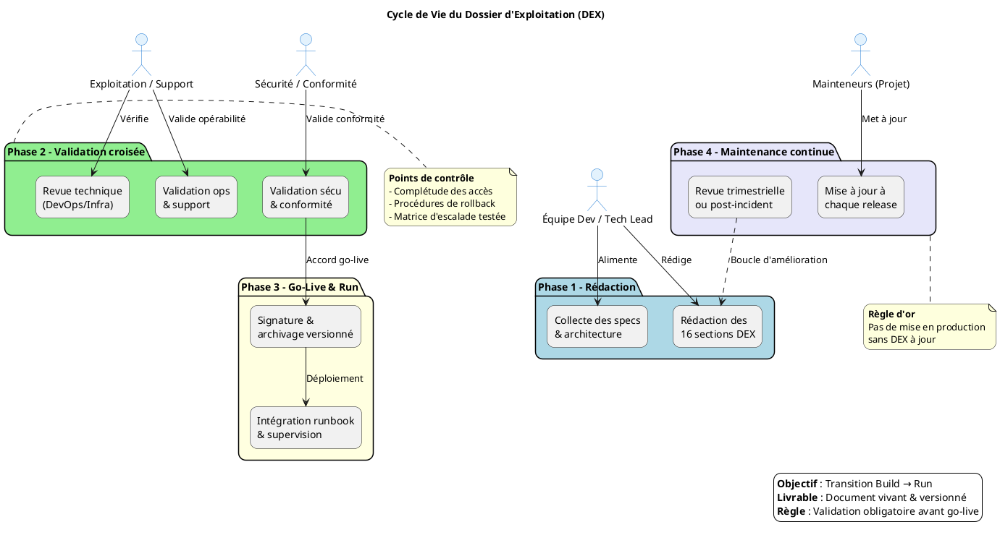

# 📄 Dossier d’Exploitation (DEX) – **CAUSALIS**
> **Document établi sur les principes de la transition Build → Run et des bonnes pratiques ITIL/DevOps pour l’exploitation applicative**  

[TOC]

---

## 1️⃣ Introduction et objectifs 🎯

**Objet** : Document de référence garantissant la continuité, la maintenabilité et la sécurisation de l’exploitation de l’application **CAUSALIS** en production.  

**Audience** : équipes Dev, Ops, Support, Sécurité, Gestion de services, MOA/MOE, auditeurs.  

### Objectifs opérationnels  

| ✅ | Objectif |
|---|----------|
| ✅ | Assurer la continuité de service |
| ✅ | Documenter les procédures de gestion courante |
| ✅ | Faciliter le support et la résolution d’incidents |
| ✅ | Encadrer les responsabilités (Dev / Ops / Support) |
| ✅ | Assurer la conformité et la maîtrise des risques |
| ✅ | Accompagner la phase de transition **Build → Run** |

---

## 2️⃣ Contexte d’usage et périmètre 🌍

| Élément | Valeur |
|---------|--------|
| **Nom de l’application** | CAUSALIS |
| **Environnement cible** | Production (Centre‑serveur ministériel Paris La Défense – plateforme ACAI – Java ACAI, clusters ESXi) |
| **Portée géographique** | Nationale (Outre‑mer inclus) |
| **Nature** | Application métier de statistiques nationales sur les accidents du travail et les maladies professionnelles (ministère du Travail) |
| **Moment du go‑live** | 2004 (mise en production initiale) |
| **Cycle de vie** | Document vivant – mise à jour à chaque évolution fonctionnelle, technique ou d’infrastructure |
| **Quand l’utiliser** | <ul><li>Avant chaque mise en production (livrable obligatoire)</li><li>Comme support de formation pour les nouvelles équipes d’exploitation</li><li>Pour les audits de conformité, PRA/PCA, revues de sécurité</li></ul> |

---

## 3️⃣ Pré‑requis et jalons ✅

- [ ] Architecture technique validée et schémas à jour (voir §5.5)  
- [ ] Environnement de production stabilisé (accès réseau, DNS, certificats)  
- [ ] Politiques définies : sauvegarde, supervision, sécurité, SLA (à préciser)  
- [ ] Contacts clés identifiés (voir §6)  
- [ ] Outillage prêt : monitoring (ex. Nagios/Prometheus), logging (Log4j), ordonnanceur (cron), gestion des secrets (JNDI)  

> ⏱ **Jalon critique** : Le DEX doit être **validé et signé** avant toute mise en service. Aucun déploiement en production ne doit intervenir sans un DEX approuvé.

---

## 4️⃣ Gouvernance et rôles 👥

| Rôle | Profil type | Responsabilité |
|------|------------|----------------|
| **Rédacteur principal** | Tech Lead / DevOps / Référent Prod | Rédaction, structuration, intégration des spécifications techniques |
| **Validateur Exploitation** | Chef d’exploitation / Responsable support | Vérification de l’opérabilité et de la complétude |
| **Validateur Sécurité / Conformité** | RSSI / DPO / Auditeur interne | Validation des procédures de sécurité, backup, conformité RGPD |
| **Mainteneur** | Équipe projet / PO technique | Mise à jour continue à chaque release ou changement d’infra |
| **Gestionnaire de changement** | Change Manager ITIL | Coordination des fenêtres de maintenance et suivi des RFC |

---

## 5️⃣ Structure détaillée du DEX (16 sections standards) 📚

| N° | Section principale | Contenu attendu (exemples) |
|---:|-------------------|----------------------------|
| 1 | **Généralités** | Objet, domaine d’application, audience cible, version du document |
| 2 | **Documents applicables et de référence** | Normes internes, chartes, architecture, politiques sécurité, `README.txt`, `sonar-project.properties` |
| 3 | **Terminologie** | Glossaire (ex. SLA, PRA, SLO, WS, JNDI, Castor JDO) |
| 4 | **Spécificités** | Fonctionnalités critiques (ex. calcul de tranches d’âge, synchronisation Grade ↔ TranscodageGrade), SLA/SLO (à définir), contacts clés, matrice d’escalade |
| 5 | **Architecture** | Schéma logique (Struts 1 + Castor JDO + Oracle + JAAS/SSO Cerbere), diagramme physique (serveurs, clusters, bases), PRA/PCA |
| 6 | **Serveurs** | Accès (SSH, console), OS (Linux RedHat 7), CPU/RAM/Stockage, noms DNS/IP, JNDI datasource `java:comp/env/jdbc/userDScausalis` |
| 7 | **Application** | Modules (`causalis-web`, `causalis-database`, `causalis-deployment`), versions Maven, paramètres de configuration (`project.properties`, `version.properties`) |
| 8 | **Supervision et métrologie** | Outils (Nagios/Prometheus, Grafana), seuils d’alerte (CPU > 80 %, temps de réponse > 5 s, erreurs HTTP 5xx), dashboards, métriques clés (latence WS, nombre d’incidents) |
| 9 | **Sauvegarde** | Politique (full + incremental, rétention 30 jours), localisation (NAS / site de secours), procédure de restauration (scripts `restore.sh`) |
| 10 | **Stockage** | Volumes montés, quotas (DB ≈ 30 Go, logs ≈ 5 Go), chemins (`$CATALINA_HOME/logs/causalis.log`) |
| 11 | **Inventaire des bases** | Oracle 12c, schémas `CAUSALIS`, sauvegardes RMAN, utilisateurs (`causalis_app`, `causalis_ro`) |
| 12 | **Flux inter‑applicatifs** | WS externes (StubWS.jar), protocoles (SOAP / HTTPS), ports (8080/8443), authentification (Kerberos via Cerbere) |
| 13 | **Plan de production** | Ordonnancement (cron → batch nightly à 02 h), fenêtres de maintenance (samedi 01‑04 h), procédures de déploiement (Maven `clean install`, `war:exploded`) |
| 14 | **Sécurisation des images** | Scan de vulnérabilités (OWASP Dependency‑Check), hardening (disable JMX remote), gestion des secrets (JNDI) |
| 15 | **Opérations courantes** | Check‑list quotidienne (vérif logs, espace disque, état du pool de connexions), diagnostic erreurs fréquentes (ex. `ORA‑01403`), scripts de nettoyage |
| 16 | **Opérations récurrentes** | Rotation des certificats (90 jours), gestion des comptes (ex. désactivation 30 jours d’inactivité), audits périodiques (quarterly security scan) |

> **Note d’adaptation** : certaines sections (ex. « Serveurs », « Supervision ») sont à ajuster selon le périmètre exact de votre infrastructure (ex. VMware ESXi, clusters ACAI).

---

## 6️⃣ Diagramme PlantUML du cycle de vie du DEX 🔄



---

## 7️⃣ Conseils de rédaction et maintenance 🛠

| Bonne pratique | À éviter |
|----------------|----------|
| Utiliser un dépôt versionné (Git) avec historique et tags de version | Stocker le DEX en pièce jointe email ou sur un partage non versionné |
| Rédiger en langage clair, orienté action et procédure | Rédiger des descriptions vagues ou purement théoriques |
| Inclure des captures d’écran, chemins exacts et commandes | Laisser des placeholders `[À COMPLÉTER]` en production |
| Prévoir une revue systématique à chaque release | Considérer le DEX comme un document « jetable » post‑lancement |
| Lier le DEX aux runbooks, tickets d’incident et procédures PRA | Isoler le DEX des outils de supervision et de ticketing |

**Astuce** : ajoutez le DEX au même repository Maven (`src/site/markdown/DEX.md`) et configurez le plugin `site-maven-plugin` pour le publier automatiquement avec la documentation Javadoc.

---

## 8️⃣ Adaptations contextuelles 🌐

| Contexte | Adaptation recommandée |
|----------|------------------------|
| **Applications Cloud / Serverless** | Remplacer les sections « Serveurs » par « Services managés, IAM, Config as Code, Limits/Quotas » |
| **Secteur réglementé (Santé, Finance, Public)** | Renforcer les sections Sécurité, Traçabilité, Archivage légal, Conformité RGPD (ex. journalisation détaillée, DPD) |
| **Legacy / Monolithe** | Insister sur les dépendances OS, les patches, la compatibilité, les procédures de reprise manuelle |
| **Micro‑services / Kubernetes** | Remplacer « Inventaire BDD/Serveurs » par « Clusters, Namespaces, Helm/Manifests, Observabilité (Prometheus/Grafana/Loki) » |

---

## 9️⃣ Livrables et intégration 📦

| Livrable | Description | Intégration |
|----------|-------------|-------------|
| **DEX versionné** (`DEX.md`) | Document Markdown, versionné dans Git, taggable (`v1.0‑DEX`) | Publié dans le `site` Maven, référencé dans le `README` |
| **Checklist de validation** | Tableau de validation signé (Excel ou Markdown) | Joint au ticket de mise en production (Jira/ServiceNow) |
| **Matrice de traçabilité** | DEX ↔ Architecture ↔ Runbooks ↔ Tickets | Conserve les références croisées (ID de ticket, ID de composant) |
| **Pipeline CI/CD** | Étape de validation du DEX (lint Markdown, vérif. liens internes) | Ajoutée au `.gitlab-ci.yml` (stage `doc`) |
| **Automatisation partielle** | Génération de parties du DEX depuis le code (ex. liste des services, version, dépendances) | Scripts Python/Gradle invoqués dans le job `generate-docs` |

---

## 10️⃣ Contacts clés 📞

| Rôle | Nom / Service | E‑mail | Téléphone |
|------|---------------|--------|-----------|
| **MOA SSI** | SG/DRH/D/PSPP1 | pspp1.d.drh.sg@developpement-durable.gouv.fr | — |
| **Contact technique (Chef de produit)** | ARBOGAST Christian – SG/DNUM/PNM/DPNM3/BPN | Christian.Arbogast@developpement-durable.gouv.fr | — |
| **Support opérationnel** | SG/DRH/P/DSNUMRH2 | dsnumrh2.p.drh.sg@developpement-durable.gouv.fr | — |
| **Support applicatif** | SG/DNUM/PNM/DPNM3 | dpnm3.pnm.dnum.sg@developpement-durable.gouv.fr | — |
| **Gestion des incidents** | SG/DRH/D | pspp1.d.drh.sg@developpement-durable.gouv.fr | — |
| **Développeurs / Mainteneurs** | Équipe CAUSALIS (ex. Ayoub CHAKHITE, Cédric CHAPE, …) | – | – |

> **Remarque** : les contacts MOE et MOA ci‑dessus proviennent du fichier `causalis.wikisi.md`. Complétez les numéros de téléphone et les éventuels remplaçants.

---

## 11️⃣ Annexes 📎

### 11.1 Glossaire (extraits)

| Acronyme | Signification |
|----------|----------------|
| **ITIL** | Information Technology Infrastructure Library |
| **SLA** | Service Level Agreement |
| **SLO** | Service Level Objective |
| **PRA** | Plan de Reprise d’Activité |
| **PCA** | Plan de Continuité d’Activité |
| **SSO** | Single Sign‑On (Cerbere) |
| **JNDI** | Java Naming and Directory Interface |
| **WS** | Web Service (SOAP) |
| **DAO** | Data Access Object |
| **RGPD** | Règlement Général sur la Protection des Données |

### 11.2 Références documentaires

* `README.txt` – Historique de migration (remplacement du cerbere‑bouchon)  
* `sonar-project.properties` – Paramètres d’analyse qualité  
* `project.properties` – Paramètre de pagination (`pagination.max=30`)  
* `version.properties` – Variables de version injectées par Maven  
* `database.xml` – Configuration Castor JDO (datasource JNDI)  

### 11.3 Exemple de procédure de sauvegarde (script)

```bash
#!/bin/bash
# -------------------------------------------------
# CAUSALIS – Backup Oracle DB (RMAN)
# -------------------------------------------------
DB_NAME=causalis
BACKUP_DIR=/opt/causalis/backup/$(date +%Y%m%d)
mkdir -p $BACKUP_DIR

rman target / <<EOF
RUN {
  ALLOCATE CHANNEL ch1 TYPE DISK FORMAT '${BACKUP_DIR}/%U';
  BACKUP DATABASE PLUS ARCHIVELOG;
  RELEASE CHANNEL ch1;
}
EOF

# Nettoyage des backups > 30 jours
find /opt/causalis/backup -type f -mtime +30 -delete
```

---

## 12️⃣ Historique des versions du DEX 📅

| Version | Date | Auteur | Commentaire |
|---------|------|--------|------------|
| **v1.0** | 2024‑04‑28 | IA‑Assistant | Création du DEX à partir des sources `causalis` |
| **v1.1** | 2024‑05‑02 | — | À remplir après première revue MOA/OPS |
| **v1.2** | — | — | À remplir après mise en production de la release 2.0 |

---

## 13️⃣ Checklist de validation avant go‑live ✅

- [ ] Le DEX est complet (toutes les 16 sections présentes)  
- [ ] Toutes les références internes (`[TOC]`, liens internes) fonctionnent  
- [ ] Les contacts et les escalades sont à jour  
- [ ] Les procédures de sauvegarde/restauration sont testées (DR)  
- [ ] Les procédures de monitoring sont configurées (alertes, dashboards)  
- [ ] Le diagramme PlantUML s’affiche correctement dans le wiki/Confluence  
- [ ] Le DEX est signé par **Rédacteur**, **Validateur Exploitation** et **Validateur Sécurité**  

> **Signature électronique** (ex. Git‑signed‑commit) recommandée.

---

## 14️⃣ Prochaine étape

- **Plan d’action** : intégrer le DEX dans le dépôt GitLab de CAUSALIS, créer le job `doc:generate` dans `.gitlab-ci.yml`, et planifier une revue de gouvernance (Change Advisory Board) d’ici **15 jours**.  

---  

*Fin du Dossier d’Exploitation (DEX) – projet **CAUSALIS**.*  