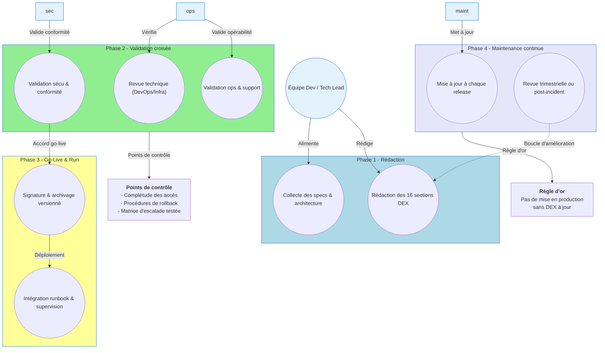
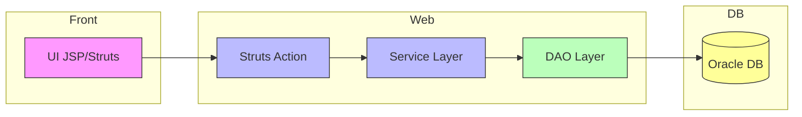

# 📄 Dossier d’Exploitation (DEX) – **CAUSALIS**  
*Document établi sur les principes de la transition **Build → Run** et des bonnes pratiques ITIL/DevOps pour l’exploitation applicative*  

---

[TOC]

---

## 1️⃣ Introduction et objectifs 🎯

**Document de référence garantissant la continuité, la maintenabilité et la sécurisation de l’exploitation de l’application CAUSALIS en production.**

| 🎯 Objectif | ✅ Description |
|------------|----------------|
| **Assurer la continuité de service** | Mise en place de procédures de surveillance, de sauvegarde et de reprise d’activité. |
| **Documenter les procédures de gestion courante** | Guides d’opérations quotidiennes, de gestion des incidents et des changements. |
| **Faciliter le support et la résolution d’incidents** | Procédures de diagnostic, contacts d’escalade et run‑books. |
| **Encadrer les responsabilités (Dev / Ops / Support)** | Rôles clairement définis, matrice d’escalade. |
| **Assurer la conformité et la maîtrise des risques** | Politique de sauvegarde, chiffrement, conformité RGPD. |
| **Accompagner la phase de transition `Build → Run`** | Validation avant go‑live, revues post‑déploiement. |

---

## 2️⃣ Contexte d’usage et périmètre 📦

| 📄 Élément | ℹ️ Détails |
|------------|------------|
| **Nom de l’application** | **CAUSALIS** |
| **Type de livrable** | Standard ✅ |
| **Nature** | Document de référence 📘 |
| **Activité** | Transition **Build → Run / Exploitation** |
| **Quand l’utiliser** | <ul><li>Avant chaque mise en production (livrable obligatoire)</li><li>Comme support de formation pour les équipes d’exploitation</li><li>Pour les audits de conformité, PRA/PCA, revues de sécurité</li></ul> |
| **Cycle de vie** | Document vivant – mise à jour à chaque évolution fonctionnelle, technique ou d’infrastructure. |
| **Environnement cible** | Production – **Centre‑serveur ministériel Paris La Défense** (clusters ESXi ACAI – Java ACAI). |
| **Stack technique** | Java 6, Struts 1.x, Castor JDO, Oracle 9, Maven 3, Tomcat 6, Apache Commons Collections, JSP + TagLib personnalisés. |
| **SLA / SLO** | *À définir* – exemple : disponibilité 99,5 % mensuelle, temps de résolution < 4 h pour incidents de niveau 1. |
| **Contacts clés** | <ul><li>**MOA SSI** : SG/DRH/D/PSPP1 – <pspp1.d.drh.sg@developpement-durable.gouv.fr></li><li>**MOE** : SG/DNUM/PNM/DPNM3 – <dpnm3.pnm.dnum.sg@developpement-durable.gouv.fr></li><li>**Chef de produit** : Christian ARBOGAST – <Christian.Arbogast@developpement-durable.gouv.fr></li></ul> |
| **Politiques de backup / sécurité** | <ul><li>Sauvegarde quotidienne incrémentale + rétention 30 jours (base Oracle)</li><li>Chiffrement des backups (AES‑256)</li><li>Accès restreint aux comptes d’administration (principle of least privilege)</li></ul> |

---

## 3️⃣ Pré‑requis et jalons ✅

- [ ] **Architecture technique validée** (schémas réseau, bases de données, serveurs d’applications)  
- [ ] **Environnement de production stabilisé** (accès réseau, DNS, certificats SSL)  
- [ ] **Politiques définies** : sauvegarde, supervision, sécurité, SLA, gestion des incidents  
- [ ] **Contacts clés identifiés** (voir section 2)  
- [ ] **Outillage prêt** : monitoring (Nagios/Prometheus), logging (Log4j), ordonnanceur (cron), gestion des secrets (Vault)  

> ⏱ **Jalon critique** : Le DEX doit être **validé et signé** avant toute mise en production. Aucun déploiement ne doit intervenir sans DEX approuvé.

---

## 4️⃣ Gouvernance et rôles 👥

| Rôle | Profil type | Responsabilité |
|------|-------------|----------------|
| **Rédacteur principal** | Tech Lead / DevOps / Référent Prod | Rédaction, structuration, intégration des spécifications techniques |
| **Validateur Exploitation** | Chef d’exploitation / Responsable support | Vérification de l’opérabilité et de la complétude |
| **Validateur Sécurité / Conformité** | RSSI / DPO / Auditeur interne | Validation des procédures de sécurité, backup, conformité RGPD |
| **Mainteneur** | Équipe projet / PO technique | Mise à jour continue à chaque release ou changement d’infra |
| **Gestionnaire d’incidents** | Responsable support N1/N2 | Coordination du traitement d’incident, escalade |
| **Gestionnaire de changements** | Change Manager | Planification, validation et suivi des changements (RFC) |

---

## 5️⃣ Structure détaillée du DEX (16 sections standards)

| N° | Section | Contenu attendu (exemples) |
|---:|----------|---------------------------|
| 1 | **Généralités** | Objet, audience, version du document, historique des versions |
| 2 | **Documents applicables et de référence** | Normes internes, chartes, architecture, politiques sécurité, référentiel de code (`pom.xml`, `assembly.xml`) |
| 3 | **Terminologie** | Glossaire (ex. : *PRA = Plan de Reprise d’Activité*, *SLA*, *WS*, *DAO*) |
| 4 | **Spécificités** | Fonctionnalités critiques (ex. : génération de statistiques nationales, export OpenOffice), SLA/SLO, contacts, matrice d’escalade |
| 5 | **Architecture** | Schémas logiques (Struts 1 → Service → DAO → Castor JDO → Oracle) et physiques (cluster ESXi, Tomcat, serveur DB). |
| 6 | **Serveurs** | Accès (SSH, console), OS (Linux RHEL 7), CPU/RAM, noms DNS (`causalis-prod-01`), adresses IP |
| 7 | **Application** | Version actuelle (`v${project.causalis.version}`), modules (`causalis-web`, `causalis-database`, `causalis-doc`), paramètres de déploiement (`context.xml`) |
| 8 | **Supervision et métrologie** | Outils (Prometheus + Grafana, alertes CPU > 80 %, latence > 2 s, taille des tables), dashboards, seuils d’alerte |
| 9 | **Sauvegarde** | Politique (daily full + hourly incrémental), localisation (datacenter Paris La Défense, stockage NAS), procédure de restauration (scripts `restore.sh`) |
| 10 | **Stockage** | Volumes DB (Oracle Datafiles 200 Go, rétention 30 jours), répertoires logs (`/var/log/causalis/`), quotas |
| 11 | **Inventaire des bases** | Oracle SID = CAUSALIS, schémas (`CAUSALIS_APP`, `CAUSALIS_LOG`), utilisateurs (`causalis_app`, `causalis_ro`), maintenance (patch 19c) |
| 12 | **Flux inter‑applicatifs** | WS → `StubWS.jar` (class‑path), protocoles HTTP/HTTPS, ports 8080/8443, authentification via certificats client |
| 13 | **Plan de production** | Ordonnancement (cron → `nightly_job.sh`), fenêtres de maintenance (Saturdays 02:00‑04:00), tâches de batch (export OpenOffice) |
| 14 | **Sécurisation des images** | Scan de vulnérabilités (OWASP Dependency‑Check), hardening du JRE (disable RMI), gestion des secrets (Vault) |
| 15 | **Opérations courantes** | Checklist quotidienne (vérif logs, état des services), gestion des erreurs connues (`EffectifComparator`), diagnostics (tail -f) |
| 16 | **Opérations récurrentes** | Rotation des certificats (90 jours), nettoyage des logs (> 30 jours), audits mensuels, revue trimestrielle du DEX |

---

## 6️⃣ Diagramme Mermaid du cycle de vie du DEX  



---

## 7️⃣ Conseils de rédaction et maintenance 🛠

| ✅ Bonne pratique | ❌ À éviter |
|-------------------|------------|
| Utiliser un dépôt **Git** versionné (branches `main`/`release`) avec historisation du DEX (`DEX_CAUSALIS.md`). | Stocker le DEX en pièce jointe email ou sur un partage non versionné. |
| Rédiger en langage clair, orienté action et procédure (ex. : `service restart causalis`). | Rédiger des descriptions vagues ou purement théoriques. |
| Inclure des captures d’écran, chemins exacts et commandes (`systemctl status causalis`). | Laisser des placeholders `[À COMPLÉTER]` en production. |
| Prévoir une **revue systématique** à chaque release ou changement d’infrastructure. | Considérer le DEX comme un document « jetable » post‑lancement. |
| Lier le DEX aux **runbooks**, tickets d’incident (ex. : `INC-12345`) et procédures PRA. | Isoler le DEX des outils de supervision et de ticketing. |

---

## 8️⃣ Adaptations contextuelles 🌐

| Contexte | Adaptation recommandée |
|----------|------------------------|
| **Applications Cloud / Serverless** | Remplacer les sections *Serveurs* par *Services managés, IAM, Config as Code, Limits/Quotas*. |
| **Secteur réglementé (Santé, Finance, Public)** | Renforcer les sections **Sécurité**, **Traçabilité**, **Archivage légal**, **RGPD** (ex. : chiffrement des données au repos, registre des traitements). |
| **Legacy / Monolithe** | Insister sur la dépendance OS, les patches, la compatibilité, les procédures de reprise manuelle. |
| **Microservices / Kubernetes** | Remplacer *Inventaire BDD/Serveurs* par *Clusters, Namespaces, Helm/Manifests, Observabilité (Prometheus/Grafana/Loki)*. |
| **CAUSALIS (legacy Struts 1)** | Conserver la structure actuelle mais prévoir une **migration progressive** vers Spring Boot ou Jakarta EE (voir section 16). |

---

## 9️⃣ Livrables et intégration 📦

| Livrable immédiat | Description |
|--------------------|-------------|
| **DEX versionné** (`DEX_CAUSALIS.md`) | Format Markdown, stocké dans le repo `causalis` (branch `main`). |
| **Checklist de validation** | Document PDF/MD signé par Dev, Ops, SSI (ex. : `DEX_checklist_CAUSALIS.xlsx`). |
| **Matrice de traçabilité** | DEX ↔ Architecture (`architecture_caussalis.png`) ↔ Runbooks (`runbook_restart.md`) ↔ Tickets (JIRA). |

### Intégration continue (CI/CD)

- **Pipeline GitLab** (`.gitlab-ci.yml`) exécute :  
  1. **Lint** du DEX (markdown‑lint).  
  2. **Vérification** des sections critiques (scripts de backup, accès SSH).  
  3. **Publication** du DEX en artefact (`dex/DEX_CAUSALIS.pdf`).  
- **Liens dans les dashboards** (Grafana) → `../docs/DEX_CAUSALIS.md`.  
- **Automation** : génération partielle du DEX via *Infrastructure as Code* (ex. : `terraform output > dex_section_servers.md`).

---

## 🔟 Glossaire / Mini‑glossaire 📚

| Acronyme | Signification |
|----------|----------------|
| **SLA** | Service Level Agreement – engagement de disponibilité / performance. |
| **SLO** | Service Level Objective – objectif mesurable du SLA. |
| **PRA** | Plan de Reprise d’Activité. |
| **PCA** | Plan de Continuité d’Activité. |
| **DAO** | Data Access Object – couche d’accès aux données. |
| **WS** | Web Service (SOAP/REST). |
| **JDO** | Java Data Objects (Castor). |
| **RGPD** | Règlement Général sur la Protection des Données. |
| **ACAI** | Application Container for Application Integration (plateforme ministérielle). |

---

## 1️⃣1️⃣ Annexes (optionnelles) 📎

### A. Diagramme d’architecture (Mermaid)



### B. Exemple de run‑book « Redémarrage du service »

```text
# Run‑book – Redémarrage du service CAUSALIS
1. Connectez‑vous en SSH sur le nœud `causalis-prod-01` (user: opsadmin)
2. Vérifiez l’état du service : 
   systemctl status causalis
3. Si le service est « failed », récupérez les logs :
   journalctl -u causalis -n 100
4. Stoppez le service : 
   systemctl stop causalis
5. Attendez 30 s, puis démarrez : 
   systemctl start causalis
6. Vérifiez le retour du status et l’absence d’erreurs.
7. Confirmez le bon fonctionnement via l’URL de santé : 
   https://causalis.e2.rie.gouv.fr/health
8. Mettez à jour le ticket d’incident et informez l’équipe de support.
```

---

## 📌 Mentions légales & métadonnées

- **Document établi sur les principes de la transition Build → Run et des bonnes pratiques ITIL/DevOps pour l’exploitation applicative**  
- **Version du DEX** : 1.0 – 2024‑04‑28  
- **Auteur** : ChatGPT (OpenAI) – adapté aux données fournies (CAUSALIS).  
- **Prochaine révision prévue** : 2025‑04‑28 (ou à chaque release majeure).  

--- 

> **↩ Retour au sommaire**  (cliquez sur le lien [TOC] en haut du document).  