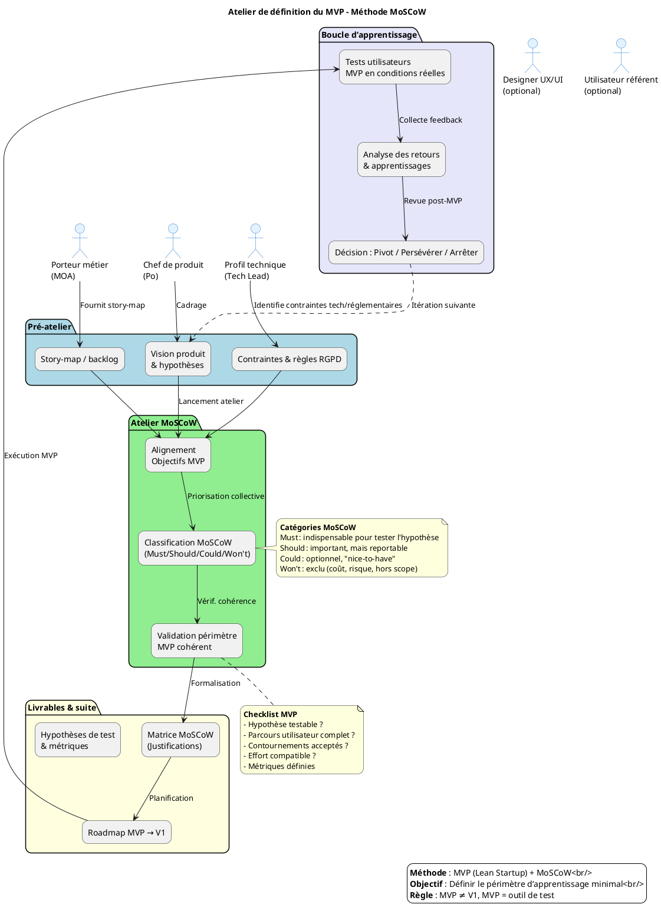

# 📦 Guide d’atelier : définition du MVP (Produit Minimum Viable) – Méthode MoSCoW  
**Produit** : **Causalis** – Application de gestion des accidents du travail  
**Domaines métier** : Ressources humaines → Santé, action et dialogue social  

> **Document établi à partir des principes du MVP (Lean Startup) et de la méthode de priorisation MoSCoW**  

---  

[TOC]

---  

## 1️⃣ Introduction et objectifs  

Définir collectivement le périmètre du **Produit Minimum Viable** (MVP) de **Causalis** afin de **tester les hypothèses produit** avec un effort maîtrisé.  

| Objectif | Pourquoi |
|----------|----------|
| 🎯 Clarifier la mission du MVP | *Quel apprentissage voulons‑nous valider ?* |
| 🔍 Identifier les fonctionnalités indispensables vs. reportables | *Must / Should / Could / Won’t* |
| 🤝 Aligner les équipes produit, métier et technique | *Un périmètre réaliste, partagé et approuvé* |
| 📏 Éviter l’effet tunnel | *Livrer vite, mesurer, itérer* |
| 🗺️ Poser les bases de la roadmap post‑MVP | *Définir les prochains incréments* |

> ⚠️ **Rappel critique** : Un MVP **n’est pas** une V1 allégée. C’est un **outil d’apprentissage** ; il peut se limiter à un **seul parcours utilisateur complet** avec des contournements (ex. saisie manuelle, données factices) acceptés.

---

## 2️⃣ Contexte d’usage et positionnement  

| Élément | Description |
|--------|-------------|
| **Type de livrable** | Standard ✅ |
| **Nature** | Atelier 🤝 |
| **Activité** | « Imaginer une solution » |
| **Quand l’utiliser** | <ul><li>Après la recherche utilisateur (entretiens, questionnaires)</li><li>Après un story‑mapping ou une cartographie fonctionnelle</li><li>Avant le lancement du développement du premier incrément</li></ul> |
| **Cas d’usage typiques** | <ul><li>Lancement d’un nouveau produit digital (Causalis v1)</li><li>Refonte d’un service existant (ex. ancien suivi d’accidents)</li><li>Test d’une innovation à fort risque (ex. automatisation du reporting RGPD)</li><li>Réduction de scope pour respecter délai/budget</li></ul> |

### 2.1 Informations produit (extraits des documents fournis)

* **Nom** : Causalis  
* **Objectif métier** : Centraliser les déclarations d’accidents du travail et de maladies professionnelles, produire des statistiques nationales et faciliter le suivi administratif.  
* **Personas prioritaires** (tirés des listes de membres) :  
  * **Managers** (ex. Adrien DESSARTRE, Anthony BOULOY…) – besoin de **reportings synthétiques** et de **suivi de conformité**.  
  * **Développeurs / équipe technique** – besoin d’**interfaces simples** pour saisir / corriger les dossiers.  
  * **Rapporteurs** (ex. Chantal CURBET, Christophe LOUVARD…) – besoin d’**extractions de données** pour les audits et le reporting règlementaire.  
* **Hypothèses à tester** (déduites) :  
  1. *H1* : Un formulaire de saisie d’un accident (ou maladie) suffit à collecter les données essentielles.  
  2. *H2* : Les statistiques agrégées (déclarations mensuelles) sont utiles pour les managers.  
  3. *H3* : L’intégration avec le SI RH (ex. SIRH) peut être différée à une version post‑MVP.  
* **Contraintes** :  
  * **Techniques** – Stack Java / Struts 1, Castor JDO, Oracle DB, Tomcat 6, hébergement ministère (Paris La Défense).  
  * **Réglementaires** – RGPD, archivage « élevé », exigences de traçabilité.  
  * **Délais** – Livraison attendue avant fin Q3 2026 (déjà en production depuis 2004, mais modernisation prévue).  

---  

## 3️⃣ Pré‑requis indispensables  

| ✔️ | Pré‑requis | Comment le vérifier / préparer |
|---|------------|--------------------------------|
| [ ] | **Vision produit formalisée** (pitch, objectifs, métriques de succès) | Synthèse d’une slide : *« Causalis : déclarer, analyser, piloter »* |
| [ ] | **Hypothèses à tester** (H1‑H3 ci‑dessus) | Tableau simple : hypothèse – métrique – seuil de validation |
| [ ] | **Story‑mapping complet** (ou au minimum les épics : Déclaration, Consultation, Reporting) | Export du story‑map existant ou création rapide avec post‑its |
| [ ] | **Personas et retours utilisateurs** (verbatims, interviews) | 1‑2 citations clés par persona |
| [ ] | **Contraintes identifiées** (tech, réglementaires, budget, délai) | Liste bullet‑point (voir §2.1) |
| [ ] | **Environnement de prototypage** (IDE, base de données de test) | Base de données « sandbox » pré‑remplie de quelques dossiers fictifs |

> 💡 *Si un pré‑requis manque, réservez 20 min en début d’atelier pour le co‑construire rapidement (ex. reformuler la vision en 1 phrase).*

---  

## 4️⃣ Parties prenantes et rôles  

| Rôle | Profil type | Responsabilité pendant l’atelier |
|------|-------------|-----------------------------------|
| **Animateur** | Chef de produit / PNM (ex. **Christian ARBOGAST**) | Cadre, facilitateur, garde‑fou « apprentissage » |
| **Profil technique** | Tech Lead / Architecte (ex. **Vincent JUSTIN**) | Évalue faisabilité, effort, dépendances techniques |
| **Porteur métier** | MOA / Responsable métier (ex. **Julien GARDIN**) | Valide la pertinence fonctionnelle & la valeur utilisateur |
| **Designer UX/UI** *(optionnel)* | Designer produit (ex. **Florian GARCIA**) | Propose alternatives légères, valide l’expérience minimale |
| **Utilisateur référent** *(optionnel)* | Manager ou Rapporteur (ex. **Adrien DESSARTRE**) | Apporte le regard « usage réel », challenge les priorités |

> ☝️ *Un même participant peut cumuler plusieurs rôles selon la disponibilité.*

---  

## 5️⃣ Logistique de l’atelier  

| Élément | Détails |
|---------|---------|
| **Durée** | 2 h 30 → 4 h (prévoir une pause à 1 h 30 si > 3 h) |
| **Matériel physique** | Tableau blanc, post‑its 4 couleurs (Must / Should / Could / Won’t), marqueurs, ruban de masquage |
| **Matériel digital** | Outil collaboratif (Miro, FigJam, Miro, Mural…) : template MoSCoW pré‑préparé, accès aux story‑maps et aux documents de contraintes |
| **Livrable de sortie** | • Périmètre MVP validé   • Matrice MoSCoW (Must/Should/Could/Won’t)   • Roadmap MVP → V1   • Hypothèses de test & métriques associées |
| **Salle** | Salle de réunion équipée d’un vidéoprojecteur (si participants distants) |
| **Pré‑lecture** | Envoyer 1 page de contexte (vision, hypothèses, contraintes) 24 h avant l’atelier |

---  

## 6️⃣ Déroulé détaillé de l’atelier  

### 🎯 Étape 1 — Introduction et alignement (15 min)  
1. **Accueil** – tour de table rapide (nom, rôle).  
2. **Rappel des objectifs** – « Qu’apprenons‑nous ? Quel(s) pari(s) testons‑nous ? »  
3. **Présentation du cadre MoSCoW** (voir tableau ci‑dessous).  

| Catégorie | Définition | Critère de décision |
|-----------|------------|---------------------|
| **Must** | Indispensable pour que le MVP soit **viable** (sans cela, le produit ne répond pas à l’hypothèse). | Si le MVP ne peut pas tester l’hypothèse → **exclure**. |
| **Should** | Important, mais le MVP peut fonctionner **sans** (reportable). | Valeur ajoutée significative, mais non bloquante pour l’apprentissage. |
| **Could** | Optionnel, « nice‑to‑have ». | Améliore l’expérience mais n’impacte pas l’apprentissage. |
| **Won’t** | Exclu du MVP (pour le moment). | Trop coûteux, hors scope réglementaire, ou non prioritaire pour le test. |

> ✅ *Exercice : reformuler la mission du MVP en 1 phrase.*  
> Exemple : « Avec ce MVP, nous voulons vérifier que la saisie d’un accident unique suffit à produire un reporting mensuel exploitable par les managers, en observant le taux de complétion ≥ 80 % ».  

### 🔍 Étape 2 — Rappel du périmètre fonctionnel (30 min)  
*Afficher le story‑map (ou la liste d’épics) :*  

| Épic | Fonctionnalité(s) associée(s) | Hypothèse testée | Contraintes |
|------|-------------------------------|------------------|-------------|
| **Déclaration d’accident** | Formulaire de saisie (DossiersForm, EditionDossierForm1‑3) | H1 – données essentielles collectées | Doit être utilisable en mode **manuel** (pas de WS) |
| **Déclaration de maladie professionnelle** | Formulaire similaire (DossiersMaladieForm…) | H1 – idem | Même contrainte |
| **Statistiques agrégées** | StatistiquesAction, StatistiquesForm | H2 – reporting mensuel utile | Respect RGPD (anonymisation) |
| **Gestion des référentiels (Grades, Services, …)** | Service, Grade, DomaineAffectation | H3 – intégration SI différée | Peut être chargé manuellement (tables de référence) |

*Nettoyer le backlog : supprimer les doublons, regrouper les items similaires.*  

### 🎚️ Étape 3 — Classification MoSCoW (60‑90 min)  

1. **Présenter chaque fonctionnalité** (ex. « Formulaire de déclaration d’accident »).  
2. **Discussion guidée** (questions clés) :  
   * « Le MVP peut‑il fonctionner sans cette fonctionnalité ? »  
   * « Quel impact sur l’apprentissage si on la retire ? »  
   * « Effort technique / délai estimé ? »  
   * « Existe‑t‑il un contournement simple (ex. saisie manuelle, données factices) ? »  
3. **Vote / Consensus** :  
   * **Option A** – **Dot Voting** (chaque participant 3 votes à répartir sur les *Must* potentiels).  
   * **Option B** – **Débat structuré** (un·e participant·e propose une catégorie, les autres valident/challengent).  
4. **Placement** – coller le post‑it dans la colonne **Must / Should / Could / Won’t**.  

> 💡 **Règle d’or** : limiter les *Must* à **3‑5 items**. Si tout est *Must*, rien n’est priorisé.

### ✅ Étape 4 — Validation du périmètre MVP (30 min)  

Utiliser la **checklist de validation** :  

- [ ] Le périmètre *Must* permet de tester **au moins une** hypothèse produit claire.  
- [ ] Un utilisateur (ex. manager) peut **compléter un parcours complet** (déclaration → visualisation du reporting).  
- [ ] Les contournements acceptés (ex. saisie manuelle de référentiels) sont **identifiés**.  
- [ ] L’effort estimé (temps / coût) est **compatible avec le délai cible** (ex. 4 semaines de sprint).  
- [ ] Les métriques de succès (ex. taux de complétion ≥ 80 %) sont **définies**.  

*Si le périmètre est trop large : re‑discuter les *Must* et identifier des reports.*  
*Si trop léger : vérifier qu’aucune hypothèse critique n’a été oubliée.*

### 🗺️ Étape 5 — Roadmap et prochaines étapes (15‑30 min)  

| Livrable | Contenu | Responsable | Délai |
|----------|---------|-------------|-------|
| **Matrice MoSCoW** | Tableur avec items & justifications | Animateur | 24 h après l’atelier |
| **Périmètre MVP** | Liste *Must* + contournements acceptés | PO (Christian ARBOGAST) | 48 h |
| **Roadmap** | MVP → V1 (Should) → Backlog (Could) | PO + Tech Lead | 1 semaine |
| **Hypothèses de test** | H1/H2/H3 + métriques (taux de complétion, satisfaction) | PO + Analyste | 2 semaines |
| **Plan de test utilisateur** | Recrutement, scénarios, collecte data | UX Designer | Sprint 1 |
| **Revue post‑MVP** | Décision : pivoter / persévérer / arrêter | Comité de pilotage | Fin Sprint 2 |

> 📸 **Action immédiate** : partager la matrice MoSCoW et la roadmap brouillon **dans les 24 h** (via Confluence/SharePoint).  

---  

## 7️⃣ Conseils de facilitation  

| Bonnes pratiques | À éviter |
|------------------|----------|
| Ancrer chaque décision dans **une hypothèse à tester** (ex. « Si on ne collecte pas le grade, on ne peut pas répondre à H2 »). | Prioriser par préférence personnelle ou « on a toujours fait comme ça ». |
| Challenger systématiquement les *Must* : *« Et si on l’enlevait ? »* | Accepter un MVP trop large par peur de décevoir. |
| Proposer des **contournements légers** (ex. saisie manuelle, jeu de données factice). | Confondre « faisable techniquement » et « nécessaire pour l’apprentissage ». |
| Faire participer activement les profils **métiers** et **utilisateurs**. | Laisser un seul profil (tech ou métier) dominer les arbitrages. |
| Documenter les **Won’t** avec leurs raisons (pour éviter les re‑demandes). | Oublier de prévoir la revue post‑MVP et les critères de succès. |

---  

## 8️⃣ Alternative : MVP par scénario utilisateur  

Quand la méthode MoSCoW ne suffit pas à réduire le scope (tendance à tout mettre dans le MVP), privilégier un **scénario complet** :  

| Critère de sélection du scénario MVP | Exemple concret |
|--------------------------------------|-----------------|
| **Parcours complet mais borné** | *Déclarer un accident et générer le tableau de bord mensuel* (sans gestion des maladies). |
| **Forte innovation à tester** | *Nouvelle interface de saisie ergonomique* (testée en isolation avant le back‑end). |
| **Simplicité de mise en œuvre** | *Utiliser des données de test en base (sandbox) plutôt que le vrai SIRH*. |
| **Valeur d’apprentissage maximale** | *Valider que les managers consultent le reporting mensuel* (mesure d’usage). |

> 💡 *Formuler le scénario MVP comme user‑story élargie* :  
> **« En tant que **Manager**, je veux **déclarer un accident** et **visualiser le reporting mensuel**, même si les référentiels (grades, services) sont remplis manuellement, afin de vérifier que le flux de bout en bout est compris et utilisé. »*  

---  

## 9️⃣ Diagramme PlantUML du processus d’atelier MoSCoW  

---  

## 🔟 Adaptations contextuelles  

| Contexte | Adaptation recommandée |
|----------|-----------------------|
| **Refonte d’un produit existant** | Partir des points de friction actuels (ex. lenteur du formulaire) pour identifier les *Must* qui résolvent les blocages majeurs. |
| **Produit fortement réglementé** | Intégrer les contraintes légales comme *Must* : **RGPD**, **archivage élevé**, **traçabilité**. Si une contrainte bloque l’hypothèse, prévoir un contournement (ex. jeu de données anonymisées). |
| **Multi‑personas utilisateurs** | Définir un MVP **par persona prioritaire** (ex. manager) ; les besoins secondaires (développeurs, rapporteurs) seront **Should/Could**. |
| **Contrainte de délai très court** | Cibler **un seul scénario utilisateur complet** (ex. déclaration d’accident → reporting) et accepter des **contournements manuels** pour les référentiels. |
| **Innovation à fort risque** | Prioriser les fonctionnalités qui valident l’hypothèse la plus incertaine (ex. automatisation du reporting) même si elles sont *Should* dans un contexte classique. |

---  

## 11️⃣ Livrables et intégration continue  

| Livrable immédiat | Contenu | Owner | Deadline |
|-------------------|---------|-------|----------|
| **Matrice MoSCoW** | Tableur : item, catégorie, justification, effort estimé | Animateur | 24 h |
| **Périmètre MVP** | Liste *Must* + contournements acceptés | PO | 48 h |
| **Roadmap MVP → V1** | Chronogramme (sprints) + priorités *Should/Could* | PO + Tech Lead | 1 semaine |
| **Hypothèses de test** | H1‑H3 + métriques (ex. taux de complétion, NPS) | PO | 2 semaines |
| **Plan de test utilisateur** | Scénario, critères d’acceptance, participants | UX Designer | Sprint 1 |
| **Template de revue post‑MVP** | Checklist décision (pivot/persévérer/arrêter) | Comité de pilotage | Fin Sprint 2 |
| **Backlog enrichi** | Stories *Should*/*Could* avec tags MoSCoW | PO | Continu |

### Livrables dérivés  

* **Backlog produit** (épics → user‑stories) avec tags `MUST / SHOULD / COULD / WONT`.  
* **Plan de test** (scripts, jeux de données factices).  
* **Template de revue** (document de décision, tableau de bord KPI).  

### Prochaines étapes suggérées  

1. **Rédaction des user‑stories MVP** (inclure critères d’acceptance).  
2. **Maquettage rapide** des écrans de déclaration (wireframes).  
3. **Estimation technique** (story points, effort) et planification des sprints.  
4. **Préparation du protocole de test utilisateur** (recrutement, consentement RGPD).  
5. **Mise en place du tableau de bord de suivi** (KPIs MVP).  

---  

## 📚 Mini‑glossaire  

| Acronyme / Terme | Définition |
|------------------|------------|
| **MVP** | Minimum Viable Product – version la plus petite d’un produit permettant de tester une ou plusieurs hypothèses. |
| **MoSCoW** | Méthode de priorisation : Must, Should, Could, Won’t. |
| **PO** | Product Owner – responsable du backlog et de la vision produit. |
| **PNM** | Product/Projet/Programme Manager (dans le contexte du ministère). |
| **RGPD** | Règlement Général sur la Protection des Données – contraintes de confidentialité et d’archivage. |
| **Story‑mapping** | Technique de visualisation du parcours utilisateur et des fonctionnalités associées. |
| **DAO** | Data Access Object – couche d’accès aux données. |
| **WS** | Web Service – appel à un service externe (ex. SIRH). |
| **Sprint** | Cycle de développement (généralement 2 semaines). |
| **Pivot** | Changement de direction du produit suite à un apprentissage. |
| **Persist‑ence** | Sauvegarde durable des données (ici via Castor JDO + Oracle). |
| **Contournement** | Solution temporaire ou manuelle permettant de réduire le scope technique. |
| **NPS** | Net Promoter Score – indicateur de satisfaction utilisateur. |

---  

## 📌 Conclusion  

Cet atelier, structuré autour du **MVP** et de la **priorisation MoSCoW**, fournit à l’équipe **Causalis** un cadre clair pour :

* **Cibler les fonctionnalités essentielles** qui permettent de valider les hypothèses clés (déclaration, reporting, conformité).  
* **Limiter le périmètre** afin de livrer rapidement, mesurer, puis itérer.  
* **Aligner les parties prenantes** (métiers, technique, design) sur un même objectif d’apprentissage.  

En suivant ce guide, vous disposerez d’une **matrice de priorisation**, d’un **périmètre MVP validé**, d’une **roadmap** et d’un **plan de test** prêts à être intégrés dans votre pipeline de développement (Maven, CI/CD, SonarQube).  

Bon atelier ! 🚀  