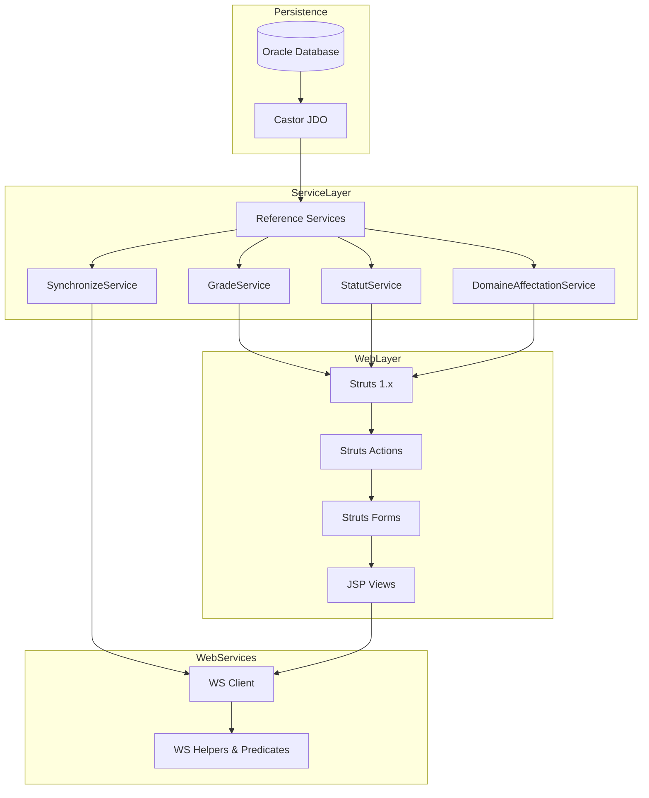

# Causalis Project Technical Documentation  

[TOC]

---

## 📖 Introduction  

Ce document regroupe l’ensemble des informations techniques relatives à **Causalis**, l’application de suivi des accidents du travail et des maladies professionnelles du ministère. Il a pour objectif :

* de fournir une vue d’ensemble de l’architecture et des composants ;  
* de détailler les modules, le processus de construction, les dépendances et les configurations ;  
* d’énumérer les équipes et les environnements de production ;  
* d’aider les développeurs, les administrateurs et les responsables de la sécurité à comprendre le fonctionnement interne du système.  

↩ [Retour au sommaire](#causalis-project-technical-documentation)

---

## 🏗️ Project Overview  

| Élément | Valeur |
|--------|--------|
| **Nom** | Causalis |
| **ID** | 469 |
| **Statut** | En production |
| **Portée géographique** | Nationale (outre‑mer inclus) |
| **Date de mise en production** | 2004 |
| **Utilisateurs actifs / mois** | 170 |
| **Version Java** | 6 (compatible Java 8) |
| **Base de données** | Oracle (JNDI `java:comp/env/jdbc/userDScausalis`) |
| **Serveur d’application** | Tomcat 6 (cluster ESXi) |
| **Plateforme d’hébergement** | Centre‑serveur ministériel Paris La Défense – ACAI (Java) |
| **Technologies principales** | Java, Castor JDO, Struts 1.x, Maven, Maven Assembly, JSP, Apache Commons Collections |
| **Gestion de la qualité** | SonarQube, GitLab CI |
| **Documentation livrable** | `causalis-doc` (ZIP contenant les manuels d’installation, DAF, bon de livraison) |

↩ [Retour au sommaire](#causalis-project-technical-documentation)

---

## 👥 Team & Stakeholders  

### Managers  

| Nom | Fonction |
|-----|----------|
| Adrien DESSARTRE | Manager |
| Anthony BOULOY | Manager |
| Anthony MEAUZOONE | Manager |
| Antoine DUBOIS | Manager |
| Christian ARBOGAST | Manager |
| Jeanne VODUNGBO | Manager |
| Julien GARDIN | Manager |
| Nicolas DEMEY | Manager |

### Developers  

| Nom | Rôle |
|-----|------|
| Ayoub CHAKHITE | Développeur |
| Cédric CHAPE | Développeur |
| Florian GARCIA | Développeur |
| Grégoire GUITTET | Développeur |
| Hervé MARCHAL | Développeur |
| Jenkins CAUSALIS | Développeur |
| Marc KANAAN | Développeur |
| Maxime Careil | Développeur |
| Pascal FORHAN | Développeur |
| Songul YESILMEN | Développeur |
| Vincent JUSTIN | Développeur |

### Reporters  

| Nom | Rôle |
|-----|------|
| Chantal CURBET | Rapporteur |
| Christophe LOUVARD | Rapporteur |
| Erwan SALMON | Rapporteur |
| Farmin YARIRAD | Rapporteur |
| Florent CAPPON | Rapporteur |
| Geoffrey ARTHAUD | Rapporteur |
| jenkins robot | Rapporteur |
| Khalid MOKHTARI | Rapporteur |
| Michel GIBELLI | Rapporteur |
| Pascal BASTIEN | Rapporteur |
| Patrick DOS SANTOS | Rapporteur |
| Redouane RABBAH | Rapporteur |
| Sarah MARAIS‑LABALLERY | Rapporteur |
| Thierry SOULABAIL | Rapporteur |

↩ [Retour au sommaire](#causalis-project-technical-documentation)

---

## 🏛️ Architecture Overview  



### Request Flow (Sequence)  

```mermaid
sequencediagram;
    participant User as Utilisateur;
    participant Browser as Navigateur;
    participant Struts as StrutsAction;
    participant Service as ServiceLayer;
    participant DAO as DAO;
    participant DB as OracleDB;
    User->>Browser: Demande page;
    Browser->>Struts: HTTP GET /index.do;
    Struts->>Service: getAllGrade()
    Service->>DAO: getAll("Grade", filter)
    DAO->>DB: SELECT * FROM GRADE WHERE UTIL=1;
    DB-->>DAO: Résultat;
    DAO-->>Service: List<Grade>
    Service-->>Struts: List<Grade>
    Struts-->>Browser: JSP rendu
```

↩ [Retour au sommaire](#causalis-project-technical-documentation)

---

## 📦 Modules & Build  

| Module | Description | Artefacts clés |
|--------|-------------|-----------------|
| **causalis-database** | Scripts de mise à jour de la base : création/alteration de colonnes, données de référence. | `assembly.xml` (ZIP `scripts`), `README.md` |
| **causalis-deployment** | Packaging de la livraison : sources, scripts, configuration. | `assembly-sources.xml` (ZIP `sources`), `assembly-zip.xml` (ZIP `binary`), `pom.xml` |
| **causalis-doc** | Documentation livrable (manuels d’installation, DAF, bons de livraison). | `assembly.xml` (ZIP `docs`) |
| **causalis-web** | Application Web (Struts 1.x) : couche présentation, logique métier, services, DAO. | `pom.xml`, `src/main/java/...`, `src/main/webapp/...` |
| **root** | POM parent (management des dépendances, plugins). | `pom.xml`, `sonar-project.properties`, `.gitlab-ci.yml` |

### Maven Build  

```bash
mvn clean install            # compile, test, package
mvn assembly:single          # génère les ZIP définis dans les assembly descriptors
```

Le `MANIFEST.MF` du WAR indique :  

```
Class-Path: StubWS.jar
```  

Ce JAR contient les stubs des Web‑services appelés par le module `causalis-web`.

↩ [Retour au sommaire](#causalis-project-technical-documentation)

---

## 🗄️ Persistence Layer (Castor JDO)  

* **Configuration** – `src/main/resources/database.xml`  

```xml
<!DOCTYPE databases PUBLIC "-//EXOLAB/Castor JDO Configuration DTD Version 1.0//EN" "http://castor.exolab.org/jdo-conf.dtd">
<database name="causalis" engine="oracle">
    <jndi name="java:comp/env/jdbc/userDScausalis" />
    <mapping href="mapping.xml" />
</database>
```

* **Mapping** – `mapping.xml` (non affiché) décrit la correspondance entre les tables Oracle et les beans Java (`BeanObject` et ses sous‑classes).  

* **DAO générique** – `GenericDao<T>` fournit les méthodes CRUD de base ; les DAO spécialisés (`GradeDao`, `DossierAccidentDAO`, …) étendent ce DAO.  

* **Gestion des exceptions** – `TechnicalException` encapsule la cause technique ; les services interceptent cette exception pour remonter les erreurs métier.  

↩ [Retour au sommaire](#causalis-project-technical-documentation)

---

## 🛠️ Service Layer  

Toutes les classes de service héritent de `ReferenceService<T>` (classe abstraite non affichée) qui expose un DAO générique.  

| Service | Domaine | Méthodes principales |
|--------|--------|----------------------|
| `DomaineAffectationService` | Domaine d’affectation | `getAllDomaineAffectation()` |
| `GradeService` | Grades | `getAllGrade()` |
| `StatutService` | Statuts | `getAllStatut()`, `getStatutsMap()` |
| `SynchronizeService` (interface) | Synchronisation grade ↔ transcodage | `int synchronize()` |
| `TachePrescriteService` | Tâches prescrites | `getAllTachePrescrite()` |
| `UtilisateurService` | Utilisateurs | (stub) |

Les services appliquent systématiquement le filtre **`util = 1`** (enregistrement actif) via un `Map<String,Object>` transmis au DAO.  

↩ [Retour au sommaire](#causalis-project-technical-documentation)

---

## 🌐 Web Layer (Struts 1.x)  

### Architecture  

* **Struts Config** – `WEB-INF/struts-config.xml` (définit les *action‑mappings*).  
* **Actions** – classes du package `i2.application.causalis.view.*Action` (ex. `IndexAction`, `DossiersAction`, `StatistiquesAction`).  
* **Forms** – classes du package `i2.application.causalis.form.*` (ex. `GenericForm`, `ListeTableauEffectifs`).  
* **JSP Views** – pages situées sous `src/main/webapp/` (ex. `index.jsp`, `effectifs.jsp`, fragments `.jspf`).  
* **TagLib** – `marcmus.tld` expose le tag `putIntoSession`; `StrutsOptionTag` enrichit le tag Struts `OptionTag` en remplaçant les guillemets doubles par des simples (usage JavaScript).  

### Exemple de flux d’une requête  

1. L’utilisateur accède à `index.do`.  
2. Struts invoque `IndexAction`.  
3. `IndexAction` appelle le(s) service(s) requis (ex. `GradeService`).  
4. Le service interroge le DAO → Castor JDO → Oracle.  
5. Le résultat est stocké dans le `request`/`session`.  
6. Struts forward vers `index.jsp`.  
7. Le JSP rend la page, incluant les fragments (`haut.jspf`, `menu.jspf`, …).  

### Sécurité & SSO  

* La page `reauth.jsp` invalide la session puis appelle le composant SSO `Cerbere.logoff`.  
* Le fichier `.gitignore` du module Web exclut le log `causalis.log`.  

↩ [Retour au sommaire](#causalis-project-technical-documentation)

---

## 📡 Web‑Services Integration  

* **Clients** – `ws.client.WSClientEffectif`, `WSClientGrade`, `WSClientService`.  
* **Converters** – `EffectifDetailleConverter`, `SaveEffectifsConverter`, `ServiceConverter`, `TranscodageGradeConverter`.  
* **Helpers** – `TrancheAgeHelper` (détermine la tranche d’âge).  
* **Filters / Predicates** – `EffectifGradePredicate`, `ServicePredicate`, `TranscodageGradePredicate` (déterminent la présence d’un grade en base avant insertion).  
* **Strategy** – `WSDictionary` (dictionnaire de mapping entre les objets du WS et les entités internes).  

Ces composants sont utilisés par les implémentations de `SynchronizeService` pour synchroniser les référentiels métier avec les services externes.

↩ [Retour au sommaire](#causalis-project-technical-documentation)

---

## ⚙️ Configuration & Resources  

| Ressource | Description |
|-----------|-------------|
| `src/main/resources/ApplicationResources.properties` | Fichier de messages (i18n) utilisé par Struts. |
| `src/main/resources/cerbere-bouchon.xml` | Configuration du mock SSO Cerbere (environnement de test). |
| `src/main/resources/project.properties` | Paramètre de pagination (`pagination.max=30`). |
| `src/main/resources/version.properties` | Version et date de compilation injectées par Maven. |
| `src/main/webapp/WEB-INF/web.xml` | Déclaration du servlet Struts et des filtres. |
| `src/main/webapp/WEB-INF/validation.xml` | (vide) – placeholder pour la validation Struts. |
| `src/main/webapp/WEB-INF/validator-rules.xml` | Règles de validation custom (ex. `DateValidator`). |
| `src/main/webapp/WEB-INF/tlds/*.tld` | Descripteurs de tags personnalisés (`marcmus.tld`, `struts‑*.tld`). |

↩ [Retour au sommaire](#causalis-project-technical-documentation)

---

## 🚀 Deployment & Hosting  

| Environnement | Centre‑serveur | Plateforme | Type |
|----------------|----------------|------------|------|
| Production | Paris La Défense (Ministériel) | ACAI – Java ACAI (Clusters ESXi) | Production |
| Production (Backup) | Paris La Défense | Tomcat 6 | Production |

Le WAR généré est déployé sur le serveur Tomcat 6 du cluster. Le `MANIFEST.MF` ajoute le JAR `StubWS.jar` au classpath pour les appels aux WS.  

Le **pipeline CI/CD** (défini dans `.gitlab-ci.yml`) compile, exécute les tests unitaires, lance l’analyse SonarQube (`sonar-project.properties`) puis publie les artefacts (`assembly‑*.zip`).  

↩ [Retour au sommaire](#causalis-project-technical-documentation)

---

## 📊 Quality Assurance & CI  

| Outil | Usage |
|-------|-------|
| **GitLab CI** | Compilation, tests, génération d’artefacts, déploiement. |
| **SonarQube** | Analyse de la dette technique, couverture de tests, règles de qualité. |
| **JUnit** (implémenté dans `src/test/java/...`) | Tests unitaires des DAO, services, outils WS. |
| **Maven Surefire** | Exécution des tests pendant la phase `test`. |

Le fichier `sonar-project.properties` contient :  

```text
sonar.projectKey=CAUSALIS
sonar.qualitygate.wait=true
```  

Ce paramétrage bloque la promotion tant que le **Quality Gate** n’est pas validé.

↩ [Retour au sommaire](#causalis-project-technical-documentation)

---

## 🔐 Security & Compliance  

| Aspect | Détails |
|--------|----------|
| **MOA SSI** | SG/DRH/D/PSPP1 (Bureau de la prévention, santé au travail, service social). |
| **RGPD** | Les données traitées (accidents, maladies professionnelles) sont classées **critique** ; un plan d’archivage est prévu. |
| **Authentification** | SSO via le composant Cerbere (`Cerbere.logoff` dans `reauth.jsp`). |
| **Accès** | Accès restreint aux environnements de production (firewall du centre‑serveur). |
| **Audit** | Historique des changements conservé dans le système de gestion de version GitLab. |
| **Vulnérabilités connues** | Utilisation de Struts 1.x (non maintenu) – recommandation de migration vers Struts 2 ou Spring MVC. |
| **Plan d’action** | Étude de migration des composants techniques (see “Evolution & Roadmap”). |

↩ [Retour au sommaire](#causalis-project-technical-documentation)

---

## 📈 Evolution & Roadmap  

| Axe | Action prévue |
|-----|----------------|
| **Technologique** | Migration de Struts 1.x vers un framework moderne (Spring MVC ou Struts 2). |
| **Persist‑ence** | Remplacement de Castor JDO par JPA/Hibernate pour profiter du support communautaire. |
| **Web‑services** | Passage des stubs SOAP à des clients REST (OpenAPI) afin de réduire la complexité. |
| **Sécurité** | Renforcement du SSO (OAuth2/OpenID Connect) et mise en place d’un audit d’accès détaillé. |
| **Qualité** | Augmentation de la couverture de tests unitaires à > 80 % et introduction de tests d’intégration avec TestContainers. |
| **Documentation** | Génération automatisée de la Javadoc et du diagramme d’architecture (PlantUML) dans le pipeline CI. |
| **Archivage** | Finalisation du plan d’archivage RGPD et mise en place du processus de purge automatisée. |

↩ [Retour au sommaire](#causalis-project-technical-documentation)

---

## 📚 Appendices  

### A. File Tree (filtered)  

```
causalis/
├─ causalis-database/
│  ├─ script/
│  │  ├─ 20190121-causalis-1.5.sql
│  │  ├─ 20190403-causalis-1.5.1.sql
│  │  ├─ 20200116-causalis-1.6.sql
│  │  ├─ script-2012-03-15.sql
│  │  └─ script-2012-04-17.sql
│  ├─ assembly.xml
│  ├─ README.md
│  └─ pom.xml
├─ causalis-deployment/
│  ├─ conf/
│  │  └─ causalis.xml
│  ├─ assembly-sources.xml
│  ├─ assembly-zip.xml
│  ├─ README.md
│  └─ pom.xml
├─ causalis-doc/
│  ├─ assembly.xml
│  └─ pom.xml
├─ causalis-web/
│  ├─ .gitignore
│  ├─ pom.xml
│  ├─ src/
│  │  ├─ main/
│  │  │  ├─ java/
│  │  │  │  └─ i2/application/causalis/
│  │  │  │     ├─ comparator/EffectifComparator.java
│  │  │  │     ├─ dao/… (GradeDao, GenericDao, …)
│  │  │  │     ├─ exception/… (CommonException, DaoException, …)
│  │  │  │     ├─ form/… (GenericForm, ListeTableauEffectifs, …)
│  │  │  │     ├─ metiers/… (Grade, Service, TranscodageGrade, …)
│  │  │  │     ├─ service/… (GradeService, StatutService, …)
│  │  │  │     ├─ taglib/StrutsOptionTag.java
│  │  │  │     ├─ tool/DBTools.java
│  │  │  │     ├─ view/ActionWarning.java
│  │  │  │     └─ ws/… (client, converter, filter, strategy)
│  │  │  ├─ resources/
│  │  │  │  ├─ ApplicationResources.properties
│  │  │  │  ├─ database.xml
│  │  │  │  ├─ project.properties
│  │  │  │  └─ version.properties
│  │  │  └─ webapp/
│  │  │     ├─ META-INF/MANIFEST.MF
│  │  │     ├─ WEB-INF/
│  │  │     │  ├─ tlds/*.tld
│  │  │     │  ├─ web.xml
│  │  │     │  └─ validation.xml
│  │  │     ├─ *.jsp, *.jspf (index.jsp, home.jsp, reauth.jsp, …)
│  │  │     └─ styles/*.css
│  │  └─ test/
│  │     └─ java/… (tests unitaires)
├─ .gitlab-ci.yml
├─ README.txt
├─ ci_settings.xml
├─ livraison-continue-kpi.yml
├─ pom.xml
└─ sonar-project.properties
```

### B. Key Classes (excerpt)  

| Classe | Package | Responsabilité |
|--------|---------|----------------|
| `EffectifComparator` | `comparator` | Compare deux objets `Effectif` (années, grade, service, sexe). |
| `Constantes` | racine | Interface contenant la JNDI du datasource. |
| `GradeDao` | `dao` | DAO dédié aux entités `Grade`. |
| `CommonException` | `exception` | Super‑classe des exceptions métier (RuntimeException). |
| `TechnicalException` | `exception` | Wrapper d’exception technique (checked). |
| `GenericForm` | `form` | Classe abstraite pour les formulaires Struts. |
| `ListeTableauEffectifs` | `form` | `ArrayList` auto‑expansible d’`ItemTableauEffectifs`. |
| `Grade` | `metiers` | Bean métier représentant un grade (hérite de `TablesReferences`). |
| `TranscodageGrade` | `metiers` | Mapping grade ↔ grade Rehucit (code, macro). |
| `StatutService` | `service` | Fournit la liste des statuts et un dictionnaire `code → libellé`. |
| `SynchronizeService` | `service` | Interface de synchronisation avec les WS externes. |
| `StrutsOptionTag` | `taglib` | Tag JSP qui remplace les guillemets doubles par des simples (compatibilité JS). |
| `DBTools` | `tool` | Convertit `QueryResults` Castor en `List`. |
| `TrancheAgeHelper` | `ws.converter` | Calcule la tranche d’âge à partir de l’année de naissance. |
| `TranscodageGradePredicate` | `ws.filter` | Predicate qui teste la présence d’un grade dans la base avant insertion. |
| `WSClientEffectif` | `ws.client` | Stub client SOAP pour le service `Effectif`. |

↩ [Retour au sommaire](#causalis-project-technical-documentation)

---

## 📌 Conclusion  

Causalis est une application d’entreprise mature, construite autour d’un stack **Java 6**, **Castor JDO**, **Struts 1.x** et **Maven**. Son architecture en couches (DAO ↔ Service ↔ Struts) facilite la maintenance fonctionnelle, mais la dépendance à des technologies obsolètes (Castor, Struts 1) représente un risque de support à moyen terme.  

Les équipes de développement, de gestion de projet et de reporting sont clairement identifiées, et le projet bénéficie d’un processus CI/CD complet (GitLab CI + SonarQube). La feuille de route prévoit notamment :

* migration vers des frameworks modernes,  
* refonte de la persistance avec JPA,  
* renforcement de la sécurité (SSO moderne, audits), et  
* amélioration de la couverture des tests.  

Ces évolutions permettront de garantir la pérennité, la conformité RGPD et la capacité d’évolution du système dans les années à venir.  

↩ [Retour au sommaire](#causalis-project-technical-documentation)