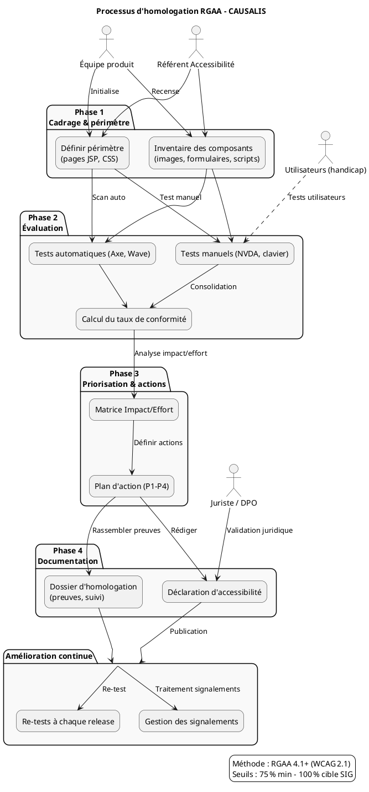

# 📄 Guide d’atelier d’homologation RGAA – **CAUSALIS**
> *Document établi à partir des principes du RGAA 4.1+, déclinaison française des WCAG 2.1/2.2, conformément à la loi du 11 février 2005*  

---

[TOC]

---  

## 1️⃣ Introduction et objectifs
**Objet** – Préparer et piloter l’homologation RGAA du produit numérique **CAUSALIS** (application de gestion des accidents du travail et des maladies professionnelles).  

**Méthodologie** – Atelier basé sur le **RGAA 4.1+** (déclinaison française des WCAG 2.1/2.2).  

### Objectifs opérationnels
| # | Objectif |
|---|----------|
| 🎯 | Comprendre les obligations légales (loi 2005, décret 2019, arrêté 2021, directive EU 2016/2102) et les seuils de conformité (≥ 75 % minimum, 100 % cible SIG). |
| 🔎 | Identifier les **13 thèmes RGAA** applicables à CAUSALIS (images, couleurs, contrastes, navigation, formulaires, scripts, etc.). |
| 📊 | Évaluer l’état de conformité actuel (tests manuels, outils automatiques, retours utilisateurs). |
| 📅 | Construire un **plan d’action** (priorisation, estimation d’effort, assignation). |
| 📄 | Préparer la **déclaration d’accessibilité** et le **dossier d’homologation** (preuves, suivi, amélioration continue). |

---  

## 2️⃣ Contexte d’usage
| Élément | Valeur |
|---------|--------|
| **Nom du produit** | **CAUSALIS** |
| **Type** | Application web (Struts 1.x, JSP) – *site interne ministériel* |
| **Public cible** | Gestionnaires, agents du ministère, ergonomes, utilisateurs en situation de handicap (visuel, moteur, auditif, cognitif). |
| **Environnement technique** | Java 6, Struts 1.x, JSP, Castor JDO (Oracle 9), Tomcat 6, CSS 3, HTML 5, JavaScript. |
| **Hébergement** | Centre‑serveur ministériel Paris La Défense (Production, plateforme ACAI – Java ACAI, clusters ESXi). |
| **Utilisateurs actifs** | ~170 utilisateurs/mois (1 gestionnaire par service + administrateurs). |
| **Cadre réglementaire** | - Loi n°2005‑102 du 11 février 2005 <br> - Décret n°2019‑768 du 24 juillet 2019 <br> - Arrêté du 29 avril 2021 (RGAA 4.1) <br> - Directive (UE) 2016/2102 |
| **Seuils de conformité** | **Minimum légal** : 75 % de critères conformes <br> **Cible SIG** : 100 % + amélioration continue |
| **Moment d’utilisation de l’atelier** | - Avant chaque **release majeure** <br> - Après un **audit de sécurité** ou une **mise à jour de design** <br> - En phase de **refonte technique** (migration hors Struts). |

---  

## 3️⃣ Pré‑requis
- [ ] **Périmètre produit** défini : toutes les pages JSP sous `src/main/webapp/*.jsp` (ex. `index.jsp`, `dossiers.jsp`, `editionDossierPage1.jsp`, `statistiques.jsp`, `aide.html`, etc.) et les fichiers CSS (`styles/*.css`).  
- [ ] **Personas utilisateurs** : <br> • Gestionnaire (vision normale) <br> • Agent avec déficience visuelle (daltonien, basse vision) <br> • Utilisateur moteur (navigation clavier) <br> • Utilisateur auditif (audio uniquement).  
- [ ] **Stack technique** : Java 6, Struts 1.x, Castor JDO, Oracle 9, Tomcat 6, CSS 3, HTML 5, JS.  
- [ ] **État des lieux accessibilité** : aucun audit complet disponible ; prévoir un **scan rapide** (Axe DevTools, Wave, Lighthouse) pour identifier les blocages majeurs.  
- [ ] **Référentiel DSFR** (Design System Français) – à vérifier si le projet l’utilise (non présent dans le dépôt, à envisager).  

> 💡 *Si aucun audit préalable n’existe, commencez l’atelier par un “quick scan” afin de disposer d’une première cartographie des problèmes.*  

---  

## 4️⃣ Parties prenantes et rôles
| Rôle | Profil type | Responsabilité pendant l’atelier |
|------|-------------|-----------------------------------|
| **Animateur / Référent accessibilité** | Chef de projet / UX / Expert RGAA | Facilite, explique les critères, arbitrage des priorités, validation du plan d’action. |
| **Développeur front** | Java/Struts, HTML/CSS/JS | Évalue la faisabilité technique, estime les efforts, propose les correctifs (ex. ajout d’attributs `alt`, gestion du focus). |
| **Designer UI/UX** | Graphiste/ergonome | Propose des alternatives accessibles (contraste, taille de police, navigation). |
| **Responsable juridique / conformité** | RSSI / DPO / MOA SSI | Vérifie le cadre réglementaire, valide la déclaration d’accessibilité, assure la traçabilité des exemptions. |
| **Représentant utilisateurs handicap** *(optionnel)* | Association, agent en situation de handicap | Teste les scénarios réels, fournit un retour d’usage qualitatif. |
| **Product Owner / MOE** | Chef de produit (ex. Christian ARBOGAST) | Priorise les correctifs dans la roadmap, débloque les ressources. |

> ☝️ *Un même collaborateur peut cumuler plusieurs rôles selon la taille de l’équipe.*  

---  

## 5️⃣ Logistique
- **Durée totale** : 3 h 30 min (inclure 15 min de pause).  
- **Matériel**  
  - Tableau blanc & post‑its (4 couleurs : Conforme / Non‑conforme / À vérifier / Hors périmètre).  
  - Ordinateurs avec accès au serveur de test (Tomcat 6).  
  - Outils de test : Axe DevTools, Wave, Lighthouse, NVDA/VoiceOver, **Color Contrast Analyzer**.  
  - Accès aux sources (`causalis-web/src/main/webapp/**/*.jsp`, `styles/*.css`).  
- **Livrables de sortie**  
  1. **Matrice de conformité RGAA** (thème → critère → statut).  
  2. **Plan d’action priorisé** (responsable, échéance, critère de validation).  
  3. **Déclaration d’accessibilité (brouillon)**.  

---  

## 6️⃣ Déroulé détaillé de l’atelier  

### 🎯 Étape 1 – Cadrage réglementaire (30 min)
1. Rappel du cadre légal (loi 2005, décret 2019, arrêté 2021, directive EU).  
2. Présentation des **4 principes WCAG** appliqués au RGAA :  
   - **Perceptible** – ex. texte alternatif, contraste.  
   - **Utilisable** – navigation clavier, focus visible.  
   - **Compréhensible** – libellés clairs, messages d’erreur.  
   - **Robuste** – compatibilité avec les agents utilisateurs.  
3. Définition du **périmètre d’audit** : toutes les JSP et feuilles de style, ainsi que les composants dynamiques (`ws/*`).  

> ✅ *Exemple concret : image du logo sans `alt` dans `haut.jspf` → impact réel sur un lecteur d’écran.*  

### 🔍 Étape 2 – Identification des critères applicables (45 min)
| Thème RGAA | Exemple dans CAUSALIS | Critères critiques à vérifier |
|------------|----------------------|--------------------------------|
| **Images** | `haut.jspf` (logo), `aide.html` (illustrations) | 1.1 – Chaque image porteuse d’information possède une alternative textuelle. |
| **Couleurs & contraste** | CSS `nav_fixe.css`, `nav_msie.css` | 1.4 – Ratio de contraste ≥ 4,5 :1 pour le texte normal. |
| **Navigation** | Menus (`menu.jspf`), liens “Aller au contenu” | 9.1 – Navigation clavier fonctionnelle ; 9.2 – Lien “Aller au contenu” visible au focus. |
| **Formulaires** | `DossiersForm.java`, `EffectifsForm.java` | 8.1 – Chaque champ possède un label explicite ; 8.3 – Indication de champ obligatoire. |
| **Scripts** | `ws/*` (appel WS), `TrancheAgeHelper.java` (JS côté serveur) | 7.1 – Scripts ne bloquent pas l’accès au contenu ; 7.2 – Gestion des erreurs JavaScript. |
| **Multimédia** | Aucun lecteur vidéo/Audio présent (exclu). | — |
| **Tables** | `statistiques.jsp` (tableaux de données) | 5.1 – Titres de tableau, résumé. |
| **Structure de l’information** | `index.jsp`, `home.jsp` | 12.1 – Utilisation correcte des titres (`<h1>`, `<h2>`). |
| **Liens** | `menu.jspf`, `footer.jspf` | 6.1 – Texte de lien explicite hors contexte. |
| **Obligations spéciales** | Déclaration d’accessibilité (à créer) | 13.1 – Publication de la déclaration. |

> 📌 **Méthode** – Parcourir chaque thème, cocher **Conforme / Non‑conforme / À vérifier / Hors périmètre** sur le tableau du mur.  

### 📊 Étape 3 – Évaluation et scoring (45 min)
1. **Tests rapides** pour chaque critère :  
   - **Manuels** : navigation clavier (`Tab`, `Shift+Tab`), lecture écran (`NVDA`), vérification du contraste (`Color Contrast Analyzer`).  
   - **Automatiques** : Axe DevTools, Wave.  
2. **Calcul du taux de conformité** :  

```text
Taux = (Nb critères conformes) / (Nb critères applicables) × 100
```

   - *Exemple* : 120 critères applicables, 85 conformes → **71 %** (en dessous du minimum).  
3. **Identifier les écarts critiques** : tout critère bloquant la navigation ou l’accès à l’information (ex. `alt` manquant, focus invisible).  

> 💡 *Ne pas viser la perfection immédiate : l’objectif est d’obtenir une photographie réaliste pour planifier les corrections.*  

### 🎚️ Étape 4 – Priorisation et plan d’action (45 min)
| Impact | Faible effort | Fort effort |
|--------|----------------|------------|
| **Fort** | 🔴 **Priorité 1** – *Quick wins* (ex. ajouter `alt=""` aux images décoratives, ajouter `:focus-visible` CSS). | 🟡 **Priorité 2** – *Investissements* (ex. refactoriser le menu Struts pour rendre les sous‑menus clavier‑accessibles). |
| **Faible** | 🟢 **Priorité 3** – *Améliorations* (ex. reformuler libellés de champs, ajouter résumé de tableau). | ⚪ **Priorité 4** – *Backlog* (ex. migration de Struts 1.x vers un framework plus moderne). |

**Plan d’action type**  

| Priorité | Action | Responsable | Échéance | Critère de validation |
|----------|--------|-------------|-----------|-----------------------|
| P1 | Ajouter `alt` aux images du header (`haut.jspf`). | Dév Front (ex. **Florian GARCIA**) | Sprint +1 | Axe → 0 error. |
| P1 | Implémenter focus visible sur les liens du menu (`menu.jspf`). | Dév Front (ex. **Maxime Careil**) | Sprint +1 | Test clavier → focus visible. |
| P2 | Refactoriser le composant `StrutsOptionTag` pour garantir l’échappement correct des caractères. | Dév Back (ex. **Ayoub CHAKHITE**) | Sprint +2 | Test de lecture écran → aucune duplication de caractères. |
| P2 | Mettre en place le contraste ≥ 4,5 :1 sur les feuilles `nav_fixe.css`, `nav_msie.css`. | Dév Front + Designer (ex. **Grégoire GUITTET**) | Sprint +2 | Color Contrast Analyzer → OK. |
| P3 | Ajouter les attributs `aria‑label` aux boutons d’action (ex. “Enregistrer”, “Imprimer”). | Dév Front | Sprint +3 | NVDA lit le libellé. |
| P4 | Étude de migration vers **Spring MVC** (dépréciation de Struts 1). | MOE (ex. **Christian ARBOGAST**) | Q3 2026 | Feuille de route validée. |

### 🏁 Étape 5 – Documentation et homologation (30 min)
1. **Déclaration d’accessibilité** (modèle officiel) :  
   - **État de conformité** : *71 % (en cours d’amélioration)*.  
   - **Critères non‑conformes** : liste détaillée (ex. images sans `alt`, contraste insuffisant, navigation clavier du menu).  
   - **Moyens de contact** : `pspp1.d.drh.sg@developpement-durable.gouv.fr`.  
   - **Voies de recours** : Défenseur des droits.  
2. **Dossier d’homologation** :  
   - **Matrice de conformité** (voir annexe).  
   - **Preuves de test** : captures d’écran Axe, enregistrements de session NVDA, rapports Lighthouse.  
   - **Plan d’amélioration continue** (roadmap, indicateurs de suivi).  
3. **Processus de suivi** :  
   - Re‑test à chaque **release majeure** (ex. v 2.0, v 3.0).  
   - Circuit de traitement des signalements utilisateurs (ticket JIRA → équipe accessibilité).  

> 📸 *Action immédiate* : partager le brouillon de déclaration avec le service juridique (MOA SSI) pour validation.  

---  

## 7️⃣ Conseils de facilitation
| Bonnes pratiques | À éviter |
|-----------------|----------|
| Ancrer chaque critère dans un **scenario utilisateur réel** (ex. « Un agent veut accéder à la page d’édition d’un dossier via le clavier »). | Se perdre dans le jargon RGAA sans expliciter les impacts concrets. |
| Utiliser des **exemples concrets du produit** (logo sans `alt`, menu non‑focusable). | Confondre “conforme aux tests automatiques” et “accessible”. |
| Impliquer les **développeurs** dès l’évaluation (ils connaissent les contraintes du code). | Reporter systématiquement les corrections “complexes”. |
| Documenter les décisions d’**exemption** (ex. contenu tiers non maîtrisé). | Oublier de prévoir la mise à jour continue (post‑release). |
| Valider chaque correction avec **tests manuels + outils**. | Se contenter d’un seul type de test (ex. uniquement Axe). |

---  

## 8️⃣ Exemple de matrice de conformité (simplifiée)

| Thème | Critère RGAA | Statut | Observation | Action | Priorité |
|-------|--------------|--------|--------------|--------|----------|
| **Images** | 1.1 – Alternative textuelle | ❌ Non‑conforme | Logo du header `` sans `alt`. | Ajouter `alt="CAUSALIS – logo du ministère"` | 🔴 P1 |
| **Couleurs** | 1.4 – Contraste | ⚠️ À vérifier | CSS `nav_fixe.css` : texte gris `#777777` sur fond blanc `#FFFFFF` → ratio 2,9 :1. | Revoir les couleurs (ex. `#333333`). | 🟡 P2 |
| **Navigation** | 9.1 – Navigation clavier | ❌ Non‑conforme | Menu déroulant Struts non accessible au clavier. | Refactoriser le composant menu (`menu.jspf`). | 🟡 P2 |
| **Formulaires** | 8.1 – Libellé de champ | ✅ Conforme | Tous les champs ont un `<label for="...">`. | — | — |
| **Scripts** | 7.1 – Scripts bloquants | ✅ Conforme | Aucun script ne bloque le rendu. | — | — |
| **Tables** | 5.1 – Titres de tableau | ⚠️ À vérifier | Tableaux de statistiques sans `<caption>`. | Ajouter `<caption>` descriptif. | 🟢 P3 |
| **Liens** | 6.1 – Texte de lien explicite | ✅ Conforme | Tous les liens ont un texte clair. | — | — |
| **Obligations spéciales** | 13.1 – Déclaration d’accessibilité | ❌ Non‑conforme | Pas de page de déclaration. | Rédiger la page `declaration.html`. | 🔴 P1 |

---  

## 9️⃣ Diagramme PlantUML du processus d’homologation RGAA



---  

## 10️⃣ Adaptations contextuelles

| Contexte | Adaptation recommandée |
|----------|------------------------|
| **Nouveau produit** | Intégrer l’accessibilité dès la conception (DSFR, design tokens, composants ARIA). |
| **Refonte / Legacy** | Commencer par un **audit complet** (scripts, CSS, JSP) → prioriser les **bloquants** (images, focus, contraste). |
| **Application mobile** | Adapter les critères RGAA aux gestes tactiles, tailles de cible, VoiceOver/TalkBack. |
| **Contenu dynamique** | Vérifier les **scripts** (`ws/*`) : mise à jour ARIA live regions, gestion des erreurs. |
| **Délai court** | Cibler les **quick wins** (alt, focus, contraste) pour atteindre le **minimum légal 75 %** rapidement. |

---  

## 11️⃣ Livrables et suite du projet

| Livrable | Description | Responsable | Échéance |
|----------|-------------|--------------|----------|
| **Matrice de conformité RGAA** (détaillée) | Tableaux par thème/critère avec statut, observation, action, priorité. | Référent Accessibilité | Sprint +1 |
| **Plan d’action priorisé** | Tableau actions (P1‑P4) avec responsable, effort, date cible. | Chef de projet | Sprint +1 |
| **Déclaration d’accessibilité** (version publique) | Texte officiel conforme au modèle RGAA, publié sur le site. | Juriste / DPO | Sprint +2 |
| **Dossier d’homologation** | Preuves (captures, logs, rapports), roadmap d’amélioration. | MOE | Sprint +2 |
| **Processus de suivi** | Documentation du cycle de re‑test, formulaire de signalement. | Responsable Qualité | Sprint +3 |
| **Roadmap d’amélioration** | Plan à moyen terme (migration Struts → Spring, adoption DSFR). | PO / MOE | Q3 2026 |

### Prochaines étapes suggérées
1. **Validation juridique** de la déclaration d’accessibilité.  
2. **Intégration des actions P1** dans le prochain sprint de développement.  
3. **Formation** de l’équipe aux bonnes pratiques d’accessibilité (atelier de 2 h).  
4. **Mise en place** d’un job CI (Axe, Lighthouse) à chaque build Maven.  
5. **Suivi** des indicateurs : taux de conformité, nombre de tickets d’accessibilité résolus.  

---  

## 12️⃣ Mini‑glossaire RGAA / WCAG

| Terme | Définition |
|-------|------------|
| **Alternative textuelle** (`alt`) | Texte décrivant le contenu d’une image pour les lecteurs d’écran. |
| **Contraste** | Rapport de différence de luminance entre texte et arrière‑plan (≥ 4,5 :1 pour texte normal). |
| **Focus visible** | Indicateur visuel (bordure, couleur) qui montre quel élément possède le focus clavier. |
| **ARIA** | Attributs (`aria-label`, `role`, `aria-live`) qui enrichissent le HTML pour les AT. |
| **NVDA / VoiceOver** | Lecteurs d’écran open‑source (Windows) et natif (macOS). |
| **WCAG 2.1** | Web Content Accessibility Guidelines – version internationale, base du RGAA. |
| **Déclaration d’accessibilité** | Document public qui indique le taux de conformité et les éventuelles exemptions. |
| **Exemption** | Dérogation justifiée (ex. contenu tiers non maîtrisé) qui doit être documentée. |
| **Impact / Effort** | Matrice de priorisation : impact sur l’expérience utilisateur vs. effort de mise en œuvre. |
| **SIG** | Schéma d’Information Géographique – ici utilisé pour désigner le **Standard d’Information Gouvernementale** (objectif 100 % conforme). |

---  

## 13️⃣ Annexes  

### 13.1 Matrice de conformité complète (extrait)
*(Insérer le tableau complet en annexe du dépôt, format CSV ou Excel – ici un aperçu)*  

| Thème | Critère | Statut | Observation | Action | Priorité |
|-------|---------|--------|-------------|--------|----------|
| Images | 1.1 – Alternative textuelle | ❌ | Logo sans `alt` | Ajouter `alt="CAUSALIS – logo du ministère"` | 🔴 P1 |
| Couleurs | 1.4 – Contraste | ⚠️ | Texte gris `#777777` sur blanc | Modifier couleur → `#333333` | 🟡 P2 |
| Navigation | 9.1 – Navigation clavier | ❌ | Menu déroulant non accessible | Refactoriser menu (`<ul>` + `tabindex`) | 🟡 P2 |
| Formulaires | 8.1 – Libellé de champ | ✅ | Tous les champs ont `<label>` correct | — | — |
| Scripts | 7.1 – Scripts bloquants | ✅ | Aucun script n’empêche le rendu | — | — |
| Tables | 5.1 – Titres de tableau | ⚠️ | Absence de `<caption>` | Ajouter `<caption>` descriptif | 🟢 P3 |
| Liens | 6.1 – Texte explicite | ✅ | Tous les liens sont clairs | — | — |
| Obligations spéciales | 13.1 – Publication déclaration | ❌ | Aucun fichier `declaration.html` | Créer page de déclaration | 🔴 P1 |

### 13.2 Checklist d’audit rapide (à imprimer)

- [ ] Toutes les images ont un attribut `alt` (ou `alt=""` si décorative).  
- [ ] Ratio de contraste ≥ 4,5 :1 (outil Color Contrast Analyzer).  
- [ ] Le focus clavier est visible sur tous les éléments interactifs.  
- [ ] Les formulaires possèdent un `<label>` associé (`for` / `id`).  
- [ ] Les tableaux ont un `<caption>` et des en‑têtes (`<th>`).  
- [ ] Les liens ont un texte explicite hors contexte.  
- [ ] Aucun script ne bloque le rendu ou la navigation (tests avec désactivation JS).  
- [ ] La page de déclaration d’accessibilité existe et suit le modèle officiel.  

---  

## 14️⃣ Contact & suivi

| Rôle | Nom | Email |
|------|-----|-------|
| **Chef de produit / MOE** | **Christian ARBOGAST** | Christian.Arbogast@developpement-durable.gouv.fr |
| **Référent Accessibilité** | **[Nom à définir]** | [email] |
| **Juriste / DPO** | **[Nom]** | [email] |
| **Développeur Front** | **Florian GARCIA** | florian.garcia@developpement-durable.gouv.fr |
| **Architecte Technique** | **Ayoub CHAKHITE** | ayoub.chakhite@developpement-durable.gouv.fr |

---  

*Fin du guide.*  