# 📄 Guide d'atelier d’homologation RGAA 4.1+ pour **CAUSALIS**

> **Document établi à partir des principes du RGAA 4.1+, déclinaison française des WCAG 2.1/2.2, conformément à la loi du 11 février 2005**  

---

## 📚 Table des matières
[TOC]

---

## 1️⃣ Introduction & objectifs

| Élément | Valeur |
|---|---|
| **Produit** | **CAUSALIS** – Application de gestion des accidents du travail et des maladies professionnelles (Java / Struts 1.x) |
| **Type** | **Application web** (WAR) hébergée sur les serveurs ministériels (Paris La Défense) |
| **Public cible** | Agents du ministère du Développement Durable, gestionnaires RH, services de prévention, administrateurs nationaux |
| **Contexte réglementaire** | Loi n°2005‑102 du 11 février 2005 – accessibilité numérique, Décret n°2019‑768, Arrêté du 29 avril 2021 (RGAA 4.1), Directive (UE) 2016/2102 |
| **Maturité actuelle** | Application en production depuis 2004, aucune démarche d’accessibilité formalisée (code legacy Struts 1.x, JSP, CSS). |

### Objectifs opérationnels (5)

1. **Comprendre** les obligations légales (seuil 75 % minimum, 100 % cible SIG) et les 4 principes WCAG (Perceptible, Utilisable, Compréhensible, Robuste).  
2. **Identifier** les critères RGAA applicables à CAUSALIS (ex. images, tables, formulaires, scripts, navigation, contraste, focus).  
3. **Évaluer** l’état de conformité actuel (audit rapide + tests automatisés) et **prioriser** les corrections.  
4. **Construire** un plan d’action d’amélioration continue (road‑map, responsabilités, échéances).  
5. **Préparer** la documentation d’homologation : déclaration d’accessibilité, dossier d’audit, suivi des signalements.  

---

## 2️⃣ Contexte d’usage

| Élément | Détails |
|---|---|
| **Livrable** | Standard ✅ – **Atelier** 🤝 – activité « Homologuer et référencer le produit ». |
| **Cadre réglementaire** | - Loi 2005 – égalité des droits <br> - Décret 2019‑768 <br> - Arrêté 2021 (RGAA 4.1) <br> - Directive UE 2016/2102 |
| **Moment d’utilisation** | - **En amont** : intégrer l’accessibilité dans le backlog de la V2.0 <br> - **Pendant le dev** : vérifier chaque composant (JSP, CSS, scripts) <br> - **Avant prod** : audit complet & rédaction de la déclaration <br> - **En exploitation** : gestion des signalements, re‑tests à chaque release |
| **Seuils de conformité** | - **Minimum légal** : **75 %** des critères conformes <br> - **Cible SIG** : **100 %** + amélioration continue (plan d’action, suivi annuel) |
| **Contraintes spécifiques** | - Stack legacy : Java 6, Struts 1.x, JSP, CSS (3 stylesheets) <br> - Déploiement sur serveur ESXi (ACAI) – aucun impact sur l’infrastructure d’accessibilité <br> - Utilisation de `StubWS.jar` et de taglibs personnalisés (ex. `StrutsOptionTag`). |

---

## 3️⃣ Pré‑requis

- [ ] **Périmètre défini** – URLs et fonctionnalités exposées (ex. `/index.do`, pages JSP d’accueil, formulaires d’édition, tableaux de statistiques).  
- [ ] **Personas** – agents RH, gestionnaires de service, agents en situation de handicap (visuel, moteur, cognitif).  
- [ ] **Inventaire technique** – Java 6, Struts 1.x, Castor JDO, Oracle DB, JSP, CSS (`nav_fixe.css`, `nav_gecko.css`, `nav_msie.css`).  
- [ ] **État des lieux** – dernier audit (s’il existe) ou “scan rapide” avec Axe, Lighthouse, Wave.  
- [ ] **Référentiel DSFR** (si utilisé) – version du Design System France République.  

> 💡 *Conseil* : si aucun audit préalable n’est disponible, lancer un **scan rapide** (ex. Axe DevTools) sur les pages clés : `home.jsp`, `dossiers.jsp`, `editionDossierPage1.jsp`, `statistiques.jsp`.

---

## 4️⃣ Parties prenantes & rôles

| Rôle | Profil type | Responsabilité pendant l’atelier |
|---|---|---|
| **Animateur / Référent accessibilité** | Chef de projet, UX / Expert RGAA | Facilite, explique les critères, arbitre les priorités, valide la déclaration. |
| **Développeur front‑end** | Java/Struts, JSP, CSS | Évalue la faisabilité technique, estime l’effort, propose les correctifs (ex. ajout d’attributs `alt`, gestion du focus). |
| **Développeur back‑end** | Java 6, Castor JDO | Vérifie que les données (ex. libellés d’images, libellés de champs) sont correctement exposées côté serveur. |
| **Designer UI/UX** | UI Designer, ergonomie | Propose des alternatives accessibles (contraste, tailles de police, navigation clavier). |
| **Juriste / Conformité** | RSSI, DPO, Responsable légal | Valide le cadre juridique, approuve la **déclaration d’accessibilité** et le **plan de suivi**. |
| **Représentant utilisateurs (handicap)** | Association handicap, agent en situation de handicap | Teste les scénarios réels (NVDA/VoiceOver, clavier seul), signale les blocages. |
| **Responsable exploitation** | Ops / Support | Détermine le processus de traitement des signalements et la fréquence des re‑tests. |

> ⚠️ *Une même personne peut cumuler plusieurs rôles selon la taille de l’équipe.*

---

## 5️⃣ Logistique

| Élément | Détails |
|---|---|
| **Durée** | 3 h 30 min (prévoir une pause de 15 min à mi‑parcours). |
| **Matériel physique** | Tableau blanc, post‑its 4 couleurs (✅ Conforme, ❌ Non‑conforme, ⚠️ À vérifier, 🚫 Hors‑périmètre), marqueurs. |
| **Matériel digital** | PC avec accès au serveur de pré‑production, navigateur Chrome + Axe DevTools, outil de capture d’écran, accès aux dépôts Git (Maven). |
| **Livrable de sortie** | - **Matrice de conformité RGAA** (tableau détaillé) <br> - **Plan d’action priorisé** (Impact/Effort) <br> - **Brouillon de déclaration d’accessibilité** (texte + tableau des exemptions). |
| **Environnement de test** | Instance de pré‑production (URL `https://causalis-preprod.e2.rie.gouv.fr`) avec base de données de test. |

---

## 6️⃣ Déroulé détaillé de l’atelier

### 🎯 Étape 1 – Cadrage réglementaire (30 min)

1. Présenter le **cadre légal** (loi 2005, décret 2019‑768, RGAA 4.1, directive EU 2016/2102).  
2. Rappeler les **4 principes WCAG** appliqués au RGAA :  
   - **Perceptible** – ex. images avec `alt` ; contrastes suffisants.  
   - **Utilisable** – navigation clavier, focus visible.  
   - **Compréhensible** – libellés clairs, messages d’erreur.  
   - **Robuste** – HTML valide, ARIA correctes.  
3. Définir le **périmètre d’audit** : toutes les JSP du répertoire `src/main/webapp` (≈ 30 pages), les composants CSS, les tags personnalisés (`StrutsOptionTag`, `PutIntoSessionTag`).  

> ✅ *Exemple concret* : l’image du logo dans `haut.jspf` ne possède pas d’attribut `alt`.  

---

### 🔍 Étape 2 – Identification des critères applicables (45 min)

| Thème RGAA | Exemples de critères à vérifier dans CAUSALIS |
|---|---|
| **1 – Images** | 1.1 Alternative texte ; 1.2 Image porteuse d’information ; 1.3 Image décorative (`alt=""`). |
| **2 – Cadres** | 2.1 Titre du cadre ; 2.2 Ordre de tabulation. |
| **3 – Couleurs** | 3.1 Contraste texte ; 3.2 Pas de couleur comme seul moyen d’information. |
| **4 – Multimédia** | 4.1 Sous‑titres ; 4.2 Transcription audio (non applicable). |
| **5 – Tableaux** | 5.1 Résumé (`<caption>`) ; 5.2 En‑têtes de colonnes (`<th>`). |
| **6 – Liens** | 6.1 Texte de lien explicite ; 6.2 Pas de lien “cliquez ici”. |
| **7 – Scripts** | 7.1 Gestion du focus ; 7.2 Pas de blocage du clavier. |
| **8 – Obligations spéciales** | 8.1 Langue du document (`lang` sur `<html>`). |
| **9 – Navigation** | 9.1 Navigation clavier (menu, “Aller au contenu”). |
| **10 – Présentation** | 10.1 Structure logique (titres `<h1>`‑`<h6>`). |
| **11 – Formulaires** | 11.1 Labels associés ; 11.2 Messages d’erreur accessibles. |
| **12 – Structuration** | 12.1 ARIALandmark (`role="navigation"`). |
| **13 – Information & consultation** | 13.1 Mise à jour dynamique ARIA (`aria-live`). |

**Méthode**  
- Parcourir chaque page JSP.  
- Cocher **Conforme / Non‑conforme / À vérifier / Hors‑périmètre**.  
- Utiliser les post‑its de couleur pour visualiser rapidement les statuts.  

---

### 📊 Étape 3 – Évaluation & scoring (45 min)

1. **Test rapide** sur chaque critère :  
   - **Manuel** : navigation clavier, lecteur d’écran (NVDA/VoiceOver).  
   - **Automatique** : axe‑core (extension Chrome), Lighthouse (audit d’accessibilité).  
2. **Calcul du taux de conformité** :

```text
Taux = (Nb critères conformes) / (Nb critères applicables) × 100
```

3. **Identifier les écarts critiques** : critères bloquants (ex. absence de texte alternatif, focus invisible, contraste < 4.5 : 1).  

> 💡 *Ne pas viser la perfection dès le premier sprint : l’objectif est d’obtenir **≥ 75 %** avant la mise en production.*

---

### 🎚️ Étape 4 – Priorisation & plan d’action (45 min)

#### Matrice Impact / Effort

| Impact | Faible effort | Fort effort |
|---|---|---|
| **Fort** | 🔴 **Priorité 1** – *Quick wins* (ex. ajout `alt` sur les logos, `title` sur les liens) | 🟠 **Priorité 2** – *Investissements* (refonte du menu, gestion du focus dans les formulaires) |
| **Faible** | 🟢 **Priorité 3** – *Améliorations* (contraste sur les styles `nav_*`) | ⚪ **Priorité 4** – *Backlog* (refonte complète du système de tags Struts, migration vers un framework plus moderne). |

**Exemple de tableau d’action (extrait)**  

| Critère | Statut | Action | Responsable | Priorité | Échéance |
|---|---|---|---|---|---|
| 1.1 – `alt` sur le logo (`haut.jspf`) | ❌ Non‑conforme | Ajouter `alt="CAUSALIS – Accueil"` | Dev front | 🔴 P1 | Sprint 45 |
| 3.1 – Contraste du menu (`nav_fixe.css`) | ⚠️ À vérifier | Augmenter contraste à 4.5 : 1 (ex. `#003366` → `#002244`) | Designer UI | 🟠 P2 | Sprint 46 |
| 9.1 – Lien “Aller au contenu” invisible | ❌ Non‑conforme | Ajouter style `:focus-visible { outline: 2px solid #ff0; }` | Dev front | 🔴 P1 | Sprint 45 |
| 11.1 – Labels des champs `EditionDossierForm*` | ✅ Conforme | – | – | – | – |
| 7.1 – Gestion du focus sur les menus dynamiques | ❌ Non‑conforme | Implémenter script `focusFirstItem()` et ARIA `aria-haspopup` | Dev back | 🟠 P2 | Sprint 47 |

**Intégration dans la roadmap**  
- **Sprint 45** : Quick‑wins (images, focus, contraste mineur).  
- **Sprint 46‑47** : Refactorisation des menus et des scripts.  
- **Sprint 48+** : Migration progressive vers un framework plus moderne (Spring MVC, Thymeleaf) – hors scope immédiat mais planifiée.  

---

### 🏁 Étape 5 – Documentation & homologation (30 min)

1. **Rédiger la déclaration d’accessibilité** (modèle officiel) :  

```markdown
# Déclaration d’accessibilité de CAUSALIS
## Conformité
- **Taux de conformité** : **78 %** (48 / 62 critères RGAA 4.1) – **au‑delà du seuil légal de 75 %**.
- **Non‑conformités bloquantes** :  
  - Absence d’alternative texte sur le logo (critère 1.1) – corrigé (déploiement prévu le 12/05/2026).  
  - Gestion du focus sur le menu principal (critère 9.1) – corrigé (déploiement prévu le 12/05/2026).  
- **Exemptions** : aucune (aucune impossibilité technique justifiée).  

## Moyens de contact
- **Signalement** : formulaire `/contact/accessibilite.do` (ou adresse mail `accessibilite@causalis.e2.rie.gouv.fr`).  
- **Délais de réponse** : sous 15 jours ouvrés.  

## Voies de recours
- Défenseur des droits – https://www.defenseurdesdroits.fr  

## Date de mise à jour
- **30/04/2026** – version 1.2 de la déclaration.  
```

2. **Assembler le dossier d’homologation** :  
   - Matrice de conformité détaillée (thème → critère → statut).  
   - Captures d’écran des tests (axe, NVDA).  
   - Plan d’action (tableau d’impact/effort).  
   - Procédure de suivi (réunions mensuelles, re‑tests à chaque release majeure).  

3. **Valider** avec le **juriste** et le **RSSI** avant publication.  

> 📸 *Action immédiate* : partager le brouillon de la déclaration avec le service juridique pour validation avant le **15/05/2026**.

---

## 7️⃣ Conseils de facilitation

| Bonnes pratiques | À éviter |
|---|---|
| Ancrer chaque critère dans un **scenario utilisateur réel** (ex. « un agent veut consulter les statistiques d’accidents »). | S’enliser dans le jargon technique du RGAA sans le traduire en actions concrètes. |
| Utiliser **exemples concrets** du code (ex. `` → ajouter `alt`). | Se contenter d’un score automatisé : les outils ne détectent pas les problèmes de logique ou de libellés. |
| Impliquer **les profils techniques** dès l’évaluation (dev front, dev back). | Reporter systématiquement les corrections “complexes” à un futur indéfini. |
| Documenter chaque **exemption** (ex. impossibilité technique) avec justification. | Oublier de prévoir le **processus de mise à jour** de la déclaration après chaque release. |
| Valider les corrections **manuellement** (NVDA/VoiceOver + clavier). | Se fier uniquement aux scores automatiques (Axe, Lighthouse). |

---

## 8️⃣ Exemple de matrice de conformité (simplifiée)

### Thème 1 – Images

| Critère RGAA | Statut | Observation | Action | Priorité |
|---|---|---|---|---|
| 1.1 – Alternative texte | ❌ Non‑conforme | Logo dans `haut.jspf` sans `alt`. | Ajouter `alt="CAUSALIS – logo du ministère"` | 🔴 P1 |
| 1.2 – Image porteuse d’info | ✅ Conforme | Diagramme de statistiques (`statistiques.jsp`) possède `alt`. | – | – |
| 1.3 – Image décorative | ✅ Conforme | Images décoratives marquées `alt=""`. | – | – |

### Thème 9 – Navigation

| Critère | Statut | Observation | Action | Priorité |
|---|---|---|---|---|
| 9.1 – Navigation clavier | ❌ Non‑conforme | Menu principal (`nav_fixe.css`) ne montre pas le focus. | Ajouter style `:focus-visible { outline: 3px solid #ff0; }` | 🔴 P1 |
| 9.2 – Liens “Aller au contenu” | ✅ Conforme | Présent et visible au focus. | – | – |

*(Les autres thèmes sont détaillés de la même façon dans le livrable final.)*

---

## 9️⃣ Diagramme Mermaid du processus d’homologation RGAA

```mermaid
graph TB;
    %% Acteurs;
    team["👥 Équipe produit"]
    expert["🎓 Référent accessibilité"]
    audit["⚖️ Juridique / Conformité"]
    users["👤 Utilisateurs (handicap)"]

    %% Phase 1 – Cadrage;
    subgraph phase1["Phase 1 – Cadrage & identification"]
        step1["📋 Définir périmètre & critères"]
        step2["📦 Inventaire des composants (JSP, CSS, tags)"]
    end;
    %% Phase 2 – Évaluation;
    subgraph phase2["Phase 2 – Évaluation & scoring"]
        step3["🧪 Tests manuels + outils automatiques"]
        step4["📊 Calcul du taux de conformité"]
    end;
    %% Phase 3 – Priorisation;
    subgraph phase3["Phase 3 – Priorisation & correction"]
        step5["⚠️ Matrice Impact/Effort"]
        step6["📝 Plan d’action priorisé (P1‑P4)"]
    end;
    %% Phase 4 – Documentation;
    subgraph phase4["Phase 4 – Documentation & homologation"]
        step7["📘 Déclaration d’accessibilité"]
        step8["📜 Dossier d’homologation + suivi"]
    end;
    %% Phase 5 – Amélioration continue;
    subgraph loop["Amélioration continue"]
        monitor["🔄 Re‑tests à chaque release"]
        feedback["💬 Traitement des signalements"]
    end;
    %% Flux principaux;
    team -->|Initie| step1;
    expert -->|Guide l’inventaire| step2;
    team -->|Exécute les tests| step3;
    expert -->|Valide le scoring| step4;
    team -->|Priorise avec expert| step5;
    team -->|Planifie dans la roadmap| step6;
    audit -->|Valide la déclaration| step7;
    audit -->|Homologue le produit| step8;
    %% Boucles de feedback;
    users -.->|Signalements| feedback;
    feedback -->|Alimente le backlog| step6;
    monitor -.->|Re‑évaluation périodique| step3;
    %% Styles;
    classDef acteur fill:#E3F2FD,stroke:#1976D2,stroke-width_2px;
    classDef phase fill:#ADD8E6,stroke:#333,stroke-width_2px;
    classDef loop fill:#E6E6FA,stroke:#333,stroke-width_2px;
    class team,expert,audit,users acteur;
    class step1,step2 phase1;
    class step3,step4 phase2;
    class step5,step6 phase3;
    class step7,step8 phase4;
    class monitor,feedback loop
```



---

## 🔟 Adaptations contextuelles

| Contexte | Adaptation recommandée |
|---|---|
| **Nouveau produit** | Intégrer l’accessibilité dès la conception : choisir un design system (ex. DSFR) compatible, créer des composants accessibles (menus, tables). |
| **Refonte / Legacy** | Démarrer par un **audit rapide** des pages les plus fréquentées (accueil, formulaires d’édition, tableaux de statistiques). Prioriser les quick‑wins. |
| **Application mobile** | Adapter les critères 7 (scripts) et 3 (contraste) aux gestes, vérifier la prise en charge par les lecteurs d’écran mobiles. |
| **Contenu dynamique (WS)** | S’assurer que les réponses JSON/WS sont correctement injectées dans le DOM avec les attributs ARIA (`aria-live`). |
| **Délai court** | Cibler les **critères bloquants** (images, focus, contraste) pour atteindre rapidement le seuil de 75 %. |

---

## 1️⃣1️⃣ Livrables & suite du projet

| Livrable | Contenu |
|---|---|
| **Matrice de conformité RGAA** | Tableaux thème → critère → statut, captures d’écran, logs Axe. |
| **Plan d’action priorisé** | Tableau Impact/Effort, responsabilités, dates, sprints. |
| **Déclaration d’accessibilité (brouillon)** | Texte officiel, taux, exemptions, contacts. |
| **Dossier d’homologation** | Matrice, plan d’action, preuves de tests, procédure de suivi. |
| **Processus de suivi** | - Re‑tests à chaque release majeure (Sprint Review). <br> - Traitement des signalements via ticketing (Jira). <br> - Mise à jour annuelle de la déclaration. |
| **Formation** | Session de 2 h pour les devs front‑end (alt, ARIA, focus). |
| **Intégration CI** | Ajout d’un job Axe/Lighthouse dans le pipeline GitLab (`.gitlab-ci.yml`). |

**Prochaines étapes suggérées**  

1. **Validation juridique** de la déclaration (délai ≤ 2 semaines).  
2. **Intégration des actions P1** dans le sprint 45 (déploiement prévu 12/05/2026).  
3. **Mise en place du job CI** d’audit d’accessibilité (ex. `npm run axe-ci`).  
4. **Plan de formation** pour l’équipe de développement (début juin 2026).  
5. **Réunion de suivi** (mensuelle) pour actualiser le tableau d’avancement.

---

## 📌 Mini‑glossaire RGAA / WCAG

| Terme | Définition |
|---|---|
| **Alternative textuelle** | Texte (`alt`) décrivant le contenu d’une image pour les lecteurs d’écran. |
| **ARIA** | Attributs HTML (`role`, `aria‑label`, `aria‑live`) qui améliorent l’accessibilité des composants dynamiques. |
| **Focus visible** | Indicateur visuel (bordure, couleur) qui montre quel élément reçoit le focus clavier. |
| **Contraste** | Rapport de différence de luminance entre texte et arrière‑plan ≥ 4.5 : 1 (AA). |
| **Perceptible** | L’information doit être présentable de façon perceptible (ex. texte, audio, vidéo). |
| **Robuste** | Le code doit être interprétable par une large variété d’agents utilisateurs (navigateurs, AT). |
| **Quick win** | Correction à faible effort qui améliore immédiatement le score d’accessibilité. |
| **Exemption** | Cas où un critère ne peut être respecté pour des raisons techniques ou d’ordre juridique, justifié dans la déclaration. |

---

## 🎉 Conclusion

Cet atelier fournit à l’équipe **CAUSALIS** un cadre méthodologique complet pour :

* **Diagnostiquer** les points de non‑conformité actuels,  
* **Prioriser** les actions selon impact / effort,  
* **Planifier** les correctifs dans la roadmap produit,  
* **Documenter** la conformité et **publier** la déclaration d’accessibilité conformément au RGAA 4.1+.

En suivant ce guide, CAUSALIS pourra rapidement atteindre le **seuil légal de 75 %**, puis viser la **cible SIG 100 %** tout en assurant une amélioration continue et une gouvernance claire des signalements d’accessibilité.  

**Bonne séance !**  


--- 

*Ce guide a été rédigé de façon générique ; il ne nécessite aucune donnée externe supplémentaire. Toutes les sections sont auto‑portées et immédiatement exploitables dans VS Code, Obsidian ou tout autre éditeur Markdown.*  