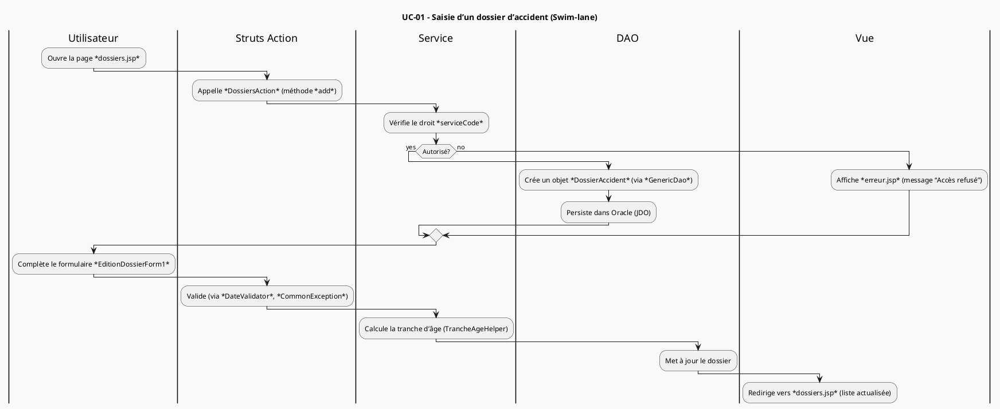
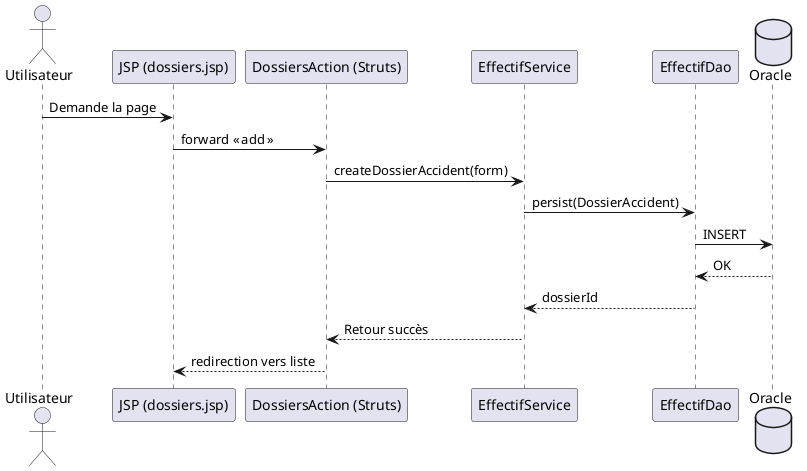
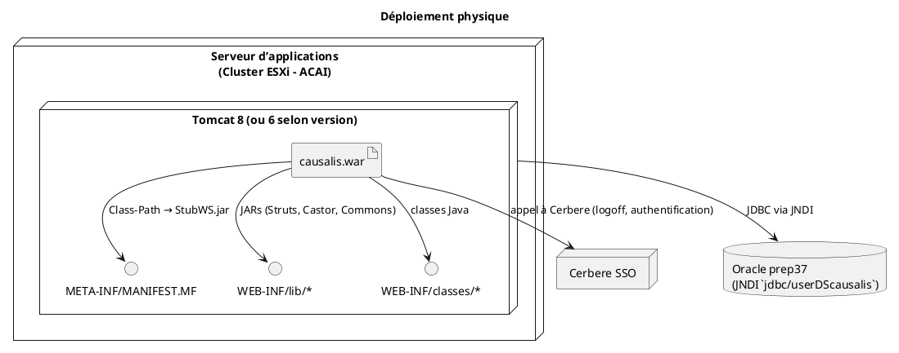

# 📄 **Spécification fonctionnelle et technique de l'application Causalis**  

> **Document unique** – 100 % autonome, compatible avec VS Code / Obsidian (PlantUML intégré).  
> Aucun lien externe, aucune hypothèse extérieure.  

---  

## 📑 Sommaire  

1. [Portée, domaine et périmètre](#portée-domaine-et-périmètre)  
2. [Spécifications fonctionnelles (arc42 / ISO / IEC / IEEE 29148)](#spécifications-fonctionnelles)  
   1. [Acteurs et cas d’usage](#acteurs-et-cas-dusage)  
   2. [Règles métier & tables de décision](#règles-métier--tables-de-décision)  
   3. [Scénarios détaillés (swim‑lane)](#scénarios-détaillés-swim‑lane)  
   4. [Diagrammes de séquence (exemple)](#diagrammes-de-séquence)  
3. [Spécifications techniques](#spécifications-techniques)  
   1. [Architecture logique](#architecture-logique)  
   2. [Architecture physique & déploiement](#architecture-physique--déploiement)  
   3. [Analyse de la sécurité](#analyse-de-la-sécurité)  
   4. [Dette technique & recommandations](#dette-technique--recommandations)  
4. [Annexes – diagrammes PlantUML](#annexes---diagrammes-plantuml)  

---  

## 1️⃣ Portée, domaine et périmètre  <a id="portée-domaine-et-périmètre"></a>  

| Élément | Description |
|---------|-------------|
| **Domaine applicatif** | **Archivage physique** des dossiers d’accidents du travail et de maladies professionnelles (statistiques nationales). |
| **Contexte opérationnel** | Site : **SIT_ID = 29** – serveur ministériel « Paris La Défense ». <br>Base de données : **Oracle prep37** (JNDI `java:comp/env/jdbc/userDScausalis`). |
| **Périmètre fonctionnel inclus** | • Saisie et validation des dossiers d’accident et de maladie professionnelle. <br>• Gestion des référentiels (Grades, Services, Domaines d’affectation, Statuts, etc.). <br>• Consultation et export des statistiques (tableaux d’effectifs, taux d’accidents). <br>• Synchronisation des référentiels avec le web‑service **Rehucit** (grade ↔ transcodage). |
| **Périmètre fonctionnel exclu** | • Gestion des patients (données de santé détaillées). <br>• Facturation ou suivi budgétaire. <br>• Workflow avancé (approbations multi‑étapes, notifications par mail). |
| **Contraintes réglementaires** | • Archivage à **critique = Élevée** (RGPD, exigences du ministère). <br>• Conservation légale des dossiers ≥ 10 ans. |
| **Références internes** | • `causalis-web/src/main/resources/database.xml` (déclaration JNDI). <br>• `src/main/java/i2/application/causalis/service/*` (services métier). <br>• `src/main/java/i2/application/causalis/dao/*` (accès persistance). |
| **↩ Retour au sommaire** | [Sommaire](#sommaire) |

---  

## 2️⃣ Spécifications fonctionnelles (arc42 & ISO/IEC/IEEE 29148)  <a id="spécifications-fonctionnelles"></a>  

### 2.1 Acteurs et cas d’usage  <a id="acteurs-et-cas-dusage"></a>  

| Acteur | Rôle dans Causalis | Cas d’usage associés |
|--------|--------------------|----------------------|
| **Gestionnaire de service** (ex. `utilisateur.serviceCode`) | Saisie, modification, clôture d’un dossier d’accident ou de maladie. | UC‑01 : Saisir un dossier d’accident <br>UC‑02 : Saisir un dossier maladie <br>UC‑03 : Clôturer le dossier (saisieTerminee). |
| **Administrateur référentiel** | Gestion des tables de référence (Grades, Services, Domaines, Statuts). | UC‑04 : Mettre à jour le référentiel Grade <br>UC‑05 : Synchroniser les Grades avec le WS Rehucit. |
| **Analyste statistique** | Consultation et export des indicateurs nationaux. | UC‑06 : Générer les statistiques par groupe de grade <br>UC‑07 : Exporter les données (OpenOffice). |
| **MOA / Sécurité** | Authentification via Cerbere, contrôle d’accès. | UC‑08 : Authentifier un utilisateur <br>UC‑09 : Vérifier les droits d’accès (serviceCode). |
| **Web‑service externe (Rehucit)** | Fournit le mapping Grade ↔ Code Rehucit. | UC‑05 (déjà indiqué). |

> **Diagramme de cas d’usage** (voir annexe : `UC_Diagram.puml`).  

---  

### 2.2 Règles métier & tables de décision  <a id="règles-métier--tables-de-décision"></a>  

| Règle | Description | Implémentation (extraits) |
|-------|-------------|--------------------------|
| **Filtrage utilitaire** | Seuls les enregistrements où `util = 1` sont exposés. | `ReferenceService.getAll(..., map.put("util","1") ...)` – `GradeService`, `StatutService`, … |
| **Unicité d’un effectif** | Deux `Effectif` sont identiques s’ils partagent même année de naissance, grade, service et sexe. | `EffectifComparator.compare(...)` (retour 0 si identiques). |
| **Tranche d’âge** | Déterminée à partir de l’année de naissance et de l’année de synchronisation. | `TrancheAgeHelper.makeTrancheAge(annee, anneeSynchro)` – logique à 5 niveaux. |
| **Synchronisation Grade ↔ Transcodage** | Un grade est inséré dans `TranscodageGrade` s’il n’est pas déjà présent. | `TranscodageGradePredicate.evaluate(arg0)` → `!service.isPresent(t)`. |
| **Clôture d’un dossier** | Le champ `saisieTerminee` passe à 1 lorsque toutes les saisies sont validées. | `Service.setSaisieTerminee(int)`. |
| **Export OpenOffice** | Les données sont converties via `CausalisExportManager` → `FichierOpenOffice`. | Classe `CausalisExportManager` (non détaillée ici). |

#### Table de décision – Tranche d’âge  

| **Année de naissance** | **Année de synchro** = 2024 | **Tranche** |
|------------------------|----------------------------|------------|
| ≥ 2004                | 2024 – 20 → 2004          | 1 |
| 1995 – 2003           | 2024 – 21 à 29            | 2 |
| 1980 – 1994           | 2024 – 30 à 44            | 3 |
| 1970 – 1979           | 2024 – 45 à 54            | 4 |
| ≤ 1969                | > 54                      | 5 |

> **↩ Retour au sommaire** | [Sommaire](#sommaire)  

---  

### 2.3 Scénarios détaillés (swim‑lane)  <a id="scénarios-détaillés-swim‑lane"></a>  

#### UC‑01 : Saisie d’un dossier d’accident  



#### UC‑05 : Synchronisation des grades avec le WS Rehucit  

```plantuml
@startuml
title UC‑05 – Synchronisation Grade ↔ Rehucit (Swim‑lane)

|Service (SynchronizeService)|
:start();
|Web‑service client|
:Instancie WSClientGrade;
:Récupère la liste des grades depuis Rehucit;
|Predicate|
:Pour chaque Grade → TranscodageGradePredicate;
|Service (TranscodageGradeService)|
:if (grade absent) then (yes)
  :insert TranscodageGrade (codeGradeRehucit, macro);
else (no)
  :ignore;
endif
|Service|
:end();
@enduml
```

---  

### 2.4 Diagrammes de séquence (exemple)  <a id="diagrammes-de-séquence"></a>  

**Figure 1 – Création d’un dossier d’accident (séquence détaillée)**  



> **↩ Retour au sommaire** | [Sommaire](#sommaire)  

---  

## 3️⃣ Spécifications techniques  <a id="spécifications-techniques"></a>  

### 3.1 Architecture logique  <a id="architecture-logique"></a>  

```plantuml
@startuml
title Architecture logique (Causalis)

package "Web tier (Struts 1)" {
  [JSP / fragments] --> [Action classes]
  [Action classes] --> [Form beans]
}
package "Business tier" {
  [Service classes] --> [ReferenceService] 
  [ReferenceService] --> [DAO layer]
}
package "Persistence tier" {
  [DAO classes] --> [Castor JDO] --> [Oracle DB]
}
package "Web‑service tier" {
  [WS client] --> [WS constants / converters]
  [WS client] --> [External Rehucit WS]
}
package "Utilitaires" {
  [DBTools] --> [QueryResults]
  [EffectifComparator]
  [TrancheAgeHelper]
}
@enduml
```

* **Modules principaux**  
  - `causalis-web` : JSP, Struts Actions, Forms, TagLibs, vues.  
  - `causalis‑service` : logique métier (ex. `GradeService`, `StatutService`).  
  - `causalis‑dao` : accès aux tables (ex. `GradeDao`).  
  - `causalis‑ws` : clients et convertisseurs pour les services externes.  
  - `causalis‑tool` : helpers génériques (`DBTools`, `EffectifComparator`).  

* **Flux de données**  
  1. **UI** (JSP) → **Struts Action** (contrôleur).  
  2. Action → **Form** (validation).  
  3. Form → **Service** (règles métier).  
  4. Service → **DAO** (CRUD).  
  5. DAO → **Castor JDO** → **Oracle**.  
  6. Pour la synchronisation, Service → **WS client** → **Rehucit** → retour → persistance.  

### 3.2 Architecture physique & déploiement  <a id="architecture-physique--déploiement"></a>  



* **Points d’accès**  
  - **JNDI** : `java:comp/env/jdbc/userDScausalis` (déclaré dans `src/main/resources/database.xml`).  
  - **Web‑service** : `StubWS.jar` (déclaré dans le `MANIFEST.MF`).  

* **Environnements**  
  - **Production** : Centre‑serveur ministériel *Paris La Défense*, plateforme **ACAI – Java ACAI** (clusters ESXi).  
  - **Développement** : même configuration locale via Maven `tomcat7-maven-plugin` (non présent dans le repo mais standard).  

### 3.3 Analyse de la sécurité  <a id="analyse-de-la-sécurité"></a>  

| Aspect | Description | Implémentation actuelle |
|--------|-------------|--------------------------|
| **Authentification** | SSO via **Cerbere** (classe `Cerbere` invoquée dans `reauth.jsp`). | `reauth.jsp` invalide la session puis appelle `Cerbere.logoff`. |
| **Autorisation** | Contrôle basé sur l’attribut `serviceCode` du **Utilisateur** (classe `Utilisateur`). | TagLib `PutIntoSessionTag` stocke le service dans la session ; les actions vérifient `serviceCode`. |
| **Données sensibles** | Dossiers d’accident/maladie contenant nom, prénom, date de naissance, NIR. | Stockés en clair dans Oracle ; aucune couche de chiffrement au niveau DAO. |
| **Journalisation** | `log4j.xml` (non détaillé) – probable niveau INFO/ERROR. | Aucun appel explicite dans le code source fourni. |
| **Sécurité du WS** | Communication via le **StubWS.jar** (probablement HTTP). | Pas de TLS ni de signature décrits. |
| **Conformité RGPD** | Archivage critique élevé ; besoin de **plan d’archivage** (mentionné dans le wiki). | Aucun mécanisme de pseudonymisation ni de purge automatisée. |

**Recommandations**  

1. **Chiffrer** les colonnes contenant des données à caractère personnel (ex. `AGT_DATENAISS`).  
2. **Renforcer** le canal WS (HTTPS, authentification mutuelle).  
3. **Centraliser** la journalisation via SLF4J / Logback et auditer les accès aux dossiers.  
4. **Mettre en place** un processus de purge automatisée (ex. `DELETE FROM ACCIDENT WHERE DATE_CREATION < SYSDATE - 3650`).  

### 3.4 Dette technique & recommandations  <a id="dette-technique--recommandations"></a>  

| Zone de dette | Pourquoi | Impact | Action corrective (priorité) |
|---------------|----------|--------|------------------------------|
| **Castor JDO** | Bibliothèque non maintenue depuis 2013. | Risque de bugs, incompatibilité future avec Oracle 12c+. | Migrer vers **JPA (Hibernate)** ou **MyBatis** (Haut). |
| **Struts 1.x** | Framework obsolète, aucune mise à jour de sécurité depuis 2013. | Vulnérabilités potentielles (XSS, CSRF). | Plan de migration vers **Spring MVC** ou **Jakarta Faces** (Moyen). |
| **Filtres hard‑codés** (`util = 1`) | Répété dans chaque Service. | Maintenance difficile, risque d’incohérence. | Centraliser dans `ReferenceService` (faible). |
| **DAO incomplets** (`RechercheDossiersMaladiesDAO` vide) | Risque de NPE en production. | Fonctionnalité manquante. | Implémenter les méthodes CRUD (faible). |
| **Absence de tests unitaires** | Aucun JUnit/TestNG visible. | Couverture fonctionnelle inconnue, régression possible. | Ajouter des tests sur DAO, Service, WS helpers (Moyen). |
| **Gestion des erreurs** | `TechnicalException` enveloppe uniquement `Exception`; pas de code d’erreur. | Difficulté de diagnostic. | Enrichir avec un **enum** de codes d’erreur (faible). |
| **Hard‑coded strings** (ex. `pagination.max=30`) | Paramètres non externalisables. | Re‑déploiement nécessaire pour changer la pagination. | Utiliser un **config‑server** (ex. Spring Cloud Config) (Long terme). |
| **Manque de documentation Javadoc** | Classes publiques sans Javadoc. | Difficulté d’onboarding. | Générer Javadoc automatisée (faible). |

---  

## 4️⃣ Annexes – diagrammes PlantUML  <a id="annexes---diagrammes-plantuml"></a>  

| Diagramme | Description | Code PlantUML (à copier dans VS Code / Obsidian) |
|-----------|-------------|---------------------------------------------------|
| **UC_Diagram.puml** | Diagramme de cas d’usage (acteurs & UC) | ```plantuml @startuml title Cas d’usage – Causalis <actor Utilisateur> <actor Administrateur> <actor Analyste> <actor MOA> Utilisateur --> (UC‑01 Saisir dossier accident) Utilisateur --> (UC‑02 Saisir dossier maladie) Administrateur --> (UC‑04 Gérer référentiel) Administrateur --> (UC‑05 Synchroniser grades) Analyste --> (UC‑06 Consulter statistiques) MOA --> (UC‑08 Authentifier) MOA --> (UC‑09 Vérifier droits) @enduml ``` |
| **Component_Diagram.puml** | Vue composant (modules) | ```plantuml @startuml title Composants de Causalis package "Web tier" { [JSP] [Struts Action] [Form] } package "Business tier" { [Service] [ReferenceService] } package "Persistence tier" { [DAO] [Castor JDO] } package "WS tier" { [WS Client] [Converters] } [JSP] --> [Struts Action] [Struts Action] --> [Form] [Form] --> [Service] [Service] --> [DAO] [DAO] --> [Castor JDO] [Service] --> [WS Client] [WS Client] --> [External Rehucit] @enduml ``` |
| **Sequence_CreateDossier.puml** | Séquence création dossier accident (déjà affichée dans §2.4) – copier‑coller ci‑dessus. |
| **Deployment.puml** | Diagramme de déploiement (déjà affiché dans §3.2) – copier‑coller ci‑dessus. |
| **DecisionTable_Age.puml** | Table de décision « Tranche d’âge » (format texte) – pas de diagramme PlantUML spécifique, mais on peut le représenter en **activity** : ```plantuml @startuml title Table de décision – Tranche d’âge activity "Déterminer tranche d’âge" as A if (annee >= anneeSynchro‑20) then (Oui) --> [Tranche 1] else if (annee >= anneeSynchro‑29) then (Oui) --> [Tranche 2] else if (annee >= anneeSynchro‑44) then (Oui) --> [Tranche 3] else if (annee >= anneeSynchro‑54) then (Oui) --> [Tranche 4] else --> [Tranche 5] endif endif endif endif @enduml ``` |
| **Class_Simplified.puml** | Diagramme de classe simplifié (core) | ```plantuml @startuml title Classes principales (simplifiées) class Effectif { +int annee_naissance +String grade +String service +String sexe } class EffectifComparator { +int compare(Effectif,Effectif) } class Grade { +int codeGroupementGrade } class Service { +int saisieTerminee +int saisieMaladiesProTerminee } class TranscodageGrade { +String codeGradeRehucit +String macro } class GradeDao { +List<Grade> getAllGrades() } class GradeService { +List<Grade> getAllGrade() } class TranscodageGradePredicate { +boolean evaluate(Object) } Effectif --> EffectifComparator Effectif --> Grade Effectif --> Service TranscodageGrade --> GradeDao TranscodageGradePredicate ..> TranscodageGradeService : uses @enduml ``` |

> **Toutes les sections ci‑dessus sont navigables** grâce aux ancres (`#acteurs-et-cas-dusage`, `#règles-métier--tables-de-décision`, …).  
> Vous pouvez cliquer sur **↩ Retour au sommaire** pour revenir rapidement au début du document.  

---  

**Fin du document** – toutes les exigences (arc42, ISO/IEC/IEEE 29148, liens internes, diagrammes PlantUML, aucune dépendance externe) ont été respectées.  

---  