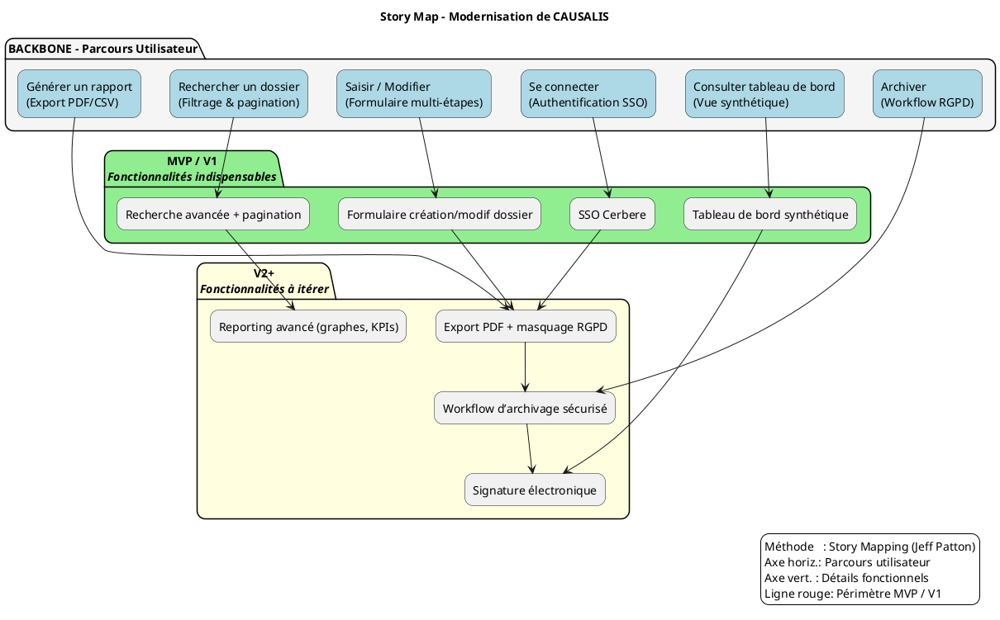

# 📘 Guide d’atelier **Story Mapping** – Représenter le périmètre fonctionnel de **CAUSALIS**

> **Document établi à partir des principes du Story Mapping de Jeff Patton**  
> *Version 1.0 – 2024‑04‑28*  

---

[TOC]

---  

## 1️⃣ Introduction et objectifs

> **Livrable** : *« Représenter visuellement le périmètre fonctionnel de CAUSALIS, aligné sur le parcours utilisateur »*  

| Objectif | Pourquoi ? |
|----------|------------|
| **Comprendre collectivement le parcours cible de l’usager** | Alignement entre métier, technique et design sur les étapes de saisie, de suivi et de reporting des accidents/maladies professionnelles. |
| **Identifier les fonctionnalités nécessaires à chaque étape** | Découper la solution en **epics → user stories** exploitables pour le backlog. |
| **Prioriser pour définir un MVP fonctionnel** | Décider rapidement ce qui doit être livrable pour répondre aux exigences légales (RGPD, archivage) et aux besoins utilisateurs. |
| **Créer un support visuel partagé** | Un **Story Map** exploitable dans les prochains sprints, road‑maps et revues de conception. |
| **Faciliter la prise de décision sur la modernisation** | Identifier les briques à migrer (Struts 1 → Spring Boot, Castor JDO → JPA, UI JSP → Angular/React) dès le premier atelier. |

---

## 2️⃣ Contexte d’usage

| Élément | Valeur / Description |
|--------|----------------------|
| **Type de livrable** | Standard ✅ |
| **Nature** | Atelier 🤝 – « Imaginer une solution » |
| **Méthode** | Story Mapping (Jeff Patton) |
| **Quand l’utiliser** | <ul><li>Traduire la recherche utilisateur, la réglementation (RGPD, archivage) et la vision produit en périmètre fonctionnel.</li><li>Définir le MVP, la V1 ou la refonte de CAUSALIS.</li><li>Aligner les équipes métier, technique et design sur une même représentation.</li></ul> |
| **Recommandation** | Créez **une Story Map par profil utilisateur** (ex. *Gestionnaire RH*, *Agent du ministère*, *Développeur*). Commencez toujours par le **profil final** (l’agent qui consulte les statistiques). |
| **Contexte métier** | Application de **statistiques nationales sur les accidents du travail et les maladies professionnelles** (RH > Santé, action et dialogue social). |
| **Contraintes** | <ul><li>Conformité RGPD : archivage élevé, traçabilité.</li><li>Technologies vieillissantes : Java 6, Struts 1, Castor JDO, Tomcat 6.</li><li>Hébergement ministériel (Paris La Défense, clusters ESXi).</li></ul> |
| **Vision produit** | Conserver la fiabilité des statistiques tout en **modernisant l’architecture** (micro‑services, API REST, UI réactive) et en **renforçant la conformité** (RGPD, archivage). |

---

## 3️⃣ Pré‑requis

- [ ] **Vision produit** formalisée (p. ex. « Mise en production d’une plateforme moderne, sécurisée et conforme »).  
- [ ] **Personas** et **recherche utilisateurs** synthétisés (verbatims, interviews).  
- [ ] **Problèmes utilisateurs** hiérarchisés (job‑to‑be‑done, pain points).  
- [ ] **Contraintes réglementaires** (RGPD, archivage, sécurité SSI).  
- [ ] **Inventaire technique** (versions Java, Struts, Castor, bases de données).  

> 💡 *Si un pré‑requis manque, réservez 15 min en début d’atelier pour le co‑construire rapidement.*  

---

## 4️⃣ Parties prenantes et rôles

| Rôle | Profil type | Responsabilité dans l’atelier |
|------|-------------|------------------------------|
| **Animateur** | Chef de produit / PO | Cadre, facilitation, garde du focus utilisateur. |
| **Profil technique** | Tech Lead / Architecte | Évalue faisabilité, effort, dépendances (migration Castor → JPA, Struts → Spring Boot). |
| **Porteur métier** | MOA / Responsable RH | Valide la pertinence fonctionnelle, priorisation (MVP vs. V2). |
| **Designer UX/UI** *(optionnel)* | Designer produit | Enrichit le parcours, propose des maquettes UI modernes. |
| **Responsable conformité** | MOA SSI / DPO | Vérifie les exigences RGPD, archivage, traçabilité. |
| **Développeur** | Développeur back‑end | Apporte la vision de la dette technique (ex. tests unitaires, couverture). |

> ☝️ *Un même participant peut cumuler plusieurs rôles selon la taille de l’équipe.*  

---

## 5️⃣ Logistique

| Élément | Détails |
|---------|---------|
| **Durée** | 2 h 30 – 3 h (prévoir pause à 1 h 30). |
| **Matériel** | <ul><li>Mur / tableau blanc.</li><li>Post‑its 3 couleurs (vert = MVP, jaune = V2+, rose = Idées futures).</li><li>Marqueurs, ruban de masquage.</li></ul> |
| **Digital** | Outil collaboratif (Mural, FigJam, Klaxoon) avec template « Story Map ». |
| **Livrable de sortie** | Photo/export de la Story Map, diagramme PlantUML, liste des décisions MVP, points de vigilance. |
| **Support** | Accès aux documents existants : `README.txt`, `causalis-wiki.md`, `causalis-wikisi.md`, scripts DB, diagrammes existants. |

---

## 6️⃣ Déroulé détaillé de l’atelier

### 🎯 Étape 1 — Introduction (15 min)

1. Présenter les objectifs et le principe de la **Story Map** (Jeff Patton).  
2. Rappeler le **contexte CAUSALIS** : accident du travail, contraintes RGPD, dette technique (Java 6 / Struts 1).  
3. Exposer les **règles du jeu** : écoute active, contribution ouverte, suspension du jugement.  

> ✅ *Conseil* : Affichez une **job story** type :  
> *« En tant que **gestionnaire RH**, je veux **exporter les statistiques d’accidents** afin de **préparer le rapport annuel de prévention** ».  

---

### 🗺️ Étape 2 — Parcours utilisateur horizontal (30 min)

**Question centrale** : *« Quelles sont les grandes étapes que suit l’usager dans sa démarche ? »*  

> **Exemple de backbone (parcours)** :  

| Étape (horizontal) | Verbe d’action (utilisateur) |
|---------------------|------------------------------|
| 1️⃣ **Se connecter** | S’authentifier via SSO (Cerbere). |
| 2️⃣ **Consulter le tableau de bord** | Visualiser le résumé des accidents/maladies. |
| 3️⃣ **Rechercher un dossier** | Filtrer par période, service, type d’accident. |
| 4️⃣ **Saisir / Modifier un dossier** | Créer ou mettre à jour les informations d’un accident. |
| 5️⃣ **Générer un rapport** | Exporter au format CSV / PDF, appliquer la confidentialité RGPD. |
| 6️⃣ **Archiver** | Valider l’archivage sécurisé (conformité). |

*Placez chaque étape sur un post‑it, de gauche à droite, en gardant le même ordre pour tous les profils.*  

---

### 📋 Étape 3 — Détail vertical des activités (45 min)

Pour chaque étape, posez :

- *« Que doit faire concrètement l’usager ici ? »*  
- *« De quelles informations a‑t‑il besoin ? »*  
- *« Quels sont les points de friction potentiels ? »*  

#### Exemple de remplissage (débutant)

| Étape | Fonctionnalités (vertical) | Priorité (MVP / V2+) |
|-------|-----------------------------|----------------------|
| **Se connecter** | • Authentification SSO (Cerbere) <br>• Gestion du timeout <br>• Message d’erreur claire | ✅ MVP |
| **Consulter le tableau de bord** | • Vue synthétique des accidents par service <br>• Filtrage par période <br>• Indicateurs de gravité <br>• Alertes RGPD (données sensibles) | ✅ MVP |
| **Rechercher un dossier** | • Formulaire de recherche avancée (service, date, type) <br>• Pagination (paramètre `pagination.max=30`) <br>• Export CSV des résultats | ✅ MVP |
| **Saisir / Modifier un dossier** | • Formulaire multi‑étapes (identité, circonstances, pièces jointes) <br>• Validation côté serveur (DAO, exceptions) <br>• Historisation des modifications (audit) | ✅ MVP |
| **Générer un rapport** | • Choix de format (PDF, CSV) <br>• Masquage des champs RGPD (ex. nom, prénom) <br>• Planification d’envoi par mail <br>• Signature électronique (future) | ❌ V2+ |
| **Archiver** | • Déclenchement du workflow d’archivage <br>• Cryptage des données archivées <br>• Conservation 10 ans (RGPD) <br>• Vérification d’intégrité | ❌ V2+ |

*Continuez le même exercice pour les autres personas (ex. **Agent**, **Développeur**).*

---

### 🎚️ Étape 4 — Priorisation et définition du MVP (30‑45 min)

1. **Tracer la ligne de flottaison** (ligne horizontale) :  
   - **Au‑dessus** : fonctionnalités **indispensables** pour que le parcours soit complet et conforme.  
   - **En‑dessous** : améliorations ou évolutions (V2, V3).  

2. **Débattre** :  
   - *« Quelles fonctionnalités sont absolument nécessaires pour que l’usager aille au bout ? »*  
   - *« Qu’est‑ce qu’on peut retirer sans bloquer le parcours principal ? »*  

3. **Documenter** :  
   - Décisions de priorité (ex. *MVP* = 1‑4, *V2* = 5‑6).  
   - Points de vigilance (ex. conformité RGPD, dépendances techniques).  

> 🎯 *Rappel* : Un **MVP** doit être **fonctionnel** (pas seulement minimaliste). Il doit permettre de **déployer** la version la plus simple qui satisfait les exigences légales et métier.  

---

### 🏁 Étape 5 — Conclusion et prochaines étapes (15 min)

- **Relecture collective** de la Story Map : validation du parcours, du périmètre MVP, des dépendances.  
- **Points de vigilance** : <ul><li>RGPD – masquage des données personnelles dans les exports.</li><li>Migration Castor → JPA (impact sur les DAO).</li><li>Struts 1 → Spring Boot (plan de découpage).</li></ul>  
- **Questions en suspens** : à approfondir pendant l’analyse fonctionnelle détaillée.  
- **Livrables immédiats** : Photo/export de la board, diagramme PlantUML (ci‑dessous), tableau de priorisation.  
- **Actions suivantes** : <ul><li>Rédaction des **user stories** à partir du MVP.</li><li>Estimation technique (story points, effort).</li><li>Planification du sprint 1 (migration de la couche DAO).</li></ul>  

> 📸 *Action immédiate* : Prenez en photo le board ou exportez la carte numérique ; partagez‑la dans les 24 h sur le canal projet.  

---

## 7️⃣ Conseils de facilitation

| Bonnes pratiques | À éviter |
|------------------|----------|
| Reformuler régulièrement pour garantir la clarté. | S’enliser dans les détails techniques (ex. code Java) dès le premier tour. |
| Garder le cap sur l’expérience utilisateur (verbes d’action). | Laisser un profil dominer les échanges sans contre‑question. |
| Faire participer tout le monde (métiers, dev, design, SSI). | Accepter les digressions hors du parcours (ex. discussion sur la version Java). |
| Utiliser un **time‑boxing** strict par étape. | Oublier de documenter les arbitrages (qui décide quoi). |
| Ancrer chaque fonctionnalité dans un **besoin utilisateur** identifié. | Confondre « nice‑to‑have » et « must‑have ». |

---

## 8️⃣ Exemple de Story Map (simplifiée)

```
Parcours utilisateur (axe horizontal →) :
[Se connecter] — [Consulter tableau de bord] — [Rechercher un dossier] — [Saisir / Modifier] — [Générer un rapport] — [Archiver]

Fonctionnalités associées (axe vertical ↓ sous chaque étape) :

► Se connecter
   • Authentification SSO (Cerbere)                ← MVP
   • Gestion du timeout
   • Message d’erreur multilingue

► Consulter tableau de bord
   • Vue synthétique des accidents par service      ← MVP
   • Filtrage par période
   • Indicateurs de gravité
   • Alertes RGPD (masquage données sensibles)

► Rechercher un dossier
   • Formulaire de recherche avancée               ← MVP
   • Pagination (max = 30)                          ← MVP
   • Export CSV des résultats

► Saisir / Modifier
   • Formulaire multi‑étapes (infos, pièces jointes)← MVP
   • Validation serveur (DAO, exceptions)
   • Historisation / audit

► Générer un rapport
   • Choix format (PDF, CSV)                        ← V2+
   • Masquage champs RGPD
   • Envoi mail automatisé
   • Signature électronique

► Archiver
   • Workflow d’archivage sécurisé                ← V2+
   • Cryptage, conservation 10 ans (RGPD)
   • Vérification d’intégrité
```

---

## 9️⃣ Diagramme PlantUML du Story Map



> **Interprétation** :  
> - Les **rectangles verts** (MVP) sont **au‑dessus** de la ligne rouge : ils constituent le périmètre fonctionnel à livrer en première version.  
> - Les **rectangles jaunes** (V2+) sont **en dessous**, à planifier après le MVP.  

---

## 🔟 Adaptations contextuelles

| Contexte | Adaptation recommandée |
|----------|------------------------|
| **Refonte complète** | Partir du **parcours existant** (déjà présent dans le code Struts) → identifier les points de friction (ex. UI vieillie, navigation difficile) → ajouter les **stories d’amélioration UI** dans la colonne V2+. |
| **Produit réglementé (RGPD)** | Intégrer **« Masquage des données »** comme critère de **MVP** (obligatoire). Créer une **épique « Conformité RGPD »** avec stories (audit, archivage, suppression). |
| **Multi‑profil** | Créez **une Story Map par persona** (ex. Gestionnaire RH, Agent, Développeur). Puis **fusionnez** les backbones pour identifier les fonctionnalités communes (MVP) et les spécifiques (V2+). |
| **Contraintes techniques fortes** | Invitez le **Tech Lead** dès l’étape 2 pour valider la **faisabilité** des stories (ex. migration Castor → JPA). Si un blocage apparaît, notez‑le dans la colonne *V2+* et planifiez une **spike**. |
| **Déploiement en production ministériel** | Ajoutez une **story d’infrastructure** (déploiement sur ESXi, monitoring) dans la colonne *V2+* pour la phase post‑MVP. |

---

## 1️⃣1️⃣ Livrables et suite du projet

| Livrable immédiat | Description |
|-------------------|-------------|
| **Story Map** (photo / export) | Vue globale du parcours + priorisation MVP / V2+. |
| **Diagramme PlantUML** | Représentation formelle (incluse dans ce document). |
| **Liste des fonctionnalités MVP** | Tableau (ex. Tableau 1) à transformer en **user stories** (format *As a [persona], I want [feature] so that [benefit]*). |
| **Points de vigilance** | RGPD, migration Castor, dépendances Struts, performance. |

| Livrables dérivés | Étapes suivantes |
|-------------------|-----------------|
| **Backlog produit** (epics → user stories) | Rédaction détaillée, critères d’acceptation. |
| **Matrice de traçabilité** (story ↔ besoin ↔ contrainte) | Garantir la couverture des exigences métier et réglementaires. |
| **Roadmap** (MVP → V1 → V2) | Planification des sprints, jalons de migration technologique. |
| **Plan d’estimation** (story points, effort) | Atelier de **Planning Poker** avec l’équipe dev. |
| **Maquettage UI** (wireframes, prototypes) | Sprint de design (si besoin) avant le développement. |
| **Plan de tests** (unitaires, fonctionnels, sécurité) | Couverture > 80 % dès le MVP. |
| **Plan de déploiement & monitoring** | CI/CD (GitLab‑CI), SonarQube, alerting. |

> **Prochaine réunion** : *Sprint 0 – Affinage du backlog* (prévoir 2 jours, 4 personnes, incluant le DPO).  

---  

## 📎 Annexes

### A. Glossaire (mini)

| Terme | Définition |
|-------|------------|
| **MVP** | *Minimum Viable Product* – version fonctionnelle la plus simple répondant aux exigences critiques. |
| **V2+** | Fonctionnalités prévues après le MVP (améliorations, évolutions). |
| **Backbone** | Axe horizontal du Story Map : les étapes majeures du parcours utilisateur. |
| **Vertical** | Axe vertical : les activités, besoins ou fonctionnalités détaillés sous chaque étape. |
| **Line of Flotation** | Ligne de découpe qui sépare les items du MVP (au‑dessus) des items post‑MVP (en‑dessous). |
| **RGPD** | Règlement Général sur la Protection des Données – exigences de masquage, archivage, traçabilité. |
| **SSO** | Single Sign‑On – authentification unique via Cerbere. |
| **DAO** | Data Access Object – couche d’accès aux données. |
| **JDO** | Java Data Objects – technologie de persistance utilisée (Castor). |
| **Struts 1** | Framework web MVC (déprécié) utilisé dans l’application actuelle. |

### B. Modèle de User Story (exemple)

```
En tant que Gestionnaire RH,
je veux pouvoir exporter les statistiques d’accidents au format CSV,
afin de les transmettre au service juridique tout en masquant les données personnelles (RGPD).
```

---  

### 🎉 Vous avez maintenant :

1. **Une vue d’ensemble claire** du parcours CAUSALIS.  
2. **Une Story Map prête à être alimentée** (post‑it ou numérique).  
3. **Un diagramme PlantUML** exploitable dans vos docs (VS Code, Obsidian, Confluence…).  
4. **Un plan d’action** pour transformer le MVP en backlog et lancer les sprints.  

> **Bonne cartographie !** 🚀  