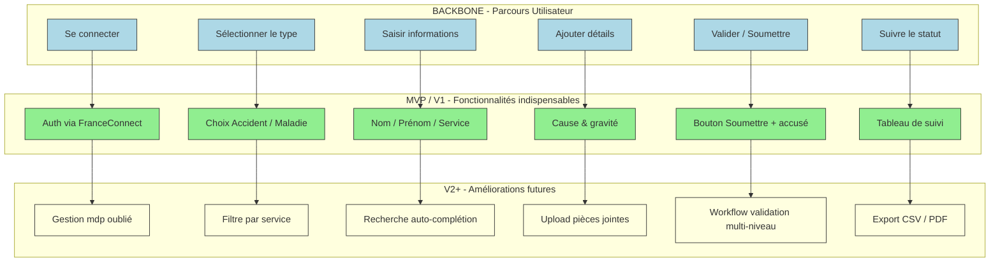

# 📚 Guide d’atelier **Story Mapping** – Causalis  
*Document établi à partir des principes du Story Mapping de Jeff Patton*  

---

[TOC]

---  

## 1. Introduction et objectifs  

**Livrable** : *Représenter visuellement le périmètre fonctionnel de Causalis aligné sur le parcours utilisateur*  

| Méthodologie | Atelier basé sur le **Story Mapping** (Jeff Patton) |
|--------------|------------------------------------------------------|

### Objectifs opérationnels  

| 🎯 Objectif | Description |
|------------|-------------|
| **Comprendre le parcours cible** | Identifier, avec toutes les parties prenantes, les étapes que parcourt un·e utilisateur·rice lorsqu’il·elle saisit, consulte ou exporte un accident ou une maladie professionnelle. |
| **Lister les fonctionnalités** | Découper chaque étape en actions, informations et décisions (user stories) nécessaires au bon fonctionnement. |
| **Prioriser le MVP** | Tracer la **ligne de flottaison** (MVP / V1) afin de définir la première version livrable et les évolutions futures. |
| **Créer un support partagé** | Produire une Story Map exploitable immédiatement par les équipes produit, technique et métier. |
| **Détecter les contraintes** | Recueillir les exigences réglementaires (RGPD, exigences ministérielles), techniques (Java 6, Castor JDO, Oracle) et opérationnelles (déploiement sur le centre‑serveur Paris‑La Défense). |

---  

## 2. Contexte d’usage  

| Élément | Valeur |
|---------|--------|
| **Type de livrable** | Standard ✅ |
| **Nature** | Atelier 🤝 « Imaginer une solution » |
| **Méthode** | Story Mapping (Jeff Patton) |
| **Quand l’utiliser** | • Traduire la recherche utilisateur, la réglementation et la vision produit en périmètre fonctionnel.<br>• Cadrer un MVP, une V1 ou une refonte.<br>• Aligner les équipes métier, technique et design. |
| **Recommandation** | Produire **une Story Map par persona** (max 3) en commençant toujours par le **Gestionnaire d’accidents** (utilisateur final). |

---  

## 3. Pré‑requis  

| ✔️ À préparer | Détails |
|---------------|--------|
| **Vision produit** | Pitch, objectifs, métriques (ex. : réduction du temps de saisie de 30 % d’ici 12 mois). |
| **Personas & recherche** | Synthèse des entretiens : <br>• **Gestionnaire d’accidents** (manager). <br>• **Agent de service** (saisie). <br>• **Administrateur RGPD** (sécurité). |
| **Problèmes utilisateurs** | Jobs‑to‑be‑Done, pain‑points : <br>• Saisie fastidieuse. <br>• Accès limité aux historiques. <br>• Conformité RGPD incertaine. |
| **Contraintes** | • RGPD & exigences ministérielles (sécurité, archivage). <br>• Stack technique : Java 6, Struts 1.x, Castor JDO, Oracle. <br>• Hébergement : centre‑serveur Paris‑La Défense, plateforme ACAI. |
| **Backlog existant** | Liste des epics / user stories déjà connues (ex. : “Exporter les dossiers”, “Notifier les agents”). |

> 💡 *Conseil* : Si un pré‑requis manque, réserver 15 min en début d’atelier pour le co‑construire rapidement.  

---  

## 4. Parties prenantes et rôles  

| Rôle | Profil type | Responsabilité dans l’atelier |
|------|-------------|--------------------------------|
| **Animateur** | Chef de produit / PNM (ex. : Christian ARBOGAST) | Cadre, facilite, garde le cap utilisateur. |
| **Profil technique** | Tech Lead / Architecte (ex. : développeur Java) | Évalue faisabilité, effort, dépendances (JDO, Oracle). |
| **Porteur métier** | MOA / Responsable RH (ex. : SG/DRH/D) | Valide la pertinence fonctionnelle et la priorisation. |
| **Designer UX/UI** *(optionnel)* | Designer produit | Enrichit le parcours, propose des maquettes d’écran. |
| **Responsable conformité** | MOA SSI (ex. : SG/DRH/D/PSPP1) | Vérifie le respect des exigences RGPD et archivage. |

> ☝️ *Plusieurs rôles peuvent être tenus par une même personne selon les équipes disponibles.*  

---  

## 5. Logistique  

| Élément | Détails |
|---------|---------|
| **Durée** | 2 h 30 – 3 h (prévoir une pause à 1 h 30). |
| **Matériel – physique** | Mur / tableau blanc, post‑its 3 couleurs (fonctionnalités, contraintes, idées), marqueurs, ruban de masquage. |
| **Matériel – digital** | Outil collaboratif (Miro, FigJam, Mural, Klaxoon) avec template Story Map pré‑préparé. |
| **Livrable de sortie** | Photo/export de la Story Map, diagramme Mermaid, liste des décisions MVP, points de vigilance. |

---  

## 6. Déroulé détaillé de l’atelier  

### 🎯 Étape 1 — Introduction (15 min)  

1. Présenter les objectifs et le principe du Story Mapping (Jeff Patton).  
2. Rappeler le contexte Causalis : <br>• **Produit** : plateforme de statistiques nationales sur les accidents du travail et les maladies professionnelles. <br>• **Domaines métier** : Ressources humaines → Santé, action et dialogue social. <br>• **Acteurs** : managers, agents, administrateurs, MOA SSI.  
3. Exposer les règles de l’atelier : écoute active, contributions ouvertes, suspension du jugement.  

> ✅ *Astuce* : préparer une **job story** pour chaque persona : <br>**« En tant que Gestionnaire d’accidents, je veux saisir rapidement un nouveau dossier afin de le valider avant la fin de journée. »**  

### 🗺️ Étape 2 — Parcours utilisateur horizontal (30 min)  

| Question | Action attendue |
|---------|-----------------|
| « Quelles sont les grandes étapes que suit l’usager ? » | Noter chaque étape sur un post‑it (verbes d’action). Disposer de **gauche à droite**. |

**Exemple de backbone pour Causalis** (à adapter) :  

1. **Se connecter**  
2. **Sélectionner le type de dossier** (Accident / Maladie)  
3. **Saisir les informations de base** (personne, service, date)  
4. **Ajouter les détails** (cause, gravité, pièces jointes)  
5. **Valider / Soumettre**  
6. **Suivre le statut** (consultation, export, archivage)  

### 📋 Étape 3 — Détail vertical des activités (45 min)  

Pour chaque étape du backbone :  

| Questions à poser | Exemple de réponses (Causalis) |
|-------------------|--------------------------------|
| « Que doit faire concrètement l’usager ? » | *Choisir le service dans le menu déroulant, saisir le numéro d’ordre.* |
| « De quelles informations a‑t‑il besoin ? » | *Liste des grades, codes de cause, référentiel de maladies.* |
| « Quels sont les points de friction ? » | *Duplication de données, validation RGPD, lenteur du serveur.* |
| « Quel est le besoin de conformité ? » | *Consentement explicite, durée de conservation, chiffrement.* |

Empiler les éléments **verticalement** sous chaque étape (du plus essentiel au plus secondaire). Utiliser **3 couleurs** :  
* Vert = Fonctionnalités indispensables (MVP).  
* Jaune = Fonctionnalités différenciantes (V2).  
* Bleu = Améliorations futures (backlog).  

### 🎚️ Étape 4 — Priorisation & définition du MVP (30‑45 min)  

1. Tracer une **ligne de flottaison** (horizontal) : tout au‑dessus = **MVP/V1**, en dessous = **V2+ / backlog**.  
2. Poser les questions clés :  

| Question | Objectif |
|----------|----------|
| « Quelles fonctionnalités sont absolument indispensables pour que l’usager aille au bout ? » | Garantir la complétude du parcours (ex. : saisie, validation, export). |
| « Qu’est‑ce qu’on peut retirer sans bloquer le parcours principal ? » | Identifier les points de friction à traiter ultérieurement (ex. : tableau de bord avancé). |
| « Quelles exigences réglementaires sont non négociables ? » | Placer les contrôles RGPD et archivage dans le MVP. |

> 🎯 *Rappel* : le MVP doit être **fonctionnel**, pas minimaliste à outrance.  

### 🏁 Étape 5 — Conclusion et prochaines étapes (15 min)  

1. Relire la carte ensemble : validation du parcours + périmètre MVP/V1.  
2. Noter : points de vigilance, questions en suspens, dépendances techniques/organisationnelles.  
3. Rappeler les suites :  
   * Formaliser le backlog (epics → user stories).  
   * Rédiger les critères d’acceptation.  
   * Planifier les estimations techniques (story points).  
   * Maquetter les écrans clés du MVP.  
4. **Action immédiate** : prendre en photo le board ou exporter la carte digitale + la partager dans les 24 heures.  

---  

## 7. Conseils de facilitation  

| Bonnes pratiques | À éviter |
|------------------|----------|
| Reformuler régulièrement pour assurer la clarté. | Se perdre dans les détails techniques. |
| Garder le cap sur l’expérience utilisateur. | Laisser un profil dominer les échanges. |
| Faire participer tout le monde (métiers, terrain, technique). | Accepter les digressions hors parcours. |
| Utiliser un timeboxing strict par étape. | Oublier de documenter les arbitrages. |
| Ancrer chaque fonctionnalité dans un besoin utilisateur. | Confondre « nice to have » et « must have ». |

---  

## 8. Exemple de Story Map (simplifiée)  

```markdown
Parcours utilisateur (axe horizontal →) :

[Se connecter] — [Sélectionner le type] — [Saisir infos] — [Ajouter détails] — [Valider] — [Suivre statut]

Fonctionnalités associées (axe vertical ↓ sous chaque étape) :

► Se connecter
   • Authentification via FranceConnect (MVP)
   • Gestion du mot de passe oublié (V2)

► Sélectionner le type
   • Choix Accident / Maladie (MVP)
   • Filtre par service (V2)

► Saisir infos
   • Champ Nom, Prénom, Service (MVP)
   • Recherche auto‑complétion d’agents (V2)

► Ajouter détails
   • Sélection cause, gravité (MVP)
   • Upload pièces jointes (V2)
   • Vérification conformité RGPD (MVP)

► Valider
   • Bouton « Soumettre » avec accusé de réception (MVP)
   • Workflow de validation multi‑niveau (V2)

► Suivre statut
   • Tableau de suivi (MVP)
   • Export CSV / PDF (V2)
   • Historique complet & archivage (V3)
```

---  

## 9. Diagramme Mermaid du Story Map  



---  

## 10. Adaptations contextuelles  

| Contexte | Adaptation recommandée |
|----------|------------------------|
| **Refonte** | Partir du parcours existant (ex. : écran de connexion, formulaires Struts), identifier les points de friction (ex. : lenteur JDO, duplication de données) avant de proposer les nouvelles fonctionnalités. |
| **Produit réglementé** | Intégrer les exigences RGPD comme des **« étapes obligatoires »** (consentement, durée de conservation, journal d’audit). |
| **Multi‑profils** | Créer une Story Map distincte pour chaque persona : <br>• Gestionnaire d’accidents (focus sur suivi & export). <br>• Agent de service (focus sur saisie). <br>• Administrateur RGPD (focus sur archivage). |
| **Contraintes techniques fortes** | Inviter un développeur Java dès l’étape 3 pour valider la faisabilité (ex. : Castor JDO → JPA, limites Oracle). |
| **Déploiement en production** | Ajouter une étape *« Déployer sur le centre‑serveur Paris‑La Défense »* dans le backlog technique. |

---  

## 11. Livrables et suite du projet  

| Livrable | Description |
|----------|-------------|
| **Livrable immédiat** | Story Map (photo ou export), diagramme Mermaid, liste des fonctionnalités MVP priorisées. |
| **Livrables dérivés** | <ul><li>Backlog produit structuré (epics → user stories).</li><li>Matrice de traçabilité : fonctionnalité ↔ besoin utilisateur ↔ contrainte RGPD.</li><li>Roadmap visuelle (MVP → V1 → V2).</li></ul> |
| **Prochaines étapes** | 1. Rédaction des user stories avec critères d’acceptation. <br>2. Maquettage des écrans clés du MVP (connexion, saisie, suivi). <br>3. Estimation technique (story points) et planification des sprints. <br>4. Validation de conformité RGPD (audit interne). <br>5. Mise en place du pipeline CI/CD (GitLab CI, SonarQube). |

---  

## 12. Mini‑glossaire  

| Terme | Définition |
|-------|------------|
| **Backbone** | Axe horizontal de la Story Map : les grandes étapes du parcours utilisateur. |
| **Activities** | Couche verticale : actions, informations ou décisions associées à chaque étape. |
| **MVP** | Minimum Viable Product : version fonctionnelle minimale qui répond aux besoins essentiels. |
| **V2+** | Fonctionnalités différenciantes ou d’amélioration à implémenter après le MVP. |
| **Line of Flotation** | Ligne de découpe (flottaison) qui sépare le MVP du backlog. |
| **Job‑to‑be‑Done** | Formulation du besoin utilisateur sous forme de tâche à accomplir. |
| **RGPD** | Règlement général sur la protection des données : exigences de consentement, archivage, traçabilité. |
| **Castor JDO** | Framework de persistance Java utilisé dans Causalis (déprécié). |
| **Struts 1.x** | Framework MVC Java utilisé pour les actions et formulaires. |
| **ACA​I** | Plateforme d’exécution Java du ministère (clusters ESXi). |

---  

## 13. Références  

- Patton, **User Story Mapping: Discover the Whole Story, Build the Right Product**, 2014.  
- Documentation interne Causalis (README.txt, *.md, *.xml).  
- **SonarQube** – `sonar-project.properties`.  

---  

*Document établi à partir des principes du Story Mapping de Jeff Patton*  

---  

**Bonne cartographie !** 🎯  