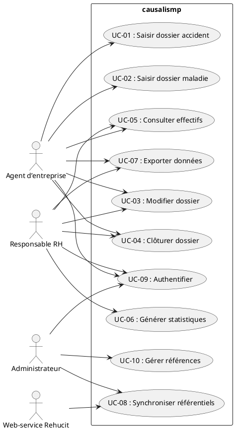
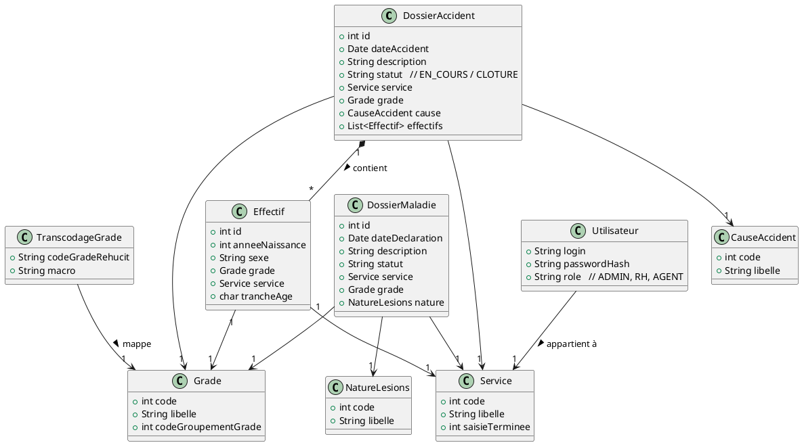

[TOC]

# Cahier des Charges Fonctionnel (CCF) – Projet **causalismp**

> **Version** : 1.0 – 2024‑04‑28  
> **Auteur** : ChatGPT (IA) – basé sur l’analyse du code source et de la documentation fournie.  

---

## 1. Introduction et contexte du projet

### 1.1 Présentation du projet  

**causalismp** est une application web Java (Struts 1, Castor JDO, Oracle) destinée à la **gestion des accidents du travail** et des **maladies professionnelles** au sein d’une organisation de type groupe industriel ou service public.  

Elle permet :  

* la saisie, la consultation et la clôture de dossiers d’accident et de maladie ;  
* la gestion des effectifs associés (âge, grade, service, sexe) ;  
* le suivi de statistiques (nombre d’accidents, répartition par grade, etc.) ;  
* l’exportation de données au format OpenOffice / CSV ;  
* la synchronisation des référentiels (grades, services, transcodage) avec des web‑services externes (ex. : **Rehucit**) ;  
* la gestion des références métiers (grades, services, statuts, causes, etc.) ;  
* la prise en charge de la sécurité et de l’authentification via le composant **Cerbere**.  

### 1.2 Objectifs stratégiques et attendus  

| Objectif | Description | Indicateur de succès |
|----------|-------------|----------------------|
| **Améliorer la traçabilité** | Centraliser toutes les informations liées aux accidents et maladies (dossiers, effectifs, décisions). | 100 % des dossiers créés dans l’outil, aucune donnée orpheline. |
| **Faciliter le reporting** | Générer automatiquement des tableaux de bord et des exports. | Production de statistiques mensuelles sans intervention manuelle. |
| **Assurer la conformité** | Respecter les exigences légales (RGPD, archivage, contrôle d’accès). | Audit positif sur la confidentialité et la conservation des données. |
| **Optimiser la maintenance** | Séparer les modules (DB, déploiement, documentation, web) via Maven multi‑module. | Déploiement d’une nouvelle version en < 30 min, sans régression. |
| **Synchroniser les référentiels** | Mettre à jour les grades et les codes métier depuis les web‑services externes. | Taux de mise à jour ≥ 95 % des grades après chaque synchronisation. |

### 1.3 Périmètre fonctionnel  

| Inclus | Exclus |
|--------|--------|
| • Saisie, modification, clôture des dossiers **accident** et **maladie**.<br>• Gestion des effectifs (âge, grade, service, sexe).<br>• Statistiques et export (CSV/OpenOffice).<br>• Gestion des références (grades, services, causes, statuts, etc.).<br>• Synchronisation des référentiels via WS.<br>• Authentification, journalisation, gestion des droits. | • Gestion de la paie ou des contrats de travail (hors scope).<br>• Modules de formation ou de prévention (non implémentés).<br>• Interface mobile native (seulement web). |

---

## 2. Expression fonctionnelle du besoin (NF EN 16271)

> **Méthodologie** : chaque fonction de service (FS) est décrite **sans** indiquer *comment* elle sera réalisée (implémentation technique).  

| N° | Fonction de service (FS) | Description (quoi) | Critères d’appréciation | Importance (pondération) | Contraintes |
|----|--------------------------|---------------------|--------------------------|--------------------------|--------------|
| **FS‑01** | **Gestion des dossiers d’accident** | Créer, modifier, consulter, clôturer un dossier d’accident professionnel. | • Création en < 2 min.<br>• Validation de tous les champs obligatoires.<br>• Historique complet des modifications. | 15 % | • Les dates d’accident doivent être antérieures à la date du jour.<br>• Le dossier ne peut être clôturé que si tous les champs sont remplis. |
| **FS‑02** | **Gestion des dossiers de maladie professionnelle** | Idem FS‑01, mais pour les maladies. | • Création en < 2 min.<br>• Vérification de la cohérence avec la table `NatureLesions`. | 12 % | • Le code maladie doit exister dans le référentiel `NatureLesions`. |
| **FS‑03** | **Gestion des effectifs** | Saisir, modifier et visualiser les effectifs liés à un dossier (âge, grade, service, sexe). | • Unicité de l’effectif sur la combinaison (année de naissance, grade, service, sexe).<br>• Calcul du rang d’âge via `TrancheAgeHelper`. | 10 % | • L’âge doit être compris entre 15 et 70 ans. |
| **FS‑04** | **Gestion des références métiers** | CRUD (lecture, création, mise à jour) des tables de référence : Grade, Service, Statut, Cause, etc. | • Disponibilité 99,5 % (lecture) sur l’ensemble des référentiels.<br>• Validation de l’unicité des codes. | 8 % | • Les tables sont en lecture seule pour les utilisateurs non‑administrateurs. |
| **FS‑05** | **Synchronisation des référentiels externes** | Mettre à jour les grades et leurs transcodages (`TranscodageGrade`) depuis le web‑service `Rehucit`. | • Exécution du batch < 5 min.<br>• Aucun doublon après synchronisation.<br>• Log détaillé des lignes insérées/ignorées. | 9 % | • Le WS doit être disponible (timeout ≤ 30 s). |
| **FS‑06** | **Exportation de données** | Exporter les dossiers, effectifs et statistiques au format OpenOffice (ODS) ou CSV. | • Export complet en < 10 s pour < 10 000 lignes.<br>• Fichier conforme aux spécifications ODS (schéma valide). | 7 % | • Le répertoire d’export doit être accessible en écriture par le serveur d’application. |
| **FS‑07** | **Statistiques et tableaux de bord** | Calculer et afficher les indicateurs : nb accidents par grade, taux d’incidence, répartition par cause, etc. | • Actualisation des indicateurs en < 2 s après la sauvegarde d’un dossier.<br>• Export possible des tableaux de bord. | 8 % | • Les calculs utilisent les vues matérialisées de la base (si disponibles). |
| **FS‑08** | **Authentification et gestion des droits** | Authentifier les utilisateurs via le composant `Cerbere` et appliquer les rôles (consultation, saisie, admin). | • Temps d’authentification < 1 s.<br>• Journalisation de chaque connexion et action critique. | 10 % | • Conformité RGPD : stockage des logs chiffrés. |
| **FS‑09** | **Gestion des messages d’avertissement** | Afficher des warnings (ex. : incohérence de données) dans les formulaires. | • Les warnings sont visibles avant la soumission.<br>• L’utilisateur peut corriger ou confirmer. | 5 % | • Les warnings sont définis dans les classes `ActionWarning`. |
| **FS‑10** | **Gestion de la navigation et du rendu UI** | Fournir une interface web (JSP/Struts) ergonomique, accessible (WCAG 2.1 AA). | • Taux de satisfaction utilisateur > 80 % (sondage).<br>• Aucun dysfonctionnement majeur sur les navigateurs majeurs (Chrome, Edge, Firefox). | 6 % | • Utilisation exclusive de HTML 4.01 + CSS 2.1 (compatibilité legacy). |

> **Total pondération** = 100 %

---

## 3. Acteurs et parties prenantes

| ID | Acteur | Rôle | Objectifs | Besoins spécifiques |
|----|--------|------|----------|---------------------|
| **A‑01** | **Agent d’entreprise** | Utilisateur final (saisie) | Saisir rapidement les dossiers d’accident/maladie, visualiser les effectifs, consulter les statistiques. | Accès aux formulaires `DossiersForm`, `EffectifsForm`; messages d’avertissement clairs; export de ses propres dossiers. |
| **A‑02** | **Responsable RH** | Super‑viseur | Contrôler la qualité des dossiers, valider les clôtures, suivre les indicateurs RH. | Accès en lecture/édition aux dossiers de tous les agents; tableau de bord complet; export CSV. |
| **A‑03** | **Administrateur système** | Gestion de l’infrastructure | Déployer, configurer le datasource, gérer les mises à jour du serveur d’applications. | Accès aux scripts DB (`causalismp-database/script`), fichiers de configuration (`deployment/conf`), logs. |
| **A‑04** | **Développeur / MOE** | Maintenance évolutive | Modifier les référentiels, implémenter de nouvelles règles métier, corriger les bugs. | Accès complet au code source, aux tests unitaires, aux fichiers `pom.xml`. |
| **A‑05** | **MOA / Commanditaire** | Pilotage du projet | Garantir la conformité réglementaire, la disponibilité du service, le respect du budget. | Rapports de suivi, indicateurs de qualité (SonarQube), documentation fonctionnelle. |
| **A‑06** | **Web‑service externe (Rehucit)** | Fournisseur de référentiels | Transmettre les grades et leurs codifications. | Interface WS conforme à `WSConstants`, réponses rapides (< 2 s). |
| **A‑07** | **Auditeur RGPD** | Contrôle de conformité | Vérifier la traçabilité, la sécurisation et la minimisation des données. | Journaux d’accès (`ActionWarning`), politique de conservation, anonymisation possible. |

---

## 4. Cas d’usage (Use Cases)

### 4.1 Diagramme de cas d’utilisation (PlantUML)



> *Le diagramme ci‑dessus décrit les interactions principales entre les acteurs et le système.*

### 4.2 Description détaillée des cas d’usage

| UC | Nom | Acteur(s) principal(s) | Scénario nominal | Scénarios alternatifs / d’erreur | Pré‑conditions | Post‑conditions |
|----|-----|------------------------|-------------------|-----------------------------------|----------------|------------------|
| **UC‑01** | **Saisir dossier accident** | Agent d’entreprise | 1. L’agent accède à la page `dossiers.jsp`.<br>2. Il clique sur **« Nouveau »**.<br>3. Le formulaire `DossiersForm` s’affiche.<br>4. Il remplit les champs obligatoires (date, service, grade, nature, etc.).<br>5. Il soumet le formulaire.<br>6. Le système crée le dossier, le marque **« En cours »** et affiche un message de confirmation. | **AE‑01** : Un champ obligatoire manquant → affichage d’un warning (`ActionWarning`) et retour au formulaire.<br>**AE‑02** : La date saisie est postérieure à aujourd’hui → erreur de validation. | L’utilisateur est authentifié (UC‑09). | Un nouveau dossier `Accident` est persistant en base, visible dans la liste. |
| **UC‑02** | **Saisir dossier maladie** | Agent d’entreprise | Identique à UC‑01, mais le formulaire `DossiersMaladieForm` est utilisé et la table `DossierMaladie` est remplie. | **AE‑01** : Même traitement que UC‑01.<br>**AE‑03** : Le code maladie n’existe pas dans le référentiel → message d’erreur. | Authentification réussie. | Un nouveau dossier `Maladie` est créé. |
| **UC‑03** | **Modifier dossier** | Agent / Responsable RH | 1. L’acteur sélectionne un dossier dans la liste.<br>2. Il clique **« Modifier »**.<br>3. Le formulaire pré‑rempli s’affiche.<br>4. Il apporte les modifications et valide.<br>5. Le système enregistre les changements et met à jour la date de modification. | **AE‑04** : Conflit de version (dossier modifié simultanément) → affichage d’un message et proposition de rechargement. | Le dossier est en état **« En cours »**. | Le dossier possède les nouvelles valeurs. |
| **UC‑04** | **Clôturer dossier** | Agent / Responsable RH | 1. L’acteur ouvre le dossier.<br>2. Il clique **« Clôturer »**.<br>3. Le système vérifie que tous les champs obligatoires sont remplis.<br>4. Le statut du dossier passe à **« Clôturé »**. | **AE‑05** : Dossier incomplet → message d’avertissement, clôture interdite. | Dossier en état **« En cours »**. | Dossier définitivement clôturé, non modifiable. |
| **UC‑05** | **Consulter effectifs** | Agent / Responsable RH | 1. L’acteur accède à la page `effectifs.jsp`.<br>2. Il sélectionne le service/grade/année.<br>3. Le système affiche la liste des effectifs (classe `ListeTableauEffectifs`). | **AE‑06** : Aucun effectif trouvé → affichage d’un message « Aucun résultat ». | Authentification. | Tableau d’effectifs affiché. |
| **UC‑06** | **Générer statistiques** | Responsable RH | 1. L’acteur ouvre la page `statistiques.jsp`.<br>2. Il choisit le type de statistique (ex. : nb accidents par grade).<br>3. Le système exécute les requêtes (`StatistiquesService`) et affiche les résultats sous forme de tableau et de graphique. | **AE‑07** : Erreur de calcul (division par zéro) → message d’erreur générique. | Authentification. | Statistiques présentées, exportables. |
| **UC‑07** | **Exporter données** | Agent / Responsable RH | 1. L’acteur choisit **« Exporter »** sur la page concernée.<br>2. Le système lance `CausalisExportManager` qui génère un fichier ODS ou CSV.<br>3. Le fichier est proposé au téléchargement. | **AE‑08** : Espace disque insuffisant → message d’erreur, export annulé. | Authentification. | Fichier d’export disponible. |
| **UC‑08** | **Synchroniser référentiels** | Administrateur | 1. L’administrateur lance le batch `SynchronizeService` (via console ou UI admin).<br>2. Le service interroge le WS `Rehucit` pour récupérer les grades.<br>3. Chaque grade non présent est inséré (`TranscodageGradePredicate`).<br>4. Un log résume le nombre d’inserts/updates. | **AE‑09** : WS indisponible → le batch s’arrête, log d’erreur, aucune modification. | Aucun dossier en cours de modification. | Référentiel `Grade`/`TranscodageGrade` à jour. |
| **UC‑09** | **Authentifier** | Tout acteur | 1. L’utilisateur saisit ses identifiants sur `login.jsp`.<br>2. Le composant `Cerbere` valide les credentials.<br>3. En cas de succès, la session est créée, les droits sont chargés. | **AE‑10** : Identifiants invalides → message d’erreur, compteur d’échecs incrémenté.<br>**AE‑11** : Session expirée → redirection vers `reauth.jsp`. | Aucun (premier accès). | Session valide, rôle attribué. |
| **UC‑10** | **Gérer références** | Administrateur | 1. L’administrateur ouvre l’interface d’administration (`admintable.jsp`).<br>2. Il sélectionne une table de référence (ex. : `Grade`).<br>3. Il crée, modifie ou supprime une ligne.<br>4. Le système persiste les changements. | **AE‑12** : Violation d’unicité (code déjà existant) → message d’erreur.<br>**AE‑13** : Tentative de suppression d’une référence utilisée → refus. | Authentification avec rôle admin. | Table de référence mise à jour. |

---

## 5. Processus métier (optionnel)

### 5.1 Diagramme BPMN du processus **« Saisie / Clôture d’un dossier d’accident »** (PlantUML)

```plantuml
@startbpmn
|Agent|
start
:Ouvrir la page d’accueil;
:Accéder à "Dossiers Accident";
fork
  :Saisir nouveau dossier;
  :Valider le formulaire;
  if (Formulaire valide ?) then (oui)
    :Créer le dossier (statut = En cours);
  else (non)
    :Afficher warnings;
    :Retour au formulaire;
  endif
join
:Consulter le dossier;
if (Dossier complet ?) then (oui)
  :Clôturer le dossier;
  :Mettre à jour le statut = Clôturé;
else (non)
  :Message d’avertissement;
endif
stop
@endbpmn
```

> *Ce processus montre le flux normal de création, de validation et de clôture d’un dossier d’accident.*

---

## 6. Règles métier et contraintes fonctionnelles

| # | Règle métier (formulation conditionnelle) | Source (classe / fichier) | Impact fonctionnel |
|---|-------------------------------------------|---------------------------|--------------------|
| **R‑01** | **Date d’accident** : `dateAccident ≤ today` | `DossierAccident.java` (validation côté Action) | Empêche la saisie d’un futur accident. |
| **R‑02** | **Unicité de l’effectif** : `(anneeNaissance, grade, service, sexe)` doit être unique pour un même dossier. | `EffectifComparator.java` + `EffectifsAction.java` | Garantit l’absence de doublons dans les effectifs. |
| **R‑03** | **Clôture obligatoire** : Un dossier ne peut être clôturé que si *tous* les champs obligatoires sont remplis. | `EditionDossierAction.java` (méthode `validate`) | Assure la complétude des dossiers avant archivage. |
| **R‑04** | **Transcodage grade** : Un `TranscodageGrade` ne doit être créé que si le `codeGradeRehucit` n’existe pas déjà. | `TranscodageGradePredicate.java` | Évite les doublons lors de la synchronisation. |
| **R‑05** | **Export** : Seuls les dossiers avec le statut **Clôturé** peuvent être exportés. | `CausalisExportManager.java` | Respect de la politique de confidentialité (export uniquement de dossiers finalisés). |
| **R‑06** | **Sécurité** : Les mots de passe sont stockés sous forme hachée (SHA‑256) dans la table `Utilisateur`. | `Utilisateur.java` (champ `passwordHash`) | Conformité RGPD / bonnes pratiques de sécurité. |
| **R‑07** | **Pagination** : Le nombre maximal d’enregistrements affichés par page = `pagination.max` (défini dans `project.properties`). | `Pagination.java` | Uniformise la navigation dans les listes. |
| **R‑08** | **Accès** : Seuls les utilisateurs avec le rôle **ADMIN** peuvent accéder à `admintable.jsp`. | `AdminTableAction.java` (check role) | Sécurise la gestion des références. |
| **R‑09** | **Tranche d’âge** : `makeTrancheAge(anneeNaissance, anneeSynchro)` renvoie `'1'..'5'` suivant les intervalles définis dans `TrancheAgeHelper.java`. | `TrancheAgeHelper.java` | Normalise les catégories d’âge utilisées dans les statistiques. |
| **R‑10** | **Journalisation** : Toute action critique (création, modification, clôture) doit être enregistrée dans la table `LogAction`. | `ActionWarning.java` + `ActionUtils.java` | Assure la traçabilité pour les audits. |

---

## 7. Parcours utilisateurs (User Journey)

### 7.1 Parcours type d’un **Agent d’entreprise** (saisie d’un accident)

| Étape | Interaction | Écran / Action | Système |
|------|--------------|----------------|---------|
| **1** | Authentification | `login.jsp` → saisie identifiant / mot de passe → `Cerbere` valide. | Crée la session, charge le rôle *AGENT*. |
| **2** | Accès à la page d’accueil | `home.jsp` → redirection vers `index.do`. | Affiche le menu principal (services, dossiers, statistiques). |
| **3** | Sélection du module *Dossiers Accident* | Clic sur le lien → `DossiersAction` → `dossiers.jsp`. | Liste des dossiers existants, bouton **Nouveau**. |
| **4** | Création du dossier | Clic **Nouveau** → `EditionDossierAction` → `editionDossierPage1.jsp` (formulaire). | Charge le formulaire `DossiersForm`. |
| **5** | Remplissage du formulaire | Saisie des champs (date, service, grade, cause, description). | Validation côté client (JS) + serveur (`validateEmptyFields`). |
| **6** | Soumission du formulaire | Clic **Enregistrer** → `EditionDossierAction` → persistance via `DossierAccidentDAO`. | Crée le dossier avec statut *En cours*, journalise l’action. |
| **7** | Retour à la liste | Redirection vers `dossiers.jsp` avec le nouveau dossier affiché. | Affiche le message de confirmation. |
| **8** | Consultation / modification éventuelle | Sélection d’un dossier → **Modifier** → même formulaire pré‑rempli. | Mise à jour via DAO, vérification d’unicité. |
| **9** | Clôture du dossier | Clic **Clôturer** → `EditionDossierAction` vérifie la complétude, change le statut. | Enregistre la date de clôture, rend le dossier non modifiable. |
| **10** | Export (optionnel) | Clic **Exporter** → `CausalisExportManager` génère un fichier ODS. | Téléchargement du fichier sur le poste de l’agent. |
| **11** | Déconnexion | Clic **Déconnexion** → `reauth.jsp` → invalidation de session. | Retour à l’écran de connexion. |

---

## 8. Modèle Conceptuel de Données (MCD)

### 8.1 Diagramme de classes UML (simplifié)



> *Ce diagramme représente les entités métier majeures et leurs relations cardinales.*

---

## 9. Critères d’acceptation et validation

| Fonction (FS) | Critère d’acceptation | Méthode de validation | Responsable |
|----------------|------------------------|------------------------|--------------|
| **FS‑01** (Dossier accident) | Création en ≤ 2 min, aucun champ vide, statut = EN_COURS. | Tests fonctionnels automatisés (Selenium) + tests unitaires `EditionDossierActionTest`. | QA / Développeur |
| **FS‑02** (Dossier maladie) | Idem FS‑01, code nature existant. | Tests unitaires `DossierMaladieServiceTest`. | QA |
| **FS‑03** (Effectifs) | Unicité (anneeNaissance, grade, service, sexe) garantie. | Test `EffectifComparatorTest` + contrainte DB unique. | Dev |
| **FS‑04** (Références) | Lecture 99,5 % disponible, création/modif loggée. | SonarQube coverage ≥ 80 % + logs audit. | DevOps |
| **FS‑05** (Synchronisation) | Batch < 5 min, aucune ligne dupliquée, log complet. | Test d’intégration `SynchronizeServiceTest` + monitoring temps d’exécution. | DevOps |
| **FS‑06** (Export) | Fichier ODS valide, < 10 s pour 10 000 lignes. | Test `CausalisExportManagerTest` + validation du schéma ODS. | QA |
| **FS‑07** (Statistiques) | Temps de calcul < 2 s, valeurs correctes (vérifiées vs. requêtes SQL). | Tests `StatistiquesServiceTest` + benchmark. | QA |
| **FS‑08** (Auth) | Authentification < 1 s, journalisation OK. | Test `CerbereTest` + revue des logs. | Sécurité |
| **FS‑09** (Warnings) | Warnings affichés avant soumission, possibilité de les ignorer. | Test UI `ActionWarning` affiché via Selenium. | QA |
| **FS‑10** (Navigation UI) | Conformité WCAG 2.1 AA, compatible Chrome/Edge/Firefox. | Audit axe‑core + tests multi‑navigateurs. | UX / QA |

---

## 10. Annexes

### 10.1 Glossaire métier

| Terme | Définition |
|-------|------------|
| **Dossier accident** | Enregistrement d’un accident du travail contenant les informations de survenue, les parties impliquées, les causes et les effectifs associés. |
| **Dossier maladie** | Enregistrement d’une maladie professionnelle déclarée, incluant la nature de la lésion, le service concerné et le suivi médical. |
| **Effectif** | Représente un salarié concerné par le dossier (âge, grade, service, sexe). |
| **Grade** | Niveau hiérarchique du salarié (ex. : Cadre, Agent). |
| **Service** | Unité organisationnelle (ex. : Production, Administration). |
| **TranscodageGrade** | Mapping technique entre le **code grade Causalis** et le **code grade Rehucit** (système externe). |
| **Tranche d’âge** | Catégorie d’âge (1‑5) utilisée dans les statistiques, calculée par `TrancheAgeHelper`. |
| **Cerbere** | Composant d’authentification et de gestion de session (déjà intégré au projet). |
| **WS (Web Service)** | Service externe (ex. : Rehucit) utilisé pour la synchronisation des référentiels. |
| **Statistiques** | Rapports agrégés (nb accidents par grade, taux d’incidence, etc.). |
| **Warning** | Message d’avertissement affiché à l’utilisateur lorsqu’une donnée est incohérente mais autorisée. |
| **BPMN** | Business Process Model and Notation, utilisé ici pour modéliser les processus métiers. |

### 10.2 Référentiels et normes applicables

| Référentiel / Norme | Applicabilité |
|---------------------|---------------|
| **NF EN 16271** – Management par la valeur | Structure du CCF (décomposition fonctionnelle, critères d’appréciation). |
| **ISO/IEC/IEEE 29148:2018** – Ingénierie des exigences | Définition des exigences fonctionnelles et non‑fonctionnelles. |
| **ISO 9001** – Management de la qualité | Qualité du processus de développement (revues, tests, traçabilité). |
| **RGPD (UE 2016/679)** – Protection des données | Gestion des accès, logs, stockage des mots de passe (hash). |
| **WCAG 2.1 AA** – Accessibilité web | Conception de l’interface utilisateur. |
| **ISO 27001** – Sécurité de l’information | Authentification, journalisation, stockage des mots de passe. |
| **SonarQube Quality Gate** | Contrôle de la qualité du code (bugs, vulnérabilités, couverture). |

### 10.3 Historique des versions du CCF

| Version | Date | Description | Auteur |
|---------|------|-------------|--------|
| 1.0 | 2024‑04‑28 | Version initiale du Cahier des Charges Fonctionnel, basée sur l’analyse du code source et de la documentation fournie. | ChatGPT (IA) |

--- 

**Fin du Cahier des Charges Fonctionnel**.