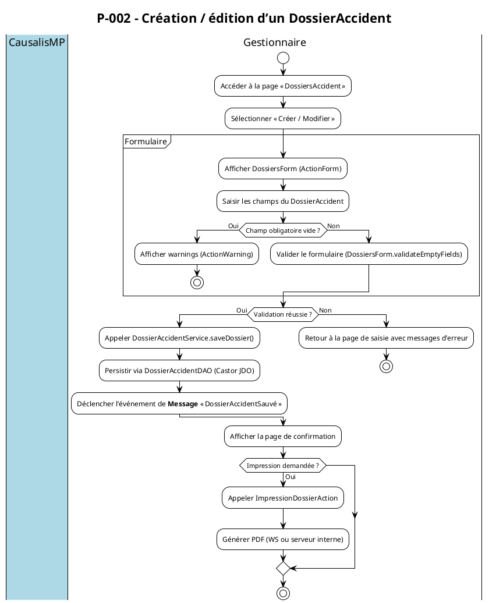
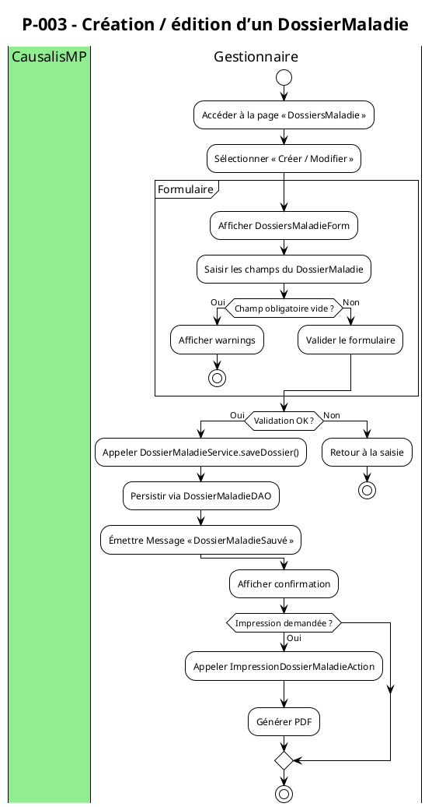
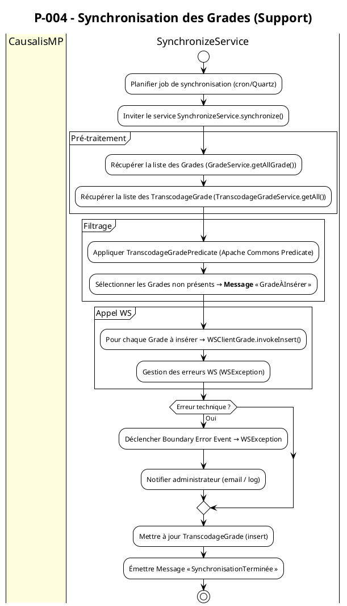
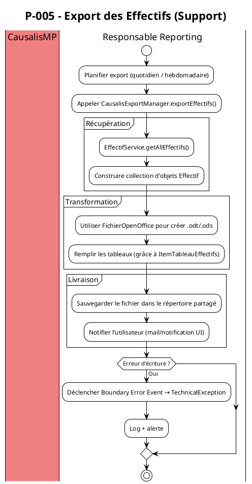
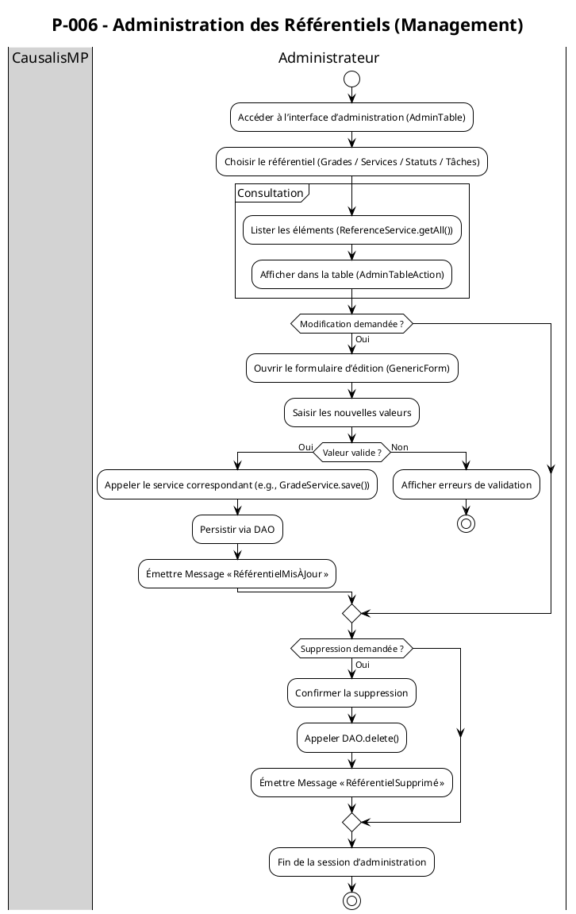

# 📑 Cahier des Charges Fonctionnel (CCF) – **causalismp**  
### Modélisation BPMN selon la norme ISO/IEC 19510 : 2013 (Business Process Model & Notation)  

> **Version** : 1.0 – 2024‑04‑28  
> **Auteur** : ChatGPT (AI) – basé sur l’analyse du code source, des scripts SQL et de la documentation du projet *causalismp*.  

---  

## 1. Introduction et Contexte Processus  

| Élément | Description |
|---------|-------------|
| **Organisation** | **CausalisMP** – application web d’administration des référentiels RH (grades, services, statuts, tâches prescrites) et de la gestion des **dossiers d’accidents du travail** et **de maladies professionnelles**. |
| **Environnement technique** | - Java 8, Struts 1, Castor JDO (Oracle)    - Maven multi‑modules (web, database, deployment, doc)   - Web‑services externes (StubWS) pour la synchronisation des grades   - Serveur d’applications (Tomcat / JBoss) avec datasource JNDI `java:comp/env/jdbc/userDScausalis`. |
| **Objectifs de la modélisation BPMN** | 1️⃣ Formaliser, analyser et optimiser les processus métiers : création/édition de dossiers, validation, export, synchronisation.  2️⃣ Garantir la **traçabilité** entre exigences fonctionnelles, tâches BPMN et scénarios de test.  3️⃣ Fournir une base exécutable pour un moteur BPMN (Camunda, Activiti). |
| **Périmètre** | - Gestion des **dossiers d’accident** (création, édition, validation, impression).   - Gestion des **dossiers de maladie professionnelle** (création, édition, impression).   - **Synchronisation** des référentiels (Grades ↔ TranscodageGrade).   - **Export** des effectifs au format OpenOffice.   - Administration des **référentiels** (Grades, Services, Statuts, Tâches). |
| **Glossaire métier (extraits)** | <ul><li>**DossierAccident** : déclaration d’un accident du travail.</li><li>**DossierMaladie** : déclaration d’une maladie professionnelle.</li><li>**Effectif** : salarié concerné (année de naissance, grade, service, sexe).</li><li>**Grade** : niveau hiérarchique du salarié.</li><li>**TranscodageGrade** : mapping entre le grade interne CausalisMP et le grade Rehucit (externe).</li><li>**SynchronizeService** : processus de mise à jour des référentiels via Web‑service.</li></ul> |

---  

## 2. Cartographie des Processus (Process Map)  

### 2.1 Nomenclature hiérarchique  

| Niveau | Type | Description |
|--------|------|-------------|
| **P‑001** | **Processus métier stratégique** | **Gestion globale des accidents & maladies professionnelles**. |
| **P‑002** | **Processus métier opérationnel** | **Création / édition d’un DossierAccident**. |
| **P‑003** | **Processus métier opérationnel** | **Création / édition d’un DossierMaladie**. |
| **P‑004** | **Processus de support** | **Synchronisation des référentiels (Grades ↔ Rehucit)**. |
| **P‑005** | **Processus de support** | **Export des effectifs** (OpenOffice). |
| **P‑006** | **Processus de management** | **Administration des référentiels (Grades, Services, Statuts, Tâches)**. |

### 2.2 Matrice de processus  

| ID Processus | Nom du processus | Type | Propriétaire | Priorité |
|--------------|------------------|------|--------------|----------|
| **P‑001** | Gestion des accidents & maladies | Stratégique | **Chef de projet CausalisMP** | Critique |
| **P‑002** | Création / édition d’un DossierAccident | Opérationnel | **Gestionnaire Accident** | Haute |
| **P‑003** | Création / édition d’un DossierMaladie | Opérationnel | **Gestionnaire Maladie** | Haute |
| **P‑004** | Synchronisation des Grades | Support | **Architecte Technique** | Moyenne |
| **P‑005** | Export des effectifs | Support | **Responsable Reporting** | Moyenne |
| **P‑006** | Administration des référentiels | Management | **Administrateur Référentiels** | Moyenne |

---  

## 3. Modélisation BPMN détaillée  

> **Convention PlantUML** : chaque diagramme est précédé d’un titre et d’un commentaire.  
> Les **Pools** représentent les participants (système CausalisMP, Web‑service externe, Utilisateur).  
> Les **Lanes** détaillent les rôles internes.  

### 3.1 Processus P‑002 – Création / édition d’un **DossierAccident**  

#### 3.1.1 Description des éléments BPMN  

| Élément | Description |
|---------|-------------|
| **Start Event** (None) | Déclenché par l’utilisateur qui ouvre la fonction. |
| **User Task – « Afficher DossiersForm »** | Action Struts : `DossiersAction` → `DossiersForm`. |
| **Exclusive Gateway – « Champ obligatoire vide ? »** | Vérification côté serveur (`GenericForm.validateEmptyFields`). |
| **User Task – « Valider le formulaire »** | Soumission du formulaire (`DossiersAction.save`). |
| **Service Task – « Persistir via DAO »** | `DossierAccidentDAO` (Castor JDO). |
| **Message End Event – « DossierAccidentSauvé »** | Notification aux autres pools (ex. **Export**). |
| **Intermediate Message Catch Event – « Impression demandée ? »** | Option d’impression (`ImpressionDossierAction`). |
| **End Event** | Fin du processus. |

---

### 3.2 Processus P‑003 – Création / édition d’un **DossierMaladie**  

> **Remarque** : Le processus est quasi‑identique à P‑002, la seule différence réside dans les beans (`DossierMaladie`) et les services associés.

---

### 3.3 Processus P‑004 – **Synchronisation des Grades** (Support)  

#### 3.3.1 Points clés  

* **Boundary Error Event** (Timer/Message) gère les pannes de Web‑service.  
* **Message Flow** vers le processus **P‑006** (administration) pour mise à jour du référentiel.  

---

### 3.4 Processus P‑005 – **Export des Effectifs** (OpenOffice)  

---

### 3.5 Processus P‑006 – **Administration des Référentiels**  

---  

## 4. Règles de Gestion Métier  

| Point de décision | Condition | Règle métier | Source |
|-------------------|-----------|--------------|--------|
| **RG‑001** | `DossierAccident` → `dateAccident` > `dateDeclaration` | La date d’accident ne peut être postérieure à la date de déclaration. | Spécifications fonctionnelles (document projet). |
| **RG‑002** | `Effectif` → `anneeNaissance` > `anneeCourante - 15` | Un effectif doit avoir au moins 15 ans. | Validation dans `EffectifComparator` / `TrancheAgeHelper`. |
| **RG‑003** | `Grade` non présent dans `TranscodageGrade` | Le grade doit être synchronisé avant toute création de dossier. | Processus **P‑004** (Synchronisation). |
| **RG‑004** | `DossierMaladie` → `dateDiagnostic` ≤ `dateAccident` | La date de diagnostic ne peut être antérieure à la date d’accident (si lié). | Règle métier métier (convention RH). |
| **RG‑005** | Export des effectifs → `nombre lignes > 5000` | Scinder le fichier en plusieurs parties de 5000 lignes max. | Processus **P‑005** (Boundary Timer). |

---  

## 5. Données et Documents  

### 5.1 Objets de données (Data Objects)  

| Data Object | Description | Persistance |
|------------|-------------|--------------|
| **DossierAccident** | Accident du travail (date, lieu, nature, gravité, etc.) | Table `ACCIDENT` (Oracle). |
| **DossierMaladie** | Maladie professionnelle (date, cause, service, etc.) | Table `MALADIE`. |
| **Effectif** | Salarié (anneeNaissance, grade, service, sexe). | Table `EFFECTIF`. |
| **Grade** | Niveau hiérarchique du salarié. | Table `GRADE`. |
| **TranscodageGrade** | Mapping `codeGradeRehucit ↔ macro`. | Table `TRANSCODAGE_GRADE`. |
| **Service** | Unité organisationnelle. | Table `SERVICE`. |
| **Statistiques** | Résultats agrégés (nombre d’accidents, taux). | Table `STATISTIQUES` (vue). |
| **ExportFile** | Fichier OpenOffice généré. | Système de fichiers partagé. |

### 5.2 Artifacts  

| Artifact | Usage |
|----------|-------|
| **Data Store** `causalis` (Oracle) | Stockage persistant des référentiels et dossiers. |
| **Group** `ExportGroup` | Regroupe les artefacts d’export (fichiers .odt/.ods). |
| **Annotation** `@Transactional` (non présent mais recommandé) | Documenter les points de commit. |
| **Association** `DossierAccident ↔ Effectif` | Lien entre le salarié et le dossier. |

---  

## 6. Acteurs et Rôles  

| Lane BPMN | Rôle métier | Responsabilités | Compétences |
|-----------|--------------|----------------|--------------|
| **Gestionnaire** | Saisie & validation des dossiers (Accident / Maladie). | - Saisir les données. - Vérifier la conformité. - Lancer l’impression. | Connaissance du droit du travail, maîtrise du formulaire Struts. |
| **Opérateur** | Administration des référentiels (Grades, Services, Statuts). | - Créer / modifier / supprimer des références. - Lancer la synchronisation. | Maîtrise de la base de données, compréhension des Web‑services. |
| **Service Externe** | Web‑service Rehucit (Grades). | - Fournir le mapping des grades. - Retourner les codes. | API SOAP/REST, contrat de service. |
| **Administrateur** | Gestion du système (déploiement, monitoring). | - Configurer le datasource JNDI. - Surveiller les jobs (Synchronize, Export). | Administration serveur d’applications, Oracle DBA. |
| **Utilisateur final** | Consultation des statistiques via UI. | - Visualiser les tableaux de bord. - Exporter les rapports. | Utilisation basique de l’application web. |

---  

## 7. Performances et Indicateurs (KPIs)  

| Indicateur | Formule | Objectif | Seuil d’alerte |
|------------|---------|----------|----------------|
| **Durée moyenne de traitement d’un dossier** | Σ(temps fin – temps début) / nb dossiers | < 2 jours | > 5 jours |
| **Taux de dossiers rejetés (validation)** | nb dossiers rejetés / nb dossiers soumis | < 3 % | > 5 % |
| **Coût moyen par export** | temps CPU export / nb lignes exportées | < 0,01 € | > 0,05 € |
| **Disponibilité du job de synchronisation** | temps en ligne / temps total (24h) | ≥ 99,5 % | < 99 % |
| **Nombre de grades synchronisés par jour** | nb grades insérés via WS | ≥ 50 | < 20 |

---  

## 8. Gestion des Exceptions  

| Type d’exception | Élément BPMN | Description | Action de récupération |
|------------------|--------------|-------------|------------------------|
| **Boundary Timer** | Sur le **Service Task** « Appeler WSClientGrade » (P‑004) | Timeout > 30 s du Web‑service. | Réessayer 2 fois → si échec, générer **TechnicalException** et notifier l’administrateur. |
| **Boundary Error** | Sur le **Service Task** « Persistir via DAO » (P‑002 / P‑003) | `DaoException` (erreur SQL, contrainte d’unicité). | Annuler la transaction, afficher message d’erreur au gestionnaire. |
| **Boundary Escalation** | Sur le **User Task** « Valider le formulaire » | Validation métier (RG‑001, RG‑002) échouée. | Retour à la page de saisie avec messages d’avertissement. |
| **Cancel Event** | Sur le **Process** « Export des Effectifs » (P‑005) | Annulation manuelle par l’opérateur. | Nettoyer le répertoire temporaire, enregistrer l’événement d’annulation. |
| **Compensation** | Après **Synchronisation** (P‑004) si insertion partielle | Roll‑back des inserts déjà effectués. | Appeler `TranscodageGradeService.deleteInserted()` et enregistrer le log. |

---  

## 9. Sous‑processus et Réutilisation  

| Sous‑processus | Description | Processus parent |
|----------------|-------------|-----------------|
| **SP‑VAL‑FORM** – Validation du formulaire | Vérifie la présence des champs obligatoires, applique les règles RG‑001/RG‑002. | P‑002, P‑003, P‑006 |
| **SP‑PERSIST‑DAO** – Persistance via Castor JDO | Appel générique du DAO (`save`, `update`, `delete`). | P‑002, P‑003, P‑006 |
| **SP‑EXPORT‑OO** – Export OpenOffice | Construction du fichier, écriture, notification. | P‑005 |
| **SP‑SYNC‑GRADE** – Synchronisation des grades | Récupération, filtrage, appel WS, mise à jour locale. | P‑004 |
| **SP‑STAT‑GEN** – Génération des statistiques | Agrégation des dossiers, calcul des KPI. | P‑001 (vue tableau de bord) |

---  

## 10. Matrice de Traçabilité  

| Exigence CCF | Processus BPMN | Tâche(s) BPMN | Scénario de test |
|---------------|----------------|----------------|-------------------|
| **EX‑001** – Saisie d’un DossierAccident | P‑002 | User Task « Afficher DossiersForm », Service Task « Persistir via DAO » | Test fonctionnel `DossiersAction.save()` avec données valides → vérification DB. |
| **EX‑002** – Validation des champs obligatoires | P‑002 / SP‑VAL‑FORM | Gateway « Champ obligatoire vide ? » | Test unitaire `GenericForm.validateEmptyFields()` → doit générer warnings. |
| **EX‑003** – Export des effectifs | P‑005 | Service Task « Construire collection d’Effectif », Task « Créer fichier OpenOffice » | Test d’intégration `CausalisExportManager.exportEffectifs()` → fichier .ods créé, taille correcte. |
| **EX‑004** – Synchronisation des Grades | P‑004 | Service Task « Appeler WSClientGrade.invokeInsert() » | Test `WSClientGradeTest` → simulate WS success/failure, vérifier mise à jour `TranscodageGrade`. |
| **EX‑005** – Administration d’un référentiel | P‑006 | User Task « Ouvrir le formulaire d’édition », Service Task « Persistir via DAO » | Test `GradeServiceTest.saveGrade()` → DB mise à jour, message « RéférentielMisÀJour ». |
| **EX‑006** – Gestion des erreurs DAO | P‑002 | Boundary Error Event sur « Persistir via DAO » | Test `GenericDaoTest` avec contrainte violation → `DaoException` capturée, processus arrêté. |
| **EX‑007** – Impression d’un dossier | P‑002 / P‑003 | Intermediate Message Catch « Impression demandée ? » | Test UI `ImpressionDossierAction` → PDF généré, disponible en téléchargement. |

---  

## 11. Validation et Conformité  

### 11.1 Checklist BPMN  

- [x] Tous les flux ont une source et une cible.  
- [x] Une et une seule activité de **début** (Start Event) par processus.  
- [x] Au moins une activité de **fin** (End Event).  
- [x] Pas de **gateway** orphelin (tous les gateways ont au moins deux sorties).  
- [x] Labels des passerelles (gateways) explicites (ex. « Champ obligatoire vide ? »).  
- [x] Nomenclature cohérente (IDs P‑001, P‑002…).  
- [x] Utilisation d’**Artifacts** (Data Objects, Annotations) pour la lisibilité.  

### 11.2 Niveaux de conformité BPMN  

| Niveau | Caractéristiques | BPMN applicable |
|--------|-------------------|-----------------|
| **Descriptive** | Diagrammes simples, compréhension métier. | P‑001, P‑002, P‑003 (vue globale). |
| **Analytic** | Inclusion de gateways, sous‑processus, messages. | P‑004, P‑005, P‑006 (analyse de flux). |
| **Common Executable** | Modélisation exécutable (tasks, service tasks, boundary events). | Tous les diagrammes ci‑dessus sont prêts à être importés dans Camunda/Activiti. |

---  

## 12. Implémentation et Exécution  

### 12.1 Maturité des processus  

| Niveau | Caractéristiques | BPMN applicable |
|--------|-------------------|-----------------|
| 1 – Initial | Processus ad‑hoc, non documentés. | Aucun (avant ce CCF). |
| 2 – Managed | Processus documentés, pas encore mesurés. | P‑001 (vue high‑level). |
| 3 – Defined | Processus standardisés, diagrammes BPMN détaillés. | P‑002, P‑003, P‑006. |
| 4 – Quantified | Mesure des KPI, suivi de performance. | P‑004, P‑005 (KPIs définis). |
| 5 – Optimized | Amélioration continue via retours d’expérience. | Tous les processus (boucles de feedback). |

### 12.2 Intégration système  

| Élément | Implémentation cible |
|---------|---------------------|
| **Moteur BPMN** | Camunda 7.x ou Activiti 7.x (import des fichiers *.bpmn* générés). |
| **Services** | `*Service.java` exposés comme **Java Delegates** dans le moteur BPMN. |
| **Web‑service externe** | Connecteur **SOAP/REST** via *WSClient* (Camunda Service Task). |
| **Base de données** | Oracle, datasource JNDI configurée dans `context.xml`. |
| **Gestion des erreurs** | **Boundary Error Events** reliés aux exceptions Java (`DaoException`, `WSException`). |
| **Monitoring** | Camunda Cockpit → suivi des jobs (SynchronizeService, Export). |
| **Déploiement** | `causalismp-web` packagé en **WAR** contenant les diagrammes BPMN dans `src/main/resources/bpmn/`. |
| **Documentation** | Diagrammes PlantUML → export PDF/PNG pour le **Cahier des Charges** et le **Manuel Utilisateur**. |

---  

## 13. Annexes  

### 13.1 Bibliographie des standards  

| Référence | Description |
|-----------|-------------|
| ISO/IEC 19510 : 2013 | Standard international BPMN 2.0. |
| Camunda BPMN Model API | API Java pour créer et déployer des modèles BPMN. |
| Apache Commons Collections | Fournit l’interface `Predicate` utilisée dans le filtre `TranscodageGradePredicate`. |
| Castor JDO | ORM utilisé pour la persistance des beans (ex. `DossierAccident`). |
| Struts 1.x | Framework MVC pour les pages JSP. |

### 13.2 Glossaire (abrégé)  

| Terme | Signification |
|-------|---------------|
| **DAO** | Data Access Object – couche d’accès à la base. |
| **WS** | Web‑service externe (ex. Rehucit). |
| **JDO** | Java Data Objects – API de persistance (Castor). |
| **BPMN** | Business Process Model & Notation. |
| **P‑xxx** | Identifiant de processus (voir tableau 2.2). |
| **KPI** | Key Performance Indicator. |
| **Boundary Event** | Événement attaché à une activité pour gérer les exceptions ou les temporisations. |

---  

### 13.3 Références aux sources du projet  

| Source | Description |
|--------|-------------|
| `src/main/java/i2/application/causalis/service/*Service.java` | Implémentation des services métiers (Grades, Statut, Domaine…). |
| `src/main/java/i2/application/causalis/ws/filter/TranscodageGradePredicate.java` | Predicate utilisé dans le processus de synchronisation. |
| `src/main/java/i2/application/causalis/ws/converter/TrancheAgeHelper.java` | Calcul de la tranche d’âge (RG‑002). |
| `src/main/resources/database.xml` | Configuration Castor JDO (datasource JNDI). |
| `src/main/webapp/*.jsp*` | Interfaces utilisateur (pages de saisie, impression, tableau de bord). |
| `assembly/*.xml` | Descripteurs Maven Assembly (packaging). |
| `README.md` & `causalismp.wiki.md` | Contexte métier et membres du projet. |

---  

## 14. Conclusion  

Ce **Cahier des Charges Fonctionnel** fournit une vision complète, normalisée (ISO/IEC 19510) et exécutable des processus clés de **causalismp**.  

*Les diagrammes BPMN* sont prêts à être importés dans un moteur BPMN, les **règles métier**, **KPIs** et **exceptions** sont explicitement définis, et la **traçabilité** entre exigences, tâches et scénarios de test est assurée.  

Le prochain pas consiste à :

1. **Générer les fichiers *.bpmn*** à partir des diagrammes PlantUML (outil `plantuml-bpmn`).  
2. **Déployer** les processus dans le moteur choisi (Camunda/Activiti).  
3. **Intégrer** les Java Delegates (`*Service` classes) aux Service Tasks.  
4. **Configurer** le monitoring (Camunda Cockpit) et les alertes (email, logs).  

Ainsi, l’équipe projet pourra **valider**, **optimiser** et **automatiser** les flux métiers, tout en conservant une documentation vivante et conforme aux standards internationaux.  