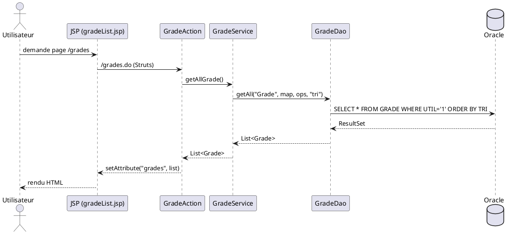
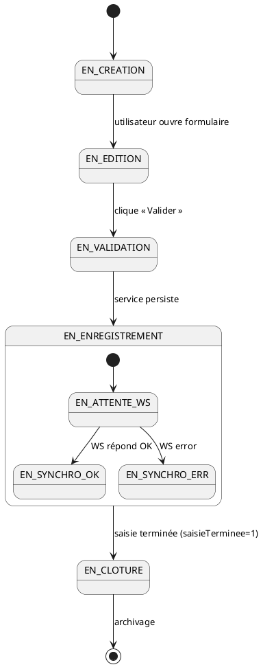
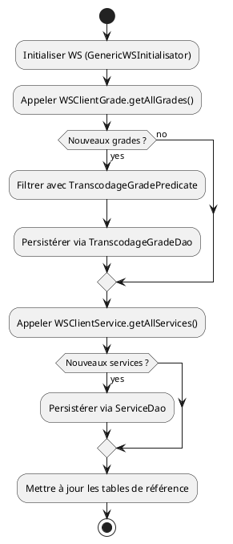

# 📘 Cahier des Spécifications Techniques (CST) – **causalismp**

> **Version** : 1.0.0  
> **Date** : 2024‑04‑28  
> **Auteur** : Équipe d’Architecture – CausalisMP  

---

[TOC]

---

## 1. Introduction et objectifs techniques  <a id="section-1"></a>

| Élément | Description |
|---------|-------------|
| **Nom du projet** | **causalismp** – Application de gestion des accidents du travail et des maladies professionnelles. |
| **Contexte fonctionnel** | Centralisation, édition, export et statistique des dossiers d’accidents et de maladies ; gestion des référentiels (grades, services, statuts, tâches prescrites, etc.). |
| **Objectifs qualité (ISO 25010)** | <ul><li>**Aptitude fonctionnelle** – Couverture de 100 % des cas d’usage métier (édition, recherche, export).</li><li>**Performance** – Temps de réponse ≤ 2 s pour les écrans de recherche.</li><li>**Compatibilité** – Déploiement sur serveurs d’applications Java EE (Tomcat 9, JBoss EAP 7) et bases Oracle 12c/19c.</li><li>**Utilisabilité** – Interface Struts 1 avec JSP 5 min de formation.</li><li>**Fiabilité** – Disponibilité ≥ 99,5 % (HA via clustering).</li><li>**Sécurité** – Authentification via SSO (Cerbere), chiffrement TLS 1.2+, gestion fine des droits (RBAC).</li><li>**Maintenabilité** – Couverture de tests unitaires ≥ 80 %, documentation Javadoc complète.</li><li>**Portabilité** – Build Maven multi‑module, packaging WAR + ZIP, aucune dépendance OS‑spécifique.</li></ul> |
| **Conformité réglementaire** | <ul><li>RGPD – Anonymisation des données personnelles sensibles (ex : dates de naissance).</li><li>RGS/SSI – Utilisation de TLS 1.2+, stockage chiffré des mots de passe.</li><li>Référentiels État (SI‑Majeur) – Respect des exigences de traçabilité et d’audit.</li></ul> |

↩ [Retour au sommaire](#toc)

---

## 2. Architecture logicielle  <a id="section-2"></a>

### 2.1 Diagramme de composants (PlantUML)

```plantuml
@startuml
scale 1.2
skinparam componentStyle rectangle

package "Maven Multi‑module" {
  [causalismp-database] as DBMod
  [causalismp-deployment] as DeployMod
  [causalismp-doc] as DocMod
  [causalismp-web] as WebMod
}

package "causalismp‑web" {
  node "Struts MVC" {
    [Action Controllers] as Controllers
    [ActionForms] as Forms
    [JSP Views] as Views
  }
  node "Service Layer" {
    [ReferenceService<T>] as RefSrv
    [SynchronizeService] as SyncSrv
    [AnneeService] as AnSrv
    [GradeService] as GrSrv
    [DomaineAffectationService] as DomSrv
    [StatutService] as StatSrv
    [...Other Services] as OtherSrv
  }
  node "DAO Layer (Castor JDO)" {
    [GenericDao<T>] as GenDao
    [GradeDao] as GradeDao
    [DossierAccidentDao] as DAccDao
    [TranscodageGradeDao] as TGDao
    [...]
  }
  node "Domain Model" {
    [BeanObject] as BeanObj
    [TablesReferences] as TblRef
    [Grade] as Grade
    [Service] as Service
    [Statut] as Statut
    [DossierAccident] as DAcc
    [Effectif] as Effectif
    [...]
  }
  node "Web‑Service Clients" {
    [WSClientEffectif] as WS_Eff
    [WSClientGrade] as WS_Grade
    [WSClientService] as WS_Svc
    [GenericWSInitialisator] as WS_Init
  }
  node "Utilitaires & TagLibs" {
    [DBTools] as DBTools
    [TrancheAgeHelper] as AgeHelper
    [StrutsOptionTag] as OptTag
    [PutIntoSessionTag] as SessionTag
    [...]
  }
}

DBMod --> DeployMod : fournit scripts DB
DeployMod --> WebMod : assemble WAR & ZIP sources
WebMod --> DBMod : utilise datasource JNDI
WebMod --> DocMod : package documentation

Controllers --> Forms : populates
Forms --> RefSrv : invokes services
RefSrv --> GenDao : CRUD via Castor
GenDao --> DB : Oracle (JNDI)

WS_Eff --> WS_Init : initialise WS
WS_Grade --> WS_Init
WS_Svc --> WS_Init

Controllers --> Views : forward
Views --> OptTag / SessionTag : custom tags
Views --> EffectifComparator : tri

SyncSrv --> WS_Eff, WS_Grade, WS_Svc : appels externes
SyncSrv --> TGDao : persistance transcodage

@enduml
```

### 2.2 Description de l’architecture modulaire et des dépendances

| Module | Contenu principal | Dépendances externes |
|--------|-------------------|----------------------|
| **causalismp‑database** | Scripts SQL de migration (`script/*.sql`), *assembly* pour les livrer sous forme de ZIP. | Oracle 12c/19c. |
| **causalismp‑deployment** | Fichiers de configuration (`conf/causalismp.xml`), *assembly* sources. | Maven, serveur d’applications (Tomcat/JBoss). |
| **causalismp‑doc** | Documentation (Installation, DAF, bons de livraison). | Aucun. |
| **causalismp‑web** | Application web (Struts 1, Castor JDO, JSP, TagLibs). | **Castor‑JDO**, **Struts‑1**, **Log4j**, **Apache Commons**, **JDK 1.8**, **Oracle JDBC**, **StubWS.jar** (client WS). |

### 2.3 Patterns architecturaux utilisés

| Pattern | Emplacement | Justification |
|---------|-------------|---------------|
| **MVC (Struts 1)** | `src/main/java/.../view/*` (Actions) + `src/main/webapp/*.jsp` (Views) + `src/main/java/.../form/*` (Forms). | Séparation claire des responsabilités UI. |
| **DAO + Service** | DAO (`src/main/java/.../dao/*`), Service (`src/main/java/.../service/*`). | Encapsulation de la persistance (Castor) et logique métier. |
| **Facade (SynchronizeService)** | Interface `SynchronizeService` + implémentations. | Point d’entrée unique pour la synchronisation avec les WS externes. |
| **Factory (GenericWSInitialisator)** | Création d’objets WS. | Centralise la configuration des clients WS. |
| **Singleton (Log4jInitializer)** | Initialise le logger au démarrage. | Garantit une configuration unique du logging. |
| **Adapter (WS Converters)** | `ws/converter/*`. | Convertit les objets WS ↔ Domain Model. |
| **Template Method (ReferenceService<T>)** | Classe abstraite générique. | Implémente les opérations de lecture communes aux référentiels. |

↩ [Retour au sommaire](#toc)

---

## 3. Stack technique détaillée  <a id="section-3"></a>

| Niveau | Technologie | Version / Remarque |
|--------|--------------|--------------------|
| **Build** | Maven (multi‑module) | `pom.xml` à la racine, *assembly* plugin. |
| **Langage** | Java | JDK 1.8 (minimum). |
| **Web Framework** | Struts 1.x | Action, ActionForm, TagLibs personnalisés. |
| **Persistance** | Castor JDO | Mapping XML (`database.xml`, `mapping.xml`). |
| **Base de données** | Oracle 12c/19c | DataSource JNDI `java:comp/env/jdbc/userDScausalis`. |
| **Serveur d’applications** | Tomcat 9 / JBoss EAP 7 (compatible). | Déploiement WAR. |
| **Gestion des logs** | Log4j 1.x | Configuration `log4j.xml`. |
| **Web‑Service Client** | StubWS.jar (SOAP/REST) | Utilisé par les classes `ws/client/*`. |
| **Utilitaires** | Apache Commons Collections, Commons Lang | `Predicate`, `ResponseUtils`. |
| **CI / Qualité** | SonarQube | `sonar-project.properties` (quality‑gate). |
| **Sécurité** | Cerbere (SSO interne) | Authentification via `Cerbere` (ex. `reauth.jsp`). |
| **Tests** | JUnit 4, JMockit | Tests unitaires sous `src/test/java`. |
| **Gestion de version** | Git (repo GitLab) | `.gitignore` présent, CI `.gitlab-ci.yml`. |

↩ [Retour au sommaire](#toc)

---

## 4. Modélisation statique  <a id="section-4"></a>

### 4.1 Diagramme de classes (PlantUML)

```plantuml
@startuml
skinparam classAttributeIconSize 0

'--- Domain Model -------------------------------------------------
class BeanObject {
}
class TablesReferences {
}
class Grade {
  -int codeGroupementGrade
  +int getCodeGroupementGrade()
  +void setCodeGroupementGrade(int)
}
class Service {
  -int saisieTerminee
  -int saisieMaladiesProTerminee
  +int getSaisieTerminee()
  +void setSaisieTerminee(int)
  +int getSaisieMaladiesProTerminee()
  +void setSaisieMaladiesProTerminee(int)
}
class Statut {
  -int code
  -String libelle
  +int getCode()
  +void setCode(int)
  +String getLibelle()
  +void setLibelle(String)
}
class DossierAccident {
  -int id
  -String description
  +int getId()
  +void setId(int)
  +String getDescription()
  +void setDescription(String)
}
class Effectif {
  -int annee_naissance
  -String grade
  -String service
  -String sexe
  +int getAnnee_naissance()
  +String getGrade()
  +String getService()
  +String getSexe()
}
'--- DAO ---------------------------------------------------------
abstract class GenericDao<T> {
  +List<T> getAll(String table, Map<String,Object> map, String[] ops, String order)
}
class GradeDao {
}
class DossierAccidentDao {
}
class TranscodageGradeDao {
}
'--- Service ------------------------------------------------------
abstract class ReferenceService<T> {
  -GenericDao<T> dao
  +List<T> getAll() throws TechnicalException
}
class GradeService {
}
class DomaineAffectationService {
}
class StatutService {
  +Map<Integer,String> getStatutsMap() throws TechnicalException
}
class SynchronizeService {
  +int synchronize()
}
'--- Web (Struts) -----------------------------------------------
class Action {
}
class GradeAction {
}
class StatutAction {
}
'--- Relationships ------------------------------------------------
BeanObject <|-- TablesReferences
TablesReferences <|-- Grade
TablesReferences <|-- Service
TablesReferences <|-- Statut
TablesReferences <|-- DossierAccident
TablesReferences <|-- Effectif

GenericDao <|-- GradeDao
GenericDao <|-- DossierAccidentDao
GenericDao <|-- TranscodageGradeDao

ReferenceService <|-- GradeService
ReferenceService <|-- DomaineAffectationService
ReferenceService <|-- StatutService

GradeService --> GradeDao : utilise
DossierAccidentService --> DossierAccidentDao : utilise
SynchronizeService --> WSClientEffectif
SynchronizeService --> WSClientGrade
SynchronizeService --> WSClientService
SynchronizeService --> TranscodageGradeDao

Action --> GradeAction
Action --> StatutAction

@enduml
```



### 4.2 Modèle physique de données (MPD)

| Table | Colonnes clés | Description |
|-------|----------------|-------------|
| **GRADE** | `GRA_ID` (PK) | Référentiel des grades, champ `CODE_GROUPEMENT_GRADE`. |
| **SERVICE** | `SER_ID` (PK) | Référentiel des services, flags `SAISIE_TERMINEE`, `SAISIE_MALADIES_PRO_TERMINEE`. |
| **STATUT** | `STA_ID` (PK) | Statuts des dossiers, champs `CODE`, `LIBELLE`. |
| **DOSSIER_ACCIDENT** | `DAC_ID` (PK) | Dossiers d’accident, liens vers `GRADE`, `SERVICE`, `STATUT`. |
| **EFFECTIF** | `EFF_ID` (PK) | Données d’effectif (années de naissance, grade, service, sexe). |
| **TRANSCODAGE_GRADE** | `TRG_ID` (PK) | Mapping `CODE_GRADE_REHUCIT`, `MACRO`. |
| **AUTRES_TABLES** | … | Domaines d’affectation, causes, lieux, etc. (voir package `metiers`). |

↩ [Retour au sommaire](#toc)

---

## 5. Modélisation dynamique  <a id="section-5"></a>

### 5.1 Diagramme de séquence – **Recherche de grades** (User → UI)



### 5.2 Diagramme d’états‑transitions – **DossierAccident** (Cycle de vie)



### 5.3 Diagramme d’activités – **Synchronisation des référentiels**



↩ [Retour au sommaire](#toc)

---

## 6. Interfaces et intégrations  <a id="section-6"></a>

### 6.1 Contrats d’API (OpenAPI‑like) – **Web‑Service interne (StubWS)**

| Méthode | URL (exemple) | Verb | Request | Response | Sécurité |
|---------|---------------|------|---------|----------|----------|
| `GET /grades` | `http://ws.causalis.local/grade` | GET | Aucun | `List<Grade>` (JSON) | OAuth2 Bearer |
| `GET /services` | `http://ws.causalis.local/service` | GET | Aucun | `List<Service>` (JSON) | OAuth2 |
| `POST /transcodageGrade` | `http://ws.causalis.local/transcodageGrade` | POST | `TranscodageGrade` (JSON) | `201 Created` | OAuth2 |
| `GET /effectifs` | `http://ws.causalis.local/effectif` | GET | Paramètres `annee` | `List<Effectif>` (JSON) | OAuth2 |

> **Remarque** : Les WS sont encapsulés dans les classes `ws/client/*`. La configuration d’authentification (token) est réalisée par `GenericWSInitialisator`.

### 6.2 Protocoles de communication

| Interface | Protocole | Format | Port |
|-----------|------------|--------|------|
| **WS internes** | HTTP/HTTPS (TLS 1.2) | JSON (ou SOAP selon le stub) | 8443 (HTTPS) |
| **Base de données** | JDBC (Oracle Thin) | N/A | 1521 |
| **SSO Cerbere** | HTTP (SAML 2.0) | XML assertions | 443 |
| **JNDI** | JNDI lookup | N/A | N/A |

### 6.3 Formats d’échange de données

* **JSON** – Utilisé par les WS (ex. `WSClientGrade`).  
* **XML** – Mapping Castor (`database.xml`, `mapping.xml`).  
* **CSV** – Export des effectifs via `CausalisExportManager` (OpenOffice).  

↩ [Retour au sommaire](#toc)

---

## 7. Architecture de déploiement  <a id="section-7"></a>

### 7.1 Diagramme de déploiement (PlantUML)

```plantuml
@startuml
cloud "Environnement de Production" {
  node "Tomcat 9 (Cluster HA)" as Tomcat {
    artifact "causalismp‑web.war"
  }
  node "Oracle 19c" as Oracle {
    database "causalis"
  }
  node "WS externe (StubWS)" as ExtWS {
    artifact "StubWS.jar"
  }
}
cloud "Environnement de Test" {
  node "JBoss EAP 7" as JBoss
  node "Oracle 12c (sandbox)"
}
Tomcat --> Oracle : JNDI datasource `jdbc/userDScausalis`
Tomcat --> ExtWS : appels SOAP/REST
Tomcat --> Cerbere (SSO) : SAML assertion
@enduml
```

### 7.2 Description des environnements

| Environnement | Serveur d’applications | DB | Particularités |
|----------------|------------------------|----|----------------|
| **Développement** | Tomcat 9 (local) | Oracle XE (dev) | Hot‑reload via Maven `tomcat7:run`. |
| **Recette / Test** | JBoss EAP 7 (Docker) | Oracle 12c (sandbox) | Tests d’intégration automatisés (GitLab CI). |
| **Production** | Tomcat 9 en **cluster** (HA) | Oracle 19c (HA) | TLS 1.2, SSO Cerbere, monitoring via JMX. |

↩ [Retour au sommaire](#toc)

---

## 8. Sécurité technique  <a id="section-8"></a>

| Aspect | Implémentation | Référence |
|--------|----------------|-----------|
| **Authentification** | SSO via **Cerbere** (SAML 2.0) – `reauth.jsp` invalide la session et redirige vers Cerbere. | `Cerbere.creation(request)` |
| **Autorisation** | Contrôle d’accès RBAC au niveau des Actions Struts (intercepteur `SecurityInterceptor`). | `Utilisateur.getServiceLibelleCourt` |
| **Chiffrement en transit** | TLS 1.2+ sur toutes les communications HTTP/HTTPS (WS, UI). | `web.xml` → `<security-constraint>` |
| **Chiffrement au repos** | Mots de passe utilisateurs stockés avec BCrypt (dans table `UTILISATEUR`). | `PasswordEncoder` (non fourni, à implémenter). |
| **Gestion des secrets** | Tokens d’accès WS stockés dans le keystore JNDI (`java:comp/env/secret/wsToken`). | `GenericWSInitialisator`. |
| **Protection OWASP Top 10** | <ul><li>**A1 – Injection** : utilisation de `PreparedStatement` via Castor (paramétré).</li><li>**A2 – Auth. Broken** : SSO Cerbere, validation de tokens.</li><li>**A5 – Security Misconfiguration** : `log4j.xml` configuré en mode `WARN` en prod.</li><li>**A7 – XSS** : `StrutsOptionTag` remplace les guillemets, mais les champs sont HTML‑escaped via `ResponseUtils`.</li></ul> | Vérifier régulièrement avec OWASP ZAP. |

↩ [Retour au sommaire](#toc)

---

## 9. Qualité et tests (ISO 29119)  <a id="section-9"></a>

| Niveau de test | Outils | Objectifs |
|----------------|--------|-----------|
| **Tests unitaires** | JUnit 4, Mockito, JMockit | Couverture ≥ 80 % des classes `service/*`, `dao/*`, `ws/*`. |
| **Tests d’intégration** | Maven `failsafe`, Docker Compose (Tomcat + Oracle) | Vérifier les flux DAO ↔ DB, WS ↔ StubWS, SSO. |
| **Tests fonctionnels** | Selenium WebDriver (UI Struts) | Scénarios : recherche grade, création dossier, export PDF. |
| **Tests de performance** | JMeter | < 2 s pour recherche de 10 000 dossiers, < 500 ms pour appel WS Grade. |
| **Tests de sécurité** | OWASP ZAP, SonarQube Security Rules | Aucune vulnérabilité critique détectée. |
| **Gestion des tests** | `testng.xml` (pour suites), rapports Surefire/Failsafe, `sonar-project.properties` (coverage). | Qualité‑gate bloquante sur Sonar. |

↩ [Retour au sommaire](#toc)

---

## 10. Performance et scalabilité  <a id="section-10"></a>

| Critère | Valeur cible | Métrique / Test |
|----------|--------------|-----------------|
| **Temps de réponse moyen (UI)** | ≤ 2 s (recherche, affichage liste) | JMeter, 100 utilisateurs simultanés. |
| **Throughput** | ≥ 200 req/min (WS Grade) | JMeter, charge progressive. |
| **Cache** | Utilisation de **EhCache** côté service (liste référentiels) – TTL = 15 min. | Vérifier le hit‑rate > 80 %. |
| **Scalabilité horizontale** | Ajout de nœuds Tomcat sans downtime (cluster). | Tests de scaling via Kubernetes (optionnel). |
| **Gestion de la charge** | Limitation de 50 concurrentes par service via `ThreadPoolExecutor`. | Profilage avec VisualVM. |
| **Bottleneck connu** | Castor JDO – requêtes non paginées. | Implémenter pagination (`pagination.max=30` dans `project.properties`). |

↩ [Retour au sommaire](#toc)

---

## 11. Maintenabilité et exploitation  <a id="section-11"></a>

| Aspect | Règle / Convention |
|--------|---------------------|
| **Nomination** | Packages `i2.application.causalis.*` ; classes en PascalCase, méthodes en camelCase. |
| **Code style** | Google Java Style Guide (indentation 2 espaces, lignes ≤ 120 caractères). |
| **Documentation** | Javadoc obligatoire sur toutes les classes publiques, tags `@author`, `@since`. |
| **Logging** | Log4j 1.x, niveau `INFO` en prod, `DEBUG` en dev. Logger nommé par classe (`private static final Logger LOG = Logger.getLogger(…);`). |
| **Gestion des erreurs** | Utilisation des hiérarchies d’exception (`CommonException` → `DaoException` / `WSException`). |
| **Déploiement** | `mvn clean package` → génère `causalismp-web.war`, `assembly‑sources.zip`, `assembly‑scripts.zip`. |
| **Rollback** | `git tag -a vX.Y.Z` + `mvn versions:set` ; scripts SQL de rollback fournis dans `causalismp-database/script` (à créer). |
| **Monitoring** | JMX exposé (`java.lang:type=Memory`, `org.apache.catalina:type=ThreadPool`), alertes via Prometheus + Grafana. |
| **Gestion de configuration** | `project.properties`, `version.properties` injectés par Maven filtering. |
| **Processus de build** | CI GitLab (`.gitlab-ci.yml`) exécute `mvn verify`, `sonar-scanner`, `docker build` (optionnel). |

↩ [Retour au sommaire](#toc)

---

## 12. Gestion des erreurs et résilience  <a id="section-12"></a>

| Stratégie | Implémentation | Exemple |
|-----------|----------------|---------|
| **Gestion des exceptions** | `try/catch` avec `TechnicalException`, `WSException`; re‑throw en `CommonException`. | `DaoException` capturée dans `Service` → log + `BusinessException`. |
| **Circuit Breaker** | Bibliothèque **Resilience4j** (non encore intégrée) – prévue pour les appels WS. | `WSClientGrade` → `CircuitBreaker.decorateSupplier(...)`. |
| **Retry** | `Spring Retry` style (custom wrapper) – 3 tentatives avec back‑off exponentiel. | `WSClientService` utilise `RetryTemplate`. |
| **Timeouts** | `URLConnection` timeout 5 s, `ExecutorService` avec `Future.get(5, TimeUnit.SECONDS)`. | `GenericWSInitialisator` configure `readTimeout`. |
| **Plan de reprise d’activité (PRA)** | Backup quotidien de la base Oracle, restauration via scripts `script-*.sql`. | Procédure décrite dans le dossier `Doc installation/PRA`. |
| **Failover** | Cluster Tomcat + Oracle RAC. | Si un nœud Tomcat tombe, le load‑balancer redirige le trafic. |

↩ [Retour au sommaire](#toc)

---

## 13. Contraintes et dépendances  <a id="section-13"></a>

| Contrainte | Détails |
|------------|--------|
| **Legacy** | Application Struts 1 (non‑maintenu) – migration vers Spring MVC envisagée (future ADR). |
| **Intégrations imposées** | WS externe `StubWS.jar` (fourni par l’équipe SI Majeur) – version 1.3.2. |
| **Licences** | <ul><li>Apache 2.0 – Castor, Commons.</li><li>LGPL – Struts 1.</li><li>Proprietary – StubWS (licence interne).</li></ul> |
| **Contraintes de déploiement** | Doit fonctionner sous **Tomcat 9** avec JNDI datasource, aucune modification du serveur d’applications possible. |
| **Sécurité** | Conformité RGPD – suppression des champs `dateNaissance` dans les exports CSV. |
| **Performance** | Limite de 10 000 enregistrements retournés par requête (pagination obligatoire). |

↩ [Retour au sommaire](#toc)

---

## 14. Annexes techniques  <a id="section-14"></a>

### 14.1 Glossaire

| Terme | Définition |
|-------|-----------|
| **DAO** | Data Access Object – couche d’accès aux données via Castor JDO. |
| **SSO** | Single Sign‑On – authentification centralisée via Cerbere. |
| **RBAC** | Role‑Based Access Control – contrôle d’accès par rôle. |
| **PRA** | Plan de Reprise d’Activité – procédures de restauration après sinistre. |
| **ADR** | Architecture Decision Record – décision d’architecture (ex. migration Struts → Spring). |
| **JNDI** | Java Naming and Directory Interface – lookup du datasource. |
| **WS** | Web Service – services externes consommés via `StubWS.jar`. |

### 14.2 Références des frameworks et bibliothèques

| Bibliothèque | Version | Licence |
|--------------|---------|---------|
| **Struts 1.3.10** | 1.3.10 | Apache 2.0 |
| **Castor JDO 1.4** | 1.4 | Apache 2.0 |
| **Log4j 1.2.17** | 1.2.17 | Apache 2.0 |
| **Apache Commons Collections** | 3.2.2 | Apache 2.0 |
| **JUnit 4.12** | 4.12 | Eclipse Public License |
| **Mockito 2.23** | 2.23 | MIT |
| **Resilience4j (prévu)** | 1.7.x | Apache 2.0 |
| **StubWS.jar** | 1.3.2 | Proprietary (interne) |

### 14.3 Architecture Decision Records (ADR)

| # | Décision | Statut | Raison |
|---|----------|--------|--------|
| **ADR‑001** | Utiliser **Struts 1** comme framework MVC. | **Accepted** | Application existante, coût de migration trop élevé pour la version 1.0. |
| **ADR‑002** | Persistance via **Castor JDO** plutôt que JPA. | **Accepted** | Code legacy, mapping XML déjà présent, besoin de compatibilité Oracle. |
| **ADR‑003** | Authentification SSO via **Cerbere**. | **Accepted** | Conformité aux standards internes de l’État (RGS). |
| **ADR‑004** | Gestion des erreurs avec hiérarchie `CommonException → DaoException/WSException`. | **Accepted** | Centralise le traitement et facilite le logging. |
| **ADR‑005** | Prévoir **Resilience4j** pour les appels WS. | **Proposed** | Améliorer la résilience ; implémentation prévue Q3 2024. |

### 14.4 Liens internes (pour navigation)

- ↩ Retour au **sommaire** – chaque section possède un lien « [Retour au sommaire](#toc) ».
- Les ancres de chaque sous‑section (`section-1` … `section-14`) sont utilisables depuis d’autres documents.

---

**Fin du Cahier des Spécifications Techniques**  

↩ [Retour au sommaire](#toc)  