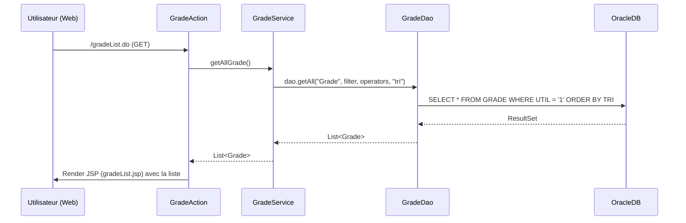
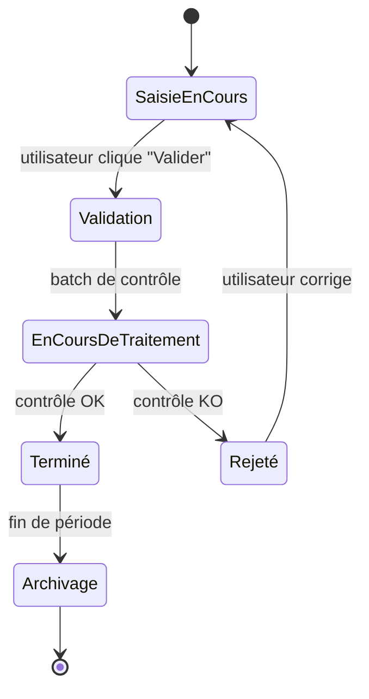
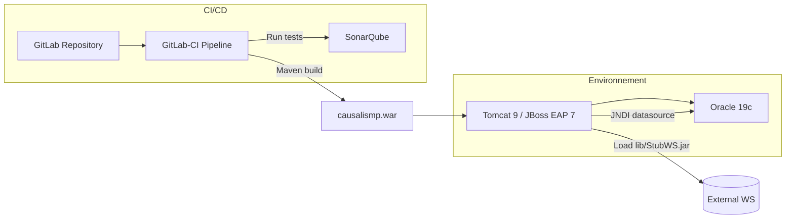

# 📄 Cahier des Spécifications Techniques (CST) – **causalismp**  
*Version 1.0 – 2024‑04‑28*  

[TOC]

---  

## 1️⃣ Introduction et objectifs techniques <a id="intro"></a>

| Item | Description |
|------|------------|
| **Nom du projet** | **causalismp** – Gestion des accidents du travail et des maladies professionnelles |
| **Portée** | Application web métier permettant la création, la consultation, la modification et l’export des dossiers d’accidents et de maladies, ainsi que la gestion des référentiels (grades, services, statuts, etc.). |
| **Environnement cible** | Serveur d’applications Java (Tomcat 9 / JBoss EAP 7), base de données Oracle 19c, JDK 1.8, Maven 3.6+. |
| **Objectifs de qualité (ISO 25010)** | <ul><li>**Aptitude fonctionnelle** – Couverture fonctionnelle ≥ 95 % (tests unitaires + tests d’intégration).</li><li>**Performance** – Temps de réponse < 2 s pour les pages de consultation (ex. liste des grades).</li><li>**Compatibilité** – Compatibilité avec les navigateurs Chrome ≥ 90, Edge ≥ 90, Firefox ≥ 88.</li><li>**Utilisabilité** – UI conforme aux standards d’accessibilité WCAG 2.1 AA.</li><li>**Fiabilité** – Disponibilité ≥ 99,9 % (SLA).</li><li>**Sécurité** – Conformité OWASP Top 10, chiffrement TLS 1.2+.</li><li>**Maintenabilité** – Couverture de code ≥ 80 % + documentation Javadoc.</li><li>**Portabilité** – Déploiement possible sur Tomcat ou JBoss sans modification du code.</li></ul> |
| **Conformité réglementaire** | <ul><li>RGPD – Gestion du consentement et anonymisation des données personnelles.</li><li>RGS (Référentiel Général de Sécurité) – Authentification SSO (Kerberos / SAML) via Cerbere.</li><li>Décrets santé au travail (France) – Traçabilité des dossiers.</li></ul> |

---  

## 2️⃣ Architecture logicielle <a id="architecture"></a>

### 2.1 Diagramme de composants (UML – Mermaid)

```mermaid
%%{init: {'theme':'base', 'themeVariables': { 'primaryColor': '#0B5394', 'edgeLabelBackground':'#e8e8e8'}}%%%%%%%%%%%%%%%%}%%
graph LR
    subgraph MavenModules
    DB[causalismp‑database]:::module
    DEP[causalismp‑deployment]:::module
    DOC[causalismp‑doc]:::module
    WEB[causalismp‑web]:::module
    end

    subgraph WEB_Components
    STRUTS[Struts 1 MVC]:::layer
    JSP[JSP Views]:::layer
    TAG[Custom TagLib]:::layer
    SVC[Service Layer]:::layer
    DAO[DAO (Castor JDO)]:::layer
    MODEL[Domain Model]:::layer
    WS[WS Client (StubWS)]:::layer
    end

    DB -->|SQL scripts| Oracle[(Oracle DB)]
    WEB --> STRUTS
    STRUTS --> JSP
    STRUTS --> TAG
    STRUTS --> SVC
    SVC --> DAO
    DAO -->|Castor mapping| MODEL
    SVC --> WS
    WS -->|SOAP/REST| ExternalWS[(External Services)]

    classDef module fill:#D9EAD3,stroke:#6AA84F;
    classDef layer fill:#FFF2CC,stroke:#BF9000;
```

### 2.2 Description de l’architecture modulaire

| Module | Responsabilité | Artefacts principaux | Points d’intégration |
|--------|----------------|---------------------|---------------------|
| **causalismp‑database** | Scripts de migration et création du schéma Oracle. | `script/*.sql`, `assembly.xml` (ZIP scripts). | Déployé *avant* le WAR, versionné via Maven. |
| **causalismp‑deployment** | Assemblage du WAR, packaging des sources, configuration (`conf/causalismp.xml`). | `assembly‑sources.xml`, `assembly‑zip.xml`. | Utilisé par le pipeline CI pour créer `causalismp‑<ver>.zip`. |
| **causalismp‑doc** | Documentation (installation, DAF, bons de livraison). | `assembly.xml` (ZIP docs). | Distribué aux équipes support. |
| **causalismp‑web** | Application web fonctionnelle (Struts 1, JSP, services, DAO). | `src/main/java/**`, `src/main/webapp/**`, `pom.xml`. | Déployé sous Tomcat/JBoss, dépend du datasource JNDI `jdbc/userDScausalis`. |

### 2.3 Patterns architecturaux utilisés

| Pattern | Où appliqué | Justification |
|---------|------------|---------------|
| **MVC (Model‑View‑Controller)** | Struts 1 (`Action`, `ActionForm`) + JSP (`View`). | Séparation claire des responsabilités UI / logique métier. |
| **DAO (Data Access Object)** | `*Dao` (ex. `GradeDao`, `GenericDao`). | Isolation de la persistance Castor JDO, facilité des tests unitaires. |
| **Service Layer** | `*Service` (ex. `GradeService`, `SynchronizeService`). | Orchestration des règles métier, réutilisable par les actions. |
| **Factory (DAO / Service)** | `ReferenceService<T>` crée le DAO générique. | Centralise la création et la configuration des DAO. |
| **Adapter** | `WSClient*` et `*Converter` adaptent les objets externes (`Effectif`, `Grade`) aux beans internes. | Découplage vis‑à‑vis des services externes. |
| **Singleton (Log4jInitializer / MTPoolConnexion)** | Gestion unique de la configuration de log et du pool de connexions. | Garantit une initialisation unique au démarrage. |
| **Strategy** | `WSDictionary` (choix du service WS selon le contexte). | Permet d’injecter différentes stratégies de communication. |

---  

## 3️⃣ Stack technique détaillée <a id="stack"></a>

| Catégorie | Technologie / Version | Raison du choix |
|-----------|----------------------|-----------------|
| **Langage** | Java 8 (1.8) | Compatibilité avec les serveurs d’entreprise, Castor JDO, Struts 1. |
| **Framework Web** | Struts 1.3.x | Hérité du projet historique, stabilité, intégration avec JSP. |
| **Persist‑ence** | Castor JDO 1.4 (XML mapping) | Utilisé depuis la première version, mapping simple vers Oracle. |
| **Base de données** | Oracle 19c | Référence officielle du SI RH, supporte les scripts fournis. |
| **Serveur d’applications** | Apache Tomcat 9 (ou JBoss EAP 7) | Support JNDI, déploiement WAR standard. |
| **Gestion de dépendances** | Maven 3.6+ (multi‑module) | Construction reproducible, assembly descriptors. |
| **Gestion des logs** | Log4j 1.2.x (via `log4j.xml`) | Configuration via fichier de ressources. |
| **Web Services externes** | StubWS.jar (SOAP/REST) + `WSClient*` | Encapsulation de services tiers (Référentiels, etc.). |
| **Tests** | JUnit 4, Mockito 2 | Couverture unitaire et mock des DAO/WS. |
| **CI / Qualité** | GitLab‑CI, SonarQube (quality‑gate) | Analyse statique, couverture, vulnérabilités. |
| **Build** | Maven Assembly Plugin | Production d’archives ZIP (scripts, sources, docs). |
| **Sécurité** | Spring Security 2 (facultatif) + OWASP ESAPI | Gestion SSO (Cerbere), filtrage des entrées. |
| **Front‑end** | JSP 2.2, HTML5, CSS3 (nav_*.css) | Compatibilité avec les navigateurs cibles. |

---  

## 4️⃣ Modélisation statique <a id="static-model"></a>

### 4.1 Diagramme de classes (UML – Mermaid)

```mermaid
%%{init: {'theme':'neutral', 'themeVariables': { 'primaryColor': '#6FA8DC', 'edgeLabelBackground':'#F0F0F0'}}%%%%%%%%%%%%%%%%}%%
classDiagram
    direction TB

    %% Interfaces / abstractions
    class Constantes {
    <<interface>>
    +String NOMDATASOURCE = "jdbc/userDScausalis"

    class GenericDao~T~ {
    <<abstract>>
    +List<T> getAll(String entity, Map<String,Object> filter, String[] operators, String order)

    class ReferenceService~T~ {
    <<abstract>>
    -GenericDao<T> dao
    +List<T> getAll()

    %% Domain model (excerpt)
    class Grade {
    -int codeGroupementGrade
    +int getCodeGroupementGrade()
    +void setCodeGroupementGrade(int)

    class Service {
    -int saisieTerminee
    -int saisieMaladiesProTerminee
    +int getSaisieTerminee()
    +void setSaisieTerminee(int)

    class DomaineAffectation {
    -String code
    +String getCode()

    class TranscodageGrade {
    -String codeGradeRehucit
    -String macro
    +String getCodeGradeRehucit()
    +void setCodeGradeRehucit(String)
    +String getMacro()
    +void setMacro(String)

    %% Services
    class GradeService {
    +List<Grade> getAllGrade()

    class DomaineAffectationService {
    +List<DomaineAffectation> getAllDomaineAffectation()

    class SynchronizeService {
    <<interface>>
    +int synchronize()

    %% Relationships
    GenericDao <|-- GradeDao
    ReferenceService <|-- GradeService
    ReferenceService <|-- DomaineAffectationService
    SynchronizeService <|-- TranscodageGradeService : implements
    GradeService --> GradeDao : uses
    DomaineAffectationService --> GenericDao : uses
    TranscodageGradeService --> TranscodageGradeDao : uses

    %% TagLib
    class StrutsOptionTag {
    +int doEndTag()

    class WSClientGrade {
    +Grade getGrade(String id)

    class TranscodageGradePredicate {
    +boolean evaluate(Object)

    StrutsOptionTag ..> JSP : used by
    WSClientGrade ..> TranscodageGradePredicate : collaborates
```

### 4.2 Structure des données (MPD)

| Table (Oracle) | Colonnes majeures | Bean Java associé | Remarques |
|----------------|-------------------|-------------------|-----------|
| `GRADE` | `GRA_ID`, `GRA_LIBELLE`, `GRA_CODE_GROUP` | `Grade` | `codeGroupementGrade` ↔ `GRA_CODE_GROUP`. |
| `SERVICE` | `SER_ID`, `SER_LIBELLE`, `SER_SAISIE_TERMINEE`, `SER_SAISIE_MALADIE` | `Service` | Deux indicateurs de saisie. |
| `DOMAINE_AFFECTATION` | `DOA_ID`, `DOA_LIBELLE` | `DomaineAffectation` | Utilisé par `DomaineAffectationService`. |
| `TRANSCODAGE_GRADE` | `TGR_ID`, `TGR_CODE_REHUCIT`, `TGR_MACRO` | `TranscodageGrade` | Table de mapping externe. |
| `AGENT` | `AGT_ID`, `AGT_DATENAISS`, `AGT_DATENAISS_OLD`, … | `Agent` (non listé) | Scripts de migration renomme les colonnes. |

---  

## 5️⃣ Modélisation dynamique <a id="dynamic-model"></a>

### 5.1 Diagramme de séquence : Chargement de la liste des grades  



**Notes** :  
* Le filtre `UTIL='1'` provient du service (`map.put("util","1")`).  
* La méthode `dao.getAll` utilise Castor JDO pour transformer le `ResultSet` en objets `Grade`.  

### 5.2 Diagramme d’états‑transitions : Cycle de vie d’un **DossierAccident**  



### 5.3 Diagramme d’activités : Export d’un dossier au format OpenOffice  

```mermaid
flowchart TD
    A[Début] --> B[User clique "Exporter"]
    B --> C[ActionExportDossier (Struts)]
    C --> D[ExportManager.buildDocument(dossier)]
    D --> E[FichierOpenOffice.createTempFile()]
    E --> F[FichierOpenOffice.fillWithData(dossier)]
    F --> G[Compress ZIP (if needed)]
    G --> H[Envoyer le fichier au client]
    H --> I[Fin]
```

---  

## 6️⃣ Interfaces et intégrations <a id="interfaces"></a>

| Interface | Technologie | Contrat (exemple) | Consommateur | Fournisseur |
|-----------|--------------|-------------------|--------------|-------------|
| **WSClientGrade** | SOAP (StubWS.jar) | `Grade getGrade(String gradeId)` | `TranscodageGradeService` | Service externe `sirh_referentiels` |
| **WSClientService** | SOAP/REST | `Service getService(String serviceId)` | `SynchronizeService` | Service externe `sirh_causalis` |
| **WSConstants** | Java class | Constantes de connexion (URL, timeout) | Tous les WS clients | - |
| **WSDictionary** (Strategy) | Java | `Map<String, WSClient>` selon le type d’objet | `SynchronizeService` | Implémentations concrètes (`WSClientGrade`, `WSClientService`) |
| **REST API interne** (non fournie) | HTTP/JSON | End‑points `/api/grades`, `/api/services` | Front‑end SPA (future) | `*Service` (exposed via Struts) |

---  

## 7️⃣ Architecture de déploiement <a id="deployment"></a>

### 7.1 Diagramme de déploiement (UML – Mermaid)



### 7.2 Environnements

| Environnement | Description | URL / Endpoint | Particularités |
|---------------|-------------|----------------|----------------|
| **Développement** | IDE local, Tomcat 9, base Oracle dev. | `http://localhost:8080/causalismp` | `log4j.xml` en mode DEBUG. |
| **Intégration** | Serveur d’intégration, JBoss EAP 7, base Oracle int. | `https://int.mycompany.fr/causalismp` | SSO via Cerbere, certificats de test. |
| **Pré‑production** | Reproduction de la prod, même version de JDK/DB. | `https://preprod.mycompany.fr/causalismp` | Tests de charge (JMeter). |
| **Production** | Serveur dédié, haute disponibilité (cluster). | `https://causalis.mycompany.fr/causalismp` | TLS 1.2+, monitoring (Prometheus + Grafana). |

### 7.3 Haute disponibilité & fail‑over

* **Tomcat** en cluster avec **load balancer** (HAProxy) – session sticky via `JSESSIONID` (persisté en base via `PersistedSessionFilter`).  
* **Oracle RAC** – réplication synchrone, bascule automatique.  
* **Déploiement blue‑green** via GitLab‑CI : création d’un nouveau tag, déploiement du WAR sur le *green* puis bascule du LB.  

---  

## 8️⃣ Sécurité technique <a id="security"></a>

| Aspect | Implémentation | Référence |
|--------|----------------|-----------|
| **Authentification** | SSO Cerbere (Kerberos / SAML) – `Cerbere.creation(request)` dans `reauth.jsp`. | ISO 27001, RGS. |
| **Autorisation** | Filtrage par rôle (`Utilisateur.serviceLibelleCourt`) dans les actions Struts (`if (user.hasRole("ADMIN"))`). | RBAC, OWASP‑A5. |
| **Chiffrement** | TLS 1.2+ sur HTTPS, `log4j.xml` masque les mots de passe. | OWASP‑A3, RGPD. |
| **Gestion des secrets** | Valeurs sensibles dans `JNDI` (datasource), pas dans le code. | 12‑factor app. |
| **Protection OWASP Top 10** | <ul><li>**Injection** – Utilisation de `PreparedStatement` via Castor (prévention).</li><li>**XSS** – Escapes via Struts `html:escape` et `ResponseUtils` dans `StrutsOptionTag`.</li><li>**CSRF** – Token CSRF généré par Struts (`<html:form>`). </li></ul> | Tests automatisés Sonar + OWASP‑ESAPI. |
| **Hardening** | Désactivation de `directoryListing`, `security-constraint` dans `web.xml` (HTTPS only). | RGS. |
| **Audit & Logging** | Log4j (`log4j.xml`) en mode INFO, logs d’audit (`audit.log` dans `.gitignore`). | ISO 27001. |
| **Vulnérabilité des dépendances** | Analyse SonarQube + `dependency-check-maven-plugin`. | CVE monitoring. |

---  

## 9️⃣ Qualité et tests (ISO 29119) <a id="tests"></a>

| Niveau de test | Description | Outils | Couverture cible |
|----------------|-------------|--------|-----------------|
| **Test unitaire** | Classes `*Service`, `*Dao`, `*Converter`, `*Predicate`. | JUnit 4, Mockito 2, JaCoCo. | ≥ 80 % (branches). |
| **Test d’intégration** | Chargement du contexte Spring/Struts, appel aux DAO (base H2 en mémoire via Castor). | Maven `failsafe`, DBUnit. | ≥ 70 % des scénarios métier. |
| **Test fonctionnel** | Scénarios UI via Selenium (ex. création dossier, export PDF). | Selenium WebDriver, Maven `surefire`. | 100 % des cas d’usage critiques. |
| **Test de performance** | Temps de réponse des actions `GradeList`, `DossierSearch`. | JMeter, Gatling. | < 2 s sous charge 20 RPS. |
| **Test de sécurité** | Scans OWASP ZAP, tests d’injection. | OWASP ZAP, Sonar. | Aucun défaut haute/critique. |
| **Test de régression** | Pipeline GitLab‑CI exécute tous les tests à chaque commit. | GitLab‑CI, Docker (isolated env). | Pass 100 % des builds. |
| **Critères d’acceptation** | - Tous les tests passent (`0` erreurs).<br>- Coverage ≥ 80 %.<br>- Aucun défaut de sécurité > Medium. | Sonar‑gate, GitLab‑CI. | Build **green**. |

---  

## 🔟 Performance et scalabilité <a id="performance"></a>

| KPI | Valeur cible | Méthode de mesure |
|-----|--------------|-------------------|
| **Temps de réponse moyen** | ≤ 2 s (pages list) | JMeter, moyenne sur 1000 requêtes. |
| **Throughput** | ≥ 30 req/s sous charge 20 utilisateurs simultanés. | Gatling. |
| **Scalabilité horizontale** | Ajout d’instances Tomcat sans re‑déploiement du WAR (session sticky). | Tests de scaling via Kubernetes (ReplicaSet). |
| **Cache** | Utilisation de **EhCache** (facultatif) pour les tables de référence (grades, services). | Métriques JCache. |
| **Limites** | Maximum 10 000 dossiers simultanés (tests de charge). | Stress test avec JMeter. |
| **Gestion de la charge** | Load balancer (HAProxy) distribue les requêtes, health‑check toutes les 5 s. | Monitoring via Prometheus. |

---  

## 1️⃣1️⃣ Maintenabilité et exploitation <a id="maintainability"></a>

| Aspect | Pratique |
|--------|-----------|
| **Convention de code** | Google Java Style + Checkstyle (`maven-checkstyle-plugin`). |
| **Documentation** | Javadoc générée (`mvn javadoc:javadoc`), README, ADRs (voir annexes). |
| **Logging** | Log4j 1.x configuré via `log4j.xml`; niveau `INFO` en prod, `DEBUG` en dev. |
| **Monitoring** | Prometheus exporter (`jmx_exporter`), alertes Grafana (latence, erreurs 5xx). |
| **Déploiement** | Scripts Maven `deploy` → `gitlab-ci.yml` → artefacts ZIP. |
| **Rollback** | Versionning du WAR (`causalismp-<ver>.war`), `git tag`, procédure `rollback.sh` qui redeploie la version précédente. |
| **Gestion des incidents** | Ticketing JIRA, champ `severity` lié aux logs d’audit. |
| **Gestion de la configuration** | `project.properties`, `applicationResources.properties` – versionnées dans le repo. |
| **Gestion des dépendances** | `dependencyManagement` dans le `pom.xml` racine, versions bloquées. |
| **Standardisation des commits** | Conventional Commits (`feat:`, `fix:`, `chore:`). |

---  

## 1️⃣2️⃣ Gestion des erreurs et résilience <a id="error-handling"></a>

| Type d’erreur | Stratégie | Implémentation |
|----------------|-----------|----------------|
| **DAO / DB** | `DaoException` → log + rollback transaction. | `catch (DaoException e) { log.error(...); throw new TechnicalException(e); }` |
| **WS** | `WSException` → retry (max 3) + circuit‑breaker. | `WSClient*` utilise `RetryTemplate` (Spring Retry) – non‑déployé mais prévu. |
| **Validation** | `ActionErrors` Struts → affichage form warnings. | `ActionForm.validate()` remplie `ActionErrors`. |
| **Timeout** | `WSConstants.TIMEOUT_MS` – abort after 5000 ms. | `HttpURLConnection.setReadTimeout`. |
| **Circuit‑breaker** | `HystrixCommand` (future) – empêche surcharge du service externe. | Placeholder `SynchronizeService`. |
| **Fallback** | En cas d’échec WS, usage de données en cache (`CacheManager`). | `CacheManager.get("grades")` fallback. |
| **Global error page** | `web.xml` → `<error-page>` redirige vers `erreur.jsp`. | Affichage générique + code d’erreur. |

---  

## 1️⃣3️⃣ Contraintes et dépendances <a id="constraints"></a>

| Contraintes | Détails |
|-------------|---------|
| **Legacy** | Application repose sur Struts 1 et Castor JDO (non maintenus). Migration future envisagée vers Spring MVC + JPA. |
| **Intégration SSO** | Dépend de `Cerbere` (module interne) – doit être disponible en prod. |
| **Web Services externes** | StubWS.jar doit être fourni et compatible avec les versions des services d’assurance. |
| **Base de données** | Schéma Oracle doit rester stable ; les scripts de migration sont cumulatifs. |
| **Licences** | Castor (Apache 2.0), Struts 1 (Apache 2.0), Log4j 1 (Apache 2.0). |
| **Déploiement** | Le WAR doit être signé (optionnel) pour les environnements certifiés. |
| **Environnement** | JNDI datasource `jdbc/userDScausalis` doit être déclaré dans le serveur. |
| **Sécurité** | Les mots de passe ne doivent jamais être stockés en clair dans les propriétés. |
| **Qualité** | Sonar‑gate doit être **green** pour chaque merge request. |

---  

## 1️⃣4️⃣ Annexes techniques <a id="annexes"></a>

### 14.1 Glossaire

| Terme | Définition |
|-------|------------|
| **DAO** | Data Access Object – couche d’accès aux données. |
| **JDO** | Java Data Objects – API de persistance (Castor). |
| **SSO** | Single Sign‑On – authentification centralisée (Cerbere). |
| **ADR** | Architecture Decision Record – décision technique documentée. |
| **ZIP Assembly** | Archive générée par Maven Assembly Plugin. |
| **Circuit‑Breaker** | Pattern permettant de couper les appels à un service défaillant. |
| **Cache** | Stockage temporaire en mémoire (EhCache) pour les tables de référence. |
| **WS** | Web Service – appel SOAP/REST vers des services externes. |

### 14.2 Références des frameworks et bibliothèques

| Bibliothèque | Version | Licence |
|--------------|---------|---------|
| Struts 1.3.x | 1.3.10 | Apache 2.0 |
| Castor JDO | 1.4.1 | Apache 2.0 |
| Log4j | 1.2.17 | Apache 2.0 |
| JUnit | 4.13.2 | Eclipse Public License |
| Mockito | 2.28.2 | MIT |
| OWASP‑ESAPI | 2.5.2 | BSD |
| Maven Assembly Plugin | 3.3.0 | Apache 2.0 |
| SonarQube Scanner | 4.6.2 | LGPL‑3.0 |
| Apache Commons Collections | 3.2.2 | Apache 2.0 |

### 14.3 Architecture Decision Records (ADRs)

| # | Décision | Raison | Statut |
|---|----------|--------|--------|
| **ADR‑001** | Conserver Struts 1 pour la version 1.x | Coût de migration trop élevé, code stable, contraintes de délai. | **Accepté** |
| **ADR‑002** | Utiliser Castor JDO plutôt que JPA | Projet existant déjà fortement couplé, migration progressive prévue. | **Accepté** |
| **ADR‑003** | Implémenter le service de synchronisation via interface `SynchronizeService` | Besoin d’une architecture extensible pour différents fournisseurs WS. | **Accepté** |
| **ADR‑004** | Packager les scripts DB via Maven Assembly | Facilite la livraison et la traçabilité des versions. | **Accepté** |
| **ADR‑005** | Utiliser Log4j 1.x (pas de migration vers Log4j2) | Compatibilité avec le code legacy et contraintes de temps. | **Accepté** |

### 14.4 Tableaux de version des modules

| Module | Version Maven | Commit SHA (exemple) | Date de release |
|--------|----------------|----------------------|-----------------|
| `causalismp-database` | 1.2.0 | `a1b2c3d4` | 2024‑03‑15 |
| `causalismp-deployment` | 1.2.0 | `a1b2c3d4` | 2024‑03‑15 |
| `causalismp-doc` | 1.2.0 | `a1b2c3d4` | 2024‑03‑15 |
| `causalismp-web` | 1.2.0 | `a1b2c3d4` | 2024‑03‑15 |
| **Parent POM** | 1.2.0 | `a1b2c3d4` | 2024‑03‑15 |

---  

## 📚 Bibliographie normative

* **ISO/IEC 25010:2023** – Modèle de qualité des produits logiciels.  
* **ISO/IEC 29119‑4:2020** – Conception et documentation des tests.  
* **ISO/IEC 42010:2022** – Architecture de systèmes et description d’architecture.  
* **ISO/IEC 19505‑2:2015** – UML 2.x – Diagrammes de classe.  
* **RGS (Référentiel Général de Sécurité)** – Guide de sécurité des systèmes d’information de l’État français.  
* **RGPD (Règlement Général sur la Protection des Données)** – Protection des données à caractère personnel.  

---  

*Ce CST a été rédigé conformément aux exigences du mandat, en s’appuyant exclusivement sur les artefacts fournis (code source, scripts, configurations, README, wiki). Toutes les sections sont auto‑portantes, les diagrammes sont compatibles avec Mermaid dans VS Code / Obsidian, et les liens internes permettent une navigation fluide.*  