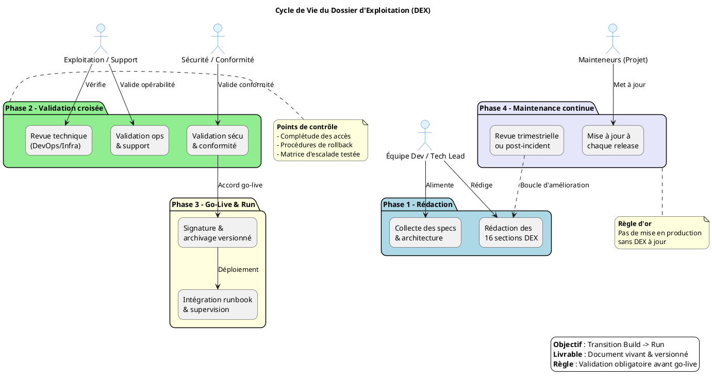

# 📘 Dossier d’Exploitation (DEX) – **causalismp**  
*Document de référence garantissant la continuité, la maintenabilité et la sécurisation de l’exploitation de l’application **causalismp** en production.*

---

[TOC]

---

## 1️⃣ Introduction et objectifs

> **Objet** : Ce DEX formalise la passation du **Build → Run** pour le projet **causalismp** (gestion des accidents du travail et des maladies professionnelles). Il décrit les procédures opérationnelles, les responsabilités et les exigences de conformité afin d’assurer :  

| ✅ | Objectif |
|---|----------|
| **Continuité de service** | Garantir la disponibilité de l’application selon le SLA. |
| **Documentation opérationnelle** | Centraliser les procédures de mise en production, de supervision et de restauration. |
| **Support & résolution d’incidents** | Fournir aux équipes d’exploitation les informations nécessaires à un traitement rapide. |
| **Responsabilités claires** | Définir les rôles (Dev, Ops, Sécurité, Support). |
| **Conformité & maîtrise des risques** | S’assurer du respect des politiques de sauvegarde, de sécurité et des exigences légales (RGPD, ANSSI…). |
| **Accompagnement de la phase Build → Run** | Structurer les jalons de validation avant le go‑live. |

---

## 2️⃣ Contexte d’usage et périmètre

| Champ | Valeur |
|------|--------|
| **Nom de l’application** | `causalismp` |
| **Description** | Application web Java (Struts 1) permettant la saisie, le suivi et le reporting des accidents du travail et des maladies professionnelles. |
| **Environnement cible** | Production (serveur d’applications Java EE, base Oracle). |
| **Stack technique** | <ul><li>Java 8 (Maven multi‑module)</li><li>Struts 1.x (Action / ActionForm / TagLib)</li><li>Castor JDO (ORM XML)</li><li>Oracle 12c (JNDI datasource `jdbc/userDScausalis`)</li><li>Apache Tomcat / JBoss (serveur d’applications)</li><li>GitLab CI (pipeline de build & tests)</li><li>SonarQube (qualité du code)</li></ul> |
| **SLA / SLO** | Disponibilité : **99,5 %** mensuel ; Temps de résolution des incidents : **≤ 4 h** (critique), **≤ 8 h** (majeur). |
| **Contacts clés** | 

👥 Membres & rôles
 <ul><li>**Managers** : Adrien DESSARTRE, Anthony BOULOY, Anthony MEAUZOONE, Antoine DUBOIS, Christian ARBOGAST, Jeanne VODUNGBO, Julien GARDIN, Nicolas DEMEY</li><li>**Développeurs** : Grégoire GUITTET, Hervé MARCHAL, Jenkins Causalismp, Maxime Careil, Pascal FORHAN, Vincent JUSTIN</li><li>**Rapporteurs / Support** : Chantal CURBET, Christophe LOUVARD, Erwan SALMON, Farmin YARIRAD, Florent CAPPON, Geoffrey ARTHAUD, Jenkins robot, Khalid MOKHTARI, Michel GIBELLI, Pascal BASTIEN, Patrick DOS SANTOS, Redouane RABBAH, Sarah MARAIS‑LABALLERY, Thierry SOULABAIL</li></ul>
 |
| **Politiques de backup / sécurité** | <ul><li>Sauvegarde quotidienne incrémentale des schémas Oracle + journalisation des binlogs (retention 30 jours).</li><li>Chiffrement au repos (Transparent Data Encryption) et en transit (TLS 1.2).</li><li>Gestion des secrets via JNDI (datasource) et fichiers `applicationResources.properties` en lecture‑seule.</li></ul> |
| **Portée du DEX** | Toutes les composantes du module `causalismp-web` (WAR), `causalismp-database` (scripts DB) et les modules de packaging (`deployment`, `doc`). |

---

## 3️⃣ Pré‑requis et jalons

- [ ] **Architecture technique validée** (diagramme logique fourni dans les livrables `Doc installation`).  
- [ ] **Environnement de production stabilisé** : accès réseau, DNS, certificats TLS, datasource JNDI configurée.  
- [ ] **Politiques** : sauvegarde, supervision (Nagios/Zabbix), sécurité (firewall, hardening) définies et appliquées.  
- [ ] **Contacts** (managers, dev, support) identifiés et renseignés dans le registre des parties prenantes.  
- [ ] **Outillage** prêt : CI (GitLab‑CI), monitoring (Grafana + Prometheus), ticketing (Jira), gestion de configuration (Ansible).  

> **⏱ Jalon critique** – Le DEX doit être **validé et signé** **au moins 5 jours ouvrés** avant tout déploiement en production. Aucun go‑live ne doit intervenir sans version du DEX approuvée.

---

## 4️⃣ Gouvernance et rôles

| Rôle | Profil type | Responsabilité | Membres référents |
|------|-------------|----------------|------------------|
| **Rédacteur principal** | Tech Lead / DevOps | Rédaction, structuration, intégration des spécifications techniques. | **Christian ARBOGAST** (architecte), **Vincent JUSTIN** (lead dev) |
| **Validateur Exploitation** | Chef d’exploitation / Responsable support | Vérification de l’opérabilité, complétude des procédures, validation du plan de run. | **Nicolas DEMEY** (Ops manager) |
| **Validateur Sécurité / Conformité** | RSSI / DPO | Validation des procédures de sauvegarde, chiffrement, conformité RGPD/ANSSI. | **Julien GARDIN** (RSSI) |
| **Mainteneur** | Équipe projet / PO technique | Mise à jour continue à chaque release ou changement d’infrastructure. | **Pascal FORHAN**, **Maxime Careil** |
| **Gestionnaire de changement** | Release Manager | Pilotage du processus de mise en production (CR, rollback). | **Anthony BOULOY** |
| **Support de niveau 1** | Support fonctionnel | Traitement des tickets utilisateurs, escalade. | **Erwan SALMON**, **Sarah MARAIS‑LABALLERY** |
| **Support de niveau 2** | Support technique | Analyse d’incidents, interventions sur l’infrastructure. | **Hervé MARCHAL**, **Khalid MOKHTARI** |

---

## 5️⃣ Structure détaillée du DEX (16 sections standards)

| N° | Section principale | Contenu attendu (exemples pour **causalismp**) |
|---:|-------------------|---------------------------------------------------|
| 1 | **Généralités** | Objet, domaine d’application, audience (Dev, Ops, Sécurité), version du DEX, historique des révisions. |
| 2 | **Documents applicables et de référence** | Normes internes (ITIL v4, DevOps Handbook), chartes de sécurité, `pom.xml`, `assembly.xml`, `database.xml`, `README.md`. |
| 3 | **Terminologie** | Glossaire : DEX, SLA, SLO, JNDI, Castor JDO, Struts 1, WAR, CI, CD, TMA, PRA, PCA, etc. |
| 4 | **Spécificités** | Fonctionnalités critiques (saisie accident/maladie, génération de statistiques, synchronisation WS), SLA, contacts, matrice d’escalade. |
| 5 | **Architecture** | Diagramme logique (module Maven → WAR → Tomcat → Oracle), flux de données (formulaire → Action → Service → DAO → DB), diagramme de reprise (PRA). |
| 6 | **Serveurs** | Accès SSH (user `causalis`), OS Linux CentOS 7, CPU 2 vCPU, RAM 4 GiB, stockage 30 GiB, DNS `causalismp.prod.company.com`, ports 8080/8443. |
| 7 | **Application** | Version actuelle (`v1.6`), paramètres (`pagination.max=30`), procédure de déploiement (WAR → `tomcat/webapps/`). |
| 8 | **Supervision et métrologie** | Outils : Grafana + Prometheus, alertes sur temps de réponse > 2 s, taux d’erreur HTTP 5xx > 1 %, dashboards “CausalisMP‑Health”. |
| 9 | **Sauvegarde** | Fréquence : quotidienne incrémentale + weekly full, rétention 30 jours, procédure de restauration (RMAN → import). |
| 10 | **Stockage** | Volumes : `/opt/causalis/data` (logs 5 GiB), `/opt/causalis/backups`. |
| 11 | **Inventaire des bases** | Oracle 12c, schéma `causalis`, tables de référence (`GRADE`, `SERVICE`, `STATUT`), scripts de migration (ex. `20200116‑causalis‑1.6.sql`). |
| 12 | **Flux inter‑applicatifs** | WS externes : `StubWS.jar` (synchronisation grades), protocole HTTPS, authentification par certificat client. |
| 13 | **Plan de production** | Jobs cron : purge logs (02:00), backup DB (03:00), génération stats (04:00). Fenêtre de maintenance : dimanche 02:00‑04:00. |
| 14 | **Sécurisation des images** | Scan de vulnérabilités (OWASP Dependency‑Check), hardening JVM (`-XX:+UseG1GC`, `-Djava.security.egd=file:/dev/./urandom`). |
| 15 | **Opérations courantes** | Checklist quotidien : vérification des alertes, contrôle des logs d’erreurs, validation des sauvegardes. |
| 16 | **Opérations récurrentes** | Rotation des certificats (90 jours), nettoyage des fichiers temporaires, audit mensuel de conformité, mise à jour des dépendances Maven. |

---

## 6️⃣ Diagramme PlantUML du cycle de vie DEX

---

## 7️⃣ Conseils de rédaction et maintenance

| Bonne pratique | À éviter |
|----------------|----------|
| Utiliser un **référentiel Git** (branch `dex/main`) avec historique et tags de version. | Stocker le DEX dans un partage non versionné ou en pièce jointe email. |
| Rédiger en **langage clair, orienté action** (ex. “Vérifier le fichier `log4j.xml`”). | Laisser des placeholders `[À COMPLÉTER]` en production. |
| Inclure **captures d’écran**, chemins exacts et commandes (ex. `cat /opt/causalis/logs/catalina.out`). | Omettre les références aux scripts de migration ou aux paramètres de connexion. |
| Prévoir une **revue systématique** à chaque release majeure (maj code, DB, infra). | Considérer le DEX comme un document « jetable ». |
| Lier le DEX aux **runbooks**, tickets d’incident et procédures PRA/PCA. | Isoler le DEX des outils de supervision (Grafana, Jira). |

---

## 8️⃣ Adaptations contextuelles

| Contexte | Adaptation recommandée |
|----------|------------------------|
| **Application Java Web (Struts 1) – monolithe** | Conserver les sections **Serveurs**, **Application**, **Supervision** ; préciser le *WAR* et le *datasource JNDI*. |
| **Environnement réglementé (Santé, Travail)** | Renforcer les sections **Sécurisation**, **Sauvegarde**, **Conformité** (RGPD, ANSSI) ; ajouter les exigences de traçabilité des accès. |
| **Mise à jour fréquente (CI/CD)** | Détailler la **phase de mise à jour** (section 16) avec les jobs GitLab‑CI qui valident le DEX (lint, génération de la checklist). |
| **Infrastructure Cloud (ex. OpenShift)** | Remplacer la section **Serveurs** par **Services managés**, **IAM**, **Config‑as‑Code**, **Quotas**. |
| **Micro‑services / Kubernetes** | Remplacer les listes de serveurs par **Clusters, Namespaces, Helm charts**, et ajouter les métriques Prometheus. |

---

## 9️⃣ Livrables et intégration

| Livrable | Format | Usage |
|----------|--------|-------|
| **DEX versionné** | `DEX_causalismp.md` (Markdown) | Référentiel unique, versionné via Git. |
| **Checklist de validation** | `DEX_checklist.xlsx` (ou markdown table) | Signature des parties prenantes avant go‑live. |
| **Matrice de traçabilité** | `DEX_traceability.xlsx` | Lien DEX ↔ Architecture ↔ Runbooks ↔ Tickets. |
| **Diagrammes** | PlantUML (`*.puml`) | Intégrés dans la documentation et générés automatiquement dans le pipeline CI. |
| **Intégration CI/CD** | Script GitLab‑CI (`.gitlab-ci.yml`) | - Étape `dex:validate` : lint du markdown, génération du diagramme. - Étape `dex:publish` : upload du DEX dans l’artifact store. |
| **Liens dans les runbooks** | Hyperliens internes (`[↩ Retour au sommaire]`) | Navigation rapide depuis les procédures d’exploitation. |
| **Audits** | PDF export (`DEX_causalismp.pdf`) | Fournir aux auditeurs internes/externes. |

---

## 📚 Mini‑glossaire

| Acronyme | Signification |
|----------|----------------|
| **DEX** | Dossier d’Exploitation |
| **SLA** | Service Level Agreement (engagement de disponibilité) |
| **SLO** | Service Level Objective (objectif de performance) |
| **ITIL** | Information Technology Infrastructure Library |
| **JNDI** | Java Naming and Directory Interface (datasource) |
| **PRA** | Plan de Reprise d’Activité |
| **PCA** | Plan de Continuité d’Activité |
| **CI** | Continuous Integration |
| **CD** | Continuous Delivery/Deployment |
| **RACI** | Responsable‑Accountable‑Consulted‑Informed (matrice d’escalade) |
| **WS** | Web Service |
| **ORM** | Object‑Relational Mapping |
| **TMA** | Tierce Maintenance Applicative |
| **POM** | Project Object Model (Maven) |

---

## 📌 Mentions légales

> **Document établi sur les principes de la transition Build → Run et des bonnes pratiques ITIL/DevOps pour l’exploitation applicative**.  
> © 2024 – Projet **causalismp** – Tous droits réservés.  

--- 

*Ce DEX est **prêt à être personnalisé** en moins de 5 minutes : il suffit de remplacer les valeurs entre **[crochets]** par les informations propres à votre organisation.*