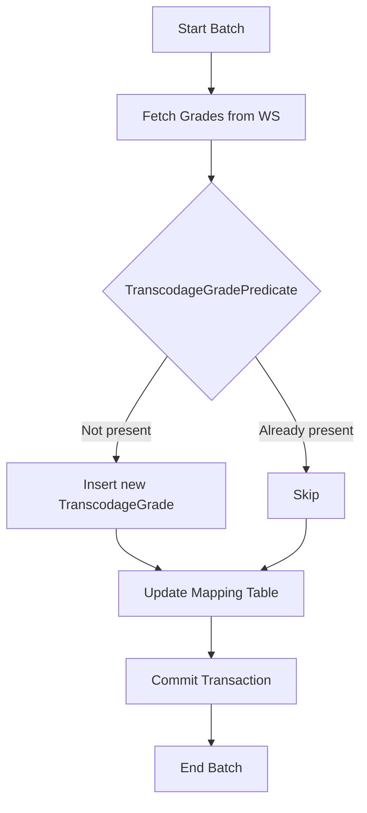

# CausalisMP – Technical Documentation  
[TOC]

↩ [Retour au sommaire](#causalismp-technical-documentation)

---  

## 1️⃣ Overview  
<a id="overview"></a>

The **CausalisMP** project is a Java‑based web application that manages occupational accident and professional disease records. It follows a **multi‑module Maven** structure and uses the following core technologies:

| Layer | Technology | Purpose |
|-------|------------|---------|
| **Web** | Struts 1 (Actions, ActionForms, custom TagLib) + JSP fragments | UI rendering, request handling |
| **Service** | Plain Java services (ReferenceService, SynchronizeService) | Business logic, coordination of DAO calls |
| **DAO / Persistence** | Castor JDO + XML mapping (`database.xml`, `mapping.xml`) | Object‑relational mapping to an Oracle DB |
| **Model** | POJOs representing reference tables (Grade, Service, Statut, etc.) | Domain objects |
| **Packaging** | Maven Assembly descriptors (ZIP archives for scripts, sources, docs) | Build artefacts |
| **CI / Quality** | SonarQube (`sonar-project.properties`) | Static analysis & quality gate |
| **Deployment** | WAR generated by `causalismp-web` module | Deployable on any Java EE servlet container |

The application is organized into **four Maven modules**:

* `causalismp-database` – SQL migration scripts and assembly descriptor.  
* `causalismp-deployment` – Packaging sources and deployment configuration.  
* `causalismp-doc` – Documentation assembly.  
* `causalismp-web` – The actual web application (Struts, services, DAO, model).

↩ [Retour au sommaire](#causalismp-technical-documentation)

---  

## 2️⃣ Architecture Diagram  
<a id="architecture-diagram"></a>

```mermaid
graph TD
    subgraph MavenModules;
        DB[causalismp-database]
        DEP[causalismp-deployment]
        DOC[causalismp-doc]
        WEB[causalismp-web]
    end
    subgraph WEBLayer;
        STR[Struts Actions & JSP]
        SVC[Service Layer]
        DAO[DAO (Castor JDO)]
        MOD[Domain Model (POJOs)]
    end
    subgraph Infra;
        ORA[(Oracle DB)]
        JNDI[(JNDI DataSource<br/>java_comp/env/jdbc/userDScausalis)]
        WS[External Web Services<br/>(StubWS.jar)]
    end
    DB -->|SQL scripts| ORA;
    WEB --> STR;
    STR --> SVC;
    SVC --> DAO;
    DAO -->|Castor mapping| ORA;
    DAO --> MOD;
    SVC -->|Sync calls| WS;
    DEP -->|Assembly ZIP| WEB;
    DOC -->|Docs ZIP| WEB
```

*The diagram shows the flow from Maven modules to runtime components.*  

↩ [Retour au sommaire](#causalismp-technical-documentation)

---  

## 3️⃣ Build & Packaging  
<a id="build-packaging"></a>

| Module | Key Files | Produced Artefact |
|--------|-----------|-------------------|
| `causalismp-database` | `assembly.xml` (scripts), `script/*.sql` | `causalismp-database-<version>.zip` (DB migration) |
| `causalismp-deployment` | `assembly-sources.xml`, `assembly-zip.xml` | `causalismp-sources-<version>.zip` & `causalismp-deployment-<version>.zip` |
| `causalismp-doc` | `assembly.xml` (docs) | `causalismp-doc-<version>.zip` |
| `causalismp-web` | `pom.xml`, `src/main/webapp/**` | `causalismp-web-<version>.war` |

**Maven commands**

```bash
# Clean and build all modules
mvn clean install

# Build only the web module
mvn -pl causalismp-web package
```

The **Assembly descriptors** use the `<includeBaseDirectory>false</includeBaseDirectory>` flag to avoid nesting the root folder inside the ZIP. Exclusions (`%regex[(?!.*src/).*target.*]`) guarantee that compiled classes are not packaged in the sources archive.

↩ [Retour au sommaire](#causalismp-technical-documentation)

---  

## 4️⃣ Database Layer  
<a id="database-layer"></a>

### 4.1 DataSource Configuration  
The application expects an Oracle datasource bound in JNDI under the name **`java:comp/env/jdbc/userDScausalis`**. This is declared in `src/main/resources/database.xml`:

```xml
<database name="causalis" engine="oracle">
    <jndi name="java:comp/env/jdbc/userDScausalis"/>
    <mapping href="mapping.xml"/>
</database>
```

*The `mapping.xml` (not shown) contains Castor‑JDO mappings for each POJO.*

### 4.2 Migration Scripts  

| Script | Description | Size |
|--------|-------------|------|
| `20190403-causalis-1.5.1.sql` | Sets `ACC_REPETITIF = 1` for accidents with `GRA_ID_ACC = 7`. | 65 bytes |
| `20200116-causalis-1.6.sql` | Renames three columns in `agent` table to handle birth‑date evolution. | 426 bytes |
| `20190121-causalis-1.5.sql` | (Not displayed) – initial version. | 13 KB |
| `script-2012-03-15.sql` / `script-2012-04-17.sql` | Legacy scripts. | 1 KB / 2 KB |

**Best practice:** Run scripts in chronological order; each script is atomic and ends with a `COMMIT`.

↩ [Retour au sommaire](#causalismp-technical-documentation)

---  

## 5️⃣ Service Layer  
<a id="service-layer"></a>

The service layer groups **reference services** (read‑only access to static tables) and **synchronisation services** (batch updates from external WS).

### 5.1 Reference Services (Pattern)

```
ReferenceService<T>
   └── SpecificService (e.g., GradeService, DomaineAffectationService)
```

*Common responsibilities*:

* Build a query map (`util = 1`) and operator array (`=`).  
* Call `dao.getAll("<Entity>", map, operators, "tri")`.  
* Propagate `TechnicalException` for any Castor‑related failure.

#### Example – `GradeService`

```java
public List<Grade> getAllGrade() throws TechnicalException {
    Map<String, Object> map = new HashMap<>();
    map.put("util", "1");
    String[] operators = {"="};
    return dao.getAll("Grade", map, operators, "tri");
}
```

### 5.2 Synchronisation Service  

```java
public interface SynchronizeService {
    int synchronize(); // Returns number of inserted rows
}
```

Implemented elsewhere (not in the current source snapshot). It orchestrates calls to external WS (via `StubWS.jar`) and updates reference tables, e.g., `TranscodageGrade`.

### 5.3 Utility Services  

* `DBTools` – converts Castor `QueryResults` to a `List`.  
* `TrancheAgeHelper` – derives an age‑group character (`'1'..'5'`) from birth year and sync year.  

↩ [Retour au sommaire](#causalismp-technical-documentation)

---  

## 6️⃣ Web Layer (Struts 1)  
<a id="web-layer"></a>

### 6.1 Action Classes  

All actions extend `org.apache.struts.action.Action`. Key actions include:

| Action | Purpose |
|--------|---------|
| `IndexAction` | Entry point – forwards to the home page. |
| `DossiersAction` / `DossiersMaladieAction` | CRUD handling of accident and disease dossiers. |
| `EditionDossierAction*` | Multi‑step wizard for editing a dossier. |
| `EffectifsAction` | Displays and edits effectif tables. |
| `StatistiquesAction` | Generates statistical reports. |
| `ImpressionDossierAction` / `ImpressionDossierMaladieAction` | PDF/print rendering. |

### 6.2 Form Beans  

All forms inherit from `GenericForm` (contains `action`, `empty`, `warnings`). Specific forms add domain‑specific fields, e.g., `DossiersForm`, `StatistiquesForm`.

### 6.3 Custom TagLib  

* `StrutsOptionTag` – overrides `OptionTag` to replace double quotes with single quotes for JavaScript compatibility.  
* `PutIntoSessionTag` – stores an attribute in the HTTP session (defined in `marcmus.tld`).  

### 6.4 JSP Fragments  

Common fragments (`haut.jspf`, `menu.jspf`, `pied.jspf`) are included in each page to provide a consistent layout. The `home.jsp` simply forwards to `index.do`.

↩ [Retour au sommaire](#causalismp-technical-documentation)

---  

## 7️⃣ Exception Hierarchy  
<a id="exception-hierarchy"></a>

```
java.lang.RuntimeException
 └─ CommonException
      ├─ DaoException
      └─ WSException
java.lang.Throwable
 └─ TechnicalException
```

* `CommonException` – base unchecked exception for application‑wide errors.  
* `DaoException` – wraps data‑access errors.  
* `WSException` – wraps web‑service invocation errors.  
* `TechnicalException` – **checked** wrapper for low‑level `Exception` (e.g., Castor persistence errors). It overrides `printStackTrace()` to also print the wrapped source exception.

**Recommendation:** Consider making `TechnicalException` extend `Exception` (instead of `Throwable`) to simplify catch blocks.

↩ [Retour au sommaire](#causalismp-technical-documentation)

---  

## 8️⃣ Synchronisation Flow  
<a id="synchronisation-flow"></a>



*The `TranscodageGradePredicate` uses `TranscodageGradeService.isPresent()` to decide if a grade retrieved from the external WS must be inserted.*

↩ [Retour au sommaire](#causalismp-technical-documentation)

---  

## 9️⃣ Testing Strategy  
<a id="testing-strategy"></a>

The project contains **JUnit test classes** under `src/test/java`. They are grouped by layer:

| Package | Sample Tests |
|---------|--------------|
| `dao` | `GenericDaoTest` |
| `service` | `AnneeServiceTest`, `EffectifServiceTest`, `GradeServiceTest`, `ServiceServiceTest` |
| `tool` | `BeanToolTest`, `GenericFetcherTest` |
| `ws` | Tests for client stubs and converters (`WSClientEffectifTest`, `EffectifDetailleConverterTest`, etc.) |

**Coverage Tips**

* Run `mvn test` to execute all unit tests.  
* Integrate **JaCoCo** Maven plugin to generate coverage reports.  
* Enforce a minimum coverage threshold in the CI pipeline (e.g., 80 %).  

↩ [Retour au sommaire](#causalismp-technical-documentation)

---  

## 🔟 CI / Quality Gate  
<a id="ci-quality-gate"></a>

The file `sonar-project.properties` configures SonarQube analysis:

```properties
sonar.projectKey=snum_pnm3_produits_rh_causalismp
sonar.qualitygate.wait=true
```

* The CI pipeline (e.g., GitLab CI defined in `.gitlab-ci.yml`) should invoke:

```bash
mvn sonar:sonar -Dsonar.host.url=$SONAR_HOST -Dsonar.login=$SONAR_TOKEN
```

* `sonar.qualitygate.wait=true` forces the build to fail if the quality gate is not passed.

**Suggested Enhancements**

* Add rule profiles (bugs, vulnerabilities, code smells).  
* Include unit‑test coverage (`sonar.junit.reportPaths`, `sonar.jacoco.reportPaths`).  

↩ [Retour au sommaire](#causalismp-technical-documentation)

---  

## 📁 Repository Layout  
<a id="repository-layout"></a>

```
causalismp/
├─ causalismp-database/
│   ├─ script/
│   │   └─ *.sql
│   ├─ assembly.xml
│   └─ README.md
├─ causalismp-deployment/
│   ├─ conf/causalismp.xml
│   ├─ assembly-sources.xml
│   ├─ assembly-zip.xml
│   └─ README.md
├─ causalismp-doc/
│   └─ assembly.xml
├─ causalismp-web/
│   ├─ src/main/java/… (service, dao, model, ws, taglib, util)
│   ├─ src/main/resources/… (database.xml, properties)
│   ├─ src/main/webapp/… (JSP, META‑INF, WEB‑INF, styles)
│   └─ pom.xml
├─ .gitlab-ci.yml
├─ README.md
├─ sonar-project.properties
└─ pom.xml (parent)
```

↩ [Retour au sommaire](#causalismp-technical-documentation)

---  

## 📌 Recommendations & Technical Debt  
<a id="recommendations"></a>

| Area | Issue | Suggested Action |
|------|-------|------------------|
| **Exception design** | `TechnicalException` extends `Throwable` | Change to extend `Exception` for conventional checked‑exception handling. |
| **SQL migrations** | No rollback scripts | Adopt Flyway or Liquibase for versioned migrations with down scripts. |
| **JNDI datasource** | Hard‑coded name | Document required server configuration (Tomcat `context.xml` or JBoss `datasource` definition). |
| **Struts version** | Struts 1 is EOL | Consider migrating to a modern MVC framework (Spring MVC, Jakarta MVC). |
| **Castor JDO** | XML mapping is verbose and error‑prone | Evaluate migration to JPA/Hibernate for better tooling and annotations. |
| **Testing coverage** | Limited unit tests for DAO & WS clients | Expand tests, mock Castor sessions, and use contract tests for WS integration. |
| **CI pipeline** | Only Sonar analysis shown | Add stages: `compile → test → package → deploy`. |
| **Documentation** | README is minimal | Create a comprehensive user guide and developer onboarding guide (markdown or MkDocs). |
| **Packaging** | Assembly descriptors use regex exclusions | Verify that new modules or resources are automatically included; add unit test for assembly. |

↩ [Retour au sommaire](#causalismp-technical-documentation)

---  

## 📚 Glossary  
<a id="glossary"></a>

| Term | Meaning |
|------|---------|
| **DAO** | Data Access Object – abstracts persistence operations. |
| **JDO** | Java Data Objects – Castor’s persistence API. |
| **WS** | Web Service – external SOAP/REST services accessed via `StubWS.jar`. |
| **Struts 1** | Legacy MVC framework (Actions, ActionForms, TagLib). |
| **Assembly descriptor** | Maven XML file defining how to package files into a ZIP. |
| **Quality Gate** | SonarQube condition that must be met for a build to pass. |
| **TranscodageGrade** | Mapping entity linking Causalis grades to external Rehucit grades. |

↩ [Retour au sommaire](#causalismp-technical-documentation)

---  

## 📜 License & Contributions  
<a id="license-contributions"></a>

The project is internal to **SLB – Netapsys**. Contributions follow the standard **GitLab flow**:

1. Fork the repository.  
2. Create a feature branch (`feature/<short-description>`).  
3. Write unit tests for new code.  
4. Submit a Merge Request (MR) with a clear description.  
5. CI runs Maven build, tests, and Sonar analysis.  
6. Reviewers approve; MR is merged into `master`.  

*All contributors must sign the corporate CLA.*  

↩ [Retour au sommaire](#causalismp-technical-documentation)