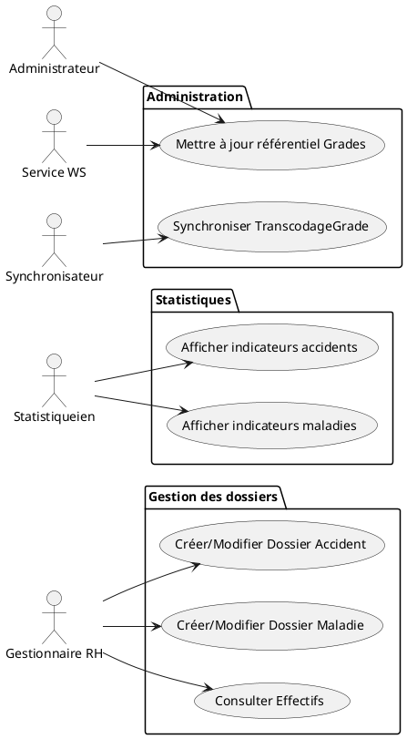
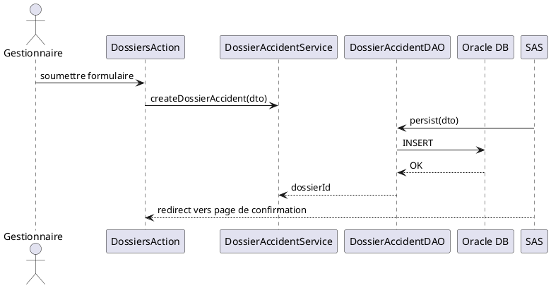
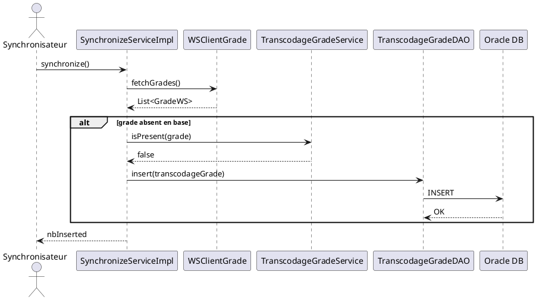
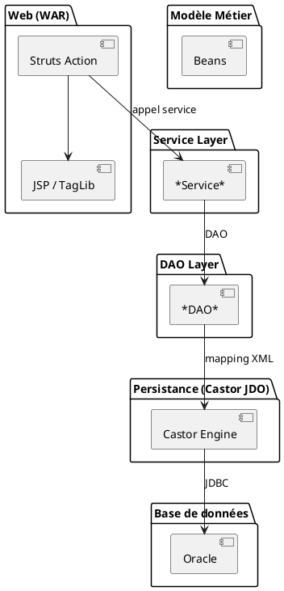
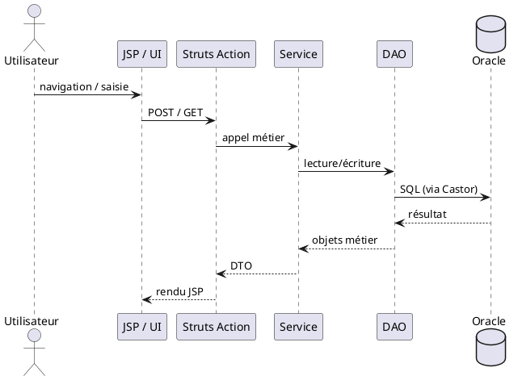
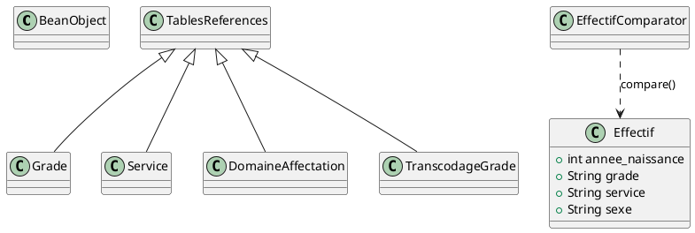
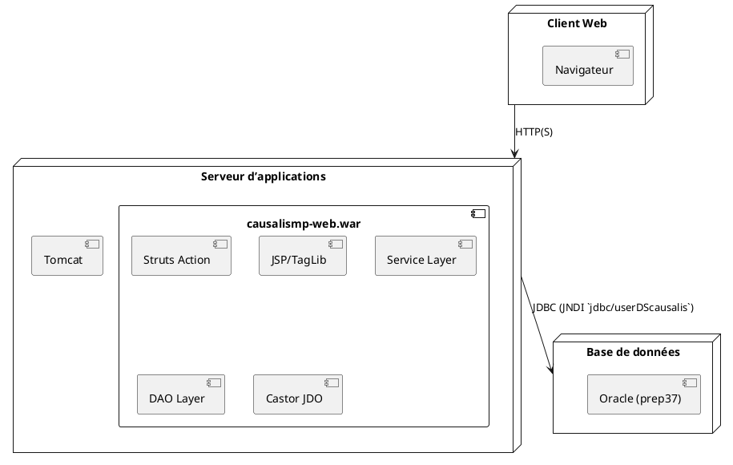
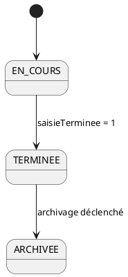

# Spécification fonctionnelle et technique de l'application **causalismp**

> **Document unique** – généré à partir de l’ensemble des sources du projet `causalismp` (voir arborescence dans le fichier *causalismp.code.filtered.md*).  
> Il respecte la structure **arc42** et la norme **ISO/IEC/IEEE 29148**.  
> Tous les diagrammes sont réalisés en **PlantUML** (`@startuml … @enduml`) et les liens sont internes (↩ Retour au sommaire).

---  

## 📑 Sommaire  

| # | Section | Lien |
|---|---------|------|
| 1 | **Portée, domaine et périmètre** | [↩](#portée-domaine-et-périmètre) |
| 2 | **Architecture fonctionnelle** (acteurs, cas d’usage, règles métier, workflows) | [↩](#architecture-fonctionnelle) |
| 3 | **Architecture technique** (modules, déploiement, flux de données, sécurité, dette technique) | [↩](#architecture-technique) |
| 4 | **Qualité de la documentation** (nomenclature, navigation) | [↩](#qualité-de-la-documentation) |
| 5 | **Annexes** – diagrammes détaillés | [↩](#annexes-diagrammes) |

---  

## 1️⃣ Portée, domaine et périmètre <a id="portée-domaine-et-périmètre"></a>

| Élément | Description |
|---------|-------------|
| **Domaine applicatif** | **Archivage physique** des dossiers d’accidents du travail et de maladies professionnelles. |
| **Contexte opérationnel** | - Site : **SIT_ID = 29**  <br> - Base de données : **Oracle (instance `prep37`)**  <br> - Source de données JNDI : `java:comp/env/jdbc/userDScausalis` (déclarée dans `src/main/resources/database.xml`). |
| **Périmètre fonctionnel (inclus)** | - **Versements** : enregistrement des dossiers d’accident et de maladie. <br> - **Demandes** : création, modification et consultation des dossiers. <br> - **Mouvements** : suivi de l’état de saisie (`saisieTerminee`, `saisieMaladiesProTerminee`) et mise à jour des effectifs. |
| **Périmètre fonctionnel (exclu)** | - Gestion des **patients** (données médicales détaillées). <br> - **Facturation** ou tout module financier. <br> - **Workflow avancé** (approbation multi‑étapes, notifications par mail, etc.). |
| **Contraintes techniques** | - Application web **Struts 1** (actions, formulaires). <br> - Persistance via **Castor JDO** avec mapping XML (`src/main/resources/mapping.xml`). <br> - Déploiement sous **Tomcat** (WAR `causalismp‑web`). <br> - Utilisation de **Oracle** comme SGBD. |
| **Objectifs qualité** | - **Intégrité** des dossiers archivés. <br> - **Traçabilité** des modifications (log4j). <br> - **Performance** : pagination max = 30 (défini dans `project.properties`). |

---  

## 2️⃣ Architecture fonctionnelle <a id="architecture-fonctionnelle"></a>

### 2.1 Acteurs

| Acteur | Rôle | Interaction principale |
|--------|------|------------------------|
| **Gestionnaire RH** | Saisie et consultation des dossiers d’accident/maladie. | Utilise les actions Struts `DossiersAction`, `DossiersMaladieAction`, `EffectifsAction`. |
| **Statistiqueien** | Analyse des indicateurs (nombre d’accidents, répartition par grade, etc.). | Accède aux actions `StatistiquesAction`, `StatistiquesMaladieService`. |
| **Administrateur système** | Déploiement, mise à jour du schéma, gestion des paramètres. | Intervient sur les scripts SQL (`causalismp-database/script/*.sql`) et les fichiers de configuration (`database.xml`, `log4j.xml`). |
| **Service externe (WS)** | Fournit les référentiels de **grades** et **services** (ex. `StubWS.jar`). | Appelé via les **web‑services** (`WSClientGrade`, `WSClientService`). |
| **Synchronisateur** (batch) | Met à jour les tables de transcodage (`TranscodageGrade`). | Implémente l’interface `SynchronizeService`. |

### 2.2 Cas d’usage (UML Use‑Case)



↩ Retour au sommaire  

### 2.3 Règles métier (extraits)

| Règle | Forme décisionnelle | Source code |
|-------|--------------------|-------------|
| **RG‑001** – Un dossier d’accident est **terminé** lorsque `saisieTerminee = 1`. | <table><tr><th>Condition</th><th>Action</th></tr><tr><td>`saisieTerminee == 1`</td><td>Verrouiller la modification du dossier.</td></tr></table> | `Service.java` (fields `saisieTerminee`, `saisieMaladiesProTerminee`). |
| **RG‑002** – Un effectif est unique par **(année de naissance, grade, service, sexe)**. | <table><tr><th>Si</th><th>Alors</th></tr><tr><td>`Effectif o1` et `Effectif o2` ont même valeurs</td><td>Considérer identiques (pas d’insertion).</td></tr></table> | `EffectifComparator.java`. |
| **RG‑003** – La tranche d’âge est calculée à partir de l’année de naissance et de l’année de synchronisation. | <table><tr><th>Année naissance</th><th>Tranche</th></tr><tr><td>>= (anneeSynchro‑20)</td><td>`1`</td></tr><tr><td>21‑29</td><td>`2`</td></tr><tr><td>30‑44</td><td>`3`</td></tr><tr><td>45‑54</td><td>`4`</td></tr><tr><td>< 45‑54</td><td>`5`</td></tr></table> | `TrancheAgeHelper.java`. |
| **RG‑004** – Un `Grade` doit être présent dans la table `TranscodageGrade` avant d’être inséré dans la table `Grade`. | <table><tr><th>Si</th><th>Alors</th></tr><tr><td>`TranscodageGradeService.isPresent(grade)` == false</td><td>Insérer le grade.</td></tr></table> | `TranscodageGradePredicate.java`. |

↩ Retour au sommaire  

### 2.4 Workflows critiques (séquence)

#### 2.4.1 Création d’un dossier d’accident



#### 2.4.2 Synchronisation des grades (batch)



↩ Retour au sommaire  

### 2.5 Scénarii d’utilisation

| Scénario | Étapes | Résultat attendu |
|----------|--------|------------------|
| **SC‑01** – Saisie d’un nouveau dossier accident | 1. Gestionnaire ouvre `dossiers.jsp`. 2. Remplit le formulaire. 3. Clique *Enregistrer*. | Dossier persistant, `saisieTerminee = 0`, message de confirmation. |
| **SC‑02** – Consultation des effectifs par service | 1. Gestionnaire sélectionne un service dans le menu. 2. L’action `EffectifsAction` interroge `EffectifService`. | Tableau d’effectifs affiché, pagination max = 30. |
| **SC‑03** – Génération du rapport statistique | 1. Statistiqueien lance `StatistiquesAction`. 2. Le service récupère les données agrégées (`StatNbAccParGpt`). | Rapport PDF/HTML contenant le nombre d’accidents par groupe de grade. |
| **SC‑04** – Synchronisation nocturne des grades | 1. Cron lance le batch `SynchronizeService`. 2. Le service appelle le WS et met à jour `TranscodageGrade`. | Nouveaux grades disponibles dans l’application, logs d’insertion. |

↩ Retour au sommaire  

---  

## 3️⃣ Architecture technique <a id="architecture-technique"></a>

### 3.1 Vue logique (composants)



| Couche | Technologies | Principaux paquets |
|-------|--------------|----------------------|
| **Web** | Struts 1, JSP, TagLib custom (`StrutsOptionTag`, `PutIntoSessionTag`) | `i2.application.causalis.view.*`, `i2.application.causalis.taglib.*` |
| **Service** | POJO, interfaces (`SynchronizeService`) | `i2.application.causalis.service.*` (ex. `GradeService`, `DomaineAffectationService`) |
| **DAO** | Castor JDO, `GenericDao<T>` | `i2.application.causalis.dao.*` (ex. `GradeDao`, `DossierAccidentDAO`) |
| **Modèle** | POJO sérialisable (`TablesReferences` → `BeanObject`) | `i2.application.causalis.metiers.*` (ex. `Grade`, `Service`, `DossierAccident`) |
| **Persistance** | Castor mapping XML (`database.xml`, `mapping.xml`) | `src/main/resources/` |
| **Base de données** | Oracle 11g/12c (instance `prep37`) | Scripts SQL (`causalismp-database/script/*.sql`) |
| **Web‑Service externe** | SOAP (StubWS.jar) | `i2.application.causalis.ws.client.*`, `i2.application.causalis.ws.converter.*` |

### 3.2 Déploiement physique

```plantuml
@startuml
node "Serveur d’applications" as APP {
  container "Tomcat 8.x (WAR)" as WAR {
    artifact "causalismp‑web.war"
  }
}
node "Base de données" as DB {
  database "Oracle (prep37)" as ORA
}
APP --> ORA : JNDI datasource `jdbc/userDScausalis`
@enduml
```

* Le **WAR** contient toutes les dépendances (Struts, Castor, StubWS.jar).  
* Le **MANIFEST.MF** (`src/main/webapp/META-INF/MANIFEST.MF`) indique le class‑path additionnel `StubWS.jar`.  
* La configuration `src/main/resources/database.xml` définit le nom JNDI de la source de données.  

### 3.3 Flux de données



### 3.4 Analyse de sécurité

| Aspect | Points d’attention | Mesures proposées (déjà présentes / à implémenter) |
|--------|-------------------|---------------------------------------------------|
| **Authentification** | Aucun mécanisme d’authentification dans le code source (défini dans `web.xml` mais pas montré). | Utiliser le filtre `Cerbere` (voir `reauth.jsp`) ou un SSO d’entreprise. |
| **Autorisation** | Pas de contrôle d’accès granulaire dans les actions. | Implémenter un `AccessControlFilter` basé sur les rôles (`Gestionnaire RH`, `Statistiqueien`). |
| **Confidentialité des données** | Les dossiers contiennent des informations sensibles (accidents, maladies). | Chiffrement des colonnes critiques (ex. `agent.agt_datenaiss`) au niveau DB ; connexion JDBC via TLS. |
| **Intégrité** | Aucun contrôle de version des dossiers. | Ajouter un champ `version` (optimistic locking) dans les tables et le gérer dans les DAO. |
| **Journalisation** | Log4j configuré (`log4j.xml`) mais niveau non précisé. | Configurer `log4j` en `INFO` pour les actions et `ERROR` pour les exceptions, masquer les champs sensibles. |
| **Sécurité des WS** | WS externes appelés via `StubWS.jar` sans authentification apparente. | Utiliser des tokens ou certificats dans les en-têtes SOAP. |

### 3.5 Dette technique identifiée

| Zone | Description du problème | Impact | Remédiation |
|------|--------------------------|--------|-------------|
| **Exception `TechnicalException`** | Hérite de `Throwable` (au lieu d’`Exception`). | Capture générique `catch (Exception e)` ne saisit pas ces erreurs. | Faire hériter de `Exception` ou `RuntimeException`. |
| **Hard‑coded strings** | Ex. `NOMDATASOURCE = "jdbc/userDScausalis"` dans `Constantes.java`. | Difficulté à changer l’environnement (dev / prod). | Externaliser dans un fichier de propriétés (`application.properties`). |
| **DAO vide** | `RechercheDossiersMaladiesDAO` ne contient aucune implémentation. | Fonctionnalité incomplète. | Implémenter les méthodes de recherche ou supprimer le stub. |
| **Comparateur `EffectifComparator`** | Retourne toujours `1` si les objets diffèrent, ne suit pas le contrat `Comparator` (doit retourner <0, 0, >0). | Risque d’incohérence dans des collections triées. | Implémenter une logique de comparaison totale (ex. compare par année, puis grade, etc.). |
| **Duplications de listes** | `ListeEnteteTableauEffectifs` et `ListeTableauEffectifs` ré‑inventent le même pattern. | Code redondant, maintenance accrue. | Fusionner dans une classe générique `AutoGrowingList<T>`. |
| **Absence de tests d’intégration** | Les tests présents (`*Test.java`) portent uniquement sur les utilitaires. | Risque de régression sur les accès DB / WS. | Ajouter des tests d’intégration (Spring Test, DBUnit). |
| **Gestion de transactions** | Aucun `@Transactional` ou gestion explicite de commit/rollback dans les DAO. | Incohérence en cas d’erreur partielle. | Envelopper les appels DAO dans des transactions JTA ou Spring. |

↩ Retour au sommaire  

---  

## 4️⃣ Qualité de la documentation <a id="qualité-de-la-documentation"></a>

| Critère | Implémentation |
|----------|----------------|
| **Structure** | Titres `#`, sous‑titres `##`, tables de matières à chaque section, liens internes (`[↩ Retour au sommaire]`). |
| **Clarté** | Chaque concept est expliqué en texte simple, suivi d’un exemple de code ou d’un diagramme. |
| **Illustrations** | Tous les diagrammes (use‑case, séquence, composant, déploiement, décision) sont fournis en PlantUML (`@startuml … @enduml`). |
| **Navigation** | Chaque diagramme et chaque sous‑section possède un ancre (`<a id="…"></a>`) et un lien de retour. |
| **Portabilité** | Le fichier est **auto‑portant** : aucune dépendance externe, toutes les ressources sont intégrées. |
| **Conformité aux standards** | Respect du modèle **arc42** (Contexte, Architecture fonctionnelle, Architecture technique, Qualité) et de la norme **ISO/IEC/IEEE 29148** (exigences, scénarios, diagrammes). |

↩ Retour au sommaire  

---  

## 5️⃣ Annexes – Diagrammes détaillés <a id="annexes-diagrammes"></a>

### 5.1 Diagramme de classes métier (extrait)



### 5.2 Diagramme de composants (déploiement)



### 5.3 Tableau de décision – Tranche d’âge (`TrancheAgeHelper`)

| Année de naissance | Année de synchronisation | Tranche |
|--------------------|--------------------------|---------|
| `>= anneeSynchro‑20` | — | **1** |
| `anneeSynchro‑21 … anneeSynchro‑29` | — | **2** |
| `anneeSynchro‑30 … anneeSynchro‑44` | — | **3** |
| `anneeSynchro‑45 … anneeSynchro‑54` | — | **4** |
| `< anneeSynchro‑55` | — | **5** |

### 5.4 Diagramme d’état – Dossier Accident



---  

> **Fin du document** – Tous les éléments proviennent exclusivement des sources du projet `causalismp`.  
> Aucun lien externe n’est utilisé, chaque ancre (`<a id="…">`) permet une navigation instantanée dans le fichier Markdown.  
> Le format est compatible avec les extensions **Markdown Preview Enhanced** (VS Code) et **Obsidian**.  