# 📘 Guide d’atelier **Story Mapping** – *Projet : causalismp*  

> **Document établi à partir des principes du Story Mapping de Jeff Patton**  
> *Jeff Patton – “User Story Mapping: Discover the Whole Story, Build the Right Product”*  

---  

[TOC]

---  

## 1️⃣ Introduction et objectifs  

**Livrable** : *« Représenter visuellement le périmètre fonctionnel de l’application causalismp aligné sur le parcours utilisateur »*  

**Méthodologie** : Atelier collaboratif basé sur le **Story Mapping** (Jeff Patton).  

### Objectifs opérationnels  

| 🎯 | Objectif |
|---|----------|
| 1 | Comprendre collectivement le **parcours complet** d’un acteur (ex. : gestionnaire RH) lorsqu’il déclare, suit et clôture un accident du travail ou une maladie professionnelle. |
| 2 | Identifier, **étape par étape**, les **fonctionnalités** nécessaires (création de dossiers, saisie des pièces, génération de rapports, etc.). |
| 3 | Prioriser les fonctionnalités pour définir le **MVP** (minimum viable product) qui permet de mettre le produit en production rapidement. |
| 4 | Produire un **support visuel partagé** (Story Map) qui servira de référence aux équipes produit, technique, design et métier pendant les phases de conception et de développement. |
| 5 | Détecter les **points de friction** (réglementaires, techniques ou ergonomiques) dès le début afin de les adresser dans la feuille de route. |

---  

## 2️⃣ Contexte d’usage  

| Champ | Valeur |
|-------|--------|
| **Type de livrable** | Standard ✅ |
| **Nature** | Atelier 🤝 |
| **Activité** | « Imaginer une solution » |
| **Méthode** | Story Mapping (Jeff Patton) |
| **Quand l’utiliser** | • Traduire les exigences utilisateurs, la réglementation (Code du travail, obligations de déclaration) et la vision produit en périmètre fonctionnel.<br>• Cadrer le **MVP**, la **V1** ou une **refonte** de l’existant.<br>• Aligner les équipes métier, technique et design sur une même représentation. |
| **Recommandation** | Produire **une Story Map par persona** (max 2‑3) en commençant toujours par l’utilisateur final (ex. : Gestionnaire RH). |
| **Produit** | **causalismp** – Application de gestion des accidents du travail et des maladies professionnelles (module Struts 1, Castor JDO, Oracle). |
| **Domaine métier** | Santé‑travail, suivi des accidents & maladies professionnelles, conformité légale, reporting RH. |
| **Vision produit** | Centraliser, automatiser et simplifier la déclaration, le suivi et le reporting des accidents & maladies professionnelles, tout en respectant les exigences légales françaises. |
| **Contraintes réglementaires** | • Déclaration obligatoire sous 48 h (Code du travail).<br>• Confidentialité des données de santé (RGPD).<br>• Archivage légal des dossiers (10 ans). |
| **Personas clés** | 1️⃣ **Gestionnaire RH** – Déclare, suit et clôture les dossiers.<br>2️⃣ **Employé** – Saisit les informations d’un accident ou d’une maladie.<br>3️⃣ **Médecin du travail / Service prévention** – Valide les pièces justificatives, attribue les grades de gravité. |
| **Problèmes utilisateurs** | • Processus de déclaration long & manuel.<br>• Difficulté à retrouver les dossiers historiques.<br>• Risque de non‑conformité réglementaire.<br>• Reporting fastidieux pour les indicateurs de santé‑travail. |

---  

## 3️⃣ Pré‑requis  

| ✅ | Élément à préparer |
|---|--------------------|
| 1 | **Vision produit** formalisée (pitch, objectifs, KPI). |
| 2 | **Personas** détaillés (verbatims, jobs‑to‑be‑done, pain points). |
| 3 | **Cartographie des exigences légales** (délais de déclaration, archivage, RGPD). |
| 4 | **Backlog actuel** (epics, user stories) – même si incomplet. |
| 5 | **Tableau blanc / mur** (ou outil digital : Mural, FigJam, Miro) avec le **template Story Map** pré‑préparé. |
| 6 | **Facilitateur** (Product Owner ou PNM) disponible 2‑3 h. |
| 7 | **Accès aux maquettes ou captures** des écrans existants (ex. : `editionDossierPage1.jsp`, `statistiques.jsp`). |

> 💡 *Si un pré‑requis manque, prévoyez 15 min en début d’atelier pour le co‑construire rapidement.*  

---  

## 4️⃣ Parties prenantes et rôles  

| Rôle | Profil type | Responsabilité pendant l’atelier |
|------|-------------|-----------------------------------|
| **Animateur** | Product Owner / PNM | Cadre, facilitation, garde‑fou du focus utilisateur. |
| **Profil technique** | Tech Lead / Architecte | Évalue faisabilité, effort, dépendances (JNDI, Castor JDO, Oracle). |
| **Porteur métier** | Responsable RH / Médecin du travail | Valide la pertinence fonctionnelle, priorise les exigences réglementaires. |
| **Designer UX/UI** *(optionnel)* | Designer produit | Enrichit le parcours (wireframes rapides, patterns d’interaction). |
| **Responsable conformité** | Juriste / DPO | Vérifie la prise en compte des contraintes RGPD et légales. |
| **PO / Scrum Master** *(facultatif)* | Scrum Master | S’assure du respect du timing (time‑boxing). |

> ☝️ *Un même participant peut cumuler plusieurs rôles selon la taille de l’équipe.*  

---  

## 5️⃣ Logistique  

| 📅 | Durée | Matériel | Livrable de sortie |
|----|-------|----------|-------------------|
| **2 h 30 – 3 h** (prévoir une pause à 1 h 30) | 150‑180 min | **Physique** : mur, post‑its (3 couleurs : user actions, système, contraintes).<br>**Digital** : tableau Miro/Figma avec template Story Map. | Photo/export de la Story Map, diagramme PlantUML, liste des décisions MVP, points de vigilance. |

---  

## 6️⃣ Déroulé détaillé de l’atelier  

### 🎯 Étape 1 – Introduction (15 min)  

1. **Accueil & tour de table** – chaque participant indique son rôle et ses attentes.  
2. **Rappel du cadre** – objectifs de l’atelier, rappel du **Story Mapping** (backbone = parcours utilisateur, vertical = granularité fonctionnelle, ligne de flottaison = MVP).  
3. **Présentation du contexte** – vision, contraintes légales, personas (ex. : Gestionnaire RH).  
4. **Règles du jeu** – écoute active, pas de jugement, contribution ouverte, focus sur l’expérience utilisateur.  

> ✅ *Astuce* : Affichez un **Job Story** type : <br>**« En tant que Gestionnaire RH, je veux déclarer un accident travail rapidement afin de respecter le délai légal de 48 h et de disposer d’un suivi clair. »**  

---

### 🗺️ Étape 2 – Construction du **Backbone** (30 min)  

| Action | Consigne |
|--------|----------|
| **Définir les grandes étapes** du parcours du Gestionnaire RH (de la prise de connaissance de l’accident à la clôture du dossier). | Exemple de verbes d’action : <br>1️⃣ *Recevoir la déclaration* <br>2️⃣ *Créer le dossier* <br>3️⃣ *Saisir les informations* <br>4️⃣ *Uploader les pièces justificatives* <br>5️⃣ *Valider par le médecin* <br>6️⃣ *Générer le rapport* <br>7️⃣ *Archiver le dossier* |
| **Placer les étapes** de gauche à droite sur le mur (ou le tableau). | Utilisez une couleur (ex. : post‑it bleu) pour chaque étape. |
| **Vérifier la complétude** – le parcours doit couvrir **tout le cycle de vie** d’un accident/maladie. | Invitez chaque participant à proposer une étape manquante. |

---

### 📋 Étape 3 – Détail vertical des activités (45 min)  

Pour chaque étape du backbone :  

1. **Questionner** – « Que doit faire concrètement l’utilisateur ? », « Quelles informations sont nécessaires ? », « Quel(s) choix doit‑il/elle faire ? », « Quel(s) points de friction ? ».  
2. **Lister** – écrire chaque activité, champ, règle métier ou exigence réglementaire sur un post‑it **vert** (ou couleur dédiée).  
3. **Empiler** – placer les post‑its **sous** l’étape correspondante, du **plus essentiel (top)** au **plus secondaire (bottom)**.  

> 📌 **Exemple – Étape 3 : *Saisir les informations***  
> - *Saisir les données personnelles de l’employé* (nom, NIR, fonction).  
> - *Sélectionner le type d’accident* (chute, trouble musculo‑squelettique, etc.).  
> - *Indiquer la date et le lieu de l’accident*.  
> - *Décrire les circonstances (texte libre)*.  
> - *Attribuer un grade de gravité* (via `TranscodageGrade`).  

---

### 🎚️ Étape 4 – Priorisation & définition du **MVP** (30‑45 min)  

1. **Tracer la ligne de flottaison** (horizontal) à travers la carte.  
2. **Au‑dessus** : **Fonctionnalités indispensables** pour que le parcours soit complet et conforme (MVP).  
3. **En‑dessous** : **Fonctionnalités reportables** (V2, backlog).  

#### Questions de priorisation  

| ✅ | Question |
|---|----------|
| 1 | Quelles fonctionnalités sont absolument nécessaires pour que le Gestionnaire RH puisse **déclarer, suivre et clôturer** un dossier dans les 48 h ? |
| 2 | Quelles exigences légales (délais, archivage, RGPD) imposent des fonctionnalités obligatoires ? |
| 3 | Quelles améliorations (ex. : tableau de bord statistique, export PDF, notifications) peuvent être différées ? |
| 4 | Quels sont les **efforts techniques** majeurs (ex. : intégration du service web `StubWS.jar`, mapping Castor) qui pourraient impacter la portée MVP ? |

> 📌 **Définition du MVP** (exemple)  
> - **Backbone complet** (toutes les étapes).  
> - **Activités MVP** : création du dossier, saisie des informations essentielles, upload des pièces, validation médecin, génération du rapport, archivage.  
> - **Exclusions V2** : tableau de bord avancé, export CSV, interface mobile, workflow de relance.  

---

### 🏁 Étape 5 – Conclusion & prochaines étapes (15 min)  

| Action | Détails |
|--------|---------|
| **Relecture collective** | Vérifier la cohérence du parcours + périmètre MVP. |
| **Identifier les points de vigilance** | Ex. : conformité RGPD, gestion des pièces jointes (taille < 5 Mo), dépendance à `StubWS.jar`. |
| **Définir les livrables** | - Photo/export de la Story Map <br> - Diagramme PlantUML (voir ci‑dessous) <br> - Liste des **User Stories** à créer (epics → stories). |
| **Plan d’action** | - Rédaction du backlog (epics → stories) <br> - Estimation (Planning Poker) <br> - Priorisation finale dans le **Product Backlog**. |
| **Communication** | Partager les livrables dans le dépôt (ex. : `docs/storymap/causalismp-storymap.md`). |

> 📸 **Action immédiate** : Prendre en photo le board (ou exporter le canvas) et le partager dans les 24 h via le canal Slack #causalismp‑storymap.  

---  

## 7️⃣ Conseils de facilitation  

| Bonnes pratiques | À éviter |
|------------------|----------|
| Reformuler régulièrement pour s’assurer que tout le monde comprend. | Se perdre dans les détails techniques (ex. : JNDI, Castor) avant d’avoir le parcours. |
| Garder le cap sur l’expérience utilisateur (ex. : temps de saisie, ergonomie). | Laisser un profil dominer les échanges (ex. : seul le développeur parle). |
| Faire participer **tous** les rôles (RH, technique, conformité). | Accepter les digressions hors du parcours (ex. : discussion sur la migration Maven). |
| Utiliser le **time‑boxing** strict pour chaque étape. | Oublier de documenter les arbitrages (ex. : pourquoi un point a été reporté). |
| Ancrer chaque fonctionnalité dans un **besoin utilisateur** ou une **exigence légale**. | Confondre « nice‑to‑have » et « must‑have ». |

---  

## 8️⃣ Exemple de Story Map (simplifiée)  

```markdown
**Parcours Gestionnaire RH (axe horizontal →)**  

[Recevoir déclaration] → [Créer dossier] → [Saisir informations] → [Uploader pièces] → [Valider médecin] → [Générer rapport] → [Archiver]

**Fonctionnalités associées (axe vertical ↓ sous chaque étape)**  

► Recevoir déclaration  
   • Notification email (V2)  
   • Historique des déclarations (V2)  

► Créer dossier  
   • Génération d’un numéro unique (MVP)  
   • Attribution automatique du service (V2)  

► Saisir informations  
   • Formulaire employé (nom, NIR, fonction) (MVP)  
   • Sélection du type d’accident (MVP)  
   • Champ « description » libre (MVP)  
   • Attribution du grade de gravité (via `TranscodageGrade`) (MVP)  
   • Saisie du lieu & date (MVP)  

► Uploader pièces  
   • Upload PDF ≤ 5 Mo (MVP)  
   • Vérification du type MIME (V2)  

► Valider médecin  
   • Interface de validation (MVP)  
   • Envoi automatique au service prévention (V2)  

► Générer rapport  
   • PDF récapitulatif (MVP)  
   • Export CSV (V2)  

► Archiver  
   • Stockage sécurisé 10 ans (MVP)  
   • Accès en lecture seule (MVP)  
   • Suppression sécurisée (V2)  
```

---  

## 9️⃣ Diagramme PlantUML du Story Map  

```plantuml
@startuml
skinparam backgroundColor #FFFFFF
skinparam roundcorner 20
skinparam defaultFontName Arial
skinparam defaultFontSize 12

title Story Map – CausalisMP (Gestionnaire RH)

legend right
  Méthode : Story Mapping (Jeff Patton)
  Axe horizontal : Parcours utilisateur
  Axe vertical   : Détails fonctionnels
  Ligne rouge    : Périmètre MVP
endlegend

' Backbone – Parcours utilisateur
package "Backbone – Parcours Gestionnaire RH" as backbone {
  rectangle "Recevoir\nDéclaration" as step1 #LightBlue
  rectangle "Créer\nDossier" as step2 #LightBlue
  rectangle "Saisir\nInformations" as step3 #LightBlue
  rectangle "Uploader\nPièces" as step4 #LightBlue
  rectangle "Valider\nMédecin" as step5 #LightBlue
  rectangle "Générer\nRapport" as step6 #LightBlue
  rectangle "Archiver\nDossier" as step7 #LightBlue
}

' MVP – Fonctionnalités indispensables
package "<b>MVP</b>\n(Fonctionnalités indispensables)" as mvp #LightGreen {
  rectangle "Numéro unique\n(dossier)" as f1
  rectangle "Formulaire\nEmployé" as f2
  rectangle "Sélection\nType d'accident" as f3
  rectangle "Champ description\nlibre" as f4
  rectangle "Grade de gravité\n(Transcodage)" as f5
  rectangle "Upload PDF ≤5Mo" as f6
  rectangle "Validation\nmédecin" as f7
  rectangle "PDF récapitulatif" as f8
  rectangle "Archivage 10 ans\nlecture‑seule" as f9
}

' V2+ – Fonctionnalités reportables
package "<b>V2+</b>\n(Fonctionnalités reportables)" as v2 #LightYellow {
  rectangle "Notification\nemail" as r1
  rectangle "Historique\ndéclarations" as r2
  rectangle "Attribution\nservice auto" as r3
  rectangle "Vérif. MIME" as r4
  rectangle "Envoi\nprévention" as r5
  rectangle "Export CSV" as r6
  rectangle "Suppression\nsécurisée" as r7
}

' Alignement vertical
step1 -down-> f1
step2 -down-> f1
step3 -down-> f2
step3 -down-> f3
step3 -down-> f4
step3 -down-> f5
step4 -down-> f6
step5 -down-> f7
step6 -down-> f8
step7 -down-> f9

' V2+ connections (exemple)
step1 -down-> r1
step1 -down-> r2
step2 -down-> r3
step4 -down-> r4
step5 -down-> r5
step6 -down-> r6
step7 -down-> r7

@enduml
```



> **Interprétation** : les rectangles **MVP** sont placés **au‑dessus** de la ligne rouge (non affichée dans le diagramme mais implicite). Les rectangles **V2+** sont en dessous et pourront être planifiés dans les itérations suivantes.  

---  

## 🔟 Adaptations contextuelles  

| Contexte | Adaptation recommandée |
|----------|-----------------------|
| **Refonte** | Partir du parcours existant (ex. : `editionDossierPage1.jsp`, `statistiques.jsp`) pour identifier les points de friction avant de proposer de nouvelles fonctionnalités. |
| **Produit fortement réglementé** | Intégrer les exigences légales comme **étapes obligatoires** (ex. : validation médecin, archivage 10 ans). |
| **Multi‑profil** | Créer **une Story Map par persona** (Gestionnaire RH, Employé) puis identifier les **fonctionnalités transverses** (ex. : upload pièces, génération de PDF). |
| **Contraintes techniques fortes** | Inviter le **architecte** dès l’étape 3 pour valider la faisabilité du stockage des pièces (BLOB Oracle) et l’appel du service `StubWS.jar`. |
| **Intégration d’un nouveau service** (ex. : service de notification) | Ajouter une **étape “Notifier”** dans le backbone et la placer en **V2** si la priorité n’est pas immédiate. |

---  

## 11️⃣ Livrables et suite du projet  

| Livrable | Description | Format |
|----------|-------------|--------|
| **Story Map** (photo / export) | Vue d’ensemble du parcours + fonctionnalités (MVP/V2). | PNG / PDF |
| **Diagramme PlantUML** | Représentation formelle du story map (backbone, activités, ligne de flottaison). | `.puml` + rendu PNG |
| **Backlog produit** | Epics → User Stories (avec critères d’acceptation). | Markdown (`backlog.md`) ou fichier JIRA CSV |
| **Matrice de traçabilité** | Fonctionnalité ↔ Besoin utilisateur ↔ Contrainte légale. | Excel / Google Sheet |
| **Roadmap** | Planning MVP → V1 → V2 (sprints). | Gantt (Miro, Excel) |
| **Plan de tests** | Scénarios de validation fonctionnelle et de conformité (RGPD, délai 48 h). | Markdown (`tests.md`) |

### Prochaines étapes suggérées  

1. **Rédaction des user stories** à partir de la Story Map (inclure les critères d’acceptation).  
2. **Estimation** (Planning Poker) pour chaque story MVP.  
3. **Priorisation** finale dans le **Product Backlog** (MVP en priorité).  
4. **Planification du sprint 0** (infrastructure : JNDI datasource, Castor mapping, `StubWS.jar`).  
5. **Définition du Definition of Done** (incluant tests unitaires, tests d’intégration, validation RGPD).  

---  

## 📚 Glossaire  

| Terme | Définition |
|-------|------------|
| **Backbone** | Axe horizontal du story map : les grandes étapes du parcours utilisateur. |
| **MVP (Minimum Viable Product)** | Ensemble minimal de fonctionnalités permettant de livrer un produit utilisable et conforme aux exigences essentielles. |
| **V2** | Version suivante ; fonctionnalités non indispensables pour le MVP mais prévues pour les itérations ultérieures. |
| **JNDI** | Java Naming and Directory Interface – mécanisme d’accès aux ressources (ex. : datasource). |
| **Castor JDO** | Framework de persistance orienté XML/SQL utilisé dans le projet. |
| **RGPD** | Règlement Général sur la Protection des Données – contraintes de confidentialité. |
| **TranscodageGrade** | Mapping entre le grade interne Causalis et le grade du système externe Rehucit. |
| **StubWS.jar** | Bibliothèque contenant les clients des Web Services externes (ex. : service de validation médicale). |
| **Line of flotation** | Ligne (ou zone) qui sépare les fonctionnalités **MVP** (au‑dessus) des fonctionnalités **reportables** (en‑dessous). |
| **Persona** | Représentation fictive d’un type d’utilisateur (ex. : Gestionnaire RH). |
| **Job Story** | Formulation du besoin : *« En tant que … je veux … afin de … »*. |

---  

## 🎉 Conclusion  

Cet atelier Story Mapping vous permet de :

* Visualiser **l’ensemble du parcours** d’un accident ou d’une maladie professionnelle du point de vue du Gestionnaire RH.  
* Extraire **les fonctionnalités essentielles** pour un MVP conforme aux obligations légales (déclaration 48 h, archivage 10 ans, RGPD).  
* Aligner **toutes les parties prenantes** (métiers, technique, conformité, design) autour d’une vision partagée, facilitant ainsi la rédaction du backlog, les estimations et la planification des sprints.  

> **Prochaine action** : partagez les livrables (photo, diagramme PlantUML, backlog initial) dans le dépôt GitLab du projet (`/docs/storymap/`) et planifiez le sprint 0 de mise en place de l’infrastructure (datasource, Castor mapping, StubWS).  

Bon travail d’équipe ! 🚀  