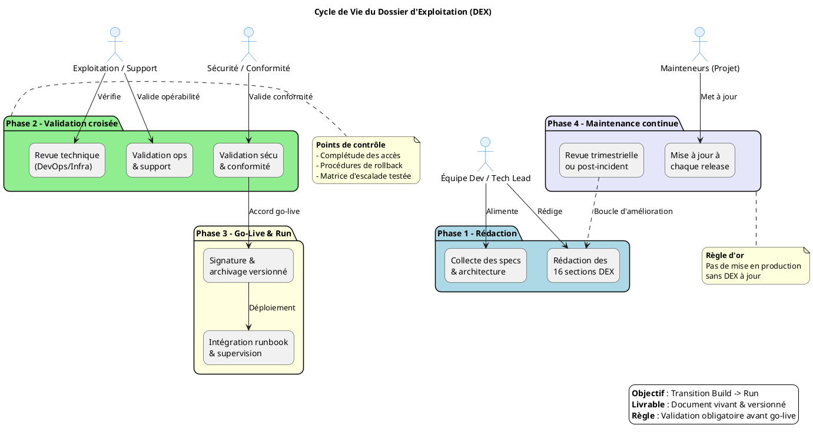

# 📘 Dossier d’Exploitation (DEX) – **cerbere‑bouchon**  

> **Document établi sur les principes de la transition Build → Run et des bonnes pratiques ITIL/DevOps pour l’exploitation applicative**  

[TOC]

---  

## 1️⃣ Introduction et objectifs {#intro}
**Objectif général** – Document de référence garantissant la continuité, la maintenabilité et la sécurisation de l’exploitation de l’application **cerbere‑bouchon** en production.  

| ✅ Objectifs opérationnels |
|----------------------------|
| Assurer la continuité de service |
| Documenter les procédures de gestion courante |
| Faciliter le support et la résolution d’incidents |
| Encadrer les responsabilités (Dev / Ops / Support) |
| Assurer la conformité et la maîtrise des risques |
| Accompagner la phase de transition **Build → Run** |

---  

## 2️⃣ Contexte d’usage et périmètre {#contexte}
| Élément | Valeur |
|---------|--------|
| **Nom du projet** | **cerbere‑bouchon** |
| **Chemin du dépôt** | `G:\WarchoLife\WarchoDevplace\Gitlab_Applications\ambulon\workplace-ambulon\gitlab\cerbere-bouchon` |
| **Type de livrable** | Standard ✅ |
| **Nature** | Document de référence 📘 |
| **Activité** | Transition Build → Run / Exploitation |
| **Quand l’utiliser** | - Avant le go‑live   - Formation des équipes d’exploitation   - Audits de conformité, PRA/PCA, revues de sécurité |
| **Cycle de vie** | Document vivant – mise à jour à chaque évolution fonctionnelle, technique ou d’infrastructure |

---  

## 3️⃣ Pré‑requis et jalons {#pre-requis}
- [ ] Architecture technique validée et schémas à jour  
- [ ] Environnement de production stabilisé (accès, réseaux, DNS, certificats)  
- [ ] Politiques définies : sauvegarde, supervision, sécurité, SLA  
- [ ] Contacts clés identifiés (métiers, techniques, support, sécurité)  
- [ ] Outillage prêt : monitoring, logging, ordonnanceur, gestion des secrets  

> ⏱ **Jalon critique** – Le DEX doit être **validé et signé** bien avant la mise en service. Aucun déploiement en production ne doit intervenir sans DEX approuvé.

---  

## 4️⃣ Gouvernance et rôles {#gouvernance}
| Rôle | Profil type | Responsabilité |
|------|-------------|----------------|
| **Rédacteur principal** | Tech Lead / DevOps / Référent Prod | Rédaction, structuration, intégration des specs techniques |
| **Validateur Exploitation** | Chef d’exploitation / Responsable support | Vérification de l’opérabilité et de la complétude |
| **Validateur Sécurité/Conformité** | RSSI / DPO / Auditeur interne | Validation des procédures de sécurité, backup, conformité |
| **Mainteneur** | Équipe projet / PO technique | Mise à jour continue à chaque release ou changement d’infra |

---  

## 5️⃣ Structure détaillée du DEX (16 sections standards) {#structure}
> Chaque section doit être remplie avec les informations propres à **cerbere‑bouchon**. Les parties entre `[…]` sont à remplacer.

| N° | Section | Contenu attendu (exemples) |
|---:|---------|----------------------------|
| 1 | **Généralités** | Objet, domaine d’application, audience cible, version du document |
| 2 | **Documents applicables et de référence** | Normes internes, chartes, architecture, politiques sécurité |
| 3 | **Terminologie** | Glossaire technique/métier, abréviations, acronymes |
| 4 | **Spécificités** | Fonctionnalités critiques, SLA/SLO, contacts clés, matrice d’escalade |
| 5 | **Architecture** | Schémas logiques/physiques, flux de données, infra prod, PRA/PCA |
| 6 | **Serveurs** | Accès (SSH/RDP/Console), OS, versions, CPU/RAM/Stockage, DNS/IP |
| 7 | **Application** | Composants logiciels, versions, paramètres, procédure de déploiement |
| 8 | **Supervision et métrologie** | Outils de monitoring, seuils d’alerte, dashboards, métriques clés |
| 9 | **Sauvegarde** | Politique (fréquence, rétention, type), localisation, procédure de restauration |
|10 | **Stockage** | Inventaire des volumes, quotas, chemins d’accès, gestion des logs |
|11 | **Inventaire des bases** | Moteurs BDD, versions, schémas, utilisateurs, maintenance, archivage |
|12 | **Flux inter‑applicatifs** | Matrice des échanges, protocoles, ports, authentification, dépendances |
|13 | **Plan de production** | Ordonnancement, tâches planifiées (cron/batch), fenêtres de maintenance |
|14 | **Sécurisation des images** | Scan de vulnérabilités, hardening, gestion des secrets, politique de patching |
|15 | **Opérations courantes** | Check‑lists quotidiennes, gestion des logs, erreurs connues, diagnostic |
|16 | **Opérations récurrentes** | Gestion des comptes, rotation des certificats, nettoyages, audits périodiques |

> **Note** – Adaptez, fusionnez ou supprimez les sections selon le contexte (ex. : serverless, Kubernetes, legacy, etc.).

---  

## 6️⃣ Diagramme PlantUML du cycle de vie DEX {#diagramme}

---  

## 7️⃣ Conseils de rédaction et maintenance {#conseils}
| ✅ Bonne pratique | ❌ À éviter |
|-------------------|-------------|
| Utiliser un dépôt versionné (Git, Wiki) avec historique | Stocker le DEX en pièce jointe email ou sur un partage non versionné |
| Rédiger en langage clair, orienté action et procédure | Rédiger des descriptions vagues ou purement théoriques |
| Inclure captures d’écran, chemins exacts et commandes | Laisser des placeholders `[À COMPLÉTER]` en production |
| Prévoir une revue systématique à chaque release majeure | Considérer le DEX comme un document « jetable » post‑lancement |
| Lier le DEX aux runbooks, tickets d’incident et PRA | Isoler le DEX des outils de supervision et de ticketing |

---  

## 8️⃣ Adaptations contextuelles {#adaptations}
| Contexte | Adaptation recommandée |
|----------|------------------------|
| **Applications Cloud / Serverless** | Remplacer la section *Serveurs* par *Services managés, IAM, Config as Code, Limits/Quotas* |
| **Secteur réglementé (Santé, Finance, Public)** | Renforcer les sections Sécurité, Traçabilité, Archivage légal, Conformité RGAA/ANSSI |
| **Legacy / Monolithe** | Insister sur la dépendance OS, les patches, la compatibilité, les procédures de reprise manuelle |
| **Microservices / Kubernetes** | Remplacer *Inventaire BDD/Serveurs* par *Clusters, Namespaces, Helm/Manifests, Observabilité (Prometheus/Grafana/Loki)* |

---  

## 9️⃣ Livrables et intégration {#livrables}
- **Livrables immédiats**  
  - DEX versionné (`cerbere-bouchon-DEX.md`)  
  - Checklist de validation signée par toutes les parties prenantes  
  - Matrice de traçabilité : DEX ↔ Architecture ↔ Runbooks ↔ Tickets support  

- **Intégration continue**  
  - Lier le DEX au pipeline CI/CD (validation automatisée des sections critiques)  
  - Ajouter des liens DEX dans les pages d’accueil de supervision (Grafana, Datadog, …)  
  - Automatiser la génération de parties du DEX via IaC (Terraform, Ansible)  

---  

## 🔍 Mini‑glossaire {#glossaire}
| Acronyme | Définition |
|----------|------------|
| **SLA** | Service Level Agreement – engagement de disponibilité et de performance |
| **SLO** | Service Level Objective – objectif mesurable dérivé du SLA |
| **PRA** | Plan de Reprise d’Activité – procédures de restauration après sinistre |
| **PCI** | Plan de Continuité d’Infrastructure – maintien de l’infrastructure en cas d’incident |
| **IAM** | Identity & Access Management – gestion des identités et des accès |
| **CI/CD** | Continuous Integration / Continuous Deployment – chaîne d’automatisation du déploiement |
| **Runbook** | Documentation opérationnelle détaillant les procédures de gestion courante et d’incident |
| **KPI** | Key Performance Indicator – indicateur clé de performance |
| **RACI** | Responsable, Accountable, Consulted, Informed – matrice de responsabilités |

---  

## 📎 Annexes (exemple) {#annexes}
> **À compléter** – Ajoutez ici les schémas d’architecture, les extraits de configuration, les scripts de sauvegarde, etc.

---  

### ↩ Retour au sommaire  
[TOC]   (Cliquez pour revenir en haut)

---  

*Document généré le 28 avril 2026 – prêt à être personnalisé en moins de 5 minutes en remplaçant les champs entre `[…]` par les informations propres à votre projet.*