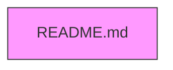

# cerbere-bouchon – Documentation Technique

[TOC]

---

## 📋 Présentation du Projet

| Élément | Valeur |
|--------|--------|
| **Nom du projet** | cerbere-bouchon |
| **Chemin complet** | `G:\WarchoLife\WarchoDevplace\Gitlab_Applications\ambulon\workplace-ambulon\gitlab\cerbere-bouchon` |
| **Nombre de fichiers non‑binaires** | 1 |
| **Fichiers analysés** | 1 |

↩ [Retour au sommaire](#cerbere-bouchon-documentation-technique)

---

## 📁 Arborescence des Fichiers



*Arborescence détaillée*  

```
└── README.md (124 octets)
```

↩ [Retour au sommaire](#cerbere-bouchon-documentation-technique)

---

## 📊 Statistiques d'Extraction

| Statistique | Valeur |
|------------|--------|
| **Fichiers analysés** | 1 |
| **Fichiers conservés (contenu complet)** | 1 |
| **Fichiers exclus (binaires/générés)** | 0 |
| **Fichiers omis (non prioritaires)** | 0 |
| **Taille totale originale** | 124 octets (~0,0 MB) |
| **Taille conservée** | 124 octets (~0,0 MB) |
| **Réduction** | 0,0 % |

↩ [Retour au sommaire](#cerbere-bouchon-documentation-technique)

---

## 📄 Contenu du Fichier `README.md`

> **Chemin relatif** : `README.md`  
> **Taille** : 124 octets  
> **Lignes** : 4  
> **Type** : Markdown

```markdown
Dépots de cerbere-bouchon
https://forge.din.developpement-durable.gouv.fr/nexus/#browse/search=name.raw%3Dcerbere-bouchon
```

↩ [Retour au sommaire](#cerbere-bouchon-documentation-technique)

---

## 🤖 Résumé (IA)

> **Note** : La tentative de génération de résumés automatisés a échoué (erreur 401 – accès non autorisé). Aucun résumé n'est disponible pour le moment.

↩ [Retour au sommaire](#cerbere-bouchon-documentation-technique)

---

## ℹ️ Informations Complémentaires

- Ce document a été généré à partir des métadonnées et du contenu du dépôt `cerbere-bouchon`.
- Aucun code source supplémentaire n'est présent dans le dépôt ; il ne contient qu'un fichier `README.md` décrivant le dépôt et fournissant un lien vers son emplacement sur le serveur Nexus interne.
- Pour obtenir davantage de contexte technique (architecture, dépendances, etc.), il sera nécessaire d'analyser les autres modules du projet `ambulon` ou de consulter le dépôt complet via le lien fourni.

↩ [Retour au sommaire](#cerbere-bouchon-documentation-technique)