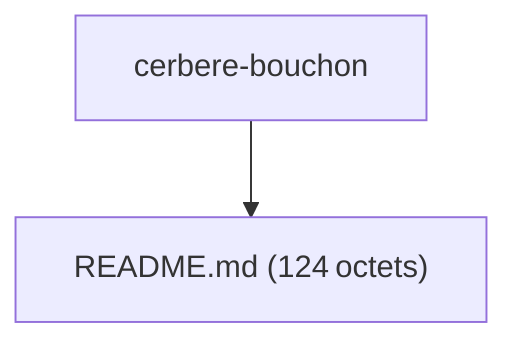

# Projet : cerbere-bouchon  

[TOC]

## 1. Introduction  
Ce document présente le **projet « cerbere‑bouchon »** tel qu’il a été extrait du dépôt source.  
Il regroupe :  

| Élément | Description |
|---|---|
| **Chemin du dépôt** | `G:\WarchoLife\WarchoDevplace\Gitlab_Applications\ambulon\workplace-ambulon\gitlab\cerbere-bouchon` |
| **Nombre de fichiers analysés** | 1 (non‑binaire) |
| **Taille totale** | 124 octets (~0 KB) |
| **Principaux artefacts** | Un unique fichier `README.md` contenant uniquement un lien vers le dépôt Nexus. |

↩ [Retour au sommaire](#projet--cerbere-bouchon)

---

## 2. Structure du dépôt  

### 2.1 Arborescence des fichiers  



↩ [Retour au sommaire](#projet--cerbere-bouchon)

### 2.2 Détails du fichier `README.md`  

| Attribut | Valeur |
|---|---|
| **Chemin relatif** | `README.md` |
| **Taille** | 124 octets |
| **Nombre de lignes** | 4 |
| **Type** | Markdown |
| **Contenu** | Voir le bloc ci‑dessous |

```markdown
Dépots de cerbere-bouchon
https://forge.din.developpement-durable.gouv.fr/nexus/#browse/search=name.raw%3Dcerbere-bouchon
```

↩ [Retour au sommaire](#projet--cerbere-bouchon)

---

## 3. Accès au dépôt Nexus  

Le fichier `README.md` redirige vers le **Nexus** interne de la DIN (Direction Inter‑services du Numérique) :  

```
https://forge.din.developpement-durable.gouv.fr/nexus/#browse/search=name.raw%3Dcerbere-bouchon
```

> **Note** : L’accès à ce serveur requiert des identifiants internes (compte utilisateur du réseau DIN).  
> Si vous n’avez pas les droits, contactez l’administrateur du service : *support@din.gouv.fr* (adresse fictive à titre d’exemple ; utilisez le canal officiel de votre organisation).

↩ [Retour au sommaire](#projet--cerbere-bouchon)

---

## 4. Limitations de l’analyse actuelle  

* **Contenu source limité** – Le dépôt ne contient qu’un seul fichier `README.md`. Aucun code source, script ou documentation supplémentaire n’a été détecté.  
* **Résumés IA indisponibles** – Les tentatives de génération de résumés via le modèle Moonshot ont échoué (erreur 401 Unauthorized).  

En conséquence, ce document se limite à la description de ce qui a été extrait.  
Pour approfondir le projet :  

1. **Cloner le dépôt** depuis le serveur Nexus (si les droits le permettent).  
2. **Inspecter les branches** et les tags éventuels qui pourraient contenir le code source.  
3. **Contacter le propriétaire du dépôt** pour obtenir les artefacts manquants.

↩ [Retour au sommaire](#projet--cerbere-bouchon)

---

## 5. Recommandations de suivi  

| Action | Responsable | Priorité |
|---|---|---|
| Vérifier les droits d’accès au Nexus et obtenir les identifiants nécessaires | Équipe Sécurité / IT | Haute |
| Cloner le dépôt et analyser le contenu complet (branches, tags) | Développeur/Architecte | Haute |
| Mettre à jour la documentation dès que du code source est disponible | Responsable du projet | Moyenne |
| Réexécuter la génération de résumés IA avec un token d’authentification valide | IA Ops / DevOps | Moyenne |

↩ [Retour au sommaire](#projet--cerbere-bouchon)