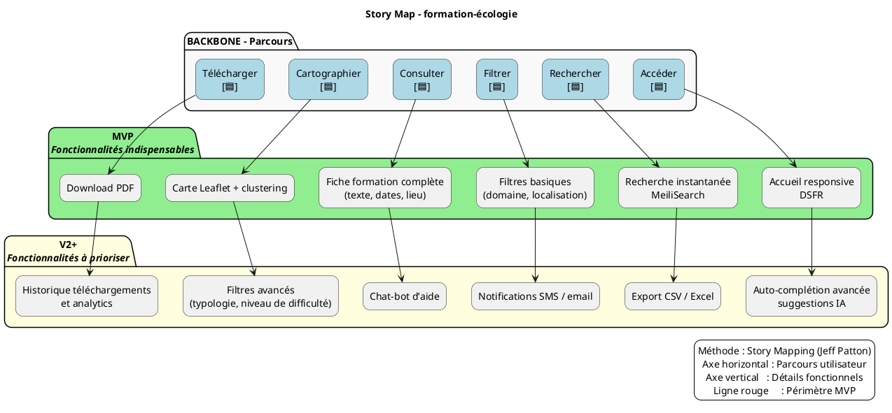

# 📚 Story Mapping – Représenter le périmètre fonctionnel du produit **formation‑écologie**
> **Document établi à partir des principes du Story Mapping de Jeff Patton**  

[TOC]

---  

## 1️⃣ Introduction et objectifs

| 📌 | Description |
|---|-------------|
| **Livrable** | *Story Map* – représentation visuelle du périmètre fonctionnel alignée sur le parcours utilisateur. |
| **Méthodologie** | Atelier collaboratif basé sur le **Story Mapping (Jeff Patton)**. |
| **Objectifs opérationnels** | 1️⃣ Aligner toute l’équipe (product, tech, métier, design) sur le **parcours cible** de l’usager.<br>2️⃣ Identifier **toutes les fonctionnalités** nécessaires à chaque étape.<br>3️⃣ Prioriser pour définir le **MVP fonctionnel** (ou V1).<br>4️⃣ Produire un support visuel partagé (photo / export) qui servira de base aux backlogs, road‑maps et estimations. |

---  

## 2️⃣ Contexte d’usage

| 📂 | Valeur |
|---|--------|
| **Type de livrable** | Standard ✅ |
| **Nature** | Atelier 🤝 – « Imaginer une solution » |
| **Méthode** | Story Mapping (Jeff Patton) |
| **Quand l’utiliser** | • Traduire la recherche utilisateur, la réglementation et la vision produit en périmètre fonctionnel.<br>• Cadrer un **MVP**, une **V1** ou une **refonte** du portail.<br>• Aligner les équipes métier, technique et design sur une même représentation. |
| **Recommandation** | Créer **une Story Map par persona principal** (max 2‑3). Commencer toujours par le **persona final** (ex. : agent du ministère, formateur interne). |

### 2.1 Produit & vision

* **Nom du produit** : **formation‑écologie**  
* **Domaine métier** : Portail public de consultation du catalogue **RenoiRH** (formations durables) avec recherche avancée et visualisation cartographique.  
* **Vision** : « Permettre à chaque acteur du ministère de **trouver, visualiser et exploiter** les formations écologiques en moins de 200 ms, dans une interface **accessible** (RGAA) et conforme au **Design System de l’État (DSFR)**. »

### 2.2 Personas & problèmes utilisateurs

| Persona | Besoin principal | Pain point / problème |
|---------|----------------|-----------------------|
| **Agent du ministère** (utilisateur interne) | Rechercher rapidement une formation adaptée à son service. | Recherche lente, résultats non pertinents, filtre insuffisant. |
| **Formateur / organisme** | Publier / mettre à jour ses sessions de formation. | Processus d’import manuel, manque de visibilité sur le catalogue. |
| **Usager occasionnel** (consultation publique) | Découvrir les offres de formation sur une carte interactive. | Carte peu réactive, affichage incomplet des lieux, manque d’accessibilité. |

### 2.3 Contraintes & exigences

| Catégorie | Contraintes |
|-----------|-------------|
| **Réglementaires** | Publication de données publiques uniquement, conformité RGAA, utilisation du DSFR. |
| **Techniques** | Stack : Python 3.11 / Django 4.x, PostgreSQL, MeiliSearch (indexation), Docker Compose, Nginx reverse‑proxy. |
| **Performance** | Temps de réponse < 200 ms pour les requêtes de recherche. |
| **Sécurité** | Disponibilité continue, intégrité des données RenoiRH, traçabilité des logs. |
| **Opérationnelles** | Cron d’import quotidien (SFTP → S3 → DB) & re‑indexation asynchrone. |

---  

## 3️⃣ Pré‑requis

| ✅ | Élément indispensable avant l’atelier |
|---|--------------------------------------|
| 1️⃣ | **Vision produit** (pitch, objectifs, KPI). |
| 2️⃣ | **Personas** et **verbatims** issus des interviews / enquêtes. |
| 3️⃣ | **Problèmes utilisateurs** (jobs‑to‑be‑done, pain points). |
| 4️⃣ | **Contraintes réglementaires** (RGAA, DSFR, confidentialité). |
| 5️⃣ | **Backlog existant** (épics ou user stories déjà définis). |
| 6️⃣ | **Accès aux données d’exemple** (ex. : extrait du catalogue RenoiRH). |

> 💡 *Si un pré‑requis manque, prévoir 10‑15 min en début d’atelier pour le co‑construire rapidement.*  

---  

## 4️⃣ Parties prenantes et rôles

| Rôle | Profil type | Responsabilité dans l’atelier |
|------|-------------|--------------------------------|
| **Animateur** | Chef de produit / PNM | Cadre, facilitation, garde du focus utilisateur. |
| **Profil technique** | Tech Lead / Architecte | Évalue faisabilité, effort, dépendances (Django, MeiliSearch, Docker). |
| **Porteur métier** | MOA / Responsable formation | Valide la pertinence fonctionnelle et la priorisation. |
| **Designer UX/UI** *(optionnel)* | Designer produit | Enrichit le parcours, propose des patterns DSFR & RGAA. |
| **Responsable Sécurité** *(optionnel)* | RSSI | Vérifie les exigences de traçabilité et de conformité. |

> ☝️ *Un même participant peut cumuler plusieurs rôles selon les effectifs.*  

---  

## 5️⃣ Logistique

| 📅 | Détails |
|---|----------|
| **Durée** | 2 h 30 – 3 h (prévoir une pause à 1 h 30 si 3 h). |
| **Matériel – physique** | Mur / tableau blanc, post‑its (3 couleurs : 🟦 Backbone, 🟩 MVP, 🟨 V2+), marqueurs, ruban de masquage. |
| **Matériel – digital** | Outil collaboratif (Mural, FigJam, Miro, Klaxoon) avec template Story Map pré‑préparé. |
| **Livrable de sortie** | Photo ou export du Story Map, liste des décisions MVP, points de vigilance, diagramme PlantUML. |
| **Salle** | Disposer les participants en cercle autour du tableau pour favoriser la visibilité. |

---  

## 6️⃣ Déroulé détaillé de l’atelier

### 🎯 Étape 1 – Introduction (15 min)

1. Accueil, tour de table (nom, rôle).  
2. Présenter les **objectifs** de l’atelier et le **principe du Story Mapping** (Jeff Patton).  
3. Rappeler le **contexte** (persona cible, contraintes, vision).  
4. Règles de collaboration : écoute active, contributions ouvertes, suspension du jugement.  

> ✅ *Astuce* : afficher une **job story** type :  
> *« En tant qu’**agent du ministère**, je veux **trouver une formation pertinente** afin de **répondre rapidement aux besoins de mon service**. »  

### 🗺️ Étape 2 – Parcours utilisateur horizontal (30 min)

| Action | Consigne |
|--------|----------|
| **Question** | « Quelles sont les **grandes étapes** que suit l’usager sur le portail ? » |
| **Méthode** | Chaque étape = **verbe d’action** (ex. : *Accéder*, *Rechercher*, *Filtrer*, *Consulter*, *Visualiser sur carte*, *Télécharger*). |
| **Livrable** | Post‑its disposés **de gauche à droite** (Backbone). |

#### Exemple de Backbone (pré‑rempli)

```
[Accéder au portail] → [Rechercher une formation] → [Filtrer les résultats] → [Consulter la fiche] → [Visualiser sur carte] → [Télécharger / S’inscrire]
```

### 📋 Étape 3 – Détail vertical des activités (45 min)

Pour chaque étape du Backbone :

1. **Question** : « Que doit faire concrètement l’usager ? »  
2. **Question** : « De quelles informations a‑t‑il besoin ? »  
3. **Question** : « Quels sont les points de friction potentiels ? »  

*Déposez les réponses **verticalement** sous chaque étape, du plus essentiel (MVP) en haut, aux fonctionnalités additionnelles en bas.*  

#### Exemple (début)

- **Accéder au portail**  
  - Chargement du site (temps < 1 s)  
  - Page d’accueil responsive DSFR  
  - Message d’accessibilité (RGAA)  

- **Rechercher une formation**  
  - Champ libre + suggestions auto‑complétion  
  - Bouton « Rechercher » (déclenche requête MeiliSearch)  
  - Filtre par type de formation, domaine, niveau  

*(Continuez jusqu’à la dernière étape.)*  

### 🎚️ Étape 4 – Priorisation & définition du MVP (30‑45 min)

1. Tracez une **ligne de flottaison** (horizontal) au-dessus du tableau.  
2. **Au‑dessus** : fonctionnalités **indispensables** pour que l’usager complète le parcours (MVP).  
3. **En‑dessous** : fonctionnalités **reportables** (V2, backlog).  

| Questions clés | Exemple de réponses |
|----------------|----------------------|
| *Quelles fonctionnalités sont absolument nécessaires ?* | Accès au catalogue, recherche MeiliSearch, affichage fiche formation, carte interactive (leaflet + cluster). |
| *Qu’est‑ce qui peut être retiré sans bloquer le parcours ?* | Export PDF, notifications SMS, chat‑bot d’aide. |
| *Quel critère d’acceptation définit le MVP ?* | L’usager doit pouvoir **trouver et visualiser** une formation en < 200 ms, depuis la page d’accueil jusqu’à la fiche détaillée. |

### 🏁 Étape 5 – Conclusion & prochaines étapes (15 min)

1. Relire la carte : vérifier la **cohérence** du parcours et du périmètre MVP.  
2. Noter les **points de vigilance**, questions en suspens, dépendances techniques.  
3. Définir la **suite logique** :  
   - Export du Story Map (photo / PNG).  
   - Création du backlog (épics → user stories).  
   - Estimation (story points, t‑shirts).  
   - Maquettage des écrans clés (DSFR).  

> 📸 *Action immédiate* : prendre en photo le board (ou exporter le tableau digital) et le partager **dans les 24 h** via le canal Slack #formation‑ecologie‑story‑map.  

---  

## 7️⃣ Conseils de facilitation

| ✅ Bonnes pratiques | ❌ À éviter |
|-------------------|--------------|
| Reformuler régulièrement pour assurer la clarté. | S’enliser dans les détails techniques dès le départ. |
| Garder le focus sur **l’expérience utilisateur**. | Laisser un profil (tech / métier) dominer les échanges. |
| Faire participer **tout le monde** (tech, métier, design). | Accepter les digressions hors du parcours. |
| Utiliser un **time‑boxing strict** par étape. | Oublier de documenter les arbitrages (MVP vs V2). |
| Ancrer chaque fonctionnalité dans un **besoin utilisateur**. | Confondre « nice to have » et « must have ». |

---  

## 8️⃣ Exemple de Story Map (simplifiée)

```markdown
Parcours utilisateur (axe horizontal →) :
[Accéder] — [Rechercher] — [Filtrer] — [Consulter] — [Cartographier] — [Télécharger]

Fonctionnalités associées (axe vertical ↓ sous chaque étape) :

► Accéder
   • Page d’accueil DSFR responsive
   • Message de conformité RGAA
   • Charge < 1 s (optimisation assets)

► Rechercher
   • Champ libre + auto‑complétion
   • Bouton « Rechercher » → API MeiliSearch
   • Résultats instantanés (< 200 ms)

► Filtrer
   • Filtre par domaine, niveau, localisation
   • Sauvegarde du filtre en session
   • Indicateur de nombre de résultats

► Consulter
   • Fiche détaillée (titre, description, dates, lieux)
   • Bouton « S’inscrire » (lien externe)
   • Accessibilité (ARIA, contrastes)

► Cartographier
   • Carte Leaflet avec clustering (Leaflet.markercluster)
   • Clic sur cluster → zoom + liste sessions proches
   • Légende des types de formation

► Télécharger
   • PDF « Programme formation » (download)
   • Email de confirmation (optionnel)
   • Historique des téléchargements (log)
```

---  

## 9️⃣ Diagramme PlantUML du Story Map



> **Comment lire le diagramme** :  
> - Les **rectangles bleus** (Backbone) représentent les étapes du parcours.  
> - Les **rectangles verts** sont les **fonctionnalités MVP** (au‑dessus de la ligne rouge).  
> - Les **rectangles jaunes** sont les **fonctionnalités V2+** (en dessous).  

---  

## 🔟 Adaptations contextuelles

| Contexte | Adaptation recommandée |
|----------|----------------------|
| **Refonte** | Partir du parcours existant (ex. : navigation actuelle), identifier les points de friction, puis ajouter les nouvelles étapes (ex. : “Cartographier”). |
| **Produit réglementé** | Intégrer les obligations RGAA et DSFR comme **étapes obligatoires** du Backbone (ex. : “Afficher conformité RGAA”). |
| **Multi‑personas** | Créer **une Story Map par persona** (agent, formateur, usager) puis superposer les fonctionnalités transverses dans une **Vue globale**. |
| **Contrainte technique forte** | Inviter le **profil technique** dès l’étape 3 (détail vertical) pour valider la faisabilité de MeiliSearch, du clustering Leaflet, et du cron d’import. |
| **Déploiement en OpenStack** | Ajouter une étape “**Déployer**” dans le backlog (non visible sur le parcours utilisateur) pour couvrir CI/CD, sauvegardes et supervision. |

---  

## 1️⃣1️⃣ Livrables et suite du projet

| Livrable | Contenu | Usage |
|----------|---------|-------|
| **Story Map** (photo / export PNG) | Représentation visuelle du périmètre fonctionnel (Backbone + MVP/V2). | Partage avec les équipes, base du backlog. |
| **Diagramme PlantUML** | Version formelle du Story Map (code source). | Documentation technique, génération automatique. |
| **Backlog produit** | Epics → User Stories (ex. : “En tant qu’agent, je veux filtrer par domaine”). | Alimenter le sprint planning, estimations. |
| **Matrice de traçabilité** | Fonctionnalité ↔ besoin utilisateur ↔ contrainte (RGAA, performance). | Vérifier la couverture des exigences. |
| **Roadmap** | MVP → V1 → V2 (jalons, dates). | Alignement des releases. |
| **Prochaines étapes** | 1️⃣ Rédaction des user stories avec critères d’acceptation.<br>2️⃣ Maquettage des écrans clés (DSFR).<br>3️⃣ Estimation technique (story points).<br>4️⃣ Sprint 0 (setup CI/CD, Docker, tests). | Démarrage du développement. |

---  

## 📚 Mini‑glossaire (facultatif)

| Terme | Définition |
|-------|------------|
| **Backbone** | Axe horizontal du Story Map : les grandes étapes du parcours utilisateur. |
| **Epic** | Groupe de user stories partageant le même objectif métier. |
| **MVP** | Minimum Viable Product – version fonctionnelle la plus simple qui délivre la valeur centrale. |
| **Job‑to‑be‑Done** | Formulation du besoin utilisateur sous forme de tâche à accomplir. |
| **RGAA** | Référentiel Général d’Accessibilité pour les Administrations. |
| **DSFR** | Design System de l’État (framework UI). |
| **MeiliSearch** | Moteur de recherche full‑text orienté performance et pertinence. |
| **Leaflet.markercluster** | Plugin Leaflet pour regrouper les points sur une carte. |

---  

## 🔚 Conclusion

En suivant ce guide, votre équipe pourra **co‑construire rapidement** une représentation visuelle du périmètre fonctionnel du portail **formation‑écologie**, aligner les besoins utilisateurs, les contraintes réglementaires et les capacités techniques, puis **définir le MVP** qui servira de socle à la première version livrable.  

Bonne cartographie ! 🚀  