# 📚 Guide d’atelier **Story Mapping** – *Représenter le périmètre fonctionnel du produit **formation‑ecologie***

> **Document établi à partir des principes du Story Mapping de Jeff Patton** – *User Story Mapping: Discover the Whole Story, Build the Right Product*  

[TOC]

---  

## 1️⃣ Introduction et objectifs

**Livrable** : *« Représenter visuellement un périmètre fonctionnel aligné sur le parcours utilisateur »*  

| Objectif | Pourquoi c’est important |
|---------|--------------------------|
| 🎯 **Comprendre collectivement le parcours cible de l’usager** | Aligner toutes les parties prenantes (MOA, GTI, développeurs, designers) sur la même vision du flux de l’utilisateur final. |
| 🎯 **Identifier les fonctionnalités nécessaires à chaque étape** | Découper le besoin en *epics* → *user stories* exploitables par les équipes techniques. |
| 🎯 **Prioriser pour définir un MVP fonctionnel** | Tracer la **ligne de découpe** (MVP / V1) afin de livrer rapidement une version testable et à forte valeur métier. |
| 🎯 **Créer un support visuel partagé** | La Story Map devient le point de référence pour le backlog, la roadmap et la communication inter‑équipes. |
| 🎯 **Faciliter la prise de décision** | Visualiser les dépendances, les contraintes réglementaires (RGAA, DSFR) et les risques techniques. |

---

## 2️⃣ Contexte d’usage

| Élément | Détails |
|--------|---------|
| **Type de livrable** | Standard ✅ |
| **Nature** | Atelier 🤝 – « Imaginer une solution » |
| **Méthode** | Story Mapping (Jeff Patton) |
| **Quand l’utiliser** | <ul><li>Traduire la recherche utilisateur, la réglementation et la vision produit en périmètre fonctionnel.</li><li>Cadrer un MVP, une V1 ou une refonte du portail.</li><li>Aligner les équipes métier, technique et design sur une même représentation.</li></ul> |
| **Recommandation** | Créer **une Story Map par persona principal** (ex. : *Usager ministère*, *Administrateur GTI*), puis identifier les fonctionnalités transverses. |

### 2.1. Principaux **personas** (extraits du dossier DAT)

| Persona | Besoin principal | Pain point |
|--------|------------------|------------|
| **Usager ministériel** (chercheur de formation) | Trouver rapidement une formation adaptée à son service. | Recherche lente, filtres peu pertinents, accessibilité non‑RGAA. |
| **Administrateur GTI** (exploitation) | Garantir la disponibilité du catalogue et la conformité technique. | Gestion manuelle des imports, suivi des indexations, logs peu lisibles. |
| **MOA / Responsable métier** | Vérifier que le produit répond aux exigences de la DSI et du ministère. | Manque de traçabilité des décisions, risques de non‑conformité RGAA/DSFR. |

### 2.2. **Contraintes majeures**

* **Réglementaires** – conformité RGAA, Design System de l’État (DSFR).  
* **Techniques** – Python 3.11, Django, PostgreSQL, MeiliSearch, Docker‑Compose, Poetry.  
* **Performance** – < 200 ms pour les requêtes de recherche.  
* **Sécurité & traçabilité** – logs, disponibilité continue, intégrité des données RenoiRH.  

---

## 3️⃣ Pré‑requis

| ✔️ | Élément requis |
|----|-----------------|
| [ ] | **Vision produit** (pitch, objectifs, KPI) – ex. : “Permettre à tout usager ministériel de trouver une formation en < 2 clics”. |
| [ ] | **Personas & recherche utilisateurs** (verbatims, job‑to‑be‑done, cartes d’empathie). |
| [ ] | **Problèmes utilisateurs hiérarchisés** (ex. : lenteur, manque d’accessibilité, navigation confuse). |
| [ ] | **Contraintes réglementaires** (RGAA, DSFR) et **techniques** (Docker, MeiliSearch). |
| [ ] | **Backlog initial** (epics, user stories déjà recensées). |
| [ ] | **Environnement de travail** (tableau blanc ou outil collaboratif Mural/FigJam). |

> 💡 *Si un pré‑requis manque, prévoir 15 min en début d’atelier pour le co‑construire rapidement avec le groupe.*  

---

## 4️⃣ Parties prenantes et rôles

| Rôle | Profil type | Responsabilité dans l’atelier |
|------|--------------|------------------------------|
| **Animateur** | Chef de produit / PO | Cadre, garde le focus utilisateur, assure le respect des règles de l’atelier. |
| **Profil technique** | Tech Lead / Architecte Django | Évalue faisabilité, effort, dépendances (DB, MeiliSearch, Docker). |
| **Porteur métier** | MOA / Responsable métier | Valide la pertinence fonctionnelle, priorise selon la valeur métier. |
| **Designer UX/UI** *(optionnel)* | Designer produit (DSFR) | Enrichit le parcours, propose patterns d’interaction accessibles. |
| **Data Engineer** *(optionnel)* | Responsable MeiliSearch & imports | Vérifie la viabilité des étapes d’indexation et d’import RenoiRH. |

> ☝️ *Un même participant peut cumuler plusieurs rôles selon les effectifs disponibles.*  

---

## 5️⃣ Logistique

| Élément | Détails |
|--------|---------|
| **Durée** | 2 h 30 – 3 h (prévoir une pause de 10 min à 1 h 30). |
| **Matériel – physique** | Mur ou tableau blanc, post‑its (3 couleurs : *étape*, *fonctionnalité*, *idée*), marqueurs, ruban de masquage. |
| **Matériel – digital** | Outil collaboratif (Mural, FigJam, Klaxoon) avec template Story Map pré‑préparé. |
| **Livrable de sortie** | Photo/export de la Story Map, diagramme Mermaid, liste des décisions MVP, points de vigilance. |
| **Salle** | Disposer les chaises en cercle ou en U ; prévoir un projecteur pour afficher le diagramme Mermaid. |

---

## 6️⃣ Déroulé détaillé de l’atelier

### 🎯 Étape 1 – Introduction (15 min)

1. **Accueillir** les participants, présenter l’ordre du jour.  
2. **Rappeler** les objectifs de l’atelier et le principe du Story Mapping (backbone = parcours, axe vertical = granularité fonctionnelle).  
3. **Présenter le contexte** du produit (extraits du DAT) : vision, personas, contraintes.  
4. **Énoncer les règles** : écoute active, contributions ouvertes, suspension du jugement, utilisation des post‑its de couleur.  

> ✅ *Astuce* : afficher une **job story** pour chaque persona, ex. :  
> *« En tant qu’**usager ministériel**, je veux **chercher une formation** afin de **gagner du temps et respecter les exigences RGAA** ».  

### 🗺️ Étape 2 – Parcours utilisateur horizontal (30 min)

| Action | Consigne |
|-------|----------|
| **Question** | « Quelles sont les **grandes étapes** que suit l’usager pour atteindre son objectif ? » |
| **Résultat attendu** | Un **backbone** de 5‑7 étapes, disposées **de gauche à droite**. |
| **Exemple de backbone** (début) : <br>`Accéder au portail` → `Consulter le catalogue` → `Rechercher une formation` → `Explorer la carte` → `Voir le détail d’une session` → `S’inscrire / télécharger le formulaire`. |
| **Post‑its** | Utiliser la couleur **bleu** pour les **étapes**. |

### 📋 Étape 3 – Détail vertical des activités (45 min)

Pour chaque étape du backbone :

1. **Interroger** : <br>• *« Que doit faire concrètement l’usager ? »* <br>• *« De quelles informations a‑t‑il besoin ? »* <br>• *« Quel point de friction pourrait apparaître ? »*  
2. **Collecter** toutes les réponses sur des post‑its **verts** (fonctionnalités).  
3. **Empiler** les post‑its **du plus essentiel (bas) au plus secondaire (haut)** sous chaque étape.  

> 💡 *Ne pas filtrer à ce stade : l’idée est de capturer le maximum d’options avant de prioriser.*  

#### Exemple (étape : **Rechercher une formation**)

| Niveau | Fonctionnalité (post‑it vert) |
|--------|------------------------------|
| **Essentiel** | Champ de recherche libre (full‑text) |
| | Filtres : type de formation, localisation, date |
| | Résultats instantanés (MeiliSearch) |
| **Secondaire** | Suggestions auto‑complétées |
| | Historique des recherches |
| | Export CSV des résultats |
| **Optionnel** | Chatbot d’aide à la recherche |
| | Mode “recherche avancée” avec opérateurs booléens |

### 🎚️ Étape 4 – Priorisation & définition du MVP (30‑45 min)

1. **Tracer** une **ligne de découpe** (horizontal) au-dessus du backbone :  
   - **Au‑dessus** : *Fonctionnalités indispensables* → **MVP / V1**.  
   - **En‑dessous** : *Fonctionnalités reportables* → **Backlog (V2+)**.  
2. **Débattre** chaque fonctionnalité en se posant :  
   - *« Cette fonctionnalité est‑elle absolument nécessaire pour que l’usager atteigne son objectif ? »*  
   - *« Quel est le coût (technique, temps) ? »*  
3. **Déplacer** les post‑its verts : **MVP** (bleu clair) vs **Backlog** (gris).  
4. **Valider** la carte : chaque étape du backbone doit contenir **au moins une fonctionnalité MVP** pour garantir la fin‑to‑end du parcours.  

> 🎯 *Rappel* : le MVP doit être **fonctionnel** (pas minimaliste à outrance). Il doit permettre de tester une hypothèse produit réelle (ex. : la recherche MeiliSearch améliore le taux de conversion).  

### 🏁 Étape 5 – Conclusion & prochaines étapes (15 min)

| Action | Détails |
|--------|---------|
| **Relecture collective** | Vérifier la cohérence du parcours + périmètre MVP. |
| **Points de vigilance** | Noter les dépendances techniques (ex. : index MeiliSearch, imports S3), les questions en suspens, les exigences RGAA. |
| **Plan d’action** | <ul><li>Formaliser le backlog (epics → user stories).</li><li>Rédiger les critères d’acceptation du MVP.</li><li>Planifier les sprints de développement.</li></ul> |
| **Livrable immédiat** | Photo/export de la Story Map + diagramme Mermaid (ci‑dessous) + tableau de priorisation MVP. |
| **Action immédiate** | Partager la capture/export dans les 24 h (Slack / Teams / Drive). |

---  

## 7️⃣ Conseils de facilitation

| Bonnes pratiques | À éviter |
|-----------------|----------|
| Reformuler régulièrement pour assurer la clarté. | Se perdre dans les détails techniques (ex. : code, schéma de base de données). |
| Garder le cap sur **l’expérience utilisateur**. | Laisser un profil dominer les échanges. |
| Faire participer **tout le monde** (métier, technique, design). | Accepter les digressions hors du parcours. |
| Utiliser un **timeboxing strict** par étape. | Oublier de documenter les arbitrages. |
| Ancrer chaque fonctionnalité dans un **besoin utilisateur**. | Confondre *nice‑to‑have* et *must‑have*. |

---  

## 8️⃣ Exemple de Story Map (simplifiée)

```
Parcours utilisateur (axe horizontal →) :
[Accéder au portail] — [Consulter le catalogue] — [Rechercher une formation] — [Explorer la carte] — [Voir le détail d’une session] — [S’inscrire / télécharger le formulaire]

Fonctionnalités associées (axe vertical ↓ sous chaque étape) :

► Accéder au portail
   • Page d’accueil responsive (DSFR)
   • Gestion de la langue / accessibilité RGAA

► Consulter le catalogue
   • Liste paginée des formations (titre, thème)
   • Filtre par domaine / sous‑domaine
   • Export CSV du catalogue (V2)

► Rechercher une formation
   • Champ de recherche plein‑texte (MeiliSearch)  ← **MVP**
   • Filtres avancés (type, localisation, date)   ← **MVP**
   • Suggestions auto‑complétées                  ← V2
   • Historique des recherches                   ← V2

► Explorer la carte
   • Carte Leaflet avec clustering (Leaflet.markercluster) ← **MVP**
   • Tooltip d’information sur chaque point
   • Filtre géographique (département)            ← V2

► Voir le détail d’une session
   • Page détaillée (titre, dates, lieu, places) ← **MVP**
   • Téléchargement du PDF d’inscription          ← **MVP**
   • Contact organisateur (mailto)                ← V2

► S’inscrire / télécharger le formulaire
   • Formulaire d’inscription (email, captcha)   ← **MVP**
   • Confirmation par mail                        ← V2
   • Gestion désinscription via UUID            ← V2
```

---  

## 9️⃣ Diagramme Mermaid du Story Map

```mermaid
graph TB
    %% Backbone – Parcours utilisateur;
    subgraph backbone[" BACKBONE - Parcours Utilisateur "]
        step1["Accéder au<br/>portail"]
        step2["Consulter le<br/>catalogue"]
        step3["Rechercher<br/>une formation"]
        step4["Explorer la<br/>carte"]
        step5["Voir le<br/>détail d’une session"]
        step6["S’inscrire /<br/>télécharger le formulaire"]
    end
    %% MVP – Fonctionnalités indispensables;
    subgraph mvp[" MVP – Fonctionnalités essentielles "]
        f11["Page d’accueil<br/>responsive (DSFR)"]
        f21["Liste paginée<br/>des formations"]
        f31["Recherche plein‑texte<br/>(MeiliSearch)"]
        f32["Filtres avancés<br/>(type, lieu, date)"]
        f41["Carte Leaflet<br/>avec clustering"]
        f51["Page détaillée<br/>session"]
        f52["PDF d’inscription"]
        f61["Formulaire<br/>inscription"]
    end
    %% V2+ – Fonctionnalités à prioriser ultérieurement;
    subgraph v2[" V2+ – Fonctionnalités reportables "]
        f12["Export CSV du catalogue"]
        f13["Suggestions auto‑complétées"]
        f14["Historique des recherches"]
        f22["Filtre par domaine / sous‑domaine"]
        f33["Tooltip d’information"]
        f34["Filtre géographique<br/>(département)"]
        f51b["Contact organisateur"]
        f61b["Confirmation<br/>par mail"]
        f62["Gestion désinscription<br/>via UUID"]
    end
    %% Flux – Placement sous chaque étape;
    step1 --> f11;
    step2 --> f21;
    step2 --> f22;
    step3 --> f31;
    step3 --> f32;
    step3 --> f13;
    step3 --> f14;
    step4 --> f41;
    step4 --> f33;
    step4 --> f34;
    step5 --> f51;
    step5 --> f51b;
    step5 --> f52;
    step6 --> f61;
    step6 --> f61b;
    step6 --> f62;
    %% Styles;
    classDef backboneStyle fill:#ADD8E6,stroke:#333,stroke-width_2px;
    classDef mvpStyle fill:#90EE90,stroke:#333,stroke-width_2px;
    classDef v2Style fill:#FFFFE0,stroke:#333,stroke-width_2px;
    class step1,step2,step3,step4,step5,step6 backboneStyle;
    class f11,f21,f31,f32,f41,f51,f52,f61 mvpStyle;
    class f12,f13,f14,f22,f33,f34,f51b,f61b,f62 v2Style
```



---  

## 10️⃣ Adaptations contextuelles

| Contexte | Adaptation recommandée |
|----------|------------------------|
| **Refonte** | Partir du parcours existant (ex. : pages `search_with_map`, `training.html`) ; identifier les points de friction (temps de chargement, filtres manquants) avant d’ajouter de nouvelles fonctionnalités. |
| **Produit réglementé** | Intégrer les exigences RGAA et DSFR comme **étapes obligatoires** (ex. : vérification d’accessibilité avant le MVP). |
| **Multi‑profil** | Créer une Story Map **par persona** (usager, admin) puis **fusionner** les épics transverses (ex. : gestion des logs, re‑indexation). |
| **Contrainte technique forte** | Inviter le **Data Engineer** dès l’étape 3 pour valider la faisabilité du flux d’import RenoiRH → PostgreSQL → MeiliSearch. |
| **Déploiement continu** | Ajouter une étape **« Déployer en staging »** au backbone et placer les stories **CI/CD**, **tests automatisés**, **monitoring** dans le V2+. |

---  

## 11️⃣ Livrables et suite du projet

| Livrable immédiat | Contenu |
|------------------|---------|
| **Story Map photographiée / exportée** | Image haute‑résolution ou PDF du tableau post‑it. |
| **Diagramme Mermaid** | Copié‑collable dans le dépôt (`docs/storymap.md`). |
| **Liste des fonctionnalités MVP** | Tableau (étape, fonctionnalité, priorité, propriétaire). |
| **Points de vigilance** | Dépendances, contraintes RGAA, risques d’indexation. |

### Livrables dérivés

| Livrable | Usage |
|----------|-------|
| **Backlog produit structuré** | Epics → user stories (avec critères d’acceptation). |
| **Matrice de traçabilité** | Fonctionnalité ↔ besoin utilisateur ↔ contrainte réglementaire. |
| **Roadmap visuelle** | MVP → V1 → V2 (gantt simplifié). |
| **Plan de test** | Scénarios de validation (performance < 200 ms, audit RGAA). |
| **Plan de déploiement** | CI/CD, monitoring, sauvegarde (cf. DAT). |

### Prochaines étapes suggérées

1. **Rédaction des user stories** (format *« En tant que [persona], je veux […] afin de […] »*) avec critères d’acceptation.  
2. **Maquettage** des écrans clés du MVP (homepage, page de recherche, détail session).  
3. **Estimation technique** (story points, effort) et **planification** des sprints.  
4. **Mise en place des tests automatisés** (pytest‑django, tests de performance MeiliSearch).  
5. **Déploiement d’un environnement de pré‑production** (Docker‑Compose) et validation RGAA.  

---  

## 12️⃣ Glossaire (mini‑glossaire)

| Terme | Définition |
|-------|------------|
| **Backbone** | Axe horizontal de la Story Map : le **parcours utilisateur** de bout en bout. |
| **Epic** | Niveau de granularité élevé : groupe de user stories liées à une même étape du backbone. |
| **User story** | Formulation courte du besoin : *« En tant que [persona], je veux [action] afin de [bénéfice] »*. |
| **MVP** | **Minimum Viable Product** – version fonctionnelle la plus simple qui délivre la valeur métier. |
| **V2+** | Fonctionnalités **reportables** après le MVP (optimisations, extensions). |
| **RGAA** | Référentiel Général d’Accessibilité pour les Administrations – exigences d’accessibilité. |
| **DSFR** | Design System de l’État – guide d’UI/UX officiel du gouvernement français. |
| **MeiliSearch** | Moteur de recherche full‑text open‑source, utilisé pour l’indexation des formations. |
| **Leaflet.markercluster** | Plugin Leaflet permettant de regrouper les points d’une carte lorsqu’ils sont nombreux. |
| **Cron** | Tâche planifiée (ex. : import quotidien des fichiers RenoiRH). |
| **Poetry** | Gestionnaire de dépendances et d’environnement virtuel Python. |

---  

## 13️⃣ Récapitulatif rapide (cheat‑sheet)

| Étape | Action clé | Responsable | Livrable |
|-------|------------|-------------|----------|
| 1️⃣ Intro | Présenter objectifs, contexte | Animateur | Agenda |
| 2️⃣ Backbone | Définir les étapes du parcours | Tous | Post‑its bleus (axe horizontal) |
| 3️⃣ Détails | Lister actions / infos pour chaque étape | Tous | Post‑its verts (axe vertical) |
| 4️⃣ Priorisation | Tracer ligne de découpe MVP / V2+ | Tech Lead + PO | Tableau MVP |
| 5️⃣ Conclusion | Synthèse, points de vigilance, prochains livrables | Animateur | Photo, diagramme Mermaid, backlog initial |

---  

## 14️⃣ Annexes

### 14.1. Modèle de tableau de priorisation (exemple)

| Étape | Fonctionnalité | Priorité (MVP / V2+) | Effort (pts) | Owner |
|-------|----------------|-----------------------|--------------|-------|
| Rechercher une formation | Recherche plein‑texte (MeiliSearch) | **MVP** | 8 | Backend |
| Rechercher une formation | Filtres avancés (type, lieu, date) | **MVP** | 5 | Backend |
| Explorer la carte | Carte Leaflet + clustering | **MVP** | 6 | Frontend |
| Voir le détail | Page détaillée session | **MVP** | 4 | Backend + Frontend |
| S’inscrire | Formulaire inscription (email, captcha) | **MVP** | 5 | Backend |
| Accéder au portail | Page d’accueil responsive (DSFR) | **MVP** | 3 | Frontend |
| … | … | V2+ | … | … |

---  

## 15️⃣ Références méthodologiques

* Jeff Patton – **User Story Mapping: Discover the Whole Story, Build the Right Product**, 2014.  
* Design System de l’État (DSFR) – <https://www.systeme-de-design.gouv.fr/>  
* RGAA – <https://www.numerique.gouv.fr/publications/rapport-accessibilite/>  
* MeiliSearch – <https://www.meilisearch.com/>  

---  

### 📌 Fin du guide

> **Bonne cartographie !** Vous avez maintenant une Story Map claire, partagée et prête à être transformée en backlog, roadmap et livrables concrets pour le produit **formation‑ecologie**.  

---  

*Ce document est totalement autonome, en markdown, sans dépendances externes. Il peut être ouvert tel‑quel dans VS Code ou Obsidian, ou imprimé pour un atelier physique.*