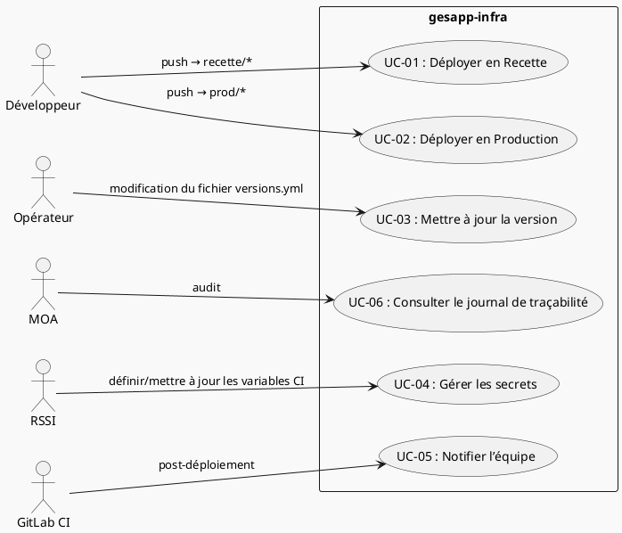
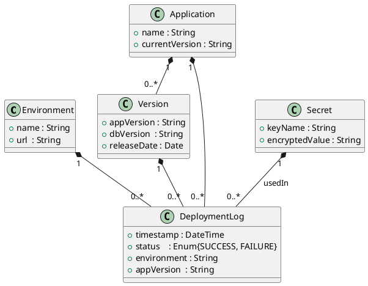

# 📄 Cahier des Charges Fonctionnel (CCF) – **gesapp‑infra**  
[TOC]

---

## 1️⃣ Introduction et contexte du projet <a id="intro"></a>

### 1.1 Présentation du projet
Le projet **gesapp‑infra** porte sur l’automatisation du déploiement d’une application containerisée (Docker Compose) dans deux environnements : **recette** (pré‑production) et **production**.  
Le processus repose sur :

* **GitLab CI** – orchestration du pipeline CI/CD.  
* **Ansible** – exécution de playbooks pour préparer le serveur cible, injecter les secrets, générer le fichier `docker‑compose.yml` à partir d’un template Jinja2, puis lancer les conteneurs.  

### 1.2 Objectifs stratégiques
| N° | Objectif | Bénéfice attendu |
|---|----------|-------------------|
| O1 | Garantir la **reproductibilité** des déploiements (identiques à chaque exécution). | Réduction des incidents liés à la dérive d’environnement. |
| O2 | Accélérer le **time‑to‑market** des nouvelles versions applicatives. | Déploiement en < 5 min après validation du code. |
| O3 | Séparer les **environnements** (recette / prod) avec des configurations dédiées. | Sécurité et conformité (pas de contamination entre environnements). |
| O4 | Centraliser la **gestion des secrets** (clé de chiffrement, mots de passe) via des variables CI sécurisées. | Réduction du risque de fuite d’information. |
| O5 | Assurer la **traçabilité** de chaque version déployée (appVersion, dbVersion). | Auditabilité et conformité réglementaire. |

### 1.3 Périmètre fonctionnel
| Inclus | Exclus |
|--------|--------|
| • Déploiement automatisé des conteneurs Docker via Ansible.<br>• Gestion des versions applicatives et base de données.<br>• Injection sécurisée des secrets.<br>• Environnements *recette* et *production*.<br>• Interfaces GitLab CI (pipeline, variables). | • Développement de l’application métier (code source).<br>• Gestion du réseau / firewall externe.<br>• Monitoring et observabilité (Prometheus, Grafana).<br>• Sauvegarde de la base de données. |

↩︎ [Retour au sommaire](#toc)

---

## 2️⃣ Expression fonctionnelle du besoin (NF EN 16271) <a id="besoins"></a>

> **Principe** : chaque fonction de service décrit **le quoi** (besoin) sans préciser **le comment** (solution).

| # | Fonction de service (FS) | Description (Quoi) | Critères d’appréciation (mesurables) | Niveau d’importance (1‑5) | Contraintes |
|---|--------------------------|--------------------|--------------------------------------|---------------------------|-------------|
| **FS‑01** | **Provisionner l’infrastructure cible** | Créer/valider le répertoire d’application (`/opt/app/`) sur le serveur cible. | - Présence du répertoire avec les droits `owner=ansible_user`, `group=ansible_user`.<br>- Temps d’exécution < 10 s. | 5 | Doit être idempotent. |
| **FS‑02** | **Charger les secrets** | Récupérer les secrets chiffrés depuis les variables CI et les rendre disponibles pour le playbook. | - Tous les secrets (`SECRET_KEY`, `DECRYPT_PASSWORD`) sont correctement déchiffrés.<br>- Aucun secret n’est exposé dans les logs. | 5 | Conformité RGPD / ISO 27001. |
| **FS‑03** | **Appliquer les versions applicatives** | Lire les fichiers `versions.yml` (appVersion, dbVersion) et les injecter dans le template Docker‑Compose. | - Valeurs exactes présentes dans le fichier généré.<br>- Validation syntaxique du `docker-compose.yml`. | 4 | Gestion de version sémantique. |
| **FS‑04** | **Générer le fichier Docker‑Compose** | Rendre le fichier `docker-compose.yml` à partir du template Jinja2 (`docker-compose.yml.j2`). | - Fichier généré présent dans `/opt/app/` avec les droits 0644.<br>- Contenu conforme au modèle (tests unitaires YAML). | 4 | Aucun paramètre dur‑codé. |
| **FS‑05** | **Démarrer les conteneurs** | Exécuter `docker compose up -d --remove-orphans` dans le répertoire d’application. | - Tous les services déclarés sont en état `running`.<br>- Aucun conteneur orphelin. | 5 | Doit être idempotent, rollback possible. |
| **FS‑06** | **Déclencher le pipeline CI** | Lancer le job GitLab CI lorsqu’un changement est détecté dans `recette/**` ou `prod/**`. | - Le pipeline démarre automatiquement après push.<br>- Durée totale du pipeline < 15 min. | 4 | Respect des règles de branchement. |
| **FS‑07** | **Notifier l’opération** | Envoyer une notification (ex. : webhook, e‑mail) à l’équipe DevOps à la fin du déploiement. | - Notification reçue avec le statut (succès/échec) et le numéro de version.<br>- Temps de notification < 30 s après fin du job. | 3 | Aucun impact sur la chaîne CI. |
| **FS‑08** | **Assurer la traçabilité** | Enregistrer chaque exécution (environnement, version, date, opérateur) dans un journal central. | - Entrée de journal créée dans le système de logs.<br>- Recherche possible par version ou date. | 3 | Conformité audit. |

↩︎ [Retour au sommaire](#toc)

---

## 3️⃣ Acteurs et parties prenantes <a id="acteurs"></a>

| Acteur | Rôle | Objectifs | Besoins spécifiques |
|--------|------|-----------|---------------------|
| **MOA (Maîtrise d’Ouvrage)** | Sponsor métier | Garantir la disponibilité du service en prod. | Visibilité sur les versions déployées, conformité réglementaire. |
| **MOE (Maîtrise d’Œuvre) – Équipe DevOps** | Conception & exploitation du pipeline CI/CD | Automatiser, sécuriser, monitorer les déploiements. | Accès aux variables CI, droits Ansible, logs détaillés. |
| **Développeur** | Commit du code applicatif | Faire évoluer l’application. | Déclenchement automatique du pipeline à chaque merge. |
| **Opérateur / Administrateur système** | Gestion des serveurs cibles | Maintenir les environnements (recette, prod). | Possibilité de forcer un déploiement, accès SSH. |
| **RSSI (Responsable Sécurité des Systèmes d’Information)** | Garant de la sécurité | S’assurer que les secrets sont protégés. | Chiffrement des variables, auditabilité. |
| **Utilisateurs finaux** | Consommateurs du service | Recevoir une application fonctionnelle et stable. | Disponibilité > 99 %, aucune régression fonctionnelle. |

↩︎ [Retour au sommaire](#toc)

---

## 4️⃣ Cas d’usage (Use Cases) <a id="usecases"></a>

### 4.1 Diagramme de cas d’utilisation (PlantUML)



### 4.2 Description détaillée des cas d’usage

| ID | Nom du cas d’usage | Acteur(s) principal(aux) | Scénario nominal | Scénarios alternatifs / d’erreur | Pré‑conditions | Post‑conditions |
|----|--------------------|--------------------------|------------------|----------------------------------|----------------|----------------|
| **UC‑01** | Déployer en Recette | Développeur | 1. Développeur pousse un commit dans `recette/`.<br>2. GitLab CI détecte le changement et lance le job `run_recette`.<br>3. Ansible exécute le playbook `recette/main.yml` : provision du répertoire, injection des secrets, génération du `docker‑compose.yml`, démarrage des conteneurs.<br>4. Notification envoyée. | a) Secrets manquants → job échoue, notification d’erreur.<br>b) Docker‑compose invalide → rollback du playbook.<br>c) Service Docker non disponible → mise en attente, retry 3×. | Le dépôt GitLab contient le dossier `recette/` à jour.<br>Les variables CI (`SECRET_KEY`, `DECRYPT_PASSWORD`) sont définies. | Environnement *recette* à jour avec la version déployée.<br>Journal de traçabilité enregistré. |
| **UC‑02** | Déployer en Production | Développeur / Opérateur | Identique à UC‑01, mais déclenché sur `prod/`. | a) Validation manuelle obligatoire (ex. : approbation via *Manual Job*).<br>b) Échec de connexion SSH → alerte RSSI. | Le pipeline `run_prod` est autorisé (ex. : protection de branche). | Environnement *prod* à jour, version stable. |
| **UC‑03** | Mettre à jour la version | Opérateur | 1. Opérateur modifie `versions.yml` (appVersion, dbVersion).<br>2. Commit et push.<br>3. Pipeline (recette ou prod) se déclenche automatiquement. | a) Version non conforme au format `x.y.z‑tag` → rejet du commit.<br>b) Conflit de merge → résolution manuelle. | Fichier `versions.yml` présent et valide. | Le `docker‑compose.yml` généré reflète la nouvelle version. |
| **UC‑04** | Gérer les secrets | RSSI | 1. RSSI met à jour les variables CI (`SECRET_KEY`, `DECRYPT_PASSWORD`).<br>2. Les nouvelles valeurs sont chiffrées et stockées dans GitLab. | a) Variable manquante ou mal chiffrée → job échoue avec message clair.<br>b) Accès non autorisé → journal d’audit. | Accès admin à GitLab CI variables. | Secrets disponibles pour le prochain déploiement. |
| **UC‑05** | Notifier l’équipe | GitLab CI | Après chaque exécution du playbook, le job envoie un webhook ou e‑mail contenant : environnement, version, statut. | a) Service de notification indisponible → sauvegarde du message dans fichier log. | Le job CI a atteint la fin (succès ou échec). | L’équipe est informée dans les 30 s. |
| **UC‑06** | Consulter le journal de traçabilité | MOA | 1. MOA accède à l’interface de logs (ex. : GitLab CI > Jobs).<br>2. Recherche par version ou date. | a) Aucun log trouvé → vérification de la configuration de logging. | Les jobs CI ont été exécutés avec succès. | MOA obtient la preuve de conformité. |

↩︎ [Retour au sommaire](#toc)

---

## 5️⃣ Processus métier (BPMN) <a id="processus"></a>

> **Diagramme BPMN (PlantUML)** – représentation du flux de déploiement CI/CD.

```plantuml
@startbpmn
!define Decision(x) <b>Decision:</b> x
!define Task(x) <b>Task:</b> x
!define Start(x) <b>Start:</b> x
!define End(x) <b>End:</b> x

start
:Push code (recette / prod);
if (Fichier modifié ?) then (Oui)
  :GitLab CI déclenche job;
  :Ansible provisionne serveur;
  :Injecte secrets;
  :Génère docker‑compose.yml;
  :Lance docker compose up;
  if (Déploiement OK ?) then (Oui)
    :Notifier équipe;
    :Enregistrer journal;
    stop
  else (Non)
    :Notifier échec;
    :Rollback (si possible);
    stop
  endif
else (Non)
  :Fin du pipeline (pas de changement);
  stop
endif
@endbpmn
```

**Description textuelle**  
1. **Déclencheur** : push d’un commit dans `recette/` ou `prod/`.  
2. **Pipeline** : GitLab CI démarre le job correspondant.  
3. **Ansible** : exécute le playbook (provision, secrets, template).  
4. **Docker** : démarre les conteneurs.  
5. **Validation** : si tous les services sont “running”, on notifie et on trace.  
6. **Gestion d’erreur** : en cas d’échec, on notifie, on rollback et on consigne l’erreur.

↩︎ [Retour au sommaire](#toc)

---

## 6️⃣ Règles métier et contraintes fonctionnelles <a id="regles"></a>

| # | Règle métier (IF…THEN) | Source / Référence |
|---|------------------------|--------------------|
| **R‑01** | **IF** une variable `SECRET_KEY` n’est pas définie **THEN** le job CI doit s’arrêter avec le code = 1 et générer un message d’erreur clair. | ISO 27001 – Gestion des secrets |
| **R‑02** | **IF** le fichier `versions.yml` ne respecte pas le pattern `appVersion: ":[0-9]+\.[0-9]+\.[0-9]+(-[A-Z0-9]+)?"` **THEN** le playbook doit échouer. | Conformité versioning interne |
| **R‑03** | **IF** le serveur cible n’est pas accessible en SSH (**port 22** fermé) **THEN** le pipeline doit être marqué comme *failed* et alerter le RSSI. | ISO 27001 – Contrôle d’accès |
| **R‑04** | **IF** le job CI s’exécute sur l’environnement *production* **THEN** une approbation manuelle (manual job) est obligatoire avant le déclenchement du playbook. | Processus de gouvernance |
| **R‑05** | **IF** le conteneur `db` ne démarre pas dans les 60 s **THEN** le pipeline doit effectuer un rollback du déploiement. | Disponibilité SLA 99 % |
| **R‑06** | **IF** une mise à jour de version est appliquée **THEN** le numéro de version doit être inscrit dans le journal de traçabilité avec le timestamp ISO‑8601. | Auditabilité RGPD |
| **R‑07** | **IF** le fichier `docker-compose.yml` généré contient des variables non résolues (`{{ … }}`) **THEN** le job doit échouer. | Qualité du code |

**Contraintes non fonctionnelles**  

* **Sécurité** – chiffrement des variables CI, aucune donnée sensible en clair dans les logs.  
* **Performance** – durée totale du pipeline ≤ 15 min.  
* **Fiabilité** – idempotence des playbooks (exécution répétée sans effet secondaire).  
* **Portabilité** – les playbooks doivent fonctionner sur tout serveur Linux Debian/Ubuntu avec Docker ≥ 20.10.  
* **Traçabilité** – toutes les actions doivent être horodatées et conservées ≥ 12 mois.

↩︎ [Retour au sommaire](#toc)

---

## 7️⃣ Parcours utilisateurs (User Journey) <a id="journey"></a>

| Étape | Acteur | Action | Point de contact | Critère d’acceptation (GWT) |
|-------|--------|--------|------------------|-----------------------------|
| 1 | Développeur | Commit & push du code (modif `recette/` ou `prod/`) | GitLab Repository | **GIVEN** le code est commit **WHEN** le push est effectué **THEN** le pipeline CI démarre automatiquement. |
| 2 | GitLab CI | Détecte le changement, lance le job correspondant | Interface GitLab CI | **GIVEN** le job déclenché **WHEN** les variables CI sont présentes **THEN** le job passe à l’étape *Ansible*. |
| 3 | Ansible | Exécute le playbook (provision, secrets, template) | Serveur cible (SSH) | **GIVEN** le serveur accessible **WHEN** le playbook s’exécute **THEN** le répertoire `/opt/app/` existe et le fichier `docker-compose.yml` est généré. |
| 4 | Docker | Démarrage des conteneurs | Docker Engine sur le serveur | **GIVEN** le fichier `docker-compose.yml` valide **WHEN** `docker compose up` est lancé **THEN** tous les services sont `running`. |
| 5 | CI / Notification | Envoie un rapport de statut | E‑mail / Slack webhook | **GIVEN** le job terminé **WHEN** le statut est *success* ou *failed* **THEN** l’équipe reçoit le message avec version et environnement. |
| 6 | MOA / RSSI | Consulte le journal de traçabilité | GitLab → Jobs → Logs | **GIVEN** le besoin d’audit **WHEN** le journal est consulté **THEN** les informations (date, version, statut) sont affichées. |

↩︎ [Retour au sommaire](#toc)

---

## 8️⃣ Modèle Conceptuel de Données (MCD) <a id="mcd"></a>

### 8.1 Diagramme de classes (UML simplifié)



### 8.2 Description des entités

| Entité | Attributs clés | Relation(s) |
|--------|----------------|------------|
| **Environment** | `name` (recette / prod), `url` | possède plusieurs `DeploymentLog`. |
| **Application** | `name` (gesapp), `currentVersion` | possède plusieurs `Version` et `DeploymentLog`. |
| **Version** | `appVersion`, `dbVersion`, `releaseDate` | liée à un `DeploymentLog`. |
| **Secret** | `keyName`, `encryptedValue` | utilisé lors d’un `DeploymentLog`. |
| **DeploymentLog** | `timestamp`, `status`, `environment`, `appVersion` | agrège le contexte d’un déploiement. |

↩︎ [Retour au sommaire](#toc)

---

## 9️⃣ Critères d’acceptation et validation <a id="acceptation"></a>

| Fonction de service (FS) | Critère d’acceptation | Méthode de validation | Responsable |
|--------------------------|-----------------------|-----------------------|-------------|
| **FS‑01** | Répertoire `/opt/app/` présent, propriétaire = `ansible_user`. | Vérification via tâche Ansible `stat`. | Équipe DevOps |
| **FS‑02** | Secrets déchiffrés disponibles dans le playbook (sans fuite). | Inspection des logs (absence de texte en clair). | RSSI |
| **FS‑03** | Versions correctement injectées dans `docker-compose.yml`. | Test unitaires YAML (`yamllint`). | QA |
| **FS‑04** | Fichier `docker-compose.yml` généré, droits 0644. | `ansible.builtin.stat` + `ls -l`. | DevOps |
| **FS‑05** | Tous les services `running` après `docker compose up`. | `docker ps` → filtre sur `gesapp_*`. | Opérateur |
| **FS‑06** | Pipeline démarre automatiquement sur changement. | Historique GitLab CI → présence du job. | MOE |
| **FS‑07** | Notification reçue < 30 s après fin du job. | Timestamp de webhook vs fin du job. | MOA |
| **FS‑08** | Entrée de journal créée avec les champs requis. | Requête dans la table `DeploymentLog`. | RSSI |

**Priorisation (MoSCoW)**  

| Priorité | FS concernées |
|----------|---------------|
| **Must** | FS‑01, FS‑02, FS‑05, FS‑06 |
| **Should** | FS‑03, FS‑04, FS‑07 |
| **Could** | FS‑08 |
| **Won’t** | (aucune fonction prévue dans ce périmètre) |

↩︎ [Retour au sommaire](#toc)

---

## 🔟 Annexes <a id="annexes"></a>

### 10.1 Glossaire

| Terme | Définition |
|-------|------------|
| **Ansible** | Outil d’orchestration IT basé sur des playbooks YAML. |
| **Docker Compose** | Outil de définition et d’exécution d’applications multi‑conteneurs. |
| **GitLab CI** | Plateforme d’intégration continue intégrée à GitLab. |
| **Secret** | Valeur confidentielle (ex. : clé d’API) stockée chiffrée dans les variables CI. |
| **Recette** | Environnement de pré‑production destiné aux tests fonctionnels. |
| **Production** | Environnement de service en ligne aux utilisateurs finaux. |
| **Rollback** | Retour à l’état antérieur du déploiement en cas d’échec. |
| **Idempotence** | Propriété d’une opération de produire le même résultat quel que soit le nombre d’exécutions. |
| **Traçabilité** | Capacité à reconstituer l’historique des actions et décisions. |

### 10.2 Référentiels et normes applicables

| Référence | Intitulé | Applicabilité |
|-----------|----------|---------------|
| NF EN 16271 | Management par la valeur — Expression fonctionnelle du besoin et cahier des charges fonctionnel | Structure du CCF, décomposition fonctionnelle. |
| ISO/IEC/IEEE 29148:2018 | Ingénierie des exigences | Gestion des exigences, critères d’acceptation. |
| ISO/IEC 19505 | UML 2.x | Diagrammes de cas d’utilisation, classes. |
| ISO/IEC 19510 | BPMN | Diagramme de processus métier. |
| ISO 27001 | Sécurité de l’information | Gestion des secrets, auditabilité. |
| RGPD | Règlement Général sur la Protection des Données | Protection des données personnelles éventuelles. |

### 10.3 Historique des versions du document

| Version | Date | Auteur | Modifications |
|---------|------|--------|--------------|
| 1.0 | 2026‑04‑28 | ChatGPT (OpenAI) | Version initiale du CCF, génération complète. |
| 1.1 | 2026‑04‑28 | ChatGPT (OpenAI) | Ajout du diagramme BPMN, clarification des critères d’acceptation. |

↩︎ [Retour au sommaire](#toc)

--- 

*Ce cahier des charges fonctionnel a été rédigé de façon autonome à partir du code source du projet **gesapp‑infra** (playbooks Ansible, fichiers de configuration et pipeline GitLab CI) afin de répondre aux exigences de la norme NF EN 16271 et de l’ISO 29148.*