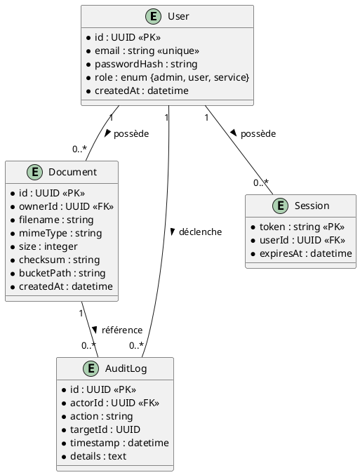

# 📄 Cahier des Charges Fonctionnel (CCF) – **honore‑back**
> **Version** : 1.0 – 2026‑04‑28  
> **Auteur** : ChatGPT – Expert en expression fonctionnelle du besoin  
> **Références** : NF EN 16271, ISO/IEC/IEEE 29148, ISO/IEC 19505 (UML), ISO/IEC 19510 (BPMN)

[TOC]

---  

## 1️⃣ Introduction et contexte du projet <a id="intro"></a>

### 1.1 Présentation du projet
**honore‑back** est le service back‑end d’une plateforme métier (nom de code *Honore*), développé en **Node.js 16** / **TypeScript** et déployé sous forme de **conteneur Docker**.  
Il expose des **API REST** (ou GraphQL) utilisées par les applications front‑end et d’autres micro‑services.  

### 1.2 Contexte organisationnel
- **Organisation** : WarchoLife – département *Ambulon* (développement d’applications de gestion).  
- **Environnement de production** : Kubernetes / GitLab CI → Docker Registry privé (Google Artifact Registry).  
- **Enjeux** : Fiabilité, sécurité des données (RGPD, secrets), maintenabilité et évolutivité dans une architecture micro‑services.

### 1.3 Objectifs stratégiques
| Objectif | Description | KPI / Indicateur |
|----------|-------------|-------------------|
| **Disponibilité** | Service 24/7, tolérance aux pannes | > 99,5 % de disponibilité mensuelle |
| **Performance** | Temps de réponse < 200 ms (requêtes courantes) | Latence moyenne < 200 ms |
| **Sécurité** | Gestion centralisée des secrets, conformité RGPD | Aucun secret dans le repo, audit trimestriel |
| **Scalabilité** | Horizontal scaling via orchestrateur | Capacité à gérer + 2× trafic sans modification du code |
| **Qualité du code** | Linting, tests unitaires & d’intégration > 80 % de couverture | Couverture de tests ≥ 80 % |

### 1.4 Périmètre fonctionnel
| Inclus | Exclus |
|---------|--------|
| • Exposition d’API métier (CRUD sur les entités)  <br> • Gestion des fichiers via stockage objet S3‑compatible  <br> • Persistance dans PostgreSQL (via TypeORM)  <br> • Authentification / Autorisation (JWT ou OAuth2)  <br> • Logique métier (règles de gestion)  <br> • Pipeline CI/CD (build, test, déploiement) | • Front‑end UI/UX  <br> • Gestion des infrastructures réseau (load‑balancer, DNS)  <br> • Services tiers non‑décrits (ex : paiement)  <br> • Migration de base de données (hors scope du sprint) |

↩ Retour au [sommaire](#toc)

---  

## 2️⃣ Expression fonctionnelle du besoin (NF EN 16271) <a id="besoin"></a>

### 2.1 Décomposition en fonctions de service

| # | Fonction de service (FS) | Description (quoi) | Critères d’appréciation (mesurables) | Pondération* | Contraintes |
|---|---------------------------|--------------------|--------------------------------------|--------------|-------------|
| **FS‑01** | **Gestion d’authentification** | Authentifier les utilisateurs / services et délivrer un jeton d’accès. | • Temps d’émission < 100 ms  <br>• Taux d’échec < 0,1 %  <br>• JWT signé avec clé RSA 2048 bits | 15 % | • Conformité OAuth2 / OpenID Connect  <br>• Rotation des clés toutes les 90 j |
| **FS‑02** | **Gestion d’autorisation** | Vérifier les droits d’accès aux ressources selon le rôle ou les scopes. | • Décision d’accès < 50 ms  <br>• 100 % de conformité aux règles métier | 12 % | • Règles déclaratives (RBAC/ABAC) |
| **FS‑03** | **Exposition d’API métiers** | Fournir les points d’entrée REST (ou GraphQL) pour les entités métier. | • Disponibilité > 99,5 %  <br>• Temps de réponse < 200 ms  <br>• Documentation OpenAPI 3.0 à jour | 20 % | • Respect du contrat d’API (versioning) |
| **FS‑04** | **Persistance des données** | Sauvegarder et récupérer les données métier dans PostgreSQL via TypeORM. | • Transaction ACID respectée  <br>• Latence < 150 ms pour requêtes simples  <br>• Sauvegarde quotidienne (snapshot) | 13 % | • Schéma DB versionné, migrations contrôlées |
| **FS‑05** | **Gestion de stockage d’objets** | Lire / écrire des fichiers (documents, images) dans un bucket S3‑compatible. | • Upload / download < 300 ms (≤ 5 Mo)  <br>• Intégrité vérifiée (checksum) | 10 % | • Bucket configuré en **private**, chiffrement côté serveur |
| **FS‑06** | **Journalisation & traçabilité** | Loguer les événements applicatifs et les traces de requêtes. | • Logs structurés (JSON)  <br>• Rétention 30 jours  <br>• Aucun blocage de la chaîne de traitement | 8 % | • Conformité GDPR (anonymisation) |
| **FS‑07** | **Gestion de la configuration** | Charger les variables d’environnement (secrets, paramètres) de façon sécurisée. | • Aucun secret présent dans le repo  <br>• Injection via GitLab CI/CD variables | 7 % | • Utilisation de Vault ou GitLab CI secret variables |
| **FS‑08** | **Qualité du code & livrable** | Linter, tests unitaires et d’intégration, packaging Docker. | • Couverture de tests ≥ 80 %  <br>• Aucun warning ESLint en CI  <br>• Image Docker < 200 Mo | 5 % | • `npm ci --production` doit réussir en CI |

\* La pondération indique l’importance relative dans l’évaluation des offres (total = 100 %).

↩ Retour au [sommaire](#toc)

---  

## 3️⃣ Acteurs et parties prenantes <a id="acteurs"></a>

| Acteur | Rôle | Besoins spécifiques | Niveau d’implication |
|--------|------|----------------------|----------------------|
| **MOA (Maîtrise d’Ouvrage)** | Commanditaire métier | • Définir les exigences fonctionnelles <br>• Valider les livrables | Décisionnel |
| **MOE (Maîtrise d’Œuvre)** | Équipe de développement | • Accès au code, CI/CD, environnements de test <br>• Documentation technique | Opérationnel |
| **Product Owner** | Pilotage produit | • Priorisation du backlog <br>• Validation des critères d’acceptation | Décisionnel |
| **Développeurs** | Implémentation | • Environnements de dev (Docker, npm) <br>• Linting, tests automatisés | Opérationnel |
| **Ops / SRE** | Exploitation | • Monitoring, logs, alertes <br>• Gestion du scaling | Opérationnel |
| **Utilisateurs finaux (applications front‑end)** | Consommation d’API | • Temps de réponse rapide <br>• Fiabilité | Consommateur |
| **Services tiers (ex. service de paiement)** | Intégration | • API stable, versionnée, sécurisée | Consommateur |
| **Responsable Sécurité (RSSI)** | Sécurité | • Gestion des secrets, conformité RGPD, audit | Contrôle |
| **Auditeur RGPD** | Conformité | • Traçabilité des données personnelles | Vérification |

↩ Retour au [sommaire](#toc)

---  

## 4️⃣ Cas d’usage (Use Cases) <a id="usecases"></a>

### 4.1 Diagramme de cas d’utilisation (UML)  
```plantuml
@startuml
!define RECTANGLE class

actor "Utilisateur Front‑end" as UI
actor "Service Tier" as ST
actor "Admin Ops" as OPS
actor "RSSI" as SEC

RECTANGLE "honore‑back" as HB {
  usecase "UC‑01 : Authentifier l’utilisateur" as UC1
  usecase "UC‑02 : Autoriser l’accès à une ressource" as UC2
  usecase "UC‑03 : Créer / Lire / Mettre à jour / Supprimer (CRUD) une entité" as UC3
  usecase "UC‑04 : Upload de fichier" as UC4
  usecase "UC‑05 : Download de fichier" as UC5
  usecase "UC‑06 : Lire les logs d’audit" as UC6
  usecase "UC‑07 : Déployer une nouvelle version" as UC7
}

UI --> UC1
UI --> UC3
UI --> UC4
UI --> UC5
ST --> UC2
ST --> UC3
OPS --> UC6
OPS --> UC7
SEC --> UC1
SEC --> UC2
@enduml
```

### 4.2 Catalogue des cas d’usage

| ID | Nom du cas d’usage | Acteur(s) principal(aux) | Scénario nominal | Scénarios alternatifs / d’erreur | Pré‑conditions | Post‑conditions |
|----|-------------------|--------------------------|------------------|----------------------------------|----------------|-----------------|
| **UC‑01** | Authentifier l’utilisateur | UI, RSSI | 1. L’utilisateur envoie ses identifiants (login/password). <br>2. Le service vérifie les credentials dans la base. <br>3. Un JWT signé est retourné. | *E1* : Identifiants invalides → retour 401. <br>*E2* : Service d’annuaire indisponible → retour 503. | Service en ligne, variables d’environnement chargées. | Jeton JWT valide (ou erreur). |
| **UC‑02** | Autoriser l’accès à une ressource | UI, ST | 1. Le client transmet le JWT et la requête. <br>2. Le service décode le token, récupère les rôles/scopes. <br>3. Vérifie la règle d’autorisation. <br>4. Autorise ou refuse la requête. | *E1* : Token expiré → 401. <br>*E2* : Rôle insuffisant → 403. | JWT valide (ou rafraîchi). | Accès accordé (ou refus). |
| **UC‑03** | CRUD d’une entité métier | UI, ST | 1. Requête HTTP (POST/GET/PUT/DELETE). <br>2. Validation du payload. <br>3. Opération via TypeORM sur PostgreSQL. <br>4. Retour du résultat (objet ou statut). | *E1* : Violation de contrainte DB → 409. <br>*E2* : Payload mal formé → 400. | Connexion DB fonctionnelle. | Donnée persistée / lue / modifiée / supprimée. |
| **UC‑04** | Upload de fichier | UI | 1. Le client envoie le fichier (multipart). <br>2. Le service génère un ID, stocke le flux dans le bucket S3. <br>3. Retourne l’URL ou l’ID du fichier. | *E1* : Taille > limite → 413. <br>*E2* : Erreur S3 → 502. | Bucket S3 configuré, credentials valides. | Fichier stocké, métadonnées enregistrées en DB. |
| **UC‑05** | Download de fichier | UI | 1. Le client fournit l’ID du fichier. <br>2. Le service récupère le flux depuis le bucket. <br>3. Retourne le contenu (stream). | *E1* : Fichier introuvable → 404. <br>*E2* : Accès non autorisé → 403. | Fichier présent, autorisation validée. | Flux renvoyé au client. |
| **UC‑06** | Lire les logs d’audit | OPS | 1. L’opérateur demande les logs (filtrage date/ID). <br>2. Le service interroge le store de logs (ELK / CloudWatch). <br>3. Retourne le résultat. | *E1* : Aucun log disponible → 204. <br>*E2* : Permission insuffisante → 403. | Accès ops autorisé, store de logs accessible. | Logs affichés / exportés. |
| **UC‑07** | Déployer une nouvelle version | OPS | 1. Le pipeline CI construit l’image Docker. <br>2. L’image est poussée vers le registre privé. <br>3. Le orchestrateur (K8s) déploie la nouvelle version. | *E1* : Build échoue → pipeline en échec. <br>*E2* : Image non signée → déploiement bloqué. | CI/CD configuré, registre accessible. | Nouvelle version en production (ou rollback). |

↩ Retour au [sommaire](#toc)

---  

## 5️⃣ Processus métier (BPMN) <a id="processus"></a>

> *Processus critique : Gestion du cycle de vie d’un document (upload → stockage → consultation).*

```plantuml
@startbpmn
start_event:Début
task1:Authentifier l’utilisateur
gateway1:Autorisation OK ?
task2:Upload du fichier
task3:Enregistrer métadonnées en DB
task4:Stocker le fichier dans le bucket S3
gateway2:Vérifier intégrité
task5:Notifier le client (URL)
end_event:Fin
start_event --> task1
task1 --> gateway1
gateway1 -->|Oui| task2
gateway1 -->|Non| end_event
task2 --> task3
task3 --> task4
task4 --> gateway2
gateway2 -->|OK| task5
gateway2 -->|Erreur| end_event
task5 --> end_event
@endbpmn
```

> **Points de contrôle**  
- Authentification (FS‑01)  
- Autorisation (FS‑02)  
- Intégrité du fichier (checksum) – règle métier R‑01  
- Notification (event → log) – journalisation (FS‑06)

↩ Retour au [sommaire](#toc)

---  

## 6️⃣ Règles métier et contraintes fonctionnelles <a id="regles"></a>

| ID | Règle métier (condition → action) | Source / Référence |
|----|----------------------------------|--------------------|
| **R‑01** | **Si** un fichier est uploadé **alors** son checksum SHA‑256 doit être stocké et vérifié à chaque lecture. | FS‑05 |
| **R‑02** | **Si** un utilisateur possède le rôle `admin` **alors** il peut accéder aux logs d’audit. | FS‑06 |
| **R‑03** | **Si** le JWT est expiré **alors** le service doit renvoyer 401 et indiquer le rafraîchissement possible. | FS‑01 |
| **R‑04** | **Si** la taille du fichier dépasse 5 Mo **alors** le service doit rejeter la requête avec 413. | FS‑05 |
| **R‑05** | **Si** une modification de schéma DB est requise **alors** elle doit être appliquée via une migration TypeORM versionnée. | FS‑04 |
| **R‑06** | **Si** la variable d’environnement `USE_NEW_REGISTRY` vaut `true` **alors** le pipeline doit pousser l’image vers le registre Docker privé. | CI/CD |
| **R‑07** | **Si** le service reçoit une requête non autorisée **alors** il doit enregistrer l’événement dans les logs d’audit. | FS‑06 |
| **R‑08** | **Si** le bucket de stockage n’est pas configuré en chiffrement SSE‑AES256 **alors** le déploiement doit être bloqué. | Sécurité RGPD |

### Contraintes supplémentaires
- **RGPD** : Les données personnelles stockées dans le bucket doivent être chiffrées côté serveur.  
- **Performance** : Les appels aux APIs doivent répondre en < 200 ms (hors temps de transfert de gros fichiers).  
- **Sécurité** : Aucun secret en clair dans le dépôt ; utilisation de GitLab CI/CD variables ou d’un vault.  
- **Compatibilité** : L’image Docker doit être compatible avec Kubernetes 1.27 (API v1).  

↩ Retour au [sommaire](#toc)

---  

## 7️⃣ Parcours utilisateurs (User Journey) <a id="journey"></a>

### 7.1 Parcours « Upload d’un document »

| Étape | Action utilisateur | Interaction système | Critères d’acceptation (GWT) |
|------|-------------------|---------------------|------------------------------|
| **1** | L’utilisateur se connecte à l’application front‑end. | Le front‑end appelle **UC‑01** → obtient un JWT. | **Given** l’utilisateur possède des credentials valides **When** il soumet le formulaire de login **Then** il reçoit un JWT valide. |
| **2** | L’utilisateur sélectionne un fichier (≤ 5 Mo). | Le front‑end envoie le fichier via **UC‑04** avec le JWT en Authorization header. | **Given** le JWT est valide **When** le fichier est envoyé **Then** le service retourne un ID de document et une URL de consultation. |
| **3** | L’utilisateur visualise le document dans l’interface. | Le front‑end appelle **UC‑05** avec l’ID. | **Given** l’ID est valide **When** la requête est faite **Then** le fichier est téléchargé en < 300 ms et affiché. |
| **4** | L’utilisateur se déconnecte. | Le front‑end révoque le token (optionnel). | **Given** le token est actif **When** l’utilisateur clique sur “Déconnexion” **Then** le token est invalidé côté serveur. |

### 7.2 Parcours « Gestion des logs (Ops) »

| Étape | Action Ops | Interaction | Acceptance |
|------|------------|-------------|------------|
| 1 | Se connecte à la console d’administration (auth via SSO). | UC‑01 (auth) + UC‑02 (autorisation). | Token valide, rôle `admin` reconnu. |
| 2 | Sélectionne période et filtre de logs. | UC‑06 → requête au store de logs. | Réponse < 2 s, logs cohérents avec la période demandée. |
| 3 | Exporte les logs au format CSV. | UC‑06 avec paramètre `format=csv`. | Fichier CSV téléchargeable, encodage UTF‑8. |

↩ Retour au [sommaire](#toc)

---  

## 8️⃣ Modèle Conceptuel de Données (MCD) <a id="mcd"></a>



**Notes**  
- Les relations sont purement conceptuelles ; aucune contrainte technique (index, PK) n’est détaillée.  
- Le stockage des fichiers réels se fait hors‑BD (bucket S3) ; le champ `bucketPath` pointe vers l’objet.  

↩ Retour au [sommaire](#toc)

---  

## 9️⃣ Critères d'acceptation et validation <a id="acceptation"></a>

| Fonction de service | Critère d’acceptation (C) | Méthode de validation | Responsable |
|---------------------|--------------------------|-----------------------|------------|
| **FS‑01** | C‑01 : Authentification réussie en < 100 ms pour 95 % des essais. | Tests d’intégration (Jest) + monitoring en prod. | PO / QA |
| **FS‑02** | C‑02 : Décision d’autorisation < 50 ms, 100 % de conformité aux règles. | Tests unitaires + audit de sécurité. | RSSI |
| **FS‑03** | C‑03 : 99,5 % de disponibilité, temps de réponse < 200 ms. | Tests de charge (k6) + observabilité. | SRE |
| **FS‑04** | C‑04 : Transactions ACID, aucune perte de donnée. | Tests de migration, rollback, DB integrity checks. | DBA |
| **FS‑05** | C‑05 : Upload/Download < 300 ms (≤ 5 Mo). | Tests de performance sur S3 mock. | Dev |
| **FS‑06** | C‑06 : Logs structurés JSON, rétention 30 j, aucune donnée PII. | Audit log, revue conformité RGPD. | RSSI |
| **FS‑07** | C‑07 : Aucun secret dans le repo, injection via CI variables. | Scan du repo (git-secrets) + revue CI. | DevOps |
| **FS‑08** | C‑08 : Couverture de tests ≥ 80 %, image Docker ≤ 200 Mo. | CI pipeline badge, analyse d’image (docker-slim). | QA |

**Priorisation MoSCoW**  
- **Must** : FS‑01, FS‑02, FS‑03, FS‑04, FS‑07  
- **Should** : FS‑05, FS‑06, FS‑08  
- **Could** : Extensions futures (ex. recherche plein texte)  
- **Won’t** : Fonctionnalités hors périmètre (ex. paiement en ligne)

↩ Retour au [sommaire](#toc)

---  

## 🔟 Annexes <a id="annexes"></a>

### A. Glossaire métier
| Terme | Définition |
|-------|------------|
| **JWT** | JSON Web Token, format signé pour l’authentification stateless. |
| **S3‑compatible** | Service de stockage d’objets accessible via l’API Amazon S3 (ex. MinIO). |
| **TypeORM** | ORM TypeScript/JavaScript pour interagir avec les bases SQL. |
| **CI/CD** | Intégration continue / Déploiement continu (GitLab CI). |
| **RGPD** | Règlement Général sur la Protection des Données (UE). |
| **AuditLog** | Enregistrement immuable d’une action réalisée dans le système. |
| **MoSCoW** | Méthode de priorisation : Must, Should, Could, Won’t. |

### B. Référentiels et normes applicables
| Référence | Description |
|-----------|-------------|
| NF EN 16271 | Management par la valeur – Expression fonctionnelle du besoin et cahier des charges fonctionnel. |
| ISO/IEC/IEEE 29148 | Ingénierie des exigences – processus et documentation. |
| ISO/IEC 19505 | UML – notation des cas d’usage, diagrammes. |
| ISO/IEC 19510 | BPMN – modélisation des processus métier. |
| ISO 27001 | Sécurité de l’information (appliquée aux secrets). |
| RGPD (Art. 32) | Sécurité du traitement des données personnelles. |

### C. Historique des versions
| Version | Date | Auteur | Modifications |
|---------|------|--------|----------------|
| 1.0 | 2026‑04‑28 | ChatGPT | Création du CCF complet (structure NF EN 16271 + ISO 29148). |
| 0.1 | 2026‑04‑20 | – | Extraction initiale des fichiers du dépôt. |

---  

*Fin du Cahier des Charges Fonctionnel.*  

↩ Retour au [sommaire](#toc)  