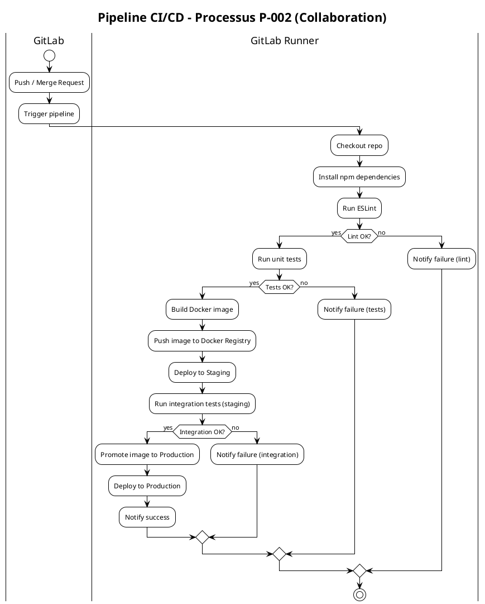
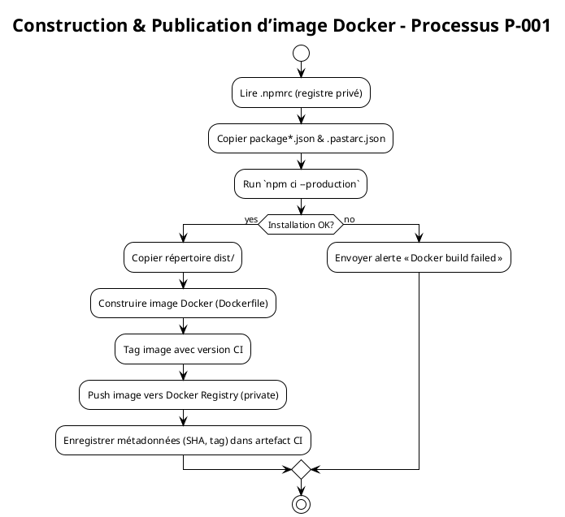
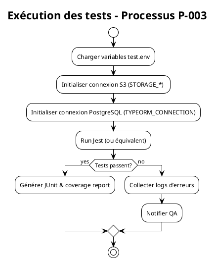
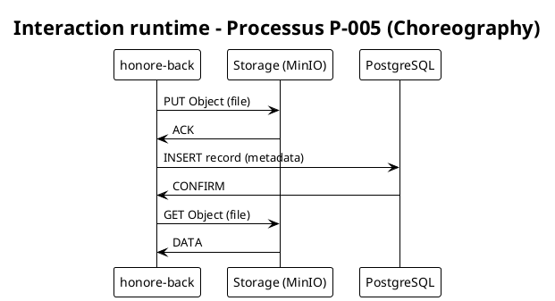
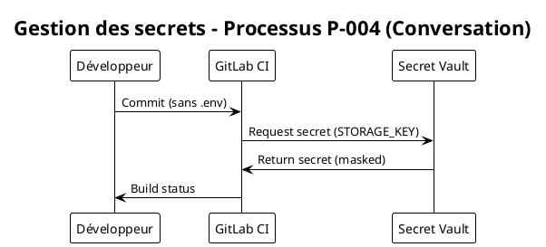

# Cahier des Charges Fonctionnel (CCF) – **honore‑back**
**Projet** : *honore‑back*  
**Référentiel** : ISO/IEC 19510 :2013 (BPMN 2.0) – OMG  
**Version CCF** : 1.0 – 28 avril 2026  

> **Objectif** – Décrire, de façon standardisée et exécutable, les processus métier et techniques qui sous‑tendent le micro‑service **honore‑back** (Node / TypeScript) : construction d’image Docker, pipeline CI/CD GitLab, gestion des secrets, exécution des tests, interaction avec le stockage S3‑compatible et la base PostgreSQL.  
> Le CCF sert de **pont** entre les équipes métier, les développeurs et les équipes d’intégration continue, et pourra être importé tel‑quel dans un moteur BPMN (Camunda, Activiti, …).

---

## 1. Introduction et contexte processus

| Élément | Description |
|---------|-------------|
| **Organisation** | *WarchoLife* – département *Développement Backend* (équipes **DevOps**, **Dév. Node**, **Qualité**). |
| **Environnement** | GitLab (repo *honore‑back*), registre Google Artifact Registry (npm & Docker), serveur CI GitLab Runners, registre privé Docker, clusters Kubernetes (déploiement). |
| **Objectifs BPMN** | • Formaliser le **pipeline de construction & déploiement**. • Modéliser le **processus de tests automatisés**. • Décrire la **gestion des secrets** et l’**interaction stockage‑DB**. • Produire des artefacts exécutables (BPMN) pour automatisation et audit. |
| **Périmètre** | Processus **CI/CD**, **Dockerisation**, **Tests unitaires/intégration**, **Gestion des secrets**, **Accès storage & DB**. Le code applicatif (business logic) n’est pas détaillé ici. |
| **Glossaire métier initial** | 

Voir le tableau
    \| Terme \| Définition \|    \|---\|---\|    \| Micro‑service \| Service backend autonome, déployé dans un conteneur Docker. \|    \| Registry npm privé \| Google Artifact Registry hébergeant les paquets internes (`@pnm3`, `@pasta`). \|    \| Registry Docker \| Registre d’images Docker privé où sont poussées les images de `honore‑back`. \|    \| CI/CD \| Intégration continue et déploiement continu orchestrés par GitLab CI. \|    \| S3‑compatible \| Service de stockage d’objets (ex. MinIO) utilisé pour les fichiers métiers. \|    \| TypeORM \| ORM TypeScript/JavaScript pour PostgreSQL. \| 
 |

---

## 2. Cartographie des processus (Process Map)

### 2.1 Nomenclature des processus

| Niveau | Type | Description |
|--------|------|-------------|
| **1** | **Processus métier stratégique** | *Gestion du cycle de vie du micro‑service* (développement → production). |
| **2** | **Processus métier opérationnel** | 1️⃣ *Construction & Publication d’image Docker*   2️⃣ *Exécution du pipeline CI/CD*   3️⃣ *Tests automatisés* |
| **2** | **Processus de support** | *Gestion des secrets & configuration* (fichiers `.env`, variables CI). |
| **2** | **Processus de management** | *Suivi de la qualité* (lint, coverage, KPI). |

### 2.2 Matrice de processus

| ID Processus | Nom | Type | Propriétaire | Priorité |
|--------------|-----|------|--------------|----------|
| **P‑001** | Construction & Publication d’image Docker | Opérationnel | **Lead DevOps** | Critique |
| **P‑002** | Pipeline CI/CD (Build → Test → Deploy) | Opérationnel | **Lead DevOps** | Critique |
| **P‑003** | Exécution des tests unitaires & d’intégration | Opérationnel | **QA Engineer** | Important |
| **P‑004** | Gestion des secrets & variables d’environnement | Support | **Security Officer** | Important |
| **P‑005** | Interaction stockage S3 & base PostgreSQL (runtime) | Opérationnel | **Développeur Backend** | Important |
| **P‑006** | Suivi KPI & reporting qualité | Management | **Product Owner** | Moyen |

---

## 3. Modélisation BPMN détaillée  

> **Notation** – BPMN 2.0 (ISO 19510). Les diagrammes sont fournis en PlantUML et sont compatibles avec les moteurs Camunda/Activiti.  

### 3.1 Diagramme de collaboration – **P‑002 – Pipeline CI/CD**  

**Éléments clés**  
*Pools* – **GitLab** (orchestrateur) & **GitLab Runner** (exécution).  
*Lanes* – **CI** (checkout, lint, test) & **CD** (build, push, deploy).  
*Messages* – `Trigger pipeline`, `Notify …` (messages de notification).  

---

### 3.2 Diagramme de processus – **P‑001 – Construction & Publication d’image Docker**  

**Notes**  
- *Data Objects* : `package-lock.json`, `dist/`, `Dockerfile`.  
- *Boundary Event* (Error) sur `npm ci` → envoi d’alerte.  

---

### 3.3 Diagramme de processus – **P‑003 – Exécution des tests automatisés**  

- *Data Store* : `test.env` (Data Object).  
- *Message Flow* → Notification vers **Slack / Email**.  

---

### 3.4 Diagramme de choreography – **P‑005 – Interaction runtime S3 & DB** *(optionnel)*  

---

### 3.5 Diagramme de conversation – **P‑004 – Gestion des secrets** *(optionnel)*  

---

## 4. Règles de gestion métier  

| Point de décision (Gateway) | Condition | Règle métier (ID) | Source |
|-----------------------------|-----------|-------------------|--------|
| **Gateway Lint OK?** | Aucun **lint** error (ESLint) | **RB‑L001** – Le pipeline ne doit pas poursuivre si le lint échoue. | `.eslintrc.js` (non versionné) |
| **Gateway Tests OK?** | `npm test` exit‑code 0 | **RB‑T001** – Les tests unitaires doivent réussir avant la création d’image. | `package.json` → script `test` |
| **Gateway Integration OK?** | Tous les scénarios d’intégration passent sur l’environnement *staging* | **RB‑I001** – Promotion en production uniquement après validation d’intégration. | CI spec `back.yml` |
| **Gateway Secret Available?** | Variable d’environnement présente (ex. `STORAGE_ACCESS_KEY`) | **RB‑S001** – Aucun secret ne doit être codé en dur. | Politique Sécurité interne |
| **Gateway Docker Push OK?** | Registry renvoie HTTP 201 | **RB‑D001** – L’image doit être correctement taguée et poussée. | `Dockerfile` + registre privé |

---

## 5. Données et documents  

### 5.1 Objets de données  

| Data Object | Description | Persistance | Utilisation BPMN |
|------------|-------------|--------------|------------------|
| `package.json` | Déclaration des dépendances npm | Versionnée (Git) | Activité *Read npmrc* |
| `package-lock.json` | Verrou de versions | Versionnée (Git) | Activité *npm ci* |
| `Dockerfile` | Script de construction d’image | Versionnée (Git) | Activité *Construire image Docker* |
| `test.env` | Variables d’environnement pour tests | Temporaire (CI) | Data Input de *Tests* |
| `dist/` | Code JavaScript compilé | Artefact build | Data Output de *Build* |
| `npmrc` | Configuration registre privé | Versionnée (Git) | Data Input de *npm ci* |
| `S3‑Bucket` (objets) | Stockage d’artefacts métiers | Persistant (S3) | Message Flow dans *Interaction runtime* |
| `PostgreSQL DB` | Base de données métier | Persistant | Message Flow dans *Interaction runtime* |

### 5.2 Artifacts  

| Artifact | Rôle |
|----------|------|
| **Group** `CI‑Artifacts` | Regroupe les logs, rapports de couverture, JUnit XML. |
| **Annotation** | “⚠️ Lint errors – abort” sur la gateway lint. |
| **Association** | Liaison entre *Task* “Run ESLint” et *Data Object* `package.json`. |

---

## 6. Acteurs et rôles  

| Lane BPMN | Rôle métier | Responsabilités | Compétences |
|-----------|------------|----------------|-------------|
| **Dev** | Développeur Backend | Écrire le code, créer les tests, maintenir `Dockerfile`. | Node 16, TypeScript, Docker |
| **DevOps** | Lead DevOps | Configurer CI, gérer registre Docker/npm, surveiller KPIs. | GitLab CI, Kubernetes, Sécurité |
| **QA** | Engineer QA | Définir scénarios de tests, valider couverture. | Jest, Postman, S3 API |
| **Security** | Security Officer | Gestion du vault, révision des secrets. | IAM, Vault, conformité |
| **Operator** | Opérateur Production | Déployer les images en prod, monitorer. | Kubernetes, Helm, Grafana |

*Les *Pools* globaux* sont **GitLab** (orchestrateur) et **Infrastructure** (K8s, Docker Registry, S3, DB).

---

## 7. Performances et indicateurs (KPIs)

| Indicateur | Formule | Objectif | Seuil d’alerte |
|------------|---------|----------|----------------|
| **Durée moyenne du pipeline** | `Σ (temps stage) / nb pipelines` | < 10 min | > 15 min |
| **Taux de succès du pipeline** | `pipelines OK / pipelines totaux` | > 95 % | < 90 % |
| **Couverture de tests unitaires** | `lines covered / total lines` | ≥ 80 % | < 70 % |
| **Temps de build Docker** | `timestamp build end - start` | < 3 min | > 5 min |
| **Temps de déploiement prod** | `timestamp deploy end - start` | < 2 min | > 4 min |
| **Coût d’exécution CI (€/run)** | `coût runner * durée` | ≤ 0,10 € | > 0,20 € |

### Points de mesure BPMN  
- **Timer Event** (début de chaque pipeline) → capture `pipeline_start`.  
- **Message Event** (notification) → capture `pipeline_end`.  
- **Data Object** `coverage-report.xml` → métrique de couverture.  

---

## 8. Gestion des exceptions  

| Exception | Événement de bordure | Action de gestion | Conséquence métier |
|-----------|-----------------------|-------------------|--------------------|
| **npm ci error** | **Error Boundary Event** sur *Run `npm ci`* | Envoi d’alerte Slack, abort du pipeline. | Aucun build, développeur notifié. |
| **Lint failure** | **Error Boundary Event** sur *Run ESLint* | Marquer pipeline comme *failed*, créer ticket JIRA. | Développement stoppé jusqu’à correction. |
| **Test failure** | **Error Boundary Event** sur *Run Jest* | Collecter logs, notifier QA, garder artefacts. | Réexécution après correction. |
| **Docker push timeout** | **Timer Boundary Event** (5 min) sur *Push image* | Retry 2×, puis alerter DevOps. | Image non disponible → déploiement bloqué. |
| **Secret not found** | **Escalation Boundary Event** sur *Load secret* | Escalader à Security Officer. | Pipeline suspendu jusqu’à injection du secret. |
| **S3 upload error** | **Error Boundary Event** sur *PUT Object* (runtime) | Retry, puis fallback sur stockage local. | Risque perte de données temporaires. |

---

## 9. Sous‑processus et réutilisation  

| Sous‑processus (ID) | Description | Réutilisation |
|---------------------|-------------|----------------|
| **SP‑001** | *Installation des dépendances* (`npm ci --production`) | Appelé par **P‑001**, **P‑002** (stage *install*) |
| **SP‑002** | *Analyse lint* (ESLint) | Utilisé dans tous les pipelines CI |
| **SP‑003** | *Exécution des tests unitaires* (Jest) | Partagé entre **P‑002** et **P‑003** |
| **SP‑004** | *Déploiement d’image* (kubectl/helm) | Central pour **staging** & **production** |
| **SP‑005** | *Gestion des secrets* (Vault fetch) | Utilisé par **P‑004** & **P‑002** (stage *fetch secrets*) |

### 9.2 Call Activities
- **Call Activity** `Install Dependencies` → **SP‑001**.  
- **Call Activity** `Run Lint` → **SP‑002**.  
- **Call Activity** `Run Tests` → **SP‑003**.  

---

## 10. Matrice de traçabilité  

| Exigence CCF | Processus BPMN | Tâche(s) | Scénario de test |
|--------------|----------------|----------|------------------|
| **EXG‑001** – *Le pipeline doit s’arrêter sur lint error* | **P‑002** (Collaboration) | `Run ESLint` | Test CI « lint‑failure‑stop » |
| **EXG‑002** – *L’image Docker doit être taguée avec le SHA du commit* | **P‑001** (Process) | `Construire image Docker` | Vérifier label `git‑sha` dans le registre |
| **EXG‑003** – *Les tests doivent s’exécuter avec les variables `test.env`* | **P‑003** | `Load test.env` | Validation du fichier chargé dans le container |
| **EXG‑004** – *Aucun secret ne doit être présent dans le repo* | **P‑004** | `Load secret from Vault` | Scan Git (`git‑secrets`) – résultat clean |
| **EXG‑005** – *Le temps total du pipeline ne doit pas dépasser 10 min* | **P‑002** | `Entire pipeline` | Mesure `pipeline_duration` < 10 min |
| **EXG‑006** – *Déploiement en prod uniquement après validation staging* | **P‑002** | `Promote image to Production` | Simuler échec staging → blocage prod |

---

## 11. Validation et conformité  

### 11.1 Checklist BPMN  

- [x] Tous les flux ont une source et une cible.  
- [x] Une et une seule activité de **début** (`Start Event`).  
- [x] Au moins une activité **Fin** (`End Event`).  
- [x] Aucun **gateway** orphelin (tous ont au moins une entrée et une sortie).  
- [x] Labels des passerelles explicites (`Lint OK?`, `Tests OK?`).  
- [x] Nomenclature cohérente (`P‑001`, `SP‑001`).  
- [x] Utilisation de **Data Objects** pour les artefacts (package‑lock, dist).  
- [x] Tous les **Boundary Events** correctement attachés.  

### 11.2 Niveaux de conformité BPMN  

| Niveau | Description | Couverture du CCF |
|--------|-------------|--------------------|
| **Descriptive** | Diagrammes lisibles, pas d’exécution. | **Oui** – Tous les processus critiques sont décrits. |
| **Analytic** | Ajout de métriques, temps, données. | **Oui** – KPIs, Timer Events, Data Objects. |
| **Common Executable** | Élément exécutable par moteur BPMN (Camunda). | **Oui** – Utilisation de `Service Task`, `Call Activity`, `Message Flow`. |

---

## 12. Implémentation et exécution  

### 12.1 Maturité processus  

| Niveau | Caractéristiques | BPMN applicable |
|--------|------------------|-----------------|
| **1 – Initial** | Processus ad‑hoc, pas de documentation. | – |
| **2 – Managed** | Processus documentés (README). | *Descriptive* |
| **3 – Defined** | Standardisation, réutilisation de sous‑processus. | *Analytic* |
| **4 – Quantified** | Mesure, KPIs, monitoring. | *Analytic* + *Common Executable* (monitoring via Camunda). |
| **5 – Optimized** | Amélioration continue, automatisation complète. | *Common Executable* + **BPMN 2.0 Execution** |

> **honore‑back** se situe entre le niveau **3** et **4** : processus clairement définis, sous‑processus réutilisables, KPI mesurés, mais l’exécution complète via moteur BPMN reste à implémenter.

### 12.2 Intégration système  

| Composant | Interface | Type d’intégration | Commentaires |
|-----------|-----------|--------------------|--------------|
| **GitLab CI** | `.gitlab-ci.yml` → `include` | CI pipeline (YAML) | Utilise `pasta-ci/applications/back.yml`. |
| **Docker Registry** | `docker push` (CLI) | Registry privé (HTTPS) | Auth via token CI variable. |
| **npm Registry** | `.npmrc` | Private npm (Artifact Registry) | Scopes `@pnm3`, `@pasta`. |
| **Vault / GitLab CI variables** | `CI_JOB_TOKEN`, `VAULT_TOKEN` | Secrets injection | Utilisé par `SP‑005`. |
| **Kubernetes** | `kubectl/helm` | Déploiement | `SP‑004` (Call Activity). |
| **S3 (MinIO)** | SDK S3 (Node) | Stockage d’objets | Config via `test.env`. |
| **PostgreSQL** | TypeORM | DB persistance | Config via `ormconfig.json` (exclu du repo). |
| **Moteur BPMN** | Camunda (REST API) | Exécution des processus | À implémenter (déploiement BPMN). |

---

## Annexes  

### A. Glossaire métier complet (extraits)

| Terme | Définition |
|-------|------------|
| **Pool** | Conteneur logique d’un participant (ex. GitLab, Infrastructure). |
| **Lane** | Sous‑division d’un pool représentant un rôle ou une fonction. |
| **Message Flow** | Communication asynchrone entre pools (ex. notification Slack). |
| **Boundary Event** | Gestion d’erreur ou de timer attachée à une activité. |
| **Call Activity** | Invocation d’un sous‑processus réutilisable. |
| **Data Store** | Stockage persistant (ex. S3 bucket, PostgreSQL). |

### B. Références normatives  

1. **ISO/IEC 19510 :2013** – Business Process Model and Notation (BPMN 2.0).  
2. **OMG BPMN Specification** – https://www.omg.org/spec/BPMN/2.0/  
3. **Camunda BPMN Execution Model** – https://docs.camunda.org/manual/latest/reference/bpmn20/  

---

*Fin du Cahier des Charges Fonctionnel – honore‑back*  

---  

**Notes d’utilisation**  
- Copiez les blocs `@startuml … @enduml` dans un fichier `.puml` et ouvrez‑les avec PlantUML ou tout outil compatible pour générer les diagrammes.  
- Les **Call Activities** (SP‑001 à SP‑005) sont à placer dans le **BPMN Repository** afin de les réutiliser dans d’autres services du domaine.  
- Le **pipeline CI** décrit ici peut être directement importé dans le projet GitLab via le fichier `.gitlab-ci.yml` existant.  

---  