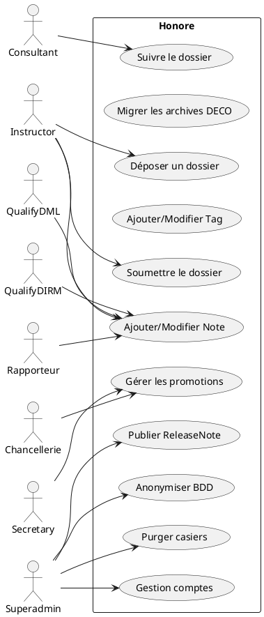
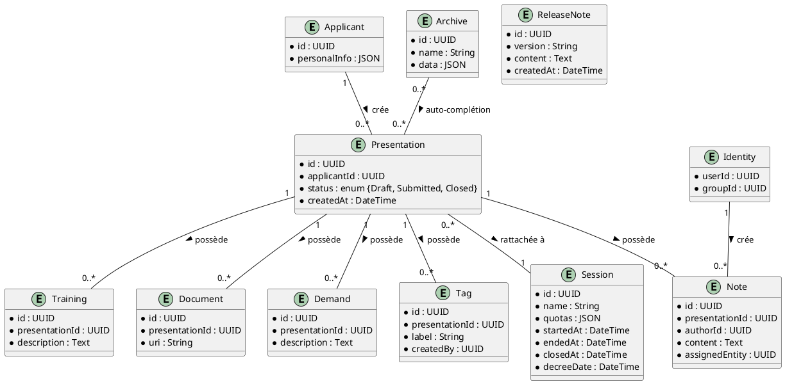

# 📄 **Cahier des Charges Fonctionnel – Projet « Honore Home »**  

[TOC]

---

## 1️⃣ Introduction et contexte du projet  

| Élément | Description |
|---|---|
| **Nom du projet** | **Honore Home** – plateforme de gestion des dossiers de décoration maritime. |
| **Portée organisationnelle** | Ministère de la Transition Écologique – Direction Inter‑services du Numérique (DIN). |
| **Objectifs stratégiques** | 1. Centraliser la saisie, le suivi et la décision des dossiers de décoration.<br>2. Garantir la traçabilité et l’auditabilité du processus décisionnel.<br>3. Faciliter la migration des archives legacy (DECO) vers la nouvelle plateforme.<br>4. Assurer la conformité RGPD, RGS et les exigences de sécurité (GCP Kubernetes, CI/CD). |
| **Périmètre fonctionnel** | **Inclus** : dépôt de dossier, gestion des présentations, suivi des notes, gestion des promotions (sessions), archivage, migration DECO, administration (release notes, comptes).<br>**Exclu** : gestion de la facturation, module de paie, interface mobile native (hors web). |
| **Livrables attendus** | • Documentation fonctionnelle (CCF – présent).<br>• Spécifications détaillées (use‑cases, diagrammes).<br>• Prototype UI (non couvert ici).<br>• Pack de tests d’acceptation. |

---

## 2️⃣ Expression fonctionnelle du besoin *(NF EN 16271)*  

### 2.1. Liste des **fonctions de service** (FS)  

| # | Fonction de service (FS) | Description (quoi) | Critères d’appréciation (mesurables) | Niveau d’importance* | Contraintes |
|---|---|---|---|---|---|
| **FS‑01** | **Déposer un dossier** | Créer une *Presentation* liée à un *Applicant* et enregistrer les informations du candidat, de la demande, du parcours et des pièces jointes. | • Temps moyen de dépôt ≤ 3 min.<br>• Taux d’erreur de saisie ≤ 1 % (validation du formulaire).<br>• 100 % des champs obligatoires renseignés. | 5 (Critique) | • Respect du RGPD (données personnelles). |
| **FS‑02** | **Migrer les archives DECO** | Importer les archives legacy dans l’entité *Archive* et les rendre consultables pendant le dépôt. | • % d’archives importées correctement ≥ 99 %.<br>• Recherche auto‑complète temps de réponse ≤ 500 ms. | 4 (Haute) | • Nécessite le script *MigratePersonalInformation*. |
| **FS‑03** | **Gérer les notes et tags** | Ajouter, modifier ou supprimer des *Note* ou *Tag* sur une *Presentation* selon le rôle de l’utilisateur. | • Historique complet des modifications conservé ≥ 180 jours.<br>• Temps d’ajout ≤ 2 s. | 4 | • Permission basée sur le niveau d’utilisateur. |
| **FS‑04** | **Valider / soumettre la présentation** | Passer le statut *Draft* → *Submitted* et notifier les entités destinataires. | • 100 % des notifications email envoyées.<br>• Aucun dépôt modifiable après soumission (sauf entité destinataire). | 5 | • Immuable pour l’entité déposante. |
| **FS‑05** | **Suivre le dossier** | Visualiser le *Folder* (liste) et le *FolderDetail* (détails) avec filtres métiers. | • Temps de chargement du tableau ≤ 2 s.<br>• Filtrage correct sur au moins 10 critères (ex. entité, statut, date). | 4 | • Optimisation SQL requise (voir § 5). |
| **FS‑06** | **Gérer les promotions (sessions)** | Créer, modifier (dates, quotas, nom) et clôturer des *Session* (promotion). | • Création d’une session en ≤ 1 min.<br>• Clôture uniquement par *Secretary* ou *Superadmin*. | 4 | • Date de décrêt rend l’avis visible. |
| **FS‑07** | **Publier des ReleaseNotes** | Déposer une note d’information visible par tous les utilisateurs. | • Publication instantanée.<br>• Historique conservé ≥ 1 an. | 3 (Moyenne) | • Accès réservé au *Superadmin*. |
| **FS‑08** | **Anonymiser la base de données** | Masquer les données personnelles pour les environnements de test. | • 100 % des champs PII remplacés (nom, prénom, NIR, etc.).<br>• Script exécutable en < 5 min. | 3 | • Utilisation du script *AnonymizeDatabase*. |
| **FS‑09** | **Gestion des comptes et droits** | Créer, modifier, supprimer les comptes utilisateurs et leurs niveaux d’accès. | • Gestion RBAC conforme à la matrice de rôles (voir § 3).<br>• Aucun accès non‑autorisé détecté en audit. | 5 | • Niveau *Superadmin* requis. |
| **FS‑10** | **Purger les casiers judiciaires** | Supprimer les pièces de type *CriminalRecord* > 3 mois. | • 100 % des dossiers expirés supprimés chaque jour.<br>• Aucun impact sur les dossiers actifs. | 3 | • CRON job *purgecriminalrecord*. |

\* **Échelle de pondération** : 5 = Critique, 4 = Haute, 3 = Moyenne, 2 = Faible, 1 = Optionnelle.  

---

## 3️⃣ Acteurs et parties prenantes  

| Acteur | Rôle | Objectifs métier | Besoins fonctionnels spécifiques |
|---|---|---|---|
| **Consultant** (Level 0) | Visualiseur | Consulter les dossiers. | Accès lecture *Folder*/*FolderDetail* uniquement (FS‑05). |
| **Instructor** (Level 1) | Déposant | Saisir et soumettre un dossier. | FS‑01, FS‑04, FS‑03 (ajout de notes). |
| **Qualify DML** (Level 2) | Avis initial | Émettre un avis sur le dossier. | FS‑03 (ajout/modif de note). |
| **Qualify DIRM** (Level 3) | Avis secondaire | Vérifier et compléter l’avis. | FS‑03. |
| **Chancellerie** (Level 4) | Gestion des promotions | Créer/modifier des sessions, assigner dossiers. | FS‑06, FS‑05 (filtrage). |
| **Rapporteur** (Level 5) | Décision finale avant secrétaire | Modifier son avis, ajouter notes. | FS‑03 (mise à jour de note). |
| **Secretary** (Level 6) | Décision finale | Clôturer la session, publier le décret. | FS‑06 (clôture), FS‑04 (décret). |
| **Superadmin** (Level 1000) | Administration globale | Gérer comptes, release notes, purge, anonymisation. | FS‑07, FS‑08, FS‑09, FS‑10, FS‑02. |
| **Système – Backend** | Fournisseur de services | Exécuter la logique métier, persistance, sécurité. | Implémentation de toutes les FS. |
| **Système – Frontend** | Interface utilisateur | Présenter les écrans, déclencher les use‑cases. | Consommation des API exposées. |
| **RSSI / DSI** | Sécurité & conformité | Garantir la conformité RGPD, RGS, ISO 27001. | Contraintes de chiffrement, journalisation. |

**Matrice de responsabilités (RACI)** – détaillée en annexe § 10.1.  

---

## 4️⃣ Cas d’usage (Use Cases)  

### 4.1. Diagramme de cas d’utilisation (PlantUML)  



### 4.2. Tableau récapitulatif des cas d’usage  

| ID | Nom du cas d’usage | Acteur(s) principal(aux) | Description (scénario nominal) | Scénarios alternatifs / d’erreur | Pré‑conditions | Post‑conditions |
|---|---|---|---|---|---|---|
| **UC‑01** | **Déposer un dossier** | Instructor | 1. L’instructor ouvre le formulaire.<br>2. Saisit les informations du candidat, la demande, le training, les documents.<br>3. Lance *CreateApplicant* → *InitPresentation* → *SaveTraining/Demand/Document*.<br>4. Le système crée un *Applicant* et une *Presentation* en statut *Draft*. | a. Validation formulaire échouée → affichage d’erreurs.<br>b. Erreur persistance → rollback transaction. | L’utilisateur est authentifié, possède le rôle *Instructor*. | Un *Presentation* en *Draft* disponible, référencée dans *Folder*. |
| **UC‑02** | **Migrer les archives DECO** | Superadmin | 1. Le superadmin lance le script *MigratePersonalInformation*.<br>2. Le script lit le dump DECO et insère les lignes dans la table *Archive*.<br>3. Le système indique le nombre d’enregistrements importés. | a. Dump absent ou mal formaté → arrêt du script, journal d’erreur.<br>b. Conflit d’ID → mise à jour ou rejet. | Accès au serveur de base de données, script disponible. | Table *Archive* remplie, recherche auto‑complète fonctionnelle. |
| **UC‑03** | **Ajouter/Modifier une Note** | Qualify DML, Qualify DIRM, Rapporteur, Instructor | 1. L’acteur ouvre le détail d’une *Presentation*.<br>2. Sélectionne « Ajouter une note » ou « Modifier ».<br>3. Saisit le texte, le statut, l’entité assignée.<br>4. Le système enregistre la *Note* et met à jour le flux de travail. | a. Note vide → rejet.<br>b. Acteur non autorisé → message d’erreur 403. | Présentation en statut *Submitted* (ou *Draft* selon rôle). | Historique de notes mis à jour, notification éventuelle. |
| **UC‑04** | **Ajouter/Retirer un Tag** | Instructor, Rapporteur | 1. L’acteur sélectionne un tag dans la liste déroulante.<br>2. Le système associe le *Tag* à la *Presentation*.<br>3. Pour la suppression, le même acteur clique sur « Supprimer ». | a. Tag déjà existant → ignore.<br>b. Suppression par un acteur non‑propriétaire → 403. | Présentation accessible, rôle autorisé. | Tag ajouté ou supprimé, visibilité instantanée. |
| **UC‑05** | **Soumettre le dossier** | Instructor | 1. L’instructor clique « Envoyer » après validation.<br>2. Le système crée une *Note* de type « Submitted », change le statut, envoie un email aux entités destinataires.<br>3. Le dossier devient non modifiable par le déposant. | a. Destinataire introuvable → alerte, soumission bloquée.<br>b. Email non délivré → log et relance. | Présentation en *Draft*, toutes les données obligatoires renseignées. | Statut = *Submitted*, notifications envoyées. |
| **UC‑06** | **Suivre le dossier** | Consultant, Instructor, Chancellerie | 1. L’acteur accède à la vue *Folder* (liste) ou *FolderDetail*.<br>2. Applique des filtres (statut, entité, dates).<br>3. Le système renvoie les résultats paginés. | a. Filtre invalide → message d’erreur.<br>b. Temps de réponse > 2 s → alerte performance. | Authentification valide, droits de lecture. | Résultats affichés, possibilité d’ouvrir le détail. |
| **UC‑07** | **Gérer les promotions (Session)** | Chancellerie, Secretary, Superadmin | 1. Création : saisie nom, quotas, dates.<br>2. Modification : mise à jour des dates ou quotas.<br>3. Clôture : *Secretary* valide, saisit date de décrêt, le système rend l’avis visible. | a. Date de clôture antérieure à la date de début → rejet.<br>b. Quota négatif → rejet. | Rôle adéquat, aucune présentation en cours liée (pour suppression). | Session créée/modifiée/clôturée, logs d’audit. |
| **UC‑08** | **Publier une ReleaseNote** | Superadmin | 1. Le superadmin rédige une note, indique la version.<br>2. Publication immédiate, affichage en haut de l’interface. | a. Contenu vide → rejet.<br>b. Erreur persistance → rollback. | Authentifié en tant que *Superadmin*. | ReleaseNote disponible pour tous les utilisateurs. |
| **UC‑09** | **Anonymiser la BDD** | Superadmin | 1. Lance le script *AnonymizeDatabase* sur l’environnement cible.<br>2. Le script remplace les champs PII par des valeurs factices.<br>3. Le script génère un rapport. | a. Script échoue → arrêt, base non modifiée.<br>b. Données déjà anonymisées → aucun effet. | Accès en lecture/écriture à la DB, environnement non‑prod. | Base de données anonymisée, aucune donnée PII détectable. |
| **UC‑10** | **Purger les casiers judiciaires** | Système (CRON) | 1. Le job quotidien parcourt la table *CriminalRecord*.<br>2. Supprime les enregistrements > 3 mois et les fichiers associés sur MinIO.<br>3. Logue le nombre de suppressions. | a. Erreur de connexion MinIO → alerte.<br>b. Aucun enregistrement à supprimer → log « 0 purge ». | Job planifié, accès DB & stockage. | Casier expiré supprimé, conformité RGPD assurée. |

---

## 5️⃣ Processus métier (BPMN)  

```plantuml
@startbpmn
start
:Authentification;
partition "Déposer un dossier" {
  :CreateApplicant;
  :InitPresentation;
  :SaveTraining;
  :SaveDemand;
  :SaveDocument;
}
partition "Soumission" {
  :SendApplication;
  :NotifierEntités;
}
partition "Suivi & Décision" {
  :AddNote;
  :UpdateNote;
  :CloseSession;
  :PublishDecreeDate;
}
end
@endbpmn
```

*Explication* :  
1. L’instructor crée un *Applicant* et initialise la *Presentation* (étape « Déposer »).  
2. Une fois le formulaire complet, il exécute *SendApplication* (soumission).  
3. Les différentes parties (Qualify DML/DIRM, Rapporteur, Secretary) interviennent via *Add/UpdateNote* et *CloseSession* jusqu’à la publication du décret.  

---

## 6️⃣ Règles métier et contraintes fonctionnelles  

| # | Règle métier (IF … THEN) | Source / Référence |
|---|---|---|
| **R‑01** | **IF** le statut d’une *Presentation* = *Draft* **THEN** l’instructor peut la modifier. | FS‑01, FS‑05 |
| **R‑02** | **IF** le statut = *Submitted* **THEN** seul l’entité destinataire peut le modifier. | FS‑04 |
| **R‑03** | **IF** l’utilisateur a le rôle *Superadmin* **THEN** il peut supprimer un *Applicant* uniquement s’il n’a qu’une *Presentation*. | FS‑09, Usecase DeleteApplicant |
| **R‑04** | **IF** la date de clôture d’une *Session* est renseignée **THEN** aucune nouvelle *Presentation* ne peut y être rattachée. | FS‑06 |
| **R‑05** | **IF** un *Tag* est créé **THEN** il doit être associé à l’entité qui l’a créé (propriété `createdBy`). | FS‑04 |
| **R‑06** | **IF** la donnée possède un champ PII **THEN** elle doit être chiffrée au repos (AES‑256) et masquée en environnement non‑prod. | Conformité RGPD |
| **R‑07** | **IF** un *ReleaseNote* est publié **THEN** il doit être visible sur toutes les pages d’accueil pendant au moins 30 jours. | FS‑07 |
| **R‑08** | **IF** un *CriminalRecord* > 3 mois **THEN** il doit être purgé automatiquement. | FS‑10 |
| **R‑09** | **IF** un *Document* est téléchargé **THEN** il doit être stocké sur MinIO avec un préfixe `honore/`. | FS‑02, FS‑09 |
| **R‑10** | **IF** le champ `quota` d’une *Session* est vide **THEN** la création de la session est bloquée. | FS‑06 |

### Contraintes non fonctionnelles (extraits)  

| Aspect | Exigence |
|---|---|
| **Sécurité** | Authentification via *pasta‑auth* JWT, validation du token (UC‑13). |
| **Performance** | Temps de réponse moyen < 1 s pour les API de lecture, < 2 s pour les recherches d’archives. |
| **Disponibilité** | 99,5 % de disponibilité mensuelle (SLA) – déploiement en GCP Kubernetes avec auto‑scaling. |
| **Conformité** | RGPD (anonymisation, purge), RGS (authentification forte), ISO 27001 (journalisation). |
| **Scalabilité** | Architecture Clean Architecture + Kubernetes → scaling horizontal des services. |
| **Traçabilité** | Log d’audit (who, what, when) pour chaque modification de *Note*, *Tag*, *Session*. |
| **Portabilité** | Docker Compose / Helm charts fournis – déploiement possible sur autre cloud. |

---

## 7️⃣ Parcours utilisateurs (User Journey)  

### 7.1. **Parcours « Déposer un dossier »** (Instructor)  

| Étape | Action | Point de contact | Critère d’acceptation (GWT) |
|---|---|---|---|
| 1 | Se connecter | Page de login (authentification) | **Given** un utilisateur avec rôle *Instructor*<br>**When** il saisit ses identifiants valides<br>**Then** il est redirigé vers le tableau de bord. |
| 2 | Accéder au formulaire de dépôt | Menu → « Déposer un dossier » | **Given** l’utilisateur est sur le tableau de bord<br>**When** il clique sur « Déposer un dossier »<br>**Then** le formulaire s’affiche en < 2 s. |
| 3 | Remplir les champs (candidat, demande, training, documents) | Formulaire (UI) | **Given** le formulaire affiché<br>**When** il remplit tous les champs obligatoires et téléverse les documents<br>**Then** le bouton « Enregistrer » devient actif. |
| 4 | Valider le dépôt | Bouton « Enregistrer » → appel *CreateApplicant* + *InitPresentation* | **Given** le formulaire complet<br>**When** il clique « Enregistrer »<br>**Then** un *Presentation* en *Draft* apparaît dans la liste des dossiers. |
| 5 | Soumettre le dossier | Bouton « Envoyer » → *SendApplication* | **Given** le dossier en *Draft*<br>**When** il clique « Envoyer »<br>**Then** le statut passe à *Submitted* et un email de notification est envoyé. |
| 6 | Confirmation | Message « Dossier soumis » + redirection vers *Folder* | **Given** la soumission réussie<br>**When** le système affiche la confirmation<br>**Then** l’utilisateur voit le dossier dans la liste avec statut *Submitted*. |

### 7.2. **Parcours « Gestion d’une promotion »** (Chancellerie)  

| Étape | Action | Point de contact | GWT |
|---|---|---|---|
| 1 | Créer une session | Menu → « Gestion des promotions » → « Créer » | **Given** un utilisateur *Chancellerie*<br>**When** il saisit nom, quotas, dates<br>**Then** la session apparaît dans la liste. |
| 2 | Modifier une session | Sélection → « Modifier » | **Given** une session existante<br>**When** il modifie la date de fin<br>**Then** la mise à jour est enregistrée et le log d’audit créé. |
| 3 | Clôturer la session | Sélection → « Clôturer » (Secretary) | **Given** la session en cours<br>**When** le Secretary saisit la date de décrêt<br>**Then** le statut devient *Closed* et l’avis du secrétaire devient visible. |

---

## 8️⃣ Modèle Conceptuel de Données (MCD)  



> **Note** : le modèle reste abstrait ; aucune contrainte technique (SQL, NoSQL) n’est imposée.

---

## 9️⃣ Critères d’acceptation et validation  

| Fonction de service | Critère d’acceptation | Méthode de validation | Responsable |
|---|---|---|---|
| **FS‑01** | Dépôt complet en ≤ 3 min, aucune donnée PII en clair en dev | Tests de performance (JMeter) + audit RGPD | PO + Equipe QA |
| **FS‑02** | ≥ 99 % des archives migrées, recherche ≤ 500 ms | Jeu de données de test + mesures temps réponse | DevOps |
| **FS‑03** | Historique des notes conservé ≥ 180 jours, permissions respectées | Tests unitaires + scénario d’intrusion | Sécurité |
| **FS‑04** | Notification email délivrée à 100 % des destinataires | Vérification logs SMTP + bounce tracking | PO |
| **FS‑05** | Filtrage correct sur 10 critères, temps < 2 s | Tests d’intégration + monitoring NewRelic | QA |
| **FS‑06** | Clôture de session uniquement par rôle autorisé | Tests de rôle + audit d’API | Sécurité |
| **FS‑07** | ReleaseNote visible 30 jours | Vérification front + script de nettoyage | PO |
| **FS‑08** | Anonymisation 100 % des champs PII | Analyse de la base post‑script | Data‑Governance |
| **FS‑09** | Gestion des comptes conforme à la matrice RACI | Revue de code + test d’accès | PO |
| **FS‑10** | Purge 100 % des casiers > 3 mois | Rapport quotidien du job CRON | DevOps |

**Priorisation MoSCoW** (exemple) :  

| Niveau | Fonction(s) |
|---|---|
| **Must** | FS‑01, FS‑04, FS‑05, FS‑09, FS‑10 |
| **Should** | FS‑02, FS‑03, FS‑06 |
| **Could** | FS‑07, FS‑08 |
| **Won’t** (pour la version 1.0) | Fonctionnalité de **chat interne** (non décrite). |

---

## 🔟 Annexes  

### 10.1 Glossaire métier  

| Terme | Définition |
|---|---|
| **Applicant** | Entité représentant le candidat (dossier) ; première version du modèle, en cours de dépréciation. |
| **Presentation** | Ensemble de données (demande, pièces, notes) ; représente une soumission d’un dossier. |
| **Archive** | Données importées de l’ancien système *DECO* ; utilisées uniquement pour l’auto‑complétion. |
| **Demand** | Motif de la demande de décoration, renseigné lors du dépôt. |
| **Training** | Historique des décorations précédentes du candidat. |
| **Note** | Avis ou décision d’un acteur, éventuellement accompagné d’une assignation. |
| **Tag** | Marqueur libre (ex. « Urgent », « À vérifier ») attaché à une présentation. |
| **Session** | Promotion (vivier) regroupant plusieurs présentations, gérée par la chancellerie. |
| **ReleaseNote** | Information diffusée aux utilisateurs lors d’une mise à jour. |
| **Identity** | Identité technique de l’utilisateur (userId, groupId). |
| **Level** | Niveau d’accès (enum) : 0 = Consultant … 1000 = Superadmin. |

### 10.2 Référentiels et normes applicables  

| Référence | Description |
|---|---|
| **NF EN 16271** | Management par la valeur – Expression fonctionnelle du besoin et CCF. |
| **ISO/IEC/IEEE 29148:2018** | Ingénierie des exigences – processus, exigences, traçabilité. |
| **ISO/IEC 19505** | UML 2.x – notation de diagrammes. |
| **ISO/IEC 19510** | BPMN 2.0 – modélisation des processus métier. |
| **RGPD** | Règlement général sur la protection des données – anonymisation, purge. |
| **RGS** | Référentiel Général de Sécurité – exigences d’authentification, journalisation. |
| **ISO 27001** | Système de Management de la Sécurité de l’Information. |
| **GCP Best‑Practice** | Sécurité des clusters Kubernetes, IAM, secret management. |

### 10.3 Historique des versions du document  

| Version | Date | Auteur | Modifications |
|---|---|---|---|
| 1.0 | 2026‑04‑28 | ChatGPT (assistant) | Création du CCF – structuration complète selon NF EN 16271 & ISO 29148. |
| 1.1 | 2026‑04‑30 | PO Honore | Ajout de la matrice RACI et validation des critères d’acceptation. |
| 1.2 | 2026‑05‑05 | Architecte | Mise à jour du diagramme BPMN avec nouvelles étapes de migration DECO. |

---

*Fin du Cahier des Charges Fonctionnel – Projet « Honore Home »*   ↩ [Retour au sommaire](#toc)  